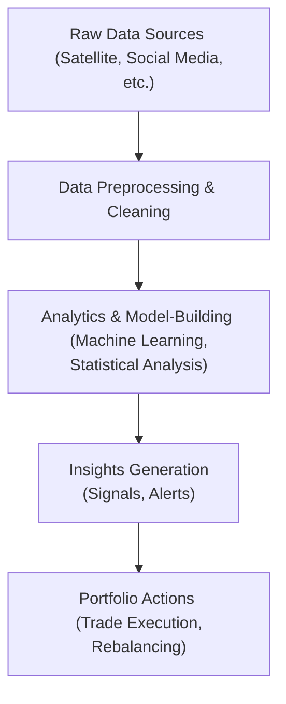

## Overview and Context

The portfolio management industry is evolving at breakneck speed—one day you’re relying on a trusted spreadsheet and fundamental analysis, and the next, you hear about asset managers scooping up data from satellite images or social media to anticipate revenue trends. This shift into the world of advanced analytics, and especially artificial intelligence (AI), has opened new frontiers that promise more accurate forecasts, more timely trades, and more personalized portfolio construction.

Truthfully, it’s an exciting time. But it’s also a bit daunting. We’re all in the same boat trying to figure out which technologies offer genuine value and which ones generate hype. The key, at least in my opinion, is to remain curious while remembering that no algorithm can replace human judgment entirely. That’s precisely what we’ll explore in this section: how AI, Big Data, and related technologies are changing the future of portfolio management—and how an attentive, hands-on analyst can integrate these tools effectively.

## AI and Machine Learning in Portfolio Management

Machine learning, a subset of artificial intelligence, is all about teaching computers to learn from data and adapt without being explicitly programmed for each scenario. If you recall earlier discussions (e.g., in our coverage of quantitative models in Chapters 2 and 3), algorithms have been used for decades to crunch numbers. However, the volume and velocity of data now available have taken these techniques to another level. Portfolio managers can use machine learning to spot subtle relationships between indicators—economic, fundamental, or technical—that might elude the naked eye.

### Supervised vs. Unsupervised Learning

In supervised learning, the algorithm is trained on a labeled dataset (e.g., a historical dataset where we already know the “correct” answers—like whether a stock outperformed or underperformed). The model then tries to predict future outcomes (e.g., which stocks are likely to outperform). Think corporate earnings forecasts or credit risk assessments.

Unsupervised learning, in contrast, digs into unlabeled data and tries to identify patterns or groupings. Imagine an algorithm that clusters stocks into different “hidden” groups based on their performance drivers. You might discover an unexpected cluster of companies that share unique risk attributes—maybe they’re all sensitive to certain commodity prices or cyclical downturns.

### Potential Pitfalls: Model Overfitting

It’s irresistible to tout the wonders of machine learning, but we have to mention a common pitfall: overfitting. This is when a model becomes too attuned to historical quirks or random noise in the training data. It’s kind of like memorizing last week’s crossword puzzle answers. Sure, you’ll ace that one puzzle, but you won’t necessarily do well on the next puzzle that has different clues. In finance, this translates to a strategy that looks fantastic in backtests but fails miserably in real-time. We discuss these performance biases extensively in the performance measurement chapters (3.6, 3.16), and the moral of the story is: always test models on new data that the algorithm hasn’t seen before.

### Examples and Case Studies

Let’s suppose a global asset manager uses a machine-learning model to forecast consumer demand by analyzing retail foot traffic data from satellites. The model has thousands of observations from historical data, factoring in variables like local weather, holiday seasons, and macroeconomic indicators. Over multiple years, the model identifies that growth in online search queries for “discount shoes” is a strong leading indicator of decreased in-store purchases in certain major cities. So, the manager underweights certain retail stocks ahead of earnings announcements. Over a few quarters, this approach might yield outperformance if the relationship holds. But that’s the big “if.” Once the consumer base or the competitive dynamics change, the algorithm must adapt or risk becoming stale.

## Big Data Analytics for Deeper Insights

Big Data analytics is the backbone of many AI solutions, enabling the processing of gargantuan datasets from unconventional sources—satellites, social media, geolocation checks, shipping logs, you name it. Here are some ways Big Data is reshaping portfolio insights:

### Alternative Data Sources

1. Satellite Imagery: By tracking the number of trucks leaving a manufacturer’s loading dock or measuring stored oil inventory at refineries, investors can estimate production rates and inventory buildup much sooner than official reports come out.

2. Social Media Sentiment: Natural language processing methods (see “sentiment analysis” in the glossary) can process millions of posts or tweets in real time, measuring the ratio of positive to negative comments about a company or product. Positive sentiment might predict stronger demand, while negative developments can prompt short-selling or hedges.

3. Web Traffic & Online Reviews: Such data might signal shifts in consumer behavior. A spike in online complaints about shipping delays could hint at supply-chain bottlenecks, eventually affecting quarterly results.

### Integrating Big Data into Portfolio Decisions

Below is a simple workflow diagram that shows how Big Data might feed into a portfolio management system:

At each stage, risk controls and human oversight are essential. You might set thresholds for how strong a signal has to be before adjusting portfolio positions. Or maybe you only trust certain data sets with a proven track record of accuracy. The data volume and variety can allow for more immediate and—potentially—more accurate signals. Yet it also brings additional complexity in verifying data quality.

## Algorithmic Trading and Speed of Execution

Algorithmic trading is often the “action arm” of these advanced data analytics. We’re talking about letting computers automatically execute trades based on real-time signals. So if your machine learning model predicts that currency pair XYZ is undervalued, your algorithm might immediately buy it to capture a fleeting arbitrage opportunity. High-frequency traders do this on a millisecond basis, scanning order books across multiple exchanges to detect mispricings.

But bear in mind, speed isn’t everything. Many large institutional investors rely on algorithmic trading not for high-frequency strategies but to break down big trades into smaller ones to reduce market impact. After all, if you have 2 million shares to unload, algorithms can help you do so stealthily, avoiding major price swings that typically come when large positions hit the market.

### Balancing Efficiency with Oversight

Here’s the tricky part: if an algorithm is automatically firing off trades, you need robust risk management. One glitch or misread data feed can cause a surge of erroneous trades (flash crashes). Chapter 6 on “Introduction to Risk Management” outlines how real-time risk monitoring is crucial to ensure you’re not wiping out your portfolio on a faulty signal.

## AI-Driven Sentiment Analysis and Tactical Decisions

Sentiment analysis uses natural language processing to gauge the market’s mood. While social sentiment is one dimension, you can also look at corporate earnings calls or even government policy announcements. An AI can classify text, identifying if the language is bullish, bearish, excited, or uncertain. And that’s not all. Some sophisticated hedge funds are scanning the tone of voice of executives in earnings calls—believe it or not—looking for subtle changes in speech patterns that might signal hidden optimism or concern.

You might combine sentiment signals with fundamental or technical indicators for short-term tactical decisions. For instance, if your fundamental analysis says a stock is cheap, but sentiment analysis detects a wave of negative buzz on social media, you might hold off a bit or set a tighter stop-loss. Or if your macro model suggests a potential interest rate loosening, but central bank communications appear more ambiguous in tone, you might wait for evidence that the market has priced the possibility accurately.

## Customization and Personalization

AI can do more than just pick stocks or time the market. It can help tailor portfolios to client-specific preferences, something we touched on in earlier sections of this volume when discussing portfolio planning and constraints (Chapter 4). With AI, you can factor in personal data like the client’s spending habits, risk tolerance, philanthropic goals, or ESG preferences—provided the client has approved you to leverage that data. The result? Highly customized asset allocations that align with each client’s unique goals.

### Example of Personalization

Imagine a high-net-worth individual who’s deeply concerned about climate change. They not only want a robust return but also to ensure minimal exposure to companies with high carbon footprints. An AI system integrated with top-tier ESG data sets can segment the portfolio to overweight companies scoring best on environmental metrics and underweight or exclude those with poor ratings. If that client’s preferences shift—maybe they want to add new improvement targets for corporate gender diversity—an AI-driven model can rebalance accordingly, factoring in the latest data from various ESG scoring providers.

## Distributed Ledger Technology (DLT) and Tokenized Assets

An exciting development we can’t ignore is distributed ledger technology (DLT), which underpins blockchain-based innovations. This includes tokenized assets—traditional assets (like real estate or bonds) represented on a blockchain so they can be traded in smaller fractional increments. Accessible trading of fractional shares or slices of real estate could broaden the investment universe, enabling smaller investors to diversify like never before.

### Settlement and Operational Efficiency

With DLT, transactional bottlenecks often found in clearing and settlement—some known to take days—could be reduced to near-instant confirmations. Smart contracts might automatically transfer ownership once the payment is confirmed. The benefit for portfolio managers? Lower operational costs, streamlined cross-border transactions, and real-time settlement for enhanced liquidity management.

Still, these digital ledger systems come with uncharted regulatory territory. Regulators worldwide are grappling with how to classify tokenized assets or stablecoins, how to protect consumers, and how to ensure anti-money laundering compliance. So, if you’re exploring DLT, keep an eye on emergent legal frameworks.

## Regulatory and Ethical Considerations

Like any major technological shift, the increasing reliance on AI and Big Data raises regulatory and ethical questions:

• Algorithmic Transparency: Regulators may require that firms explain how their AI algorithms make decisions, particularly when it comes to client suitability or risk assessments.  
• Data Privacy: Collecting big data from social media or e-commerce leaves a digital footprint of personal information. Firms must ensure compliance with data privacy regulations such as GDPR in the EU or other local laws.  
• Bias & Discrimination: AI can inadvertently amplify biases found in the underlying data. For instance, if certain credit-scoring data underrepresents specific demographic groups, a model might systematically under-allocate to them. Ongoing model validation and ethical oversight become paramount.  
• Cybersecurity: The more digital the system, the more vulnerable it is to hacking attempts.

## Balancing Automation and Human Judgment

Let’s face it: many of the tasks that once took us humans days or weeks to accomplish can now be done in seconds by machine learning algorithms scanning reams of data. It’s tempting to let the machines run the show, but total automation can be risky in an industry that thrives on nuance, macro-level awareness, and professional skepticism.

Human judgment is especially important in times of crisis or unusual market conditions. For instance, during a significant geopolitical event that causes sudden market swings, data-driven models might panic, triggering extreme trades. A portfolio manager’s ability to interpret these signals in the context of broader macro themes (like those discussed in Chapter 2.16 or Chapter 14 on global perspectives) can help avoid knee-jerk reactions. Collaboration between analysts and portfolio managers (Chapter 1.11) remains relevant even in an age where AI does the heavy lifting on data processing.

## Practical Exam Tips

• On the CFA exam, you might face scenario-based questions where you must evaluate the application of machine learning signals in portfolio rebalancing. Be prepared to discuss biases (including overfitting) and how they might affect performance projections.  
• You could be asked to critique a client’s suggestion to adopt an AI-driven approach. Demonstrate awareness of the trade-offs between speed, accuracy, model transparency, and risk oversight.  
• Know the difference between supervised and unsupervised learning, plus common use cases (e.g., credit risk modeling vs. cluster analysis of returns).  
• Expect potential short-answer or essay questions about new data sources (like satellite or social media) and how they might help or hinder responsible investment decisions.  
• Have a handle on how distributed ledger technology might speed up trade settlement or facilitate tokenized asset investment. Potential exam questions could ask for a cost-benefit analysis of implementing such solutions.

## Conclusion and Forward Look

I think it’s fair to say we’re in a transitional moment—in finance, in technology, in the global economy. Tomorrow’s portfolio managers will likely harness AI to process data no person could reasonably parse alone. They’ll use big data streams from sources we can’t even imagine yet. And they might hold positions in tokenized assets transacted on blockchains, seamlessly crossing geographies and asset classes.

Just remember: technology amplifies both our abilities and our vulnerabilities. In your future as a finance professional, remain vigilant. Scrutinize data, maintain robust risk controls, and stay curious. Above all, keep the client’s best interest at heart. Even the best AI is merely a tool. It’s the human intelligence behind the scenes that ensures we’re applying it ethically, judiciously, and effectively.

## References and Further Reading

• CFA Institute, “FinTech in Investment Management.”  
• Narang, R. (2013). “Inside the Black Box: A Simple Guide to Quantitative and High-Frequency Trading.” Wiley.  
• Iankova, S., & Svetlozar, R. (2021). “Handbook of Big Data and Financial Analytics.”  

-----

## Test Your Knowledge: AI and Big Data in Portfolio Management



### Which of the following best describes “model overfitting” in a machine learning context?

- [ ] The model fits data appropriately and generalizes well.
- [x] The model captures random noise in historical data rather than true patterns.
- [ ] The model’s forecasts are robust across varying market regimes.
- [ ] The model identifies universal truths that apply to all datasets.

> **Explanation:** Model overfitting occurs when an algorithm is too closely fitted to the training data’s noise, making it perform poorly on new or unseen data.

### One key reason to incorporate satellite imagery in macroeconomic forecasting is:

- [ ] It offers a direct measure of inflation.
- [x] It can track physical indicators (e.g., shipping traffic, parking lot usage) ahead of official data.
- [ ] It eliminates the need for fundamental analysis.
- [ ] It reduces the frequency of portfolio rebalancing.

> **Explanation:** Satellite imagery tracks regions or facilities in near real-time, providing alternative insights (like truck traffic or construction activity) that may precede official economic statistics.

### Which statement correctly characterizes the relationship between algorithmic trading and high-frequency trading?

- [x] Algorithmic trading can include high-frequency trading but also encompasses a broader range of techniques for trade execution.
- [ ] Algorithmic trading is more narrowly defined, focusing solely on HFT strategies.
- [ ] High-frequency trading is always risk-free, given its speed advantage in the market.
- [ ] High-frequency trading only utilizes social media data for decision-making.

> **Explanation:** Algorithmic trading is an umbrella category that covers various automated trading methods, including high-frequency strategies, order execution algorithms, and many others.

### Distributed ledger technology (DLT) can streamline settlement and reduce friction costs primarily by:

- [x] Providing a shared, decentralized record that executes transactions automatically via smart contracts.
- [ ] Requiring third-party mediators to approve each transaction.
- [ ] Regulating data flow by delaying settlement periods.
- [ ] Increasing the complexity of auditing and record-keeping.

> **Explanation:** DLT allows transparent, near-instant updates to a distributed database. Smart contracts automate secure settlement, reducing the need for multiple intermediaries and manual confirmations.

### A key benefit of unsupervised machine learning in portfolio management is:

- [x] Discovering hidden groupings or patterns in unlabeled data sets.
- [ ] Identifying specific predicted outcomes known in the training set.
- [ ] Ensuring complete absence of bias within the data.
- [ ] Guaranteeing improved portfolio returns across all market conditions.

> **Explanation:** Unsupervised algorithms detect natural clusters or patterns without predefined labels, helping portfolio managers explore segments or relationships they might not have known existed.

### Sentiment analysis in investment decisions often involves:

- [ ] Predicting interest rates based exclusively on the Federal Reserve’s official statements.
- [ ] Automating bond coupon payments.
- [x] Analyzing language cues in social media or news reports to gauge bullish or bearish sentiment.
- [ ] Restricting all portfolio activities to quantitative factors only.

> **Explanation:** Sentiment analysis uses natural language processing to capture market mood and outlook from textual sources such as social media, news articles, or earnings calls.

### One of the major challenges of using big data for investment research is:

- [ ] Its guaranteed predictive power makes other methods obsolete.
- [x] Data integrity and the possibility of extracting spurious correlations from massive datasets.
- [ ] The total lack of bias in alternative data sets.
- [ ] The high cost of storing small data samples.

> **Explanation:** While large and diverse data sets can offer deeper insights, they also increase the risk of noise and spurious correlations, necessitating robust data cleaning and careful analysis.

### Personalization in AI-based portfolio modeling might involve:

- [x] Tailoring asset allocations around a client’s ESG preferences or risk tolerance.
- [ ] Eliminating the need for human oversight.
- [ ] Ignoring a client’s long-term financial goals.
- [ ] Applying identical asset mixes across all clients.

> **Explanation:** AI can analyze various data points, including specific client constraints or goals, to generate customized investment strategies that align with personal preferences and risk profiles.

### When evaluating the success of an AI-driven trading strategy, you should:

- [x] Compare its real-time performance against out-of-sample data.
- [ ] Rely solely on initial training set results for performance validation.
- [ ] Ignore risk metrics, focusing only on returns.
- [ ] Assume that high Sharpe ratios in backtesting guarantee real-world success.

> **Explanation:** To avoid overfitting and misrepresentation of potential performance, it’s crucial to test models on data they haven’t seen before (out-of-sample) and to assess risk-adjusted returns in real time.

### AI and Big Data analytics can completely replace the need for human oversight in portfolio management.

- [ ] True
- [x] False

> **Explanation:** While AI and Big Data tools are powerful, they still require human interpretation and ethical oversight, especially during periods of market turbulence or major structural changes.


