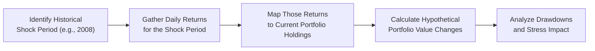
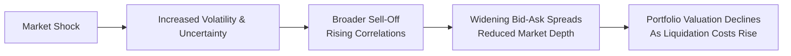

## Introduction
Real-world portfolio simulations, especially those focusing on extreme stress situations, help managers see how their investment strategies might perform when market conditions become highly volatile or downright chaotic. In my early days working on a trading desk (ah, I still recall the adrenaline-fueled mornings!), we often ran backtests using serene market data. But then came real turbulence—as you might guess, the outcomes didn’t always match our perfect analyses. That’s why stress tests and simulations, with a healthy dose of skepticism about “normal” markets, are such invaluable tools in portfolio management.

In this section, we dive deep into conducting portfolio simulations that replicate turmoil similar to the 2008 financial crisis or other black swan events. We’ll highlight: how to set up these simulations, which data inputs to use, how to interpret the results, and what steps to take to keep clients informed about the risks when the market shows signs of distress. By the end, you’ll be equipped with practical frameworks and a deeper understanding of how to integrate both quantitative analysis and seasoned judgment under high-stress conditions.

## Overview of Stress Testing in Portfolio Management
Stress testing is the process of evaluating a portfolio’s resilience under extreme but plausible (sometimes borderline implausible) market circumstances. These circumstances might include sudden interest rate spikes, major geopolitical events, or a rapid breakdown in market liquidity.

When markets are calm, correlation structures and volatilities often appear stable, and it’s tempting to believe that historical patterns will persist forever. However, during true crises, correlations can skyrocket (a phenomenon often referred to as “correlation breakdown” in the sense that historical low correlations suddenly move to nearly 1.0). Stress testing aims to capture those hidden or “tail” risks that remain invisible in normal times.

### Why Perform Real-World Simulations?
• They reveal potential drawdowns: By examining different asset classes under stressful conditions, you can see just how far your portfolio might fall—called a drawdown—before it stabilizes.  
• They challenge normal distribution assumptions: During extreme stress, market returns often exhibit fat-tailed behavior (i.e., large moves occur more frequently than a normal distribution would suggest).  
• They inform better diversification strategies: You might discover that your “diversified” portfolio is not so diversified when correlations increase across the board during a crisis.  
• They provide a basis for improved communication: Clients and stakeholders appreciate a transparent walkthrough of “worst-case” scenarios.  

## Key Building Blocks of a Simulation 
It’s easy to get lost in the complexity of risk modeling. But any robust stress-test framework, in essence, consists of the following steps:

1. Identify plausible yet extreme scenarios, such as a 30% drop in equity markets or a sudden bond yield spike of 200 basis points.  
2. Choose an appropriate simulation method. Historical, hypothetical, or Monte Carlo-based scenario analysis can all be used.  
3. Map the portfolio. Determine how each holding might respond to the defined shock.  
4. Incorporate changes in correlation and volatility. In stress situations, these can shift drastically.  
5. Compute outcomes. Estimate potential drawdowns, changes in portfolio value, liquidity pressures, and any margin or collateral calls.  
6. Document and interpret results. Adjust risk mitigation and rebalancing strategies if the simulated downside is beyond your tolerance threshold.  

## Historical Stress Scenarios
A simple but powerful way to stress test is to replicate periods of historical upheaval, applying their market conditions to your current portfolio. For instance, you can “transport” the daily returns from the 2008 global financial crisis or the 2020 pandemic onset onto your current holdings to estimate hypothetical performance.

• Advantages: Historical data is concrete and widely available. Replaying actual drawdowns offers a sense of realism.  
• Disadvantages: Past events might not replicate future crises, especially if market structures or regulations have since changed.  

Below is a small Mermaid diagram illustrating the concept of “transposing” historical data onto a current portfolio:



## Hypothetical Stress Scenarios
When you suspect that future turmoil might differ from anything seen in recorded history, hypothetical (or forward-looking) scenarios become essential. This approach involves crafting storylines—like an abrupt policy regime shift, a severe cyber-attack on financial infrastructure, or draconian currency controls—and translating them into projected price or interest rate movements.

• Scenario Example: Suppose you’re worried about a major geopolitical shock in an emerging market. You might simulate a 25% overnight currency devaluation, 10% equity index drop, and a credit spread widening of 300 basis points for local bonds.  
• Common Pitfall: Over-optimism in scenario design. If you’re not bold enough in modeling large shocks, you might underestimate the actual risk you’d face.  

## Monte Carlo Simulations with Fat-Tails
Unlike fixed-scenario analysis, Monte Carlo simulations randomly generate thousands of possible outcomes based on specified statistical distributions. We often see normal distributions used, but let’s be honest—markets rarely behave so politely. Fat-tailed distributions (e.g., Student’s t-distribution) are more reflective of the real world, allowing for more frequent extreme moves.

### Practical Python Example (Simplified)
Here’s a quick snippet (though you’ll want more robust code for actual production) demonstrating how one might run a simple Monte Carlo simulation with fat-tailed returns:

```python
import numpy as np
import pandas as pd
from scipy.stats import t

np.random.seed(42)
num_sims = 10_000
nu = 5  # degrees of freedom for t-distribution (indicates fat tails)
mu = 0.0005  # daily average return
sigma = 0.02  # daily volatility

daily_returns = t.rvs(nu, size=num_sims) * sigma + mu

initial_investment = 100_000
port_sim = initial_investment * (1 + daily_returns).cumprod()

max_loss = initial_investment - port_sim.min()
print(f"Max drawdown in this simulation: ${max_loss:,.2f}")
```

As you might guess, you’d typically apply these draws to multiple assets (with correlations accounted for) to reflect portfolio-level outcomes. The main point: controlling for fat tails can reveal a broader range of possible outcomes, including nastier ones, than assumed by normal distributions.

## Correlation Breakdowns and Liquidity Crises
One important phenomenon in crisis conditions is “correlation breakdown.” You may have previously measured that equities and bonds maintain a low correlation. Yet in a severe liquidity crunch, investors might flee both markets equally. As a result, the actual correlation can jump from near zero to close to one, undermining your diversification strategy.

### Liquidity Stress
A liquidity crisis can also magnify price moves: as investors scramble for cash or safe havens, bid-ask spreads widen, and previously “liquid” assets become difficult to sell without massive price concessions. Stress simulations should account for these features, perhaps imposing an extra discount or “haircut” when trying to liquidate a large amount of a given asset.

Consider the approximate timeline for how a liquidity crisis can unfold:



## Combining Quantitative Modeling with Expert Judgment
There’s no substitute for well-designed simulation frameworks, but let’s be real: markets are shaped by human behavior, policy decisions, and strategic motivations that are tough to capture in purely quantitative metrics. That’s why blending advanced software with qualitative insights is vital. For instance, your simulation output might indicate that a portfolio can weather a 15% equity drawdown. Meanwhile, your seasoned colleague might point out that the scenario overlooked a possible global trade spat or a protracted currency crisis. Incorporating this “scenario layering” can produce richer, more holistic stress tests.

## Communicating Simulation Results
Let’s say you’ve gathered compelling evidence that your portfolio is robust against moderate shocks, but you also uncovered vulnerabilities if interest rates spike sharply. How do you explain this to clients?

• Be Transparent: Provide clear, concise visuals (heat maps, drawdown charts) showing how the portfolio might behave.  
• Emphasize Probability vs. Possibility: While it’s impossible to predict precisely when a black swan event occurs, you can underscore the probability ranges gleaned from simulations.  
• Focus on Mitigation Strategies: Outline steps you might take in a crisis: rebalancing, turning to safe havens, employing hedging instruments, or adjusting margin levels.  

## Adjusting the Portfolio Based on Stress Test Insights
You’ve discovered potential cracks in your approach—maybe correlations spike more than anticipated or certain holdings suffer catastrophic drawdowns under stress. Next steps:

1. Boost Diversification: If certain asset classes show strong cyclical co-dependence, you might add uncorrelated alternatives or global exposures.  
2. Reconsider Hedging: Options or futures can protect against steep losses, albeit at a cost.  
3. Revise Liquidity Tiers: You may want decreased allocations to illiquid instruments, especially if your stress test reveals extreme difficulty selling them.  
4. Update Risk Management Policies: Increase margin buffer, set stricter stop-loss rules, or reduce leverage if your portfolio is overexposed.  

## Best Practices and Common Pitfalls
• Best Practices  
  – Use real extremes in your scenario calibration. Mild shocks might lull you into complacency.  
  – Evaluate historical events in combination with ever-evolving macro conditions.  
  – Document your assumptions carefully and update them as markets evolve.  

• Common Pitfalls  
  – Overreliance on normal distributions. Seriously, markets can be weird. Keep an eye on fat tails.  
  – Inadequate correlation analysis. During crisis, correlation structures rarely stay constant.  
  – Poor communication. Even the best stress test is pointless if decision makers or clients don’t understand it.  

## Practical Exam Tips
• On the CFA exam, you may be tested on your ability to apply scenario analysis or interpret simulation outputs. Be prepared for question prompts describing hypothetical major market shifts.  
• Familiarize yourself with VaR (Value at Risk) and stress testing methods. While VaR is important, exam question stems often focus on stress scenarios that go beyond typical VaR calculations.  
• Practice structured responses for essay-type scenarios. Outline the stress test setup: scenario identification, modeling approach, result interpretation, and recommended portfolio adjustments.  
• Address client communication: The exam might ask how you’d explain stress test results or recommended changes to a client’s Investment Policy Statement (IPS).  

## References and Further Reading
• Taleb, N. N. (2007). “The Black Swan: The Impact of the Highly Improbable.” Random House.  
• Jorion, P. (2007). “Value at Risk: The New Benchmark for Managing Financial Risk.” McGraw-Hill.  
• CFA Institute, “Scenario Analysis and Stress Testing in Practice,” CFA Program Curriculum.  

## Glossary
• Bear Market: A period of falling stock prices, typically defined as a drop of 20% or more from recent highs.  
• Black Swan Event: A rare and unpredictable occurrence with severe consequences, challenging traditional risk models.  
• Drawdown: The peak-to-trough decline in the value of a portfolio or asset, measuring potential loss from a maximum historical value.  
• Fat-Tail Risk: The higher-than-expected probability of extreme outcomes at the tail ends of a probability distribution.  
• Liquidity Crisis: A market situation where assets cannot be traded quickly enough without substantial price impacts.  
• Stress Testing: A technique used to evaluate how a portfolio performs under extreme, plausible economic or market conditions.  
• Volatility Spike: A sudden and substantial increase in market volatility, often measured by indicators like the VIX.  
• Correlation Breakdown: Situations where historical correlations between assets do not hold, often due to crisis or extreme market stress.  

---

## Test Your Knowledge: Real-World Portfolio Simulations and Stress Situations



### Which of the following best describes a key objective of running real-world portfolio simulations?

- [ ] To confirm that portfolio returns always follow a normal distribution.
- [ ] To identify the single best asset weightings for the next year.
- [x] To estimate how a portfolio might behave under extreme or adverse market conditions.
- [ ] To reduce correlation breakdown by holding only one asset class in the portfolio.

> **Explanation:** The main goal of real-world stress testing is to see how the portfolio might fare under extreme market events. It doesn’t assume normal distributions or guarantee a single best combination of assets.


### When designing a stress test for a portfolio, which of the following factors is most critical?

- [ ] Ensuring you use only a normal distribution for returns.
- [x] Considering plausible but extreme scenarios and calibrating inputs carefully.
- [ ] Including primarily low-volatility assets in the test portfolio.
- [ ] Eliminating all correlations among assets.

> **Explanation:** Effective stress testing is about carefully choosing plausible extreme scenarios, which often means adjusting correlations and volatilities beyond normal assumptions. Normal-distribution-only approaches can miss fat-tail events.


### Under market stress, correlations between risky assets often:

- [ ] Decrease significantly, making portfolios safer.
- [ ] Remain exactly as they are under normal conditions.
- [x] Rise sharply, reducing the benefits of traditional diversification.
- [ ] Become completely unpredictable and impossible to model.

> **Explanation:** In times of crisis, correlations often increase sharply, sometimes converging toward 1.0, thus diminishing traditional diversification benefits.


### Which of the following is least likely to be included in a liquidity stress scenario?

- [ ] A sudden widening of bid-ask spreads.
- [x] A guaranteed increase in trading volumes for all assets.
- [ ] Collateral calls or margin requirements that spike quickly.
- [ ] Forced selling at unfavorable prices due to low market depth.

> **Explanation:** Lower volumes and more difficulty trading typically define liquidity crisis conditions, not guaranteed increases in trading volumes.


### In a Monte Carlo simulation that uses a Student’s t-distribution:

- [ ] The presence of fat tails is reduced compared to the normal distribution.
- [x] Extreme values (tail events) can occur more frequently, simulating rare but large losses.
- [ ] Correlations become automatically zero.
- [ ] The simulation always underestimates real-world volatility.

> **Explanation:** Student’s t-distribution allows for heavier tails, meaning extreme events occur more frequently than they would if returns followed a standard normal distribution.


### What is the main advantage of incorporating qualitative expert opinions into stress test results?

- [x] They help capture risks that pure quantitative models might overlook.
- [ ] They eliminate the need for quantitative analysis.
- [ ] They guarantee predictive accuracy of black swan events.
- [ ] They ensure that all assets remain uncorrelated under stress.

> **Explanation:** Qualitative insights enrich model outputs by reflecting industry expertise, behavioral factors, or policy considerations that might not show up in a purely data-driven approach.


### Which of these is a potential drawback of using historical crisis data for stress testing?

- [ ] It is never reliable in normal market conditions.
- [x] Past crises may not fully represent future extreme events or new market structures.
- [ ] It disallows the use of correlation matrices.
- [ ] Regulators typically prohibit referencing historical data.

> **Explanation:** The greatest limitation of relying solely on historical data is that market structures and global factors change over time, so future crises can differ significantly from the past.


### A portfolio manager notices that during hypothetical stress testing, a sudden rate hike causes bond and equity prices to drop together. This is likely an example of:

- [ ] Improved diversification.
- [x] Correlation breakdown under stress.
- [ ] A liquidity infusion.
- [ ] Volatility spike offsetting correlation changes.

> **Explanation:** When bonds and equities both decline sharply in response to the same shock, it indicates that the historically low or negative correlation may not hold under stressful conditions.


### In terms of real-world implementation, which tactic would help mitigate risks revealed by stress testing?

- [ ] Reducing all equity positions regardless of stress scenario outcomes.
- [x] Rebalancing strategic asset allocations and employing hedging measures if potential drawdowns exceed risk tolerance.
- [ ] Ignoring any signals that conflict with your predetermined market outlook.
- [ ] Avoiding alternative assets altogether.

> **Explanation:** If stress test results indicate particular vulnerabilities, adjusting allocations and employing hedges (e.g., buying put options or using futures) can help mitigate or limit downside risks.


### Stress testing typically indicates the portfolio’s scenario-based drop in value. True or False?

- [x] True
- [ ] False

> **Explanation:** Stress testing uses hypothetical or historical scenarios to predict how a portfolio might lose value under extreme conditions. It is not a foolproof prediction but a scenario-based estimation of potential impairment.



