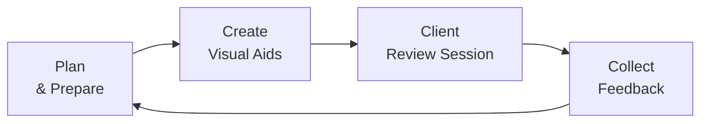
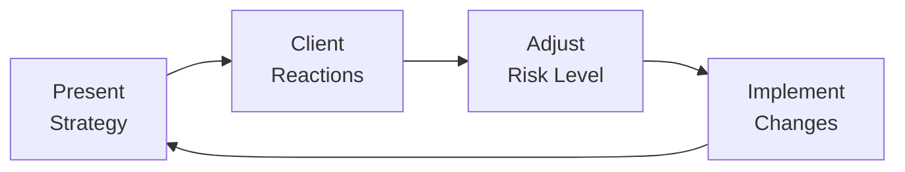

Communication is arguably the lifeblood of the client-advisor relationship. You can have the most brilliant portfolio strategy imaginable—multi-factor models, dynamic hedging overlays, all those fancy advanced allocations—but if you don’t communicate it in a way that resonates with your clients, it won’t gain buy-in or trust. And that’s what we really want, right? Clients who understand what we’re doing on their behalf, believe in the path we set, and remain calm when market turbulence inevitably hits.

Below, we’ll explore exactly how to communicate complex strategies in a straightforward, empathetic, and transparent manner. We’ll also weave in some personal anecdotes (because we’ve all had those moments when a client’s eyes glaze over as we get too “wonky”) and highlight how to use visuals, structure meetings, and address those critical questions about fees, expected returns, and drawdowns.

## Translating Jargon into Clear Language

It’s easy to forget that many of our clients don’t live and breathe the financial markets like we do. We throw around terms like “gamma exposure,” “downside deviation,” or “leveraging partial moments,” and they’re probably wondering if we’re speaking another language entirely. This is why translation matters.

• Use analogies whenever possible. For instance, to explain “risk exposure,” you might say, “Think of it like carrying an umbrella. It won’t stop the rain, but it reduces how soaked you’ll get. Our risk exposure is how vulnerable we are to unexpected market rain—even if we can’t always stop it, we can hold an umbrella in the form of diversification or hedging.”  
• Relate technical concepts to everyday life. The more accessible the example, the less intimidating it feels.

Keep in mind the “preferred detail level” for each client. Some love to see the vertex of every calculus-based pivot, while others just want to know that we’ve tested the model thoroughly. A good approach is to have a “deep dive” presentation ready but be able to pivot to a “30,000-foot view” version at a moment’s notice.

## Leveraging Visual Aids

Could you imagine explaining advanced portfolio strategies without a single chart or graph? Even the savviest clients can benefit from visuals. In fact, sometimes I look at numeric tables—all those rows of returns, betas, Sharpe ratios—and I think, “Hmm, a simple bar chart would make this pop.”

• Pie Charts: Perfect for illustrating portfolio composition and relative weightings by asset class or region.  
• Time-Series Graphs: Show performance over time—good for explaining the portfolio’s journey, particularly around major events (like rate hikes or economic recessions).  
• Histograms: Can effectively depict the distribution of returns and illustrate how often extreme outcomes can occur (a concept that might calm or alarm, so handle with care!).  
• Infographics: Summarize complex processes, such as multi-step hedging or derivative overlay strategies, in a single, easy-to-digest image.

A quick word of caution: Don’t overuse visuals. Too many can be as confusing as none at all. Choose the most relevant approach that underscores key points.

Here’s a simple example of a communication flow you might share with clients, using a Mermaid diagram:

In this simplified cycle, you prepare your message, develop or refine your visuals, discuss them with your client, gather feedback, and then loop back to planning and improving communication. This cycle might renew itself each quarter (or monthly), depending on your agreed communication schedule.

## Linking Strategies to Client Goals

If there’s one thing that absolutely must shine through in your client communications, it’s how your chosen strategies link directly back to their personal (or institutional) goals. If the objective is retirement income, show them how your fixed income ladder or liability-driven strategy addresses that. If they want growth, highlight the equity or alternatives portion that drives expected returns.

Clients often ask, “Why are we investing in X?” or “Why is fixed income so heavily weighted even though rates are rising?” In those moments, the best answer ties back to “Because it serves your ultimate need for stable income in retirement” or “It offsets the stock volatility so your overall nest egg doesn’t fluctuate as wildly.” It’s not just a matter of “we think yields will go down.” It’s about the outcome that matters to them.

## The Importance of Time Horizon

Some strategies—especially factor-based or alternative investments—may take a year (or longer) to begin showing their benefits. I remember one particular client who, months into a market-neutral strategy, asked me, “Why haven’t we made much money yet?” She was frustrated because she saw other parts of her portfolio performing strongly, and the neutral strategy was just sort of… well, neutral.

In such cases, you need to emphasize upfront (and repeatedly) that many of these strategies are designed for a multi-year horizon. Remind them that in the next market downturn, that “sleepy” portion could be the hero of the portfolio.

## Establishing a Communication Schedule

In Chapter 5, we touched on the behavioral aspects of investing, notably how client anxiety can increase in the face of uncertainty. One of the simplest ways to reduce that anxiety is a routine communication schedule. If your clients know that every quarter (or every month, if your arrangement is more frequent) they’ll receive:

• A performance report, including any changes in strategy or adjustments to the portfolio,  
• A short summary of relevant market developments (like big interest rate changes, major earnings surprises, or global events),  
• A quick note about how these developments might—or might not—impact the portfolio,

they’ll be less tempted to call you in a panic when they see a scary headline. This advanced notice of communication frames your relationship as “I’ll always keep you informed,” which fosters trust. And that trust is gold dust in our line of work.

## Addressing Fees, Expected Returns, and Downturn Risk

When a new client receives a 10-page fee schedule, their eyes might glaze over. And if you don’t approach fees transparently, you risk losing trust. So, how do we ensure “fees transparency” without burying them in disclaimers? We keep it simple:

• Clearly itemize management fees, performance fees (if any), fund expenses, and transaction costs.  
• Explain how your fee structure aligns with the client’s best interests (for instance, “We only earn performance fees if we exceed a high-water mark,” or “Our fee is kept relatively low so that a larger piece of profitable trades goes back to your returns.”).  
• Provide hypothetical impact numbers. For instance: “If your portfolio grows by 7% per year, and our fees total 1% annually, your net annual gain is around 6%. Over 10 years, that difference adds up to X dollars. Does that feel fair to you?”

For facing downturn risk, especially if your strategy is complex (like a structured note or an exotic option overlay), you must paint possible worst-case scenarios. Many clients will ask, “What if the market drops 20% tomorrow?” Provide factual data—maybe a stress test result from Chapter 6’s guidance on risk management. You might say: “Based on our scenario analysis, a 20% drop could translate into a 10–12% drawdown for us, thanks to our hedging strategy. Here’s how we arrived at that range.” Sprinkling in historical context can also help them see how similar strategies performed in past major crises.

## Providing Context Around Market Factors

Yes, it’s good to talk about broader market conditions. No, we shouldn’t drown clients in macroeconomic minutiae (unless they love economic detail!). Often, what they really want to know is, “Is any of this relevant to me?” or “Should I be worried?” So:

• Highlight the big picture: “Growth in emerging markets is expected to slow, so we’ve reduced our EM equity allocation.”  
• Tie changes back to the portfolio’s objective: “While inflation is climbing, we’ve increased our TIPs holdings to protect your real purchasing power.”  
• Distill the noise: “A lot of the daily headlines might sound alarming, but we remain focused on a balanced approach for the long haul.”

When you do sense that a global event might significantly impact your strategy, proactively share your perspective. Even if you’re not sure exactly how it’ll pan out (we rarely are!), your informed view helps your client remember you’re steering the ship intentionally rather than drifting.

## Encouraging Feedback and Adjusting Approach

If you’re anything like me, you may have initially thought “I’m the expert, I’ll just do what’s right,” but I’ve learned over the years that the client’s voice should guide how we present information and even how we adjust certain elements of the portfolio.

This “feedback loop” is crucial. Some clients become more risk-tolerant once they understand the strategy, while others realize they’d rather dial down complexity to sleep better at night. You’ll discover a sweet spot in your communication style—maybe a biweekly phone call or a simple monthly dashboard—and once you land on it, everyone breathes easier.

Here’s another Mermaid diagram that captures a simplified feedback process in the context of portfolio management and client input:

## Documenting Communications for Regulatory Purposes

We’d love to believe it’s enough to just do the right thing for our clients. But regulators also have something to say about that. Whether you’re overseen by the SEC in the US, the FCA in the UK, or another regulatory body, keep clear records of all client communications. This includes meeting notes, emails, performance reports, disclaimers around fees, and so forth.

Beyond regulatory compliance, it’s also a good reference for you. If a client says, “You didn’t warn me about that possibility,” you can point back to your written explanation. Even better, documentation fosters consistency—clients with similar risk profiles should receive the same materials (unless their personal preferences differ).

## Practical Example: Rolling Out a Leveraged Strategy

Imagine you want to introduce a small leveraged allocation into a client’s portfolio (similar to concepts discussed in Section 2.7 on leveraging basic return analysis). Let’s say your rationales are:

• Increase potential returns by using margin to purchase more equities given moderate interest rates.  
• Hedge with options to manage some downside risk (part of the portfolio’s “umbrella,” if you will).

How do you communicate this without scaring them off?

1) Start with the big picture. “We want to amplify your equity returns but also place protective puts to limit extreme losses.”  
2) Explain the pros and cons in plain language. “Leverage magnifies gains but also magnifies losses. We’re going to use only a small amount—to keep your overall portfolio risk in line with your comfort zone.”  
3) Illustrate with a scenario-based chart. For instance, show hypothetical returns at +10%, +0%, and -10% market outcomes.  
4) Emphasize relevant time horizons. “Because leverage can increase day-to-day volatility, we’re focusing on a longer investment horizon.”  
5) Provide a summary one-pager to highlight key details, followed by a conversation addressing all questions.  
6) Finalize everything in writing. “Here’s the record from our conversation, highlighting how you said you’d be comfortable with the approach, the fees, and the potential risk.”

## Best Practices, Pitfalls, and Overcoming Challenges

• Best Practice: Encourage clients to discuss any concerns early. No one wants to hear “I’ve been uncomfortable for months.”  
• Pitfall: Using too much technical jargon. This can alienate or intimidate your audience.  
• Overcoming Challenge: Offer layered explanations—start simple, then drill deeper if the client expresses interest or has questions.  
• Best Practice: Provide real-life examples. Talk about how a similar approach fared during a past market move, referencing official data or widely accepted benchmarks.  
• Pitfall: Overlooking emotional reactions. In Chapter 5 on behavioral biases, we saw how fear and overconfidence can sabotage even well-designed strategies.  
• Overcoming Challenge: Empathize and reassure. It’s okay to say, “I understand this can be nerve-wracking. Let’s look at the numbers again to see if your comfort level still matches.”

## Conclusion and Exam Tips

When it comes time for exam day, remember that many scenario-based questions on the Level III exam revolve around explaining strategies and processes to fictional clients. Here are a few pointers:

• Be explicit about linking strategy to client goals. That’s often a key point the graders look for.  
• Highlight how you would address client concerns (fees, risk tolerance, time horizon).  
• Demonstrate knowledge of the “why” behind each communication step—from using visuals to scheduling follow-up meetings.  
• Watch out for pitfalls like ignoring client constraints or failing to highlight the importance of clear documentation.

In essay questions, you might be asked to draft an “executive summary” or “client note.” Keep it concise, avoid jargon, and show that you’re able to step out of purely technical detail and communicate in an accessible way. For item sets, you might interpret a client scenario and answer multiple-choice questions about the best communication approach or the probable next step in clarifying a strategy.

Being prepared to show your mastery of these communication fundamentals is as essential as any advanced portfolio theory. After all, you can design the best investment solution in the world, but if you can’t convey its essence, you may never see it fully implemented.  

---

### References and Further Reading
• CFA Institute, “Client Communication and Reporting.”  
• Shefrin, H. (2002). Beyond Greed and Fear: Understanding Behavioral Finance and the Psychology of Investing. Oxford University Press.  
• Nickerson, R. (1998). “Confirmation Bias: A Ubiquitous Phenomenon in Many Guises.” Review of General Psychology.

---

## Test Your Knowledge: Communicating Complex Strategies to Clients



### Which of the following best describes the core purpose of using visuals in client communication?

- [ ] To replace technical explanations entirely
- [x] To make complex ideas more understandable and engaging
- [ ] To provide regulators with additional compliance documentation
- [ ] To eliminate the need for performance reports

> **Explanation:** Visual tools, such as charts, graphs, or infographics, serve to illustrate intricate data points in a user-friendly manner. They don’t replace technical detail but help clients grasp core ideas more easily.

### An advisor wants to introduce a leveraged equity strategy to a cautious client. Which action is most critical first?

- [x] Clearly outline both potential gains and the magnified risks
- [ ] Focus on the percentage fees for the leveraged product
- [ ] Discuss the technical method of rolling over margin calls
- [ ] Wait until year-end to disclose performance after implementing the strategy

> **Explanation:** The priority is to ensure the client understands the potential for significant gains and equally significant amplified losses so they can make an informed decision.

### Which of the following would best help a client visualize a portfolio’s asset allocation?

- [ ] A tabular list of monthly returns  
- [ ] A detailed equation of the capital market line  
- [x] A pie chart showing each asset class slice  
- [ ] A scatter plot of factor loadings

> **Explanation:** When illustrating portfolio composition, a pie chart is a straightforward way to visually display the relative weight of each asset class.

### What is the main advantage of having a regular communication schedule?

- [ ] Clients are prevented from accessing real-time portfolio data
- [ ] It eliminates questions about fees entirely
- [ ] It guarantees superior returns during market downturns
- [x] Clients stay updated in a predictable way, reducing anxiety

> **Explanation:** A consistent communication schedule helps manage expectations, addresses concerns early, and reassures clients that they will be informed regularly.

### How should an advisor handle a client’s feedback that the strategy is too complicated?

- [x] Consider a simpler explanation or reduce the strategy’s complexity if needed  
- [ ] Insist that the client follow the advisor’s main plan without changes  
- [x] Provide alternative visuals or simpler risk metrics  
- [ ] Avoid direct answers and change the subject

> **Explanation:** When feedback indicates discomfort with complexity, the advisor may simplify the communication or adjust the strategy. Presenting alternate visuals or risk metrics can also help clarify the approach.

### A client who is unfamiliar with financial terminology asks about “risk exposure.” What’s the best approach?

- [x] Use a relatable analogy, like carrying an umbrella in the rain
- [ ] Respond only with a numeric Value at Risk figure
- [ ] Refer them to technical academic papers for further reading
- [ ] Insist that risk exposure is too complex for them to understand

> **Explanation:** Tying complex concepts to everyday scenarios helps clients understand and relate to abstract ideas.

### When discussing fees, which approach is recommended?

- [x] Provide clear itemization of all costs
- [ ] Bundle fees in a single rate to avoid confusion
- [x] Offer hypothetical return scenarios showing net impact after fees
- [ ] Wait until the strategy has performed well before addressing fees

> **Explanation:** Transparent fee presentation fosters trust. Breaking down each fee and showing net impact ensures the client understands how fees affect returns.

### From a regulatory standpoint, why is it essential to document client communications thoroughly?

- [x] It demonstrates adherence to compliance obligations and ensures consistent disclosure  
- [ ] It allows providing different information to each client with the same risk profile
- [ ] It helps reveal insider trading activities
- [ ] It discourages clients from asking follow-up questions

> **Explanation:** Maintaining records of communications ensures that the firm can show regulators and clients that consistent, standardized, and accurate information was provided. It also offers evidence of ethical and professional practice.

### What is a primary benefit of referencing past crises or market drawdowns when communicating a strategy?

- [x] It provides historical context for how similar strategies performed under stress
- [ ] It guarantees the same market conditions will recur
- [ ] It allows advisors to skip regular updates
- [ ] It obviates the need for a strategic asset allocation

> **Explanation:** By referencing past crises, clients can see how the strategy might behave in adverse conditions, setting realistic expectations for future market turmoil.

### In ongoing communication, which statement about delivering market updates is most accurate?

- [x] “Summarize relevant economic indicators but tie them back to the specific portfolio implication.”  
- [ ] “Explain every minor headline in detail regardless of relevance.”  
- [ ] “Avoid discussing macro factors that could worry the client.”  
- [ ] “Use only quantitative data with no commentary.”

> **Explanation:** Informing clients about economic or market factors in a concise, relevant way is useful, but it needs contextualization—i.e., how it relates to their portfolio.


