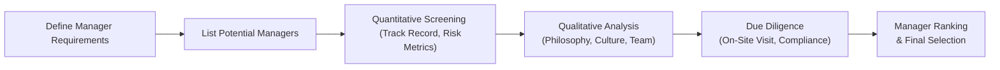
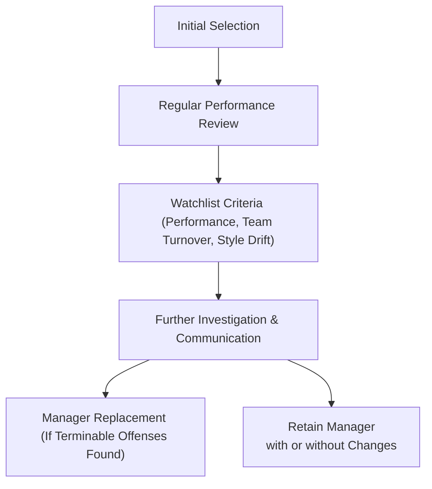

## Introduction  
Selecting the right asset managers for a model portfolio can sometimes feel like choosing the perfect running shoes. You’ve got to find the right fit, make sure they’re durable, and confirm that they’ll help you reach your objectives without causing unnecessary discomfort over the long run. In other words, manager selection is central to ensuring that an investment strategy not only looks good on paper but also performs as expected in real-world conditions.

This discussion explores both the science (quantitative metrics) and the art (qualitative insights) of manager selection, touching on critical considerations such as risk-adjusted returns, investment style, cultural alignment, fee structures, and ongoing governance. We’ll also mention a few scenarios that illustrate how layering managers with distinct styles can help smooth out performance and reduce portfolio volatility.

## Defining the Core Criteria  
When searching for the right investment manager to slot into a model portfolio, it’s easy to focus on the obvious stuff: track records, star ratings, or the person’s big personality on finance TV. But it’s far more effective to use well-rounded criteria. Although it might sound a bit formulaic, having a structured checklist keeps everyone honest and helps avoid the pitfalls of the moment’s hot concept or sensational headlines.

### Track Record and Performance  
Historical performance is often the first metric that comes to mind. A strong past performance—especially one demonstrated consistently across multiple market cycles—can be an encouraging sign. However, always peel back the layers:

• Was the manager’s performance a result of sheer luck or skill?  
• How did the manager handle volatile markets or sudden downturns?  
• Does the manager have an identifiable “secret sauce,” such as a unique stock-selection process, that consistently adds alpha?

While a high absolute return may look appealing, it’s the consistency of those returns and the manager’s ability to maintain a stable risk profile that really deserve attention. This is especially critical when layering multiple managers in a model portfolio.

### Risk-Adjusted Returns  
Performance has to be evaluated in the context of risk. A manager might produce stellar returns by taking outsized bets or running highly leveraged positions—practices that can expose a portfolio to severe drawdowns. Common tools include:  

• Sharpe Ratio:  
  
  \text{Sharpe Ratio} = \frac{R_p - R_f}{\sigma_p}
    
  where \\(R_p\\) is the portfolio return, \\(R_f\\) is the risk-free rate, and \\(\sigma_p\\) is the standard deviation of the portfolio’s excess returns. High Sharpe Ratios suggest the manager extracts returns efficiently relative to the volatility incurred.

• Alpha and Information Ratio: In CAPM terms, alpha gauges a manager’s ability to beat a risk-adjusted benchmark. The Information Ratio refines this by incorporating active risk relative to a benchmark.

• Upside/Downside Capture: Reflects how well a manager participates when the market is up and how much they protect on the downside. You might see a manager with a 90% upside capture (meaning they gather 90% of market gains) but only a 60% downside capture (losing just 60% of the market loss). This can be extremely valuable in a balanced model portfolio.

## Balancing Quantitative and Qualitative  
Numbers never lie, right? Well, sometimes they don’t tell the full story. While you might be drawn to a robust alpha or a glowing Sharpe Ratio, consider the “soft” aspects, too.

### Philosophy and Culture  
A manager’s personal investment philosophy drives how they parse market opportunities. Are they value-oriented, or do they chase growth trends? Do they favor a systematic (quant-based) approach, or are they more fundamental? Over time, a manager’s culture—honed internally by their team and influenced by their firm’s ethics—can shape the consistency of results. If a manager’s statements about investment style are not supported by the firm’s track record, that may be a red flag: it signals potential drift in strategy or confusion within their organization.

### Team Stability  
Sometimes the simplest question uncovers the biggest risk: “Who’s really running the show?” You might spot a seasoned professional in promotional materials, but if most of the real decisions are delegated to a less experienced team or if turnover is high, the manager might struggle to deliver consistent results. One personal anecdote: A friend of mine once allocated to a “star manager” based on the manager’s amazing institutional track record—only to find that the star manager had just left, handing the reins off to a brand-new recruit who had never operated through a market crisis. Ouch.

### Organizational Structure and Compliance  
Managers operating within robust compliance frameworks and stable organizational structures bring an added layer of comfort. A strong back-office function suggests they can support trading, settlement, record-keeping, and regulatory reporting seamlessly. If you detect gaps here, it can be a sign of deeper trouble. Make sure to check for compliance or legal issues—consistent litigation is obviously not the kind of drama you want stirring up in your portfolio.

## The Due Diligence Process  
Due diligence is essentially an investigative deep-dive. Think of it like a detective story where you gather clues from all angles:

• Financial records and track analysis.  
• On-site visits (virtual or in-person) to understand operations.  
• Interviews with key staff, from portfolio managers to back-office executives.  
• Verification of compliance with relevant standards (like GIPS for performance presentation).  

One approach is to create a matrix with multiple attributes—performance, culture, operational risk—to systematically score each prospective manager. Some large institutions develop entire committees devoted to manager selection, ensuring all angles are covered and no single viewpoint dominates the final decision.

Below is a conceptual diagram of a typical manager selection process. This is a broad overview to highlight the main steps:

## Aligning with Portfolio Objectives  
Even the best manager can be a mismatch if their strategy conflicts with your portfolio’s broader objectives. It’s worth articulating these objectives in an Investment Policy Statement (IPS) or in the portion of your portfolio guidelines that sets out risk/return targets. Ask yourself if the manager’s style is complementary or duplicative relative to the overall asset allocation. For instance, you might not want two managers both heavily invested in small-cap growth stocks if you’re trying to diversify your equity bucket.

### Time Horizon Considerations  
Sometimes a manager employs strategies that require a longer runway to bear fruit, such as deep-value or private credit approaches. If your model portfolio is constructed for short-term liquidity or frequent client redemptions, a manager with a multi-year lock-up might create tension. On the flip side, a manager with a constant short-term trading approach might churn out strong returns initially but could cause too much realized tax liability for an investor with a buy-and-hold orientation.

## Diversifying Managers  
Layering multiple managers within a single portfolio can reduce overall risk, assuming their styles are distinct. For example, if you pair a growth-oriented manager with a value-oriented manager, you might smooth out performance across market cycles. Some practical tips:

• Combine active and passive to handle different market segments.  
• Use factor-based or enhanced-index strategies if you want partial market exposure plus some alpha.  
• Avoid “Diworsification” by mixing too many managers and losing any sense of synergy or accountability.

Remember: blending manager styles is only beneficial if their returns and risk factors exhibit low correlation. If two managers use nearly identical approaches—just with different marketing logos—then you might not be truly diversifying.

## Fee Structures and Alignment  
Fees are more than just the number in bold on the manager’s term sheet—they directly reduce net returns. Aligning client interests with manager incentives is critical. Performance-based fee schedules can motivate managers to deliver alpha, but they can also encourage risk-taking if not properly structured. Key considerations include:

• Hurdle rates: Does the manager have to beat a benchmark or deliver an absolute return before earning performance fees?  
• High-water marks: Ensures that the manager doesn’t get paid for recovering past losses.  
• Clawback provisions: Less common, but designed to recoup fees if performance reverses.

Over the long run, consistently high fees can erode returns significantly—especially in a low-yield environment. So, if you sense that a manager’s fee structure is tipping the risk-return scale away from your portfolio’s best interests, it’s fair to either negotiate or consider alternatives.

## Governance and Ongoing Monitoring  
Selecting the manager is only half the story. You need a robust governance framework that sets out guidelines for:

• Performance reviews (e.g., every quarter or semiannually).  
• Thresholds for manager watchlists if performance falls below certain levels or if the style drifts from the original mandate.  
• Termination and transition policies if serious red flags emerge.

It can be tempting to fire a manager after a few rough quarters, but discipline is key. If you’ve selected a value-oriented manager and value is temporarily out of favor, that manager might underperform. That doesn’t necessarily mean the style is broken. However, if there’s a fundamental reason for suspicion—like abrupt changes to the investment team, compliance violations, or a meltdown in the manager’s risk controls—a watchlist or immediate replacement may become necessary.

A thorough governance matrix or policy manual can really help. List out the triggers for watchlisting or replacing a manager, from severe compliance issues to underperformance thresholds.

## Clarity in Manager Mandates  
Managers need to know exactly what’s expected of them. A clear mandate includes:

• The investment universe they can operate in (large-cap U.S. stocks, global bonds, emerging market equities, etc.).  
• Risk budgets, such as tracking error limits or maximum drawdown parameters.  
• Return benchmarks—like the S&P 500 for a U.S. equity strategy or a custom combination if the manager invests in multiple regions.  
• ESG constraints or guidelines, if that matters to the client.  

If managers deviate from the mandate, it can leave the entire portfolio exposed to overlapping risks or unplanned sector concentrations. It also complicates performance attribution because the manager is no longer doing what you hired them to do.

## Practical Examples and Case Studies  

### Case Study 1: Growth-Value Pairing  
An endowment invests in two equity managers. Manager A is known for a growth approach focusing on tech and consumer discretionary stocks. Manager B invests in undervalued industrial, energy, and financial names. Over a few years, the performance between the two managers diverges significantly—when growth stocks are hot, Manager A shines, while B lags. During cyclical shifts favoring industrial and value stocks, Manager B outperforms, and A dips a bit. But overall, the endowment’s equity portfolio experiences steadier returns, thanks to diversification.

### Case Study 2: Passive–Active Mix  
A high-net-worth individual wants a stable core portfolio with minimal fees. They select a passive manager mirroring a broad equity index (to ensure baseline market exposure at a low cost) and pair it with a specialized active manager focusing on small-cap opportunities. The active small-cap manager’s style is uncorrelated enough with the broad market that the total portfolio experiences less year-to-year fluctuation. Fees for the active portion are higher, but the alpha potential is worth it for that slice of the portfolio.

### Case Study 3: Manager Watchlist and Replacement  
A pension fund invests in a bond manager with a strong track record. Two years later, the manager’s performance begins lagging, but the lag is within the normal cyclical range. However, after persistent underperformance and a staff reorganization, the manager’s key personnel depart. Further investigation reveals resource constraints in back-office operations. The pension’s oversight committee places the manager on a watchlist. After six months of attempted remediation, no improvement occurs, and new compliance issues arise. The pension fund follows its termination policy, removing the manager from the lineup and transitioning to another well-established bond manager.

## Common Pitfalls and Strategies to Overcome Them  
• Overreacting to short-term performance: Let the manager’s strategy play out, provided it aligns with your long-term goals.  
• Fee oversight: The golden rule—know all the fees, including hidden or additional charges, to avoid unpleasant surprises.  
• “Star manager” syndrome: Don’t rely on names. A robust process always checks that the entire team can execute consistently.  
• Insufficient Mandate Clarity: A loosely defined scope leads to style drift and unwelcome risk. Draft precise mandates.  
• Lack of governance discipline: Putting a manager on watchlist but never enforcing policy can lead to significant portfolio leakages and compliance risk.

## Final Thoughts  
Manager selection is more than a quick fix or a numbers game—it’s about finding partners whose strategies sync with your portfolio’s risk tolerance, return objectives, and overall philosophy. It’s a bit like building a puzzle. Different managers fit different portfolio shapes, and your job is to make sure the final picture is both cohesive and balanced.

Taking the time to incorporate both quantitative and qualitative assessments helps minimize surprises down the road. And even if you have a top-tier set of managers, remember that governance is ongoing—markets evolve, teams change, and strategies can shift over time.

## References and Further Reading  
- Clark, G. L., Monk, A. H. B. (2017). “Institutional Investor Governance.”  
- CFA Institute, “Investment Manager Selection and Oversight,” CFA Program Curriculum.  
- Maginn, Tuttle, Pinto, & McLeavey, “Managing Investment Portfolios: A Dynamic Process.”  

---

## Exam Tips for Aspiring CFA® Candidates  
• Use a consistent framework: In essay questions, outline your approach to manager selection systematically (quantitative, qualitative, alignment reasons, etc.).  
• Illustrate knowledge of risk-adjusted metrics by explaining how to interpret the Sharpe Ratio, alpha, or upside/downside capture.  
• When discussing manager “red flags,” tie them back to potential compliance breaches, style drift, or organizational turmoil.  
• Be prepared to reference how different managers might align with typical IPS constraints (liquidity needs, time horizon, or ESG preferences).  
• Show your ability to weigh conflicting elements: Perhaps a manager’s high returns but questionable ethics or operational infrastructure.

---

## Test Your Knowledge: Manager Selection in Model Portfolios



### When evaluating a manager’s track record in a due diligence process, which factor is most important to assess in conjunction with performance?  
- [ ] The manager’s marketing budget  
- [ ] The manager’s fee schedule only  
- [x] The consistency of returns across different market cycles  
- [ ] The manager’s public relations track record  

> **Explanation:** Evaluating performance without examining how it was achieved in various market regimes overlooks the potential for style drift and untested vulnerabilities. Consistent returns across multiple market cycles usually indicate a robust process.

### Which measure is most relevant for comparing a manager’s performance against a benchmark on a risk-adjusted basis?  
- [ ] Maximum Drawdown  
- [ ] Profit Margin  
- [x] Information Ratio  
- [ ] Dividend Yield  

> **Explanation:** The Information Ratio measures excess returns relative to the risk taken compared to a benchmark. It refines alpha by showing how efficiently a manager utilizes active risk.

### A manager specializing in deep-value equities for a multi-decade endowment might have periods of underperformance. What is the MOST appropriate approach to managing this outcome?  
- [x] Monitor performance in alignment with the endowment’s long-term objectives  
- [ ] Immediately replace the manager after six months of weak performance  
- [ ] Reduce exposure by half to mitigate risk  
- [ ] Switch to a purely passive equity index strategy  

> **Explanation:** Value strategies can go through market cycles of underperformance. As long as the strategy is consistent with the endowment’s objectives and no other red flags exist, short-term underperformance alone is insufficient reason for termination.

### Which of the following items is most indicative of potential organizational risk in a manager’s operations?  
- [ ] Annual staff retreats  
- [ ] Regular philanthropic donations  
- [x] Frequent back-office turnover  
- [ ] Manager performance that is below benchmark for one quarter  

> **Explanation:** A high turnover in back-office roles can undermine the operational efficiency of the manager, increasing the likelihood of compliance or settlement errors.

### If a new manager in a portfolio strategy experiences sudden team departures, how should the investor typically respond first?  
- [x] Conduct a thorough review or watchlist the manager  
- [ ] Request immediate redemption of assets  
- [x] Proceed with adding more funds to the same manager  
- [ ] Ignore the issue if short-term performance is strong  

> **Explanation:** Significant team departures can disrupt a manager’s ability to carry out its strategy. The best step is to investigate further, possibly watchlist the manager, and then decide if changes to the allocation are warranted.

### An acceptable reason to terminate a manager purely based on short-term performance is:  
- [ ] If the manager underperforms for one quarter by 2%  
- [ ] If the manager is a high-profile “star” name with large media presence  
- [ ] If the manager invests in both equities and bonds  
- [x] If ongoing underperformance signals a deviation from the agreed-upon mandate or style  

> **Explanation:** Short-term underperformance alone is not a sufficient reason for termination. However, if the underperformance is linked to style drift or a material breach of mandate, that is grounds for re-evaluation.

### Why might layering a high-growth manager with a defensive value manager in the same portfolio reduce overall volatility?  
- [ ] Both managers are guaranteed to beat the benchmark  
- [x] Their return streams likely have lower correlation  
- [ ] Both managers follow the same investment approach  
- [ ] Defensive value managers rarely have periods of underperformance  

> **Explanation:** When two managers’ styles are not perfectly correlated, the combined portfolio often experiences reduced volatility as one manager’s gains can offset the other’s losses.

### Which of the following is a key advantage of incorporating passive managers in a model portfolio?  
- [ ] Guaranteed outperformance over active managers  
- [ ] Zero management fees  
- [x] Low cost approach to secure core market exposure  
- [ ] Higher drawdown potential than active managers  

> **Explanation:** Passive managers typically provide broad market coverage at low fees, making them a cost-effective way to secure baseline exposure and allocate more expensive active strategies where alpha might be found.

### An investor wants to incorporate a manager who focuses specifically on environmental, social, and governance (ESG) factors. What should be explicitly clarified in the manager mandate?  
- [x] ESG constraints and objectives  
- [ ] The next philanthropic event for the manager  
- [ ] Daily update calls from portfolio managers  
- [ ] A requirement to invest only in technology stocks  

> **Explanation:** If ESG criteria are a priority, the manager mandate should clearly outline the ESG guidelines, constraints, or priorities that the manager must respect in their investment decisions.

### True or False: A manager with a high Sharpe Ratio automatically meets all the qualitative requirements for an investor’s portfolio.  
- [x] True  
- [ ] False  

> **Explanation:** This is deliberately tricky. A manager’s Sharpe Ratio does not confirm cultural or strategic alignment. Yet from a purely technical standpoint, a very high Sharpe Ratio might make an investor assume the strategy is delivering strong risk-adjusted performance. In practice, however, one must confirm that the manager’s style, team stability, and operational integrity also align with the portfolio’s objectives.  


