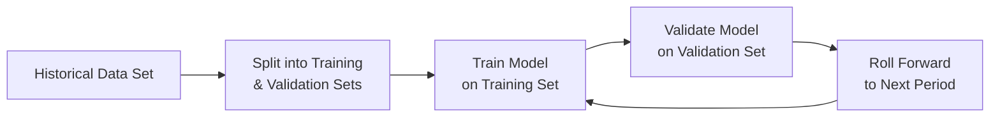

## Introduction
If you’ve ever felt that twinge of excitement watching a strategy backtest return stunning results, only to see it flop in real-world trading, you’re not alone. This mismatch between backtested (in-sample) performance and live (out-of-sample) performance is a big deal in portfolio management. In-sample performance is based on historical data used to build your model or strategy, whereas out-of-sample performance is measured on fresh, unseen data—a more realistic test of how the strategy might do under future market conditions.

It might seem obvious that testing on unseen data is more reliable, but trust me, I’ve been burned before. Early in my career, I built a mean-reversion model that looked amazing on my historical dataset. I was practically jumping in my seat. But once I started trading it with real money, performance dropped like a stone. Turned out I had overfitted the model—no surprise in hindsight. So, let’s discuss how to keep this from happening to you.

## The Problem of Overfitting
Overfitting is when a model or strategy contorts itself to match historical data’s every quirk. Picture a tailor who perfectly sizes a suit to a mannequin’s lumps and bumps; it looks dashing on the mannequin but might not fit a real person. Overfitted investment strategies can underperform when confronted with the messy, ever-changing markets of the future. 

When a model is too specifically tuned to past data, it picks up spurious correlations—patterns that won’t persist. That’s why it’s crucial to move beyond in-sample analysis: to see if those patterns hold any water in fresh, out-of-sample data.

## Walk-Forward Testing Approaches
Walk-forward testing is a popular solution. This approach typically involves:

• Training or calibrating your strategy on a historical window (the in-sample period).  
• “Walking forward” to a subsequent period you haven’t used to train the strategy (the out-of-sample period).  
• Analyzing how well the strategy performs in that out-of-sample window.  
• Rolling the window forward and repeating the process.  

It’s like calibrating your watch every few months using the best data you have, then testing if it keeps accurate time going forward. The advantage is that each new period tests performance on data not used to optimize the rules.

Below is a simplified Mermaid diagram illustrating a walk-forward process:

Notice that the cycle of “train-validate-roll forward” repeats, which helps mimic what you might see in a real portfolio. Each new time period gets the model’s latest parameters (or slight adjustments) and is then subjected to brand-new market conditions.

## Rolling Window Analysis
Rolling windows are a specific technique used in walk-forward testing where your dataset “slides” forward in time at fixed intervals. Suppose you have 10 years of data. You train on years 1 through 5, test on year 6, then slide forward one year: train on years 2 through 6, test on year 7, and so on. This approach helps ensure your model remains updated with the most recent market developments.

Rolling windows also force you to face the fact that market dynamics change—sometimes drastically. The best model fit from 2010–2014 might behave quite differently for 2020, especially after major geopolitical or macroeconomic shocks. Rolling windows let your strategy “evolve” with the times.

## Incorporating Transaction Costs and Slippage
Every portfolio manager or quant has faced that sinking feeling when real-world results lag behind backtested figures. Often, the culprit is ignoring realistic transaction costs and slippage. Out-of-sample tests should include:

• Commission estimates: Factor in fees per trade or per share.  
• Bid–ask spreads: The cost of actually getting in and out of positions at a realistic market price.  
• Slippage: Markets move while you’re trying to execute, especially if you manage large sums.  

If your out-of-sample test doesn’t incorporate these frictions, your results could be inflated—potentially leading to unwelcome surprises once the strategy goes live. It’s sort of like buying a house and forgetting to budget for taxes, maintenance, and insurance. Everything seems great until the bills arrive.

## Documenting Changes and Implementation
There’s no shame in adjusting your model if it flops in the out-of-sample test. But be sure to document these updates. If your strategy shows consistent underperformance in certain market regimes—say, high volatility or low liquidity—tweak the model accordingly, but note exactly what you changed and when.

Maintaining a log of changes:
• Prevents “stealth overfitting” where you might keep adjusting the model until it looks good, forgetting that each tweak can reduce the purity of the out-of-sample test.  
• Helps track the real reason behind improvements or performance shifts, which is super handy if you must explain results to clients or compliance.  

In essence, it’s about being transparent. If you keep track of everything, you’ll know whether you improved the model because of a genuine new insight or if you just got lucky on the next set of data.

## Benchmarks and Peer Groups
Benchmarking out-of-sample results against relevant indexes or peer-group averages puts your performance into context. Sure, you might have made 5% last year, but that number doesn’t mean much if a similar index tracking your strategy style returned 10%. Some common references:

• Broad market indexes (e.g., S&P 500, MSCI World) to assess absolute performance.  
• Style or sector indexes that align with your strategy’s focus.  
• Peer-group comparisons to see if your results stand out from similarly managed funds.  

Out-of-sample performance that consistently beats appropriate benchmarks or peer groups over multiple periods is a good indicator that your strategy may have genuine alpha—not just lucky picks or spurious data fits.

## Realistic Expectations and Market Shifts
Market conditions can pivot quickly. An out-of-sample test over a six-month interval might not capture all the nuances of a shifting environment. If volatility was tame during your test window, you might get caught off-guard if volatility suddenly spikes. Conversely, a meltdown-era out-of-sample test doesn’t guarantee the strategy will do as well under normal conditions.

Being realistic also means accepting that a stellar out-of-sample run doesn’t guarantee indefinite success. It’s a snapshot in time—valuable but incomplete. That’s why many managers re-run out-of-sample tests periodically and refine their risk controls as needed.

## Risk Management Overlays
Sometimes in out-of-sample tests, you’ll spot volatility or drawdowns that are bigger than you saw in-sample. This is your cue to evaluate additional risk overlays—maybe setting tighter stop-losses, using derivatives to hedge exposures, or diversifying into noncorrelated assets. 

In a real portfolio, you rarely rely on a single measure of performance. You look at downside risk, conditional value-at-risk (CVaR), and maximum drawdowns. If out-of-sample results show the risk metrics ballooning beyond your comfort zone, consider overlays to keep risk in check.

## Putting It All Together (A Short Story)
I once analyzed a momentum-based commodities strategy that looked unstoppable in-sample. After the first walk-forward step, it did okay—just okay, not as amazing as the backtest. By the second step, returns were lagging the commodity index. We dug into the data and found we hadn’t accounted properly for slippage in less liquid markets. We updated the model with a more realistic cost assumption and tested again. The new out-of-sample result was even more muted, but at least it was honest. Ultimately, we used a combination of narrower position sizes and a simpler set of signals. The final out-of-sample performance was decent, but not the rocket ship we’d hoped for. However, it was stable enough to meet the client’s risk–return objectives.

## Key Takeaways
• Always remember: In-sample performance is just the warm-up. The real test is how a strategy handles fresh market data.  
• Walk-forward testing and rolling windows provide continuous, updated insights into strategy viability.  
• Incorporating transaction costs and slippage is nonnegotiable; ignoring them can make your results almost meaningless.  
• Document every model adjustment for transparency—you don’t want to inadvertently sabotage your own test by overfitting.  
• Compare results to relevant benchmarks or peers to determine if you’re generating true alpha or just tracking the broader market.  
• Keep an eye on changing market conditions. Short out-of-sample windows might not capture a full market cycle.  
• Use robust risk management techniques if out-of-sample performance reveals hidden weaknesses, such as higher-than-expected volatility.

## Conclusion
No strategy is perfect, and markets are unpredictable. But out-of-sample testing is your best friend in confirming whether those in-sample gains hold up in the real world. By being mindful of transaction costs, slippage, model documentation, and benchmark comparisons, you can dramatically increase the likelihood that your performance is the real deal—and not just a convenient fit for historical data. In short: test thoroughly, test honestly, and always expect the unexpected.

**References and Further Reading**  
• Bailey, D. H., Borwein, J., Lopez de Prado, M., & Zhu, Q. J. (2014). “The Probability of Backtest Overfitting.” Journal of Computational Finance.  
• De Prado, M. L. (2018). “Advances in Financial Machine Learning.” Wiley.  
• CFA Institute, “Quantitative Methods for Investment Analysis,” CFA Program Curriculum.

---

## Strengthen Your Skills: Out-of-Sample Performance Quiz



### Which statement best describes out-of-sample performance testing?

- [ ] Measuring a strategy’s performance on the same dataset it was trained on.
- [x] Measuring a strategy’s performance on a dataset that was not used during the training phase.
- [ ] Using random data that is unrelated to any historical or current market conditions.
- [ ] Re-optimizing the strategy continuously on the entire dataset.

> **Explanation:** Out-of-sample testing uses new data that the model hasn’t seen before, providing a more realistic evaluation of future performance.

### What is overfitting in the context of model development?

- [ ] When a model is too simple and fails to capture relevant market relationships.
- [x] When a model is excessively optimized to fit historical data, capturing noise rather than signal.
- [ ] When a model uses transaction costs in its estimates.
- [ ] When a model trains on out-of-sample data by design.

> **Explanation:** Overfitting occurs when the model focuses on random patterns specific to the historical data, which do not generalize to future data.

### How does walk-forward testing help mitigate overfitting?

- [ ] By ignoring transaction costs and slippage altogether.
- [ ] By relying solely on cross-sectional data instead of time series.
- [x] By training on one period, then testing on the next, repeatedly rolling forward.
- [ ] By using the same training window for multiple tests.

> **Explanation:** Walk-forward testing updates the model parameters on a training window, then tests on a subsequent period. This process, repeated over multiple windows, better simulates real-world conditions.

### Why is it critical to include transaction costs and slippage in out-of-sample tests?

- [ ] They generally have no effect in real-world investment scenarios.
- [ ] They typically reduce performance in in-sample tests.
- [x] They more accurately reflect actual returns that can be achieved in live trading.
- [ ] They help improve the statistical significance of the model’s signals.

> **Explanation:** Omitting transaction costs and slippage inflates theoretical returns. Including them brings the test closer to real-world conditions.

### Which of the following is considered a best practice for documenting strategy updates during out-of-sample testing?

- [x] Maintaining a log of each parameter change and the rationale behind it.
- [ ] Performing parameter changes without any record to reduce administrative burden.
- [x] Ensuring changes are validated with fresh data and properly time-stamped.
- [ ] Only documenting changes when out-of-sample results are significantly negative.

> **Explanation:** A thorough log of changes, along with time-stamped justifications, ensures transparency and prevents stealth overfitting.

### When comparing out-of-sample performance, why is benchmarking essential?

- [x] It helps you judge if your strategy is outperforming a relevant standard or peer group.
- [ ] It makes performance evaluation more subjective.
- [ ] It is only needed if your strategy underperforms market indexes.
- [ ] It ensures transaction costs are automatically incorporated.

> **Explanation:** Benchmarks provide context to returns. Beating a relevant index or peer group consistently in out-of-sample measures indicates robust performance.

### What is a key limitation of short out-of-sample evaluation periods?

- [ ] Data sets are always more robust in short intervals.
- [x] They might not capture full market cycles or regime changes.
- [x] They can paint an overly optimistic or pessimistic view if the market environment is not typical.
- [ ] They reduce the risk of overfitting.

> **Explanation:** Short windows may fail to reveal how the strategy performs under varying economic conditions, potentially leading to misleading conclusions.

### Why might a rolling window approach be preferable to a single, static training set?

- [x] It adapts continuously to new market environments.
- [ ] It is guaranteed to avoid transaction cost issues.
- [ ] It automatically improves risk metrics without user intervention.
- [ ] It only benefits volatility-targeting strategies.

> **Explanation:** Rolling windows allow the model to be recalibrated with fresher data periodically, helping capture shifts in market dynamics more promptly.

### Which statement about in-sample vs. out-of-sample performance is most accurate?

- [ ] If in-sample performance is strong, out-of-sample results are guaranteed to be similar.
- [x] In-sample performance often exaggerates a strategy’s abilities, making out-of-sample validation essential.
- [ ] Positive out-of-sample results mean there is no risk of model failure.
- [ ] In-sample results can substitute for live performance if the dataset was large enough.

> **Explanation:** In-sample performance can be inflated due to overfitting. The out-of-sample test is the key measure of a strategy’s true capability.

### Out-of-sample performance can best be described as:

- [x] True
- [ ] False

> **Explanation:** True. It represents results obtained on new data, not used during model development, offering a more objective and realistic measure of potential future performance.


