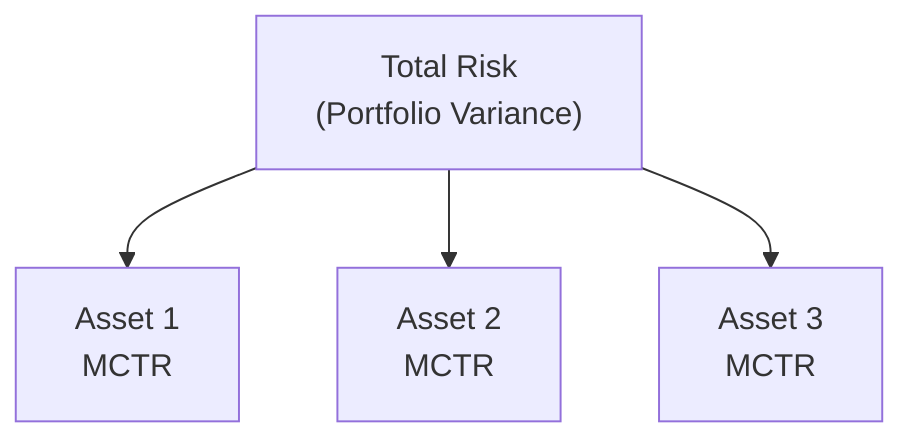

## Understanding the Concept

Have you ever discovered—almost by accident—that a single asset in your portfolio was driving most of your sleepless nights? I’ve been there. It’s that moment when you realize your once “well-diversified” basket is actually being dominated by a single dominant factor or asset whose real risk exposure you didn’t fully anticipate. This is where marginal contribution to risk (MCTR) comes in—like a friendly neighbor pointing out the small leak in your garage roof before a big storm arrives.

Marginal contribution to risk is all about how much additional risk each individual asset or factor brings to the total portfolio, at the margin. In other words, if you tweak an asset’s weight by a small amount, MCTR tells you how much total portfolio risk changes in response. It’s the partial derivative of risk with respect to asset weight, multiplied by the weight of that asset.

## Why MCTR Matters in Portfolio Construction

MCTR is vital because it helps you:
• Determine which assets or factors are truly running the show in your portfolio’s risk profile.  
• Uncover hidden concentrations you might not suspect.  
• Set (and monitor) a risk budget so no single investment hogs the risk.  
• Establish tighter or looser factor exposures depending on how comfortable you are with particular economic or style risks.

By examining each component’s MCTR, you see precisely how much total portfolio volatility is coming from each asset or factor. That knowledge is pure gold for portfolio managers looking to spread out risk in a (hopefully) productive way.

## Key Terms and Glossary

Before diving deeper, let’s clarify a few terms we’ll be tossing around:

• Marginal Contribution to Risk (MCTR): The incremental change in total portfolio risk for a small change in an asset’s weight. Formally, MCTR for asset i is:
  
  MCTRᵢ = wᵢ × (∂σₚ / ∂wᵢ)
  
  Where wᵢ is the weight of asset i, and σₚ is the total standard deviation of the portfolio.

• Risk Budgeting: The process of allocating risk across different investments or factors according to predefined targets or constraints. MCTR is a go-to tool here.

• Variance Decomposition: Splitting total portfolio variance (or standard deviation) into components attributable to each asset or factor.

• Correlation: A statistical measure of how two returns move relative to each other. Correlation strongly influences how an asset’s marginal risk contribution interacts with the entire portfolio.

• Risk-Contribution Approach: A method of building portfolios so that each asset or factor contributes a targeted proportion to overall risk (e.g., “risk parity” strategy).

• Partial Derivative: In a portfolio context, it’s the sensitivity of total risk (variance, or standard deviation) to a small change in an asset’s weight.

• Concentration Risk: The danger of having too much exposure to a single asset, factor, or market. MCTR helps identify these unintended bets.

## Laying Out the Math

“Ok, so how does it work mathematically?” you might ask. Let’s walk through the standard formulas. We’ll assume for simplicity that we’re working with a portfolio of n assets with weights w₁, w₂, …, wₙ. Let Σ be the covariance matrix for these n assets, and let σᵢⱼ represent the covariance between asset i and asset j. The portfolio variance σₚ² is:

σₚ² = wᵀ Σ w

The total portfolio standard deviation is then:

σₚ = √(wᵀ Σ w)

### Partial Derivative of Portfolio Risk

We’re interested in how σₚ changes if we alter wᵢ just a bit. Let’s denote ∂σₚ / ∂wᵢ as the partial derivative of the portfolio standard deviation with respect to the weight of asset i. From calculus, we can approximate:

∂σₚ / ∂wᵢ ≈ (1 / (2σₚ)) × ∂(wᵀ Σ w) / ∂wᵢ

But ∂(wᵀ Σ w) / ∂wᵢ = 2 (Σw)ᵢ when Σ is symmetric (which it usually is, since it’s a covariance matrix). So:

∂σₚ / ∂wᵢ = ( (Σ w)ᵢ ) / σₚ

### Putting the M in MCTR

Marginal contribution to risk for asset i, MCTRᵢ, is then:

MCTRᵢ = wᵢ × (∂σₚ / ∂wᵢ)

Substituting our expression for ∂σₚ / ∂wᵢ, we get:

MCTRᵢ = wᵢ × ( (Σ w)ᵢ / σₚ )

This expression shows how the portfolio’s covariance matrix, combined with an asset’s weight, shapes that asset’s incremental risk input.

## A Simple Two-Asset Example

Let’s keep it small. Consider just two assets, A and B. Suppose you have these stats:

• w_A = 0.60, w_B = 0.40  
• σ_A = 12% (annualized), σ_B = 8%  
• ρ_AB = 0.30 (correlation between A and B)

From correlation, we can derive covariance:  
σ_AB = ρ_AB × σ_A × σ_B = 0.30 × 0.12 × 0.08 = 0.00288

In matrix form, Σ is:

Σ =  
[  0.0144    0.00288 ]  
[  0.00288   0.0064 ]

• (0.0144 = 0.12²)  
• (0.0064 = 0.08²)

Now, portfolio variance is:

σₚ² = [0.60   0.40]  
       [0.0144  0.00288  
        0.00288 0.0064 ]  
       [0.60   0.40]ᵀ  

We can do the multiplication step by step:

1. Σ w =  
   [0.0144×0.60 + 0.00288×0.40, 0.00288×0.60 + 0.0064×0.40]ᵀ  
   = [0.00864 + 0.001152, 0.001728 + 0.00256]ᵀ  
   = [0.009792, 0.004288]ᵀ

2. Now wᵀ (Σ w) =  
   (0.60)(0.009792) + (0.40)(0.004288)  
   = 0.0058752 + 0.0017152  
   = 0.0075904

Hence, σₚ² = 0.0075904, and  

σₚ = √0.0075904 ≈ 0.08715 (≈ 8.715%)

### Checking MCTR

Marginal contribution:

∂σₚ / ∂w_A = ((Σ w)_A) / σₚ = 0.009792 / 0.08715 ≈ 0.1123  
∂σₚ / ∂w_B = ((Σ w)_B) / σₚ = 0.004288 / 0.08715 ≈ 0.0492  

Hence:

MCTR_A = w_A × ∂σₚ / ∂w_A = 0.60 × 0.1123 = 0.06738 (6.738%)  
MCTR_B = w_B × ∂σₚ / ∂w_B = 0.40 × 0.0492 = 0.01968 (1.968%)

We can see A’s marginal contribution is about 6.74% to the overall 8.72% portfolio standard deviation, and B’s is around 1.97%, adding up (roughly) to 8.71%. By examining these numbers, you realize Asset A is shouldering much more of the portfolio’s total risk. That might be perfectly fine—if you intended it. But if you didn’t, you’ve just stumbled upon a big reason this approach is so helpful.

## MCTR in a Multi-Asset Context

In a portfolio of many assets, you simply repeat the partial derivative calculation for each asset (or factor). The principle is the same:  
• Compute σₚ = √(wᵀ Σ w).  
• Find ∂σₚ / ∂wᵢ for each i by dividing the i-th element of Σw by σₚ.  
• Multiply each partial derivative by wᵢ.  

In more advanced factor models, you can also treat each factor as if it’s an “asset” by plugging in factor exposures and a factor covariance matrix. The math looks almost identical, but your “weight vector” w gets replaced by factor exposures, and Σ becomes the factor covariance matrix.

## Risk Budgeting and MCTR

MCTR is crucial for risk budgeting, which is basically about deciding how to slice up your “risk pie.” Do you want to spend 50% of your risk tolerance on equities, 40% on fixed income, and 10% on alternatives? That’s your call. But you’ll want to verify that, in practice, your final portfolio is aligned with these allocations in terms of actual risk.

• The “risk-contribution approach” to portfolio construction tries to ensure that the final MCTR for each asset matches target boundaries or “budgets.”  
• If you see an MCTR for an asset blowing past your intended risk budget, you can scale back that holding, reduce correlated exposures, or re-hedge.  

It’s a more precise alternative to naive approaches (like equal weighting, or the classic 60/40 equity-bond split), because it ensures no single asset dominates the show unless you explicitly choose for it to.

## Identifying Hidden Concentrations

Sometimes two assets have a modest weight in your portfolio, and you’ll assume they’re not a big deal. But if they’re also highly correlated with each other (and possibly with the rest of the portfolio), watch out! MCTR analysis might reveal that these seemingly tiny allocations are exposing you to significant concentrated risk. The partial derivative approach forces you to confront correlation’s role in your risk story.  

Here’s a casual example: If two alternative assets both go heavy on real estate or have the same factor tilt to interest rates, you might find your “alternatives sleeve” is inadvertently a huge real estate bet. MCTR helps catch that sneaky overlap.

## Diagram: How Total Risk Breaks Down by Asset

Below is a quick Mermaid diagram giving a general sense of how total portfolio risk can be decomposed into the marginal contributions of multiple assets. This is just a conceptual flow:



Each asset’s MCTR adds up (roughly) to the total risk measure. In practice, you’d repeat the partial derivatives for each position in your portfolio—no matter if it’s 3 or 300.

## Practical Implementation and Pitfalls

• Data Accuracy: MCTR depends on estimates of covariances, and those can be shaky if your data history is short or unrepresentative.  
• Frequent Monitoring: Asset correlations evolve over time. MCTR analysis from six months ago might be stale.  
• Factor Complexity: If you track factor-based exposures, you might need a robust factor covariance matrix. This can get complex quickly.  
• Overreliance on Historical Data: Forecasting forward risk based purely on historical correlations can lead to trouble in rapidly changing markets.

That said, once you set up your “risk engine”, computing MCTR regularly is fairly straightforward. Many portfolio-analytics tools offer this functionality. You can also do it yourself in Python or another statistical environment.

## Example Python Snippet

Below is a simplified Python snippet that calculates MCTR for a generic list of assets. Feel free to adapt it:

```python
import numpy as np

weights = np.array([0.25, 0.25, 0.25, 0.25])
cov_matrix = np.array([
    [0.0225, 0.0100, 0.0050, 0.0010],
    [0.0100, 0.0361, 0.0085, 0.0022],
    [0.0050, 0.0085, 0.0490, 0.0150],
    [0.0010, 0.0022, 0.0150, 0.0640]
])

portfolio_var = weights.T @ cov_matrix @ weights
portfolio_std = np.sqrt(portfolio_var)

marginals = (cov_matrix @ weights) / portfolio_std
MCTR = weights * marginals

print("Portfolio Std Dev:", portfolio_std)
print("MCTR for each asset:", MCTR)
print("Sum of MCTR:", MCTR.sum())
```

You’d interpret the output to see which asset is contributing what fraction to total portfolio risk. The sums of MCTR (across all assets) should closely approximate your portfolio standard deviation (small rounding differences can arise).

## Using MCTR to Balance Factor Exposures

In factor-based investing, MCTR helps you spot which factors are dominating your risk budget. For instance, a “value factor” might be overshadowing your supposed tilt to momentum or quality, or a macro factor like interest rates might overshadow everything else.  
• By computing MCTR by factor, you can rebalance or hedge if an unintended factor is hogging your space.

## Final Exam Tips

• Stay grounded in the formulas: You’ll likely see an item-set or short-answer question on the exam that requires you to do a partial derivative calculation.  
• Watch correlations closely: MCTR is not just about individual volatilities but how they interact.  
• Communicate the findings: In practice, it’s not enough to know MCTR. You need to explain to clients (or your boss) why a certain small position might be the biggest risk driver.  
• Integrate with risk budgeting: The exam might test your ability to connect MCTR to capacity constraints, risk budgeting, or factor tilts. Show you know how to tie it all together.

## Additional References for Deeper Insight

Should you want to keep exploring how to allocate risk using MCTR:

• Maillard, S., Roncalli, T., & Teiletche, J. (2010). “The properties of equally weighted risk contribution portfolios.” Journal of Portfolio Management.  
• Meucci, A. (2007). “Risk contributions on the Euler allocation principle.” GARP Risk Professional.  
• CFA Institute Official Curriculum – Risk Analysis and Factor Decomposition.

## Test Your Knowledge: Marginal Contributions to Risk



### Which of the following best describes the concept of Marginal Contribution to Risk (MCTR)?

- [ ] The total value at risk across an entire portfolio.  
- [ ] The probability distribution of returns for a single asset.  
- [x] The incremental change in total portfolio risk if an asset’s weight changes slightly.  
- [ ] The expected return from a small inclusion of an asset.  

> **Explanation:** MCTR measures how much total portfolio risk changes for a small change in an individual asset’s weight.

### When using MCTR for risk budgeting, which statement is most accurate?

- [ ] MCTR is irrelevant for establishing target return objectives.  
- [ ] MCTR never sums up to total portfolio volatility.  
- [ ] MCTR is only valid in purely uncorrelated portfolios.  
- [x] MCTR helps ensure no single asset exceeds its risk budget.  

> **Explanation:** Risk budgeting often uses MCTR to ensure each asset (or factor) is within an acceptable share of total portfolio risk.

### In a 2-asset portfolio with perfect correlation (ρ = 1), which of the following is true regarding MCTR?

- [ ] MCTR cannot be calculated in this scenario.  
- [ ] The difference in MCTR between the two assets is always zero.  
- [x] The MCTR for each asset is proportional to its weight and standard deviation.  
- [ ] Correlation does not affect MCTR.  

> **Explanation:** With perfect correlation, assets act in lockstep, and each asset’s marginal contribution to risk aligns closely with its weight and its stand-alone volatility.

### Suppose you have a 3-asset portfolio. You notice that Asset A has a tiny weight but a large MCTR. What might this indicate?

- [x] Asset A is highly correlated with other assets or has a large variance.  
- [ ] Asset A offers low correlation and thus a lower overall contribution to risk.  
- [ ] Asset A is contributing negative risk.  
- [ ] Asset A has zero volatility.  

> **Explanation:** Small weight but big MCTR often reveals high volatility or correlation, leading to a disproportionate effect on the portfolio’s total risk.

### Which step is essential for computing MCTR in a multi-asset setting?

- [x] Finding (Σw)ᵢ for each asset.  
- [ ] Summing all assets’ expected returns.  
- [ ] Calculating only stand-alone volatility with no reference to covariance.  
- [ ] Minimizing the portfolio tracking error first.  

> **Explanation:** MCTR relies on (Σw)ᵢ to capture each asset’s interaction with the portfolio, i.e., its covariance with the rest.

### Why might MCTR be considered more insightful than simple “weight in the portfolio” when it comes to risk?

- [ ] Because simpler metrics like weight never change over time.  
- [x] Because MCTR factors in correlations and volatilities, showing a truer picture of risk.  
- [ ] Because MCTR is an entirely different concept unrelated to portfolio risk.  
- [ ] Because MCTR ignores asset variance when assessing risk.  

> **Explanation:** MCTR uses both covariance and an asset’s weight, indicating each asset’s unique “risk footprint.”

### A portfolio manager realizes that one factor’s MCTR is approaching 50% of total risk, much larger than intended. Which response is most appropriate?

- [ ] Increase the exposure to that factor to reduce correlation.  
- [x] Hedge or reduce holdings that load heavily on that factor.  
- [ ] Remove all other positions since they no longer matter.  
- [ ] Do nothing; the factor MCTR will always revert to zero.  

> **Explanation:** Reducing the factor exposure or hedging it helps keep the factor’s MCTR within desired risk budgets.

### Which of the following is a potential pitfall of relying on MCTR?

- [ ] MCTR calculations never require matrices, so it’s too simple.  
- [ ] MCTR is not affected by historical data issues.  
- [ ] MCTR can be calculated without standard deviation estimates.  
- [x] MCTR can mislead if the covariance estimates are inaccurate or unstable.  

> **Explanation:** MCTR depends on the covariance structure. Poor or unstable estimates easily undermine its reliability.

### How can MCTR reveal hidden concentration risk?

- [ ] By ignoring asset correlations.  
- [x] By showing a small position’s unexpectedly large contribution to total volatility.  
- [ ] By summing all asset betas in a single metric.  
- [ ] By focusing solely on expected returns.  

> **Explanation:** MCTR often highlights positions that—despite low weights—carry high covariance with the rest of the portfolio, unexpectedly inflating overall risk.

### MCTR helps a portfolio manager:

- [x] Allocate risk more efficiently across assets or factors.  
- [ ] Eliminate the need for diversification in the portfolio.  
- [ ] Ignore correlation in constructing the portfolio.  
- [ ] Forecast precise market returns based on partial derivatives.  

> **Explanation:** MCTR is a tool for risk allocation (and reallocation), guiding efficient diversification management in line with the manager’s risk budget.


