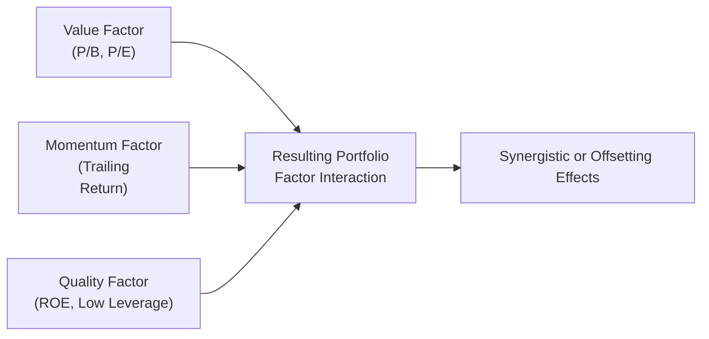

## Introduction and Basic Concepts

So, let’s talk about factor interaction in portfolio management. If you’ve ever combined multiple individual ingredients in your kitchen—like sugar, flour, baking soda, and butter—only to discover the final taste is different than you’d expect from each part alone, you already have a pretty good sense of how factor interactions work in portfolios. When you combine separate investment factors (for instance, value, momentum, and quality), their combined effect may give you a final performance profile that’s quite different from each factor’s standalone impact. Sometimes it’s a happy surprise (like a sweet chocolate chip cookie with just the right texture), and other times, well, we might need to tweak the recipe.

In the context of finance, a “factor” is a broad, systematic attribute (such as size, value, liquidity, momentum, etc.) that explains part of an asset’s returns. But once we start mixing multiple factors in a single portfolio, we need to watch out for how they might overlap, offset, or even amplify one another. This article will walk you through the key ideas of factor interactions, show you how to analyze them, and discuss some advanced approaches to best manage these combined exposures.

## Understanding Factor Overlap and Interactions

Factors don’t always stand neatly apart from one another; sometimes they measure partially similar attributes. For instance, the classic “value” factor is often anchored on metrics like price-to-book or price-to-earnings. Meanwhile, the “quality” factor might incorporate components such as profitability or certain accounting ratios. But some profitability metrics (like return on equity) are influenced by the same book value that also appears in the “value” factor. In other words, if your “value” and “quality” metrics both rely on book value, they could be measuring somewhat overlapping features of a firm.

When these measures overlap, the combined exposure may not be as diversified as you think. Or it could unintentionally double down on a specific type of company. Perhaps you wanted half your portfolio to emphasize value stocks and another half to emphasize high-profit firms. But if that measure of profitability also indirectly captures a value characteristic, you might have a much heavier tilt toward cheap stocks than planned—leading to a more concentrated risk. This is the essence of factor interaction: the whole can be more (or less!) than the sum of its parts.

In my first experience handling factor-based strategies, I learned that layering multiple metrics without verifying their correlation structure can lead to big surprises—like an unintended 60% tilt to high-dividend, cyclical sectors. That was eye-opening. 

## Correlation Analysis Among Factors

A correlation matrix can quickly reveal how pairs of factors (and even sets of factors) move in relation to each other. Yes, it might sound fancy, but a correlation matrix is basically a table showing how each factor correlates with every other factor. Correlations closer to +1.0 imply that factors move in tandem, while those near –1.0 suggest they move in opposite directions. A correlation near zero indicates they move more or less independently.

Why does this matter? Because high correlation among factors can produce redundant exposures. If your value factor and your high-dividend factor move almost lockstep, you might just be replicating a bigger “value” tilt without truly adding a new dimension of return. Conversely, negative correlations might offset each other’s risk. This can be good for volatility (lower risk), but it might reduce your desired exposure if the negative relationship is strong.

### Example

Imagine a simple scenario with two factors:  
• Value factor: Weighted heavily on price-to-book.  
• Profitability factor: Weighted heavily on return-on-equity (ROE).  

If the correlation matrix says these two are correlated at +0.80, then guess what—your “profitability” factor might just be reinforcing your “value” factor more than providing a distinctly separate source of return. The final portfolio could end up with more risk in a certain segment (like cyclical industrials) or show less diversification benefits than predicted. 

This is where synergy vs. conflict shows up. Sometimes, two factors can be synergistic—like value and momentum, which often capture quite distinct aspects of the market. Other times, factors can conflict, as with high growth vs. deep value.

## Synergies and Conflicts: Real-World Examples

One of my colleagues used to say that value and momentum are like peanut butter and jelly: they don’t perfect each other in every single scenario, but historically they’ve offered quite complementary exposures. Value stocks are often beaten down or overlooked, while momentum stocks have been on a roll—these are very different market phenomena. When combined, short-term momentum can offset some of value’s lag in performance and vice versa, creating a return pattern that can be smoother than holding either factor alone.

But watch out for conflict. Growth vs. value is a classic example. Growth stocks often have high multiples and (hopefully) high future earnings potential, which can stand in direct opposition to a factor that seeks undervalued or mispriced companies based on fundamentals. That’s not necessarily bad—some conflict can be beneficial from a diversification standpoint—but it may reduce your overall factor tilt or produce inconsistent performance. Indeed, there will be times when you’re essentially negating the alpha potential of one factor with the other.

### Mermaid Diagram: Basic Factor Interaction

Below is a simple mermaid diagram to visualize how factors can merge or diverge:

Notice that each factor path converges into the combined factor exposure. Then, from there, you have the resulting portfolio tilt, which may amplify or partially cancel certain exposures depending on correlations and definitions.

## Weighting Schemes for Multiple Factors

Let’s say you want a combination of value, momentum, and quality. How do you decide the appropriate relative weight among these three? Various weighting schemes exist:

• Equal weighting: Giving each factor the same emphasis, e.g., 1/3 each.  
• Risk parity: Allocating weights such that each factor (or factor sleeve) contributes equally to the total portfolio risk. If momentum historically has higher volatility, it would get a smaller capital allocation, so that its risk contribution is equal to that of value or quality.  
• Return maximization: Using an optimizer that tries to maximize some expected return measure while maybe capping risk or tracking error.  

You can also get fancy by applying constraints: for instance, limiting turnover (to keep trading costs in check) or controlling the overall size bias. Each weighting method can produce vastly different results.  

### Equal Weight vs. Risk Parity

• In equal weighting, you might simply say, “One-third value, one-third momentum, one-third quality.” This is straightforward and typically easy to communicate to clients—there’s a certain intuitive fairness in giving each factor the same share.  
• In risk parity, you’d look at the historical volatility and correlation of, say, each factor strategy (like a sub-portfolio devoted purely to momentum). A factor with higher volatility or higher correlation with the rest might get a smaller capital allocation. This approach attempts to keep overall portfolio risk more balanced, but it can under- or overweight certain factors relative to an equal-weight scheme.

## Advanced Optimization Techniques

If you’re combining multiple factors—particularly if you want to maximize your “factor exposures” subject to constraints on risk, liquidity, turnover, or other real-world considerations—an advanced optimization approach might serve you well. Examples include:

- Mean-Variance Optimization (MVO) with Factor Exposure Constraints: In addition to standard constraints (like maximum tracking error to a benchmark), you can define factor exposure targets. This technique might look something like: “I want a 0.5 exposure to momentum, 0.3 exposure to value, 0.2 exposure to quality, and a maximum 5% tracking error.”  
- Robust Optimization: This method accounts for uncertainties in your input data (like factor returns, correlations, and so on) and tries to produce a more stable portfolio that doesn’t heavily rely on a single estimated correlation.  
- Multi-Objective Optimization: Maybe you want to simultaneously maximize returns from quality, maintain a certain Sharpe ratio, and not deviate from the sector weights of your benchmark by more than 2%. A multi-objective approach can juggle these various tasks at once.

These advanced approaches can help handle factor interactions by closely monitoring overlap, correlation, and potential drawdown risks. 

## Potential Pitfalls and Best Practices

### Pitfalls

1. Overcrowded Trades: If too many investors chase the same factor, it may dilute the benefits.  
2. Unintended Leverage: Negative correlations among factors can reduce overall portfolio volatility, sometimes lulling you into taking on more leverage.  
3. Transaction Costs: Combining multiple factors can trigger a lot of rebalancing or reconstitution. Especially with short-term signals like momentum, that might become expensive.  
4. Factor Definition Drift: Over time, some factor definitions can morph or blur, leading to more overlap than initially intended.

### Best Practices

1. Conduct Regular Correlation Checks: Maybe quarterly or semi-annually, reevaluate how your factors relate to one another.  
2. Use a Clear Factor Taxonomy: Ensure each factor is as distinct as possible, or at least be aware of overlaps.  
3. Balance Short-Term vs. Long-Term Signals: For instance, if momentum is a short-term factor, pair it with a stable, longer-term factor like quality or size.  
4. Stress Test Factor Interactions: Scenario analysis can help gauge how factors might behave together in extreme conditions (market crashes, liquidity crises, etc.).  

## Practical Financial Examples

Let’s do a small numeric illustration, even though it’s simplified. Suppose:

• Factor 1 (Value) has an expected annual return of 6% and annual volatility of 12%.  
• Factor 2 (Momentum) has an expected return of 9% and annual volatility of 20%.  
• The correlation between Value and Momentum is −0.1 (mildly negative).

If you equally weight these factors (50/50), you can approximate the portfolio variance:

(50% × 12%)² + (50% × 20%)² + 2(50% × 12%)(50% × 20%)(−0.1).

Which is:
(0.5 × 0.12)² + (0.5 × 0.20)² + 2 × (0.5 × 0.12) × (0.5 × 0.20) × (−0.1).

Walk through it step by step:
• (0.5 × 0.12) = 0.06; squared = 0.0036.  
• (0.5 × 0.20) = 0.10; squared = 0.01.  
• 2 × 0.06 × 0.10 × (−0.1) = −0.0012.  

So total variance is 0.0036 + 0.01 − 0.0012 = 0.0124 → that’s 1.24% in decimal terms. So the standard deviation is √0.0124 ≈ 0.1113 → 11.13%. That’s less than a simple average of 12% and 20% (which would be 16%), so the negative correlation is creating some synergy on the volatility side.

Meanwhile, your expected return from a 50/50 weight would be (0.5 × 6%) + (0.5 × 9%) = 7.5%. Now, you might wonder, “Do I want to tilt even more heavily to momentum?” Possibly. But you’d better check your correlation matrix with other factors or constraints in your real portfolio first—and see how it changes your potential drawdowns, sector exposures, and so on.

## Managing Factor Interaction with Technology

Modern FinTech solutions let you run advanced analytics on factor composition, correlation, and overlap in near real time. Some platforms incorporate “factor deconstruction” modules to show you, for example, which companies are counted in both your “value” and “quality” baskets. Others let you set up dynamic rebalancing triggers if factor relationships deviate from historical norms.

In high-frequency environments, you might use real-time data to adjust factor exposures intraday—though that’s quite advanced and expensive for most portfolio managers. Still, technology is your ally in monitoring factor interactions so that you can adapt quickly when correlations shift or new anomalies appear.

## Putting It All Together

So how do you actually implement a multi-factor strategy without falling victim to unplanned interactions?

1. Define each factor carefully. Overlap is not always a bad thing, but you need to be aware of it.  
2. Regularly run factor correlation and overlap analyses. Tools like a correlation matrix or principal component analysis can be valuable.  
3. Decide on a weighting strategy that matches your objectives and constraints—maybe equal weighting for simplicity, or a more refined approach like risk parity.  
4. Incorporate advanced optimization if you have multiple constraints or complex objectives.  
5. Keep an eye on transaction costs and feasibility, especially if you have frequent factor rebalancing.  
6. Stress test your combined portfolio across historical extremes and hypothetical crises.  

Ultimately, factor interaction is both an art and a science: you blend systematic insights, data-driven methods, and a bit of professional judgment to find a combination that suits your risk profile and return objectives.

## Glossary

• Factor Interaction: The phenomenon where multiple factors simultaneously alter the return or risk outcome, with the combined impact different from each factor alone.  
• Overlap: When factors partially measure the same underlying characteristic, potentially duplicating exposures.  
• Correlation Matrix: A table of correlation coefficients among factors (or assets) that helps reveal potential redundancies or offsets.  
• Risk Parity: A method of allocating capital such that each portion contributes equally to total portfolio risk.  
• Synergistic Effect: When combining factors enhances performance (or lowers risk) more than either factor alone.  
• Offsetting Effect: When combining certain factors reduces or cancels out the intended exposures.  
• Advanced Optimization: More sophisticated quantitative models (like robust or multi-objective optimization) that incorporate multiple constraints and factor objectives.

## References for Further Study

• Clarke, R., de Silva, H., & Thorley, S. (2016). “Minimum-Variance Portfolio Composition.” Journal of Portfolio Management.  
• Bender, J., Briand, R., & Melas, D. (2013). “Foundations of Factor Investing.” MSCI Research.  
• CFA Institute Official Curriculum – Multi-Factor Investing and Portfolio Construction.  
• For more on robust optimization: Fabozzi, F. J., Kolm, P. N., Pachamanova, D. A., & Focardi, S. M. (2007). Robust Portfolio Optimization and Management.  

--------------------------------------------

## Test Your Knowledge: Factor Interaction Effects Quiz



### Which of the following best describes factor interaction in a portfolio?

- [ ] When two factors perfectly cancel each other out in every circumstance  
- [x] When combined factors produce a different overall risk-return profile than each factor alone  
- [ ] When separate factors always magnify each other’s returns in all environments  
- [ ] When a portfolio contains only a single systematic factor  

> **Explanation:** Factor interaction involves multiple factors in a portfolio. They may amplify or offset one another, resulting in a different combined effect than their individual standalone performances.

### What is a typical reason to construct a correlation matrix for multiple factors?

- [ ] To eliminate volatility in the portfolio by creating a perfect hedge  
- [x] To identify redundancies or offsets between factors  
- [ ] To guarantee positive returns from every factor  
- [ ] To ensure a single factor dominates the portfolio  

> **Explanation:** A correlation matrix helps assess how factors move relative to each other. Redundancies or offsets may emerge from high or low correlations, which is critical in multi-factor investing.

### In the context of factor overlap, which of the following is a likely outcome?

- [ ] Lower turnover due to diverse profit drivers  
- [x] Concentrated exposure to a narrower set of risk premia  
- [ ] A guaranteed improvement in overall factor performance  
- [ ] A complete avoidance of unintended sector allocations  

> **Explanation:** Overlap often leads to more concentrated exposure if factors measure similar attributes, possibly resulting in less diversified risk premia.

### Which pairing is commonly considered synergistic in historical analyses?

- [ ] Low volatility and high volatility  
- [x] Value and momentum  
- [ ] Growth and value  
- [ ] Deep value and deep value  

> **Explanation:** Value and momentum are famously found to be at least somewhat complementary, given their tendency to capture distinct market anomalies.

### In a risk parity approach for multiple factor allocation:

- [ ] Each factor is given the same amount of capital irrespective of volatility.  
- [x] Each factor is sized to contribute equally to portfolio risk.  
- [ ] All factors are excluded except the one with the highest return.  
- [ ] Correlation is ignored in setting portfolio weights.  

> **Explanation:** Risk parity is about balancing contributions to risk, not capital. Higher-volatility factors typically receive a smaller capital allocation.

### If your momentum factor is highly correlated with your value factor, which of the following is most likely?

- [ ] Momentum has zero effect on risk.  
- [x] The portfolio may not achieve distinct factor tilts.  
- [ ] The synergy will guarantee outperformance.  
- [ ] The portfolio will have zero correlation to the benchmark.  

> **Explanation:** Strong correlation indicates a lack of independence and might lead to overlapping exposures and limited differentiation among factors.

### Which of the following is an example of advanced optimization in multi-factor portfolios?

- [ ] Simple 50-50 capital weighting across two factors  
- [ ] Holding 100% cash to reduce risk  
- [x] Using multi-objective optimization to target several factor exposures and risk constraints  
- [ ] Avoiding correlation analysis in your factor construction  

> **Explanation:** Advanced optimization involves sophisticated tools (mean-variance with constraints, robust optimization, multi-objective optimization) that integrate multiple return and risk objectives with potentially complex constraints.

### Why might combining growth and value factors partially cancel each other out?

- [ ] Growth and value are always identical in methodology.  
- [ ] They share identical fundamental metrics.  
- [x] Growth stocks typically carry high valuations, which may conflict with deep-value metrics.  
- [ ] Their correlation is always strongly positive.  

> **Explanation:** Growth and value often represent opposite ends of the valuation spectrum. When both are combined, one may offset the alpha potential of the other, preventing a pure factor tilt.

### Which best describes a common pitfall when maintaining a multi-factor strategy?

- [ ] Refusing to re-balance  
- [ ] Overweighting only one factor at all times  
- [ ] Using the portfolio to hedge all interest rate risk  
- [x] Failing to monitor changes in factor correlations, leading to unintended exposures  

> **Explanation:** Failing to monitor factor correlations can create hidden risks, such as unintended concentrations or unexpected offsets within the portfolio.

### True or False: Overlapping factor definitions, such as using both price-to-book and return on equity in your model, can dilute intended tilts.

- [x] True  
- [ ] False  

> **Explanation:** Overlapping definitions often lead to partial duplication of similar company characteristics, which can dilute or concentrate the factor tilts in less obvious ways.


