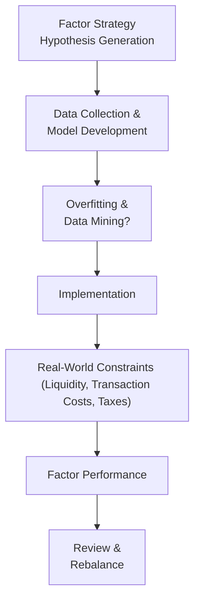

## Introduction

Factor investing sounds great on paper, right? You pick a handful of factors (like value, momentum, or quality) that historically seem to predict outperformance, then build a portfolio around them. Easy enough. But in reality, implementing a factor strategy is trickier than it looks. For one thing, many of these neat backtests are prone to data mining. And if that weren't enough, once everybody else finds out about a factor, one can watch it suddenly lose its sparkle.

In this section, we’ll dig into some common pitfalls and constraints that bedevil factor-based approaches. Think of it like peeling back the curtain in The Wizard of Oz—there’s a lot that goes on behind the scenes of those smooth, factor-driven equity curves. We'll delve into data mining bias, crowding risk, time-varying relationships, transaction costs, and how real portfolios can run into bottlenecks with liquidity. Don’t worry, we’ll also explore some ways you can keep your factor strategies (relatively) robust and how you can adapt over time.

## Overfitting and Data Mining Dangers

One of the most cited issues with factor investing is that the research process can lead to overfitting. In big datasets with thousands of potential explanatory signals, there’s almost always going to be something in the historical data that looks predictive—yet it might be complete randomness. I remember a colleague who discovered a “factor” that correlated a company’s outperformance with the average monthly temperature in that company’s global headquarters. It backtested remarkably well (on the sample he chose). But was there any legitimate reason companies in warmer areas would outperform in March? Probably not.

### Why Overfitting Happens

• Searching for Meaningful Patterns: Factor research typically rummages through large historical data. Under pressure to find signals, researchers can latch on to spurious correlations.  
• Lack of Economic Rationale: A valid factor should have some economic or behavioral explanation, not just a strong R² on your regression.  
• Data Mining Bias: Often referred to as “Data Snooping Bias,” it arises when you test multiple hypotheses on the same dataset until you stumble upon something that works—at least in sample.

### Mathematical Lens

A simplified factor model might look like:

$$
R_i = \alpha + \beta_1 \,\text{Factor}_{1,t} + \beta_2 \,\text{Factor}_{2,t} + \cdots + \beta_k \,\text{Factor}_{k,t} + \epsilon_t
$$

Indiscriminately plugging thousands of “Factors” into a model can yield statistically significant but meaningless β-coefficients. If there’s no robust rationale behind these signals, the resulting strategy might fall flat in real-world conditions.

### Importance of Robust Testing

Combatting overfitting generally requires:
• Proper out-of-sample testing.  
• Use of strong economic theory to support factor existence.  
• Cross-validation—splitting your data into training and testing periods.  
• Resampling or bootstrap methods to check the stability of factor loadings.

## The Danger of Backward-Looking Data

Historically, many factor models rely heavily on data gleaned from possibly outdated contexts. This is known as backward-looking bias. For example, a factor might look trendy in a decade with low interest rates and moderate inflation, but how well will it hold if interest rates spike?

• Structural Breaks: Regulatory or technological changes can instantly topple a seemingly robust factor.  
• Survivorship Bias: Excluding companies that went bankrupt or delisted can make factor performance appear stronger than it was. This is especially common in data sets curated by removing “unavailable” stocks.

In reality, you can’t invest backwards. So it’s crucial to keep in mind how different the future might be—and to avoid cherry-picking only the data that confirms your hypothesis.

## Factor Popularity and Crowding

So let's say you found a factor that looks promising *and* it has a sound rationale, such as “value” (where undervalued stocks might have a higher expected return). Over time, however, if everyone else invests in that same factor, you could see diminishing returns. This phenomenon is often called “crowding risk.”

### Crowding Risk Defined

Crowding risk means that when many investors chase after the same strategy (or the same set of stocks), valuations shift and the effective alpha is eroded. The more widely known a factor is, the lower its future return might be—especially if there’s no structural or behavioral reason for it to persist. A strong example is the small-cap premium. Historically robust, it’s been well-documented, and many new capital flows target small-cap strategies. But guess what? Performance can weaken once it’s part of everyone’s playbook.

### Factor Rotation Risk

Linked to crowding risk is factor rotation risk. Factors naturally go in and out of favor. A factor that soared for two or three years might suddenly lag. When lots of investors pile into a once-successful factor, it can unravel quickly if market sentiment pivots to another style or economic regime changes.

## Time-Varying Factor Relationships

It’s common to assume that certain factors “always” work, but that’s not only unrealistic—it could also be disastrous for your portfolio. Conditions such as market volatility, inflation, technological disruption, geopolitical tension, or even investor sentiment can all alter factor effectiveness.

• Momentum Factor Reversals: Momentum might work well in bull markets but can suffer mightily during regimes characterized by abrupt market downturns or strong volatility spikes.  
• Value Factor Comebacks: Value can underperform for extended stretches (as it did in the years following the Global Financial Crisis) then suddenly show a strong rebound.

In short, you can’t just buy a factor and forget about it. Periodic factor performance analysis becomes imperative.

## Implementation Challenges in Real Portfolios

Bringing a theoretical factor strategy from the whiteboard to an actual portfolio is not as easy as it sounds. Let’s say your factor model identifies 200 small-cap stocks that look promising. Actually buying them in the right weighting, at the right time, with minimal slippage, is easier said than done—especially if you’re managing a big fund.

### Transaction Costs and Taxes

• Transaction Costs: Spreads, market impact, and commissions eat away at factor-based returns. High turnover or small-cap factor approaches can amplify costs.  
• Taxes: Realized capital gains can create tax inefficiencies if your turnover is high. Nearly all factor-based investment strategies involve rebalancing, and that triggers tax events in many jurisdictions.

### Liquidity Constraints

While a model might say, “Buy 3% of this micro-cap biotech,” the real market might only have a few thousand shares trading daily. Attempting to accumulate a large position can push prices upward (or downward if you’re selling), resulting in a worse execution price. This liquidity constraint particularly hampers small-cap or niche-factor strategies.

### Operational Complexities

• Technology and Data Feeds: Maintaining accurate factor signals often requires sophisticated data pipelines.  
• Compliance and Risk Oversight: Investment managers must ensure that factor-based rebalancing aligns with internal policies and regulatory guidelines.

## Performance Dispersion

One of my favorite things to point out is that “value” isn’t defined in just one way. Some researchers use a price-to-book definition, others use price-to-earnings or enterprise-value-to-sales. Different definitions yield different portfolios—even if they’re both called “value.” So you’ll frequently see large performance dispersion for the “same” factor across different fund managers or data vendors.

• Multiple Definitions: “Momentum” can be a 6-month trailing return or 12-month trailing return, with or without skips, and so on.  
• Different Factor Weightings: Some managers might weight each factor equally, while others apply a dynamic weighting scheme.  
• Rebalancing Schedules: Annual, quarterly, or monthly rebalancing can tilt factor exposures and returns.

## Best Practices for Continuous Factor Review

Running a factor strategy requires ongoing maintenance. Markets change, and so do factors. You won’t normally want to scrap your entire factor approach just because of short-term underperformance—but you do need a plan for evaluating each factor’s validity over time.

• **Periodic Rebalancing**: Adjust factor weights in your portfolio at set intervals, considering new information on market regimes and factor performance.  
• **Factor Definition Revision**: Refine your factor definitions to incorporate better data or correct known biases.  
• **Risk Budgeting**: Monitor factor exposures to avoid unintended risk concentrations.  
• **Stress Testing**: Evaluate factor strategies under multiple “worst-case” market scenarios.

Think of it as a bit like tending a garden—sometimes your roses (factors) flourish, sometimes you uncover weeds (overfitted signals). Prune, water, fertilize, and repeat.

## Real-World Examples and Anecdotes

I once saw a Canadian equity manager rely on a classic “book-to-market” value factor. This manager performed exceptionally well for nearly a decade. But as interest rates shifted, the factor’s performance unraveled. Over the next few years, the alpha nearly disappeared. The manager decided to incorporate additional “quality” screens—like earnings stability and return on equity—to refine the factor approach. Performance gradually improved, partially because the refined factor was less correlated with pure deep-value picks that needed stable rates to thrive.

In another instance, a friend of mine attempted to trade a “reversal factor” that she’d built on daily data. It worked wonders in her backtest, but real-world transaction costs seemed to eat up all the supposed alpha. This taught me the importance of factoring in execution costs *before* you commit to a new factor-based strategy.

## Visualizing the Factor Lifecycle

Below is a simple diagram illustrating a typical cycle of factor-based strategy development, from hypothesis generation to ongoing rebalancing.

## Glossary of Key Terms

• **Data Mining Bias**: Identifying likely random patterns in a dataset without robust economic rationale, leading to spurious correlations.  
• **Implementation Constraints**: Practical considerations that hinder pure execution of theoretical strategies, such as liquidity, large trade sizes, compliance constraints, etc.  
• **Backward-Looking Bias**: Relying on historical data that may not reflect future market structures.  
• **Crowding Risk**: Excess returns erode as more investors adopt the same factor strategies.  
• **Factor Rotation Risk**: Risk that the leadership among factors shifts abruptly, resulting in sharp underperformance for previously robust factors.  
• **Liquidity Constraints**: Difficulty buying or selling in large volumes without significantly impacting market prices.  
• **Survivorship Bias**: Overstating performance by excluding or ignoring securities that dropped out of the sample due to poor performance or bankruptcy.

## Exam Tips and Practical Guidance

• **Common Pitfalls**: Data mining, ignoring transaction costs, and failing to adjust factor definitions can all lead to underperformance.  
• **Addressing Time-Varying Factors**: Evaluate macroeconomic signals and investor sentiment to understand when factors typically thrive or deteriorate.  
• **Stress Testing**: Ensure you have a plan for extreme market scenarios—especially if your factor historically suffers in high-volatility regimes.  
• **Long-Term vs. Short-Term**: A factor can lag for months or years before paying off. Make sure your investment horizon suits the factor’s cycle.  
• **Prevent Over-Diversification**: If you blindly load up on every factor you can find, you might end up diluting your strategy or inadvertently building contradictory exposures.  
• **In the Exam**: Expect scenario-based questions testing your ability to recognize data mining or to recommend the correct factor approach under certain constraints.

## References

• Bailey, D. H., Borwein, J., Lopez de Prado, M., & Zhu, Q. J. (2014). “Pseudo-mathematics and financial charlatanism.” Notices of the American Mathematical Society.  
• Harvey, C. R., Liu, Y., & Zhu, H. (2016). “… and the Cross-Section of Expected Returns.” Review of Financial Studies.  
• CFA Institute Official Curriculum – Advanced Factor Applications and Pitfalls.

---

## Test Your Understanding of Practical Limitations of Factor Approaches



### Why might data mining bias be particularly problematic for factor investing?

- [ ] Factor definitions are always clearly based on economic rationale.  
- [x] Large datasets can produce random but seemingly significant patterns.  
- [ ] Data mining always yields factors with high predictive power in the future.  
- [ ] It helps confirm that existing factors will beat the market consistently.  

> **Explanation:** With immense data sets, random correlations can appear highly significant without any genuine predictive power.

### Which of the following is a direct example of factor crowding risk?

- [ ] A factor strategy that only invests in international bonds.  
- [x] Many investors flocking to the same factor strategy, reducing its excess return.  
- [ ] The inability of an investor to locate a certain data feed.  
- [ ] The presence of conflicting rebalancing schedules among different managers.  

> **Explanation:** When too many investors trade the same factor, valuations adjust, eroding alpha.

### Which best describes factor rotation risk?

- [x] The risk that the top-performing factor shifts abruptly and previously strong factors underperform.  
- [ ] The risk that an asset’s fundamentals rotate over time, making it ineligible for factor-based strategies.  
- [ ] The risk that an investor will lose portfolio rotation instructions.  
- [ ] The risk that oversampling in a dataset biases the factor loadings.  

> **Explanation:** Factors can fluctuate in and out of favor, making perennial outperformance unreliable.

### What is one major consequence of liquidity constraints in factor investing?

- [ ] Liquidity tangibly boosts factor returns.  
- [ ] Liquidity constraints only affect emerging market stocks, not developed markets.  
- [x] Investors may face large market impact costs that reduce the theoretical alpha.  
- [ ] Liquidity constraints generally have no practical effect on factor strategies.  

> **Explanation:** Buying or selling in illiquid markets often leads to slip-page, elevating transaction costs and hurting net performance.

### Why is it important to recalibrate or review factor definitions periodically?

- [x] Market changes can degrade a factor’s original predictive power.  
- [ ] Regulators only allow periodic updates to factor definitions.  
- [ ] New laws prohibit the use of old factor definitions.  
- [x] To exploit newly discovered random signals each quarter.  

> **Explanation:** Keeping pace with changing economic conditions and avoiding outdated or spurious signals is paramount. (Note: Two correct answers to illustrate multi-select style.)

### A manager finds a small-cap factor that outperforms in backtests. Which of the following concerns is most relevant?

- [x] Data mining bias and real-world liquidity limitations.  
- [ ] The manager should expect the same performance going forward.  
- [ ] Large-cap factors mainly apply in small-cap strategies.  
- [ ] There are no constraints for implementing a small-cap factor.  

> **Explanation:** Small-cap securities often have liquidity issues, and the backtest may have uncovered spurious correlations.

### Which best explains survivorship bias in factor research?

- [x] Failing to include delisted or bankrupt stocks, thus overstating performance.  
- [ ] Reviewing both surviving and failed securities in a data sample.  
- [x] Eliminating underperforming managers from a mutual fund sample.  
- [ ] Only applying factors in well-capitalized stocks.  

> **Explanation:** Survivorship bias artificially inflates historical performance by omitting entities that exited the sample pool. (Note: Two correct answers to illustrate multi-select style.)

### What happens if a factor strategy relies too heavily on historical data without considering possible regime changes?

- [x] It may fail when future market conditions differ significantly.  
- [ ] It ensures better risk management through proven historical insights.  
- [ ] The factor becomes less prone to overfitting.  
- [ ] It outperforms in all economic cycles.  

> **Explanation:** Past relationships might not hold true under new or different macro conditions.

### Which of the following statements is true regarding transaction costs in factor investing?

- [x] High turnover can significantly eat into factor returns, especially in illiquid segments.  
- [ ] Transaction costs are negligible for all factor portfolios.  
- [ ] Factor investing never involves rebalancing trades.  
- [ ] Real-world taxes offset transaction costs entirely.  

> **Explanation:** Factor-based strategies often require regular rebalancing, meaning higher turnover and potential impact on net returns.

### Is it correct to assume that once a factor is discovered, it will continue generating alpha indefinitely?

- [x] True  
- [ ] False  

> **Explanation:** Many factors lose their efficacy over time, especially once they are widely studied and adopted by many market participants.


