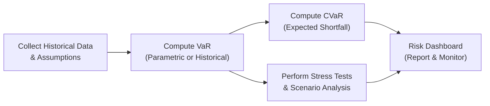

### Introduction

If you’ve ever invested in something—be it stocks, bonds, that new coffee gadget from a crowdfunding site—you’ve probably fretted about losing money. Sure, we love to talk about “standard deviation” or “variance” as the big dogs of portfolio risk. But those measures are symmetrical: they capture fluctuations both above and below your average return. Yet, in real life, investors often lose more sleep over negative outcomes than they celebrate the positives. So, when it comes to capturing the nightmare scenarios, we can’t rely solely on symmetrical risk metrics.

Downside risk measures such as semi-variance (or semi-deviation), Value at Risk (VaR), and Expected Shortfall (also known as Conditional VaR or CVaR) home in on what matters most to a lot of folks: losses. In this article, we’ll explore how these downside-focused metrics work, why they matter for portfolio management, and how you might communicate them effectively to clients. We’ll also peek at how institutional investors apply them to shape policy and asset allocation.

### Traditional vs. Downside Risk Metrics

Traditional risk measures—like standard deviation and variance—treat all deviations from the mean, whether positive or negative, as equal. This is nice mathematically, but it doesn’t fully capture the psychological or practical reality for many investors who fundamentally dislike losses more than they enjoy gains. Enter downside risk metrics. These metrics often concentrate on returns that fall below a certain threshold (for instance, 0%, or some target return).

• In periods of market stress, standard deviation might underestimate the true stress for investors who fear negative returns disproportionately.  
• Downside measures remember that not all risks carry the same sting—focusing more on losses, which are frequently the biggest worry.  

### Key Downside Risk Measures

#### Semi-Variance

At a high level, semi-variance measures the average of squared (negative) deviations below a particular target or mean. So, if you want to focus on returns below 5% (say, your typical annual objective), you only calculate how far each sub-5% outcome deviates from that threshold.

• Formula (conceptual view):  
  Semi-variance = (1 / n₍below₎) Σ (threshold − Rᵢ)², for each Rᵢ < threshold

  Where:  
  – threshold could be the mean or a chosen required return  
  – Rᵢ is an individual return observation  
  – n₍below₎ is the count of observations below the threshold  

Why is this potentially better than variance? Because we’re capturing the distribution of “bad” returns more directly. Let’s say your portfolio typically returns about 7%, but you get an occasional −3% or −10%. Semi-variance is going to spotlight those negative outliers more than standard deviation, which lumps upside and downside together.

#### Value at Risk (VaR)

Value at Risk (VaR) basically asks: How bad can it get with some fixed level of likelihood? For instance, at the 95% confidence level, a 1-day VaR of $1 million means there is a 5% chance your portfolio could lose more than $1 million in one day. Note that VaR does not say “it will only lose $1 million maximum.” It just says that with 95% confidence, the loss won’t exceed $1 million, and there’s a 5% chance it could be worse.

• Historical Simulation VaR: Using historical data, we observe actual past returns (e.g., the last X years) to gauge potential future losses. The advantage is that it captures real market movements (including extremes), but the big question is whether the past is a good predictor of the future.  
• Parametric VaR (Variance-Covariance): Assumes returns follow a certain distribution (commonly normal). You just input mean and standard deviation to estimate your loss threshold. It can be simpler to compute, but if markets are not normal (fat tails, skewness, etc.), this approach might underestimate (or misestimate) risk.  

#### Expected Shortfall (CVaR)

Sometimes, VaR is criticized for ignoring how terrible losses might get once you surpass that threshold. Expected Shortfall, also called Conditional VaR (CVaR), tries to fix that. CVaR is the average of losses that exceed a particular VaR threshold. If VaR is the question, “Where does the worst 5% start?” then CVaR is, “Okay, once we’re in that worst 5%, how bad is it on average?”

• Formula (simplified idea):  
  CVaR = E[L | L > VaR(α)]  
  where L is the portfolio loss, and VaR(α) is the loss at the α confidence level.  

This measure helps risk managers see beyond a single cutoff point and understand just how deep the hole might get in truly bad scenarios (that last 5% tail).

### Why Downside Metrics Matter for Investors

1. Client Psychology: Let’s face it—clients hate to lose money, and they often exhibit loss aversion. Downside-focused measures align better with that real-world fear.  
2. U-Shaped or Asymmetric Distributions: Many asset classes (like certain hedge funds, structured products, private equity) can have “lumpy” return distributions. Downside measures might be more representative.  
3. Market Stress Situations: During a market crash, standard deviation might not capture the extremity of possible plunges if we assume normality. But a historical or scenario-based downside measure can.  
4. Low Risk Tolerance: For clients who absolutely dread significant drawdowns or negative outcomes, focusing on downside metrics is critical in building a suitable portfolio.  

### Semi-Variance in Practice

Imagine you have a set of monthly returns for your portfolio, and your target return is 1% per month (roughly 12% annualized, though annualizing can vary by compounding assumptions). If the distribution of actual monthly returns is mostly positive but occasionally negative, you can compute:

• Subset of returns below 1%.  
• Calculate squared deviations of these returns from 1%.  
• Take the average.  

The resulting figure is your semi-variance (and the square root of that is semi-standard deviation). By only looking at that “below-target” zone, you’re capturing a lens on how “disappointing” the returns might be month over month.

### Institutional Usage: Policy Limits and Asset Allocation

Institutional investors often have statements like, “We can’t tolerate more than a 5% monthly VaR of $X million,” or “Our CVaR at 99% must not exceed 10% of portfolio capital.” These policy limits might drive changes to asset allocation. For example:

• If a fund sees that its 99% CVaR is uncomfortably high, it might reduce exposure to highly volatile sectors or hedge with derivatives.  
• Pension funds might keep track of semi-variance relative to a liability benchmark. They want to know specifically how badly their assets underperform the growth of their liabilities in dire scenarios, because that’s what truly threatens their solvency.  

### Approaches to Calculating VaR and CVaR

Now, about VaR and CVaR approaches—two big families exist:

1. **Historical Simulation**  
   – Pros: Doesn’t assume a particular distribution; leverages real market events.  
   – Cons: Past events might not predict future crises. If you have a short historical window, you miss past recessions or extreme tail events.

2. **Monte Carlo (Forward-Looking Simulation)**  
   – Pros: You can basically dream up thousands of plausible future scenarios under various assumptions, including potential tail events.  
   – Cons: Heavy modeling assumptions. Garbage in, garbage out. Create a flawed model, and your simulation-based VaR or CVaR might be off.

For instance, you might do a Monte Carlo approach and tweak volatility or correlation assumptions to see how your portfolio might behave in a meltdown. That can highlight weaknesses or potential tail risk.

### Interpreting These Measures in Client Communications

Talking about VaR with clients is tricky. You’ll hear folks say, “You have a 1% VaR of $50,000,” and the client might interpret that as “My max loss is $50,000.” Actually, no. The correct phrasing: “There’s a 1% chance you could lose $50,000 or more within this time frame.” That means losses could be $60,000, $100,000, or $500,000—VaR just gives you the threshold. So conveying that nuance is critical.  

Below are a few tips for discussing downside metrics with clients:  

• Use visual aids: Graph distributions of returns, highlighting the tail.  
• Discuss how these metrics are estimates, not guarantees.  
• Emphasize that extreme tail risks (e.g., a major market meltdown) might still surpass your VaR or CVaR calculations.  

### Common Pitfalls and Challenges

1. **Over-Reliance on Past Data**: We might rely too heavily on historical data that feels “normal,” forgetting black swan events that didn’t show up in our sample.  
2. **Misunderstanding Confidence Levels**: A 99% VaR level is not “99% safe.” It’s about the probability, not the magnitude, of the worst outcomes.  
3. **Ignoring Non-Normal Distributions**: Parametric VaR is neat if returns are normally distributed, but many asset classes exhibit skewness and kurtosis (long tails, or “fat tails”).  
4. **Implementation Complexity**: Monte Carlo VaR or CVaR can be computationally intensive and demands a robust infrastructure and skill set.  
5. **Client Deception**: If you present VaR or CVaR without clarifying it’s a model-based statistic, clients might interpret it as an absolute guarantee—leading to potential misunderstandings.

### Stress Testing and Tail Events

Stress tests try to explore “what if” scenarios that might never show up in your historical data sample—like a major currency crisis, pandemic, or other unexpected meltdown. These tests can highlight vulnerabilities that VaR alone doesn’t catch. You might, for example, apply a large interest rate shock or a big equity crash to see how your portfolio performs. While these scenarios can be hypothetical, they help you gauge how robust your portfolio might be in extreme times.

Here’s a simple Mermaid diagram to illustrate how different risk assessment components (VaR, CVaR, Stress Tests, etc.) feed into an overall risk framework:

This flowchart shows how you might gather data, compute VaR, refine with CVaR, then add stress tests for a holistic view.

### Practical Example: A Pension Fund’s Pain Points

Let’s say we have a pension fund with a set liability growth rate of 5% per year. They might define a “downside threshold” of any returns below 5% as “risk.” Then:

• Semi-variance: They calculate it to see how erratic their returns are when underperforming that 5%.  
• Historical VaR at 95%: They look at 10 years of monthly returns and find that 5% of the time, monthly losses exceeded 3%. So their 95% VaR for a one-month horizon is 3%.  
• Expected Shortfall: Among the months that were worse than −3%, the average was −8%. So their CVaR at 95% is 8%.  

They might set a policy, for example: “We aim to keep the 95% CVaR under 10%,” meaning they don’t want the average of that worst 5% tail to be more than 10% in monthly losses. If it surpasses that figure, the CIO might reduce equity exposure, use derivatives to hedge, or move into more stable fixed-income instruments.

### Advantages and Drawbacks of Downside Measures

• **Advantages**:  
  – More relevant to investors who prioritize capital preservation.  
  – Captures distribution asymmetry (especially if returns are heavily skewed).  
  – Useful in stress times and with risk-averse clients.  

• **Disadvantages**:  
  – Information intensive; requires good data and robust modeling.  
  – VaR and CVaR can underestimate tail risk if the assumed distribution is too simplistic.  
  – Historical approaches can mislead if the market conditions dramatically change.  

### Best Practices for Portfolio Managers

• Use Multiple Metrics: Combine standard deviation, VaR, CVaR, and scenario analysis. Each has distinct strengths and weaknesses.  
• Reflect on Liquidity and Non-Financial Risks: Sometimes the biggest losses come from forced selling in illiquid markets. Downside metrics should complement liquidity tracking.  
• Communicate Clearly: If you drop a capital letter acronym like “VaR” or “CVaR” on a client, that’s jargon. Instead, communicate in plain language: “We’d like to ensure the chance of losing more than X in any given month is no greater than 5%.”  
• Update Regularly: Risk is dynamic. Maybe you run monthly or even weekly updates, especially in volatile periods.

### Closing Thoughts

Downside risk metrics offer a thoughtful way to capture what truly keeps many investors (and portfolio managers) up at night: the fear of a big loss. While none of these measures guarantee we won’t be caught off guard (because real markets can be extremely surprising), they help us better tune portfolios to risk tolerances, especially when combined with scenario analysis and stress testing.

Semi-variance, VaR, and CVaR aren’t just academic exercises—they guide our risk budgets, help shape conversations with clients, and (hopefully) help us sleep better by preparing for a wide range of negative outcomes. Of course, we still want to keep an eye on integrative measures and do a bit of an internal “sanity check” on these numbers from time to time, just to be sure we’re not missing some hidden risk factor.  

### Final Exam Tips

• Understand the formulas, but also grasp the conceptual difference between symmetrical and downside risk measures.  
• Be prepared to compare VaR, CVaR, and semi-variance, especially in scenario-based questions that highlight tail risk or major drawdowns.  
• Practice doing quick back-of-the-envelope calculations (e.g., approximate historical VaR from sample returns in a small data set).  
• Watch out for disclaimers about assumptions—for parametric VaR in particular.  
• Emphasize how to interpret these metrics for non-technical audiences, as exam questions often test your ability to communicate in plain language.

### References and Further Reading

• Jorion, P. (2007). “Value at Risk: The New Benchmark for Managing Financial Risk.” McGraw-Hill.  
• Sortino, F. & Van der Meer, R. (1991). “Downside Risk.” Journal of Portfolio Management.  
• CFA Institute Official Curriculum – Risk Management chapters.  

If you’d like to dive deeper, you might also explore specialized risk management courses or advanced textbooks on quantitative finance. As you build out your toolbox of risk measures, keep down the path of scenario planning, stress testing, and good old-fashioned common sense. They’ll serve you well in the turbulent seas of real-world markets.

---

## Test Your Knowledge: Downside Risk Measures in Portfolio Management



### Using Semi-Variance
- [x] It focuses on returns below a specified benchmark or threshold.
- [ ] It measures both positive and negative deviations from the mean.
- [ ] It cannot be used with monthly data.
- [ ] It cannot be annualized.

> **Explanation:** Semi-variance homes in on underperformance relative to a benchmark (negative deviations only), making it different from variance, which assesses deviations above and below the mean.

### Interpret VaR Correctly
- [ ] It indicates the maximum loss one could ever experience.
- [x] It indicates the threshold loss such that the probability of exceeding it is a given level.
- [ ] It is always accurate, even if returns do not follow a normal distribution.
- [ ] It represents the guaranteed amount you will lose in a crisis.

> **Explanation:** VaR is a threshold value where there is a given probability (like 1% or 5%) that actual losses could exceed that threshold. It does not guarantee the maximum possible loss.

### Highest Relevance for Low-Risk Tolerance Portfolios
- [x] Downside risk measures are especially valuable because they highlight the magnitude of potential losses.
- [ ] Standard deviation is enough to capture any type of risk concerns for these portfolios.
- [ ] Historical VaR is not applicable for low-risk tolerance clients.
- [ ] Semi-variance cannot be used to analyze portfolios with low-risk constraints.

> **Explanation:** Clients who are very sensitive to losses will find more comfort in measures that specifically gauge downside outcomes, like VaR, CVaR, and semi-variance.

### Expected Shortfall (CVaR)
- [ ] Is limited to parametric assumptions.
- [ ] Ignores losses in the tail.
- [ ] Is always less than VaR.
- [x] Averages the losses that exceed the VaR threshold.

> **Explanation:** CVaR (Expected Shortfall) takes the average loss over the worst portion of the distribution that is beyond the VaR cutoff, thereby delving deeper into tail risk.

### Monte Carlo VaR
- [x] It uses simulated return paths based on assumed distributions and correlations.
- [ ] It strictly depends on historical returns only.
- [ ] It does not allow for any scenario testing.
- [x] It can help model extreme events if properly calibrated.

> **Explanation:** Monte Carlo methods simulate numerous possible future return paths. They can incorporate extreme stress scenarios, but the quality depends heavily on the underlying assumptions.

### Historical Simulation VaR
- [x] Relies primarily on past data to estimate future risk.
- [ ] Is the same as a parametric model assuming normal distribution.
- [ ] Excludes actual extreme market events to avoid bias.
- [ ] Matches Monte Carlo VaR outputs exactly.

> **Explanation:** Historical simulation VaR uses realized historical returns to project the range of losses. It has no set distributional assumption but is limited by the representativeness of historical data.

### Communicating VaR to Clients
- [x] Emphasize that VaR does not represent the absolute worst-case scenario.
- [ ] Present VaR as the final, guaranteed maximum loss figure.
- [x] Use probability language such as “chance of exceeding X in losses.”
- [ ] Tell clients VaR is not subject to estimation errors.

> **Explanation:** VaR needs careful communication: it’s a threshold for potential loss, not a definitive maximum. There are modeling and estimation limitations to keep in mind.

### Semi-Variance vs. Semi-Deviation
- [x] Semi-deviation is the square root of the semi-variance.
- [ ] Semi-deviation is always lower than the standard deviation by definition.
- [ ] These terms are unrelated.
- [ ] Semi-variance includes both downside and upside risk.

> **Explanation:** Semi-deviation is simply the square root of the semi-variance, focusing on negative return dispersions relative to a specific threshold.

### Stress Testing
- [x] Probes how portfolios fare under extreme, hypothetical conditions.
- [ ] Is limited to normal market fluctuations.
- [ ] Cannot assess interest rate shocks.
- [ ] Always produces the same results as VaR estimates.

> **Explanation:** Stress testing is a powerful technique for exploring extreme, sometimes hypothetical conditions that may not appear in the normal historical record.

### Downside Risk Metrics
- [x] True
- [ ] False

> **Explanation:** True. Downside risk metrics focus on the negative tail of the return distribution, making them particularly crucial for investors concerned with potential losses beyond typical market fluctuations.


