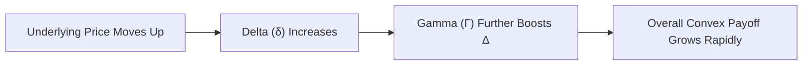

## Introduction

Have you ever looked at a portfolio and felt a bit uneasy, like something bigger might be lurking beyond what our standard models show? Sometimes, if you’ve got complex derivatives or other embedded options in that portfolio, it can lead to these big, unexpected surprises. We generally label that phenomenon “non-linearity.” Basically, the payoff isn’t a simple, straight line anymore. Instead, it bends and twists, especially in extreme market conditions. And that’s exactly what this section is about: how non-linearity can create unexpected outcomes in portfolios and how that risk can grow into truly outsized “tail” events.

In classical mean-variance analysis, we usually assume returns follow a nice symmetrical (normal) distribution. But we all know real-life returns can be anything but symmetrical. Sometimes the distribution is “skewed,” revealing the possibility of bigger losses than you’d expect, or it can have “fat tails” (high kurtosis) that lead to more extreme events. These “fat tails” might mean that some unusual meltdown in the market could really hurt your portfolio, even though the probability of that meltdown was estimated to be super small under a normal distribution.

In the sections below, we’ll dig into the factors that drive non-linear risks, show practical ways to identify them, and share real-world episodes (like the LTCM crisis or 2008 meltdown) where such risks became painfully visible. We’ll also look at hedging tools, such as out-of-the-money puts, to see how they can protect your downside when everything else goes haywire.

## Understanding Non-Linearity in Risk Profiles

Traditional risk models depict linear relationships either between a portfolio and its factors or between an underlying asset and its derivative. But as soon as optionality or structured payouts creep in, watch out: your typical linear factor assumptions don’t hold. Instead, your portfolio starts to exhibit convex or concave payoffs.

• Convex Payoffs: These are often associated with call or put options. A call option, for example, offers potentially unlimited gains if the underlying keeps rising, but it limits your downside to the option premium if the underlying tanks.  
• Concave Payoffs: These show up with certain structured products that promise a limited upside but risk bigger losses beyond a threshold. Think of some leveraged exchange-traded products that can lose significant value in volatile markets.

The essence of non-linearity is that the change in a portfolio’s value is not proportional across the full range of outcomes. If the price of the underlying security moves a little, your portfolio value might move just a bit; however, if it crosses some critical point (like an option’s strike), your portfolio value could swing wildly.

## Impact on Return Distributions: Skewness and Kurtosis

One hallmark of portfolios with non-linear exposures is that their return distributions can become highly asymmetric (indicated by **skewness**) and exhibit “fat tails” (indicated by **kurtosis**).

• **Skewness:** This measures the asymmetry. A negative skew suggests the distribution’s left tail (loss side) is longer or fatter, meaning the portfolio might have a higher risk of big losses than a normal distribution would suggest. A positive skew highlights a longer or fatter right tail, signifying a higher chance of outsized gains.  

• **Kurtosis:** If you ever hear the phrase “fat tails,” that’s basically high kurtosis. It indicates that outcomes far away from the mean are more likely than predicted by a normal distribution. High kurtosis often points to a greater probability of extreme outcomes—both on the upside and the downside.

Now, let’s be clear: having high skewness or kurtosis isn’t always “bad.” Some hedge funds harbor positive skewness, meaning occasional big wins. But big negative skew is another story. That’s the portfolio that might feel stable most of the time but then experiences a colossal meltdown out of the blue.

## Non-Linearity from Derivatives and Structured Products

Ever notice how purely linear instruments (like a basic stock or bond) can transform into something more complicated the moment you add an option collar or a structured instrument into the mix? That’s because derivatives, by design, alter your payoff profile in ways that aren’t typical. Here are some essential concepts:

• **Option Delta** and **Gamma Exposure**:  
  – The delta is how much an option price changes if the underlying asset price changes by a small amount.  
  – Gamma is how much the delta changes when the underlying price changes. So if suddenly your underlying moves a lot, gamma can amplify or reduce the overall effect on your portfolio, creating that classic curvature in the payoff profile.  

• **Structured Products**:  
  – Suppose you have a structured note that offers you upside if an index stays within a certain range but knocks out your principal protection if the index falls beyond a threshold. This product’s payoff is inherently non-linear.  

• **Convexity**:  
  – Any time you have convexity (like in a standard long call option position), gains accelerate as the underlying runs. But if you’re short an option, you’re on the opposite side and your losses can ramp up dramatically in extreme price moves.

A quick, somewhat personal memory: A friend of mine bought a structured note promising a steady yield if oil stayed within $50–$80 per barrel for a year. And guess what happened? Oil collapsed to $30. The product’s “capital protection” was compromised, and he faced severe losses that he never expected. It was a painful reminder that non-linear risk is real—and sometimes not that obvious if you only look at expected returns in normal times.

## Visualizing Non-Linear Payoffs

Let’s try to illustrate the concept of increasing gamma and convex payoffs in a flowchart. Even though a line chart might be more typical for option payoffs, here’s a simple Mermaid.js flowchart describing how an upward move can lead to amplified changes if you have positive gamma exposure:

This is an oversimplification but highlights the feedback loop behind gamma. When your underlying moves in the option’s favor, your delta picks up steam, which can significantly amplify gains (or losses if you’re short the option).

## Scenario Planning and Stress Testing for Tail Risk

Portfolio managers often rely on historical return data to forecast future risk. That can be okay for ordinary times, but as we learned from the 2008 financial crisis, “ordinary times” can lull us into complacency. Stress testing and scenario analysis become crucial because they help you see how your portfolio might behave in extraordinary conditions.  

Here’s a typical approach:

1. Identify Potential Stressful Events:  
   – Market crashes, liquidity freezes, interest rate spikes, or macro catastrophes.  

2. Estimate Parameter Changes:  
   – Suppose you assume equity markets drop by 30%, or oil plunges like it did in 2014–2015.  
   – Input these new assumptions into your portfolio model.  

3. Measure Impact on Portfolio Value and Exposures:  
   – Watch out for derivative “knock-in” or “knock-out” features.  
   – Evaluate how your portfolio’s total delta or gamma changes.  

4. Adjust for Feedback Loops and Correlation Spikes:  
   – In a crisis, correlations often surge.  

5. Plan Mitigations:  
   – Identify potential hedges, rearrange positions, or raise adequate cash buffers to withstand severe shocks.

In particular, “black swan” events, made famous by Nassim Nicholas Taleb, are the unpredictable, high-impact events that are almost impossible to anticipate using standard models. But with scenario planning, you at least try to imagine what might happen if the improbable occurs—and whether your portfolio gets hammered in that scenario.

## Real-World Examples: LTCM and the 2008 Crisis

• **LTCM Crisis (1998)**:  
  Long-Term Capital Management (LTCM) was a famous hedge fund run by genius-level folks (including Nobel Prize winners). They believed their highly leveraged bond convergence trades were near-riskless, based on historical behavior. But when the Russian debt default happened, cross-market correlations changed abruptly. LTCM’s leveraged derivatives created massive non-linear exposures, and the losses spiraled, prompting a Federal Reserve–coordinated bailout.  

• **2008 Global Financial Crisis**:  
  Structured mortgage products (CDOs, MBSs) were believed to be stable due to apparently uncorrelated housing markets. But once housing prices declined across multiple regions in the U.S., the embedded optionality (prepayments, defaults) created non-linear meltdown effects. Suddenly, those AAA tranches turned out to have far greater tail risk than most investors realized.

Both episodes underscore that standard deviation alone doesn’t cut it. A portfolio may seem calm under typical volatility assumptions, but once non-linearities or correlation breaks show up, potential losses can be enormous.

## Tail-Risk Hedging

As the name suggests, **tail hedging** is all about putting on positions that lessen the damage from those severe left-tail events.

• **Out-of-the-Money (OTM) Puts**:  
  – Buying OTM puts on an equity index provides an insurance-like payoff if there’s a big market drop.  
  – Sure, it might be a drag on returns in normal times because you pay the premium. However, it’s comforting when the market collapses.  

• **Protective Put Structures**:  
  – Some investors overlay protective puts on their entire equity portfolio. This might involve purchasing put spreads to reduce the overall cost.  

• **Volatility-Based Hedges**:  
  – During crises, volatility often spikes. Instruments like VIX options or futures can offset some meltdown risk if volatility surges.  

• **Dynamic Strategies**:  
  – Some managers implement dynamic hedging, adjusting positions as the market moves. This can be complicated because of path dependency and transaction costs, but it allows you to keep pace with rapidly changing exposures.

There’s a bit of a debate in the investment world: is paying for tail hedges worth it if tail events are extremely rare? The answer depends on your risk tolerance, the portfolio’s objectives, and how severely a catastrophic event would impact you or your clients. Many see it like insurance: you hope you never need it, but you’re very glad to have it when disaster strikes.

## Mitigating Non-Linear Risks in Practice

You might ask, “How do I put this into action if my portfolio is stuffed with derivative exposures?” Let’s break down a practical approach:

• **Identify Non-Linear Exposures**:  
  – Catalog all derivative positions, structured notes, or contingencies such as convertible bonds.  
  – Estimate the “Greeks” (Delta, Gamma, Vega, Theta) to understand sensitivity to underlying market changes.  

• **Incorporate Greek Exposures into Risk Models**:  
  – Standard mean-variance models might ignore convexity. Factor in how quickly an instrument’s payoff curve changes as the market moves.  

• **Perform Sensitivity Analysis**:  
  – Shift underlying prices or factors by plausible extremes (e.g., a 30% equity drawdown, a 200-basis-point yield jump, or a big currency movement) to see if and where the portfolio experiences large drawdowns.  

• **Stress Testing**:  
  – Combine multiple shocks. For instance, test what happens if equities drop 20% *and* interest rates surge 150 bps.  

• **Implement Tighter Risk Checks**:  
  – At LTCM, the downfall was partly due to excessive leverage. Keep an eye on your margin usage and potential margin calls triggered by even small changes in market variables.  

• **Evaluate Tail Hedging Solutions**:  
  – If your risk tolerance is low, or your liability obligations can’t handle big drawdowns, consider overlaying OTM put strategies or other downside hedges.  

• **Ongoing Monitoring**:  
  – Non-linear exposures change over time as the underlying market moves. Hence, it’s not a set-it-and-forget-it approach. You need dynamic or periodic re-assessments.

## Best Practices, Pitfalls, and Practical Applications

• **Best Practices**:  
  – Make sure your risk management team (or you, if you’re the risk manager) regularly runs scenario analyses.  
  – Diversify across multiple asset classes, but remember correlations can surge in a crisis.  
  – Watch those “hidden” options. Even standard corporate bonds can have embedded call features or extension risks.

• **Common Pitfalls**:  
  – Overreliance on historical volatility and correlation.  
  – Believing a “balance sheet meltdown can’t happen to me” because your trades performed well historically.  
  – Failing to account for changing market microstructure in periods of stress (liquidity might vanish).  

• **Practical Uses**:  
  – Insurance companies or pension funds might rely on tail hedges because they have to meet long-term obligations no matter how nasty the market gets.  
  – Hedge funds may short volatility or buy cheap optionality if they have a specific view on market dislocations.  
  – High-net-worth individuals sometimes preserve wealth through “catastrophe insurance” in the form of put options or dynamic hedging strategies.

## Final Thoughts on Non-Linearity and Tail Risk

Non-linearity in portfolios can be a silent threat (or opportunity, depending on your positioning). A portfolio might look safe under typical conditions but harbor huge tail hazards in a crisis. I’ve seen some folks sleep far better at night knowing they have an out-of-the-money downside put in place as a cushion. Yes, it costs something (like paying insurance premiums), but it’s often worth the peace of mind—or, in more official terms, ensuring your portfolio’s long-term survival.

If you combine robust scenario planning, stress testing, and an understanding of your portfolio’s non-linear payoffs, you’re already ahead of many market participants. Recognize that black swans might still show up, but with the right hedges, capital buffers, and risk governance, you’ll hopefully avoid the bigger pitfalls.

## Exam Tips

• When tackling **constructed response** questions, if you’re asked about non-linear risk, be sure to mention both the impact on distribution shape (skewness and kurtosis) and the mechanics of derivatives (option delta, gamma, etc.).  
• Emphasize how “fat tails” can invalidate plain-vanilla risk measures like standard deviation or value-at-risk if not adjusted for real-world tail dependencies.  
• In **item set** problems, carefully read the scenario for embedded options or structured notes. Indicate how to hedge or stress test these complexities.  
• Practice solution clarity: the CFA exam often rewards succinct, well-structured answers. Identify the risk, quantify it if possible, propose a sensible strategy (like tail hedging), and explain the trade-offs.  

## References

- Taleb, N. N. (2007). The Black Swan: The Impact of the Highly Improbable. Random House.  
- Cont, R. (2001). Empirical properties of asset returns: stylized facts and statistical issues. Quantitative Finance.  
- CFA Institute Official Curriculum – Advanced Derivatives and Risk Management.  

## Test Your Knowledge: Non-Linearity and Tail Risk



### Which of the following best describes skewness in a return distribution?

- [ ] The probability of scenarios in the middle of a return distribution.  
- [ ] The change in interest rate sensitivity over time.  
- [x] The measure of asymmetry in a return distribution.  
- [ ] An indicator of correlation between two assets.  

> **Explanation:** Skewness highlights how the distribution of returns may not be symmetrical. A negative skew suggests a long left tail (potential for large negative returns).

### A portfolio that includes large amounts of short call options on an equity index is likely to demonstrate which characteristic?

- [ ] Positive skewness in its return distribution.  
- [ ] Insensitivity to price movements.  
- [x] Negative skewness in its return distribution.  
- [ ] Chaos when underlying prices are stable.  

> **Explanation:** A short call position can expose the investor to unlimited losses if the underlying soars, creating negative skewness.

### One reason why tail risk hedging (e.g., buying OTM puts) may be worthwhile is:

- [x] It can protect against unpredictable, large market drops that exceed normal expectations.  
- [ ] It always generates positive returns during calm markets.  
- [ ] It eliminates the need for risk budgeting.  
- [ ] It reduces correlation spikes in a crisis.  

> **Explanation:** Tail hedging helps limit losses in extreme downturns, even though it involves a premium cost in normal markets.

### Which statement about high kurtosis in a return distribution is most accurate?

- [ ] It shows a lower probability of extreme events than with a normal distribution.  
- [x] It indicates that extreme outcomes (in both tails) occur more frequently than in a normal distribution.  
- [ ] It guarantees that the distribution’s mean is zero.  
- [ ] It cannot coexist with skewness.  

> **Explanation:** High kurtosis means “fat tails,” implying a greater likelihood of extreme positive or negative outcomes compared to a normal distribution.

### LTCM’s downfall was mainly due to:

- [ ] Holding too much cash in underperforming assets.  
- [ ] Not using enough borrowed leverage.  
- [x] Non-linear exposures that were highly leveraged, amplified by sudden changes in market correlations.  
- [ ] Trading only plain vanilla stocks without any derivatives.  

> **Explanation:** LTCM’s complex, leveraged derivatives bets became very sensitive to unexpected market shifts, resulting in catastrophic losses.

### Which factor typically contributes to non-linearity in a portfolio's overall exposure?

- [ ] A concentration in plain-vanilla treasury bonds.  
- [ ] Continuous rebalancing of index funds without derivatives.  
- [ ] Using a single risk factor model.  
- [x] Embedded options or derivative products that alter the payoff curve.  

> **Explanation:** Portfolios containing options or other derivatives deviate from linear performance because payoffs can jump or flatten based on the underlying’s price.

### How do scenario analyses help in managing tail risk?

- [x] They allow investors to envision portfolio outcomes under extreme market conditions.  
- [ ] They eliminate credit risk from defaulting counterparties.  
- [ ] They ensure that the market never becomes illiquid.  
- [ ] They reduce the time horizon needed for investments.  

> **Explanation:** Scenario analyses or stress tests estimate the impact on portfolios under severe, hypothetical market disruptions.

### Which of the following statements regarding gamma is correct?

- [ ] Gamma measures the average correlation between two assets.  
- [x] Gamma measures how an option’s delta changes with changes in the underlying asset price.  
- [ ] Gamma is always negative for a long call position.  
- [ ] Gamma is irrelevant to tail risk.  

> **Explanation:** Gamma captures the rate of change in an option’s delta. High gamma can lead to accelerated gains on the upside for a long option, or accelerated losses if the market moves against a short option position.

### A common pitfall in modeling non-linear risk is:

- [x] Assuming normal distributions for returns and ignoring correlation spikes.  
- [ ] Incorporating skewness and kurtosis into the model.  
- [ ] Using scenario analysis and stress tests.  
- [ ] Designing structured notes that cap upside potential.  

> **Explanation:** Many traditional models rely on normal distribution assumptions, missing the importance of skewness, kurtosis, and correlation changes.

### True or False: Tail hedging strategies, such as buying out-of-the-money puts, completely remove the need for diversification.

- [ ] True  
- [x] False  

> **Explanation:** Tail hedging can mitigate major downside risks, but it does not eliminate all risk exposures. Diversification remains an essential part of risk management.


