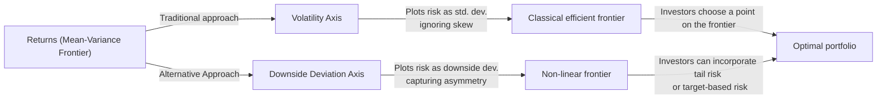

## Introduction

I remember the first time I tried building a portfolio strictly with mean–variance optimization. It was pretty exciting—like, “Hey, I’m doing exactly what Markowitz taught me to do!” But it didn’t take long to realize that simply balancing average returns against standard deviation might overlook some pretty big concerns—like those nasty tail risks, or the difference between upside and downside volatility. It felt a bit like I was driving a fancy new sports car but ignoring a weird sound in the engine.

In traditional finance, we often measure “efficiency” using the relationship between expected returns and volatility. But you know, in the real world, risk is more nuanced. Standard deviation lumps together upside deviations (you’re doing better than expected) and downside deviations (you’re faring worse). Many investors—especially those who really can’t afford large drawdowns—care more about avoiding big losses than about missing out on big gains. That’s where alternative efficiency metrics come in. They take a closer look at how much of your risk is truly “bad” risk and how your returns are distributed relative to different thresholds.

These alternative metrics include the Sortino ratio, the Omega ratio, and the upside potential ratio, among others. Instead of just penalizing all volatility, they distinguish between good volatility (returns that beat your target) and bad volatility (returns that fall short). Let’s talk about how these tools add value beyond traditional mean–variance metrics and how they show up on a non-linear “efficiency frontier.”

## The Rationale for Alternative Efficiency Metrics

The classic mean–variance framework simplifies risk into one neat number: standard deviation. That’s neat in theory, but we all know returns can get skewed. An investor might think: “I’m okay with a lot of volatility if it’s on the upside.” In other words, some forms of volatility are more welcome than others.

• Tail Risk and Asymmetry: Many investment returns are not distributed normally. Real-world portfolios can have fat tails (kurtosis), skewed distributions, and correlations that change in stressed markets.  
• Differentiation of Upside vs. Downside: Think of it this way—why treat “outperforming your target” as equally risky as “underperforming your target”?  
• Advanced Utility Functions: Some investors explicitly account for downside risk aversion or have unique liability structures (like pension funds). Their utility might be tied more strongly to avoiding low returns than to achieving high returns.

When we move beyond the classic Sharpe ratio (which uses total volatility in the denominator), we start seeing metrics that highlight the different shapes of the return distribution.

## Key Non-Mean–Variance Metrics

### Sortino Ratio

The Sortino ratio modifies the Sharpe ratio by focusing only on downside risk. Instead of using total standard deviation, it uses downside deviation—i.e., the standard deviation of returns that fall below a specified threshold (often the risk-free rate or another “required return”). 

Mathematically:

\text{Sortino Ratio} = \frac{R_p - R_f}{\text{Downside Deviation}}


Where \\(R_p\\) is the portfolio return, \\(R_f\\) is the risk-free rate (or another threshold), and \\(\text{Downside Deviation}\\) is:

\sqrt{\frac{\sum_{t=1}^T \min(R_t - R_f, 0)^2}{T}}


Think of it like this: The Sortino ratio says, “Only penalize me for returns that are below the target return. Because I don’t mind being above the target!” It’s kind of like measuring how often you stub your toe, ignoring all those times you’re just walking around barefoot without any pain.

### Omega Ratio

The Omega ratio offers a broader perspective by comparing the probability-weighted gains versus losses relative to a threshold return. Essentially, it integrates the entire return distribution above and below the threshold to see how favorable the distribution is.


\text{Omega}(\tau) = \frac{\int_{\tau}^\infty \left[ 1 - F(r) \right] dr}{\int_{-\infty}^\tau F(r) dr}


where \\(\tau\\) is the threshold and \\(F(r)\\) is the cumulative distribution function (CDF) of returns. A ratio above 1.0 indicates that the probability-weighted returns above the threshold outweigh the shortfalls below the threshold. It’s super flexible, because you can choose any threshold \\(\tau\\). Want to see your Omega relative to a 5% annual return? Or 0%? Or inflation plus some margin? No problem.

### Upside Potential Ratio

The upside potential ratio (UPR) zeroes in on how much of your returns exceed a target rate and compares that to a measure of downside risk—often the same downside deviation used in the Sortino ratio.


\text{Upside Potential Ratio} = \frac{\frac{1}{T}\sum_{t=1}^T \max(R_t - \tau, 0)}{\text{Downside Deviation}}


where \\(\tau\\) is your chosen target. It tries to capture how much “good news” you’re getting for each unit of “bad news” risk, which can be especially relevant for alternative portfolios that have an asymmetric return distribution, such as hedge funds or private equity.

## Non-Linear Efficiency Frontier

In normal mean–variance space, the “Efficient Frontier” is the set of portfolios that maximize return for a given standard deviation. But if you define risk in a new way—like downside deviation or “expected shortfall”—that changes the shape of your frontier entirely. It’s a “non-linear” or “alternative” efficiency frontier, one that might look quite different from the classic bullet-shaped mean–variance frontier you see in textbooks.

Below is a simple Mermaid diagram to illustrate the general idea of how a non-linear frontier might curve differently than the traditional mean–variance frontier:



In this diagram, the horizontal axis can represent either standard deviation or an alternative measure like downside deviation. The shape shifts when you swap out metrics.

## Practical Implementation

### Software Integration

Most institutional and professional-grade portfolio analytics tools allow you to plug in these alternative metrics right alongside the Sharpe ratio. You might see a dashboard that displays everything from standard deviation to Value at Risk (VaR) to the Sortino ratio in real time. But be warned: data requirements can get heavier. For more robust metrics, you might need more granular or non-normally distributed inputs. Garbage in, garbage out has never been more relevant.

### Use Cases: Institutional vs. Individual Investors

• Institutional Investors: Pension funds or endowments often have very specific liabilities. They can’t afford large drawdowns because that may jeopardize their mandates. Metrics like the Sortino ratio or downside deviation-based risk can be more meaningful to them than a pure Sharpe ratio.  

• High Net Worth Individuals (HNWIs): HNWIs often have concentrated positions (like large holdings in a family business), or they might have philanthropic goals that require stable returns. They might find these ratios beneficial if they want to calibrate “lifestyle risk.”  

• Active Portfolio Managers: Hedge funds and other active managers frequently chase higher returns, sometimes in strategies that embed significant tail risk. The Omega ratio or upside potential ratio can reveal aspects of the strategy that classic volatility-based metrics miss—like whether the portfolio has a strong positive skew or is prone to occasional large losses.

## Data Reliability and Interpretive Complexity

Here’s where I have to confess: these ratios (Sortino, Omega, etc.) look nice in theory, but in practice, you need reliable data—especially to catch those tail events. If your sample period is short or your data is incomplete, you might underestimate the real downside. Also, you’ll find that explaining the Omega ratio to a client might take a bit longer than explaining the “average returns minus risk-free, over total volatility.”

• Historical vs. Forward-Looking: As with all risk measures, you’re relying on historical data or assumptions about the future distribution.  
• Model Risk: If you assume normal distribution incorrectly, or use the wrong threshold, your ratio might be misleading.  
• Investor Misinterpretation: Some folks see a big ratio and think, “This is obviously better,” ignoring that the ratio is heavily dependent on both the threshold and the distribution.

## Small Example Comparing Sharpe and Sortino

Imagine two portfolios, A and B, each with an annualized return of 8% and a risk-free rate at 2%.

• Portfolio A: Standard deviation = 10%, Downside deviation (below 2%) = 7%.  
• Portfolio B: Standard deviation = 9%, Downside deviation (below 2%) = 5%.

Sharpe ratio for A:

\frac{8\% - 2\%}{10\%} = 0.6

Sharpe ratio for B:

\frac{8\% - 2\%}{9\%} \approx 0.67


So B looks better by Sharpe. Now let’s see Sortino, using the 2% target:

Sortino ratio for A:

\frac{8\% - 2\%}{7\%} \approx 0.86

Sortino ratio for B:

\frac{8\% - 2\%}{5\%} = 1.2


Again, B is superior on both measures. But this example is a bit simplistic. If we had a scenario where Portfolio A had extremely high upside but also bigger downside deviation, the Sharpe might look decent (due to higher total returns), but the Sortino ratio might reflect that the downside is frequent or large. So the choice of measure clearly matters.

### Python Quick Demo

Below is a quick Python snippet that calculates the Sortino ratio. It’s obviously oversimplified, but might spark ideas:

```python
import numpy as np

def sortino_ratio(returns, risk_free_rate=0.02):
    # Convert returns and risk_free_rate to decimal if needed
    excess_returns = returns - risk_free_rate
    # Downside portion
    negative_returns = [r for r in excess_returns if r < 0]
    if len(negative_returns) == 0:
        downside_dev = 0.0001  # to avoid division by zero
    else:
        downside_dev = np.sqrt(np.mean([nr**2 for nr in negative_returns]))
    avg_excess_return = np.mean(excess_returns)
    return avg_excess_return / downside_dev

sample_returns = np.array([0.08, 0.06, 0.01, 0.12, 0.03, 0.07])
ratio = sortino_ratio(sample_returns)
print("Sortino Ratio:", ratio)
```

This snippet calculates a rough Sortino ratio by isolating negative excess returns. Now, in a real production environment, you’d need more robust data cleansing, annualization, threshold customization, etc.

## Putting It All Together

The broader lesson: when analyzing portfolios, measure risk in a way that fits your objectives. If you (or your clients) focus mainly on downside protection, you should probably rely on at least one metric that emphasizes downside. If you’re seeking to capture positive skew in an alternative product, something like the Omega ratio or the upside potential ratio may better highlight that profile.

## Best Practices and Potential Pitfalls

• Always examine distribution shape. Are returns normal, or do you see skew/kurtosis?  
• Select thresholds thoughtfully. The Omega ratio or UPR can change drastically based on your chosen threshold.  
• Combine metrics. A single ratio rarely tells the whole story. Use Sharpe alongside Sortino (or Omega) to get a 360-degree view.  
• Communicate carefully. Some stakeholders might not be familiar with advanced metrics. Provide approachable, real-world examples.  
• Watch sample size. If your data doesn’t include enough tail events, you might underestimate risk.

## Exam Tips

• You might see exam questions providing return series or distribution data and asking you to compute the Sortino ratio or interpret Omega ratio results.  
• Be prepared to explain the conceptual difference between standard deviation and downside deviation.  
• Understand how changing the threshold affects the Omega ratio and the upside potential ratio.  
• Practice scenario-based questions where you compare portfolios with different risk profiles.  
• Key takeaway: in an exam setting, carefully read the question about risk measure assumptions (normal distribution or not?). Suit your answer to that framework.

## Glossary

Sortino Ratio – A “downside-focused” Sharpe ratio, measuring excess return over downside volatility rather than total volatility.

Omega Ratio – A measure that compares the probability-weighted gains against the probability-weighted losses relative to a target threshold.

Upside Potential Ratio – A performance measure focusing on the average of returns exceeding a target rate, relative to downside risk.

Efficiency Frontier (Non-Linear) – The set of portfolios maximizing returns for a given level of alternative risk measures (e.g., downside deviation).

Utility Function – A mathematical representation of an investor's preference for risk and return, which may not always be strictly mean–variance.

Downside Deviation – The standard deviation of returns falling below a specified threshold (often the risk-free rate or investor’s minimal acceptable return).

Risk-Adjusted Return – Any metric (Sharpe, Sortino, Omega, etc.) that produces a performance measure by accounting for some scale of risk.

## Additional References

• Sortino, F. & Satchell, S. (2001). Managing Downside Risk in Financial Markets. Butterworth-Heinemann.  
• Rom, B. M., & Ferguson, K. W. (1994). “Post-modern portfolio theory comes of age.” Journal of Investing.  
• CFA Institute Official Curriculum – Performance and Risk Analysis.

## Test Your Knowledge: Beyond Mean–Variance Efficiency



### Which of the following statements best describes the focus of the Sortino ratio?

- [ ] It penalizes both upside and downside volatility equally.
- [ ] It focuses on measuring only upside returns relative to the market benchmark.
- [x] It measures return relative to downside deviation, ignoring upside volatility.
- [ ] It measures the frequency of negative returns over the frequency of positive returns.

> **Explanation:** The Sortino ratio modifies the Sharpe ratio by using downside deviation (negative returns) instead of total standard deviation, thus ignoring volatility above a certain threshold.

### When constructing a non-linear efficiency frontier, which measure might replace standard deviation on the horizontal axis?

- [x] Downside deviation.
- [ ] Annualized average return.
- [ ] Total net asset value.
- [ ] Risk-free rate multiplied by volatility.

> **Explanation:** A non-linear frontier could measure risk as something other than standard deviation, such as downside deviation or expected shortfall.

### Which statement about the Omega ratio is correct?

- [ ] It considers only returns above a certain threshold.
- [x] It evaluates both gains and losses relative to a chosen threshold by integrating the entire distribution.
- [ ] It is an older version of the Sharpe ratio used before modern portfolio theory.
- [ ] It always uses the risk-free rate as the reference threshold.

> **Explanation:** The Omega ratio integrates the distribution on both sides of a chosen threshold, comparing the probability-weighted gains to the probability-weighted losses.

### Which measure is specifically focused on the ratio of average returns above a target rate divided by downside risk?

- [ ] Sharpe ratio
- [ ] Beta
- [ ] Treynor ratio
- [x] Upside potential ratio

> **Explanation:** The upside potential ratio looks at returns exceeding a target rate and then divides by a measure of downside risk—often downside deviation.

### In comparing a Sortino ratio to a Sharpe ratio, which difference is the most significant?

- [x] The Sharpe ratio uses total standard deviation, whereas the Sortino ratio only uses downside deviation.
- [ ] The Sortino ratio includes transaction costs, whereas the Sharpe ratio does not.
- [ ] The Sharpe ratio only applies to portfolios of equities, while the Sortino ratio is used for fixed income.
- [ ] The Sortino ratio uses total standard deviation, whereas the Sharpe ratio only uses downside deviation.

> **Explanation:** The fundamental difference is the treatment of volatility. The Sortino ratio excludes upside volatility from its risk measure.

### Which best describes a potential pitfall of using alternative risk-adjusted metrics like Omega or Sortino?

- [x] Data requirements may be more stringent, and the measures can be misinterpreted.
- [ ] They produce the exact same results regardless of the underlying distribution.
- [ ] They eliminate tail risk completely.
- [ ] They measure only average returns, ignoring volatility.

> **Explanation:** These alternative metrics rely heavily on robust data (particularly in the tails) and can be confusing for some investors if not explained properly.

### Suppose an investor wants to measure the “good volatility” of a portfolio against the “bad volatility.” Which metric might best address that need?

- [ ] Standard deviation
- [x] Upside potential ratio
- [ ] CAPM beta
- [ ] Value at Risk (VaR)

> **Explanation:** The upside potential ratio explicitly focuses on returns above a target (the “good” volatility) and compares that to downside risk.

### Which of the following is a correct statement regarding the non-linear efficiency frontier?

- [x] It can shift away from the classic bullet shape due to asymmetric risk measures.
- [ ] It replaces all risk measures with credit risk metrics only.
- [ ] It relies solely on CAPM assumptions.
- [ ] It is always an upward sloping line with no curvature.

> **Explanation:** A non-linear efficiency frontier accounts for non-normal distributions and asymmetrical risk, altering the traditional bullet shape of the mean–variance frontier.

### In practice, how might institutional investors use the Sortino ratio?

- [x] To emphasize underperformance risk relative to a minimum required return.
- [ ] To replace the risk-free rate with the maximum possible return.
- [ ] To measure how well they captured outsized gains during bullish markets only.
- [ ] To evaluate the correlation between two portfolios.

> **Explanation:** Institutional investors commonly use Sortino to focus on the magnitude of negative deviations from a specified minimum required return or liability target.

### True or False: The Omega ratio only measures returns above the risk-free rate.

- [x] True
- [ ] False

> **Explanation:** Technically, the user can set any threshold for the Omega ratio, but in practice, it is often set relative to the risk-free rate (or another return target). So the ratio focuses on the probability-weighted returns above and below that specified threshold, which is commonly the risk-free rate.


