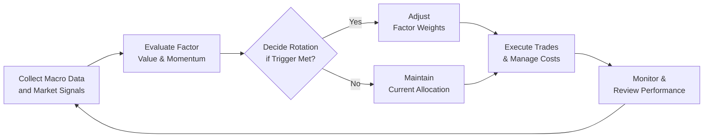

## Introduction

Picture this: You’re sitting at your desk on a Monday morning, coffee in one hand, the financial news in the other, and you see that “Value Stocks Are Making a Comeback!” Meanwhile, last month, everyone was screaming about the unstoppable rise of momentum plays. You might be scratching your head thinking, “Okay, so which style or factor do I tilt toward now?” That question—when framed within a structured investment process—often leads us directly into the realm of factor tilts and style rotation. Factor investing has grown in popularity as a way to capture systematic, persistent drivers of return (such as value, size, momentum, etc.) beyond broad market exposure. Style rotation, in turn, involves shifting exposures to these factors or “styles” (value vs. growth, for instance) based on signals or beliefs about where we are in the business cycle.

In earlier sections of this Volume 9, we examined advanced topics like multi-factor models, marginal contributions to risk, and diversification approaches. Now, we’re going to dive into a particularly hands-on application: factor tilts and style rotation. We’ll explore how you can identify and exploit these factor exposures, discuss strategies for rotating among them, and break down some important practicalities like transaction costs, turnover, and integration with a broader asset allocation framework.

So buckle up—let’s walk through the nitty-gritty of factor tilts and style rotation in real-world portfolios.

## Overview of Factor Tilts

### What Is a Factor Tilt?

A “Factor Tilt” is simply an intentional overweight or underweight toward a certain factor relative to a broad market index (often the market-cap-weighted index). Typical factors include size (small vs. large capitalization), value, growth, momentum, quality, low volatility, and so on. These factors are not magical; they reflect systematic style characteristics that have historically been associated with certain risk and return patterns.

If we’re referencing the glossary:  
• Factor Tilt: A conscious deviation from market-cap or broad-market weights, favoring specific factors.

#### Why Managers Use Factor Tilts

Managers often tilt their portfolios when they believe that certain factors are mispriced or are in a phase of the economic cycle when factor performance might be stronger. For example, an asset manager might say, “I think small-cap value stocks are poised for strong performance due to the recovery phase in the business cycle, so I’m going to overweight them relative to the broad equity market.” Or, another manager could tilt toward quality stocks in times of heightened market volatility, expecting that highly profitable, stable firms will hold up better when uncertainty is elevated.

In short, factor tilts are a middle ground between pure market beta exposure (e.g., holding the entire market) and more idiosyncratic, stock-level bets. By systematically leaning toward (or away from) certain factors, investors can hopefully benefit from those factors’ historical return premiums.

### Strategic vs. Tactical Tilts

It’s useful to differentiate between strategic tilts and tactical tilts:

• Strategic tilts refer to long-term, persistent overweights or underweights to certain factors. A pension fund that believes small-cap returns will outperform over decades may hold a permanent tilt to small-cap stocks, adjusting only occasionally if the underlying assumptions change.  
• Tactical tilts are short-term adjustments to factor exposures, often driven by near-term macroeconomic outlooks, valuation signals, or even momentum signals. This is sometimes also called active or dynamic factor rotation.

That distinction really shapes the approach. Strategic tilts typically emphasize discipline and patience, while tactical tilts require active monitoring, factor timing skill (or at least a disciplined approach to attempt it), and an eye for transaction costs.

## Style Rotation Strategies

### What Is Style Rotation?

Style rotation is all about shifting exposures among different investment styles (like growth vs. value, or large-cap vs. small-cap) depending on a manager’s forecast or an automated, rule-based model. For instance, a manager might adopt a style rotation strategy that invests in value stocks when they’re trading at historically attractive valuations and rotates into growth stocks when the economic cycle enters a late phase where high-quality growth might outperform.

In the glossary:  
• Style Rotation: A strategy of shifting among investment styles (e.g., from growth to value) to capture cyclical returns.

### Common Drivers for Style Rotation

Style rotation can be driven by a variety of factors:

1. Macroeconomic Forecasts: If a manager predicts an upcoming recession, they may shift to defensive styles such as low volatility or quality.  
2. Valuation Signals: Sometimes, a style may become relatively cheap or expensive versus its historical norm, signaling a possible shift in relative performance.  
3. Momentum or Trend Signals: Managers might adopt a “chase the winner” approach by rotating into the style that has performed best recently, or “mean reversion” strategy if they believe strong styles are set to underperform due to cyclical patterns.  
4. Market Sentiment: Herding and investor sentiment can drive style-specific rallies, prompting a manager to either follow the crowd or try to get in front of the crowd turning away.

### Practical Example

Let’s use a small personal anecdote: I once tracked a quantitative style rotation portfolio that favored value stocks when they were in the bottom decile of price-to-book ratios relative to growth. After a prolonged underperformance period, the model signaled that value was too cheap to ignore. The rotation bet was made, and indeed, there was a phase where value soared. That was thrilling to watch—until a sudden macro shock reversed some of those gains. Did the model get everything right? Absolutely not. But it highlighted the importance of disciplined investing and risk control. Style rotation can work, but it’s rarely a straight line to outperformance.

## Differences Between Strategic and Tactical Approaches

### Strategic Tilts

Strategic tilts might be based on the long-run evidence that certain factors (like market, size, value, or momentum) have provided risk premia over time. Investors who take the strategic approach usually:  
• Keep these overweights/underweights regardless of short-term volatility.  
• Rebalance periodically, but not frequently, to control transaction costs.  
• Combine factors (e.g., small size + value + momentum) to capture diversification benefits among factor premia.  

### Tactical Rotations

Tactical or short-term rotations require:  
• Continuous market surveillance and macroeconomic interpretation.  
• Greater willingness to accept turnover and trading costs.  
• Solid risk analytics, because if you get the factor rotation wrong, it can be quite painful.  
• A robust plan for market timing, so your tilt changes are neither too early nor too late.

It sounds simple—shift in and out of the “hot” factor, right? But ironically, it can be very tricky. Many managers have tried (and still do) to time factor exposures, but it involves skill, discipline, and often a healthy dose of luck.

## Challenges of Timing Factor Rotations

### Variation in Factor Cycles

Factors don’t always follow neat cycles. Value can underperform for years, growth can keep winning far longer than fundamental valuations might suggest, and momentum might look unstoppable—until you suddenly experience a momentum crash. The randomness of market sentiment can derail even the best-laid style rotation plans. The frequency and depth of drawdowns vary among factors, so nailing the exact pivot point is a challenge.

### Beware of Whipsaw

We’re all familiar with whipsaw risk: rotating into a factor just as it’s losing steam. This can lead to “buying high, selling low,” which is obviously undesirable. Whipsaw can occur when there’s a sudden shift in market sentiment—perhaps triggered by unexpected central bank announcements, geopolitical events, or, as we saw in earlier crises, a global pandemic. Market timing is tough.  

• Market Timing: Attempting to predict and capitalize on short-term market movements.

### Opportunity Costs and Tracking Error

By rotating frequently, you may rack up opportunity costs whenever you exit a factor prematurely. If you switch from momentum stocks to value stocks, and momentum surges back to life, you miss that upside. Additionally, as you deviate from a standard market benchmark, you increase tracking error, meaning your short-term performance can look quite different from that of the standard market index. While some deviation is expected in factor-based strategies, it can be uncomfortably large for a client who expects to track the broad market more closely.

## Transaction Costs and Turnover Considerations

Don’t forget: every time you trade, you pay spreads, commissions, potential market impact costs, and potentially taxes. High turnover can eat away at the returns from otherwise smart factor bets. In fact, if your factor advantage is modest, transaction costs can quickly erode your alpha. 

One technique to manage these costs is setting “trading bands” around factor exposures. You only rebalance (or rotate) your style exposures when they move outside certain thresholds. Another approach is to net trades across different accounts (if you’re a large institutional manager) or use algorithmic trading to reduce slippage.

## Integrating Style Rotation in Asset Allocation

### Core-Satellite Strategies

Many asset managers integrate style rotation into a broader asset allocation plan through a core-satellite approach:

• Core Portfolio: Typically a diversified “beta” portfolio, often capturing exposure to multiple asset classes or broad equity/bond indexes. The idea is to maintain a stable, low-cost, and long-term foundation aligned with the Investment Policy Statement (IPS).  
• Satellite Allocations: Smaller, more opportunistic (or tactical) positions that tilt the portfolio toward specific factors or styles. This is where style rotation can fit nicely—yo-yoing among value, growth, momentum, and so on without disrupting the core.  

From the glossary:  
• Core-Satellite Strategy: An approach combining a stable core portfolio with smaller, more tactical “satellite” allocations.

### Sector Rotation vs. Factor Rotation

It’s worth mentioning that sector rotation is a related concept, but not the same as factor rotation. You might rotate among technology, financials, consumer cyclical, etc., or you might rotate among styles (value vs. growth) or factors (small size vs. large size, high momentum vs. low momentum). The underlying principles are similar—seek to identify cyclical or structural tailwinds—but the mechanics can differ.

• Sector Rotation: Similar concept, but rotating between sectors (technology, financials, etc.) based on macro views.

### Implementation Steps

1. Define Your Investment Universe: Decide which styles or factors you’ll consider for rotation.  
2. Determine Your Signals and Models: Will you use valuations (price-to-book, price-to-earnings, discounted cash flow models) or momentum signals (moving averages, relative strength)?  
3. Set a Parameter for Rebalancing: This includes the frequency (monthly, quarterly, annually) and thresholds for over/underweight positions.  
4. Risk Management Protocols: Outline the maximum exposure to each factor, how to handle drawdowns, and the acceptable range of tracking error.  
5. Monitor Your Results and Adjust as Needed: Remain vigilant about transaction costs, macro changes, and factor performance.

## Visualizing a Simple Style Rotation Process

Below is a conceptual Mermaid diagram illustrating a simplified workflow for style rotation:



## Numerical Example (Hypothetical)

Let’s say you have a $10 million equity portfolio benchmarked to a broad market index. You believe small-cap value is undervalued, so you decide on a 10% tilt:

• Benchmark Allocation (cap-weighted): 100% broad market.  
• Tactically Adjusted Portfolio: 90% broad market + 10% small-cap value tilt.

If small-cap value outperforms by 5% over the benchmark for that segment during the year, your tilt yields an incremental 0.5% outperformance (10% * 5%). If returns are reversed or your timing is off, that tilt might cause underperformance by a similar magnitude. A 0.5% difference might not sound huge in a single year, but for large portfolios, it can be material, especially over time.

## Python Snippet for Factor Returns

Below is a short Python snippet that could be used to track factor returns (this is a very simplified version just for demonstration). Suppose we have data on factor returns from a file and we want to compute a rolling average to smooth out noise:

```python
import pandas as pd

df = pd.read_csv('factor_data.csv', parse_dates=['Date'], index_col='Date')
df['Value_rolling'] = df['ValueFactor'].rolling(window=60).mean()
df['Momentum_rolling'] = df['MomentumFactor'].rolling(window=60).mean()

signal = df['Value_rolling'] - df['Momentum_rolling']

df['RotationDecision'] = signal.apply(lambda x: 'Value Tilt' if x > 0 else 'Momentum Tilt')
print(df[['ValueFactor','MomentumFactor','RotationDecision']].tail())
```

Of course, in reality, you’d refine your strategy with robust risk management, transaction cost models, and better signal processing. But that’s the general idea of how you might start.

## Potential Pitfalls & Best Practices

• Overconfidence: Just because a factor has a strong historic premium, that doesn’t mean it’ll persist in your specific time horizon.  
• Data Mining: Always test your style-rotation strategy on out-of-sample data to reduce the risk of overfitting.  
• Behavioral Traps: Recency bias might lure you in to chase a winning factor right at the end of its run.  
• Turnover & Liquidity: If your rotation signals are too frequent, your costs might overshadow your alpha.  
• Governance & Oversight: Especially in institutional settings, ensure that style rotation aligns with the Investment Policy Statement and that you have the operational capacity to execute these trades effectively.

## Exam Tips (For CFA Level I and Beyond)

• Make sure you understand the difference between factor tilts (a kind of systematic deviation from the market) and idiosyncratic stock picking.  
• Be ready to discuss how macro drivers impact different styles or factors. For instance, small-cap value stocks might do well early in an economic recovery.  
• Know how to compute or at least interpret the performance impact of over/underweight positions (like in our 10% tilt example).  
• Practice analyzing how transaction costs could eat into factor-based returns.  
• Map style rotation to the broader concept of Tactical Asset Allocation (TAA). In other words, factor rotation can be seen as a narrower, style-specific version of TAA.  

And keep in mind, exam question scenarios often revolve around a manager who “suspects that factor X is about to underperform or outperform.” You’ll be asked to evaluate that suspect manager’s logic, discuss potential trade-offs, or compute the portfolio’s new risk/return metrics after a tilt.

## Summary and Final Thoughts

Factor tilts and style rotation can be powerful tools in a portfolio manager’s arsenal—yet they’re also easily misapplied. Timing is notoriously difficult, and transaction costs can bite. When employed thoughtfully, with a grounding in both quantitative analysis and common-sense risk management, style switching can add an extra layer of return or risk control over time.

If I’ve learned anything from my own experiences (and many managers’ stories), it’s to remain humble. Market conditions can surprise you. But if you incorporate discipline, maintain a comprehensive tracking process, and keep your eyes on the fundamental drivers of returns, factor tilts and style rotation can be a worthwhile endeavor.

## References for Further Reading

• Ilmanen, A. (2011). “Expected Returns: An Investor’s Guide to Harvesting Market Rewards.” Wiley.  
• Grinold, R. & Kahn, R. (2000). “Active Portfolio Management.” McGraw-Hill.  
• CFA Institute Official Curriculum – Factor Investing and Asset Allocation.  

These resources go deeper into the theoretical foundation of factor investing, active management, and application topics that align with the CFA Program curriculum.

--------------------------------------------------------------------------------

## Test Your Knowledge: Factor Tilts and Style Rotation



### Which statement best describes a factor tilt?

- [x] A deliberate overweight or underweight toward certain factors relative to the market index
- [ ] Timing the purchase and sale of stocks based on price momentum signals
- [ ] Investing only in small-cap growth stocks, irrespective of market conditions
- [ ] Eliminating all sector exposures for a more balanced portfolio

> **Explanation:** Factor tilt involves consciously deviating from broad market exposure to gain a higher or lower weighting in specific factor exposures.

### Which of the following examples most closely illustrates style rotation?

- [ ] An investor systematically rebalances back to a 60/40 stock-bond allocation each quarter
- [x] A portfolio manager shifts from value stocks to growth stocks based on an assessment of economic forecasts
- [ ] A high-frequency trading strategy that takes advantage of bid-ask spreads
- [ ] A portfolio that remains consistently invested in the same market-cap-weighted index

> **Explanation:** Style rotation involves moving between styles (such as value and growth) in response to signals like macroeconomic data or valuation metrics.

### Which of the following is a key difference between strategic and tactical factor tilts?

- [ ] Strategic tilts require more frequent trading than tactical tilts
- [x] Strategic tilts focus on the long-term persistent premium, while tactical tilts attempt to capture shorter-term opportunities
- [ ] Strategic tilts involve leveraging derivatives, while tactical tilts do not
- [ ] Tactical tilts always involve short-selling factor exposures

> **Explanation:** Strategic tilts aim for long-term over/underweight positions, whereas tactical tilts focus on short-term changes to capture near-term fluctuations.

### Why are transaction costs particularly important in factor rotation strategies?

- [x] Because frequent trades based on changing factor signals can erode returns
- [ ] Because factor rotation does not usually involve any trading
- [ ] Because regulators forbid factor rotation unless transaction costs are explicitly declared
- [ ] Because transaction costs only matter for passive strategies

> **Explanation:** Factor rotation often involves adjusting positions as signals vary, leading to potentially high turnover. These frequent trades can generate sizable transaction costs.

### Which statement is true regarding a core-satellite approach to factor tilts?

- [ ] The core portion is highly variable, and the satellite portion is fixed
- [x] The satellite portion may include factor-based strategies, while the core remains broadly diversified
- [ ] Both the core and satellite are actively traded to match a market index
- [ ] The entire approach focuses only on short selling high-beta stocks

> **Explanation:** A core-satellite structure typically has a stable core portfolio (broad market exposure) and more tactical or specialized satellite allocations, where factor tilts might be implemented.

### What is the primary risk of attempting to time factor rotations?

- [ ] Risk of outperforming too consistently
- [ ] A permanent shift in factor exposures leading to low turnover
- [x] Whipsaw effects, where timing is off and the investor buys high and sells low
- [ ] Regulatory restrictions on changing factor exposures more than once a year

> **Explanation:** Mistiming factor rotations can lead to the “buy high, sell low” phenomenon, also referred to as whipsaw, causing potential losses or foregone gains.

### How can a manager mitigate high turnover costs in tactical style rotation?

- [ ] By holding only one style at a time
- [x] By using trading thresholds or bands before adjusting positions
- [ ] By ignoring valuation signals entirely
- [ ] By rotating on a daily basis to capture intraday factors

> **Explanation:** Setting thresholds (bands) means the manager will only rebalance when factor exposures stray beyond certain limits, reducing unnecessary trades.

### Why might a manager maintain a permanent (strategic) small-cap value tilt?

- [x] They believe small-cap value exhibits a long-term positive return premium
- [ ] They want maximum diversification and zero factor exposures
- [ ] They plan to buy and sell small-cap value daily
- [ ] They aim to reduce their tracking error relative to the broad equity market

> **Explanation:** A strategic tilt is typically long-term and is often based on evidence that a certain factor (e.g., small-cap value) offers a persistent premium.

### Which of the following best explains a downside of frequent style rotation?

- [ ] It reduces the manager’s ability to incorporate macro views
- [x] It may result in high transaction costs and short-term capital gains taxes
- [ ] It increases the correlation between value and growth stocks
- [ ] It eliminates the possibility of style-based outperformance

> **Explanation:** Frequent rotation can drive trading expenses and taxes that may reduce the net benefit of the style-based strategy.

### A factor tilt that has a permanent overweight in momentum stocks year after year is an example of:

- [x] True
- [ ] False

> **Explanation:** A persistent overweight to momentum stocks would be considered a strategic factor tilt if it is maintained over the long run, irrespective of short-term signals.


