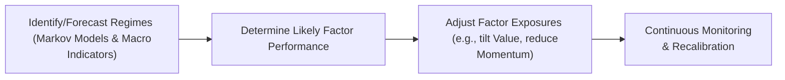

## Introduction

So, I used to think factor investing was pretty straightforward—just pick a few well-known factors like value, momentum, or quality, and I was good to go. But then I found out (the hard way) that these exposures can morph dramatically depending on the market environment. In bullish conditions, those high beta or momentum factors might really run, while in recessions, defensive or minimum volatility strategies might suddenly become the heroes. If you’re managing a portfolio actively, you’ll want to know which factor exposures could help you meet your risk-return goals at any given time—especially if the market climate shifts unexpectedly.

In this section, we dig into “conditional factor exposures,” meaning the exposures to specific risk factors that vary in magnitude (and even in sign) based on the particular market regime in play. That’s a mouthful, but it’s basically about recognizing that the effect of, say, a value tilt can be quite different if the economy’s trending up versus when it’s in a slump. For many investors, the ability to identify and adapt to these changing regimes is a way to squeeze a little extra alpha out of their portfolios—if they get it right, that is. Let’s jump in.

## Why Market Regimes Matter

Market regimes matter because asset returns aren’t driven by exactly the same forces all the time. Periods of expansion vs. recession, high vs. low volatility, and low vs. high interest rates tend to produce different winners and losers. A typical expansion, for instance, might favor cyclical industries and “procyclical factors” (like value and small cap) which historically do well when corporate earnings are rebounding. On the flip side, a severe market downturn often sees “defensive factors”—like minimum volatility or high quality—outperform. 

If you’ve ever watched a cyclical stock (maybe a big auto manufacturer) surge during an economic recovery (only to see it drop hard during a crisis), then you've seen a glimpse of changing factor exposures and the influence of shifting regimes. Being aware of these patterns can help a portfolio manager position themselves opportunistically—or at least defend the portfolio from undue risk.

### Common Examples of Regime-Dependent Factor Behavior
• Value Factor: Often considered procyclical, sometimes performing best when economies recover and valuations “normalize.”  
• Momentum Factor: Tends to do well when trends persist, but can turn abruptly if a recession or sharp correction hits.  
• Minimum Volatility Factor: Often thrives in heightened risk-aversion or bear markets.  
• Quality Factor: Exhibits defensive tendencies (e.g., stable earnings, strong balance sheets) during downturns.  

Understanding these distinctions is the first step. But how do we determine which regime we’re in? That’s where identifying market regimes (and switching between them properly) becomes essential.

## Identifying Different Market Regimes

There are several ways to classify market regimes, ranging from simple heuristics (like “bull,” “bear,” or “sideways” markets) to advanced statistical models that attempt to detect structural shifts in real time. Here are a few approaches:

### Markov Switching Models
Markov switching models (often known as Hidden Markov Models or simply HMMs) use historical data to estimate probabilities that the market is in one regime or another at any given time. The model effectively “switches” its parameters (such as mean and volatility of returns) depending on which regime is most likely.

In formula terms, a two-regime Markov switching model might look like this:


r_t = 
\begin{cases}
\mu_1 + \phi_1 r_{t-1} + \epsilon_{t} & \text{with probability } p, \\
\mu_2 + \phi_2 r_{t-1} + \epsilon_{t} & \text{with probability } 1 - p, 
\end{cases}


where p is the probability of being in regime 1 vs. regime 2, and each regime has its own parameters (\\(\mu_i\\), \\(\phi_i\\), etc.). The model filters the observable data (returns) and infers the most likely regime over time.

### Macroeconomic Indicators
An alternative is to define regimes based on macro signals:

• GDP Growth: Positive, accelerating GDP might suggest an expansion regime; negative or slowing real GDP growth could hint at a contraction or recession.  
• Interest Rate Spreads: A narrow (or inverted) yield curve might indicate an impending downturn, while wide spreads can reflect lower risk aversion.  
• Volatility Measures (e.g., VIX): Periods of low volatility may suggest a calm or bullish regime, whereas spikes in volatility can indicate risk-off or crisis conditions.  

### Qualitative Discretion
Some portfolio managers prefer to combine quantitative triggers with expert judgment—“Hmm, the unemployment rate is climbing, consumer confidence is tanking, corporate earnings are shaky…we’re likely heading into a slowdown.” It’s less systematic, but for certain active managers, that approach works as well.

Below is a simplified diagram of how these steps might look when building a regime-based approach:

## Conditional Factor Exposures

Once you have a sense of what regime you’re in (or might soon be entering), you can adjust your portfolio’s factor tilts accordingly. This is the crux of conditional factor exposures—making your exposures dynamic rather than static.

### Example: Value Factor vs. Defensive Factor
• In an expansion regime, you might lean more heavily into the **Value** factor, expecting cyclical stocks with strong fundamentals to recover.  
• As you see early signals of a slowdown, you might pivot toward **Defensive** factors like Low Volatility or Quality, preparing for a potential market drawdown.  

This approach is often called **dynamic allocation** because you’re not just blindly sticking with a single factor exposure. Instead, you’re adapting to real-time (or near real-time) market information.

### Conditional Factor Modeling
Mathematically, you can model conditional factor exposures by letting your portfolio’s factor loadings vary depending on a state variable \\( S_t \\):


r_{p,t} = \alpha_t + \sum_{i=1}^k \beta_{i}(S_t) \times F_{i,t} + \epsilon_t,


Where \\(\beta_{i}(S_t)\\) is the factor loading for factor \\(i\\), conditioned on the regime or state \\(S_t\\). As \\(S_t\\) changes from expansion to contraction (or any other regime definition), the \\(\beta_{i}\\) changes accordingly. This dynamic specification is more flexible but requires continuous updating with fresh data, which can be both costly and time-consuming.

### Real-Time Market Signals
You may be thinking, “Okay, so how do I know when to shift exposures? I can’t tell the market to take a coffee break while I figure everything out.” Precisely. This is where timely signals come in, like:

• Changes in the slope of the yield curve (10-Year Treasury – 2-Year Treasury)  
• Sudden jumps in implied volatility (e.g., VIX)  
• Corporate credit spreads (investment grade vs. high yield)  

These signals are used in statistical or machine-learning models as inputs that help to forecast or confirm a regime shift. Admittedly, none of the signals are infallible, and “timing risk” is a real challenge. You always risk moving too soon (missing more upside) or too late (getting caught by a market drop).

## Practical Challenges

### Timing Risk
The biggest headache is that your signals may lead you astray. If you flip your portfolio factors prematurely, and the expected downturn doesn’t come, your performance can suffer. Conversely, if you delay, you may encounter losses as a factor that was profitable in an expansion sells off quickly in recessionary shocks.

### Transaction Costs and Slippage
Frequent adjustments to factor tilts mean more trading, which can eat into your returns. Additionally, some factor strategies become less liquid (especially in smaller-cap segments), so rebalancing might involve slippage or market impact.

### Model Complexity
Markov switching or other dynamic approaches require advanced statistical or econometric tools that not every firm has. Plus, the more sophisticated the model, the greater the reliance on precise parameter estimates—and the bigger the problem if the estimates are off or the underlying relationships break down.

### Data Requirements
In many advanced methods, you need a fairly extensive dataset to calibrate your regime detection model. If you’re dealing with expansions vs. recessions, you ideally want data spanning multiple business cycles. This can be particularly tricky in emerging markets or newer asset classes where the historical record is thinner.

### Continuous Monitoring
It’s not enough to set your regime thresholds and never revisit them. Market structures evolve over time, so a set of signals that worked in the last decade might not work as well in the next. Continual data gathering, recalibrations, and model validations are all par for the course.

## Real-World Example: Value Factor Shifts

A well-known example in the early 2000s: after the tech bubble burst, many technology stocks (which had soared previously, high momentum factor) plummeted in value. Investors who recognized a shift in regime could reduce exposures to high-flying growth and momentum names, pivoting into classic value stocks that were beginning to show promising fundamentals at cheaper valuations. Those who pivoted successfully captured strong returns in the years that followed, illustrating how conditional factor exposures can add alpha. Of course, it’s easier said than done. Many managers who tried to time the rotation got whipsawed.

## Implementation Tips and Best Practices

• Set Clear Rules: If you’re going to switch factor tilts based on certain economic or market signals, define the thresholds (like yield curve flattening under 0.5%) that trigger a shift.  
• Limit Over-Frequency: Avoid flipping exposures too often. Maybe reevaluate once per month or quarter to minimize trading costs.  
• Stress Test: Simulate your strategy using historical data from different market cycles, or even from stressful events like 2008 or 2020, to see how your rules would have performed.  
• Combine Indicators: Rather than rely on a single macro indicator, build a composite or weighted approach (like a combination of volatility, yield curve slope, credit spreads, etc.).  
• Monitor Beta Shifts: Keep an eye on how your portfolio’s overall beta changes when you rotate factor exposures. Switching from a low-vol factor tilt to a cyclical tilt can drastically alter your market sensitivity.  

## Glossary

• **Market Regime:** A period with distinct economic, valuation, or volatility traits (e.g., bull market, bear market, expansion, recession).  
• **Markov Switching Model:** A statistical method that allows parametric changes across different latent states or regimes.  
• **Defensive Factor:** Factors—like low volatility or high quality—that often outperform when markets turn down.  
• **Procyclical Factor:** Factors—like value or small cap—that often outperform during economic expansions.  
• **Dynamic Allocation:** The act of changing exposures or weights in a portfolio in response to changing external conditions.  
• **Timing Risk:** The risk stemming from the possibility that shifts in factor exposures might occur too early or too late.  
• **Economic Indicator:** A metric (e.g., GDP growth, inflation, yield spreads) that reveals the status or direction of the economy.  

## Conclusion

Implementing a strategy that incorporates conditional factor exposures in response to shifting market regimes can be an effective way to potentially enhance returns and mitigate downside risk. But it’s no cakewalk. You’ll need to manage the complexities of data, modeling, transaction costs, and (perhaps the trickiest of all) timing. Nonetheless, for those with the resources and appetite for a dynamic approach, the payoff can be substantial.

From an exam perspective, be prepared to align your discussion on factor investing with the concept of regime changes. It often shows up as scenario-based questions requiring you to decide whether a factor tilt is appropriate given certain macro data or a suspected switch in market conditions. Keep your definitions of expansions, recessions, bull vs. bear markets crisp in your mind, and be familiar with how Markov switching models or macro indicators can be integrated into a factor model. Understand the pitfalls of ignoring transaction costs or rebalancing complexities. 

If you’re confronted with potential essay questions, consider tying in ethical angles—like the transparency of your regime shifts to clients, or the risk that an overly complex model might not be well-understood by the end user. As always, practice robust scenario analysis and stress testing. Good luck, and remember: implementing these concepts in real life often requires equal parts quantitative skill and intuitive judgment.

## References

Ang, A. & Bekaert, G. (2002). “International asset allocation with regime shifts.” Review of Financial Studies.

Carvalho, R., Xiao, L., & McArdle, M. (2012). “Analyzing mutual funds using returns-based style analysis.” The Journal of Portfolio Management.

CFA Institute Official Curriculum – Market Regimes and Dynamic Strategies.

## Test Your Knowledge: Conditional Factor Exposures in Changing Market Regimes Quiz



### Which of the following best describes the purpose of conditional factor exposures?

- [ ] Consistently applying a single factor tilt regardless of market conditions.  
- [ ] Preventing any changes in portfolio composition for the sake of simplicity.  
- [x] Adjusting factor tilts based on regime shifts or signals indicating new market conditions.  
- [ ] Eliminating transaction costs by avoiding trading altogether.  

> **Explanation:** Conditional factor exposures allow portfolio managers to rotate in or out of certain factors depending on the current or anticipated market regime, rather than applying a static approach.

### Which factor is commonly considered procyclical, typically performing better in an economic expansion?

- [ ] Low Volatility  
- [ ] High Quality  
- [x] Value  
- [ ] Minimum Volatility  

> **Explanation:** Value stocks often do well from the trough of a recession into the subsequent expansion, as their valuations can correct and fundamentals recover.

### What is one of the main drawbacks of frequently adjusting factor exposures in response to changing regimes?

- [ ] Reduced portfolio diversification  
- [ ] Complete immunity to drawdowns  
- [x] Higher transaction costs and potential market impact  
- [ ] Guaranteed returns in volatile markets  

> **Explanation:** Frequent rebalancing or factor rotation can lead to increased trading fees and potential slippage from transacting in less-liquid segments.

### Which of the following best characterizes a defensive factor?

- [x] High Quality or Low Volatility factors that tend to outperform in downturns  
- [ ] Momentum factors that outperform in all markets  
- [ ] Value factors that only do well when interest rates rise  
- [ ] Growth factors that rely solely on intangible assets  

> **Explanation:** Defensive factors—like Low Volatility or High Quality—have typically shown relative outperformance during market drawdowns, when risk aversion is high.

### How do Markov switching models help in identifying market regimes?

- [ ] They ensure all factor exposures remain constant over time.  
- [ ] They rely only on a single macro indicator for classification.  
- [x] They use past data to infer the probability of being in different hidden market states.  
- [ ] They negate the need for any type of modeling or quantitative analysis.  

> **Explanation:** Markov switching models estimate the probability of distinct regimes (states) based on historical data, allowing certain parameters (like returns or risk) to differ between states.

### Which of the following is an example of a real-time market signal that may help identify regime shifts?

- [ ] Volume of last year’s trades  
- [x] A sudden widening in corporate credit spreads  
- [ ] Seasonal data older than five years  
- [ ] A random walk assumption of stock returns  

> **Explanation:** Corporate credit spreads are often monitored in real time to gauge market stress levels or impending regime shifts.

### In a two-regime Markov switching model, how can the transition between regimes be described?

- [x] By probabilistic transitions from one state to another, captured in a transition matrix  
- [ ] By fixed, predetermined dates that never change  
- [ ] By a single threshold on volatility that triggers a permanent regime shift  
- [ ] By ignoring any historical data  

> **Explanation:** A Markov model uses a transition matrix to define the probabilities of switching from one regime (state) to another, allowing for dynamic changes.

### What is a key advantage of conditional factor modeling compared to static factor modeling?

- [ ] It automatically eliminates forecasting errors.  
- [ ] It requires no calibration or data analysis.  
- [x] It adapts factor loadings according to observed or predicted market environments.  
- [ ] It promises risk-free returns during recessions.  

> **Explanation:** Conditional factor models introduce a dynamic dimension, allowing factor loadings to shift with economic or market signals, which can help capture changing patterns in asset returns.

### Which common behavioral challenge often emerges when implementing regime-based factor strategies?

- [x] Timing risk—potentially switching factors too early or too late  
- [ ] Elimination of all volatility in the portfolio  
- [ ] Constant underperformance in all market conditions  
- [ ] Complete isolation from macroeconomic indicators  

> **Explanation:** A major behavioral and tactical challenge is timing risk, where the factor rotation doesn’t match the actual timing of the economic or market regime shifts.

### True or False: Defensive factors typically outperform during periods of high market volatility or recession.

- [x] True  
- [ ] False  

> **Explanation:** Defensive factors like Low Volatility and High Quality tend to hold up better and often outperform when market volatility rises or when a recession hits.


