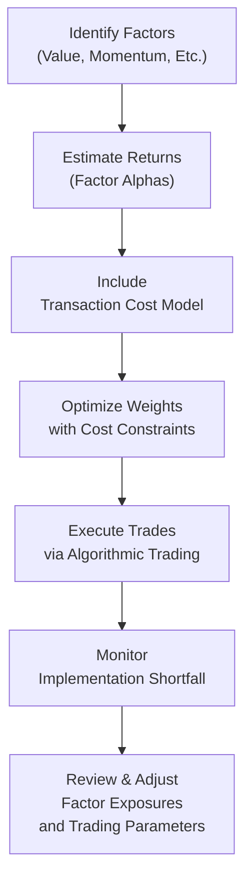

## Introduction

I'm not sure if you’ve ever felt that funny pang of regret after making what seems like a brilliant trade, only to watch commissions and hidden fees whittle away at your returns. I sure have. In multi-factor strategies—where multiple signals guide stock selection and frequent rebalancing can be the norm—transaction costs can slowly eat into your performance. These costs come in many flavors, from explicit commissions paid to brokers, to the more subtle bid-ask spreads and market impact costs. When you deploy advanced factor-based approaches, it can feel like you're aiming to pick up pennies in front of a steamroller if you ignore how much you lose in fees and indirect trading expenses.

In this article, we’ll take a deep dive into how you can systematically incorporate transaction costs when you design and implement multi-factor strategies. We’ll start by outlining the main types of costs. Then, we’ll walk through ways to minimize them (like restricting turnover, using trade compression, and leveraging algorithmic execution). Finally, we’ll see how you can integrate cost constraints into your portfolio optimization so that you can keep more of your factor-driven alpha. By the end, you’ll hopefully feel more confident that you can extract robust factor returns while keeping those dreaded frictions in check.

## Types of Transaction Costs

Transaction costs represent the total expenses that arise from buying or selling securities. These can be broken down into explicit and implicit costs:

• Commissions: The fees brokers charge to clear or execute trades. These may be a few cents per share or a small percentage of the trade value.  
• Bid-Ask Spread: The difference between the price at which securities can be bought (ask) and sold (bid). This is especially critical in less liquid stocks or when large orders are executed.  
• Market Impact Cost: The cost of price movement due to your own trading activity. If you’re trying to buy a large block of shares in a relatively illiquid stock, your buy orders themselves can push the share price higher.  
• Opportunity Cost: The cost of missing out on favorable price movements because you delayed or broke up your trades to avoid excessive market impact.

### Explicit vs. Implicit Costs

Explicit costs such as commissions are easy to spot and measure. You see them on your trade confirmations. Implicit costs, on the other hand, are more subtle—they pop up in the form of price slippage, spread crossing, and the ripple effects of your order on the market. But even though implicit costs are more difficult to quantify, ignoring them is a bit like ignoring an iceberg—most of the danger is lurking below the surface.

## Impact of Transaction Costs in Multi-Factor Strategies

You might be thinking: “Well, I’ll just pay a few cents per share—no big deal.” But multi-factor portfolios often rely on frequent rebalancing to maintain desired factor exposures. If you run a strategy with monthly or even daily rebalancing, you might find yourself trading more frequently than you’d like. And if you’re not careful, all those small individual costs begin to compound.

Let’s break it down:

• Frequent Rebalancing: Multi-factor strategies dynamically adjust factor exposures—value, momentum, low-volatility, quality, or growth, for instance. When an asset drifts away from the desired factor tilt, you rebalance. The more rebalancing events you have, the more trades you make, and thus the more transaction costs.  
• Turnover: We often describe the fraction of a portfolio replaced during some period as turnover. If your multi-factor model signals frequent changes, it boosts turnover, leading to higher costs.  
• Factor Signals vs. Costs: Even if your factor exposures have strong theoretical or empirical foundations, they must generate enough excess return (alpha) to compensate for total transaction costs. Over-trading can erode the net return, making the strategy far less attractive once real-world costs come into play.

## Methods to Minimize Transaction Costs

Because transaction costs can significantly drag on performance, a variety of approaches aim to mitigate trading frictions:

### 1. Trade Compression

Trade compression refers to consolidating multiple trades into fewer, larger orders to reduce repetitive fees or crossing of the bid-ask spread. Imagine that your factor model indicates you need to buy 50 shares in one wave, 40 shares in another wave, and 60 in yet another. Instead of splitting these trades into separate smaller tickets, you bundle them into one or two bigger trades. The commission might be smaller on a per-share basis, and you cross fewer bid-ask spreads.

### 2. Algorithmic Trading

Algorithmic trading uses automated “algos” to slice large trades into smaller pieces, reducing market impact. For example, a Volume Weighted Average Price (VWAP) algorithm tries to pace your trades in line with overall market volume. You can also use participation-based strategies or stealthy liquidity-seeking algorithms. These algorithms aim to reduce your footprint in the market, thereby minimizing price impact.

### 3. Restricting Turnover

Sometimes, the best way to lower transaction costs is simply to trade less. If you can design your multi-factor strategy to have a slightly longer holding period or smooth out rebalancing triggers, you’ll see less turnover. Additionally, you might impose turnover constraints in your optimization routine: “Only let me alter up to, say, 10% of my portfolio each month.” That’s one direct way to keep a lid on costs.

### 4. Smart Execution Timing

Executions timed around more liquid periods (e.g., near open or close for certain markets, or after major economic announcements) can potentially reduce slippage. In some markets, the first or last 30 minutes of the trading day often see higher volumes, which can lower market impact for large orders.

### 5. Implementation Shortfall Analysis

Implementation shortfall is the difference between a portfolio’s theoretical “paper” returns and the realized performance once transaction costs and other slippage factors are accounted for. By carefully measuring implementation shortfall, you can identify whether your trading style or your broker’s approach is suboptimal, and then adjust your trading procedures accordingly.

## Adjusting Factor Models for Transaction Costs

Now that we’ve peeked at different types of costs, how do we actually incorporate them into a model? Let’s look at a few different ways to do so.

### Transaction Cost-Adjusted Alpha

A simple approach is to reduce each factor’s “alpha” or expected return by the estimated cost of achieving that exposure. If your momentum factor yields a predictive return of 4% per year, but your expected cost to capture that factor is 1.5% per year (through spreads, commissions, and slippage), then your net anticipated factor alpha is only 2.5%. That helps you see if the factor is still worth pursuing once you pay the piper in trading costs.

### Turnover-Constrained Optimization

In portfolio optimization, you might incorporate a penalty on turnover. For instance, you can add a term in your objective function that penalizes the absolute change in portfolio weights from one period to the next. This ensures that while your model aims to maximize risk-adjusted returns (Sharpe or something else), it also balances that objective against cost minimization.

In a typical mean-variance or multi-factor optimization problem:

maximize: Expected Return − λ * Risk − γ * Turnover

where λ is the risk-aversion parameter, and γ is the parameter that penalizes turnover. The higher γ is, the more severely the model punishes turnover, thereby encouraging minimal changes in portfolio weights.

### Transaction-Cost-Aware Optimization

We can even be more explicit and incorporate detailed cost curves. These reflect the idea that larger orders in less liquid stocks may create a non-linear market impact. The cost function could look something like:

TransactionCost(w_old → w_new) = ∑(i) f_i(TradeSize_i)

where f_i is a function describing how cost rises with trade size. Including that cost function in your optimization can help reduce over-exposure to illiquid securities.

#### Example in Python

Below is a (simplified) snippet that demonstrates how to set up a cost-constrained optimization using Python. This is purely illustrative, so don’t get too hung up on the details:

```python
import cvxpy as cp
import numpy as np

# - returns: expected returns vector
# - w_current: current weights

n = len(returns)
w = cp.Variable(n)

risk = cp.quad_form(w, cov_matrix)

turnover = cp.norm(w - w_current, 1)

lambda_risk = 1.0  # Example value
gamma_cost = cost_param
objective = cp.Maximize(returns @ w - lambda_risk * risk - gamma_cost * turnover)

constraints = [cp.sum(w)==1.0, w >= 0]  # Long-only portfolio, for example

problem = cp.Problem(objective, constraints)
result = problem.solve()
optimal_weights = w.value
```

In this snippet, the variable `turnover` measures how far the new weights deviate from your existing positions, thereby approximating potential transaction costs. In practice, you would refine this to incorporate separate cost estimates for different stocks, including liquidity measures, spreads, and so forth.

## Balancing Factor Exposures with Transaction Costs

One of the trickiest parts is deciding the sweet spot between obtaining the “pure” factor exposures from your signals and the cost incurred to rebalance your portfolio. Over-extraction of factor signals—meaning you chase every small nuance or incremental expected alpha—can be disastrous if the costs overshadow the extra return. 

For instance, if a factor suggests you should switch out of Stock A and into Stock B for a small 20-basis-point expected gain, but that trade would cost 25 basis points in transaction costs, it’s a net loser. A cost-aware strategy might choose to ignore that signal or wait until a stronger difference appears.

## Best Practices and Practical Insights

• Monitor Implementation Shortfall in Real Time: Don’t rely solely on theoretical calculations; measure how each trade performs versus your expectations. Adjust accordingly.  
• Segment High-Turnover and Low-Turnover Factors: Some factors, like momentum, naturally require frequent trading. Others, like value or quality, tend to be slower moving. You can isolate your strategy into a “core” of low-turnover factors and a “satellite” of higher turnover factors, so you effectively manage costs.  
• Use Partial or Delayed Rebalancing: Instead of rebalancing everything at once, you can phase in trades or adopt smaller “drip trades” so you’re not hammering the market with your entire order in one shot.  
• Keep an Eye on Liquidity: Especially for multi-factor strategies that might hold large positions in small-cap or emerging market stocks. If the securities are illiquid, your market impact can be huge.  
• Evaluate Brokers and Algo Providers: Not all brokers are created equal, so keep track of fill rates, slippage, and hidden fees.  
• Understand the Regulatory Framework: In certain markets, transaction taxes or other constraints can significantly modify your cost structure. (See Chapter 7.2 “Regulatory Environment and Compliance Considerations” and Chapter 14.5 “Regional Regulatory and Tax Considerations”.)

## Illustration: Implementation Flow Diagram

Below is a simple mermaid diagram illustrating a flow of integrating transaction cost considerations into a multi-factor strategy:



## Real-World Case Study

I recall a friend of mine who managed a mid-sized equity fund that relied on a momentum-plus-value factor model. She was initially rebalancing weekly—she wanted to be “on top of” every signal shift. But quarterly performance attribution showed big slippage, and it was perplexing. When she dug in, it turned out that her short-term momentum trades were incurring significant costs. By simply extending the rebalancing cycle to every two weeks, and by adopting an algorithmic VWAP execution strategy, her average trading cost was halved—improving net returns without drastically compromising factor exposures.

## Common Pitfalls and Practical Tips

• Overfitting to Historical Transaction Data: Be aware that liquidity conditions and spreads can change quickly. Models calibrated on outdated data might mislead you.  
• Underestimating Market Impact: Especially in smaller or less liquid stocks. A stock’s average daily volume might look comfortable, but if you’re trading a large chunk of it, expect some slippage.  
• Turning Over the Portfolio Excessively: Even small factor signals can look appealing in backtests, but are they worth the cost? Test your turnover-limited approach for robust results.  
• Setting Unrealistic Expectations: Don’t assume zero friction. Always stress test your strategy using a range of transaction cost estimates, from optimistic to pessimistic scenarios.  
• Not Using a Monitoring Framework: Implementation shortfall can sneak up on you. If you don’t measure it, you might not realize how large your trading frictions truly are.

## Exam Tips for CFA® Candidates

When you see a question on multi-factor strategies, take note of any mention of rebalancing frequency or turnover. On the CFA exam, you may be asked to discuss how to incorporate transaction costs into your optimization or to evaluate the effect of different rebalancing rules on net returns. Look out for these angles:

• Be ready to talk about explicit vs. implicit costs and how they reduce realized returns.  
• Show how turnover constraints or penalty parameters in an optimization can mitigate costs.  
• Don’t forget to mention that factor-based alpha must exceed trading friction to be net beneficial.  
• Often, exam scenarios revolve around a debate of “Should the manager trade now or wait?” connecting to the concept of opportunity cost vs. market impact.  

## Conclusion

In multi-factor portfolios, transaction costs can be a dangerous, silent killer of performance if you don’t consciously monitor and manage them. But by applying cost-aware alpha estimates, imposing turnover or transaction cost constraints in your optimization, and employing efficient trading techniques, you can minimize leaks in your returns and preserve more of the alpha your factors produce.  

It’s certainly a balancing act—achieving strong factor exposures without drowning in trading costs. But with thoughtful preparation and a reliance on robust cost estimation and monitoring techniques, you can keep your multi-factor strategy running smoothly.  

Remember, factor investing is all about identifying marginal edges in the market. Ensuring that these edges aren’t eaten by fees, slippage, and market impact is a critical skill in modern portfolio management.

## References

• Grinold, R. & Kahn, R. (1999). Active Portfolio Management: A Quantitative Approach. McGraw-Hill.  
• Kissell, R. (2014). The Science of Algorithmic Trading and Portfolio Management. Academic Press.  
• CFA Institute Official Curriculum – Execution and Trading Cost Analysis.  

• For discussions on factor models and transaction cost constraints, see also:  
  – Frazzini, A., Israel, R., & Moskowitz, T. (2015). “Trading Costs of Asset Pricing Anomalies.” Journal of Political Economy.  
  – Kamara, A., & Siegel, L. (2008). “The Shrinking Cost Advantage of Large Mutual Funds.” Financial Analysts Journal.  

---

## Test Your Knowledge: Transaction Cost Considerations in Multi-Factor Strategies



### Which of the following best illustrates an implicit transaction cost?

- [ ] A fixed commission of $0.01 per share.  
- [ ] A per-trade brokerage fee of $10 regardless of trade size.  
- [x] A bid-ask spread that fluctuates depending on market liquidity.  
- [ ] A management fee that the portfolio manager charges annually.  

> **Explanation:** The bid-ask spread is an implicit cost because it reflects the market conditions and varies based on liquidity. Commissions and fixed brokerage fees are explicit costs.  

### When incorporating transaction costs into a factor-based model, what is the primary goal?

- [x] Ensuring that the factor’s alpha more than offsets trading expenses.  
- [ ] Maximizing turnover regardless of cost.  
- [ ] Allocating all funds to the factor with the highest historical returns.  
- [ ] Minimizing the use of algorithmic trading.  

> **Explanation:** The factor’s net alpha needs to exceed its associated trading expenses for the strategy to deliver a positive net benefit.  

### Which of the following is a potential advantage of trade compression?

- [x] Reduced tickets and spread crossings can lower overall costs.  
- [ ] Guaranteed fill prices below the bid-ask midpoint.  
- [ ] It completely removes market impact costs.  
- [ ] It always guarantees execution at the VWAP price.  

> **Explanation:** By consolidating multiple orders, you save on repeated spreads or commissions, lowering your total costs.  

### In turnover-limited optimization, how is turnover typically constrained?

- [x] By incorporating a penalty term on changes in portfolio weights.  
- [ ] By forbidding any trades for at least six months.  
- [ ] By forcing all stocks to remain at the same weights indefinitely.  
- [ ] By only allowing trading in highly illiquid stocks.  

> **Explanation:** A penalty term in the objective function discourages excessive trading without outright forbidding portfolio changes.  

### Which statement about algorithmic trading is correct?

- [x] It can reduce market impact by slicing large orders into smaller pieces.  
- [ ] It is only useful when trading small lots.  
- [x] It can be combined with other trade minimization techniques.  
- [ ] It is only allowed in high-frequency trading contexts.  

> **Explanation:** Algorithmic trading seeks to reduce market footprint by executing trades more organically, often lowering slippage and market impact, and it can absolutely be paired with other transaction cost mitigations.  

### A manager observes that her multi-factor strategy has high gross returns but lower net returns. Which factor is most likely to blame?

- [x] High transaction costs from frequent rebalancing.  
- [ ] A strong outperformance in the value factor.  
- [ ] Positive tracking error.  
- [ ] Absence of any turnover constraints.  

> **Explanation:** Transaction costs often reduce net returns when frequent trades happen for a multi-factor portfolio.  

### What best describes “implementation shortfall”?

- [x] The difference between a strategy’s theoretical returns and its actual, realized returns due to trading frictions.  
- [ ] The cost of a single stock trade on a low volume day.  
- [x] A measure of how well algorithmic trading performs relative to the best possible execution.  
- [ ] A penalty for deviating from the benchmark index.  

> **Explanation:** Implementation shortfall captures all forms of friction that sap theoretical returns, including spreads, commissions, and slippage.  

### Which of these choices is a practical way to control trading frequency in multi-factor strategies?

- [x] Restrict how often you rebalance (e.g., monthly, quarterly).  
- [ ] Always rebalance on a daily basis.  
- [ ] Increase the number of factors in the model.  
- [ ] Eliminate any market impact considerations.  

> **Explanation:** By limiting rebalancing to a particular period, the manager can reduce unnecessary trades and transaction costs.  

### When analyzing market impact cost, a key consideration is:

- [x] Trade size relative to average daily traded volume.  
- [ ] Relying solely on headline commission rates.  
- [ ] Ignoring the liquidity environment.  
- [ ] Only trading at illiquid times of the day.  

> **Explanation:** If your order size is significant compared to the total daily liquidity, it can push the price and increase costs.  

### True or False: Incorporating transaction costs into a multi-factor model is only necessary for high-frequency trading.

- [x] False  
- [ ] True  

> **Explanation:** Even longer-horizon multi-factor strategies can rack up costs if they rebalance frequently or operate in less liquid markets. Accounting for transaction costs is crucial across a variety of time frames.  


