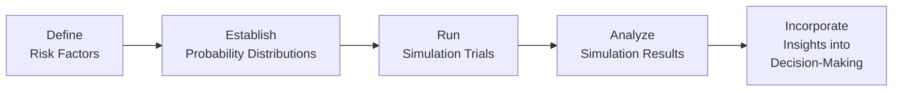

## 1.6 Simulation Methods for Scenario Testing

Have you ever tried to guess how your investments might behave if the market suddenly tumbled or if oil prices soared? Well, that’s pretty much what simulation methods do—only they do it with a lot more rigor and piles of data. Simulation-based scenario testing is an incredibly powerful set of tools for professionals who want a deeper understanding of how portfolios, projects, or strategies could perform under various “what if” conditions. Whether we’re using Historical Simulation to evaluate how assets would fare if history repeated itself, or Monte Carlo Simulation to craft an entire universe of possible outcomes, these techniques help us make more informed decisions in an ever-uncertain financial world.

Below, we’ll immerse ourselves in two main simulation methods—Historical and Monte Carlo—and see how these fit into the bigger picture of scenario analysis, including stress testing. We’ll explore typical usage, walk through some real-world examples, talk about some of my own personal experiences with simulation software (those moments of triumph and occasional frustration), and then wrap it up with best practices, limitations, and final exam tips. Ready? Let’s dig in!

### Historical Simulation

Historical Simulation is probably the most intuitive approach to scenario testing. In simple terms, you take actual past data—like daily returns or monthly price changes—and replay those historical movements on your current portfolio or financial instrument. Sounds straightforward, right? The idea is that past market conditions can give us a clue about how the future might unfold. Let’s say you want to understand the potential Value at Risk (VaR) of a portfolio of Canadian equities. By taking the portfolio’s current weights and then applying each of the last 1,000 days of historical returns to it, you can generate 1,000 simulated portfolio returns. From there, you’re able to measure the frequency and magnitude of losses, giving a sense of the downside risk.

But let me be honest about one of my first experiences with Historical Simulation: I once tried to apply data from 2006 to 2010 to a portfolio in a completely different industry stance—heavy in technology. The result? The simulation suggested minimal risk in certain areas, but that was largely because the past environment didn’t reflect new market dynamics (think social media, cloud computing expansions, etc.). Market structure changes, or “discontinuities,” can limit the power of Historical Simulation. Simply put, if the market has changed or there’s a significant shift in underlying fundamentals, purely relying on old data can result in a mismatch (a phenomenon we sometimes call “the past is no longer a good proxy for the future”).

#### Example: Portfolio VaR through Historical Simulation

Imagine you hold a portfolio of 50% US equities and 50% Canadian equities. You gather daily returns from the past five years. For each day in that sample, you apply the day’s realized returns to your current portfolio weights. You now have a sequence of simulated portfolio returns. Sort these returns from worst to best. If you’re looking at a 5% VaR, you pick the return that’s at the 5th percentile from the bottom. If that 5th percentile return is, say, -2.5%, you interpret that as having a 5% chance of losing 2.5% or more on any given day—at least according to history.

#### Strengths

• Reflects real market distributions: We’re directly using actual data, which naturally captures volatility clustering, fat tails, or any peculiarities that might exist in the historical record.  
• Simplicity and transparency: It’s literally “plug in historical daily returns, churn out potential outcomes.”

#### Weaknesses

• Assumes the past is an accurate proxy for the future: If you’re in a drastically evolving market, your results might be misleading.  
• Limited by the sample size and quality of historical data: If your data period doesn’t include enough crisis scen­­arios, you might be overly optimistic about tail risks.

### Monte Carlo Simulation

When you want a bit more flexibility in how you model the future, Monte Carlo Simulation is the gold standard. Instead of relying exclusively on the historical record, you specify probability distributions for your risk factors (interest rates, FX rates, commodity prices, etc.) and then randomly draw thousands—or even millions—of scenarios from those distributions. Whether you assume normality or something more heavy-tailed like a Student’s t-distribution, Monte Carlo is the approach for answering questions like, “What if the US Federal Reserve raises interest rates by 200 basis points, while energy prices plunge, all at the same time?” 

In practical terms, you might define the expected returns and volatilities for each asset alongside their correlations. Through random draws from these distributions (respecting correlations), you generate sets of potential future returns. Then for each set, you evaluate your portfolio’s performance. If you do this 100,000 times, guess what—you have 100,000 hypothetical future performance scenarios, all of which can help you see how your portfolio might respond to everything from mild ups and downs to crazy outliers.

I remember one of the first times I played with Monte Carlo modeling during a big consulting project. We were trying to figure out if a new capital budgeting project would be profitable if interest rates rose rapidly and if new competitors entered the scene. By tweaking parameters for sales growth, margin compression, and discount rates, we got a sense of how the project might pan out under many different realities. The insights were eye-opening: we saw a 20% chance the project might underperform by more than 15% in net present value (NPV). That single statistic changed the board’s perspective dramatically.

#### Stress-Testing with Monte Carlo

One huge benefit is that once you’ve built your Monte Carlo engine, you can basically attach any scenario you like. Maybe you want to specifically push the model to generate scenarios in which inflation hits 10% in the US or you experience a severe commodity shock in Canada. You can guide the random draws to reflect that environment and observe the impact on your portfolio or project. This can be a very powerful approach to capturing correlated risks that might not show up in the historical dataset—looking at you, Global Financial Crisis and COVID-19 meltdown.

#### Example: Option Pricing

Monte Carlo Simulation is famously used in options pricing, especially for complex options with path-dependent features like Asian orBarrier options. You specify a stochastic process (like geometric Brownian motion, or something more sophisticated) for the underlying asset’s price. Then you simulate thousands of paths. For each path, you compute the option payoff. Finally, you discount the average payoff back to the present day. That becomes your estimated fair price. This can handle a lot more complexity than the closed-form Black–Scholes model, especially when the option payoff depends on how the asset’s price behaves over time.

#### Strengths

• Flexibility: Allows testing of any distributional assumptions or stress scenarios you want.  
• Greater insight into tail events if you specify “fat-tailed” or skewed distributions.  

#### Weaknesses

• GIGO (Garbage In, Garbage Out): If your assumptions about distributions and correlations are off, your entire simulation can be misleading.  
• Can be computationally expensive—though with modern computing power, that’s often less of a concern than it used to be.

### Scenario Analysis in Portfolio Construction

Scenarios are basically stories about the future: “What if we have stagflation for the next three years? What if there’s another global financial crisis? What if real estate prices collapse?” By applying these “stories” to your models (whether they’re Historical or Monte Carlo or some hybrid approach), you can see how your portfolio—full of equities, fixed income, commodities, derivatives, you name it—might behave. 

Let’s say you’re building a balanced portfolio with both US and Canadian exposure. You might create a scenario for a global slowdown, a scenario for a commodity surge, and so on. Within each scenario, you set assumptions for GDP growth, interest rates, oil prices, exchange rates, and equity market volatility. Then you run these assumptions through your models to see how your holdings would fare. Sometimes, you discover that your “diversified” portfolio is not so diversified after all—maybe everything tanks under a global slowdown scenario because your assets are more correlated than you thought.

### Implementation Tools

Implementation could be as simple as building a spreadsheet in Excel with macros for smaller-scale problems. If you want 1,000 or 5,000 scenario draws, you can easily do that with built-in random number functions (like =RAND()) and some correlations. For larger, more complex tasks, both Python and R are your best friends. Packages like NumPy (Python) and the “quantmod” library (R) provide robust libraries for data handling, random generation, and matrix algebra. If you’re in a major financial institution in Toronto or New York, you might use specialized risk software such as Bloomberg’s MARS or other enterprise platforms that have simulation engines pre-built and data streams integrated.

Here’s an example of a simple flowchart that might describe a typical simulation process:

• Define Risk Factors: Identify key variables like interest rates, equity indices, commodity prices, FX rates, credit spreads.  
• Establish Probability Distributions: Gather historical data or calibrate from forward-looking assumptions.  
• Run Simulation Trials: Use either Historical or Monte Carlo methods to generate a large number of outcomes.  
• Analyze Simulation Results: Calculate portfolio returns, VaR, or scenario-specific performance metrics.  
• Incorporate Insights into Decision-Making: Adjust hedges, rebalance portfolios, re-evaluate strategic plans.  

### Limitations

All these methods—Historical Simulation, Monte Carlo Simulation, or scenario-based stress testing—are fantastic if used correctly, but each comes with potential pitfalls:

• Distributions May Be Mis-Specified: If reality doesn’t follow your chosen distribution (normal, lognormal, etc.), tail risks might be underestimated.  
• Changing Correlations: Market correlations aren’t static. If you rely on “old” correlations in your simulation, your model could be blindsided by new crisis dynamics.  
• Garbage In, Garbage Out (GIGO): We’ve said it before, but it’s worth repeating. Suppose you feed your simulation model with stale or poor-quality data. The result is next to useless.  
• Overconfidence in the Mean: If your “best guess” for average returns or rates is off, no amount of scenario generation will fix that fundamental mismatch.  
• Underrepresentation of Tail Events: If your historical data simply doesn’t capture a rare but plausible scenario, it’s easy to miss it.

Nevertheless, if you keep these limitations in mind, simulations can serve as an integral part of your risk management toolkit.

### Other Applications and Related Concepts

Although we emphasize portfolio risk, scenario testing also appears in corporate finance (capital budgeting decisions), derivatives (pricing complex options), and even in operational risk modeling. Because scenario testing intersects with other advanced quantitative methods like multiple regression (estimating parameters) or time-series analysis (constructing volatility forecasts), it naturally fits into the bigger picture of integrated risk management.

Machine learning, too, can be combined with simulation for more sophisticated predictive modeling. For instance, you might use a time-series model to forecast volatility, feed those forecasts into a distribution for your Monte Carlo runs, and then generate a set of possible future volatility pathways.

### Best Practices

• Tailor Your Simulations: Don’t blindly adopt standard assumptions—customize distributions or stress scenarios that match your portfolio’s unique exposures.  
• Blend Historical and Forward-Looking Data: Historical simulation is a great starting point, but consider adjustments for known structural changes.  
• Periodically Update Parameters: The market evolves. Your correlation matrix from last year might not apply now.  
• Document Your Assumptions Clearly: In a large organization, it’s easy for critical assumptions to get lost. Keep them explicit and transparent.  
• Cross-Verify with Other Techniques: For major decisions, compare your Historical Simulation results with a Monte Carlo approach to see if there are big discrepancies.

### Personal Reflection

I still remember the “aha” moment that came when we stress-tested a mining company’s portfolio in the face of a possible meltdown in global demand. The initial baseline scenario said everything was fine—until we tried out a hypothetical situation in which commodity prices and equity correlations spiked at the same time. Suddenly, the company’s supposedly “low-risk” hedging strategies didn’t look so hot. That’s the beauty of scenario testing: it unveils vulnerabilities that warm-and-fuzzy baseline projections might conceal.

### Final Exam Tips for CFA Level II

• Understand the Distinctions: Make sure you can clearly articulate the difference between Historical Simulation and Monte Carlo Simulation, including their strengths, weaknesses, and typical use cases.  
• Know the Inputs: Pay attention to how distributions, correlations, and sample periods are selected. The exam might query how changes in assumptions (e.g., correlation shifts) affect results.  
• Scenario vs. Sensitivity: Be able to differentiate scenario analysis (where multiple factors move together) from a single-factor sensitivity test.  
• Key Terms Matter: “Tail risk,” “stress testing,” “risk factor,” “VaR”—the CFA curriculum will expect you to be fluent with these concepts.  
• Time Horizon: Keep an eye out for how simulation results might differ if your horizon is daily vs. monthly vs. annual. The frequency matters for volatility, auto-correlation, and other aspects.  
• Implementation Nuances: The exam often includes short vignettes about managers or analysts implementing simulations. Watch for clues that might highlight pitfalls like data-snooping or correlation changes.  

And, as always, practice. You’ll likely see a vignette describing some bold manager who runs a Monte Carlo Simulation with questionable assumptions. Know how to spot those red flags and evaluate the approach critically.

### References

- CFA Institute Level II Curriculum (Quantitative Methods).  
- Glasserman, P. (2004). “Monte Carlo Methods in Financial Engineering.”  
- Jorion, P. (2007). “Value at Risk: The New Benchmark for Managing Financial Risk.”  
- R Project for Statistical Computing: https://www.r-project.org  
- Python Software Foundation: https://www.python.org  

---

## Test Your Mastery of Simulation Methods for Scenario Testing



### Which of the following describes a key advantage of Historical Simulation?

- [ ] It allows for unlimited hypothetical scenarios.  
- [x] It uses actual market data, capturing real-world distributions.  
- [ ] It requires minimal historical data.  
- [ ] It inherently accounts for future structural changes in the market.  

> **Explanation:** Historical Simulation uses actual historical returns to generate future outcomes, thus incorporating real-world market fluctuations like volatility clustering or fat tails. However, it may not account for future structural changes automatically.

### A risk manager wants to test how her portfolio might react to a dramatic commodity shock not observed in the past. Which simulation method is likely more suitable?

- [ ] Historical Simulation  
- [x] Monte Carlo Simulation  
- [ ] Factor Analysis  
- [ ] Simple Sensitivity Analysis  

> **Explanation:** Monte Carlo Simulation enables the manager to generate scenarios beyond historical data, allowing for “new” shocks or distributional assumptions that may not be represented in the historical record.

### In Monte Carlo Simulation, which of the following is generally considered a major weakness?

- [ ] It relies heavily on historical data.  
- [x] It depends on the accuracy of input distributions and correlations.  
- [ ] It is always slower than Historical Simulation.  
- [ ] It cannot be used for stress-testing.  

> **Explanation:** Monte Carlo Simulation’s accuracy hinges on the distributions and correlations chosen. Incorrect assumptions can lead to misleading results—often summarized as “Garbage In, Garbage Out.”

### Suppose a firm uses only three years of historical data in its simulation. Which risk is most likely increased?

- [x] The possibility of underrepresenting tail events.  
- [ ] The possibility of inflating the standard deviation.  
- [ ] The possibility of capturing overly extended market cycles.  
- [ ] The possibility of capturing too many crisis scenarios.  

> **Explanation:** With just three years of data, important tail events (e.g., a market crash) might be missing, leading to an underestimation of extreme risks.

### Which of the following best differentiates scenario analysis from sensitivity analysis?

- [x] Scenario analysis typically involves multiple factors changing at once, while sensitivity analysis looks at the effect of changes in a single factor.  
- [ ] Scenario analysis is used only in Historical Simulation, whereas sensitivity analysis is used in Monte Carlo.  
- [x] Scenario analysis uses real historical data exclusively, while sensitivity analysis uses hypothetical data.  
- [ ] Scenario analysis ensures correlation across factors remains constant, while sensitivity analysis does not.  

> **Explanation:** Scenario analysis generally changes multiple variables simultaneously, reflecting the complex interactions that can happen in reality. Sensitivity analysis generally manipulates one factor at a time.

### When using Monte Carlo Simulation to price a complex option, which of these steps is part of the general process?

- [x] Simulate thousands of paths for the underlying asset price.  
- [ ] Use only historical returns from the past year.  
- [ ] Rely on the Black–Scholes closed-form formula directly.  
- [ ] Randomly remove outlier data points before simulating.  

> **Explanation:** Monte Carlo option pricing often involves stochastically simulating many possible paths for the underlying asset price and averaging the discounted payoffs to find the fair option price.

### Which statement is most accurate regarding the impact of correlation changes during a crisis?

- [x] Correlations often increase across risky assets, amplifying losses.  
- [ ] Correlations remain static because crisis conditions are well-known.  
- [x] Correlations typically drop significantly as investors flee risk.  
- [ ] Correlation changes do not matter if returns are normally distributed.  

> **Explanation:** During market crises, asset classes that seem “uncorrelated” can move more closely in tandem, magnifying portfolio losses—a phenomenon sometimes called “correlation breakdown.”

### What is the primary goal of stress testing in the context of simulation methods?

- [ ] To discard any worst-case scenarios from the simulation.  
- [ ] To validate the normality assumption in the portfolio’s distribution.  
- [x] To systematically evaluate the portfolio or model under extreme market conditions.  
- [ ] To ensure that tail events are eliminated from future data.  

> **Explanation:** Stress testing forces the model or portfolio through extreme or unlikely scenarios to assess vulnerabilities so that risk managers can develop contingency plans.

### Which of the following is a typical sign of "Garbage In, Garbage Out" in simulations?

- [x] Simulation results that drastically differ from reality due to incorrect assumptions or data.  
- [ ] Perfect alignment between compliance requirements and simulation data.  
- [ ] The use of random number functions in a spreadsheet environment.  
- [ ] A robust backtest that agrees with forward performance.  

> **Explanation:** "Garbage In, Garbage Out" is the phenomenon where flawed assumptions, data, or model specifications produce misleading or worthless results.

### In the context of Historical and Monte Carlo Simulations, tail risk refers to which of the following?

- [x] The risk of rare, extreme events not well captured by a normal distribution.  
- [ ] The risk that correlations remain stable over time.  
- [ ] The risk that historical data always includes black swan events.  
- [ ] The risk of generating too many random scenarios in Monte Carlo.  

> **Explanation:** Tail risk is precisely about those rare, severe outcomes in the extreme ends of the distribution—often missed by models that assume normality or insufficient historical data.


