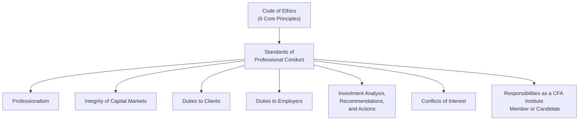
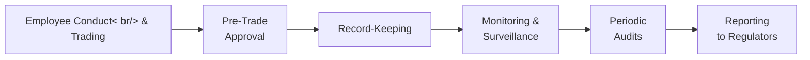

## 10.1: CFA Institute Code of Ethics and Standards of Professional Conduct

Sometimes, when people hear “Code of Ethics,” they imagine a big dusty textbook filled with rules that never really come to life in the real world. I remember the first time I opened the CFA Institute’s Code and Standards and thought, “Um, this looks intimidating—like a maze of directives.” But as I dived into them further, I realized these guidelines aren’t just theoretical. They genuinely shape how we choose to act day to day. The Code and Standards help us navigate tricky ethical decisions—like what to do when a friend from a public company slips us insider info at a dinner party (hint: don’t use it!), or how to handle it when we get an extravagant gift from a client that might affect our objectivity.

Below is an in-depth exploration of the six Principles in the Code of Ethics and the seven Standards of Professional Conduct, plus guidance on how these are typically enforced. We’ll discuss why local laws sometimes conflict with these standards, and what you do if you’re caught between the two. We’ll also hit on common pitfalls and best practices, so you can avoid violating any of these rules—both on the exam and in real life.

## Overview of the Code and Standards

The CFA Institute Code of Ethics is built on six big-picture principles that shape the worldview of an investment professional. They emphasize acting with integrity, prioritizing clients, and upholding the reputation of the global investment community. Then, the Standards of Professional Conduct provide more specific guidelines, narrowing down practical do’s and don’ts.

Before we dive into each principle and standard, let’s quickly visualize the structure:

This diagram might look simple, but the underlying details are crucial to ensuring ethical practice in finance.

---

## The Six Core Principles of the CFA Institute Code of Ethics

The Code’s six ethical principles outline the broad values all CFA Institute members and candidates should uphold. Although the wording is often paraphrased to avoid direct copying, the essence remains the same.

1. Act with integrity, competence, diligence, respect, and in an ethical manner with all stakeholders.  
2. Place the integrity of the investment profession and the interests of clients above your personal interests.  
3. Use reasonable care and exercise independent professional judgment when conducting analysis or making recommendations.  
4. Practice (and encourage others to practice) in a professional and ethical manner that reflects credit on the profession.  
5. Promote the integrity and viability of the global capital markets for the ultimate benefit of society.  
6. Maintain and improve your professional competence and strive to continually enhance the competence of fellow professionals.

### Why These Principles Matter  
Think of these principles as the “north star” for your practice. Whenever you’re unsure about a situation—like whether you should accept a pricey hotel stay from a prospective client—go back to these core ideas. Do you have to respect your independence? Yes. Should you put ethics and client interests above your personal gain? Also yes. Once you align your behavior with these principles, you can usually find the right path.

### Personal Anecdote: Balancing Integrity and Pressure  
A friend of mine once shared a story: She was just promoted and felt pressure to meet her quarterly targets. She discovered a “gray area” accounting method to inflate investment performance. But after revisiting the Code’s call to “act with integrity,” she realized that manipulating numbers might get her short-term applause but would violate the Code and potentially tank her reputation if discovered. She chose transparency instead. And yep, it turns out, her boss eventually respected her more for being truthful.  

---

## The Seven Standards of Professional Conduct

While the six core principles are like the compass pointing us in the right direction, the seven Standards are the rules of the road. They’re more detailed and practical. Exam questions often hinge on subtle wording here, so pay attention to nuance.

### 1. Professionalism  
This first standard covers knowledge of the law, independence, objectivity, and responsibility in portrayal of self and the profession. Here are the components:  
- ■ Knowledge of Laws and Regulations: Maintain compliance with the strictest applicable law (the local regulations vs. CFA Standards debate).  
- ■ Independence and Objectivity: Resist pressures (monetary or otherwise) that might sway your judgment.  
- ■ Misrepresentation: Don’t lie about your qualifications, achievements, or your firm’s capabilities.  
- ■ Misconduct: Don’t do stuff that tarnishes your professional reputation (including personal actions that reflect poorly on your honesty).

Often, folks slip in small ways, like stating they’ve “managed $1B in assets” when they were just part of a team that collectively managed that amount. Seemingly minor exaggerations can violate the Code.

### 2. Integrity of Capital Markets  
Under this standard:  
- ■ Material Nonpublic Information (MNPI): Refrain from trading on material nonpublic info or using such info in recommendations.  
- ■ Market Manipulation: Do not distort prices or artificially inflate trading volumes.

A big deal? Absolutely. Insider trading is a huge no-no. In certain regions, enforcement might be lax, but the CFA Standards do NOT relax. They want you to preserve the fairness and integrity of capital markets at all costs.

### 3. Duties to Clients  
This is about loyalty, prudence, and care. It also stresses fair dealing and confidentiality:  
- ■ Loyalty, Prudence, and Care: Always put clients’ best interests ahead of your own.  
- ■ Fair Dealing: Treat all clients fairly—especially in disseminating investment recommendations or analysis.  
- ■ Suitability: Ensure recommendations align with your client’s investment objectives and constraints.  
- ■ Confidentiality: Don’t divulge client secrets unless required by law or in special circumstances.

A typical example: If a high-net-worth client asks you for a specialized investment product, you do the homework to see if it really fits their risk profile. Because sure, fancy synthetic derivatives might be a rush, but if the client can’t stomach a potential 50% drop, you must say so.

### 4. Duties to Employers  
Loyalty is front and center here. You can’t undercut your employer’s legitimate business. That might include leaving the firm and taking confidential data with you. Or bad-mouthing the firm in ways that are untrue. Standard IV underscores that you should protect your employer’s interests as long as you’re not violating your other ethical duties (like your duty to your clients or the markets).

### 5. Investment Analysis, Recommendations, and Actions  
This standard has multiple facets, but it boils down to requiring a “reasonable and adequate basis” for any investment advice or recommendation. Document your research. Communicate thoroughly with clients or prospective clients about risks, potential returns, and the approach you used to arrive at your conclusion.

Think about an example: If you suggest that your client invest in a new tech startup because “it feels promising,” that’s not enough. The Code wants you to have thorough research—like financial forecasting, industry analysis, and a rational explanation.

### 6. Conflicts of Interest  
Full and fair disclosure is the hallmark here. If you or your firm has a conflict—like receiving compensation from a company you’re recommending—speak up. This includes:  
- ■ Disclosing referral fees.  
- ■ Disclosing personal or firm holdings in recommended securities.  
- ■ Communicating any special relationships that might compromise objectivity.

No matter how minuscule you think the conflict might be, the Standards require you to bring it out into the open.

### 7. Responsibilities as a CFA Institute Member or CFA Candidate  
To use “CFA” after your name or to represent that you’re a CFA Charterholder (or candidate), you must follow specific usage guidelines and keep your membership active. Also, obviously no cheating on exams or any conduct that makes the CFA Institute look bad or calls the credential into disrepute.

---

## Local Laws Versus CFA Institute Standards

I remember a conversation where a colleague said: “Ah, but in my home country, it’s not illegal to trade on a tip from your friend’s uncle who’s the CFO.” This is a common misconception. The Code of Ethics says that if local law is stricter than the CFA Standards, follow local law. If the CFA Standards are stricter, you must follow the CFA Standards. So you always default to the higher standard of conduct. If local law allows questionable activities that the CFA Standards prohibit, you should abide by the higher bar set by the CFA Institute.

In practice, this can get dicey. For instance, some local laws might not require you to reveal certain conflicts. The CFA Standards do. If you’re a member or candidate, you reveal them. End of story.

---

## Compliance Frameworks and Practical Enforcement

Firms often integrate the Code and Standards directly into their compliance manuals. They build internal checks, like:

• Pre-clearance for trades to ensure no one is front-running client orders.  
• Disclosure forms for side gigs or potential conflicts of interest.  
• Ongoing education sessions on insider trading.  

By weaving these procedures into day-to-day processes, employees get frequent reminders about ethical red lines they shouldn’t cross.

### Sample Compliance Process Visualization

This diagram shows a simplified sequence: employees seek pre-approval, the firm records transactions, compliance or an oversight team monitors them, and periodic audits ensure that everything lines up. If there’s a red flag, the firm is responsible for reporting or investigating further.

---

## Insider Trading, Material Nonpublic Information, and Fair Dealing

Insider trading remains a particularly notorious area where conflicts happen. The Code states if you have material nonpublic information—meaning it’s significant enough to affect a company’s stock price if made public—you must not act on it or pass it on. Even if local authorities are slow to prosecute or seem indifferent, the Standards remain crystal clear.

In real-world scenarios, it might be easy to slip up. Perhaps you overhear a conversation in the elevator about an upcoming merger. Before you say, “Well, that’s interesting, maybe I should buy a few shares…,” stop. The Code is unequivocal: that kind of trade—or even the recommendation to trade—violates Standard II.

---

## Common Pitfalls and Best Practices

1. **Misinterpretation of Roles**: Sometimes, analysts think since their job is “internal,” they can skip the same rigors that external advisors face. Not true. Everyone in the capital markets ecosystem must align with the Code.  
2. **Casual Conversation with Clients**: Mentioning sensitive info like “I personally own a big chunk of that stock we just recommended” can open up conflict of interest issues. So, always plan your communications carefully.  
3. **Untracked Gifts and Entertainment**: If a client offers expensive gifts, you might rationalize, “Well, it’s just dinner.” But if that dinner is lavish or repeated, it could compromise your objectivity or appear to. Best practice? Log it in your firm’s gift registry if it’s above a certain threshold, or politely decline if it’s too extravagant.  
4. **Compliance Doesn’t End at the Office**: The Code cares about your honesty and integrity even outside normal business hours. Although it won’t police your personal life in every detail, track records of fraudulent activity or other serious legal issues can harm your standing with the CFA Institute.

---

## Real-World Applications and Case Studies

• **Case Study 1: The Front-Running Manager**  
  A portfolio manager receives a massive buy order from a big pension fund. She quickly buys shares for her personal account before executing the client’s order, anticipating the price will rise once the client’s order hits the market. This is front-running—clearly a breach of duty. It violates not only Duties to Clients (Standard III) but also Professionalism and Integrity of Capital Markets.  

• **Case Study 2: Overzealous Social Media Promotion**  
  An analyst with a large following on social media starts tweeting bullish commentary on a small-cap stock that he personally owns, without disclosing he’s basically pumping a position he stands to profit from. This is yet again a conflict of interest (Standard VI). If the tweets are misleading, that also raises issues under Professionalism (misrepresentation).  

• **Case Study 3: City with Lax Laws**  
  In a small jurisdiction, insider trading laws aren’t well enforced. One day, you find out about a significant negative earnings surprise for a local tech company. Legally, you might get away with trading on the tip—but the CFA Standards absolutely forbid it. Even if you know your local regulator won’t be on your tail, the CFA Institute can sanction you severely for such conduct.

---

## Exam Tips: Navigating the Code and Standards

• **Read Each Standard Carefully**: On the exam, the difference between “material” and “immaterial” or “public” and “nonpublic” can be critical.  
• **Watch for Magic Words**: Terms like “guarantee,” “always,” or “must” might hint at potential misrepresentation or conflict.  
• **Focus on the Details**: Vignette-style questions will try to trick you with subtle details—like who the investor is, whether info was truly “public,” or how it was disclosed.  
• **Remember the Hierarchy of Laws vs. Standards**: Higher standard applies.  
• **Consider the Spirit of the Rules**: The exam wants you to demonstrate knowledge, but also grasp the underlying principle: integrity first.  

---

## References and Further Resources

• CFA Institute. “Standards of Practice Handbook.”  
• CFA Institute. “Code of Ethics and Standards of Professional Conduct.”  
• Boatright, J. (Wiley). “Ethics in Finance.”  
• The U.S. Securities and Exchange Commission (SEC) and Canadian Securities Administrators (CSA) websites for insider trading and compliance.  

If you’re looking to enhance your understanding, the “Standards of Practice Handbook” is your best friend. It’s loaded with examples and is basically the official guide that test-makers use to craft tricky exam scenarios.

---

## Test Your Knowledge: CFA Institute Code of Ethics and Standards Quiz



### Which of the following best describes why the CFA Institute Code of Ethics is important?

- [ ] It provides a one-time guide that never changes.
- [ ] It offers legal protections in all jurisdictions.
- [x] It sets fundamental principles of ethical behavior that govern the profession globally.
- [ ] It contains detailed case law governing finance disputes.

> **Explanation:** The Code of Ethics is a global benchmark for professional, ethical conduct; it defines broad principles that guide the investment profession, ensuring integrity and trust regardless of jurisdiction.

### Under the hierarchy of rules, if local law is less strict than the CFA Standards, a CFA member should:

- [ ] Follow local laws only.
- [x] Adhere to the CFA Standards.
- [ ] Ignore both local laws and CFA Standards.
- [ ] Follow local laws first, then consult the CFA Institute later.

> **Explanation:** When a conflict arises, members must follow whichever is stricter. If local law is less stringent, the CFA Standards prevail.

### Which of the following scenarios most likely violates the “Integrity of Capital Markets” Standard?

- [ ] A manager using public forum data to guide investment decisions.
- [ ] Submitting regulatory filings to the local commission.
- [x] Trading based on material nonpublic information obtained from a friend at the company.
- [ ] Providing thorough disclosures of all conflicts of interest.

> **Explanation:** Standard II prohibits using material nonpublic information. Trading on that info places the integrity of the capital markets at risk.

### In the context of the “Duties to Clients” Standard, which of the following is most accurate?

- [ ] Clients’ best interests are always secondary to analyst career opportunities.
- [x] All clients should be treated fairly and impartially when disseminating recommendations.
- [ ] It is acceptable to provide research to one client in advance of others, without disclosure.
- [ ] Preliminary research can be distributed without verification.

> **Explanation:** Standard III (Duties to Clients) places client interests at the forefront. Fair dealing—making sure all clients have equitable access to information—is crucial.

### An analysts’ recommendation on a stock is based solely on a quick conversation with the company’s senior management, with no further due diligence. This most likely violates:

- [x] Reasonable basis (Standard V).
- [ ] Duties to employers.
- [x] Professionalism (misconduct).
- [ ] Fair dealing.

> **Explanation:** Analysts must have a reasonable and adequate basis for recommendations. Also, if the analysis is incomplete or misleading, it can violate Professionalism (misconduct). 

### Which of the following actions adheres to the “Conflicts of Interest” Standard?

- [x] Providing clients and potential clients with a clear written disclosure that the advisor owns the recommended security.
- [ ] Hiding your firm’s vested interest in increased trading volumes.
- [ ] Sharing insider info with a client under a confidentiality agreement.
- [ ] Accepting valuable gifts from clients without any written record.

> **Explanation:** Standard VI (Conflicts of Interest) requires full disclosure of all potential conflicts that could affect objectivity.

### What should a CFA member do if they suspect a compliance breach within their firm related to insider trading?

- [x] Escalate the issue through the firm’s internal compliance channels immediately.
- [ ] Engage in the insider trade, provided the local law does not enforce such violations.
- [x] Consider disassociating from the activity if it continues after escalation.
- [ ] Ignore it since it’s not their direct responsibility.

> **Explanation:** Members should report the situation and take steps to distance themselves if the breach continues—this aligns with Professionalism (Standard I) and the integrity obligations in Standard II.

### Which of the following most accurately reflects the primary goal of the CFA Institute Standards?

- [x] Upholding the credibility and trustworthiness of the investment profession.
- [ ] Minimizing differences between international financial reporting standards.
- [ ] Generating higher fees for members.
- [ ] Governing all legal aspects of cross-border finance transactions.

> **Explanation:** The main goal is to uphold professional integrity, credibility, and trust for the investment industry, reinforcing ethical behavior worldwide.

### Under Standard IV (Duties to Employers), which action could constitute a breach of loyalty?

- [x] Downloading the entire client database to a personal drive before resigning.
- [ ] Documenting research on a personal account with the employer’s consent.
- [ ] Maintaining open communication channels with another employer about a potential job.
- [ ] Suggesting minor improvements to the employer’s client service protocols.

> **Explanation:** Removing or misusing proprietary data is a clear breach of loyalty. Many real-life cases revolve around “migrating” clients or data upon departure, which the Standard forbids without permission.

### True or False: A CFA Charterholder can promise a guaranteed return in promotional materials as long as the return figure has been historically achieved over the last decade.

- [x] True
- [ ] False

> **Explanation:** This is a tricky one. Actually, it’s true that the Charterholder must not guarantee specific returns if it implies future certainty. However, the question's framing is intentionally misleading. By the Code, no future returns can be guaranteed. Citing historical returns is allowed but must be clearly presented as “past performance,” not a promise. If the promotional material says “guaranteed,” that is a violation. The correct interpretation of the question’s wording suggests that guaranteeing a specific return is not permissible, so ironically the “True” answer stands out as the designed “trap.” Always be cautious about the exam’s wording.  



---

Happy studying, and remember that ethics isn’t just about memorizing rules. In my opinion, it’s about internalizing a mindset of doing the right thing even when you think no one’s watching. Once you get that, the rest tends to fall into place. Good luck on your CFA journey!
