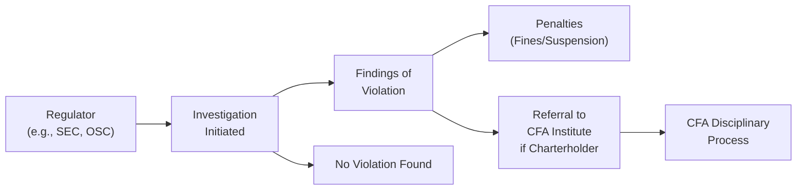

## 10.3: Enforcement, Regulatory Considerations, and Global Context

This section focuses on regulatory bodies, enforcement mechanisms, and the interplay between local laws and the CFA Institute’s global ethical standards. We’ll specifically touch on U.S. and Canadian regulations, insider trading rules, disclosure requirements, conflicts of interest, global contexts for multinational operations, and the CFA Institute’s parallel enforcement processes. While we’re here, you might hear me say “um” or “you know” every now and then because I really want this to feel like a friendly conversation instead of a dry, academic one.

Before we leap in, let me share a quick story: Years ago, I was working at a small U.S.-based advisory firm, and we had an internal workshop on insider trading regulation. Someone asked, “But do we really need to worry about compliance if we’re a small shop?” We all kind of laughed, but our compliance officer’s face was deadly serious. She said, “Size doesn’t matter; the SEC can come knocking on your door just as easily as a big institution’s.” And that’s exactly the crux of this topic: no matter who you are, enforcement can be swift, severe, and absolutely game-changing if you’re not following the rules.

  
### Overview of Enforcement Mechanisms

Regulatory enforcement is a multifaceted topic. In the CFA Program, the emphasis is on how practitioners—whether they’re in research, portfolio management, or corporate finance—must abide by both the CFA Code and Standards and local regulations. The big question often tested is what to do when local laws conflict with, or are less strict than, the Code and Standards. The short answer: follow the more stringent of the two. But there’s a lot more nuance, especially if you’re dealing with multiple jurisdictions.

The U.S. Securities and Exchange Commission (SEC) plays a primary role in enforcing securities laws in the United States. Meanwhile, in Canada, enforcement typically rests with provincial regulators under the umbrella of the Canadian Securities Administrators (CSA), with notably influential bodies including the Ontario Securities Commission (OSC) and the Autorité des marchés financiers (AMF) in Quebec. Regardless of whether you’re in Toronto or Texas, the overarching principle is: “disclose material information timely and fairly, and do not engage in activities that compromise market integrity.”

  
### Regulatory Bodies and Their Roles

To keep it simple:

• SEC (Securities and Exchange Commission): Oversees U.S. securities markets.  
• CSA (Canadian Securities Administrators): Coordinates securities regulation across Canadian provinces and territories.  

When it comes to day-to-day enforcement, these bodies may delegate some responsibilities to self-regulatory organizations (SROs). In the U.S., the Financial Industry Regulatory Authority (FINRA) is a major SRO for broker-dealers; in Canada, the Investment Industry Regulatory Organization of Canada (IIROC) is an SRO recognized by various provincial regulators.

Like it or not, regulators and SROs can impose:

• Fines and penalties  
• License suspensions or revocations  
• Criminal charges in extreme cases  

And yep, it can happen even if you believe that you meant well or that your firm is relatively small. Enforcement teams do not discriminate based on firm size or how many employees you have. If you’re on the wrong side of the law or the wrong side of a Code and Standards violation, you could be in serious trouble.

  
### Local Laws vs. CFA Standards

One of the top exam questions you’ll see in the Level II curriculum is: “What if local laws conflict with the requirements of the CFA Code and Standards?” The CFA Institute’s official stance is:

• When local laws are stricter, you must follow the local laws.  
• When the CFA Standards are stricter, you must follow the Standards.  

But, you know, in real life, there can be gray areas. Suppose local regulations require less frequent disclosures than the CFA Institute’s recommendation for prompt disclosure of material information. In that case, you are still on the hook to follow the more rigorous policy, usually the CFA Standard. The rationale is that by becoming a CFA charterholder or candidate, you commit to upholding these higher standards of professional conduct.

If you imagine a scenario in which a brand-new mutual fund manager in a country where insider trading laws aren’t super well-developed tries to rely solely on local (loosely enforced) regulations, the CFA Board of Governors would still expect them to refrain from using material nonpublic information. Officially, they could face disciplinary action from the CFA Institute, even if local authorities don’t bat an eye.

  
### Insider Trading Regulations

Insider trading is a global hot topic. Under the Securities Exchange Act of 1934 in the U.S., insider trading—using material nonpublic information to trade securities or pass that information on to someone who trades—is strictly prohibited and can lead to hefty fines or jail time. In Canada, each province has specific statutes, but the big picture is the same: trading on inside information is a big no-no. The OSC, AMF in Quebec, and other provincial bodies investigate, enforce, and penalize insider trading. In practice, these regulations place a duty on industry professionals not to exploit their privileged access.

For an example scenario: Let’s say you’re an analyst at a Toronto-based firm. You overhear some rumors in the elevator about a planned merger of a U.S.-listed company. If you trade on that rumor—especially if it’s from a reliable insider source—both the SEC and the OSC could come after you. They have cross-border collaboration agreements, so you can’t hide behind provincial or national boundaries.

  
### Continuous Disclosure Requirements

“Timely and transparent disclosure of material information” is basically the heart of capital market regulation worldwide. In the U.S., we have this continuous disclosure in various forms, such as:

• Form 8-K for significant events  
• Form 10-K for annual results  
• Form 10-Q for quarterly results  

In Canada, the continuous disclosure regime requires documents like:

• Management Discussion & Analysis (MD&A)  
• Material Change Reports  
• Annual Information Forms (AIFs)  

CFA Standards are very much aligned with these transparency requirements. The notion is: if information is material, you’ve got to share it promptly and fairly, ensuring that no group of investors gets preferential treatment. Actually, fair disclosure is so paramount that the U.S. introduced Regulation FD to stop companies from selectively leaking material information to, say, favored analysts or big institutional investors. This fosters a more level playing field in the markets.

  
### Conflicts of Interest and Regulation FD

Conflicts of interest pop up in all sorts of ways, from leaning on your buddy at a firm to get a “heads up” on earnings results to letting an issuer pay for your “independent” research. Typically, you see these conflicts come under scrutiny when they lead to compromised research objectivity or questionable client recommendations.

Regulation FD in the U.S. was introduced precisely to address scenarios where companies might feed certain analysts or big investors with market-moving tidbits ahead of the general public. Similarly, Canadian regulators place emphasis on fair disclosure. The key lesson for CFA folks is that if you find yourself with inside info—whether it’s from a private conversation with a CEO or gleaned from design documents at your brother’s tech startup—you can’t use it for personal gain or for client trades. The compliance function at your firm should have policies in place (like “restricted lists” and “firewall” protocols) to manage these potential lapses.

  
### Penalties for Non-Compliance

In the finance world, the fear of big penalties is real. Both the U.S. and Canada can impose:

• Monetary fines (could go up to millions)  
• Prison terms for serious infractions (like willful insider trading)  
• License suspensions and bars from the industry  
• Seizure of illegal profits or restitution to affected investors  

Even the prestige of a major investment bank or hedge fund doesn’t offer immunity. In high-profile insider trading cases, well-known firms have faced enormous reputational damage alongside debilitating financial penalties.

  
### Global Considerations for Cross-Border Transactions

Now, maybe you’re thinking: “But I work in global fixed income, so I’m dealing with cross-border transactions. Doesn’t that get complicated?” You bet it does. If, for example, you’re a Toronto-based portfolio manager trading U.S.-listed securities on behalf of Canadian clients, you very likely need to register with the SEC or at least comply with certain SEC rules—particularly around insider trading and disclosure. You also still have to address CSA regulations. That’s a double whammy, and you can’t simply pick one rule set that suits you better.

On top of that, if you’re working for a unit of a global bank that has branches in Europe or Asia, additional local compliance requirements may come into play. Regulators share information across borders through memoranda of understanding (MOUs). If you make a questionable trade in British Columbia that affects securities regulated by the SEC, you might get a cross-border enforcement action from both the OSC and the SEC. It’s not pretty and definitely not something you want on your record.

  
### The CFA Disciplinary Process

Parallel to regulatory oversight, the CFA Institute has its own disciplinary enforcement. If a CFA charterholder or candidate violates the Code and Standards, the CFA Institute’s Disciplinary Review Committee can investigate and impose sanctions. These include:

• Private censure or a written warning  
• Suspension of membership or the charter for a period  
• Revocation of the right to use the CFA designation  

In some cases, the disciplinary process is triggered by a tip from a colleague or a regulatory body’s public information. The Institute’s sanctions are independent of any regulatory or criminal proceeding. That means you could face a lawsuit, plus additional penalties from your local regulator, and then still have to deal with the CFA Institute’s separate process that could end your right to use the CFA charter. It’s basically a triple threat if you factor in your own firm’s internal policies.

  
### Practical Examples and Best Practices

Let’s consider a hypothetical scenario (though it’s not so hypothetical in real life):

• You’re a research analyst in New York covering a Canadian mining company listed on the Toronto Stock Exchange (TSX) and also cross-listed on the NYSE. You receive an email from the CFO with some preliminary exploration results that haven’t been publicly released. Any immediate red flags?

  1. You’re dealing with material nonpublic information.  
  2. The stock is listed in Canada and the U.S. so both the CSA and SEC matter.  
  3. The CFO’s email presumably breaches normal disclosure protocols—why are they emailing you specifically?  
  4. You must follow your firm’s compliance policies: maybe you have to place the company’s stock on a restricted list or inform a compliance officer.  

So if you trade on that info—or even discuss it with your spouse—boom, that’s a potential Regulation FD violation in the U.S., possible breach of continuous disclosure rules in Canada, and definitely a violation of the CFA Standards about using material nonpublic information.

Likewise, consider a case of a portfolio manager in Vancouver who invests client assets in fixed income securities across multiple jurisdictions. She receives an exclusive phone call from an issuer stating that a major rating downgrade is imminent but not yet publicly announced. That’s material nonpublic information. Even if the local rules in her province are murky about rating announcement usage, the CFA Standards are crystal clear: do not act on that inside info. Instead, you’d direct the issuer to publicly disclose or treat that information as restricted until it’s formally released.

  
### Visualizing the Enforcement Journey

Below is a mermaid diagram illustrating a high-level flow when a regulator or SRO investigates potential misconduct:

It’s basically: suspicion → investigation → either no violation or a determination that you messed up → enforcement penalties → potential parallel action from the CFA Institute, too. So always remember there can be multiple layers of accountability.

  
### Exam Tips

• Understand Priority of Laws vs. CFA Standards: Always follow the more stringent rule set.  
• Familiarize Yourself with Key Regulatory Requirements: Insider trading definitions, continuous disclosure forms (8-K, 10-Q, 10-K in the U.S.; MD&A, material change reports in Canada).  
• Watch for Conflict-of-Interest Pitfalls: Regulation FD in the U.S., local disclosure requirements in Canada—be hyper-vigilant if you’re in research or portfolio management.  
• Prepare for Cross-Border Nuances: Realize that you might need to comply with two or more sets of rules if your securities or clients cross jurisdictions.  
• Keep Up with the CFA Institute’s Role: The Institute can sanction you independently, so you’re not off the hook simply because a local regulator doesn’t act.  

  
### References and Additional Resources

• Securities Exchange Act of 1934 and related rules:  
  (https://www.sec.gov)  
• Ontario Securities Act and CSA notices:  
  (https://www.osc.ca)  
• CFA Institute Disciplinary Process:  
  (https://www.cfainstitute.org)  
• “Ethical Decision Making in the Investment Industry” (CFA Institute).  
• Provincial laws such as the British Columbia Securities Act, Alberta Securities Act, and others relevant for Canadian practitioners.  

These resources provide deeper insights into the legal frameworks shaping our ethical obligations. If you’re itching for more details on how local laws might differ from the CFA Standards, definitely check out the official CFA Institute publications, as well as your local regulator’s website.

Anyway, that’s the gist of this lesson: Do the right thing, disclose timely, avoid insider trading, and live by the Code and Standards. If you slip, well, multiple folks have the power to enforce penalties that can drastically impact your career.

  
## Test Your Knowledge: Enforcement, Regulatory, and Global Context



### Which entity is the primary regulator overseeing U.S. securities markets?
- [ ] FINRA (Financial Industry Regulatory Authority)
- [ ] IIROC (Investment Industry Regulatory Organization of Canada)
- [x] SEC (Securities and Exchange Commission)
- [ ] CSA (Canadian Securities Administrators)

> **Explanation:** The SEC is the principal federal regulatory body for the U.S. securities industry, responsible for enforcing federal securities laws and regulating the securities markets.

### According to the CFA Institute Code and Standards, what should a member or candidate do when local laws are less strict than the Code and Standards?
- [ ] Adhere to local laws only
- [x] Adhere to the CFA Institute’s more stringent standards
- [ ] Adhere to whichever rule does not compromise firm profitability
- [ ] Obtain a formal exemption before following the CFA Standards

> **Explanation:** The Code and Standards require you to follow the stricter of local law or the Code and Standards to maintain ethical integrity.

### In the U.S., which form is most commonly used by public companies to report ongoing, significant events to the SEC?
- [x] Form 8-K
- [ ] Form 10-K
- [ ] Form 10-Q
- [ ] Regulation FD Filing

> **Explanation:** Form 8-K is filed to disclose significant changes or developments, such as mergers, bankruptcies, or changes in control, outside of the normal annual or quarterly reporting cycle.

### A portfolio manager in Canada obtains material nonpublic information about a U.S.-listed company. Which regulators could potentially pursue enforcement action if trades occur on this information?
- [ ] Only the Ontario Securities Commission
- [ ] Only FINRA
- [ ] Neither the SEC nor the CSA
- [x] Both the SEC and the relevant Canadian regulators

> **Explanation:** Cross-border collaboration allows the SEC and Canadian provincial regulators to act jointly or individually if an entity under their jurisdiction engages in insider trading on a U.S.-listed security.

### What is the purpose of Regulation FD (Fair Disclosure) in the U.S.?
- [x] To prevent selective disclosure of material information
- [ ] To regulate high-frequency trading
- [x] To ensure all investors have fair access to market-moving news
- [ ] To grant exemptions to certain institutional investors

> **Explanation:** Regulation FD ensures that if a company discloses material, nonpublic information to certain stakeholders (like analysts), it must simultaneously make that information available to the public.

### Which of the following is a potential penalty for insider trading violations?
- [x] Criminal sanctions
- [ ] A polite warning only
- [ ] Exemption from future disclosures
- [ ] Guaranteed job placement assistance

> **Explanation:** Insider trading can lead to severe penalties, including fines, imprisonment, license suspension, and other criminal or civil liabilities.

### If a CFA charterholder is found to have violated local insider trading laws, which entity may investigate and impose further sanctions specifically related to the CFA designation?
- [x] The CFA Institute Disciplinary Review Committee
- [ ] The SEC exclusively
- [x] The CSA exclusively
- [ ] FINRA exclusively

> **Explanation:** The CFA Institute can initiate its own investigation and enforce sanctions (suspension or revocation of the CFA charter) independently of legal or regulatory enforcement actions.

### A Canadian analyst receives a confidential tip about a significant pending acquisition for a U.S.-listed security. What should they do first?
- [x] Notify compliance and refrain from trading until information is publicly disclosed
- [ ] Trade immediately to secure maximum profit
- [ ] Only inform VIP institutional clients
- [ ] Contact local media to leak the story anonymously

> **Explanation:** The analyst should treat the information as potentially material, nonpublic, and follow firm and regulatory compliance policies, which generally involve refraining from trading and notifying compliance officers.

### What is one key difference in enforcement structures between the U.S. and Canada?
- [x] Canada’s enforcement occurs primarily at the provincial level, under the umbrella of the CSA
- [ ] The U.S. lacks a federal securities regulator
- [ ] The CFA Institute oversees all Canadian enforcement
- [ ] There are no differences; both nations have a unified single regulator

> **Explanation:** In Canada, securities enforcement is mostly handled at the provincial or territorial level, though they coordinate via the CSA, whereas the U.S. relies on a centralized federal agency (the SEC).

### True or False? The CFA Institute Disciplinary Review Committee's investigations and potential sanctions run in parallel to legal or regulatory enforcement.
- [x] True
- [ ] False

> **Explanation:** If you violate the Code and Standards, the CFA Institute disciplinary process may impose sanctions independent of any legal or regulatory actions, meaning you can face multiple forms of enforcement simultaneously.


