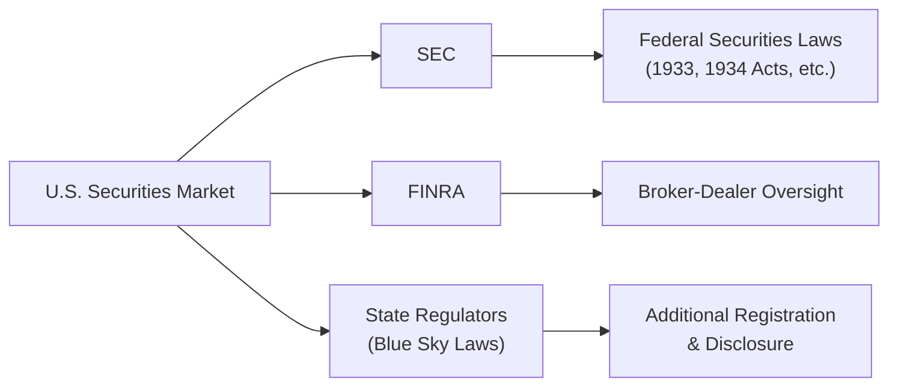
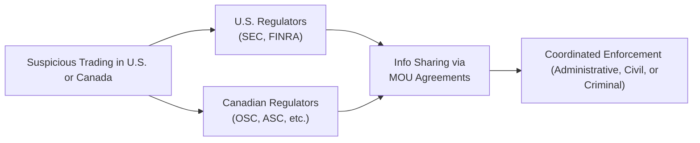

## 11.1 Securities Regulation in the U.S. and Canada

Sometimes, when people first hear about securities regulation, they go, “Oh no, not more red tape!” I felt the same way in my early finance days. But, you know, as soon as I started digging into the topic—reading about how complex and nuanced these rules are—I realized that these regulations are pretty important for making sure the securities markets stay fair, transparent, and efficient. In this chapter, we’ll explore how the United States and Canada structure their regulatory frameworks, from historic acts (like the U.S. Securities Act of 1933) to current self-regulatory organizations (like FINRA and IIROC) and some of the practical implications for both local and cross-border offerings.

Throughout this journey, we’ll try to keep things slightly conversational—maybe even throw in the occasional personal comment—while still giving you a detailed, thorough guide. After all, this is for your CFA Level II prep, but there’s no reason we can’t be a bit human about it!

### Introduction to Securities Regulation

Securities regulation is all about safeguarding investors and maintaining trust in the marketplace. This means legislators and regulators focus on:

• Making sure issuers of securities (like companies making their initial public offerings) give accurate, timely, and comprehensive information.  
• Setting rules and standards for brokers, dealers, and other intermediaries.  
• Creating processes to enforce ethical standards and punish fraudulent behavior.  

In both the United States and Canada, regulatory bodies share similar core mandates—protecting investors, ensuring fair dealing, and fostering efficient financial markets—though the frameworks, specific rules, and institutional structures can differ. Let’s see how they stack up.

### Key Regulatory Bodies in the United States

In the U.S., the primary federal agency responsible for securities regulation is the Securities and Exchange Commission (SEC). Now, if you’ve ever glimpsed an S-1 form or read about insider trading prohibitions, you’ve come across the SEC’s handiwork. The SEC was formed in 1934 as part of the overarching legislative response to the 1929 stock market crash, which was a tough time for nearly everyone. Its responsibilities include:

• Enforcing federal securities laws such as the Securities Act of 1933 and the Securities Exchange Act of 1934.  
• Overseeing the registration of securities offered for public sale.  
• Ensuring ongoing disclosure compliance by public companies.  
• Regulating and monitoring securities professionals, including brokers and investment advisers.  
• Coordinating enforcement actions against violators (both individuals and corporations).

Alongside the SEC is the Financial Industry Regulatory Authority (FINRA). FINRA is a self-regulatory organization (SRO) that focuses on broker-dealers and many aspects of day-to-day trading activity. If a broker or brokerage firm operates in the U.S., they’re probably subject to FINRA’s rules on how they can advertise, how they must handle client assets, continuing education requirements, and so forth.

The U.S. also has state-level “Blue Sky Laws.” Each state has its own securities regulator, and you have to comply with their requirements unless exemptions apply. If you’re an issuer or a broker-dealer, ignoring these laws can be a huge headache.

Here’s a simple diagram illustrating some of these main regulators:

In practice, the SEC, FINRA, and state regulators work both jointly and independently to supervise activities in the securities markets. The interplay of federal and state regulations can sometimes cause confusion, but in a sense, it’s all part of a layered system designed to stop unscrupulous dealings from slipping through the cracks.

### Key Regulatory Bodies in Canada

Canada’s regulatory environment can feel a bit different—even more decentralized because each province has its own securities regulator. There’s no single Canada-wide securities regulator at the federal level (at least not yet, although discussions about creating one occasionally pop up). Instead, we have:

• Canadian Securities Administrators (CSA). This is an umbrella group of all the provincial and territorial regulators. The CSA itself doesn’t pass laws but tries to harmonize rules and coordinate policy.  
• Individual provincial regulators, such as the Ontario Securities Commission (OSC), the Autorité des marchés financiers (AMF) in Quebec, the Alberta Securities Commission (ASC), and more.  
• The Investment Industry Regulatory Organization of Canada (IIROC). Like FINRA in the U.S., IIROC is a self-regulatory organization that oversees investment dealers and trading on Canada’s equity and debt marketplaces.

Canada’s patchwork approach means that each province has its own Securities Act—such as Ontario’s Securities Act or Alberta’s Securities Act. However, the CSA works to streamline the various rules into something resembling a nationally consistent structure. For instance, National Instrument 51-102 sets continuous disclosure requirements and is adopted (with minor variations) by each province.

### Historical Foundations of U.S. Securities Laws

The Great Depression spurred the U.S. to take bold steps to restore faith in capital markets. The Securities Act of 1933 was the initial blueprint, requiring companies to provide financial details and other material facts when offering securities to the public. One main principle of the ’33 Act is “registration,” which ensures that investors receive critical information in a prospectus or registration statement.

Then came the Securities Exchange Act of 1934, which created the SEC as the authority to regulate the secondary trading of securities—think stock exchanges, broker-dealers, and so on. The 1934 Act also set ongoing reporting requirements for publicly traded companies in the U.S. (Forms 10-K, 10-Q, 8-K).

Later, further reforms, like the Sarbanes-Oxley Act of 2002, tightened corporate governance. Another key rule you might’ve heard about is Regulation FD (Fair Disclosure). Adopted in 2000, it requires publicly traded companies to simultaneously provide material information to the general public rather than giving selective disclosures to favored analysts or institutional investors. Regulation FD is kind of a perfect example of how U.S. lawmakers try to ensure a level playing field for all participants.

### Historical Foundations of Canadian Securities Laws

In Canada, securities law historically fell within provincial jurisdiction. Over the years, each province wrote its own legislation, culminating in around 13 sets of rules. While that might sound like an over-complication, the CSA has worked really hard to achieve harmonization.

Though not driven by the same “crash and Depression” impetus as the U.S. in the 1930s, Canadian regulators recognized the need for robust investor protection. The result is a system that’s conceptually similar to the U.S. approach: you must provide an up-front prospectus or rely on an exemption, and you have to provide ongoing disclosures if you’re a public issuer.

Today, provincial regulators, in collaboration with the CSA, regularly release National and Multilateral Instruments dealing with everything from prospectus rules to continuous disclosure (like National Instrument 51-102) to special considerations for investment funds (National Instrument 81-101) and more. Meanwhile, organizations like IIROC fill a SRO role for broker-dealers, investment advisors, and compliance in trading venues.

### Registration and Disclosure Requirements: U.S. Perspective

When a U.S. issuer decides to go public, they typically file a registration statement with the SEC (often Form S-1). This registration statement contains financial statements, risk factors, the purpose of the offered securities, and so on. After going public, a company must provide periodic reports:

• Form 10-K (annual report, including audited financial statements)  
• Form 10-Q (quarterly report, including unaudited financials)  
• Form 8-K (material event disclosures, e.g., mergers or CFO changes)  

Additionally, the SEC has specific rules to ensure that certain “material information” is released publicly. That’s where Regulation FD comes in. If a company inadvertently discloses material information, it must promptly make a public disclosure. Of course, if the company is careful, they do all investor calls and press releases in a way that aligns with FD from the outset.

When cross-border offerings happen—let’s say a Canadian firm wants to sell securities directly to U.S. investors—there are special forms (like Form F-3, F-10, or F-20) that might come into play. The details can get technical, but you can think of them as parallel versions of the S-1, adapted for foreign private issuers who follow IFRS or other accounting standards.

### Registration and Disclosure Requirements: Canadian Perspective

In Canada, the process for issuing securities to the public also revolves around filing a prospectus. The content is governed by provincial securities acts and CSA national instruments. A typical prospectus includes:

• Financial statements prepared according to IFRS (in most cases).  
• Material risk disclosures pertinent to the company’s industry and operations.  
• A description of the issuer’s business, intended use of proceeds, and management details.

Once listed on a Canadian exchange (like the Toronto Stock Exchange), companies must abide by continuous disclosure obligations. National Instrument 51-102 sets out requirements for annual information forms (AIFs), annual and interim financial statements, management discussion & analysis (MD&A), and timely disclosure of material changes. 

There’s also a concept known as the integrated disclosure system. It allows issuers with well-established disclosure histories to incorporate previously filed information (like annual reports) by reference into new filings. This can cut down on duplication of documents. Canada also has prospectus exemptions, which allow companies to raise capital from certain types of investors—like “accredited investors” or via private placements—without having to file a full-blown prospectus.

### Cross-Border Issuances

When a firm wants to tap into both U.S. and Canadian markets, the disclosure obligations can multiply quickly. However, regulators have worked to create reciprocal or streamlined processes. For instance:

• Multi-Jurisdictional Disclosure System (MJDS) between the SEC and Canadian regulators can help large seasoned issuers raise capital in both countries without duplicating the entire prospectus process.  
• Memoranda of Understanding (MOUs) exist so that regulators can share information and coordinate enforcement.  

For many large Canadian public companies, cross-listing on U.S. exchanges is a strategic move for greater access to capital and visibility. This typically requires registering as a “foreign private issuer” in the U.S. and complying with certain U.S. disclosures while also meeting Canadian obligations.

### Enforcement and Cross-Border Cooperation

Another key piece of the puzzle is enforcement. The SEC and Canadian regulators each have their own enforcement arms, and if you’re found to be violating securities laws—say, by perpetrating a fraud or insider trading—you can expect serious consequences. In the U.S., for example, the SEC can seek civil injunctions, collect monetary penalties, and bar individuals from serving as corporate officers or directors. State regulators might also impose their own penalties.

In Canada, enforcement typically takes the form of administrative proceedings (led by provincial regulators like the OSC or the ASC) or quasi-criminal prosecutions. IIROC can also sanction members (investment dealers or individuals) through its own tribunals. Criminal cases for severe securities fraud may be pursued under federal or provincial criminal codes.

Thanks to cross-border agreements such as MOUs, the SEC and Canadian regulators share information on suspicious transactions. If a trader in Vancouver allegedly manipulates Tesla stock in the U.S., the CSA can gather and forward evidence to the SEC. The same goes for the SEC when it sees suspicious trading in Canadian stocks on U.S. accounts. This cross-border synergy is especially critical in a world where technology—online brokerage accounts, advanced trading algorithms—makes national boundaries feel less relevant every day.

### Ethical Considerations and CFA Institute Standards

In addition to local laws, finance professionals must follow the CFA Institute’s Code of Ethics and Standards of Professional Conduct. In practice, this means:

• Maintaining confidentiality of clients’ assets and information.  
• Avoiding insider trading by not using or sharing material, non-public information.  
• Ensuring objectivity and integrity in analyses—particularly important for research analysts dealing with potential conflicts of interest.  
• Complying with both the letter and spirit of securities laws.  

Securities regulation frameworks in both countries echo these ethical imperatives. Insider trading laws, for instance, are designed to keep markets fair for all participants. If you’re a CFA charterholder or exam candidate, failing to follow them isn’t just a legal violation—it’s also unethical conduct that can have severe ramifications for your professional standing.

### Practical Examples and Case Studies

To highlight how these rules work in real life:

• Consider a U.S. public company that wants to issue new equity to raise capital. They file a shelf registration statement on Form S-3, which the SEC reviews. After clearing any comments, the company can issue new shares quickly when market conditions are favorable—reducing time-to-market and capturing better pricing.  
• In Canada, a large energy company might want to do a cross-border debt offering. They can use the MJDS approach, which lets them comply largely with Canadian disclosure requirements. If the SEC deems these requirements “substantially equivalent,” the process is much smoother, and they can list those debt instruments in both countries.  
• FINRA might open an investigation if there are unusual trading patterns in a U.S. stock—for example, a big spike in short selling just before a negative earnings announcement. If these trades are linked to a Canadian brokerage account, FINRA would coordinate with IIROC and the relevant provincial commission to see if insider information could have been at play.

### A Quick Mermaid Diagram on Cross-Border Enforcement

### Best Practices and Common Pitfalls

Professionals should beware of:

• Inadequate due diligence. If you’re advising a company on going public, not being thorough with disclosures can come back to bite you.  
• Selective disclosure. If you share material info with a few analysts but not the market, you can trip over Regulation FD (in the U.S.) or Canadian timely disclosure rules.  
• Misinterpreting exemptions. Prospectus exemptions can be tricky, and failing to stay within their boundaries or forgetting one region’s rules can lead to regulatory trouble.  
• Underestimating local differences. A cross-border offering might look straightforward at first, until you realize that Quebec has language requirements or that certain U.S. states have special Blue Sky regulations.

### Conclusion

Whether you’re a CFO of a public company, an investment banker, or an aspiring analyst prepping for the CFA exam, you’ll want to understand how these regulatory frameworks shape the playing field. The U.S. system, though more centralized, still has multiple layers with the SEC, FINRA, and states. Canada, more decentralized on paper, is diligently working toward harmonized rules through the CSA and has IIROC offering consistent brokerage regulation. 

Despite the complexity—and maybe even the frustration—the underlying philosophy remains the same on both sides of the border: investor protection and market integrity. And trust me, after you see a few real-world cases of fraud prevented (or at least deterred) by these rules, you may start to appreciate them on a new level.

### Final Exam Tips

• Be sure you know the main registration forms in the U.S. (like S-1 or S-3) and how that differs from a Canadian prospectus under National Instrument 51-102.  
• Memorize key acronyms: SEC, FINRA, CSA, OSC, IIROC. In a vignette, you don’t want to confuse IIROC with FINRA.  
• Be prepared for scenario-based questions that test your understanding of insider trading, cross-border cooperation, or selective disclosure.  
• Grasp the structure of enforcement—not just how the SEC operates, but how the two countries coordinate.  
• Reference the CFA Code of Ethics alongside local regulatory requirements. The exam often ties in these overlapping ethical/moral frameworks.

### References and Further Reading

• CFA Institute, “Standards of Practice Handbook.”  
• U.S. SEC official website: <https://www.sec.gov>  
• Canadian Securities Administrators official website: <https://www.securities-administrators.ca>  
• “Canadian Securities Regulation” by Poonam Puri and Anita Anand.  
• “U.S. Securities Regulation: A Guidebook” by The Practising Law Institute.  

---

## Test Your Knowledge: U.S. and Canadian Securities Regulation



### Which regulatory agency in the U.S. primarily oversees broker-dealers?

- [ ] Securities and Exchange Commission (SEC)
- [x] Financial Industry Regulatory Authority (FINRA)
- [ ] Federal Reserve
- [ ] Department of Justice (DOJ)

> **Explanation:** Broker-dealers in the U.S. are primarily overseen by FINRA, a self-regulatory organization. The SEC still has ultimate authority, but day-to-day broker-dealer regulation is handled by FINRA.

### What is the main function of the Canadian Securities Administrators (CSA)?

- [x] Coordinating and harmonizing securities regulation among Canada’s provinces and territories
- [ ] Acting as a federal securities regulator
- [ ] Issuing criminal penalties for insider trading
- [ ] Operating the Montreal Stock Exchange directly

> **Explanation:** The CSA is an umbrella organization whose goal is to improve coordination among Canada’s provincial and territorial regulators. It does not function as a federal securities regulator.

### Which of the following acts created the SEC in the United States?

- [ ] Securities Act of 1933
- [x] Securities Exchange Act of 1934
- [ ] Sarbanes-Oxley Act of 2002
- [ ] Investment Company Act of 1940

> **Explanation:** The Securities Exchange Act of 1934 established the SEC. The 1933 Act focused on registration of new securities offerings.

### In Canada, which of the following self-regulatory organizations is responsible for overseeing investment dealers and trading activity?

- [ ] CPA Canada
- [x] IIROC
- [ ] CSA
- [ ] ASC

> **Explanation:** The Investment Industry Regulatory Organization of Canada (IIROC) is the SRO overseeing investment dealers and trading activity in Canadian markets.

### Which statement best describes Regulation FD in the United States?

- [x] It requires public companies to disclose material information to all investors simultaneously.
- [ ] It mandates that all public companies file short-swing profit reports.
- [x] It ensures selective disclosure is made only to major shareholders.
- [ ] It bans insider trades even if no profit is realized.

> **Explanation:** Regulation FD aims to eliminate selective disclosure by ensuring material information is disseminated broadly and fairly to all investors.

### Which of the following is true about Blue Sky Laws?

- [x] They are state-level securities laws in the U.S.
- [ ] They eliminate the need for SEC registration.
- [ ] They do not apply to federal offerings.
- [ ] They are exclusive to the European Union.

> **Explanation:** Blue Sky Laws refer to U.S. state-level securities regulations. They function alongside federal laws, although certain exemptions can apply.

### If a Canadian company wants to issue equity in the U.S. under a streamlined approach that relies on Canadian disclosures, which system is most relevant?

- [x] The Multi-Jurisdictional Disclosure System (MJDS)
- [ ] National Instrument 51-102
- [x] The Commodity Futures Modernization System
- [ ] Sarbanes-Oxley Act

> **Explanation:** The MJDS helps Canadian and U.S. issuers streamline cross-border disclosures by allowing the primary regulator’s rules to stand in for the other, subject to meeting certain requirements.

### Which of the following documents would a U.S. public company file to report a change in its CFO?

- [ ] Form 10-K
- [ ] Form S-1
- [x] Form 8-K
- [ ] Form 10-Q

> **Explanation:** Material corporate events, such as management changes, require an 8-K filing.

### Which of the following scenarios accurately depicts a violation of insider trading laws?

- [x] Trading on material, nonpublic information obtained from a friend who works at the prospective target company.
- [ ] Trading after reading quarterly earnings already publicly released.
- [ ] Buying stock after a public conference call discussing next quarter’s outlook.
- [ ] Selling stock to rebalance your portfolio based on readily available analyst reports.

> **Explanation:** Insider trading involves using material, nonpublic information for a transaction that could confer an unfair advantage.

### Under Canadian regulations, true or false: The Ontario Securities Commission (OSC) has the authority to take administrative enforcement actions against individuals or firms violating securities laws?

- [x] True
- [ ] False

> **Explanation:** Like most provincial regulators, the OSC can pursue administrative enforcement (e.g., fines, bans) against violators in its jurisdiction.


