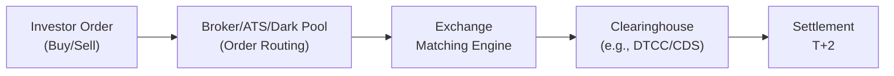

## 11.4 Market Microstructure and Trading Environments

Market microstructure describes how market participants interact, how trades are executed, and how prices are formed. It might sound like a dry concept—like analyzing the plumbing system of a huge building—but if you’ve ever placed a stock order and wondered where it goes and how it gets filled, market microstructure holds the answer.

Sometimes, I still recall my first encounter with a limit order. I remember thinking: “Great, I set my price—if the market doesn’t match it, I’m good, and if it does, perfect!” Of course, I quickly realized there’s a rather intricate system behind that tidy little checkbox, spanning exchanges, market makers, clearinghouses, and everything in between. Welcome to the real engine room of financial markets.

Below, we’ll explore the specifics of market structure in the United States and Canada, focusing on the major exchanges, alternative trading systems, dark pools, short-selling regulations, circuit breakers, clearing, and settlement. Understanding these building blocks helps you navigate important concepts such as liquidity, price discovery, best execution obligations, and the overall cost of trading.

## Major U.S. Exchanges: NYSE and NASDAQ

The United States is home to some of the world’s largest and most active stock exchanges—most notably the New York Stock Exchange (NYSE) and the NASDAQ Stock Market. Both have distinct mechanisms, listing requirements, and liquidity profiles. Let’s see what this looks like under the hood.

### NYSE: The Big Board

• Origin and Listing Requirements  
  The NYSE, or “Big Board,” traces its roots back to 1792. If you want to be listed on the NYSE, you need to meet stringent financial and governance criteria, which typically include minimum thresholds for share price, market capitalization, number of shareholders, and corporate governance standards. These listing requirements are generally more rigorous than many other exchanges, often drawing established, larger-cap companies.  

• Trading Floor and Designated Market Makers  
  The NYSE employs designated market makers (DMMs), formerly known as specialists, who are responsible for maintaining fair and orderly markets in specific stocks. While electronic trading is now the main channel for executing trades, there’s still a physical trading floor. DMMs step in with liquidity when no one else is willing to trade, which helps dampen extreme volatility and ensure a smoother price formation process.  

• Trading Volumes and Liquidity  
  Thanks to high listing standards, the NYSE is known for large-cap, highly liquid stocks. Liquidity is so abundant that spreads (the difference between bid and ask) tend to be tight. This usually helps investors execute trades quickly and at expected prices.  

### NASDAQ: The Electronic Pioneer

• Listing Requirements  
  NASDAQ’s listing standards differ slightly but remain strict enough to attract a wide range of growth-oriented and tech-savvy firms—think Apple, Microsoft, Amazon, and many more. Smaller or emerging companies can list on the NASDAQ Capital Market tier, while larger, more established names typically join the NASDAQ Global Select Market.  

• Electronic Trading and Dealers  
  Unlike the NYSE’s historical floor-based model, NASDAQ pioneered electronic trading, operating as a dealer network. Market makers provide two-sided quotes (bid and ask) for NASDAQ-listed securities, competing for order flow. In this sense, the market itself is decentralized, though technology ensures trades happen instantaneously.  

• Liquidity and Innovation  
  NASDAQ is often the first stop for tech startups and fast-growth companies looking to access capital. Liquidity in major tech stocks can be enormous, with high daily trading volumes. The competition among market makers generally keeps spreads tight, though smaller or riskier NASDAQ stocks might exhibit wider spreads.

## The Toronto Stock Exchange (TSX) and TSX Venture Exchange (TSXV)

Canada’s equity market is smaller but still highly significant. The TSX (Toronto Stock Exchange) is recognized globally for its offerings in financial services, energy, and mining, among other sectors. Meanwhile, the TSX Venture Exchange (TSXV) is more of an incubator for emerging companies.

### TSX: Canada’s Largest Exchange

• Listing Criteria and Composition  
  Firms aiming to list on the TSX face a set of standards around market capitalization, shareholder distribution, financial statements, and continuity of business. These requirements are somewhat comparable to the NYSE or NASDAQ, though scaled to the Canadian market. This environment appeals to established firms in sectors such as natural resources, financials, and more.  

• Market Makers (If Applicable)  
  The TSX is predominantly an electronic order-matching system. Designated market makers aren’t always as visible or central as on the NYSE. Many Canadian equities still have “Assigned Market Makers” or “Responsible Designated Traders,” but their role can be more limited compared to the NYSE’s DMM structure.  

• Trading Volumes and Liquidity  
  Liquid names on the TSX can see robust daily volumes, but overall liquidity tends to be lower than NYSE or NASDAQ on an absolute scale. This difference in volume can widen bid-ask spreads, though top-tier TSX stocks remain quite liquid.  

### TSXV: The Venture Exchange

• Listing Requirements for Emerging Companies  
  The TSX Venture Exchange offers lower barriers to entry for emerging or smaller-cap firms, particularly in the mining and resource exploration sectors. This exchange is often a stepping stone to the main TSX—once companies grow sufficiently, they may “graduate” to a TSX listing.  

• Liquidity Constraints  
  Because these are smaller companies, liquidity can be more sporadic. Spreads may be wider, and price volatility can be significant. This environment also attracts a fair amount of speculative trading, so investors and traders should be prepared for the risk.

## Alternative Trading Systems (ATS) and Dark Pools

It’s not just about the primary listing exchanges. Over the past few decades, alternative trading venues have emerged under different regulatory frameworks in both the U.S. and Canada, offering additional ways to match buy and sell orders.

### ATS in the U.S. (Reg ATS) and Canada (NI 21-101)

• Definition and Role  
  An ATS is an electronic marketplace that matches orders but doesn’t function as a registered exchange. Examples include electronic communication networks (ECNs) and other private order-matching platforms. These systems are subject to their own regulatory regime: in the U.S., that’s Reg ATS under the SEC; in Canada, it’s National Instrument 21-101 (NI 21-101). ATSs often cater to specific types of participants seeking speed, lower transaction fees, or anonymity.  

• Dark Pools  
  Dark pools are a subset of ATSs offering limited trade disclosure so large institutional orders can be executed without revealing their intent to the broader market. Think of it like a private party: you can interact with other participants, but outsiders don’t see what’s trading until after the orders are filled. This helps reduce market impact for big block trades.  

• Impact on Transparency and Price Discovery  
  Critics argue that dark pools reduce transparency, potentially undermining the price discovery function of lit (public) exchanges. Regulators in both the U.S. and Canada require regular reporting of trades from dark pools, though real-time quote disclosure can be minimal or nonexistent.

## Short-Selling Rules and Circuit Breakers

Short selling—where you sell a security you don’t own, hoping to buy it back later at a lower price—has distinct regulatory frameworks in the U.S. and Canada. Alongside that, circuit breakers (also known as trading halts) act as speed bumps for extreme price movements.

### U.S. Short Sale Regulations (Reg SHO)

• Reg SHO Basics  
  The SEC’s Reg SHO outlines how short sales must be identified and located (the “locate” requirement). If you’re short-selling a stock, your broker must confirm shares are available to borrow.  

• Uptick Rule and Price Tests  
  The old uptick rule (allowing new short sales only on an uptick) was largely replaced, though certain price tests still apply during periods of severe price declines (e.g., triggered if the stock’s price drops by 10% or more from the prior day’s close).  

### Canadian Short Selling (UMIR)

• Universal Market Integrity Rules  
  Canada’s IIROC enforces the Universal Market Integrity Rules (UMIR) across multiple Canadian marketplaces. While many principles overlap with Reg SHO (e.g., locate requirements), UMIR has its own specific triggers and conditions for short sale orders.  

• Key Differences  
  One difference is the approach to short sale price restrictions. Canada may not have an explicit alternative uptick rule but addresses violent downward price spirals with more direct interventions or other forms of regulation.

### Circuit Breakers and Market Halts

• U.S. Market-Wide and Single-Stock Circuit Breakers  
  In the U.S., circuit breakers have tiered triggers. If the S&P 500 falls by a certain percentage—7%, 13%, or 20%—it can lead to trading pauses or closures for the rest of the day. Single-stock circuit breakers (limit up-limit down, or LULD) halt trading if a stock’s price moves outside predefined price bands.  

• Canadian Trading Halts  
  The TSX (and other Canadian exchanges) can halt trades in a stock if there’s pending news or if the price moves beyond a certain threshold in too short a time. The processes mirror the U.S. logic but adapt to local market conditions and liquidity levels.

## Cost Analysis: Fees, Spreads, and Clearing Systems

Costs can sneak up on you—like ordering a fancy coffee that ends up costing more than your meal. For investors and traders, it’s crucial to understand how exchange fees, bid-ask spreads, clearing fees, and settlement processes affect your net results.

### Exchange Fees and Bid-Ask Spreads

• Maker-Taker Models  
  Some venues charge a “taker” fee for those executing against standing orders, but pay a “maker” rebate for those who provide liquidity. This can alter broker order-routing strategies since brokers might prefer routes that yield higher credits.  

• Beyond Commissions  
  Even if your brokerage offers “commission-free” trading, it might be offset by less favorable prices or slower execution. So it pays to ask: “Where exactly are my orders going?”  

### Clearing and Settlement: DTCC vs. CDS

• U.S. Clearing—DTCC  
  The Depository Trust & Clearing Corporation (DTCC) clears and settles the vast majority of U.S. stock trades. DTCC effectively acts as the counterparty to both sides of a transaction, guaranteeing the trade will go through if one side defaults.  

• Canadian Clearing—CDS  
  In Canada, the Canadian Depository for Securities (CDS) fulfills a similar role. Both countries use a T+2 settlement cycle (trade date + two business days). This consistent standard simplifies cross-border trading, though there can be smaller differences in fees and settlement procedures.

### Timelines for Settlement

Under T+2, if you buy shares on Monday, they typically settle by Wednesday, at which point you officially own them. One potential shortcoming of T+2 is the credit and liquidity risk that arises during those two days. Clearinghouses mitigate much of this risk with margin requirements, guaranteeing trades are settled.

## Practical Example: Evaluating Trading Costs

Imagine you want to buy 1,000 shares of a Canadian gold mining company that’s listed on the TSX. The stock’s quote is CAD 10.05 (bid) – CAD 10.07 (ask). The spread is CAD 0.02 per share. If you buy at the ask, the immediate cost from the spread is CAD 20. If your broker charges a commission of CAD 9.99, that’s straightforward. But there might also be exchange fees and clearing/settlement fees—either built into your commission or covered indirectly by your broker.  

In contrast, if you tried to buy a comparable U.S.-listed gold miner on the NYSE, you might see a narrower spread that offsets higher exchange or SEC fees. Different brokers route orders differently, and currency conversion might matter as well. For those who trade cross-border, keep a close eye on these cost components.

## Using Diagram to Illustrate Order Flow

To visualize how an order traverses from an investor to final settlement, consider this simplified flowchart:

This diagram shows the sequential steps: an investor places the order, the broker may route it internally or to an ATS, the exchange matches a buyer with a seller, and ultimately the clearinghouse manages the risk before final settlement.

## Best Practices, Pitfalls, and Challenges

• Best Execution Obligations  
  Brokers have a duty of best execution, which means they must strive to get you the best possible outcome, considering price, speed, and overall cost. In both the U.S. and Canada, regulators emphasize that brokers must not simply route orders to the venue that pays them the highest rebate.  

• Potential Pitfalls  
  Traders sometimes assume all venues operate similarly. In reality, microstructure differences can influence price volatility, execution speed, and fill likelihood. In less liquid TSXV stocks, an investor might experience partial fills or wide spreads.  

• Strategies to Overcome Common Issues  
  Many institutional traders use algorithms that slice large orders into smaller portions to minimize market impact. Retail investors can consider limit orders rather than market orders to avoid unpleasant surprises in wide-spread stocks. Also, using well-regulated brokers who have transparent order-routing is crucial.

## Encouraging Critical Thinking

When analyzing your trades, don’t just focus on the nominal share price and commission. Think about the venue, potential hidden fees, the reliability of the clearing system, and the possibility of partial fills—especially if you’re dealing with less liquid shares. Maybe you wonder: “Why was my order partially filled in the opening auction?” or, “Why did my order route to an ATS and not to the main exchange?” The answers can reveal subtle aspects of microstructure that might significantly affect your results.

## Glossary

TSX (Toronto Stock Exchange):  
Canada’s largest stock exchange, predominantly for senior equities, with rigorous listing requirements.

TSXV (TSX Venture Exchange):  
A marketplace for emerging or smaller-cap companies. Often seen as an entry point before graduating to the TSX.

ATS (Alternative Trading System):  
An electronic venue matching buy and sell orders outside traditional exchanges. Examples include ECNs and dark pools.

Dark Pool:  
A private trading venue that does not publicly display buy and sell orders, typically used by large institutions to reduce market impact.

Reg ATS (SEC):  
The regulation in the U.S. that governs the registration and oversight of ATSs, ensuring they meet certain transparency and reporting standards.

UMIR (Universal Market Integrity Rules):  
Trading regulations enforced by IIROC across Canadian marketplaces, including short-selling guidelines and other integrity measures.

DTCC (Depository Trust & Clearing Corporation):  
The primary clearing agency in the U.S., playing a crucial role in settling trades and mitigating counterparty risk.

CDS (Canadian Depository for Securities):  
Canada’s central clearing and settlement system, providing similar functions as DTCC but specific to Canadian marketplaces.

## References for Further Exploration

• O’Hara, Maureen. “Market Microstructure Theory.” A comprehensive academic discussion on how markets function and how prices are formed.  
• Kim, Kendall. “Electronic and Algorithmic Trading Technology.” Excellent resource for understanding the electronic infrastructure of modern markets.  
• IIROC: <https://www.iiroc.ca>—Canadian Self-Regulatory Organization, with updates on UMIR and related market integrity measures.  
• FINRA: <https://www.finra.org>—U.S. SRO that oversees broker-dealer compliance, providing notices on short-selling and best execution.  

## Exam Tips

• Familiarize yourself with the main differences in listing requirements between NYSE, NASDAQ, TSX, and TSXV. You might be presented with a scenario about where a company should list based on liquidity needs and market exposure.  
• Understand the roles of designated market makers vs. electronic order books. The exam might ask which system fosters narrower spreads or better price discovery.  
• Remember to compare U.S. Reg SHO with Canada’s UMIR. Watch for a question about the rationale behind short-selling restrictions and the steps needed for compliance.  
• Know how ATS and dark pools can impact market transparency. This is especially relevant in best execution questions and potential regulatory concerns around fairness.  
• Have a basic sense of fees and key differences in clearing—DTCC in the U.S. vs. CDS in Canada. Being able to articulate how trades move from execution to settlement might win you valuable points.  

By keeping these points in mind, you’ll be well-equipped to tackle typical CFA Level II exam vignettes on market microstructure.

--------------------------------------------------------------------------------

## Test Your Knowledge: Market Microstructure and Trading Environments



### For which of the following reasons might a large institution choose to execute a large block trade in a dark pool rather than on a lit exchange?

- [x] To minimize price impact by hiding the true size of the order.
- [ ] To obtain a rebate paid by the designated market maker.
- [ ] To fully avoid all regulatory oversight and reporting requirements.
- [ ] To shorten the settlement cycle to T+1.

> **Explanation:** Dark pools typically hide the size and sometimes the identity of those placing large orders, helping to reduce market impact, but trades must still be reported after execution.

### Which of the following best describes the difference between the NYSE and NASDAQ in terms of trading structure?

- [ ] NYSE is entirely electronic, while NASDAQ still has a physical trading floor.
- [x] NYSE uses designated market makers, while NASDAQ relies more on a dealer network of market makers.
- [ ] NASDAQ listing requirements are more stringent than those of the NYSE.
- [ ] NYSE and NASDAQ both require companies to adopt the “maker-taker” pricing model.

> **Explanation:** The NYSE uses DMMs on the physical trading floor. NASDAQ is an electronic quotation system where multiple competing market makers set bid and ask prices.

### In Canada, which primary regulatory framework governs short-selling practices across multiple marketplaces?

- [ ] Reg SHO.
- [x] Universal Market Integrity Rules (UMIR).
- [ ] Reg ATS.
- [ ] FINRA Code of Conduct.

> **Explanation:** UMIR is enforced by IIROC across Canadian marketplaces, setting out how short sales are regulated.

### When an exchange implements a single-stock circuit breaker, what is the main purpose?

- [x] To pause trading if a security’s price swings outside a predefined range too quickly.
- [ ] To allow only short sellers to trade the security during market stress.
- [ ] To permanently delist the security after a sudden price drop.
- [ ] To raise listing fee requirements for highly volatile stocks.

> **Explanation:** Single-stock circuit breakers pause trading temporarily, giving time for additional information to reach the market, preventing potential overreaction.

### Which marketplace is generally considered the primary venue for smaller or emerging companies in Canada?

- [x] TSXV (TSX Venture Exchange).
- [ ] NYSE MKT (formerly AMEX).
- [x] TSX Alpha.
- [ ] None of the above.

> **Explanation:** The TSXV focuses on smaller-cap, often early-stage companies, providing a stepping stone toward a full TSX listing.

### Which clearing entity handles the majority of equities settlement in the United States?

- [x] DTCC (Depository Trust & Clearing Corporation).
- [ ] NSCC (National Securities Clearing Corporation) in isolation.
- [ ] CDS (Canadian Depository for Securities).
- [ ] FINRA.

> **Explanation:** The DTCC is the primary clearing agency for U.S. equities, ensuring that trades clear and settle appropriately.

### In a typical maker-taker market model, which party is most likely to receive a rebate?

- [x] The party posting liquidity (the “maker”).
- [ ] The party removing liquidity (the “taker”).
- [x] The regulator overseeing the market.
- [ ] The exchange operator by default.

> **Explanation:** Maker-taker models reward the liquidity providers (i.e., those who place limit orders that get executed) with rebates, while liquidity takers pay a fee.

### In the U.S., regulations require that an investor’s broker must confirm shares are available to borrow before executing a short sale. Under which regulation is this requirement mandated?

- [x] Reg SHO.
- [ ] Reg ATS.
- [ ] UMIR.
- [ ] FINRA 4512.

> **Explanation:** Reg SHO governs short selling in the U.S., including the requirement that brokers locate shares before a short sale.

### Why might a Canadian listed company on the TSX Venture Exchange decide to move to the main TSX?

- [x] Higher liquidity and more visibility to institutional investors.
- [ ] To reduce the stringency in continued listing requirements.
- [ ] Because TSXV has stricter circuit breaker thresholds.
- [ ] To take advantage of the regulated short sale uptick rule.

> **Explanation:** Many smaller companies see the TSXV as a stepping stone to the larger TSX, which typically offers higher trading volumes and more market exposure.

### T+2 settlement refers to which of the following statements?

- [x] True
- [ ] False

> **Explanation:** T+2 means that when a transaction occurs on the trade date (T), the final settlement (ownership transfer of the security and cash) happens two business days later.


