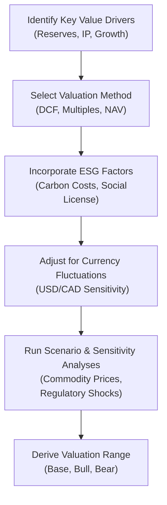

## 11.5 Industry-Specific Valuations in North America

Valuing companies in North America often presents unique twists rooted in regional regulations, natural resources, currency fluctuations, and fast-evolving markets. Maybe you've heard stories of an analyst sent out to the Canadian oil sands armed only with a battered notebook and some well-practiced discounted cash flow (DCF) templates, or about the bewildered financial intern trying to get a handle on the intangible assets of a scrappy tech startup in Silicon Valley. The challenges are real, but also super fascinating!

So, let’s dig in. In this section, we’re going to look at some of the most prominent industries in the U.S. and Canada, detail the unique valuation hurdles each industry faces, and figure out how to handle them in our analyses—especially from a CFA® Level II vantage point. We’ll talk about best practices, highlight key concepts, and show how certain IFRS and U.S. GAAP guidelines come into play.

--------------------------------------------------------------------------------

### Valuation in the Energy Sector (Oil Sands in Canada, Shale in the U.S.)

The energy sector in North America encompasses everything from conventional oil fields to shale oil/gas in the U.S. and the vast oil sands in Alberta, Canada. Let’s face it—valuing these companies can get tricky. Costs, regulatory standards, environmental considerations, and commodity price volatility all add layers of complexity.

#### Reserve-Based Valuation Models
A hallmark of energy company valuation is something known as reserve-based valuation. In many ways, it’s the driver behind an investor’s perception of a firm’s worth in this space:  
• Reserves are categorized by the degree of certainty in extraction (Proven, Probable, Possible).  
• The present value of future cash flows from these reserves can be estimated based on projected commodity prices, operational expenses (opex), and capital expenditures (capex).  

In many Canadian oil sands operations, additional complexity arises from high extraction costs. Bitumen is more challenging (and expensive) to extract compared to lighter crude. Analysts typically incorporate these higher costs of production into their discounted cash flow models, especially when forecasting netbacks (sales price minus all costs upstream of the refinery).

#### Commodity Price Sensitivity
Imagine you’re building a model for an oil sands operator in Alberta. Commodity price cycles can be extreme—there might be a year with oil above $100 a barrel, and the next year you could see it below $50. Such intense swings have huge impacts on cash flow forecasts. We often stress test at different price scenarios to understand base-case, bull, and bear valuations. This scenario analysis is not optional; it’s arguably mandatory, given the cyclical nature of oil prices.

#### High Capex Demands
Energy companies tend to be heavily capital intensive. Large up-front expenditures for exploration and development may result in negative free cash flows during certain periods. For that reason, net present value (NPV) or internal rate of return (IRR) analyses spanning multiple years—and factoring in both commodity price and operational cost volatility—are essential. If you haven’t run an IRR scenario with an assumption of pipeline constraints or additional political/regulatory hurdles, you might be missing a big piece of the puzzle.

--------------------------------------------------------------------------------

### Valuation in the Mining Sector (Precious Metals, Base Metals)

Mining in North America—especially in Canada—often involves precious metals (like gold), base metals (like copper, nickel), or other resources. If you think the energy sector is cyclical, wait until you see the ups and downs in metals. Mining companies, in certain cases, are even more sensitive to global economic growth rates.

#### Resource Estimates and NI 43-101
Canada has strict guidelines for how mining companies need to report resource estimates, known as NI 43-101 (National Instrument 43-101). This is crucial if you’re looking at Toronto Stock Exchange (TSX)-listed miners. NI 43-101 basically tells you how to classify resources (Measured, Indicated, Inferred) and sets disclosure standards. An accurate estimate of resources under the ground is quite literally the bedrock of a valuation, forming the foundation for DCF or net asset value (NAV) calculations.

#### Cyclical Volatility and Price Assumptions
Commodity price assumptions for metals can be just as challenging as those for oil. During boom times, gold or copper might fetch a significant premium; but the next thing you know, demand collapses, and so does the price. Because of this cyclical nature, many analysts use consensus estimates for metal prices alongside their own long-term equilibrium forecasts. Also, any hint of a slowdown in industrial usage (for base metals) or changes in central bank policy (for gold) can cause big shifts in prices.

#### Environmental Liabilities
Mining can create substantial environmental liabilities—costs associated with land reclamation, tailings pond maintenance, and potential water contamination. If you’re analyzing a mining project with a 20-year life, you must know how reclamation costs and environmental responsibilities will affect the tail end of the project. Under IFRS, companies must accrue these site restoration costs. Besides, when factoring in ESG considerations, environmental liabilities can alter a firm’s cost of capital or, in some cases, its social license to operate.

--------------------------------------------------------------------------------

### Valuation in the Technology Sector (Silicon Valley in the U.S., Emerging Hubs in Canada)

So, maybe you’re more comfortable with the intangible, data-driven world. The technology sector—concentrated in Silicon Valley and increasingly found in Canadian tech hubs like Kitchener-Waterloo—is another area where valuations can get, well, interesting. Why? Because a lot of the “value” might not appear clearly on a balance sheet.

#### Intangible Assets and R&D
Valuation in tech often hinges on intangible assets. Patents, proprietary software, user data, brand, or network effects can form the basis of a company’s competitive advantage. Under IFRS, R&D is treated differently than in the U.S. GAAP environment. Certain development expenditures (once technical feasibility is proven) can be capitalized under IFRS, while the U.S. approach may default to expensing unless specific criteria are met. This difference can lead to significant variations in reported earnings and book value between IFRS and U.S. GAAP.

Analysts typically rely on a combination of methods—comparable company analysis (by growth stage or by revenue multiples), discounted cash flow (especially if future growth can be reasonably forecast), or venture capital (VC) proprietary models that focus on unique factors (like monthly burn rate, product adoption rate, or active user metrics).

#### High Growth and Valuation Multiples
Technology companies can exhibit exponential growth—leading to lofty valuations reminiscent of the dot-com era. Multiples like Price-to-Sales (P/S) or Enterprise Value-to-Revenue (EV/Revenue) become relevant when earnings or cash flows are negative (or minimal). Be sure to consider growth potential, market penetration, and intangible assets. Also, if you’re dealing with advanced technologies (e.g., AI, biotech, advanced manufacturing), you may need specialized knowledge to interpret the viability and scope of the product pipeline.

--------------------------------------------------------------------------------

### Valuation in the Cannabis Sector (Canada and Select U.S. States)

This one is new, at least compared to the well-established energy and mining industries. Cannabis was legalized federally in Canada in 2018, and in some U.S. states, it’s legalized for medical or recreational use. But in other areas of the U.S., it remains illegal under federal law. That mismatch alone can complicate valuations.

#### Complex Regulatory Environment
Cannabis companies often have to navigate widely different regulations from province to province in Canada and from state to state in the U.S. If you’re, say, analyzing a cannabis producer in Ontario, the distribution model might differ from one in Alberta. In the U.S., some states don’t even allow direct distribution of certain cannabis products. The patchwork of rules can affect revenue potential, capital structure, and growth prospects.

#### Evolving Revenue Streams and Growth Metrics
In the cannabis space, it’s still early days in terms of consistent data and established business models. Companies may have revenue from recreational cannabis, medical cannabis, edibles, or derivative products (like CBD oils). Each one might come with different margins, distribution constraints, and growth trajectories.

As a result, you might see unusual key performance indicators (KPIs)—like grams produced, grams sold, or average price per gram. The cost structure can vary dramatically based on production methods (e.g., indoor vs. greenhouse vs. outdoor). Traditional comps might not be readily available, so sometimes analysts compare cannabis companies to regulated industries such as alcohol or tobacco, albeit with numerous caveats.

--------------------------------------------------------------------------------

### Emphasis on ESG and Sustainability Disclosures

Particularly in Canada, sustainability reporting has gained traction—especially in resource-heavy sectors like energy and mining. U.S. companies are also ramping up environmental, social, and governance (ESG) disclosures, though standards can vary. Investors increasingly rely on these ESG metrics to evaluate risk and long-term viability.

#### Carbon Emission Costs
We’ve seen an evolving regulatory environment around carbon emissions. Many Canadian companies have to report carbon intensity, and some are subject to carbon pricing or cap-and-trade regimes. Even in the U.S., more states are adopting carbon taxes or offset programs. From a valuation standpoint, these fees or taxes lower operating margins, so they should be explicitly modeled. If you're analyzing a mining company that faces stiffer carbon taxes over time, it probably means either a higher discount rate or lower projected net cash flows.

#### Potential Regulatory Changes Affecting Cash Flows
Policy shifts—like the introduction of new environmental legislation—can drastically alter cost structures. Scenario analysis remains your best friend here. Many professional analysts run multiple DCF scenarios toggling between “stringent carbon tax environment” and “low or no carbon tax scenario” to test a range of valuations.

--------------------------------------------------------------------------------

### The Interplay of Currency Fluctuations (USD vs. CAD)

In cross-border valuations, especially for companies operating in both the U.S. and Canada, currency matters a lot more than you might initially think. Exchange rate differences can significantly influence reported revenues, expenses, and net incomes. Consider an oil producer in Alberta that sells to U.S. refineries. Even if their functional currency for accounting is CAD, the price of oil is often denominated in USD, leading to gains or losses purely from exchange rate movements.

#### Stress Testing Exchange Rate Scenarios
When building your forecast model, incorporate multiple exchange rate scenarios—particularly if a substantial portion of revenue or costs is denominated in a different currency from the firm’s reporting currency. If the CAD strengthens meaningfully against the USD, that oil producer’s realized revenue might shrink in CAD terms. Conversely, if the CAD weakens, the company’s top line could look rosier. Understanding how these movements can affect your valuation is vital, especially given the cyclical swings in commodities.

--------------------------------------------------------------------------------

### Best Practices for Normalizing Financial Statements

Companies in resource-intensive industries often exhibit big fluctuations in revenue and expenses. Commodity prices, seasonality, or regulatory factors can cause unusual spikes in certain quarters. As a result, normalizing these financials is crucial to get a clearer sense of underlying performance and trends.

#### Commodity Price Fluctuations and Hedging
Many companies hedge their commodities exposure—oil producers might use forward contracts or swaps to lock in a certain price, while mining firms might hedge metal prices. To accurately compare financial statements, you might need to strip out the impact of these hedges, especially if they are short-term, or note them separately so you don’t mix “hedged revenue” with “market-based revenue.” A common pitfall is to double count or fail to account for hedging gains/losses properly when building a forward-looking model.

#### Depletion, Depreciation, and Amortization (DD&A)
Resource companies typically use depletion methods that tie directly to actual extraction of reserves. Tech companies, on the other hand, often have intangible-driven amortization. The variety of depreciation schedules makes cross-industry comparisons hazardous if you’re not adjusting properly. Whether you use IFRS or U.S. GAAP, ensure that you isolate the impact of different depreciation or depletion methods. Under IFRS, a more component-based approach to depreciation is often used compared to the somewhat prescriptive methods under U.S. GAAP.

#### Adjusting for One-Off Items
You might see one-time gains/losses from asset sales, environmental fines, or restructuring that can skew the reported earnings of companies in these volatile sectors. Normalizing means removing or clearly labeling these items so you can see the company’s stable, ongoing performance. In resource industries, you might have to remove gains from partial stake sales in joint ventures or from insurance claims after a natural disaster (flooding in a mine or well site, for instance).

--------------------------------------------------------------------------------

### Visualizing the Valuation Process

Below is a simple schematic of how resource and non-resource companies might incorporate different factors into their valuations. Let’s keep it super high-level:

--------------------------------------------------------------------------------

### Practical Set of Tips and Strategies for Approaching Industry-Specific Valuations

1. **Be Industry-Aware:** Each sector has its own language. In mining, you’ll live and breathe NI 43-101 reports. In tech, you’ll poke into intangible assets. In energy, you’ll talk reserves.  
2. **ESG as a Risk Lens:** Sustainability factors can feel intangible but can translate quickly into real costs (e.g., carbon taxes, reclamation). Accept that ESG metrics can shift your entire cost structure.  
3. **Model Different Scenarios:** Because of the cyclical nature of resource and energy sectors, rely more heavily on stress testing. If you skip it, you risk missing key insights.  
4. **Look for Hedge Accounting:** Understand how the company’s hedging activities flow through the financial statements—especially if you’re normalizing results.  
5. **Monitor R&D Accounting in Tech:** Check if R&D is being capitalized or expensed, and see how it differs from your peer group’s approach.  
6. **Mind Regulatory Differences:** Cannabis valuations in Canada vs. in certain U.S. states can differ drastically because of local and federal laws.  
7. **Normalize, Normalize, Normalize:** Remove one-off events, reevaluate depreciation schedules, and account for currency swings to get a more stable picture of operating results.  

--------------------------------------------------------------------------------

### References, Suggested Books, and Articles

• “Canadian Oil Sands: Life-Cycle Assessments” by the Canadian Energy Research Institute  
• “Valuing Mining Companies: A Guide to Essential Tools” by The Northern Miner  
• “Renewable Energy and Climate Policies” from Government of Canada (https://www.canada.ca/en/services/environment) and the U.S. Department of Energy (https://www.energy.gov)  

These resources can help you gain deeper insights into the complexities of resource valuations and the evolving regulatory frameworks in North America.

--------------------------------------------------------------------------------

### Final Thoughts and Exam Tips

• **Exam Relevance:** Expect vignette scenarios that might describe a Canadian mining firm’s resource estimates under NI 43-101 or a U.S. shale oil company’s production forecast. You could be asked to reflect changes in commodity prices, interpret hedging results, or account for intangible R&D assets differently under IFRS vs. GAAP.  
• **Be Ready for ESG Factors:** Stay alert to how carbon taxes or sustainability factors alter cost structures in your DCF or multiple analyses.  
• **Currency Effects:** A question might involve revaluing cash flows after a shift in exchange rates from USD to CAD, or vice versa, and testing scenario-based discount rates.  
• **Pay Attention to Normalizing Adjustments:** The essence of these exam questions is about unraveling one-time items, hedging, or changes in depreciation method to find “true” earnings power.  

--------------------------------------------------------------------------------

## Test Your Knowledge: Industry-Specific Valuations in North America



### Which statement best describes a key challenge in valuing an Alberta oil sands producer?

- [ ] Overstating intangible assets
- [ ] Minimal capital expenditure requirements
- [ ] Lack of volatility in commodity prices
- [x] High extraction costs impacting project economics

> **Explanation:** Oil sands projects typically face higher operating and capital costs because of the specialized extraction processes for bitumen, which substantially impact valuations.

### In Canadian mining valuations, NI 43-101 primarily governs:

- [x] Disclosure and classification standards for mineral resources
- [ ] Environmental liabilities regulation
- [ ] Shale oil reservoir reporting
- [ ] Cost capitalizations for R&D activities

> **Explanation:** NI 43-101 is a Canadian code that sets disclosure standards for mineral resources, ensuring clear definitions for Measured, Indicated, and Inferred resources.

### When evaluating a cannabis producer’s financials in Canada, an analyst is most likely to recommend normalizing for:

- [x] One-time regulatory compliance costs and early growth-stage expenses
- [ ] Stable commodity prices
- [ ] Negligible capital expenditures
- [ ] Zero intangible assets

> **Explanation:** Cannabis producers often deal with fluctuating regulatory costs and irregular cash flows in early stages. Analysts should adjust for these non-recurring items to find normalized performance.

### A possible difference between IFRS and U.S. GAAP in technology sector valuations relates to:

- [ ] Carbon tax impositions
- [x] The capitalization or expensing of R&D costs
- [ ] Reserve-based valuations for intangible assets
- [ ] The classification of probable mineral resources

> **Explanation:** Under IFRS, certain development expenditures can be capitalized if specific criteria are met, whereas U.S. GAAP typically requires expensing R&D unless it meets stringent capitalization guidelines.

### In valuing a U.S.-based shale gas operation, a common approach is to:

- [x] Perform reserve-based modeling combined with scenario analyses on future gas prices
- [ ] Treat intangible assets as the primary source of value
- [x] Stress test discount rates for commodity price volatility
- [ ] Assume no environmental costs in the final DCF model

> **Explanation:** Shale gas valuations hinge on reserve quantity and future gas prices, while also factoring in high commodity volatility. Analysts often perform scenario analyses to test multiple price assumptions.

### An analyst working on a Canadian mining project might adjust valuations significantly after discovering:

- [x] Revised environmental liability estimates and reclamation costs
- [ ] A minor shift in corporate branding strategy
- [ ] Reduced intangible asset write-downs
- [ ] Zero correlation between commodity prices and revenue

> **Explanation:** Environmental liabilities and reclamation costs can materially affect future cash flows and thus a project's overall valuation.

### Which of the following is generally the most relevant method if a tech startup has negative earnings?

- [x] Price-to-Sales (P/S) or EV-to-Revenue multiples
- [ ] Traditional PE (Price-to-Earnings) multiples
- [x] Emphasizing intangible real assets over business fundamentals
- [ ] Only using net asset value (NAV)

> **Explanation:** For high-growth, negative-earnings tech firms, revenue-based multiples such as Price-to-Sales or EV-to-Revenue are more relevant than PE ratios, which aren’t meaningful when earnings are negative.

### Incorporating carbon emission costs in a DCF model for an energy company:

- [x] Lowers projected operating cash flows
- [ ] Eliminates the need for scenario forecasting
- [ ] Increases net revenue exponentially
- [ ] Typically doesn’t affect cost structures

> **Explanation:** Carbon taxes or regulatory costs related to emissions reduce net operating margins, thus lowering the firm’s forecasted operating cash flows in a DCF model.

### In cross-border valuations involving USD and CAD, analysts should be mindful of:

- [x] Exchange rate fluctuations that could impact revenue and cost forecasts
- [ ] The prohibition of capitalizing development costs under IFRS
- [ ] Identical tax treatments in the U.S. and Canada
- [ ] The irrelevance of commodity prices to final valuation

> **Explanation:** The USD/CAD exchange rate can significantly alter the reported financial performance of firms operating in different currency areas. Scenario testing is vital to account for currency risk.

### A “normalizing” adjustment for a resource company’s income statement typically includes:

- [x] Removing or separately disclosing gains from hedging that are non-recurring
- [ ] Adding intangible assets to the depreciation line item
- [ ] Increasing reported earnings by one-off insurance claims
- [ ] Ignoring any currency translation effects altogether

> **Explanation:** For consistent performance measurement, one-off hedging gains/losses or insurance claims are often separated out or removed, helping an analyst see underlying recurring results.


