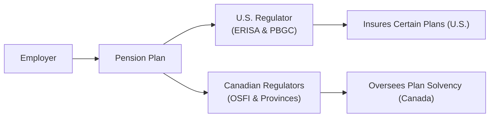
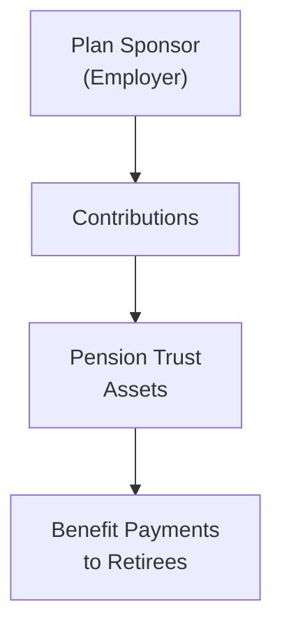

## 11.6 Pension Plans, Healthcare, and Other Long-Term Liabilities

Pension liabilities, post-retirement healthcare, and other long-term obligations can significantly shape a company’s financial profile, creditworthiness, and even investor perceptions of risk. Honestly, it sometimes feels surprising just how large these numbers can get—especially once you dive into the details of discount rates, benefit assumptions, or the difference between a plan’s “solvency” status versus its “going-concern” status. In this section, we’ll compare the U.S. and Canadian regulatory landscapes, explore how corporate and public pension plans are managed, discuss accounting treatments for retiree health benefits, and consider the broader valuation and capital structure implications. 

### Key Regulatory Frameworks in the U.S. and Canada

If you’ve ever seen an older manufacturing firm grappling with big pension shortfalls, you might recall hearing about the Employee Retirement Income Security Act (**ERISA**) in the U.S. or the Office of the Superintendent of Financial Institutions (**OSFI**) in Canada. Let’s break those down:

• In the United States, private-sector pension plans are primarily governed by **ERISA (Employee Retirement Income Security Act)**. ERISA sets minimum standards for plan participation, funding, vesting, and benefit accrual. There’s also the **Pension Benefit Guaranty Corporation (PBGC)**, a governmental agency that insures certain types of defined benefit plans. If the plan sponsor goes bankrupt, PBGC steps in (though participants might still end up with reduced benefits).  
• In Canada, pension regulation is more decentralized. Plans can be regulated federally (under OSFI) if they fall under federal jurisdiction—like banks and telecom companies—but most are overseen by provincial pension standards legislation. Provinces have their own pension acts, and each imposes solvency and other funding requirements. So, yeah, it’s a bit more fractured, but broadly, there are similarities in how minimum funding and benefit security are approached.

To illustrate how these frameworks interact in practice, check out the following Mermaid diagram that shows the regulatory interplay in both countries:

"Employer" establishes the pension plan. The plan in the U.S. is subject to ERISA and PBGC coverage. In Canada, the plan might be federally or provincially regulated, but the general goal—ensuring participants receive their benefits—remains the same.

### Corporate and Public Pension Plans

It might sound obvious, but not all pensions are the same. Corporate plans in both the U.S. and Canada typically must follow funding rules to ensure their plans don’t fall dangerously behind in terms of obligations. Public pension plans, however, may have different rules, discount rates, and governance structures—often set by legislative bodies rather than standard regulators.

• Corporate pension plans have sponsor-driven investment policies, sometimes leaning toward fixed-income or liability-driven investment strategies to hedge interest-rate risk. In Canada, there is a strong emphasis on meeting both a “going-concern” valuation (assuming the plan goes on forever) and a “solvency” valuation (assuming the plan must be wound up immediately). If you’ve ever looked at an annual report from a company with a defined benefit plan, you’ve probably seen references to both.  
• Public pension plans, especially in the U.S., often use their own set of assumptions. Sometimes, that means discount rates referencing expected returns on plan assets (which can be relatively high). This can understate the present value of future obligations. From a municipal bond investor’s perspective, a plan that uses an optimistic discount rate could be underfunded if you measure it under a more conservative rate—creating potential credit risk for taxpayers.

### Discount Rates, Funding Requirements, and the Corridor Concept 

In the U.S., discount rates for corporate plans typically reflect market yields on high-quality corporate bonds, with certain corridors or boundaries (often set by legislation like the Pension Protection Act) restricting how low or high the discount rate can drift. For example, if market rates drop too much, the corridor can keep funding requirements from skyrocketing too quickly (though eventually, sponsors must make up the difference).

Canada’s differential approach:
• **Solvency Valuation**: This is the hypothetical scenario of shutting down the plan immediately. The discount rate here tends to be more conservative, frequently referencing long-term government bonds.  
• **Going-Concern Valuation**: Assumes the plan will continue indefinitely. Sponsors often use a slightly higher, more “realistic” rate of return assumption reflecting a balanced portfolio of equities, bonds, and other assets.

The tension between solvency and going-concern is that a plan might appear well-funded under going-concern assumptions but severely underfunded on a solvency basis—particularly if the plan invests in equities or alternative assets that can be volatile in the short term.

### Post-Retirement Healthcare Obligations

Healthcare costs for retirees can be an even trickier obligation than pensions. We see two broad categories:

• **Employer-Sponsored Retiree Health Plans (U.S.)**: Many American firms promise some level of healthcare coverage to retirees. These plans are often unfunded or only partially funded, creating a large “Other Post-Employment Benefits” (OPEB) liability. Under **U.S. GAAP**, the accrued liability is recognized on the balance sheet, with the periodic changes—interest cost, service cost, and remeasurements—flowing through the income statement and other comprehensive income.  
• **Canada’s Provincial Healthcare**: Because provincial healthcare systems in Canada cover a significant portion of medical costs, many Canadian employers don’t provide quite as extensive retiree health benefits. Consequently, from a financial reporting perspective, these obligations can be smaller. That said, many large organizations still offer private coverage to complement the provincial system, so liabilities do exist (just often on a smaller scale compared to U.S. peers).

#### IFRS vs. U.S. GAAP for Retiree Health Benefits

Under **IFRS**, post-retirement healthcare commitments are accounted for similarly to pensions, where an entity must measure the present value of the defined-benefit obligation and recognize net interest on the net defined-benefit liability (or asset) in the income statement. Any remeasurements go through other comprehensive income. Meanwhile, **U.S. GAAP** lumps this in with OPEB liabilities, using a similar measurement approach but often with different assumptions around discount rates, medical cost trends, and corridor approaches.

### Impact on Capital Structure, Creditworthiness, and Equity Valuations

Wow, so you might be asking: “Why should I, as an equity analyst, sweat all these details?” Pension and healthcare liabilities can be gigantic. They can reduce the amount of cash available for growth or shareholder distributions, and they might cause significant volatility in reported earnings through remeasurement gains or losses. Many analysts treat an underfunded pension liability just like debt when calculating key ratios such as enterprise value or net debt-to-EBITDA.

• **Adjusting Enterprise Value**: If a company has a $1 billion underfunded pension, you might treat it as an additional $1 billion in financial liabilities. This can reduce certain coverage ratios and hamper the ability to raise new capital at favorable terms.  
• **Free Cash Flow Impact**: Higher pension or retiree healthcare contributions can siphon off capital that would otherwise be reinvested in growth or returned to shareholders through dividends or buybacks.  
• **Credit Risk**: If a municipality or public entity has significant unfunded pension or retiree healthcare obligations, lenders may demand higher yields, effectively raising the cost of capital. This is part of the reason pension shortfalls sometimes become big headlines in municipal bond markets.

### Practical Examples and Industry Insights

Imagine you’re analyzing an automotive giant—let’s call it “Auto Nova.” Perhaps they negotiated generous retiree healthcare benefits decades ago when times were good. Fast-forward to today: They now face soaring healthcare costs, a shift toward electric vehicles, and the urgent need to invest in new production lines. That retiree healthcare obligation could be huge, meaning less free cash flow to fund R&D, marketing, or share buybacks. Over time, that can absolutely hammer the company’s valuation.

Or consider a U.S. municipality that set an 8% discount rate for its public pension’s expected returns. Shortfalls might arise if the actual return over the long run is closer to 5%. Taxpayers, obviously, end up on the hook, raising political and credit-rating concerns. Meanwhile, in Canada, a large province might be required to conduct both going-concern and solvency valuations of its employees’ pension plan. The solvency shortfall (if any) might require additional contributions from current budgets, crowding out other public spending priorities. 

### A Quick Mermaid Visualization: Pension Cash Flows

Here’s a simple flowchart of how pension payments typically flow. Think of it as a high-level snapshot:

The employer contributes cash (sometimes mandated by regulation) into the pension trust. The trust invests the assets according to a certain strategy (equities, fixed income, alternatives). Over retirees’ lifetime, the trust uses these assets to pay pensions. Underfunding arises if the trust’s assets are insufficient to meet obligations.

### Best Practices and Considerations

• **Regular Monitoring**: Both in the U.S. and Canada, plan sponsors need to regularly measure the plan’s funded status and adjust contributions as needed. Analysts should watch these plan metrics closely when evaluating a firm.  
• **Scenario Testing**: Small changes in the discount rate or mortality assumptions can materially alter reported liabilities. Running “what-if” scenarios is a crucial part of any investment analysis—particularly when rates are volatile.  
• **Transparent Communications**: Investors (and employees!) want to understand how big these liabilities might become. Companies that present clear disclosures, including scenario tests and methodology, often enjoy better investor confidence.  
• **Professional Judgement**: Some CFOs might prefer conservative assumptions to avoid future surprises, while others might choose more aggressive assumptions to enhance the near-term financial picture. It’s always wise to read the footnotes in annual reports or MEMOs to see how these assumptions stack up against industry norms.

### Additional References

For more in-depth reading:  
• **PBGC official website** (<https://www.pbgc.gov>)—helpful if you want to see how pension insurance works in the U.S.  
• **OSFI** (<https://www.osfi-bsif.gc.ca>)—the federal regulator for Canadian pensions, with guidance notes on funding, solvency, and more.  
• **CFA Program Curriculum: Pension and Post-Employment Benefits**—standard curriculum topics.  
• **Canadian Pension Law** by Ari Kaplan—great for diving deeper into how different provinces approach pension regulation.

### Exam Tips 

• Understand the difference between solvency valuation and going-concern valuation; it’s a common exam question to test how you’d measure a plan’s funding status in different scenarios.  
• Don’t forget to treat underfunded pension liabilities akin to debt when you do capital structure or DCF analysis, especially if the exam vignette hints at a major shortfall.  
• Know your IFRS vs. U.S. GAAP differences for pension and OPEB accounting. This detail can be tested at Level II in vignette format, with multiple calculations of periodic pension cost.  
• Don’t be thrown off by changes in discount rates or corridor methods under different regulations—practice applying them to ensure you’re not caught unaware.  
• Keep an eye out for retiree healthcare obligations. Even if they don’t get as many headlines as pensions, they can be a similarly large burden with unique accounting quirks.  

Now that we’ve unpacked these nuances, you’ve got a solid grounding in how pensions, post-retirement healthcare, and other long-term liabilities can shape a firm’s financial health—both in the U.S. and Canada. 

---

## Mastering Pension Plans, Healthcare, and Other Long-Term Liabilities: A 10-Question Quiz



### Which agency insures certain private-sector defined benefit pension plans in the U.S.?

- [x] The Pension Benefit Guaranty Corporation (PBGC)
- [ ] The Office of the Superintendent of Financial Institutions (OSFI)
- [ ] The Financial Stability Oversight Council
- [ ] The Federal Deposit Insurance Corporation

> **Explanation:** The PBGC, established under ERISA, insures private-sector defined benefit pension plans in the United States. OSFI is a Canadian regulator.

### Which valuation method assumes a pension plan is continuing indefinitely?

- [ ] Solvency valuation
- [x] Going-concern valuation
- [ ] Terminal value approach
- [ ] Contribution-based valuation

> **Explanation:** Going-concern valuation estimates obligations under the assumption that the plan will operate continuously over the long term. Solvency valuation assumes an immediate wind-up.

### In Canada, pension regulation is typically handled by:

- [ ] Only federal authorities under the Canada Pension Act
- [x] A combination of federal (OSFI) and provincial bodies
- [ ] Exclusive oversight by municipal governments
- [ ] None of the above

> **Explanation:** Canada uses both federal and provincial regulation for pension oversight depending on the industry and jurisdiction of the plan sponsor.

### Under IFRS, post-retirement healthcare benefits are accounted for:

- [x] Similarly to defined benefit pension plans, with periodic remeasurements in OCI
- [ ] As defined contribution plans
- [ ] Off-balance sheet until they vest
- [ ] Solely through the income statement

> **Explanation:** IFRS treats defined benefit retiree healthcare obligations similarly to pensions, showing net interest and service cost in the income statement while actuarial gains/losses affect other comprehensive income.

### What is one common effect of underfunded pension liabilities on corporate valuations?

- [x] They are often treated as debt-like obligations
- [ ] They increase net income by reducing tax expense
- [x] They have no impact on free cash flow assumptions
- [ ] They require no disclosure in financial statements

> **Explanation:** Analysts frequently capitalize the underfunded portion of a pension plan as if it were debt. This can reduce the company’s valuation multiples and increase its perceived financial leverage.

### In the U.S., what does ERISA primarily govern?

- [x] Standards for private pension plan funding, participation, and vesting
- [ ] Social Security benefits for retirees
- [ ] Insurance requirements for post-retirement health plans
- [ ] Municipal bond issuance procedures

> **Explanation:** ERISA sets federal standards for private industry pension plans in the U.S., such as participation requirements, vesting schedules, and minimum funding rules.

### A public pension plan that uses an aggressively high discount rate might:

- [x] Appear more funded than it truly is
- [ ] Appear less funded than it truly is
- [x] Immediately require higher employer contributions
- [ ] Trigger lower PBGC premiums

> **Explanation:** An aggressively high discount rate lowers the present value of future liabilities, making the plan look more funded, but it can create future shortfalls if actual returns fall short.

### In a solvency valuation, pension liabilities are typically discounted at:

- [x] A rate based on long-term government bond yields
- [ ] The company’s weighted average cost of capital (WACC)
- [ ] The plan’s expected return on assets
- [ ] The PBGC’s flat rate

> **Explanation:** Solvency valuations assume immediate plan wind-up, often using more conservative government bond yields, reflecting lower-risk discount rates than going-concern valuations.

### Which of these is a potential impact of large retiree healthcare obligations?

- [x] Reduced free cash flow due to required contributions or benefit payments
- [ ] Immediate increase in the plan sponsor’s capital expenditures
- [ ] Complete outsourcing of risk to the PBGC
- [ ] Exemption from all U.S. GAAP requirements

> **Explanation:** Having large healthcare obligations can divert company funds and reduce free cash flows that might otherwise be used for investments or distributions to shareholders.

### Is it appropriate for analysts to treat long-term pension liabilities like a form of debt?

- [x] True
- [ ] False

> **Explanation:** Although pension liabilities are not identical to traditional debt, many analysts add underfunded amounts to total debt when evaluating leverage and valuation multiples.


