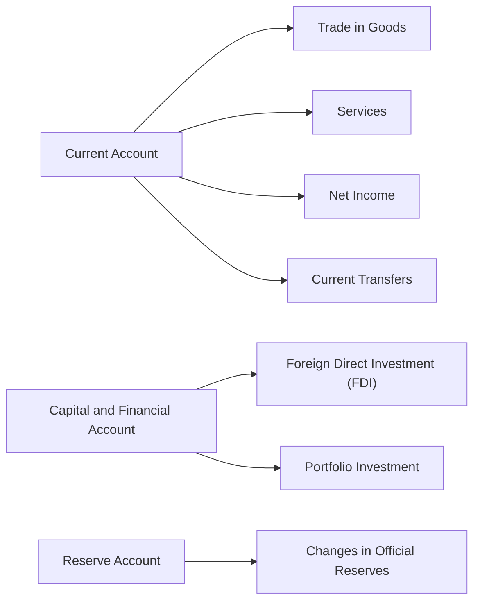
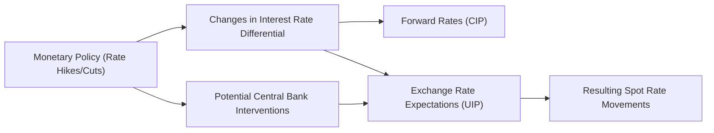

## 2.3 International Parity Conditions and Economic Balances

Welcome to this exploration of international parity conditions, a fundamental set of tools that help us understand exchange rates, interest rate differentials, price levels, and the broader patterns of global capital flows. If you’ve ever scratched your head about why exchange rates move or how interest rates in one country drive capital into another, trust me, I’ve been there too. It can feel daunting at first, but let’s walk through each concept carefully. By the end of this section, you should have a crystal-clear grasp of how parity conditions apply to real-world scenarios (like the U.S. vs. Canada example we’ll discuss) and be ready to incorporate them into your macroeconomic analysis toolkit.

### Foundations of International Parity Conditions

International parity conditions are theoretical relationships that connect exchange rates, inflation, and interest rates in different countries. If they held perfectly at all times, well, there’d be no arbitrage in the foreign exchange (FX) market (meaning no free lunches!). Of course, real-world frictions—like transaction costs, capital controls, taxes, or investor psychology—often cause deviations. But these parity conditions remain crucial for guiding our thinking about exchange rates and global capital flows.

Below, we’ll break down three major parity conditions:

- Covered Interest Rate Parity (CIP)  
- Uncovered Interest Rate Parity (UIP)  
- Purchasing Power Parity (PPP)

Afterward, we’ll relate them to economic balances, namely the Balance of Payments (BoP), and discuss the policy implications.

### Covered Interest Rate Parity (CIP)

Covered Interest Rate Parity says that any difference in nominal interest rates between two countries should be offset by forward exchange rates, eliminating the possibility of a riskless profit from cross-border investments. The term “covered” implies the use of a forward contract (or similar instrument) to hedge currency risk.

I remember my first time reading about CIP. I found the simplest interpretation to be: if you borrow in a low-interest-rate currency, convert it to a higher-interest-rate currency, invest, and then convert back using a forward contract, theoretically, you shouldn’t earn more than simply investing at home—at least not once you lock in the forward rate. Otherwise, folks would exploit that deal, leading to arbitrage-free pricing in currency forwards.

Mathematically, CIP can be expressed as:


F_{d/f}(t) = S_{d/f}(0) \times \frac{1 + i_d}{1 + i_f},


Where:  
• \\(F_{d/f}(t)\\) = Forward exchange rate (domestic per foreign) at time \\(t\\).  
• \\(S_{d/f}(0)\\) = Spot exchange rate (domestic per foreign) at time 0.  
• \\(i_d\\) = Domestic nominal interest rate.  
• \\(i_f\\) = Foreign nominal interest rate.  

If this holds, no arbitrage is possible through covered interest transactions.

#### CIP Example

Suppose you see a spot rate of 1.25 CAD/USD. Over a one-year horizon, Canadian interest rates are 2%, while U.S. interest rates are 3%. Under covered interest rate parity, the forward CAD/USD rate for one year would be:


1.25 \times \frac{1 + 0.02}{1 + 0.03} = 1.25 \times \frac{1.02}{1.03} \approx 1.24.


That forward rate ensures that investing in Canadian dollars versus investing in U.S. dollars yields the same result once you account for the forward hedge. If the forward rate deviates enough from 1.24, arbitrageurs should pounce, moving it back toward equilibrium.

### Uncovered Interest Rate Parity (UIP)

Uncovered Interest Rate Parity is similar to CIP but without using a forward contract to lock in the exchange rate. Instead, it assumes market participants decide—well, they kind of speculate—on where the exchange rate will move. According to UIP, the expected change in the exchange rate is proportional to the interest rate differential between two countries.

In more direct terms: if a country has a higher nominal interest rate, its currency is expected to depreciate so that investors don’t earn an excessive return just by placing their money in that country. However, this relationship can break down in the short run as sentiment, capital controls, risk aversion, or just plain old speculation can cause big swings.

A simplified expression of UIP:


\frac{E[S_{d/f}(t)] - S_{d/f}(0)}{S_{d/f}(0)} \approx i_d - i_f,


Where \\(E[S_{d/f}(t)]\\) is the expected future spot exchange rate. Unlike CIP, here you do not cover your FX risk with a forward; you’re “uncovered,” potentially facing gains or losses based on actual exchange rate movements.

### Purchasing Power Parity (PPP)

Purchasing Power Parity in its absolute form says that a basket of goods should cost the same across different countries once we account for exchange rates. In practical terms, this rarely holds precisely—for instance, a Big Mac in Switzerland always seems more expensive than in the U.S., at least in my experience. But PPP remains a vital benchmark for long-term exchange rate analysis.

#### Absolute PPP

Absolute PPP suggests:


S_{d/f} = \frac{P_d}{P_f},


Where \\(P_d\\) is the domestic price level for a standardized basket of goods and \\(P_f\\) is the foreign price level (in local currency). Translating \\(P_f\\) into domestic currency using the exchange rate \\(S_{d/f}\\) should yield a one-for-one equivalence if the law of one price held perfectly.

#### Relative PPP

Relative PPP focuses on inflation differentials instead. If one country’s inflation is, say, consistently higher than another’s, its currency tends to depreciate over time to maintain parity in purchasing power. The key formula:


\frac{E[S_{d/f}(t)] - S_{d/f}(0)}{S_{d/f}(0)} \approx \pi_d - \pi_f,


Where \\(\pi_d\\) and \\(\pi_f\\) are domestic and foreign inflation rates, respectively. This underscores that currencies under higher inflationary pressures tend to see a declining purchasing power over time, often (eventually) reflected in the nominal exchange rate.

### Balance of Payments and Economic Accounts

Beyond parity conditions, the Balance of Payments (BoP) is a major macroeconomic statement tracking all transactions between residents of one country and the rest of the world. The BoP is split into several components:

• Current Account  
• Capital and Financial Account  
• Reserve Account  

In the short run, capital flows—documented in the capital and financial account—often dominate exchange rate dynamics. Over the long run, current account imbalances (exports minus imports plus net income flows) can exert a powerful force on currency valuation.

Below is a simple flowchart illustrating how these accounts fit together:

#### Current Account Balance

The current account measures net exports (exports minus imports) plus any net income from abroad and current transfers. A surplus generally indicates that a country exports more than it imports (like some resource-heavy economies do), which can place upward pressure on its currency over time. But short-term movements aren’t guaranteed. For instance, foreign investors might be chasing yields elsewhere, which complicates things.

#### Capital and Financial Account

This includes foreign direct investment (FDI), portfolio investment (e.g., purchases of stocks, bonds), and other forms of cross-border capital transfers. A large influx of foreign capital can drive a currency up, fast. Conversely, massive capital outflows can weaken the currency.

#### Reserve Account

Central banks hold foreign exchange reserves (e.g., USD, EUR) to help stabilize their currency or finance short-term deficits. Rapid changes in reserve balances can indicate central bank interventions. If the Bank of Canada, for example, decides to accumulate more U.S. dollars in response to global volatility, that can affect CAD/USD exchange rates.

### Relations Among Parity Conditions and Economic Accounts

So, how do these parity conditions link to BoP and overall currency dynamics? Think of it this way:

• If a country’s inflation is higher (relative PPP says you might expect depreciation over time), but at the same time, global investors find that country’s real interest rates attractive, capital inflows could actually strengthen the currency in the short run. This tension often shows up as CIP or UIP deviations when market participants suspect the environment is riskier or the central bank isn’t fully credible.  
• Over the long term, though, large and persistent current account surpluses can lead to currency appreciation, consistent with some forms of PPP. But “long term” can be truly long, and in the meantime, capital account flows can push the currency in all sorts of directions.  
• Fiscal deficits—remember, this is when a government regularly spends more than it collects in taxes—can lead to rising interest rates (if financed through bond issuance) and, in turn, can influence exchange rates. If higher interest rates attract foreign capital, the domestic currency might appreciate in the short run, possibly conflicting with the notion that large deficits eventually degrade a currency’s credibility.

It’s all connected. One of the biggest challenges for macro analysts—myself included—is to juggle these competing forces without losing sight of the fundamentals.

### Evaluating Policy Interventions

Central banks and governments can and do influence these relationships:

• Monetary Policy. Central banks can hike or cut rates, buy or sell securities, or even directly intervene in the currency market. Rate changes feed into covered and uncovered interest parity. If the Bank of Canada raises interest rates, CIP implies the forward CAD value should adjust—unless market sentiment leads to a bigger or smaller actual shift.  
• Fiscal Policy. Governments can increase spending, reduce taxes, or both; such fiscal expansions might raise interest rates over time if they stoke inflation or crowd out private investment, which can impact exchange rates. On the other hand, if fiscal tightening reduces growth prospects, foreign investors might reduce exposure to that market.

### Example: U.S. vs. Canada

Consider the situation where Canada’s current account has been consistently in surplus. Let’s assume these surpluses stem from strong exports of natural resources (oil, minerals, and so on). Over time, you might reason the Canadian dollar (CAD) should appreciate. Now, if at the same time, the U.S. offers a higher interest rate and is considered a safe haven during financial stress, capital flows could favor U.S. assets, pushing the USD up in the short term. You get a tug-of-war between the long-term fundamentals of Canada’s current account surplus and the short-term appeal of U.S. interest rates and liquidity. 

In practice, these forces feed into CIP—where forward rates are determined by interest rate differentials—and UIP—where the spot rate is influenced by expectations of future fundamentals. A big part of a macro-oriented analyst’s job is weighing these “push” and “pull” factors to figure out which effect might dominate over one’s investment horizon.

### Best Practices and Pitfalls

• Always check for real-world frictions. Parity conditions rarely hold exactly, especially in the short term.  
• Use multiple data sources—like inflation reports, interest rate announcements, real market quotes for forward exchange rates, and the official BoP stats from central banks.  
• Avoid blindly applying CIP or UIP without considering political risks, default risks, or capital controls, as these can break the theoretical relationships.  
• Keep in mind that PPP is typically more valid in the long term. It’s not a great day-trading tool, to be honest.

### Strategies to Overcome Common Issues

• Combine short-term interest rate and forward data with longer-term fundamentals (like trade balances) for a balanced view.  
• Track daily or monthly changes in the reserve account to see if there is direct intervention.  
• Correlate major changes in the capital and financial account with movements in policy signals.  
• Hedge currency risk when uncertain about short-term volatility (though that might alter your CIP or UIP calculations).

### Diagram: Linking Parity Conditions with Policy

Below is a simplified diagram illustrating how policy decisions can indirectly influence parity conditions:

### Glossary

Covered Interest Rate Parity (CIP): A condition stating that forward exchange rates should offset interest rate differentials between two currencies, leaving no arbitrage profit when you hedge via a forward.  
Uncovered Interest Rate Parity (UIP): Argues that the expected change in the spot exchange rate is driven by the interest rate differential between two countries. No forward hedge here, so you’re “uncovered.”  
Purchasing Power Parity (PPP): Suggests that exchange rates adjust over the long term to reflect differences in price levels and inflation between countries.  
Balance of Payments (BoP): The record of all economic transactions between residents of one country and the rest of the world. It includes the current account, capital and financial account, and the reserve account.  
Current Account: Portion of the BoP that tracks trade in goods and services, net income (e.g., dividends, interest), and current transfers.  
Capital and Financial Account: Part of the BoP capturing cross-border investments, like FDI and portfolio flows.  
Reserve Account: Central bank holdings of foreign currencies or other sovereign currencies.  
Currency Appreciation: When one currency gains value relative to another, meaning you can buy more of the other currency with the same amount.  

### References and Further Reading

• IMF Balance of Payments Manual:  
  https://www.imf.org/external/data.htm  

• Krugman, P.R., Obstfeld, M., & Melitz, M. (2017). “International Economics: Theory & Policy.” Pearson.  

• OECD Economic Outlook:  
  https://www.oecd.org/economic-outlook/  

### Final Exam Tips

• Familiarize yourself with the key parity formulas—these often pop up in CFA vignette calculations.  
• For CIP-based questions, keep track of forward premium or discount relative to spot. Show each step.  
• When a question mentions “expected changes in spot rates,” it’s likely referencing UIP or PPP.  
• Pay attention to capital flows—big shifts in global risk appetite can override short-term interest differentials.  
• Practice linking real data (interest rates, inflation, import/export patterns) to see which parity condition might be relevant.  
• In multi-step calculations, watch out for compounding periods and currency quotes (direct vs. indirect).  

---

## Test Your Knowledge: International Parity Conditions and Economic Balances



### A covered interest rate parity (CIP) question describes a scenario where the spot rate is 1.30 CAD/USD, the domestic interest rate in Canada is 2%, and the foreign interest rate in the U.S. is 4%. Which forward rate (CAD/USD) over one year should hold if CIP is true?

- [ ] 1.35  
- [x] 1.28  
- [ ] 1.26  
- [ ] 1.31  

> **Explanation:** Using CIP, F = 1.30 × (1.02 / 1.04) ≈ 1.28 CAD/USD.  

### An analyst suggests that if the U.S. has a higher nominal interest rate than Canada, then the USD is expected to depreciate against CAD to prevent arbitrage opportunities. Which parity condition is being referenced?

- [ ] Covered Interest Rate Parity  
- [ ] Absolute Purchasing Power Parity  
- [x] Uncovered Interest Rate Parity  
- [ ] None of the above  

> **Explanation:** UIP states the currency with the higher interest rate is expected to depreciate, compensating investors so they don’t earn excess returns.  

### Relative PPP implies that the expected rate of change in the exchange rate over time is primarily driven by:

- [x] The inflation differential between the two countries  
- [ ] Real GDP growth rates  
- [ ] Nominal interest rate differentials with no hedging  
- [ ] The forward premium or discount  

> **Explanation:** Relative PPP links the expected percentage change in the exchange rate to inflation rate differentials.  

### Which account in the Balance of Payments tracks exports, imports, and net income from abroad?

- [ ] Capital and Financial Account  
- [x] Current Account  
- [ ] Reserve Account  
- [ ] Monetary Policy Account  

> **Explanation:** The Current Account covers trade in goods, services, net income (like dividends), and current transfers.  

### If a country’s currency is steadily appreciating over a long period due to a persistent trade surplus, which concept best explains this trend from a fundamental perspective?

- [ ] Uncovered Interest Rate Parity  
- [x] Purchasing Power Parity (PPP)  
- [ ] Fiscal Policy Transmission  
- [ ] Monetary Policy Accommodation  

> **Explanation:** Over the long term, PPP suggests that strong export performance and higher demand for the domestic currency support currency appreciation.  

### In the context of UIP, “uncovered” means the investor has:

- [x] No forward contract or hedge in place  
- [ ] Fully hedged currency exposure  
- [ ] Only partial coverage via options  
- [ ] A futures contract protecting them from exchange rate fluctuations  

> **Explanation:** “Uncovered” refers to bearing foreign exchange risk, relying on expectations about future spot rates rather than a forward contract hedge.  

### A government announces a major fiscal expansion, raising questions about future inflation and possible central bank rate hikes. In the short run, which interplay of factors can complicate currency forecasting?

- [x] Higher inflation expectations vs. potential capital inflows  
- [ ] Short-term interest rates that remain stagnant  
- [x] Covered interest rate parity overshadowing the current account  
- [ ] Fixed nominal exchange rates  

> **Explanation:** Fiscal expansion can lead to expectations of inflation (which might usually signal depreciation) but may simultaneously boost interest rates, attracting foreign capital and causing appreciation.  

### Suppose the capital and financial account shows large inflows of portfolio investment but the current account runs a significant deficit. What short-term effect might we see on the currency?

- [x] Potential currency appreciation due to strong capital inflows  
- [ ] Guaranteed currency depreciation  
- [ ] No effect on the currency  
- [ ] A direct 1:1 offset in official reserves  

> **Explanation:** Even with a deficit in the current account, large capital inflows can bolster demand for the domestic currency, often leading to appreciation in the short term.  

### Which of the following best describes the role of official foreign currency reserves in the Reserve Account?

- [x] To stabilize the currency and manage short-term imbalances  
- [ ] To replace the capital and financial account for FDI  
- [ ] To systematically reduce current account deficits  
- [ ] To displace central bank actions in the bond market  

> **Explanation:** Reserve holdings allow central banks to manage or intervene in FX markets, buffering short-term imbalances and volatility.  

### True or False: Purchasing Power Parity (PPP) is typically a reliable short-term trading strategy.

- [ ] True  
- [x] False  

> **Explanation:** PPP is generally considered a long-term concept; short-term price and exchange rate movements frequently deviate from its predictions.  


