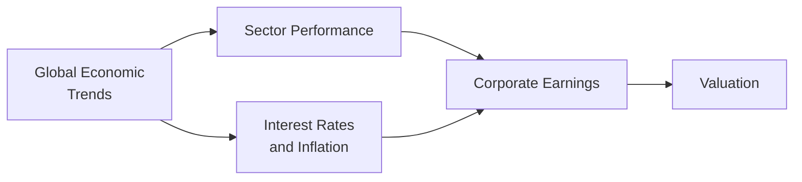
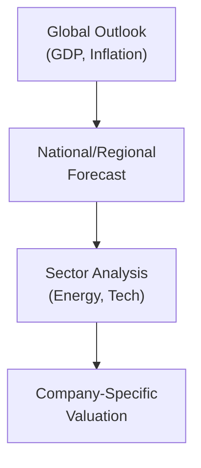

## 2.4 Macro Analysis in Sector and Corporate Valuation

Have you ever tried to figure out why some sectors boom while others fizzle under the same economic conditions? I remember when I first started looking at how GDP growth affected different industries—some soared like they were strapped to a rocket, while others seemed to slump on the sideline. It got me thinking: How on earth do these macro factors actually influence individual companies or entire industries? In this section, we’ll examine how macroeconomic variables—like interest rates, inflation, exchange rates, and global trade conditions—trickle down to industries and eventually affect the valuation of specific companies.

The broad goal is to figure out how the big-picture stuff (think central bank policies, commodity prices, consumer confidence) can shape sector performance, corporate earnings, and even cost of capital for companies around the world. As part of the CFA® Level II curriculum, it’s critical to grasp these interrelationships so that your forecasts and valuation models remain grounded in economic reality. Let’s dive in.

---

### Linking Macro Trends to Sector Performance

Sectors exhibit varying degrees of sensitivity to economic conditions. Some ride economic upswings like a surfer on a wave, while others hold steady through turbulence. Let’s break it down:

• Energy, Metals, and Other Commodity Sectors  
  Commodity-based sectors (like oil & gas in Western Canada or Texas) are influenced by global demand trends, foreign exchange rates, and geopolitical factors. When global growth accelerates, the demand for energy often rises, pushing up commodity prices and benefiting exploration & production companies. But if global growth stalls or if alternative energy adoption gains speed, oil-centric companies might face some headwinds.

• Consumer Cyclical or Discretionary  
  Discretionary spending (e.g., luxury goods, travel, dining out) tends to move alongside consumer confidence and disposable income. In stronger economies, consumers often open their wallets a bit more readily. But in downturns, these sectors can suffer as households tighten their belts.

• Financials  
  Banks, insurance companies, and asset managers depend heavily on interest rates, credit conditions, and overall economic activity. When the yield curve is steep, net interest margins may rise, benefiting banks. On the flip side, if consumer default rates climb in a recession, lenders could endure stress on portfolio quality.

• Defensive Sectors (e.g., Utilities, Consumer Staples)  
  Defensive sectors, such as utilities and consumer staples, are a bit like a warm blanket amid an economic storm. Generally, they maintain relatively stable earnings regardless of economic fluctuations. People still need electricity, water, and basic goods. These sectors often outperform when the economy slows.

Below is a simple diagram illustrating how macro factors influence sector performance:

---

### Impact on Corporate Earnings and Cost of Capital

Let’s talk about the bottom line. Economic conditions can shape corporate earnings and, crucially, the cost of capital. If you’ve ever sat in on a finance meeting when your CFO announces that borrowing rates just jumped by a couple of percentage points, you’ll know that hearts can start racing.

• Interest Rates  
  When central banks raise policy rates, market interest rates often follow. This can lead to higher coupon rates on newly issued bonds and higher rates on term loans. Companies with big debt loads have to roll over that debt at more expensive levels, increasing interest expense. Higher rates can also pressure valuations, as future cash flows are discounted at higher rates in models like DCF.

• Inflation  
  Inflation is a double-edged sword. For some companies (especially those with strong pricing power, like popular consumer brands or essential utilities), modest inflation can be passed on to customers, maintaining margin levels. Meanwhile, industries that lack pricing power may watch their margins worsen if input costs outpace their ability to raise selling prices.

• Currency Fluctuations  
  Exchange rates (see Section 2.2 on Exchange Rate Determination and Forecasting) can significantly affect multinational companies. If a firm relies on imported raw materials (paid in foreign currency), a domestic currency depreciation might spike the cost of goods sold. Conversely, for exporters, a weaker local currency can improve competitiveness abroad.  

• Macroeconomic Assumptions in Forecasts  
  Analysts commonly factor in GDP growth, inflation, and interest rate forecasts into their revenue projections. For example, if the market consensus is for 2% annual GDP growth, an automotive company’s sales forecast might be pegged to that rate (plus or minus a margin based on market share assumptions). So, your assumptions about inflation or currency rates can radically shift the final numbers.  

Given how integral these factors are, the cost of equity and cost of debt in the Weighted Average Cost of Capital (WACC) are strongly influenced by macro conditions. A simplified WACC formula is:


\text{WACC} = \left( \frac{E}{D+E} \right) k_e \;+\; \left( \frac{D}{D+E} \right) k_d (1 - t)


Where:
• \\( k_e \\) = cost of equity  
• \\( k_d \\) = cost of debt  
• \\( t \\) = marginal tax rate  
• \\( E \\) = market value of equity  
• \\( D \\) = market value of debt  

As interest rates rise, \\( k_d \\) tends to move upward. Also, if the economy is perceived riskier by investors (e.g., due to high inflation or other uncertainties), equity risk premiums might increase, pushing up \\( k_e \\). Both of these result in a higher cost of capital.

---

### Methods of Incorporating Macroeconomic Factors

So how do we actually do this in practice? Well, there are three main approaches:

• Top-Down Analysis  
  Start at the global or national level: Is the world economy expected to grow, stagnate, or shrink? Next, look at your region or sector. Are you analyzing pharmaceuticals, which might have steady demand, or cyclical consumer goods? Finally, zero in on the individual firm and its unique capabilities, cost structure, and competitive advantage.

Here’s a quick look at the top-down flow:

• Scenario Analysis  
  Scenario analysis involves modeling various states of the economy (e.g., best-case, base-case, worst-case) and seeing how those states trickle down to company revenues, costs, and financing. For instance, suppose you’re valuing a Canadian mining firm. You might consider a base-case scenario of stable commodity prices, a best-case scenario with surging global demand, and a worst-case scenario where currency risk or government policy changes hamper production.

  Good scenario analysis requires thorough research and an understanding of how different variables interact. If commodity prices tumble, do you expect a weaker Canadian dollar to partially offset that lower commodity price for your local producer? Or is your firm’s cost base denominated in a currency that might spike in a downturn?

• Sensitivity Analysis  
  Sensitivity analysis is like turning a dial on one variable at a time to see how the final valuation changes. If you want to be methodical, you can do a “data table” approach in a spreadsheet. For example, you might flex interest rates from 2% to 8% in increments of 1% to see how the value of your target changes. Then repeat for inflation, exchange rates, or GDP growth. This technique can quickly highlight which assumptions really drive value.

---

### Practical Case Example: Macro Effects on a Canadian Beverage Company

Let’s get concrete with a real-life(ish) example. Suppose you’re looking at a Canadian beverage company that imports significant raw materials—like fruit juice concentrates—from the U.S. If the Canadian dollar (CAD) weakens against the U.S. dollar (USD), raw material costs rise. Even a 10% shift in exchange rates could meaningfully spike cost of goods sold, possibly eroding profit margins.

What if interest rates in Canada rise? The firm might face a higher cost of debt when rolling over short-term loans. That could tighten free cash flow and limit the firm’s ability to invest in marketing or new product lines. You can see how “macro” developments—even those that feel intangible in day-to-day life—can dramatically alter a firm’s growth trajectory and valuation.

Consider layering a commodity price variable in there if the fruit concentrate is also subject to commodity-like fluctuations. Combine that with changes in interest rates, and you’re well into the realm of scenario planning. These are the real-life complexities that test your valuation models (and your patience).

---

### Best Practices, Pitfalls, and Strategies

1. Cross-Check Multiple Sources:  
   Don’t rely solely on one economic forecast or single data provider. Incorporate consensus forecasts, central bank announcements, and maybe a contrarian view or two.

2. Follow Monetary and Fiscal Policies Closely:  
   Watch for announcements from central banks (like the Bank of Canada or the Federal Reserve) and government fiscal policy changes. They can dramatically alter the outlook for interest rates, exchange rates, and overall economic growth.

3. Beware Linear Extrapolation:  
   Assuming a straight-line growth rate or inflation figure can lead you astray. Economic cycles are rarely smooth. Prepare for bumps and interplay among variables.

4. Dig Into Sector-Specific Nuances:  
   Understand the sector’s cost structure and competitive landscape. For instance, airlines are heavily exposed to fuel costs and consumer discretionary income. Tech companies may be more sensitive to capital spending cycles than raw commodity prices.

5. Keep An Eye on Demographics:  
   Changing demographics (like an aging population in developed markets) can have significant implications for healthcare, real estate, and consumer industries.

6. Revisit Assumptions Regularly:  
   The global economy is constantly shifting. Update your assumptions for major macro-changes—like a sudden spike in oil prices or a global trade war—rather than waiting for year-end reviews.

7. Evaluate Pricing Power:  
   If the firm can pass higher input costs to consumers without a big drop in demand, it may be more resilient in high-inflation environments. If not, watch out for margin compression.

---

### Glossary

• Top-Down Analysis:  
  A valuation approach that begins with macroeconomic factors like GDP, inflation, and interest rates; then zooms into sector conditions; and, finally, narrows to the individual company.

• Scenario Analysis:  
  Evaluation of multiple possible futures (best, base, worst) to see how each impacts firm earnings and valuation.

• Sensitivity Analysis:  
  A technique to isolate and vary one macro variable (e.g., exchange rate) to assess the resulting impact on valuations.

• Defensive Sector:  
  Industries (utilities, consumer staples, healthcare) that tend to have stable earnings regardless of economic expansions or contractions.

• Valuation Multiples:  
  Ratios (like P/E, EV/EBITDA) used to compare companies’ relative worth.

• Pricing Power:  
  A company’s ability to raise selling prices without losing significant market share or sales volume.

---

### Final Exam Tips

• Practice the Interplay of Variables:  
  In vignettes, you might be given macro data like rising interest rates, unexpected inflation spikes, or currency changes. Be prepared to link these to cost of capital and sector/firm revenues.  

• Focus on Materiality:  
  You won’t have the bandwidth to model every tiny factor under exam constraints. Concentrate on the most consequential variables for your given scenario.  

• Stay Calm with Scenario/Sensitivity Approaches:  
  If the exam question asks how a 2% increase in inflation might alter the firm’s cost structure, walk calmly through the logic rather than panicking. Show your step-by-step reasoning.  

• Know Your Sectors:  
  Recognize which sectors are cyclical vs. defensive, and how they might respond to business cycle changes.  

• Tie in Quantitative and Qualitative:  
  Blend your understanding of macro concepts (quantitative) with the company’s strategic position (qualitative). The exam might test both.  

• Time Management:  
  Keep an eye on the clock. If you’re running short on time, outline your approach in bullet points to ensure partial credit.  

---

### References

- Damodaran, A. (2012). Investment Valuation. Wiley.  
- S&P Dow Jones Indices on Sector Classification:  
  https://www.spglobal.com/spdji/  
- CFA Institute Publications on Equity Valuation and Industry Analysis  

For more on valuation techniques, see Chapter 5: Equity Valuation—Models, Applications, and Market Nuances, and for a deeper discussion on capital structure implications, see Chapter 4: Corporate Finance, Governance, and Valuation.

---

## Practice Questions on Macro Analysis in Sector and Corporate Valuation



### Which statement best describes the relationship between macro trends and sector performance?

- [ ] All sectors are equally sensitive to economic cycles.
- [x] Certain sectors exhibit higher sensitivity to macro trends based on their business cycle dependence.
- [ ] Macroeconomic factors don’t significantly affect sector performance.
- [ ] Macro trends are only relevant for defensive sectors.

> **Explanation:** Different sectors demonstrate varying degrees of sensitivity to macroeconomic outcomes. For instance, consumer discretionary often does well during expansions, while defensive sectors like utilities remain stable throughout cycles.

### Using a top-down valuation approach, what is the typical sequence of analysis?

- [ ] Company → Sector → Macro
- [ ] Sector → Company → Macro
- [x] Macro → Sector → Company
- [ ] Macro → Company → Sector

> **Explanation:** Top-down analysis commences with an assessment of broad macroeconomic conditions, narrows to sector-level insights, and ultimately focuses on specific companies.

### In an environment of rising interest rates, what might happen to a firm’s WACC?

- [x] WACC is likely to increase due to higher cost of debt and possibly higher equity risk premiums.
- [ ] WACC is likely to remain unchanged because it’s primarily driven by equity prices.
- [ ] WACC is likely to decrease as the economy is expected to slow.
- [ ] WACC is unaffected by interest rates.

> **Explanation:** As interest rates rise, the cost of debt (and often the cost of equity) will typically move upward, leading to a higher WACC.

### Which type of sector is generally considered “defensive” in macroeconomic downturns?

- [ ] Consumer discretionary
- [ ] Information Technology
- [x] Utilities
- [ ] Industrials

> **Explanation:** Utilities (and similar essential service providers) are considered defensive sectors because their demand is more stable across economic cycles.

### An analyst wants to determine how a 2% increase in inflation might affect a company’s net income. She decides to alter only the inflation assumption in her DCF model and observe the outcome on net income. This is an example of:

- [ ] Scenario analysis
- [x] Sensitivity analysis
- [ ] Regression analysis
- [ ] Top-down analysis

> **Explanation:** Sensitivity analysis involves isolating and adjusting a single variable (inflation in this case) to see how the results change.

### In scenario analysis, an analyst could develop a “worst-case” macro outlook. Which of the following is least likely to be part of a worst-case scenario?

- [x] A significant decrease in interest rates boosting borrowing
- [ ] A large drop in commodity prices for a resource-rich economy
- [ ] An unexpected spike in inflation
- [ ] A deep economic recession

> **Explanation:** A significant decrease in interest rates is typically not a worst-case scenario for many companies, as lower rates can reduce financing costs.

### If the Canadian dollar depreciates against the U.S. dollar, what could be a typical impact on a Canadian beverage company importing raw materials from the U.S.?

- [ ] Reduced cost of goods sold
- [x] Increased cost of goods sold
- [x] Potential decrease in profit margins
- [ ] None of the above

> **Explanation:** A weaker Canadian dollar makes U.S.-denominated inputs more expensive in CAD terms, typically worsening profit margins if costs can’t be passed on.

### Which of the following is a key pitfall when forecasting sector performance using macro data?

- [x] Assuming linear trends indefinitely without considering economic cycles
- [ ] Checking multiple economic research sources
- [ ] Considering updated central bank announcements
- [ ] Analyzing the demographic backdrop

> **Explanation:** Extrapolating linear trends indefinitely is a common pitfall because real economic conditions evolve and cycle, making straight-line forecasts risky.

### A top-down equity analyst observes a sharp cyclical downturn in global demand. Which sector is generally the safest bet for stable earnings growth?

- [x] Consumer staples
- [ ] Consumer discretionary
- [ ] Automobiles
- [ ] Hospitality

> **Explanation:** Consumer staples (like basic food products) remain in demand regardless of the economic climate, thus providing more stable earnings.

### In macroeconomic analysis, it is always important to examine both quantitative and qualitative factors. True or False?

- [x] True
- [ ] False

> **Explanation:** While quantitative factors such as GDP and interest rates are crucial, qualitative factors like regulatory changes, demographic shifts, and technological disruption also play a significant role in accurately forecasting corporate performance.


