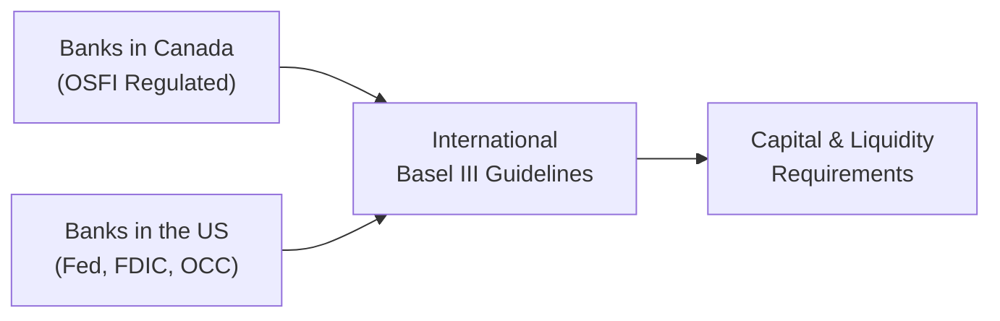

## 3.5 Analysis of Financial Institutions

Financial institutions—particularly banks and insurance companies—are fascinating entities, but, well, they can also be quite intimidating to analyze if you’re seeing them for the first time. I remember my early years trying to decipher bank financial statements—I was so used to conventional manufacturing firms that, as soon as I saw the massive amount of loans and complex capital requirements, my eyes glazed over. But don’t let the complexity scare you. You’ll find that with a few targeted frameworks, it all starts to fall into place.

Financial institutions have unique traits. They are highly regulated (and sometimes heavily scrutinized) in virtually all major economies. Their balance sheets are dominated by financial assets—oftentimes measured at fair value—and interest rate spreads fuel much of their profitability. In this section, we’ll dissect the anatomy of banks and insurers, discuss key regulatory frameworks like Basel III, and walk through the CAMELS approach. Plus, we’ll sprinkle in some personal anecdotes and stories to keep things less robotic and more friendly.

Before we dive in, let’s share a quick personal anecdote: I once visited a local community bank to figure out how they measured their loan portfolio quality. One of the senior managers told me, “Well, analyzing our bank is basically analyzing how often our borrowers pay us back on time.” That was so obvious it almost sounded silly, but it really pointed to the heart of a bank’s business model: managing credit risk and interest spreads. Okay, let’s jump in.

### Unique Features of Financial Institutions

Financial institutions such as banks and insurance companies serve as essential pillars of the economy. They have a few defining characteristics:

• Highly Regulated Environments: Banks are subject to capital adequacy standards under Basel Accords (Basel II, Basel III, etc.). In Canada, you’ll see the Office of the Superintendent of Financial Institutions (OSFI) overseeing compliance. In the US, the Federal Reserve, FDIC, and OCC enforce their own rules adapted from Basel guidelines. The main aim is to ensure these institutions remain solvent and stable, even under stress conditions.

• Fair Value Assets: Unlike a typical manufacturing company that invests in tangible assets like equipment or inventory, banks and insurers often hold significant portfolios of bonds, loans, and financial instruments. Many of these need to be marked to market (fair value). Changes in interest rates, credit spreads, or market conditions can have a direct impact on reported capital and net income.

• Net Interest Margin (NIM): Banks make money from the spread between the interest they pay on liabilities (like deposits) and the interest they earn on assets (like loans or bond investments). This net interest margin is central to their core profitability. Insurers, similarly, invest collected premiums into securities and other assets to generate investment income that helps offset underwriting costs and claims.

• Leverage Impact: Many banks operate with substantial leverage. Regulators require minimum capital buffers so that even a small change in asset values does not threaten their solvency.

Anyway, let’s keep those unique features front of mind. They’ll reappear often as we dig further.

### CAMELS Approach to Analyzing Banks

One widely used method regulators and analysts employ to evaluate a bank’s health is the CAMELS framework. That’s not just a funky acronym; each letter corresponds to a vital aspect of a bank’s operations. Let’s walk through these one by one.

#### C (Capital Adequacy)

Capital adequacy is all about whether a bank holds enough capital to absorb potential losses. For instance, Tier 1 Capital comprises core equity capital, which represents the strongest form of a bank’s capital. Basel III introduced concepts like the Common Equity Tier 1 ratio (CET1), Tier 1 ratio, and Total Capital ratio. Banks must hold specified minimum ratios:

• Common Equity Tier 1 ratio (CET1): core equity capital divided by risk-weighted assets.  
• Tier 1 ratio: includes CET1 and certain forms of additional Tier 1 capital (like preferred shares).  
• Total Capital ratio: includes Tier 1 and Tier 2 capital.  

These ratios measure how many losses a bank can handle before depositors or creditors are at risk. In Canada, OSFI sets specific minimum ratios that may exceed globally recommended minimums. The US regulators (Federal Reserve, FDIC) do much the same.

#### A (Asset Quality)

Asset quality is basically the quality of a bank’s loans and investments. If it extends loans to borrowers who can’t pay, or invests in highly volatile securities, trouble could be brewing. Common metrics:

• Non-Performing Loans (NPLs): The proportion of loans where the borrower is at least 90 days delinquent.  
• NPL Coverage Ratio: A ratio that measures the allowance for loan losses relative to NPLs.  
• Loan Loss Reserves: The portion of capital set aside to cover potential loan losses.  

You can think of this as the “health check” for a bank’s loan portfolio. A well-performing asset portfolio typically translates into steady income and fewer nasty surprises down the road.

#### M (Management)

Management is often a bit more subjective. We look at the bank’s governance structures, the experience of leadership, the board’s oversight, and risk controls. Regulators keep a close eye on how effectively management monitors risk because a single oversight can lead to massive write-downs. Sometimes, rating agencies or regulatory bodies will also look for whether the management fosters a culture of compliance and prudent risk-taking. 

#### E (Earnings)

Earnings, or profitability, is another critical factor. Key ratios include:

• Return on Assets (ROA): Net income divided by average total assets. This shows how effectively assets generate profits.  
• Efficiency Ratio (Cost-to-Income): Operating expenses divided by total revenue. A lower efficiency ratio suggests the bank is more efficient in generating revenue.  

Another ratio that might pop up is the net interest margin (NIM). If a bank’s NIM is compressing, that may hint at increased competition or higher funding costs.

#### L (Liquidity)

Liquidity risk is huge for banks because, well, if depositors want their money back and the bank can’t meet the demands, that’s a scenario for a bank run. Key ratios include:

• Loan-to-Deposit Ratio: If this is too high, it implies the bank might be pushing too many loans relative to deposit funding available.  
• Liquidity Coverage Ratio (LCR): Under Basel III, banks need to hold sufficient high-quality liquid assets to survive a 30-day stress scenario.  

Even a well-capitalized bank can fail if it can’t meet short-term liquidity needs.

#### S (Sensitivity)

Sensitivity focuses on how vulnerable the bank is to market risk, especially interest rate risk and foreign exchange risk. If interest rates rise and the bank hasn’t matched the duration of assets and liabilities, the net interest margin can shrink, or losses may accrue on securities held at fair value. The same logic applies to currency exposures if the bank does business in multiple countries.

Diagrammatically, you might think of CAMELS as a continuous cycle of evaluations:

Each component influences the others. For example, insufficient capital might prompt the bank to scale back risk-taking or hamper expansion plans, affecting earnings. Poor management can lead to an uncontrolled growth in risky loans, harming asset quality. It’s all interconnected.

### Analysis of Insurance Companies

Now let’s turn to insurance companies. They’re a different breed but share some regulatory complexities. When you think about insurance, you might visualize life insurance, property and casualty (P&C), or reinsurance. Each line has unique risk and accounting treatments.

• Life vs. Property & Casualty: Life insurance typically involves long-term contracts that might stretch over decades. Property & casualty insurance, on the other hand, often has shorter terms (e.g., annual property coverage) but can exhibit cyclical underwriting cycles.  

• Reserves for Policy Liabilities: Insurers must estimate future claims, which can be subject to considerable uncertainty. The difference between actual claims and the reserves can significantly impact earnings.  

• Underwriting Cycles: Insurers might have "soft market" periods with intense competition and lower premiums, followed by "hard market" periods with rising premiums.  

• Differences in US GAAP vs. IFRS: IFRS 17 (Insurance Contracts) introduced a more uniform way to measure insurance 계약 liabilities. US GAAP has a set of specialized industry-specific rules that differ in how they recognize revenue and expense deferrals. In life insurance, changes in actuarial assumptions might be smoothed or recognized differently, affecting income statements.  

Common Metrics and Ratios for Insurers include:

• Combined Ratio (Property & Casualty): (Claims Incurred + Expenses) / Net Premiums Earned. A ratio below 100% indicates underwriting profitability; above 100% indicates an underwriting loss (though investment income might still salvage overall profit).  
• Risk-Based Capital (RBC) Requirements (US): Insurers must hold a certain level of capital based on the risk of their operations.  
• Minimum Continuing Capital and Surplus Requirements (MCCSR) in Canada: A similar approach, ensuring insurers hold a buffer to protect policyholders.  

You might also hear about Solvency II in Europe or ICS (Insurance Capital Standard) efforts at the International Association of Insurance Supervisors. Regardless of the region, the theme is consistent: ensure the insurer is around to pay claims when they come due.

### Regulatory Considerations

Regulations play a pivotal role in shaping banks’ and insurers’ balance sheets. Having once worked on a small bank’s stress testing project, I can share that it was both terrifying and instructive to see how quickly a seemingly healthy bank could falter under severe market shocks (like interest rates spiking or real estate values falling).

#### Basel III

Basel III guidelines emerged post-Global Financial Crisis to strengthen bank capital. Requirements include higher CET1 ratios, stricter leverage ratios, and new liquidity standards like the LCR and Net Stable Funding Ratio (NSFR). In North America:

• The Federal Reserve in the US enforces Dodd-Frank stress tests and integrated Basel III reforms to ensure systemically important financial institutions (SIFIs) meet “too big to fail” standards.  
• OSFI in Canada places robust oversight on the largest banks, often referred to as the “Big Six.”  

#### Stress Testing

Stress tests have become standard. The Dodd-Frank Act Stress Tests (DFAST) and Comprehensive Capital Analysis and Review (CCAR) in the US require big banks to see if they can maintain adequate capital under severe economic scenarios. In Canada, OSFI expects banks to conduct regular enterprise-wide stress tests, ensuring risks are contained. These frameworks often incorporate multi-scenario macroeconomic assumptions—like a recession, a spike in unemployment, or a sudden real estate crash.

### Detailed Instructions for Candidates

• Use the CAMELS Framework: When analyzing a bank, systematically go through capital adequacy, asset quality, management quality, earnings stability, liquidity, and sensitivity to market risks. Keep an eye on how changes in macroeconomic conditions (like rising interest rates) might ripple through these categories.  

• Evaluate an Insurer’s Solvency: Understand how an insurer calculates its reserves (particularly life insurers) and how reinsurance can shift risk off the books (or bring it on, if the reinsurance agreement is poor). Scrutinize the differences in IFRS vs. US GAAP.  

• Understand Fair Value Changes: For banks especially, bond portfolios (held-for-trading or AFS/OCI under IFRS) can cause capital volatility. Under US GAAP, the classification (e.g., held-to-maturity, available-for-sale) likewise influences whether market fluctuations hit earnings or equity directly. If interest rates climb, the fair value of these bond investments might drop sharply, impacting capital buffers.  

In short, a big part of analyzing financial institutions is looking for the risk exposures that lurk within all the footnotes and disclosures.

### Practical Examples and Case Studies

• Let’s say Bank X in Canada has a 2.5% non-performing loan ratio, which is steadily rising, and an NPL coverage ratio close to 100%. That might be borderline concerning. You’d confirm whether the bank is continuing to build up its loan loss reserves or if it’s under-reserving.  

• Imagine an insurer that writes a lot of property & casualty coverage in an area prone to hurricanes. If they haven’t priced for that catastrophe risk properly, or if they rely heavily on reinsurance from an entity with weak credit, you’d question their solvency.  

• Another scenario: A small agricultural bank with strong capital ratios but extremely tight liquidity. If the local farming economy suffers and depositors pull funds, could the bank handle a big chunk of withdrawals? That’s L for Liquidity in action.

### Common Pitfalls

• Focusing Only on Net Income: A big net income figure might mask poor asset quality or overoptimistic provisioning.  

• Ignoring Off-Balance-Sheet Exposures: Many banks (and insurers) have contingent liabilities or derivatives that can suddenly require capital if conditions change.  

• Overlooking Regulatory Trends: A bank meeting capital requirements today might face new constraints or changes (e.g., new IFRS 9 standards or updated RBC formulas) that could alter their reported figures.  

### Best Practices

• Study the Footnotes: This is especially important for fair value accounting, derivatives, and reinsurance.  
• Monitor Trends Over Time: A single year’s ratio can be misleading. Look for multi-year patterns and cyclical influences.  
• Compare Peers: Peer benchmarking can reveal whether a bank’s NPL ratio is truly high or just average for the region or economic cycle.  
• Conduct Stress Scenarios: Even if a question doesn’t explicitly ask for it, consider how sensitive the institution is to major risk shocks (e.g., rising interest rates, declining real estate values). 

### Diagram: Regulatory Overview

Here’s a simplistic diagram illustrating how banks in North America might report to different regulatory bodies:

Everyone ultimately references global standards (Basel III), but the local regulators (OSFI in Canada, Fed/FDIC/OCC in the US) adapt them to national banking frameworks.

### Glossary

• Net Interest Margin (NIM): (Interest Income – Interest Expense) / Earning Assets  
• Non-Performing Loans (NPLs): Loans where borrowers are significantly behind on payments (commonly 90+ days overdue)  
• Tier 1 Capital: Core capital like common equity and disclosed reserves  
• Combined Ratio (Insurers): (Claims Incurred + Expenses) / Net Premiums Earned  
• Solvency Ratio: Measures available capital vs. required capital to meet obligations  
• Liquidity Coverage Ratio (LCR): High-quality liquid assets / projected net cash outflows over 30 days

### References & Further Reading

• Basel III documentation at the Bank for International Settlements:  
  https://www.bis.org/bcbs/basel3.htm  
• Office of the Superintendent of Financial Institutions (OSFI) guidelines:  
  https://www.osfi-bsif.gc.ca  
• “Bank Management & Financial Services” by Peter S. Rose and Sylvia C. Hudgins  

Feel free to explore each of these sources. They’re rich with examples and clarifications on regulatory metrics.

### Final Exam Tips

• Go step-by-step: If you’re faced with a long bank or insurance vignette, start by identifying the key signals: what’s the capital ratio? Are there red flags in asset quality?  
• Cross-check: Compare the bank’s current ratio to prior periods or industry peers. If the question offers multiple years’ data, see if the direction is improving or deteriorating.  
• Keep the big picture: The exam may throw in short statements about interest rates or economic conditions—use these clues to predict how net interest margin or underwriting performance might shift.  
• Don’t ignore IFRS vs. US GAAP differences: They can show up in questions about how changes in the fair value of securities or insurance liabilities are accounted for.  
• Time management: It’s easy to get bogged down in details. Remain calm and target what the question is really asking.

Good luck in your studies, and remember that once you understand a financial institution’s core business, you’ll see that the big story is all about risk management, capital, and liquidity. You’ve got this.

---

## Test Your Knowledge on Financial Institutions and CAMELS



### Which ratio directly measures a bank’s profit from its interest-bearing assets?

- [ ] Loan-to-deposit ratio
- [x] Net interest margin
- [ ] Tier 1 capital ratio
- [ ] Combined ratio

> **Explanation:** The net interest margin (NIM) is specifically the difference between interest income and interest expense, expressed as a percentage of earning assets.

### When analyzing asset quality in banks, which measure reflects the proportion of bad or questionable loans?

- [x] Non-performing loans (NPLs)
- [ ] Liquidity coverage ratio (LCR)
- [ ] Combined ratio
- [ ] Return on assets (ROA)

> **Explanation:** NPLs represent loans that are significantly overdue, often 90+ days, thus indicating a potential deterioration of asset quality.

### Under the CAMELS framework, which element examines a bank’s exposure to interest rate and currency risks?

- [ ] Capital adequacy
- [ ] Liquidity
- [ ] Management
- [x] Sensitivity

> **Explanation:** “S” for Sensitivity assesses how vulnerable the bank is to market shifts, especially interest rate changes and foreign exchange fluctuations.

### If an insurer’s combined ratio consistently exceeds 100%, what does that imply about its underwriting performance?

- [ ] Profitability is stable through investment returns.
- [x] Underwriting is generating losses (excluding investment income).
- [ ] Claims are always fully covered.
- [ ] The insurer is overcapitalized.

> **Explanation:** A combined ratio above 100% means the insurer is, on an underwriting basis alone, paying more in claims and expenses than it earns in premiums.

### Which concept within Basel III ensures that banks hold a sufficient cushion of top-quality capital relative to their risk-weighted assets?

- [x] Common Equity Tier 1 (CET1) ratio
- [ ] Liquidity coverage ratio (LCR)
- [ ] Net interest margin
- [ ] Combined ratio

> **Explanation:** The CET1 ratio specifies the proportion of a bank’s risk-weighted assets that must be backed by the highest quality (core) capital components.

### Which of the following best describes stress testing for banks?

- [x] Hypothetical scenario analysis to assess capital resilience
- [ ] Daily check on net interest margins
- [ ] Auditing all the bank’s internal controls
- [ ] Calculating real GDP growth forecasts

> **Explanation:** Stress tests project how a bank’s capital would hold up under extreme but plausible scenarios, such as severe recessions or sudden market shocks.

### In insurance analysis, which metric measures an insurer’s buffer to absorb unexpected losses, considering the nature of underwritten policies?

- [ ] Net interest margin
- [x] Risk-based capital (RBC) requirement
- [ ] Tier 1 capital ratio
- [ ] Loan-to-deposit ratio

> **Explanation:** RBC requirements set minimum capital thresholds based on the insurer’s specific risk exposures (underwriting, credit, market, etc.).

### A low loan-to-deposit ratio typically indicates:

- [x] The bank might not be fully utilizing its deposit base for lending.
- [ ] The bank is overexposed to poor quality loans.
- [ ] The bank has excessive capital.
- [ ] A regulatory violation is in progress.

> **Explanation:** A lower ratio means a larger portion of deposits remains unused or invested in lower-yielding assets, thereby possibly reducing profitability but improving liquidity.

### Which aspect of the CAMELS framework involves assessing how effectively an institution’s leadership team and internal controls function?

- [ ] Earnings
- [ ] Asset Quality
- [x] Management
- [ ] Sensitivity

> **Explanation:** “M” for Management focuses on governance, internal risk controls, and the quality and oversight provided by executive leadership and the board.

### If an insurance company’s property & casualty business faces suddenly high catastrophic events, which key ratio is most likely to worsen rapidly?

- [x] Combined ratio
- [ ] Net interest margin
- [ ] Tier 1 capital ratio
- [ ] Liquidity coverage ratio (LCR)

> **Explanation:** Because catastrophic events trigger high claims, the insurer’s claims incurred would spike, sharply raising the combined ratio (claims + expenses / premiums).


