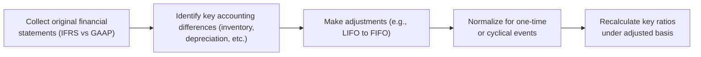
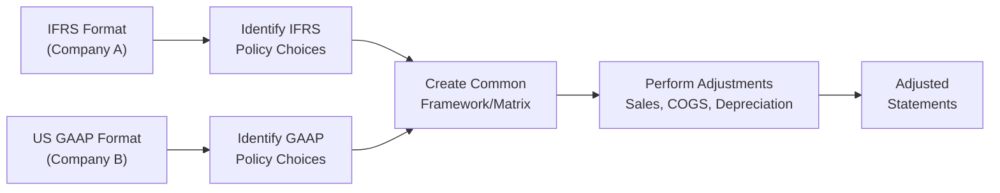
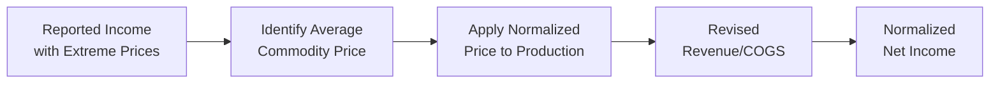

## 3.6 Comprehensive Integration of Financial Statement Techniques

Integrating all the tools and tricks we’ve developed throughout this chapter sometimes feels a bit overwhelming—especially when you’re knee-deep in reconciling a U.S. company using LIFO with a Canadian firm adhering strictly to IFRS. But take it from someone who once spent a whole weekend wrestling with segment disclosures (and yes, fueling up on too many cups of coffee): if you follow a structured process, you’ll (eventually) see how these puzzle pieces fit together. In this section, we’ll dive into the practical side of merging different financial statement techniques into a cohesive analysis.

We’ll focus on:
• Adjusting for accounting differences.  
• Identifying management bias.  
• Normalizing financial statements.  
• Evaluating how policy changes can impact key ratios.  
• Finally, synthesizing everything for valuation and credit analysis.  

Let’s get started.

---------------------------------------------
### Adjusting for Accounting Differences
---------------------------------------------
Different firms can look worlds apart simply because they follow distinct accounting standards or have chosen different assumptions. One of the biggest culprits? Inventory costing methods like FIFO or LIFO—particularly relevant when comparing U.S. companies (which sometimes still use LIFO) to firms reporting under IFRS (which disallows LIFO).

#### Revenue Recognition Variations
Revenue recognition has become more standardized under IFRS 15 and ASC 606, but there are still shades of gray. Some companies might recognize revenue earlier if they’re dealing with long-term construction contracts or subscription services. Others might defer it. For instance, a software-as-a-service (SaaS) provider could decide to recognize revenue ratably over the service period, while another might have more front-loaded recognition if certain performance obligations are deemed satisfied early. When you’re comparing two such SaaS companies, you really want to ensure apples-to-apples alignment in how they record those subscription revenues.

#### Inventory Costing Methods
• **FIFO (First-In, First-Out)**: Tends to show higher net income when prices are rising, because older, cheaper inventory goes to cost of goods sold (COGS) first.  
• **LIFO (Last-In, First-Out)**: Allowed under U.S. GAAP but prohibited under IFRS. In inflationary markets, LIFO typically reduces reported earnings (more expensive, recent inventory goes to COGS first), leading to lower taxable income.  

When you need to compare a U.S. manufacturing firm using LIFO with a Canadian competitor using FIFO, you might want to convert the LIFO-based statements to a FIFO basis. This typical adjustment involves the **LIFO reserve**—a balance sheet item that indicates how much lower your inventory is compared to what it would be under FIFO. Adjusting inventory and cost of goods sold for the LIFO reserve helps you see what the balance sheet and income statement would look like under FIFO.  

#### Depreciation Methods
IFRS allows several depreciation methods: straight-line, units-of-production, or diminishing balance—any systematic basis that reflects the asset’s consumption. Meanwhile, U.S. GAAP also allows these but is often more prescriptive in how the assumptions are documented. If a Canadian oil & gas producer uses units-of-production (heavily influenced by estimated reserves), while a U.S. shale operator sticks to straight-line, reported depreciation expense can be drastically different, especially if the estimated reserve base changes.  

To enhance comparability, it may be worth recasting both sets of statements to approximate the same depreciation model—perhaps approximate a straight-line method over a comparable useful life—just to get a sense of how big of a difference we’re talking about.

---------------------------------------------
### Identifying Management Bias in Reporting
---------------------------------------------
Remember that financial statements are influenced by judgments and estimates. Sometimes these estimates are simply a reflection of genuine business conditions—but other times, management might, well, stretch things a bit to meet goals, smooth earnings, or optimize perceived performance.

#### Changes in Estimates
This can include:
• **Depreciation or Amortization Periods**: Extending an asset’s useful life to reduce depreciation, which might artificially boost net income in the short run.  
• **Valuation Allowances**: Releasing (or creating) a tax valuation allowance can cause dramatic swings in net income.  
• **Intangible Asset Amortization**: If intangible assets (like customer lists or patents) are amortized too slowly, you’ll see higher earnings that may not truly reflect economic reality.

#### Segment Reporting
Companies that operate in multiple segments sometimes shift certain costs or revenues among segments to appear stronger in a “core” segment. For instance, a large conglomerate might bury underperforming lines within a broad “Other” category. If you’re analyzing that conglomerate, consider how changes in segment definitions or the addition of newly created segments can cloud comparability over time.

---------------------------------------------
### Normalizing Financial Statements
---------------------------------------------
Even after you’ve aligned accounting methods, there’s still the matter of normalizing for unusual or non-recurring events. I once had a friend analyzing a global automotive supplier right after a major recall. The recall costs tanked net income that year, but were those costs truly one-off, or might they recur if new recalls or liabilities arose down the road?

#### Removing One-Time Items
• **Restructuring charges**: Large reorganizations, layoffs, or facility shutdowns.  
• **Litigation settlements**: Big lawsuits resulting in fines or penalties.  
• **Discontinued operations**: Gains or losses from shutting down or selling a segment.  

These items can distort performance, so we may remove or “smooth them out” to see the underlying trends.

#### Adjusting for Cyclical Fluctuations
Cyclical industries like oil and gas, mining, or agriculture can show enormous swings in earnings due to commodity price volatility. For instance, normalizing the margins of a Canadian oil sands producer might require seeing what “mid-cycle” oil prices are (like a $55 or $60 baseline per barrel) rather than current spot prices that might be $70 or $40—both extremes that can drastically alter results and, in turn, hamper cross-comparisons with a U.S. shale operator.

---------------------------------------------
### Evaluating Impact of Accounting Changes on Ratios
---------------------------------------------
Minor changes in accounting policy can create big waves in your ratio analysis—especially if you’re grading liquidity, leverage, or profitability.

#### Example: FIFO to Average Cost under IFRS
FIFO may report lower COGS (and thus higher gross margin) if input costs are rising, while switching to an average cost approach can moderate that effect. If you see a company shift from FIFO to average cost:
• **Gross margin** might decline if older, cheaper inventory no longer lowers COGS to the same extent.  
• **Inventory turnover** could change because inventory valuations shift somewhere between FIFO and LIFO extremes.  

#### Example: LIFO to FIFO under U.S. GAAP
A pivot away from LIFO can increase net income (due to lower COGS in inflationary contexts), which:
• Raises the firm’s tax bill.  
• Boosts profitability ratios like ROE or net margin.  
• Potentially impacts inventory turnover, depending on how quickly inventory is sold.

#### Reclassifying Expenses
Imagine a company moves certain “administrative” costs from SG&A to COGS. That can artificially inflate margins, especially the gross margin, while decreasing the operating margin’s clarity. Ratios like EBITDA margin or interest coverage can become misleading if you don’t reclassify consistently across time or across peer companies.

A quick formula refresher: for many analysts, the starting point of normalizing EPS is:

$$
\text{Normalized EPS} = \frac{\text{Reported Net Income} - \text{Non-Recurring Items}}{\text{Shares Outstanding}}
$$

Yes, it looks simple, but just identifying which items are truly “non-recurring” can be tricky.  

---------------------------------------------
### Synthesizing Conclusions for Valuation and Credit Analysis
---------------------------------------------
Ultimately, the goal is to pull all these threads together to form a cohesive picture of the company’s underlying performance and financial health.

• **Ratio Analysis and Trend Analysis**: Look at the adjusted or normalized ratios over several years, not just one. That helps you spot patterns like stable growth, cyclical dips, or potential earnings manipulations.  
• **Peer Comparisons**: In cross-border M&A, you might compare a U.K. target using IFRS with your U.S. firm’s statements under GAAP. Recast them either entirely into GAAP or IFRS for a more direct comparison.  
• **Pro Forma Adjustments**: Especially in deal-making or credit analysis, you’ll want to see what the combined firm might look like. For example, if your acquiring entity has historically used FIFO, you may incorporate the target’s LIFO reserve to show a “new normal” for cost of goods sold.  
• **M&A and Cross-Border Synergies**: In a cross-border acquisition, normalizing financial statements is a must. Suppose a mid-sized Canadian gold miner wants to acquire an Australian competitor: you’ll rarely appreciate synergy potential without normalizing their financial statements to a common set of assumptions.

---------------------------------------------
### Detailed Instructions for Candidates
---------------------------------------------
• **Practice Conversions**: Rework the balance sheet and income statement of a firm reporting under IFRS to approximate U.S. GAAP. Identify at least five line items that require reclassification or revaluation (e.g., intangible amortization, revenue deferral, inventory methods, lease capitalization).  
• **Off-Balance-Sheet Liabilities**: Before IFRS 16 and ASC 842, operating leases often stayed off the balance sheet. Now, they’re on the balance sheet. But you might still find legacy data or special exceptions (like short-term leases), so practice adjusting debt ratios if a new lease standard applies.  
• **Side-by-Side Analysis**: Grab the annual reports of two similar companies—one uses U.S. GAAP and the other IFRS. Compare how they treat inventory, intangible assets, lease liabilities, and segment disclosures. Write a short summary of the major differences and how you’d unify them for ratio analysis.

---------------------------------------------
### Glossary
---------------------------------------------
• **Normalization Adjustments**: These remove one-time, non-recurring, or non-cash items (like large asset write-downs) to better reflect sustainable performance.  
• **Pro Forma Financial Statements**: Hypothetical or adjusted statements to show what results would look like under new assumptions (e.g., after a merger).  
• **LIFO (Last-In, First-Out)**: An inventory costing method allowed under U.S. GAAP, not permitted under IFRS, that tends to show higher COGS in inflationary periods.  
• **Operating Leases vs. Finance Leases (IFRS 16 / ASC 842)**: New standards that typically bring most leases onto the balance sheet, boosting reported liabilities and potentially impacting metrics like Return on Assets (ROA).  
• **Segment Adjustments**: Reorganizing or recasting reported segments to allow more direct comparison across companies that define or group segments differently.  
• **Non-Recurring Expenses**: Items that are unusual or infrequent in nature (like major natural disaster charges or large legal settlements).

---------------------------------------------
### Best Practices, Pitfalls, and Challenges
---------------------------------------------
• **Best Practice**: Always start by reading the notes to the financial statements. That’s where you’ll find the details of revenue recognition policies, inventory methods, and changes in estimates.  
• **Pitfall**: Ignoring intangible asset assumptions—like indefinite-lived versus definite-lived intangible assets—could mislead you about a firm’s true earnings trend.  
• **Challenge**: Distinguishing between genuinely one-time items and items that might recur. (Yes, you’ll sometimes see “restructuring” charges pop up every year!)  
• **Workaround**: Look for repeated footnote disclosures and trend data to see if the supposed “one-off” events are actually reappearing in different forms.

---------------------------------------------
### Real-World Case Example
---------------------------------------------
Let’s say you’re comparing two hypothetical energy firms:

• **Deep Maple Sands (DMS)**: A Canadian oil sands producer reporting under IFRS. It uses a unit-of-production method for depreciation.  
• **Shale Raptor Inc. (SRI)**: A U.S. shale operator under GAAP. It uses straight-line depreciation and LIFO for inventory.  

In the latest year:

• DMS has recognized COGS of \$900 million, with inventory (FIFO basis) of \$400 million.  
• SRI has recognized COGS of \$1.1 billion, inventory (LIFO basis) of \$300 million, and a reported LIFO reserve of \$60 million.  
• Both claim it’s been an “unusual year” due to commodity price volatility.  

To compare them:

1. **Convert SRI’s LIFO to FIFO**: Add the \$60 million LIFO reserve to SRI’s reported inventory, so inventory on a FIFO-like basis becomes \$360 million. You’d reduce COGS by some portion of the LIFO reserve change (depending on how much changed during the year).  
2. **Align Depreciation**: If you suspect SRI’s depreciation might be too high or too low relative to DMS’s method, consider what SRI’s statements might look like with a same-lifespan, unit-of-production approach.  
3. **Normalize for Commodity Swings**: If the average realized oil price was unusually high, consider adjusting revenue and margin to a mid-cycle oil price. That helps you figure out what profitability might be under more “typical” market conditions.

You might then create pro forma income statements that reflect these adjustments to see how their financial health lines up.  

Below is a high-level flowchart of the process:

By the end, you have a set of recast statements and ratio analyses that let you compare DMS and SRI on an equal footing.

---------------------------------------------
### Additional Illustrative Diagrams
---------------------------------------------

#### Side-by-Side IFRS vs. GAAP Reconciliation

This diagram shows how you could systematically build a matrix of accounting policy differences, then adjust each line item so that, in the end, you have a consistent basis for both Company A (IFRS) and Company B (GAAP).

#### Normalizing Extreme Commodity Prices

In commodity-driven industries, you might gather the five-year average price, apply it to current production/sales, recast revenue and COGS, and compute a normalized net income figure.

---------------------------------------------
### Final Exam Tips
---------------------------------------------
1. **Read the Footnotes**: This is always step one. Know exactly how inventory and revenue are recognized, and look for changes in estimates.  
2. **Focus on Material Differences**: Not every deviation between IFRS and GAAP will be material. Prioritize those that significantly affect earnings, margins, and key ratios.  
3. **Memorize Key Adjustments**: LIFO reserve adjustments, lease capitalization, and intangible asset reclassifications pop up often in case scenarios.  
4. **Show Your Work**: On the exam, step-by-step justification matters. If you recast the statements, demonstrate your logic.  
5. **Beware of “Recurring Non-Recurring” Items**: If you see “one-time” charges year after year, question management’s classification.  

---------------------------------------------
## References & Further Reading
---------------------------------------------
- International Financial Statement Analysis (CFA Institute Investment Series)  
- IFRS 16 (Leases) and ASC 842 (Leases): Official standards from IFRS Foundation and FASB, respectively.  
- IFRS 15 (Revenue from Contracts with Customers) and ASC 606 (Revenue Recognition).  
- “Accounting for M&A, Equity, and Credit Analysts” by Geoffrey Booth.

---------------------------------------------

## Test Your Knowledge: Financial Statement Integration and Normalization



### Which of the following inventory costing methods is permitted under U.S. GAAP but prohibited under IFRS?

- [ ] FIFO
- [ ] Weighted-average cost
- [x] LIFO
- [ ] Specific identification

> **Explanation:** LIFO is specifically forbidden under IFRS, though widely used in the U.S. by some companies for tax and financial reporting benefits.

### A company that switches from LIFO to FIFO in an inflationary environment will most likely experience which of the following changes in its income statement?

- [ ] Decrease in net income.
- [x] Increase in net income.
- [ ] Net income remains unaffected.
- [ ] Net income will be replaced by comprehensive income.

> **Explanation:** In a period of rising prices, LIFO typically increases COGS (reducing net income). So switching to FIFO usually reduces COGS and increases net income.

### Which statement is most accurate regarding normalization adjustments and their effect on analysis?

- [ ] They should only be used for revenue adjustments, not expenses.
- [ ] They’re optional and do not significantly affect ratios.
- [x] They adjust for one-time items to better reflect sustainable performance.
- [ ] They are only relevant to equity valuation but not credit analysis.

> **Explanation:** Normalization adjustments remove the noise of one-time events, helping analysts understand a company’s underlying or “core” profitability and financial health.

### When preparing pro forma financial statements for a cross-border acquisition, the primary goal is to:

- [x] Present both firms using a single standardized accounting approach for direct comparison.
- [ ] Maximize the acquiring company’s reported net income.
- [ ] Minimize the target company’s assets.
- [ ] Eliminate all discretionary accruals completely.

> **Explanation:** Pro forma statements are typically crafted so that analysts can compare the two firms on a level playing field, with consistent accounting principles and adjustments for any material differences.

### Which of the following is a key concern when evaluating management’s segment reporting?

- [x] A company might combine underperforming divisions with profitable segments to mask poor results.
- [ ] Firms must report every single product line as a separate segment.
- [x] Frequent changes in segment definitions can complicate trend analysis.
- [ ] Segment reporting does not affect corporate governance or transparency.

> **Explanation:** Segment reporting can be manipulated by reorganizing segments or shifting certain revenues/expenses. Repeated segment reorganizations can make year-over-year comparisons very difficult.

### If a company extends the useful life of its capital assets without a justifiable economic reason, which of the following might occur?

- [x] Depreciation expense decreases, boosting reported net income.
- [ ] Depreciation expense increases, reducing net income.
- [ ] This would not affect net income since depreciation is a non-cash expense.
- [ ] Both depreciation expense and net income increase.

> **Explanation:** Extending the estimated useful life means lower annual depreciation charges, so net income rises unless there’s a legitimate reason for the change.

### You discover a firm includes ongoing environmental cleanup costs in the “one-time expenses” category each year. Which statement best describes how these costs should be treated?

- [x] They should be reclassified as recurring operating expenses because they appear consistently.
- [ ] They should remain in one-time expenses to simplify comparability.
- [x] They represent intangible amortization expenses.
- [ ] They should be eliminated from net income entirely.

> **Explanation:** If “one-time” charges repeat regularly, they’re not truly one-time. Analysts should treat them as recurring costs for accurate normalization.

### Reclassifying operating expenses as part of cost of goods sold (COGS) would most likely:

- [x] Increase gross profit margin artificially.
- [ ] Decrease gross profit margin artificially.
- [ ] Have no impact on financial ratios.
- [ ] Only affect net profit margin, not gross margin.

> **Explanation:** By moving expenses down the income statement from operating expenses to COGS, the gross margin is inflated because COGS appears lower relative to what it should be under consistent classifications.

### Which of the following is an important step when normalizing a commodity producer’s financial statements?

- [x] Adjusting revenue and COGS to reflect a mid-cycle or average commodity price.
- [ ] Eliminating the impact of foreign exchange fluctuations.
- [ ] Completely removing depreciation and depletion expenses.
- [ ] Combining all segments into one business line.

> **Explanation:** For cyclical resources, analysts often recast results using a representative commodity price to see the “normalized” performance rather than just the latest market-driven extremes.

### True or False: Under IFRS 16 and ASC 842, all leases—regardless of length or amount—are now capitalized on the balance sheet.

- [x] True
- [ ] False

> **Explanation:** Under both IFRS 16 and ASC 842, most leases are recorded on the balance sheet as a right-of-use asset and lease liability, though minimal exceptions (e.g., very short-term leases) can apply.


