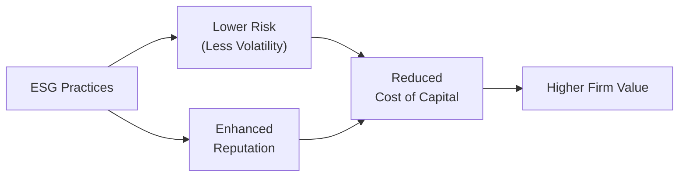

## 4.2 Corporate Governance, Risk Management, and ESG

So, let me first say: corporate governance, risk management, and ESG... if you’ve ever sat through a slightly dry board meeting, you know how these topics can sound. Busy directors in suits, a few sub-committees, discussions about investment strategies, compensation, environment, and whether or not to adopt some new disclosure framework. But here’s the deal: none of that is just fluff. When companies get governance right, manage risks proactively, and integrate ESG into everyday decision-making, it can really move the needle on long-term performance.

Corporate governance ensures that the decisions taken by management reflect the best interests of shareholders and sometimes the broader set of stakeholders. Risk management ensures that the organization is identifying and dealing with potential pitfalls—financial, strategic, operational, or otherwise—before they derail success. And ESG (Environmental, Social, and Governance) can, quite honestly, transform a dull annual report into a set of commitments and metrics that let you see how future-ready a firm really is.

Below, we’ll explore key fundamentals of corporate governance, best practices in risk management, the rising importance of ESG, and how these elements interweave in U.S. and Canadian markets. I’ll share a few personal perspectives, provide diagrams, and then offer final exam tips tailored for the CFA Level II candidate. Let’s dive in.

## Corporate Governance Fundamentals
Good governance is basically about preventing misalignment (or even mischief) at the highest levels of an organization. It sets the tone for everything: strategy, accountability, transparency, and risk oversight. 

Board independence is a crucial concept. It means having a majority of directors who aren’t directly affiliated with the firm—so they can, in theory, keep management honest. An independent board needs relevant committees, including the typical audit and compensation committees. Those committees exist to examine technical areas—audits or exec compensation—that you don’t want overshadowed by conflicts of interest. 

Having diversity on a board—gender, ethnicity, expertise—brings different perspectives. Let’s say you’ve got a technology start-up. You might want a board member who knows the compliance side inside and out, especially if your product interacts with complex data laws. Meanwhile, a consumer marketing mind can help interpret brand risks, and you might even want someone who’s got experience in large-cap, heavily regulated industries if you plan to expand internationally.

Ownership structure also plays a huge role in how corporate governance is shaped. In a widely held public company (often the case in the U.S.), governance is mostly guided by ensuring transparency and accountability to a large, dispersed set of investors. By contrast, in a family-controlled or closely held firm, such as many in Canada, governance might require balancing family priorities with minority shareholder rights. Picture a multi-generational family enterprise in Montreal—Mom and Dad started the business, kids help run it, and external shareholders also want a voice on dividends and expansions. The best governance frameworks try to align these parties in a way that fosters the company’s sustainable growth.

A super high-level conceptual diagram might look like this:

In this diagram, the Board sets overall policy and delegates specialized review to committees. Both the Board and committees inform and guide management’s actions. This structure encourages checks, balances, and accountability.

## Risk Management Approaches
Well, risk management isn’t just about plugging in a bunch of numbers into some fancy model—though that may be part of it. The point is to make sure that an organization doesn’t get blindsided by events that could break its finances or reputation.

Enterprise Risk Management (ERM) is designed to handle risk in a holistic way. Traditionally, you might see separate risk silos: compliance risk tackled by the legal team, finance risk by the CFO, and operational risk by the COO. But ERM aims to unite these efforts, so the company sees risk through a single integrated lens.

Scenario analysis is one of those key buzzwords. Maybe you run multiple “what if?” scenarios. What if interest rates spike? What if raw material costs rise by 30%? What if inflation drives wages up drastically, or an environmental regulation changes the cost of carbon emissions? By analyzing these potential worlds, risk managers can figure out how the company would adapt—and ensure that the board and senior leadership are prepared.

In many ways, corporate governance sets the tone for risk management. If the board demands robust risk oversight, you’ll see formal processes—quarterly risk reviews, reporting lines to the board, and so forth. Without strong governance, risk management might be an afterthought or even ignored until a crisis hits.

## ESG Integration
ESG (Environmental, Social, and Governance) criteria have risen steadily in importance over the last decade. People often associate “ESG investing” with socially conscious investing or “doing good,” but it’s grown beyond that. ESG metrics can be a crucial lens to gauge a firm’s long-term viability. 

• Environmental: Some companies produce easily measured greenhouse gases, while others rely heavily on scarce water resources or generate large amounts of waste. Monitoring these factors can reduce regulatory, reputational, and operational risks.  
• Social: This covers employee relations, community interactions, data privacy, and product quality issues. As an example, you might see a technology firm focus strongly on privacy frameworks to ensure it doesn’t run afoul of data protection laws.  
• Governance: This is the G that merges seamlessly with the governance topics we’ve already discussed—board independence, executive compensation, diversity, and accountability.

Now, the “why bother?” question: for investors, strong ESG performance can signal good risk management, stable relationships with external stakeholders, and fewer surprises. Studies have shown that companies with robust ESG practices tend to have a lower cost of capital and can experience less volatility in crisis periods. 

Disclosure frameworks such as the Sustainability Accounting Standards Board (SASB) standards in the U.S. or the best-practice guidance from the Toronto Stock Exchange (TSX) in Canada help unify language around ESG reporting. That can make it easier for analysts to compare apples to apples across industries and geographies. Let’s create a quick visual to show how ESG factors feed into a valuation model:

The intuition is that solid ESG performance might reduce risk, nurture a positive reputation, and entice investors—ultimately leading to improved valuation.

## U.S. and Canadian Governance Considerations
There are some differences in governance standards and market culture between the U.S. and Canada. In the U.S., the Securities and Exchange Commission (SEC) is the key federal regulator, while states have their own corporate laws and listing requirements. In Canada, you navigate multiple provincial securities commissions under the umbrella of the Canadian Securities Administrators (CSA). Investment dealers and trading activities are overseen by the Investment Industry Regulatory Organization of Canada (IIROC).

Shareholder rights can vary. “Say-on-pay” votes—where shareholders weigh in (usually non-bindingly) on executive compensation—have become standard in the U.S., while in Canada, it remains somewhat dependent on listing rules and best practices rather than a strict uniform approach. Proxy access has also evolved differently in the two markets. Meanwhile, Canada’s governance culture emphasizes not only shareholder interests but also the need to consider employees and communities. In other words, you might see board decisions revolve around multiple stakeholders more explicitly in some Canadian corporations.

If you’re investing in a Canadian mining company, for instance, consider how its board addresses environmental and social responsibilities to local communities. If you’re focusing on an American tech giant, watch how it deals with data privacy and diversity on its board. Cultural and legal frameworks drive these differences—and staying aware of them can help analysts spot red flags or governance gaps.

## Conclusion and Best Practices
It might feel like there are many moving pieces, but effective governance, a solid approach to risk management, and conscious ESG integration all lead to more resilient companies. When boards are truly independent, transparent, and accountable, shareholders and stakeholders can trust that the right strategies and oversight mechanisms are in place. 

There are a few common pitfalls. One is “paper compliance,” where a company ticks the box on recommended policies but lacks genuine board engagement. Another is adopting ESG initiatives just for marketing purposes. This can easily backfire if the underlying commitment is weak. And then there’s ignoring scenario analysis or risk identification until a meltdown is imminent. Better to incorporate these processes early and thoroughly.

Encourage board members to ask tough questions. Build a culture that sees risk not just as a threat but also a chance for value creation (like new markets or innovations). Integrate ESG metrics in performance reviews and tie them to compensation, if appropriate. And finally, remain nimble—today’s market environment can change quickly, so continuous improvement is key.

## Glossary
Board Independence: A board of directors composed mostly of members without conflicts of interest or direct ties to management.  
ERM (Enterprise Risk Management): A holistic process for identifying, assessing, managing, and monitoring a broad range of organizational risks.  
ESG (Environmental, Social, and Governance): Criteria for evaluating a company’s actions regarding sustainability, ethical behavior, and stakeholder impact.  
SASB (Sustainability Accounting Standards Board): An organization that develops standards for disclosing financially material sustainability information.  
IIROC (Investment Industry Regulatory Organization of Canada): A national self-regulatory body overseeing investment dealers and trading in Canada’s debt and equity markets.  
CSA (Canadian Securities Administrators): An umbrella organization of provincial and territorial securities regulators in Canada.  
Say-On-Pay: A shareholder vote (often non-binding) on executive compensation.  
TSX (Toronto Stock Exchange): Canada’s largest stock exchange, known for its guidelines and specific governance best practices for listed companies.

## References and Further Reading
• CFA Institute, “Environmental, Social, and Governance Issues in Investing: A Guide for Investment Professionals.”  
• Monks, Robert, and Nell Minow, “Corporate Governance” for a deep dive on stakeholder vs. shareholder models.  
• TSX and NYSE listing manuals for relevant governance standards.  
• Consider visiting the official SASB website (www.sasb.org) for specific industry-based ESG disclosure recommendations.

## Final Exam Tips
• Know how to analyze a board’s independence: Look for details like the percentage of outside directors, presence of executive chair vs. non-executive chair, and whether committees are truly independent.  
• Understand the key components of ERM: Make sure you can read a scenario analysis table and interpret how different “shocks” might impact earnings or strategic priorities.  
• ESG factors can pop up in a vignette-style question: Pay attention to how the question frames the environmental or social risks (like a reputational crisis). You might be asked to evaluate a cost of capital scenario or intangible brand value.  
• Be ready for questions on U.S. vs. Canadian governance norms: Especially around shareholder rights, regulatory bodies, or ownership structures.  
• Practice sample questions and memorize a cohesive approach to analyzing governance in an equity valuation context—G factor analysis is sometimes a big part of it.

## Test Your Knowledge: Corporate Governance, Risk Management, and ESG Quiz



### Which of the following best describes the primary purpose of corporate governance?

- [ ] To maximize wage growth for employees.
- [x] To align management’s actions with shareholder and stakeholder interests.
- [ ] To ensure corporate social responsibility only.
- [ ] To enforce compliance without regard to strategic decisions.

> **Explanation:** Corporate governance is about ensuring management’s decisions reflect the long-term interests of shareholders and other stakeholders, emphasizing accountability, transparency, and risk oversight.

### Which statement is most accurate about a board’s independence?

- [x] Independent boards can better oversee management and reduce conflicts of interest.
- [ ] An independent board means only one outside director is appointed.
- [ ] An independent board is required to vote unanimously on executive compensation.
- [ ] Independent boards are legally required in all publicly traded corporations.

> **Explanation:** The fundamental benefit of independence is that directors are free from potential conflicts of interest, enabling them to provide objective oversight and enhance accountability.

### Which of the following is most closely associated with Enterprise Risk Management (ERM)?

- [ ] Focusing on compliance risk alone.
- [ ] Segregating risk management responsibilities by department.
- [x] Integrating all types of risk (operational, financial, strategic) under one framework.
- [ ] Eliminating all business risk through insurance.

> **Explanation:** ERM brings different risk categories under one umbrella, ensuring a holistic approach to identifying and mitigating risks.

### What is a key reason investors place increasing emphasis on ESG disclosures?

- [ ] ESG data is always mandatory worldwide for publicly traded firms.
- [ ] ESG performance is irrelevant to cost of capital.
- [x] Strong ESG practices may indicate lower risk and potentially higher sustainable value.
- [ ] ESG considerations are never financially material.

> **Explanation:** Many investors see ESG data as a proxy for risk management quality and brand stability, influencing a company’s long-term prospects.

### Which regulatory body oversees investment dealers and trading in Canada’s equity markets?

- [ ] SEC
- [x] IIROC
- [ ] FINRA
- [x] CSA

> **Explanation:** In Canada, IIROC supervises investment dealers and trading, while CSA is an umbrella group for provincial securities regulators (such as Ontario Securities Commission).

### A company performs a scenario analysis to assess the impact of higher interest rates, stronger currency, and a drop in consumer demand. Which approach does this illustrate?

- [ ] Focusing only on historical data.
- [ ] Prioritizing share buybacks over dividends.
- [x] Risk management through forward-looking strategic planning.
- [ ] Elimination of risk by diversification alone.

> **Explanation:** Scenario analysis is a forward-looking tool used within risk management for crafting strategic responses under different market conditions.

### Which is a benefit of board diversity in corporate governance?

- [ ] Reduced accountability due to too many opinions.
- [x] Broader perspectives leading to more robust decision-making.
- [x] Potential for improved stakeholder relations.
- [ ] Longer board meetings without tangible gains.

> **Explanation:** Diversity improves a board’s problem-solving capacity and stakeholder understanding, enhancing governance quality.

### Why might strong ESG metrics lead to reduced cost of capital?

- [x] Investors may perceive heightened risk when ESG metrics are strong.
- [ ] Regulators provide subsidies for any firm with good ESG scores.
- [ ] Access to debt markets is strictly prohibited for firms with weak ESG.
- [x] Investors often interpret strong ESG as indicating more stable, well-managed companies.

> **Explanation:** Firms with robust ESG practices are regarded as safer and more forward-thinking, which can lower perceived risk and thus their cost of capital.

### What is a potential governance challenge specific to family-owned firms?

- [x] Balancing family members’ interests with those of external shareholders.
- [ ] Having too many outside directors.
- [ ] Lack of a compensation committee.
- [ ] Strict adherence to ERM frameworks only.

> **Explanation:** In closely held or family-controlled firms, significant ownership concentration may pose governance issues if minority shareholders’ interests are overshadowed by family priorities.

### True or False: “Say-on-pay” votes are mandatory and binding in all North American markets.

- [x] True
- [ ] False

> **Explanation:** Although “say-on-pay” votes are standard in many firms, they vary in whether they are legally binding or advisory-only, and practices differ between the U.S. and Canada.


