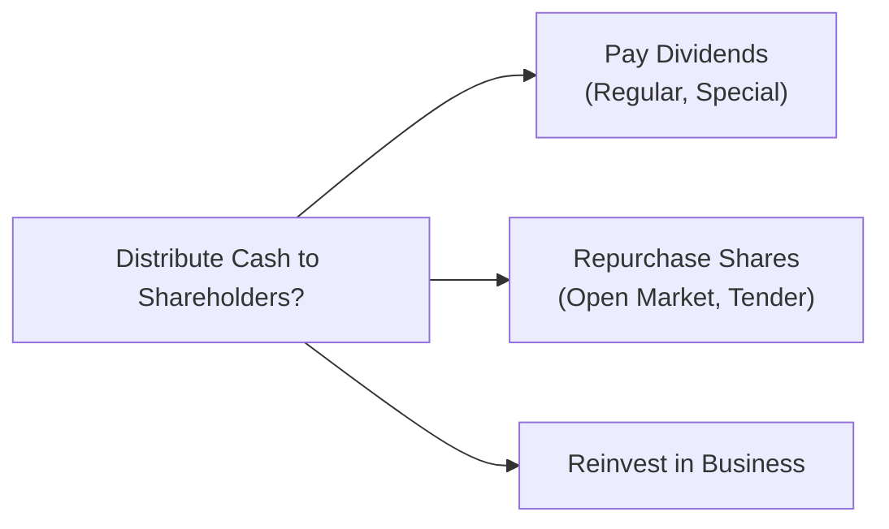

## 4.4 Dividend Policy and Share Repurchases

Have you ever wondered why some companies pay a big fat dividend while others stubbornly cling to their cash? And then there’s that whole concept of share buybacks—sometimes they’re all the rage, sometimes... crickets. Well, let’s explore the hows and whys of these decisions. Because honestly, when it comes to corporate finance, few topics inspire so much debate as dividend policy and share repurchases.

Dividend payout decisions are wrapped up in theories about taxes, market signaling, and personal investor preferences. In practice, managers must balance investor expectations, firm growth prospects, and available cash flow in determining whether to give out dividends, buy back shares, or just do something else entirely. Hang on, because we’ll break down these ideas, look at real-world examples, and hopefully make this journey a bit more fun than you might expect from a corporate finance textbook.

### Dividend Policy Theories

#### Dividend Irrelevance Theory (Miller and Modigliani)
Under the classic Dividend Irrelevance Theory proposed by Merton Miller and Franco Modigliani, in a world of no taxes, no transaction costs, and perfect capital markets, dividends shouldn’t matter—at least not for the intrinsic value of the firm. I know, that sounds bizarre. But think about it: the theory suggests that investors can sell a bit of their holdings if they want cash in place of dividends, or they can reinvest dividends in new shares if they’d prefer that. So in that idealized setting, how the company chooses to return cash (or not) is irrelevant to overall value.

Of course, the real world is a bit messier—taxes exist, transaction costs can be significant, and dividend announcements may signal something important about future earnings or management’s confidence. So the irrelevance theory might look nice on paper, but it gets complicated in practice.

#### Bird-in-the-Hand Argument
Ever heard the phrase “a bird in the hand is worth two in the bush”? Applied to dividends, some folks argue that investors favor more certain, immediate cash payments in the form of dividends rather than uncertain capital gains that might happen down the road. This is sometimes referred to as the Bird-in-the-Hand Theory. In simpler terms, “Show me the money. Now.”

Practically, companies that consistently pay stable or growing dividends often attract investors who want steady income. This preference can, in turn, affect the company’s cost of equity since shareholders might be willing to pay a premium for that sense of certainty.

#### Tax Considerations in the U.S. and Canada
Taxes can twist these theories in all sorts of fun ways (yes, I just used “fun” and “taxes” in the same sentence, sorry). Even if you don’t personally worry about them (maybe you have a tax-advantaged account or something), many investors do. And that influences how they feel about dividends versus capital gains.

• U.S.: Qualified dividends are generally taxed at a lower rate than ordinary income, provided they meet certain holding period and other requirements. Still, depending on an investor’s tax bracket, long-term capital gains can be similarly favorable, slightly lower, or about the same.  
• Canada: Eligible dividends receive a dividend tax credit, decreasing the effective tax rate on dividends. This system is intended to offset the double taxation that can arise when profits are first taxed at the corporate level, then again in shareholders’ hands.

For individuals who hold shares in taxable accounts, these details can be critical. A firm’s decision to maintain or increase its dividend often appeals to certain shareholders, while others might prefer buybacks for better capital gains treatment (or at least a deferral of taxes until they sell).

### Types of Dividends

#### Regular Cash Dividends
Regular cash dividends are like that reliable old friend who shows up quarter after quarter—no drama, no fuss. If you’re a dividend-seeking investor, you probably appreciate stable or steadily rising payouts. In practice, management usually won’t raise a dividend unless they feel confident about stable cash flows, because cutting it later can send a negative signal to the market.

From a CFO’s viewpoint, establishing a regular dividend is a big responsibility. After all, once you start delivering cash to shareholders, missing a payment or slashing your dividend can seriously freak people out about future profitability.

#### Extra or Special Dividends
Here’s where it gets interesting—extra or special dividends are those occasional treats you get when the company finds itself flush with cash. This might happen after a big asset sale, or maybe the company had a crazy profitable year. One day, you might see a press release announcing a one-time dividend, say, $3 per share. Investors usually love these “surprise windfalls,” but nobody expects them to continue year in and year out.

#### Stock Dividends / Stock Splits
Ever seen a company do a 2-for-1 split or declare a 10% stock dividend? In principle, these don’t really change the total value of what shareholders hold. They just get more shares at a proportionally lower price per share. Typically done to improve liquidity by lowering the share price, stock splits can also be a psychological play: some investors love seeing a “lower” share price, even though the fundamental company value hasn’t changed.

### Share Repurchase Mechanics

Another way to return capital to shareholders without labeling it as a “dividend” is via share repurchases—or buybacks. A firm might say: “We’ll spend $1 billion buying back our own shares this year.” But how do they actually do it?

#### Open Market Repurchases
This is the most common approach. The firm buys its shares gradually on the open market through a broker, kind of like any other investor—only bigger. It can be slow and methodical, allowing flexibility in timing based on share price movements. 

#### Fixed Price Tender Offers
In some cases, a company might say, “Hey shareholders, we’ll buy up to X million shares at $30 each, a slight premium to the current market price.” Investors have a limited window to tender (i.e., offer to sell) their shares, and the company either buys them all up or allocates partial buybacks if the tender is oversubscribed. Tender offers can be a strong positive signal, because the company is paying a premium, effectively saying: “We think our shares are worth at least that much.”

#### Impact on EPS and Book Value per Share
Let’s say your company has $100 million in net income, 10 million shares outstanding (so EPS = $10). If you buy back 2 million shares but net income stays the same, you now share that $100 million among 8 million shares... so EPS rises to $12.50. Magic, right? Actually, not so fast. We have to ask: at what price did you buy those shares? If you overpaid, you might end up destroying shareholder value. EPS might rise, but in efficient markets, the share price may adjust for the fact that the company parted with precious cash.

Book Value per Share can also change. If the repurchase price is above book value, that can reduce the remaining equity base and sometimes reduce Book Value per Share. If the buyback happens at a price below the company’s book value, it can increase Book Value per Share. 

Here’s a little formula to illustrate the effect on EPS when issuing or repurchasing shares:

If a company repurchases ΔShares at price P, using after-tax income (I), then the proportionate impact on EPS depends on whether (P × ΔShares) is less than, equal to, or greater than the ratio (I / total shares). In short, buybacks are beneficial to remaining shareholders if the company’s intrinsic value is above the buyback price—and can be detrimental otherwise.

### Signaling Effects and Agency Costs

Investors often interpret dividends and share buybacks as signs from management about future prospects. That’s because managers generally have more internal info about earnings potential than outside investors.

#### Positive Signal
A dividend increase or a share repurchase announcement can cue the market to think, “Hey, management believes the future is bright and can afford to distribute more cash.” Sometimes, though, it’s just that the company doesn’t have profitable reinvestment opportunities. A share repurchase might be a more tax-efficient way to return capital, or might just reflect that management sees the stock as undervalued.

#### Negative Signal
Conversely, a dividend cut can signal trouble. It’s that moment where everyone wonders if management is throwing in the towel—like, do they not have cash? Are their earnings shrinking? This can drive the stock price down. 

#### Agency Considerations
Free cash flow can be a double-edged sword. If management has loads of free cash flow, they might be tempted to invest in flashy new projects that yield subpar returns or pad the budget for personal perks. Distributing cash to shareholders can reduce the capacity for managers to overspend—thus taming agency problems. 

### Sustainability Analysis

A firm’s ability to sustain its dividends or share repurchases is a big part of capital markets analysis. Can a company keep paying out cash at this level? Or is it a house of cards?

#### Dividend Coverage Ratios
This ratio is basically (Dividends per share) / (Earnings per share) or total dividends / net income, or total dividends / free cash flow—different variations exist. If that ratio is super high (like over 100%), it might mean the firm is paying out more than it earns—uh-oh. So pay attention to that, or you might be in for a rude surprise when the next dividend gets cut.

#### Impact of Debt-Funded Buybacks
Some companies borrow money to fund share buybacks. It’s not automatically a red flag—sometimes debt is cheap, and management genuinely thinks their own shares are the best investment. But it adds leverage, heightening risk. If interest rates rise, or earnings drop, that extra debt load can become an anchor. 

### Visual Overview in Mermaid

Below is a simple Mermaid diagram illustrating the broad decision tree for distributing cash:

The firm essentially decides whether to distribute cash (dividends or buybacks) or keep it invested. Each route comes with pros and cons around signaling, taxes, and future obligations.

### Practical Examples and Anecdotes

I remember chatting with a CFO who described a bit of an identity crisis at her company: “We’d been paying a steady dividend for years, but we found ourselves with so much extra cash after an asset sale that our board started freaking out about doing a buyback or a special dividend. We finally launched a share repurchase because we felt the stock was undervalued. That decision, ironically, gained more positive publicity than any of our prior dividend announcements ever did. I guess markets sometimes just respond more strongly to buybacks.” Her experience underscores how corporate decisions around payouts aren’t purely mechanical; they come with strategic communication challenges.

### Best Practices and Common Pitfalls

• **Consistent Policy:** Boards generally avoid raising dividends unless they think they can maintain them. Frequent cuts are a buzzkill for investors.  
• **Evaluate Tax Implications:** Understand your shareholder base. If they benefit more from capital gains, a buyback may be preferable. However, watch out for potential regulatory constraints in certain jurisdictions.  
• **Avoid Overpaying:** If you’re buying back shares at inflated prices, the negative impact could outweigh any EPS boost.  
• **Don’t Ignore Leverage:** Funding dividends or buybacks with excessive debt may look good short-term but can magnify financial risk (especially if interest rates climb).  

### Glossary

• **Dividend Tax Credit (Canada):** Credits Canadian shareholders for corporate taxes the firm already paid on dividends.  
• **Qualified Dividends (U.S.):** Dividends meeting certain conditions for preferential tax rates.  
• **Open Market Operations (Share Repurchase Context):** Purchasing shares on the exchange, usually through a broker, over a period.  
• **Tender Offer:** A public offer to repurchase shares at a set price, often at a premium.  
• **Bird-in-the-Hand Theory:** Investors may favor certain dividends over uncertain capital gains.  
• **Dividend Coverage Ratio:** Typical forms include (Dividends / Net Income) or (Dividends / Free Cash Flow) to see if there’s enough money to continue paying out.  

### Final Exam Tips

• **Know Your Theories:** Be crystal clear on the assumptions behind M&M’s Dividend Irrelevance Theory versus other perspectives like the Bird-in-the-Hand argument.  
• **Tax Nuances:** Understand how different jurisdictions treat dividends versus capital gains. This can show up in tricky exam questions, especially with cross-border considerations.  
• **EPS Calculations:** Know how a share repurchase can affect EPS, and when it’s accretive or dilutive.  
• **Signaling:** Expect a question about how changes in dividend policy or buyback announcements can be interpreted by the market.  
• **Ratios:** Memorize the key coverage ratios and be prepared to interpret them in context. If you see a payout ratio greater than 100%, ask yourself whether it’s truly sustainable.  
• **Agency Costs:** Remember that returning cash to shareholders can help mitigate agency problems, but also invests the owners with more direct control.  

### References and Further Reading

• CFA Institute’s Level II curriculum on Corporate Finance—Payout Policy  
• Fama, Eugene F., and Merton H. Miller. “The Theory of Finance.” A foundational resource on dividend irrelevance and efficient markets  
• Canadian Revenue Agency (CRA) and Internal Revenue Service (IRS) publications on dividend taxation rules  
• Graham, John R., and Alok Kumar. “Do Dividend Clienteles Exist? Evidence on Dividend Preferences of Retail Investors.”

---

## Test Your Knowledge: Dividend Policy and Share Repurchases



### A company announces a 20% increase in its quarterly dividend. Which statement best describes the potential market reaction under signaling theory?

- [x] Investors may interpret it as a positive signal regarding the company's future earnings prospects.  
- [ ] Investors see it as a tax-avoidance plan.  
- [ ] The share price should remain unchanged under most real-world conditions.  
- [ ] It indicates the company believes its stock is undervalued.  

> **Explanation:** A dividend increase often signals management’s confidence in future cash flows, potentially boosting investor sentiment.

### A firm decides to repurchase its shares at a price significantly above its intrinsic value. What is a likely consequence for the firm?

- [x] It might reduce shareholder value because the firm is overpaying for its shares.  
- [ ] It always increases the firm's P/E ratio.  
- [x] It could provide a short-term EPS boost despite longer-term value destruction.  
- [ ] It demonstrates that the firm is undervalued.  

> **Explanation:** Overpaying for shares can damage long-term value, even if EPS temporarily rises because fewer shares remain outstanding.

### Which best describes the Bird-in-the-Hand argument?

- [x] Investors prefer certain dividend payouts to uncertain capital gains.  
- [ ] Investors prefer uncertain equity appreciation to yearly dividends.  
- [ ] Investors remain indifferent between dividends and capital gains in perfect markets.  
- [ ] Investors always reinvest dividends immediately out of habit.  

> **Explanation:** Bird-in-the-Hand theory suggests that a certain, immediate payout is more valuable than potential future gains.

### Under which condition might a share buyback be considered accretive to EPS?

- [x] When the repurchase price per share is below the firm's intrinsic value.  
- [ ] When the repurchase price per share is above the firm's market price but not intrinsic value.  
- [ ] When net income is zero or negative.  
- [ ] When the buyback is funded entirely by new debt.  

> **Explanation:** If the shares are repurchased at a price below intrinsic value, the existing shareholders benefit more, and EPS can rise.

### What is a primary reason some investors might prefer share repurchases over dividends?

- [x] Share repurchases can defer taxes until shares are sold.  
- [ ] Share repurchases have no impact on share price.  
- [x] Share repurchases compel all shareholders to sell their shares.  
- [ ] Share repurchases are legally mandated in most jurisdictions.  

> **Explanation:** Shareholders often prefer the potential capital gains from buybacks and the ability to choose when to realize those gains (and pay taxes).

### Which of the following is true about dividend coverage ratios?

- [x] They measure how well a firm’s dividends are covered by net income or cash flow.  
- [ ] They must always be greater than 2.0, or else the firm will cut its dividend.  
- [ ] They are only relevant for a firm’s debt investors.  
- [ ] They remain constant as long as the share price remains stable.  

> **Explanation:** The ratio indicates whether dividends are supported by ongoing profits/cash flows. A low coverage ratio can imply risk of a cut.

### A firm’s management has surplus cash but limited positive NPV projects. According to agency theory, paying dividends or repurchasing shares might:

- [x] Help reduce agency costs by limiting resources under managerial control.  
- [ ] Increase agency costs because managers can spend more on perks.  
- [x] Compel investors to pay additional taxes on reinvested dividends.  
- [ ] Eliminate the need for external financing.  

> **Explanation:** Agency theory suggests that returning cash to shareholders limits managers’ capacity to spend on suboptimal investments, potentially reducing agency costs.

### Which one is a potential downside to borrowing funds to carry out share buybacks?

- [x] Increased financial leverage can elevate the firm’s risk profile.  
- [ ] Reduced EPS in the short term.  
- [ ] Lower interest expenses.  
- [ ] Higher agency costs.  

> **Explanation:** Debt-funded buybacks can boost EPS in the short term, but they also raise leverage, thereby amplifying the firm’s risk.

### If a firm executes a 2-for-1 stock split, what is the direct impact on a shareholder’s total value?

- [x] There is no direct change in total value; the shareholder just holds twice as many shares at half the price.  
- [ ] The shareholder’s total value doubles since they now own twice as many shares.  
- [ ] The shareholder’s total value is halved since each share is worth half.  
- [ ] Stock splits invalidate any future dividend payments.  

> **Explanation:** Stock splits typically have no direct effect on total value; they simply change the number of shares outstanding and lower the share price proportionally.

### A company’s CEO claims dividends are irrelevant to firm value, referencing the M&M Theory without taxes. Is this statement true or false in the real world?

- [x] True  
- [ ] False  

> **Explanation:** M&M’s Dividend Irrelevance Theory holds strictly in a perfect market with no taxes, no transaction costs, and symmetric information. Real markets have taxes, signaling effects, and other imperfections, so the strict theory does not always hold in practice.


