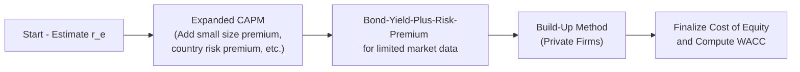
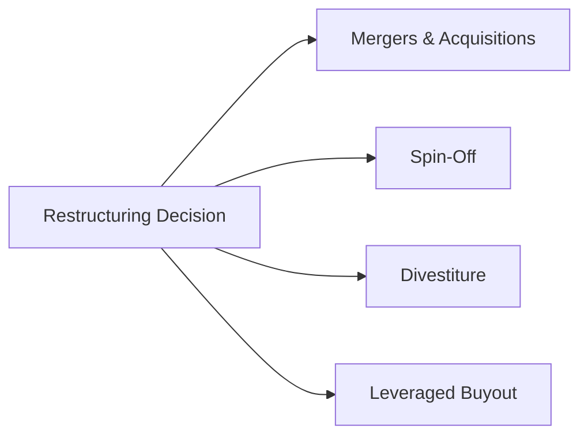

## 4.5 Advanced Cost of Capital and Corporate Restructuring

Welcome to this deep dive on Advanced Cost of Capital and Corporate Restructuring. Here, we’ll explore how various factors—such as expanded CAPM models, bond-yield-plus-risk-premium approaches, and private vs. public firm considerations—shape the cost of capital. We’ll then explore restructuring techniques, including mergers, spin-offs, leveraged buyouts (LBOs), and cross-border deal dynamics (particularly in the U.S. and Canada). In my opinion, this is one of the most exciting and occasionally nerve-racking parts of corporate finance, because you’re dealing with real money and real consequences that can fundamentally change the direction of a business.

--------------------------------------------------------------------------------

## Introduction

I still remember the first time I was tasked with determining a firm’s weighted average cost of capital (WACC). I was sweating as I plugged numbers into spreadsheets, worrying, “What if I miss the target by a fraction of a percent?” True story—those mistakes can balloon in valuation models. Fast forward to later experiences, and I realized that advanced cost of capital estimation is less about memorizing formulas and more about deeply understanding risk profiles, capital structures, and strategic decisions. 

Corporate restructuring is just as critical: from M&A deals that look dazzling on paper to spin-offs that seem like a stroke of genius but can be complicated to pull off in practice. Anyway, let’s roll up our sleeves and unfold these topics in detail.

--------------------------------------------------------------------------------

## Advanced Cost of Capital Estimation

### Overview

Cost of capital is the required return that compensates providers of capital—both equity and debt—for the risks they’re taking. Traditionally, you might use the Capital Asset Pricing Model (CAPM) to estimate the cost of equity, plug in the cost of debt, and weigh them according to the firm’s capital structure to compute the Weighted Average Cost of Capital (WACC). But real-world scenarios are seldom that neat. Sometimes you need to expand your CAPM approach to account for additional risk factors, or maybe use a build-up method if the firm doesn’t have a clear market beta. That’s exactly where advanced techniques come in.

### The Role of WACC

WACC matters big time. It’s used to discount future cash flows in valuation models, and a small shift in WACC can vastly impact the value of a project or an entire company. 

Mathematically, WACC is often shown as:

$$
\mathrm{WACC} = \left( \frac{E}{E + D} \right) \times r_e + \left( \frac{D}{E + D} \right) \times r_d \times (1 - T)
$$

where:
- \\( E \\) = market value of equity,  
- \\( D \\) = market value of debt,  
- \\( r_e \\) = cost of equity,  
- \\( r_d \\) = cost of debt,  
- \\( T \\) = marginal tax rate.  

But in many advanced scenarios, the real art lies in estimating \\( r_e \\) and \\( r_d \\).

### Expanded CAPM

The plain-vanilla CAPM says:

$$
E(R_i) = R_f + \beta_i \bigl[E(R_m) - R_f\bigr]
$$

where:
- \\( E(R_i) \\) is the expected return of the security (or cost of equity from the firm’s perspective),
- \\( R_f \\) is the risk-free rate,
- \\( \beta_i \\) is the asset’s sensitivity to the market,
- \\( E(R_m) \\) is the expected market return.

But let’s be honest—some companies have risk factors that just aren’t captured by beta alone. Introducing “expanded CAPM,” which might tack on specific risk premiums. Examples include:

- **Size Premium**: Smaller firms tend to have higher returns (empirically observed), so you add a few percentage points to reflect that additional risk.  
- **Country Risk Premium**: If a firm operates in (or invests in) emerging markets with political or economic instability, you add a proper premium.  
- **Industry-Specific Factors**: For instance, a biotech start-up might face unique regulatory or patent cliff risks that get folded into the cost of equity.

In practice, an expanded CAPM might look like:

$$
E(R_i) = R_f + \beta_i \bigl[E(R_m) - R_f\bigr] + \text{Size Premium} + \text{Country Premium} + \dots
$$

Yes, it can feel a bit like a “plug and play,” but each piece has to be justified with data or at least reasoned judgment. You might find an add-on of 1% to 2% for small-cap stocks or a higher figure for frontier markets.

### Bond-Yield-Plus-Risk-Premium Approach

Now let’s talk about another approach that’s often used when you can’t easily derive a market beta. Many small private companies have stable debt but limited equity trading info. A practical solution is the bond-yield-plus-risk-premium approach.

1. Identify the yield on the firm’s outstanding long-term debt (e.g., 8%).  
2. Add an equity risk premium (e.g., 3% to 5%), reflecting that equity is riskier than debt.  

So you might say:  

$$
r_e = \text{Company’s Debt Yield} + \text{Premium}
$$

Now let’s be super clear: the premium you pick here is crucial. If you’re dealing with a very risky business, you may up that premium. If you’re dealing with a stable, utility-like business, maybe you keep it modest.

### Private vs. Public Companies

Public companies often have betas you can look up from data services. Private companies, by contrast, have no direct stock price. They typically turn to **build-up methods**:

- **Base Rate**: Start with a risk-free rate (e.g., yield on T-bonds).  
- **Equity Risk Premium**: For the overall market.  
- **Size Premium**: If it’s smaller and riskier.  
- **Industry Premium**: If that sector typically commands a higher (or lower) premium.  
- **Company-Specific Premium**: Something totally unique, e.g., an overreliance on one big customer.

Put them all together, and you can end up with a cost of equity that’s quite a bit higher than the standard CAPM approach might suggest. Because, well, private companies can be riskier and less diversified.

Below is a simple flowchart summarizing advanced cost of capital approaches:

--------------------------------------------------------------------------------

## Corporate Restructuring Drivers and Types

### Why Restructure?

Companies rarely restructure for fun. Typically, they do it to increase shareholder value or pivot strategies. Maybe the firm is stuck in too many unprofitable segments—why not spin off the less profitable lines to focus on the core? Maybe there’s an acquisition target that’d bring synergy (cost savings, complementary products, etc.). Sometimes managers simply want to exploit tax strategies or use cheap debt financing. Let’s see how it often plays out.

### Mergers and Acquisitions (M&A)

An M&A deal might be financed with cash, stock, or a combination of both. 

- **Cash Deals**: Usually straightforward, but they consume the acquirer’s cash pile or increase debt.  
- **Stock Deals**: Dilution can become a big factor. For example, if you buy a smaller rival with your own shares, you’re effectively giving away a portion of your future earnings.  

#### Synergy Valuation

Synergies are those magical benefits—like combining supply chains or sharing marketing budgets. In valuation models, you need to estimate synergy cash flows and discount them back at an appropriate rate. Sometimes synergy estimates are overly optimistic, leading to post-merger disappointments.

#### Post-Merger Integration

I’ve seen deals that look absolutely amazing on Day 1 but then integration becomes the real stumbling block. People don’t like new processes. Cultures clash. Maybe the synergy never materializes. In an exam setting, you want to remember that synergy is only as good as the company’s ability to realize it. A quick tip: watch for synergy assumptions that are “too big, too soon.”

### Divestitures and Spin-Offs

**Divestitures** (selling off parts of the business to a third party) and **spin-offs** (creating a new, independent company by distributing shares to existing shareholders) can unlock value if a segment is overshadowed by the rest of the firm or if it’s dragging down margins. By separating it, you can often “surface” its standalone value. 

Spin-offs are typically tax-free in many jurisdictions if they meet certain conditions, making them attractive for shareholders who might prefer not to trigger capital gains right away.

### Leveraged Buyouts (LBOs)

**LBOs** are acquisitions using a substantial amount of borrowed funds—often secured by the target’s assets. Think private equity shops that purchase a company, load it with debt, and aim to improve operations or strategy. If successful, they can create value quickly, but the financial leverage can be huge.

Here’s a schematic to illustrate different restructuring options:

--------------------------------------------------------------------------------

## Impact on EPS, Leverage, and WACC

### EPS Accretion and Dilution

In an M&A context, EPS is a key measure for public companies. An acquisition:

- Might be **accretive**, i.e., increases EPS if the acquired firm’s earnings outstrip the cost of capital.  
- Could be **dilutive**, i.e., lowers EPS if the cost of acquisition or synergy shortfalls overshadow any potential earnings gain.

When you use shares as currency, there’s an increased share count. If the target’s net income doesn’t keep pace, you get EPS dilution. CFOs tend to watch this closely, because short-term EPS changes can influence investor sentiment.

### Net Debt to EBITDA

When a company embarks on a leveraged buyout or a debt-funded restructuring, the net debt to EBITDA ratio often skyrockets. This ratio is a quick measure of leverage (and risk). If net debt is, say, $1 billion and annual EBITDA is $200 million, the ratio is 5x. Rating agencies and analysts get skittish if leverage is too high, as it means heavier interest payments and less financial flexibility.

### Changes in WACC

Debt is cheaper (usually) because interest is tax-deductible, but it also adds financial risk. If a firm’s capital structure shifts heavily toward debt, the cost of equity might shoot up due to increased financial risk. The overall effect on WACC depends on the interplay of lower after-tax cost of debt vs. the increased required return on equity. 

There’s that classic trade-off theory: up to a point, debt can reduce WACC because of the tax shield. Beyond that, too much debt pushes up the cost of equity and eventually the cost of debt as well, driving WACC back up. It’s kind of a U-shaped curve.

--------------------------------------------------------------------------------

## Cross-Border Transactions (U.S. and Canada)

Here’s where the legal and regulatory environment enters the picture. Cross-border deals can be subject to antitrust reviews, national security concerns, and other regulatory approvals.

- **Regulatory Hurdles**: For instance, Canada has the Investment Canada Act. If a foreign entity wants to acquire a large Canadian business, they might need to show a “net benefit to Canada.” In the U.S., the Committee on Foreign Investment in the United States (CFIUS) can review deals for national security implications.  
- **Tax Structuring**: Cross-border M&A can involve inversions (moving the legal headquarters to a lower-tax jurisdiction), cross-border financing vehicles, and, importantly, withholding tax on dividend or interest payments.

For instance, say a U.S. tech giant wants to acquire a Toronto-based start-up. The teams will examine corporate, withholding, and capital gains taxes on both sides of the border. They might structure the deal with a Canadian acquisition subsidiary to optimize taxes. Remember, though, that tax advantages alone rarely justify an acquisition if there’s no strategic rationale behind it.

--------------------------------------------------------------------------------

## Glossary

- **Expanded CAPM**: Modification of the basic CAPM model to include additional risk factors like small-size premiums or country risk.  
- **Build-Up Method**: A cost of equity estimation technique that layers multiple premiums (market, size, industry, plus company-specific risks) on top of a risk-free rate.  
- **Spin-Off**: When an existing firm forms a new independent entity by distributing shares of that new company to its existing shareholders.  
- **Leveraged Buyout (LBO)**: Acquisition largely funded by debt, where the acquired firm’s assets/cash flows provide collateral or repayment capacity for the loan.  
- **Net Debt to EBITDA**: A leverage metric indicating how many years of EBITDA would be needed to pay off the firm’s net debt.  
- **Investment Canada Act**: Canadian legislation requiring certain foreign investments in Canadian firms to undergo a “net benefit” review.  
- **Inversion (Tax Inversion)**: Strategy where a U.S. firm changes its legal domicile via M&A to a lower-tax country.

--------------------------------------------------------------------------------

## References and Further Reading

1. Donald DePamphilis. “Mergers, Acquisitions, and Other Restructuring Activities.”  
2. Ruth Bender and Keith Ward. “Corporate Financial Strategy.”  
3. CFA Institute’s Level II Corporate Finance curriculum (Sections on M&A, restructuring, cost of capital).  

These books and materials are phenomenal resources if you’re curious about how deals are actually done and how cost of capital is used in real practice.

--------------------------------------------------------------------------------

## Conclusion and Exam Tips

1. **Don’t Just Memorize Formulas**: The CFA Level II exam is big on conceptual understanding. Make sure you know why you might add a size premium in an expanded CAPM or how an LBO influences a firm’s cost of capital.  
2. **Focus on Practical Example**s: The exam might present you with a private company scenario, expecting you to choose a build-up method for cost of equity. Alternatively, you might see a cross-border acquisition in the U.S. or Canada, with questions relating to regulatory approval or tax structuring.  
3. **Leverage vs. WACC**: Understand the trade-off theory. Know how an increase in leverage initially lowers WACC (due to the tax shield) but eventually raises it because of the added risk.  
4. **Synergy Calculations**: In M&A questions, synergy valuations are critical. Watch out for how synergy is discounted—use an appropriate cost of capital, factoring in the risk characteristics of those synergy cash flows.  
5. **Regulatory and Tax**: In cross-border contexts, the exam might test your awareness of frameworks like the Investment Canada Act. Don’t overcomplicate it, but be mindful of how these issues can shape deal structure.  
6. **Terminology**: Terms like “spin-off,” “divestiture,” “LBO,” and “inversion” are frequently tested. Ensure you know the definitions cold and can apply them.  

--------------------------------------------------------------------------------

## Mastering Advanced Cost of Capital and Corporate Restructuring: 10-Question Quiz



### Which of the following best explains an expanded CAPM model?

- [ ] A model that uses only systematic risk factors with no additional premiums.
- [ ] A model that excludes country risk and size premiums.
- [x] A model that includes extra risk factors such as size or country risk premiums.
- [ ] A model that places equal weighting on each cost of capital component.

> **Explanation:** Expanded CAPM stretches beyond the basic market beta to incorporate adjustments for size, country, or industry premiums.  

### In the bond-yield-plus-risk-premium approach, if a firm’s long-term debt yield is 7% and the typical equity risk premium is 5%, what is the estimated cost of equity?

- [ ] 5%
- [ ] 7%
- [x] 12%
- [ ] 2%

> **Explanation:** The bond-yield-plus-risk-premium approach adds the risk premium (5%) to the corporate bond yield (7%), giving 12%.  

### The main premise of the build-up method in private companies is to:

- [x] Add incremental risk premiums to a base rate to approximate the firm’s cost of equity.
- [ ] Infer a cost of equity based solely on comparable public companies’ betas.
- [ ] Treat private cost of capital the same as for public companies.
- [ ] Ignore industry- and company-specific risk factors.

> **Explanation:** The build-up method literally “builds up” the required return by adding various incremental premiums (e.g., industry risk, size, company-specific) to the risk-free rate.  

### Which scenario best exemplifies a spin-off?

- [ ] A company acquires a competitor using mostly debt.
- [ ] A company merges with a rival to create a new entity through stock swaps.
- [ ] A private equity group buys out the majority shares of a company, increasing leverage.
- [x] A parent company creates and distributes shares of a new standalone subsidiary.

> **Explanation:** A spin-off is when an existing firm distributes shares of a subsidiary to current shareholders, creating an independent entity.  

### After a leveraged buyout transaction, companies often experience:

- [x] Significantly higher debt-to-equity ratios and interest obligations.  
- [ ] Lower financial risk since equity dilution is minimal.  
- [ ] Reduced volatility in earnings per share (EPS).  
- [x] Changes in governance structure under new controlling owners.

> **Explanation:** LBOs frequently involve a large spike in leverage (higher debt-to-equity ratio) and a shift in governance. EPS volatility can actually increase because of higher interest expenses.  

### If a Canadian firm acquires a U.S. firm, which of the following might be a particular cross-border consideration?

- [ ] Pension liabilities in the target.  
- [x] Review by U.S. agencies such as CFIUS for national security concerns.  
- [ ] Changes to IFRS standards.  
- [ ] Company size premium in CAPM.

> **Explanation:** Cross-border deals often trigger national security and antitrust reviews. In the U.S., CFIUS can review transactions involving foreign acquirers.  

### In an M&A setting, synergy valuation typically involves:

- [x] Estimating future cost savings or revenue enhancements and discounting them to present value.  
- [ ] Ignoring intangible benefits of combining entities.  
- [x] Controlling for integration costs and potential cultural clashes.  
- [ ] Only focusing on tax advantages.  

> **Explanation:** Synergies should be measured by discounting future benefits but must also account for integration challenges and intangible factors.  

### Which of the following statements about the impact of adding more debt on WACC is most accurate?

- [ ] WACC becomes fixed and remains unchanged irrespective of how much debt is added.  
- [ ] WACC only decreases if the cost of equity remains unchanged when debt is added.  
- [x] Initially, WACC may decrease due to interest tax shields, but excessive debt can increase WACC by raising financial risk.  
- [ ] WACC increases linearly with every unit of debt.

> **Explanation:** The Standard Trade-Off Theory suggests that a moderate level of debt helps lower WACC through tax shields, but debt raises the cost of equity and possibly cost of debt if leverage becomes too high.  

### In a stock-financed acquisition:

- [ ] The acquirer’s share count remains unchanged.  
- [ ] There is no possibility of EPS dilution because the purchase uses equity.  
- [x] New shares are issued, potentially diluting existing shareholders.  
- [ ] The acquirer always enhances its EPS.

> **Explanation:** Paying in stock dilutes existing shareholders by increasing the share count, so EPS effects must be carefully evaluated.  

### A tax inversion typically occurs when:

- [x] A U.S. corporation merges with or acquires a firm in a lower-tax jurisdiction to shift its legal domicile.  
- [ ] Two Canadian firms consolidate to create a new entity in the U.S.  
- [ ] A high-tax country acquires a company in another high-tax country.  
- [ ] A company replaces its management to reduce taxes.

> **Explanation:** Inversions occur when a U.S. firm relocates its corporate domicile abroad to benefit from a lower tax regime, often facilitated by a cross-border merger.




