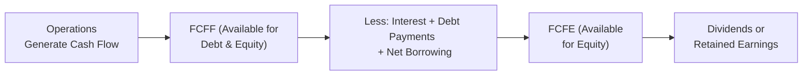

## 5.1 Dividend Discount and Free Cash Flow Models

This section explores two vital approaches to equity valuation: the Dividend Discount Model (DDM) and the Free Cash Flow (FCF) approach. We’ll walk through their core assumptions, modeling techniques, and applications for different types of companies. Along the way, I’ll share a few personal anecdotes (including the time I first tried to apply a naive DDM for a tech growth stock—yikes, not the best idea) and highlight common pitfalls. So, let’s jump right in.

### Valuation Foundations

Before we dig deeper, let’s remind ourselves—valuation is part art, part science, and part guesswork. In my opinion, the trick is to make the best assumptions you can and stay flexible. Anyway, here’s the high-level distinction you’ll want to keep front and center:

• Dividend Discount Model (DDM): Best for companies that pay predictable dividends or where dividends clearly capture a firm’s earning potential.  
• Free Cash Flow Models (FCFF or FCFE): Best for companies that don’t pay dividends or where dividends are not a reliable indicator of a firm’s long-term potential.

#### Why This Matters

In practice, you’ll come across companies like big Canadian banks—Royal Bank of Canada (RBC) springs to mind—that pay consistent dividends and plan to keep paying them, making DDM an excellent choice. But consider an innovative tech startup that reinvests nearly all its returns into growth. Dividends? Probably not happening soon, so an FCF-based approach might be more appropriate.

---

### The Dividend Discount Model

The Dividend Discount Model values a company by summing the present value of future dividends. The intuition is pretty straightforward: a stock is worth the sum of all distributions you, as a shareholder, expect to receive—discounted back to today.

#### Single-Stage (Gordon Growth Model)

The Single-Stage DDM—often called the Gordon Growth Model—makes a big assumption: that dividends grow at a constant rate forever. It’s like saying, “Well, RBC has paid dividends for decades, and I expect them to keep increasing at 3% every year forever.” That’s the gist.

The Gordon Growth formula is:


\text{Value of Equity} = \frac{D_1}{r - g}


where  
• \\( D_1 \\) is the expected dividend one year from now,  
• \\( r \\) is the required rate of return (think of it as the cost of equity), and  
• \\( g \\) is the constant growth rate.  

It’s simple and works nicely for mature, stable companies. But it can be way off if the growth pattern is more complex—like a biotech firm expecting 20% growth for the next five years, then maybe 4% for the rest of eternity.

#### Multi-Stage DDM

Because companies rarely have a constant growth rate from cradle to grave, we often use a multi-stage DDM. This approach divides a firm’s dividend growth into different phases. For example, the two-stage DDM might assume:

• Phase 1: High growth for 5 years (Project each year’s dividend individually.)  
• Phase 2: A smooth transition to a stable, long-term growth rate thereafter (Apply the Gordon Growth Model for the “terminal value” starting in year 6.)

A rough multi-stage formula goes like this:


\text{Value of Equity} 
= \sum_{t=1}^{n} \frac{D_t}{(1 + r)^t} 
+ \frac{\frac{D_{n+1}}{r - g_{\text{stable}}}}{(1+r)^n}


where \\( D_t \\) are the dividends in each year, \\( g_{\text{stable}} \\) is the stable long-term growth rate, and the fraction after the plus sign is the present value of the “terminal value.”

Honestly, it can be a bit tricky in real life, especially if your growth rates are all over the place. But it’s a powerful tool. Maybe you’re analyzing a Canadian bank with a strong brand, stable deposit base, and a robust track record for dividend increases. A two- or three-stage DDM might be an excellent fit—particularly if you expect higher dividend growth in the next few years followed by a stable, moderate rate.

---

### Free Cash Flow Models

Some companies just don’t pay dividends—think about big US tech firms that do massive share buybacks or funnel boatloads of cash into R&D. In such cases, the Dividend Discount Model is basically silent: if there are no dividends, does that mean the company is worthless? Of course not. Maybe they’re generating tons of free cash flow they choose to reinvest or use for share buybacks. That’s where the free cash flow approach comes in. We typically measure either:

• **Free Cash Flow to the Firm (FCFF)**: Cash flow available to all capital providers, including creditors and equity holders.  
• **Free Cash Flow to Equity (FCFE)**: Cash flow specifically for equity holders.

#### Free Cash Flow to the Firm (FCFF)

When valuing a company using FCFF, you discount these “firm-wide” cash flows using the Weighted Average Cost of Capital (WACC). The typical formula for FCFF is:


\text{FCFF} = \text{EBIT} \times (1 - t) 
+ \text{Depreciation and Amortization} 
- \text{Capital Expenditures} 
- \Delta \text{Working Capital}


Then we discount these back to the present using:


\text{Enterprise Value} 
= \sum_{t=1}^{n} \frac{\text{FCFF}_t}{(1 + \text{WACC})^t} 
+ \frac{\text{Terminal Value}}{(1 + \text{WACC})^n}


Finally, to get equity value, we subtract net debt from Enterprise Value (EV). If a company’s capital structure changes often, or if you want to be consistent in capturing the value for both debt and equity holders, FCFF is your go-to model.

#### Free Cash Flow to Equity (FCFE)

FCFE is the cash flow available after the firm has met all its obligations to creditors. So it goes directly to equity holders. We discount these equity cash flows at the required return on equity (\\( r_e \\)). The formula for calculating FCFE often looks like this:


\text{FCFE} = \text{Net Income} 
+ \text{Depreciation and Amortization} 
- \text{Capital Expenditures} 
- \Delta \text{Working Capital} 
+ \text{Net Borrowing}


And the present value formula for the equity is:


\text{Value of Equity} 
= \sum_{t=1}^{n} \frac{\text{FCFE}_t}{(1 + r_e)^t} 
+ \frac{\text{Terminal Value}}{(1 + r_e)^n}


When deciding between FCFF and FCFE, I think the big question is: Are you comfortable forecasting a company’s debt levels and interest payments? Also, do you have a stable capital structure? If you’re a giant conglomerate that leverages up and pays debt off frequently, forecasting FCFE may become more complex. So you pick the approach that’s simpler or more transparent for your specific scenario.

---

### Growth and Terminal Value Estimation

Here’s the part that trips up many folks: estimating growth. It’s common to hear marketing teams brag about a 20% growth rate next year. But is that sustainable for 50 years? Probably not. So, we break down the growth into a few phases and then assume a stable, low growth rate for the long haul.

**Terminal value** is the value of the business beyond the forecast period. Two main approaches stand out:

• **Perpetual Growth Method**: Essentially a Gordon Growth approach for the final year’s cash flow.  
• **Exit Multiple Method**: Use a valuation multiple (like EV/EBITDA) to estimate how the market might price the company in the final forecast year.

Small changes in that terminal growth assumption or exit multiple lead to surprisingly dramatic swings in your valuation. I’ve made the mistake of toggling from 3% to 3.5% perpetual growth in a spreadsheet and—bam—the final value soared by 15%. That kind of sensitivity is normal, so handle with care.

---

### Adjusting for US and Canadian Context

The US often sees large tech companies (like Apple, Alphabet, or meta-somethings) favor share buybacks rather than consistent dividends. So if you rely solely on the DDM, you might be missing half the story. The FCF approach is more insightful because it captures a firm’s total capacity to generate and allocate cash.

Now, let’s talk Canada. Canadian banks—think RBC, TD, or Scotiabank—are known for stable dividend policies, even during tough times. So a multi-stage DDM that captures an initial higher-growth period followed by stable dividend growth can be a sensible method. That said, a lot of analysis on the side also focuses on FCF to validate these valuations because interest rate changes do affect banks’ net interest margins and, eventually, their dividend capacity.

---

### Modeling Assumptions and Sensitivity

My old valuation professor used to say, “The model is only as good as the assumptions inside it.” And I can’t emphasize that enough—especially on the discount rate (\\( r \\)) and the growth rate (\\( g \\)). If you push the discount rate too low or the growth rate too high, you’ll come out with valuations that might feel too good to be true.

#### Sensitivity Analysis

Let’s say you’re analyzing RBC, forecasting dividends for the next five years, and then applying a 3% perpetual growth. Just see how the total valuation changes if you switch that to 2.5% or 3.5%. This is a quick test, but it helps you see how “fragile” your final valuation might be.

#### Scenario Analysis

Scenario analysis is a more robust approach. Construct multiple scenarios such as:

• **Best-Case**: The economy booms, RBC’s net interest margin expands, dividend payout grows faster.  
• **Base-Case**: Normal growth around 3%, stable discount rate, historically consistent margins.  
• **Worst-Case**: Economic slowdown, dividend growth stalls, discount rate rises.

Comparing the valuations in each case helps you gauge the risk. If RBC’s valuation plummets in your worst-case scenario, you know you have bigger downside than your base-case might suggest.

---

### Visual Representation

To keep things clear, let’s use a quick Mermaid diagram that shows how cash flows might get from the company’s operations to equity holders under the FCF approach.

In this diagram, we see how we move from operating cash flows to equity cash flows. Notice that if the company decides to pay dividends right away, that chunk is for shareholders. But if they decide to reinvest or pay down debt, it changes the company’s capital structure.

---

### A Quick Case Study in Plain Terms

Imagine you’re looking at a mid-sized Canadian manufacturing firm, MapleWorks Inc. Let’s assume:

• They pay small dividends but plan to ramp them up once the new manufacturing line hits capacity.  
• Growth is forecasted to be around 10% for three years, then 4% afterward.  
• The company is partly financed by some stable long-term debt.

Which approach would you choose? You can do a multi-stage DDM, factoring in the small dividends now with a bigger jump after year three, then stable growth. But if the nature of MapleWorks’ new manufacturing line might cause an earnings wave that outpaces their actual dividend distribution, an FCFF approach could capture the overall cash flow potential. In many real analyses, you do both: a multi-stage DDM to see how dividends might fuel returns, and an FCFF analysis to see if the total enterprise value supports the share price.

---

### Common Pitfalls

• **Overestimating Growth**: Being too optimistic can inflate valuations. A good rule of thumb is to tie your growth rate to broader economic indicators and the firm’s fundamentals (like retention ratio × ROE).  
• **Ignoring Capital Structure Changes**: If a company is set to issue more debt (or pay some off), it can drastically shift the cost of capital or net borrowing, messing up the FCFE forecast.  
• **Failure to Align Discount Rate and Cash Flow**: If you’re discounting FCFF, you use WACC. If your cash flow is FCFE, you use the required return on equity. Mixing those can produce nonsense figures.  
• **Terminal Value Oversimplification**: If that final perpetual growth rate is mis-specified, your entire valuation can swing dramatically. Keep it realistic.

---

### Conclusion and Exam-Oriented Tips

I’ve found that for exam success—and real-world competence—your best bet is to truly understand when each model is most relevant. On the CFA exam, they love giving you a scenario: “XYZ Tech is a small, high-growth firm that just started generating earnings; which model is best?” If they’re not paying dividends, you likely pivot toward an FCF-based approach. If the firm is stable, pays consistent dividends, or is structured like a large bank with a known payout ratio, you might lean on a DDM.

1. **Match the Model to the Firm**: If there’s no consistent history or foreseeability around dividends, use FCF.  
2. **Stay Realistic**: Keep growth rates in line with industry norms and the firm’s fundamental capacity.  
3. **Be Clear on the Terminal Value**: That last period can account for a huge portion of your valuation.  
4. **Don’t Mix and Match**: FCFF → WACC. FCFE → \\( r_e \\).  
5. **Practice Sensitivity Analyses**: A small tweak in discount rate sometimes changes your value significantly.  

---

### References and Further Reading

- Damodaran, A. (2012). “Investment Valuation: Tools and Techniques for Determining the Value of Any Asset.”  
- CFA Institute. (Current Edition). “Equity Investments” in the CFA Program Curriculum.  
- Koller, T., Goedhart, M., & Wessels, D. (2020). “Valuation: Measuring and Managing the Value of Companies.”  
- Bank of Canada Research:  
  [https://www.bankofcanada.ca/](https://www.bankofcanada.ca/)  
- Dr. Aswath Damodaran’s website at NYU Stern for FCFF/FCFE examples:  
  [http://pages.stern.nyu.edu/~adamodar/](http://pages.stern.nyu.edu/~adamodar/)  

---

## Test Your Knowledge: Dividend Discount and Free Cash Flow Models Quiz



### Which type of valuation approach is generally more suitable for a firm with a stable, long-standing dividend policy?

- [ ] FCFF model
- [ ] FCFE model
- [x] Dividend Discount Model
- [ ] Exit multiple approach

> **Explanation:** Firms with stable dividend policies are often best valued using the DDM, especially if dividends closely mirror the underlying cash flow generation.

### When using a multi-stage DDM, which of the following is most crucial in determining the terminal value?

- [ ] Capital expenditures in early years
- [ ] Retention ratio in high-growth phase
- [x] Long-term growth rate assumption
- [ ] Weighted Average Cost of Capital

> **Explanation:** The terminal value is highly sensitive to the assumed perpetual growth rate; a small change can significantly impact the final valuation.

### In valuing a high-growth tech firm that does not currently pay dividends, which of the following is generally the better choice?

- [ ] Gordon Growth Model
- [x] Free Cash Flow Model
- [ ] Liquidation value approach
- [ ] Multi-stage DDM

> **Explanation:** If no dividends are paid, the DDM does not capture the firm’s financial potential. An FCF model is usually more suitable.

### Which statement is true regarding the difference between FCFF and FCFE?

- [ ] FCFE includes capital expenditures, while FCFF excludes them.
- [ ] FCFF is discounted at the cost of equity, while FCFE is discounted at WACC.
- [x] FCFF is the cash flow available to both debt and equity holders, FCFE is available only to equity holders.
- [ ] FCFE always provides a higher valuation than FCFF.

> **Explanation:** FCFF is cash flow before servicing debt. FCFE is after debt obligations, hence available only to equity holders.

### If a firm’s dividends are expected to grow at 5% indefinitely and the required rate of return is 8%, applying the Gordon Growth Model, which formula correctly expresses the stock’s value?

- [x] V₀ = D₁ / (0.08 − 0.05)
- [ ] V₀ = D₀ × (1 − 0.05) / (0.08 − 0.05)
- [ ] V₀ = D₁ / (0.08 + 0.05)
- [ ] V₀ = D₀ × (1 − 0.08) / (0.05)

> **Explanation:** In the Gordon Growth Model, the denominator is (r − g), and you use the next dividend (D₁).

### What key input do you need in order to discount FCFF at the WACC?

- [ ] Residual income
- [x] After-tax cost of debt and cost of equity
- [ ] Dividend payout ratio
- [ ] Risk-free rate only

> **Explanation:** WACC involves a weighted combination of equity and debt costs (after-tax), so you need both to compute it.

### Which of the following might lead an analyst to select FCFE over FCFF?

- [x] The company’s capital structure is relatively stable, and net borrowing is easy to forecast.
- [ ] The company has unpredictable dividend payments.
- [ ] The firm is heavily leveraged, with uncertain debt repayment schedules.
- [ ] Dividend growth is constant.

> **Explanation:** FCFE can be more straightforward when predicting net borrowing is feasible and the capital structure is stable.

### In measuring terminal value using the exit multiple method, an analyst might use:

- [ ] Sum of all previous dividends
- [ ] Cost of equity minus the perpetual growth rate
- [x] An EV/EBITDA ratio or similar market multiple
- [ ] Retention ratio times return on equity

> **Explanation:** The exit multiple method applies a market-based multiple (e.g., EV/EBITDA) to estimate the final year’s terminal value.

### A primary weakness of the Dividend Discount Model is:

- [ ] It uses after-tax cost of debt in the calculation.
- [x] It assumes dividends adequately reflect the firm’s cash-generating potential.
- [ ] It is only applicable to banks and financial institutions.
- [ ] It focuses solely on constant growth opportunities.

> **Explanation:** DDM can understate value if the firm retains significant cash flows that are not distributed as dividends.

### True or False: If a valuation using the DDM produces the same result as one using an FCFF model, it implies the firm’s capital structure is irrelevant.

- [x] True
- [ ] False

> **Explanation:** In theory, if all assumptions are consistent and dividends fully reflect the firm’s true capacity, both approaches will converge, and the capital structure does not alter the total value. However, in practice, capital structure can affect projections and cash flows, so careful assumption alignment is critical.


