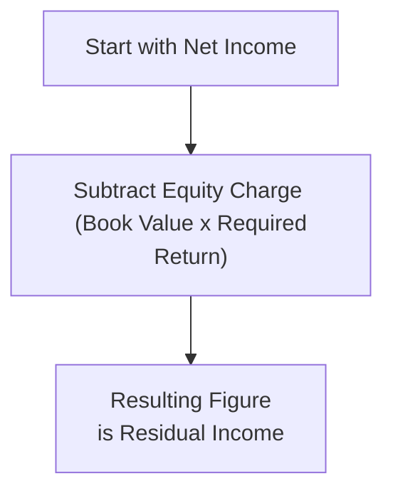
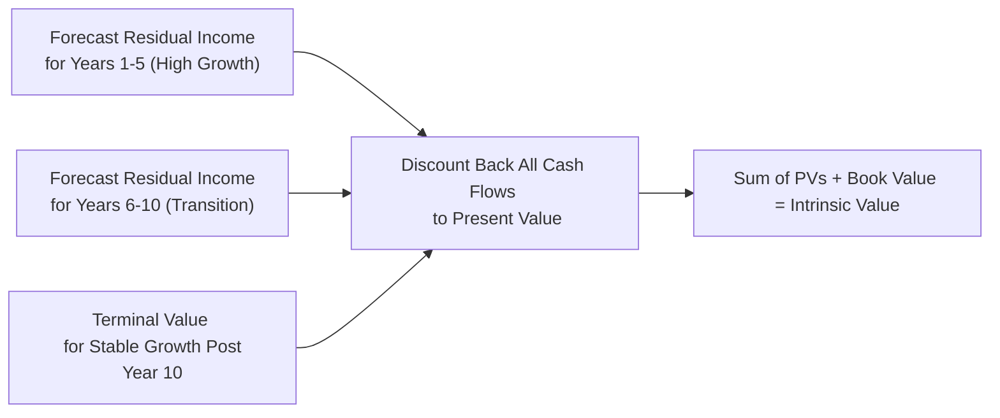

## 5.2 Residual Income Valuation and Applications

Sometimes, when I think back to my early days studying equity valuation, I recall scratching my head over how to incorporate a firm’s cost of equity into my analysis—my mentor would keep stressing, “Don’t forget the equity charge!” And that’s precisely what the Residual Income Model (RIM) does. It’s one of those valuation methods that ensures we explicitly account for the cost of equity in measuring economic profit. Even if a firm looks profitable by traditional accounting metrics, it might not truly be creating value unless it covers its required cost of equity capital.

Below is a detailed, but hopefully friendly, guide on residual income valuation. We’ll break down all the essentials—from core definitions and formulae, to single-stage vs. multi-stage considerations, to the interplay with IFRS/US GAAP differences. We’ll keep it slightly informal, but we’ll also dig into the deeper details that a CFA® Level II candidate (or anyone else, really) needs to know. Buckle up!

**Definition and Rationale**  
Residual income (RI) in finance is the amount by which a company’s earnings exceed (or fall short of) the minimum rate of return on its shareholders’ capital. Another term that’s often thrown around for residual income is “Economic Value Added” (EVA®), especially in consulting contexts—labeled “EVA” by certain consulting firms. At its core, RI isolates how effectively a firm’s returns compensate its equity holders. If net income surpasses the cost of equity—fantastic, we have a positive residual income. If not, well, that signals value destruction (and a negative RI).

While standard net income is an important metric, it doesn’t reflect the opportunity cost borne by equity investors. Traditional financial statements show net income after deducting the cost of debt financing (i.e., interest expense) but they do not deduct an equity charge. The RIM specifically addresses that gap:  
• Net Income  
− Equity Charge  
= Residual Income

Where Equity Charge = Book Value of Equity × Cost of Equity.

This might seem like a minor tweak, but from a valuation standpoint, it’s huge. It’s a more direct measure of *true economic profit*.

Below is a simple Mermaid diagram showing the flow of how residual income is derived from net income:

**Relationship to Accounting Profits**  
In many industries, net income is relatively stable; in others, not so much. But either way, net income can sometimes be deceiving if a company requires heavy equity financing. Companies that do not pay dividends all that frequently—or that rely on retained earnings for organic growth—won’t easily fit some of the more traditional valuation approaches, like the Dividend Discount Model (DDM). In these scenarios, focusing on residual income can yield more consistent estimates than trying to project free cash flows or guess dividend payouts.

Remember:  
• **Accounting profits** are recorded under accrual rules.  
• **Residual income** explicitly tags on the cost of equity, turning your analysis from plain profitability to *value creation*.

Thus, for a technology startup with spotty free cash flows (or an unconventional dividend policy), the RIM can prove more reliable if you have a decent line of sight into near-term earnings.  

**Single-Stage vs. Multi-Stage Residual Income Models**  
One of the best ways to break down residual income valuation is to consider how to handle growth. Some firms are in a stable, mature industry with modest (and fairly predictable) growth. Others might be in the wild, wide-open field of futuristic tech or biotech, with growth spurts or abrupt slowdowns. The RIM addresses these scenarios primarily through single-stage and multi-stage models.

• **Single-Stage Residual Income Model**  
  The single-stage variant assumes that residual income grows at a constant rate, g, forever. This approach is typically summarized as:
  
  (1)  Book Value at time zero  
  (2)  Plus the present value of all future residual incomes

Mathematically, the RIM’s basic valuation formula can be expressed as:


V_0 = B_0 + \sum_{t=1}^{\infty} \frac{RI_t}{(1 + r_e)^t},


where:  
– \\( B_0 \\) is the current book value of equity,  
– \\( r_e \\) is the cost of equity (required return on equity),  
– \\( RI_t \\) is the residual income in year \\( t \\).  

Under a constant residual income growth rate \\( g \\), a common simplifying approach is:


RI_t = RI_1 \times (1 + g)^{t-1},


assuming \\( RI_1 \\) is the residual income in the first forecast period.

But real talk: very few industries truly grow at a constant rate indefinitely. The single-stage approach might be a good approximation for mature utility companies or stable consumer products firms, but it might be a bit of a leap of faith for the next hot social media or biotech star.

• **Multi-Stage Residual Income Model**  
  For dynamic, fast-evolving firms, the multi-stage model segments growth (and often cost of equity, margins, or other elements) into distinct periods. For instance:  
  – Period 1: High growth (years 1–5)  
  – Period 2: Transition (years 6–10)  
  – Period 3: Stable growth from year 11 onward  

In each period, you forecast separate residual incomes, discount them back to the present, and then either apply a terminal value approach or shift to a simplified growth assumption from that point forward. If you’re analyzing a tech outfit in Vancouver that’s still in hyper-growth mode, you’ll definitely want more than a single-stage approach.

Here’s a small flowchart to illustrate multi-stage valuation in a simplified sense:

Exam-wise, multi-stage typically shows up in vignettes where a company’s growth rates are broken down by time period, or where the problem specifically mentions that your forecast horizon is a certain number of years. The trick is to remain consistent with your discount rate and assumptions across stages.

**Linking to Justified P/B**  
Another sweet outcome of using the RIM is that you can rearrange it to derive a “justified” price-to-book (P/B) ratio. Think about it: the residual income approach includes book value of equity plus the present value of future residual incomes. So your firm’s total intrinsic value often ends up as:


V_0 = B_0 + \text{(Present Value of RI)}


Divide both sides by \\( B_0 \\) (the current book value), and you get:


\frac{V_0}{B_0} = 1 + \frac{\text{Present Value of RI}}{B_0}.


Voilà, your *justified P/B*: an estimate of the P/B ratio that *should* hold in an efficient market if your forecasts are spot on. If a company’s predicted residual income is high, you’ll logically see a P/B greater than 1. This is also an excellent sense-check. If your model suggests a justified P/B of 3, but the actual share price is implying 1.5, you might see an undervalued situation—at least from the lens of the RIM.

**Adjusting for US and Canadian GAAP Differences**  
So, real-life twist: not all accounting standards define and treat intangibles, R&D, or other items the same way. If you compare a US-based firm using US GAAP with a Canadian firm under IFRS (or a US firm voluntarily reporting under IFRS for certain segments), watch out for these quirks:

• Under **US GAAP**, certain development costs might be expensed rather than capitalized, reducing net income in earlier years.  
• Under **IFRS** (common in Canada), certain development costs that meet specific criteria can be capitalized as intangible assets, thus altering both net income *and* the book value.  

The broader the gap between US GAAP and IFRS policies regarding intangible assets, the more you might need to restate or adjust for apples-to-apples comparisons. This can get especially relevant for a firm loaded with R&D, like a biotech or software darling out of Silicon Valley or Vancouver’s tech hub. Don’t be surprised to see significant differences in net income or equity if intangible treatment diverges. Residual income is sensitive to these differences because it relies heavily on accounting net income and book value as your starting points.

Ultimately, be mindful that the “equity charge” depends on the book value. If your book value is inflated due to capitalized R&D or intangible assets that might not truly produce future earnings, you could overestimate the firm’s value. Conversely, if intangible assets are underrepresented, you might end up with an undervaluation.

**Use Cases**  
The RIM is especially helpful for:  
• Firms that pay minimal or unpredictable dividends (e.g., a growing bank in Toronto that retains capital).  
• Companies with intangible-heavy financials where free cash flow can be skewed by short-term capital outlays (e.g., a media or entertainment company out of Los Angeles).  
• Financial institutions, where the concept of free cash flow can be somewhat ambiguous, but for which we typically can project net income and book value of equity more reliably than dividends.  
• Situations where you want a “value creation” perspective that clearly highlights whether net income surpasses the cost of equity.

**Practical Illustrative Example**  
Let’s say we have a fictional company, TechNova Inc., based in Vancouver. The following are simplified figures:

- Book value of equity (start of Year 1): CAD 300 million  
- Cost of equity, \\( r_e \\): 12%  
- Forecasted net income for Year 1: CAD 50 million  
- Expected growth rate in net income: 5% indefinitely  
- Dividend payout ratio: unpredictably small  

Year 1 residual income is:


RI_1 = \text{Net Income}_1 - (r_e \times B_0) = 50 - (0.12 \times 300) = 50 - 36 = 14


If we assume a single-stage constant growth rate \\( g = 5\% \\) in net income—and roughly in residual income as well—then:


RI_t = 14 \times (1.05)^{t-1}


And the present value of all future RI is:


\sum_{t=1}^{\infty} \frac{14 \times (1.05)^{t-1}}{(1.12)^t}.


We’d accumulate that, add the current book value of 300 million, and arrive at the intrinsic value. If we wanted a simplified formula with constant growth:


\text{Value of RI} = \frac{RI_1}{r_e - g} = \frac{14}{0.12 - 0.05} = \frac{14}{0.07} \approx 200


Hence, total equity value:


V_0 = B_0 + \frac{RI_1}{r_e - g} = 300 + 200 = 500


So you might arrive at a price of CAD 500 million if there’s only one class of shares and no other complexities. That’s obviously just a quick snapshot, but it demonstrates how you might do a single-stage RIM approach in practice.

**Common Pitfalls**  
1. **Overlooking Non-Recurring Items.** If your net income includes large one-off gains or losses, it can really warp your residual income.  
2. **Misestimating the Cost of Equity.** If you pick an unrealistically low or high cost of equity, your entire RIM calculation could spin out of control.  
3. **Inconsistent Growth Assumptions.** Residual income might not grow at the same rate as net income if the firm changes capital structure or invests heavily in intangible R&D.  
4. **Ignoring Book Value Adjustments.** IFRS vs. US GAAP differences or even changes in the firm’s intangible asset policy might require you to rework the book value.

**Strategies to Overcome Challenges**  
• **Scenario analysis:** Evaluate different growth rates, or different IFRS/GAAP treatments, to see how sensitive your residual income valuations are.  
• **Consistent and conservative assumptions:** For cost of equity, use a well-supported approach (like CAPM) anchored in current market data.  
• **Sourcing adjusted financial statements:** Some analysts create pro-forma statements that either expense or capitalize intangible development costs in a uniform manner.  
• **Watch transitions to stable-growth phases:** Precisely define when high growth ends and stable growth begins—especially in multi-stage models.

**Glossary**  
- **Residual Income (RI):** Net income minus the equity charge (book value of equity × cost of equity).  
- **Economic Value Added (EVA®):** A branded framework for measuring residual income, particularly popular among consulting professionals.  
- **Cost of Equity (\\( r_e \\)):** The required return that compensates equity investors for the risk they’re taking.  
- **Book Value of Equity:** The net worth of a company according to its accounting statements (total assets − total liabilities).  
- **Justified P/B:** A ratio calculated as \\( [V_0 / B_0] \\), effectively tying a firm’s fair price to its book value plus the present value of its future residual incomes.  
- **Equity Charge:** The notional “interest” on equity capital, i.e., \\( \text{book value} \times r_e \\).

**References and Further Reading**  
- Young, S. D., & O’Byrne, S. F. (2001). *EVA and Value-Based Management.*  
- CFA Institute. (Current Edition). *Equity Valuation: Concepts and Basic Tools.*  
- McKinsey & Company. (2020). *Valuation: Measuring and Managing the Value of Companies.*  
- PWC Canada on IFRS Guidance: [https://www.pwc.com/ca/en/services/ifrs.html](https://www.pwc.com/ca/en/services/ifrs.html)

**Final Exam Tips**  
1. **Understand the Core Formula**: Know that \\( V_0 = B_0 + \sum{\frac{RI_t}{(1+r_e)^t}} \\). This forms the basis of most exam questions.  
2. **Link to Accounting**: Watch for adjustments in net income or book value. If you see a mention of intangible assets being capitalized, see how it impacts the equation.  
3. **Terminal Value Approach**: For multi-stage models, clarify how residual income growth transitions to stable growth.  
4. **Be Cautious with the Cost of Equity**: If the question provides a CAPM scenario or an implied required return, apply it consistently in each time period.  
5. **Scan for Non-Recurring Items**: If a question references a big lawsuit settlement or an unusual event, consider how it might distort the RI in that year.  
6. **Don’t Confuse EVA® with Basic Residual Income**: Conceptually they’re the same (RI with specific branding), but the question might frame it differently.  
7. **Memorize the P/B Link**: Justified P/B = 1 + [PV of residual income / Book Value]. This can pop up in exam-style questions, especially in ratio analysis vignettes.  
8. **Practice**: The best way to master RIM is to do a handful of multi-stage residual income problems, especially under time constraints.  

Below, you’ll find a quiz to test and reinforce your understanding of the concepts, along with immediate explanations for each answer. Good luck!

## Test Your Knowledge: Residual Income Valuation Quiz



### Which statement best describes the concept of residual income?  
- [ ] It is a measure of total assets minus total liabilities.  
- [x] It is net income minus an equity charge representing the cost of equity.  
- [ ] It is the difference between operating income and inventory costs.  
- [ ] It represents the realized capital gains minus transaction costs.  

> **Explanation:** Residual income specifically accounts for the cost of equity by subtracting the equity charge from net income, ensuring that the returns on equity exceed the required rate of return.

### When is the Residual Income Model most useful compared to the Dividend Discount Model?  
- [ ] When a firm has perfectly stable dividend growth.  
- [ ] When a firm’s dividend policy grows at the same rate as earnings.  
- [x] When a firm’s dividends are irregular or minimal, but its accounting earnings are more predictable.  
- [ ] When a firm pays out all its earnings as dividends every year.  

> **Explanation:** The RI model becomes especially beneficial when dividends are either nonexistent or unpredictable, but you can still forecast net income and book value reliably.

### In a single-stage residual income model with constant growth, the total equity value is generally equal to:  
- [ ] Book value of equity minus present value of future residual incomes.  
- [ ] Free cash flow plus residual income.  
- [x] Current book value of equity plus the present value of future residual incomes.  
- [ ] Current book value of equity times the retention rate.  

> **Explanation:** The RIM formula typically combines the existing book value of equity with the discounted residual income stream.

### Which of the following best represents the equity charge in a residual income model?  
- [ ] Required return on equity times dividends paid.  
- [x] Required return on equity times the book value of equity.  
- [ ] Required return on equity times the market capitalization.  
- [ ] Required return on equity times cash flow from operations.  

> **Explanation:** The equity charge reflects the cost of using shareholder capital and is computed by multiplying the book value of equity by the required rate of return on equity.

### Which factor is most likely to cause a difference in reported net income and book value between US GAAP and IFRS for the same firm?  
- [ ] Different rules for classifying current vs. long-term debt.  
- [ ] Varied timing for recognizing cash inflows.  
- [x] Capitalization of certain development costs under IFRS versus expensing under US GAAP.  
- [ ] Restrictions on declaring dividends in certain jurisdictions.  

> **Explanation:** IFRS allows specific development costs to be capitalized, whereas US GAAP typically requires expensing. This difference can significantly alter both net income and the book value of equity.

### A company’s single-stage residual income valuation suggests a justified P/B ratio of 2.0. If the firm’s actual market P/B ratio is 1.2, which conclusion is best supported by the model?  
- [x] The company is undervalued according to the RI model.  
- [ ] The company is overvalued according to the RI model.  
- [ ] The company’s net income is too high for the residual income approach.  
- [ ] The company’s cost of equity is lower than the market average.  

> **Explanation:** A justified P/B that is higher than the market-based P/B implies that the firm might be undervalued from the perspective of the RIM.

### Why might the multi-stage residual income model be critical for valuing a high-growth tech startup?  
- [ ] Because the cost of equity is typically negative for startups.  
- [x] Because the growth of residual income is unlikely to be constant over the firm’s life cycle.  
- [ ] Because net income is always zero in the early years, making the single-stage model irrelevant.  
- [ ] Because the cost of equity automatically adjusts to zero at the stable growth phase.  

> **Explanation:** High-growth startups often experience multiple phases—initial high growth, a transition period, and then a more stable phase. A multi-stage model captures these changes more accurately.

### Which of the following steps is least likely to be part of a multi-stage residual income valuation?  
- [ ] Forecasting phased growth rates for different periods.  
- [ ] Calculating residual income in each phase and discounting to present value.  
- [ ] Estimating a terminal value at the beginning of stable growth.  
- [x] Treating the growth rate and the cost of equity as identical across all valuation periods.  

> **Explanation:** A hallmark of the multi-stage method is that growth rates and possibly cost of equity or margins can vary across different phases. Treating them identically defeats the purpose.

### The fundamental formula for the Residual Income Model can be expressed as:  
- [ ] V₀ = D₀ + (FCF / (r - g)).  
- [x] V₀ = B₀ + Σ(RIₜ / (1 + rₑ)ᵗ).  
- [ ] V₀ = E₀ × (1 + g) / (r - g).  
- [ ] V₀ = (ROE - rₑ) × B₀ / (1 + g).  

> **Explanation:** The standard RIM formula states that the firm’s current value is equal to the current book value of equity plus the present value of all future residual income streams.

### For a given period, if a company’s net income is exactly equal to its equity charge, the residual income for that period is:  
- [x] Zero  
- [ ] Positive  
- [ ] Negative  
- [ ] Indeterminate  

> **Explanation:** Residual income = Net income − Equity charge. If they match, the firm is effectively breaking even on the cost of equity, leading to zero residual income.


