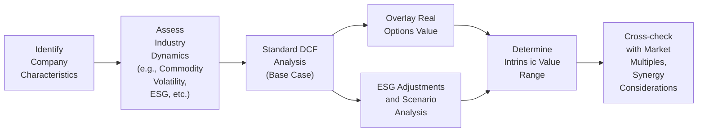

## 5.5 Specialized and Advanced Valuation Perspectives

Valuation is never a one-size-fits-all endeavor. It’s a bit like trying to tailor a suit: you want to consider the unique measurements, preferences, and style of each individual. In much the same way, specialized and advanced valuation perspectives require a deeper look at industry specifics, embedded strategic options (like real options), and cross-border or ESG considerations. This chapter explores some of these unique scenarios, emphasizing Canadian and U.S. markets for context. Let’s jump right in.

---

## Valuing Resource-Sector Companies (Energy, Mining)

Resource-sector companies—such as oil & gas producers or mining operations—often present intriguing valuation challenges. At times, you’re not just valuing current production; you’re grappling with how long that production might last (reserve life), how costly future environmental or reclamation obligations might be, and how volatile future prices can get. I still remember my early days analyzing a Canadian junior oil producer in Alberta. I found the standard DCF just didn’t capture enough about commodity price volatility and reserve estimates. I ended up building all these scenario analyses for high-, mid-, and low-price scenarios—and that was just step one!

### Commodity Price Forecasts

Commodity prices can swing dramatically due to global supply-demand imbalances, geopolitical risks, and even currency fluctuations (think of how a strong USD can pressure commodity prices). When valuing a resource company, analysts often consider:

• Consensus price forecasts from reputable sources (e.g., EIA for energy, World Bank for broader commodities).  
• The company’s hedging strategy (e.g., do they lock in future prices through forward contracts?).  
• Macro trends: technological changes (like fracking in shale oil), changing environmental regulations, and demand shifts (e.g., the move from coal to renewables).

Because these firms are heavily reliant on the sale of these commodities, even small changes in the assumed commodity price can drastically affect projected future revenues. Sometimes, analysts get fancy and incorporate Monte Carlo simulations to better understand the distribution of potential outcomes for commodity prices.

### Reserve Estimations

When you’re examining an oil & gas or mining company, you’ll want to pay attention to independent reserve reports. These show you something like “Proven,” “Probable,” and “Possible” reserves:

• Proven (1P): At least a 90% probability of economic extraction.  
• Probable (2P): At least a 50% probability.  
• Possible (3P): Substantial resource uncertainty—less than 50% probability.

To incorporate reserves into your valuation, you might discount future output from these reserves by the likelihood of extraction. For example, you might heavily weight the proven reserves in your base-case valuation while layering probable or possible expansions as a kind of upside scenario or real option. Also, watch out for the resource’s location, quality, and extraction cost profile—these factors determine if a company’s “barrels in the ground” or “ounces in the ground” are economically viable.

### Risk Considerations: Commodity Volatility, Environmental Regulations, and CAPEX

Analysts must carefully weigh ongoing operating expenses and any large capital expenditures required down the line, especially for major facilities or expansions. At the same time, new environmental regulations can shift the cost structure—like the introduction of carbon taxes or stricter mining reclamation requirements. This can also be quite different in different provinces or states in Canada and the U.S. for an oil sands project in Alberta versus a shale operation in Texas.

### Simple Example—Oil Sands Producer

Let’s say we have NorthernTru Oil Sands, operating in Alberta. They pump out 50,000 barrels per day at a break-even cost of USD 45/barrel (including sustaining CAPEX). We forecast an average WTI price of USD 65/barrel over the next five years. Considering changes in exchange rates and a moderate royalty regime, we arrive at a net revenue per barrel of around USD 18 (i.e., 65 less cost of 45, minus additional fees). Then, we do a discount factor to account for any uncertainties (like a spike in regulations or a drop in demand for heavy oil). The final step is a standard DCF, although it’s typically scenario-based to reflect that significant volatility.

Anyway—you see how a simple shift in that WTI forecast from USD 65 to USD 50 quickly diminishes the entire proposition. Resource plays: they’re high risk, high reward.

---

## Real Options in Equity Valuation

Real options are like secret weapons hidden in a company’s strategic arsenal. They reflect the managerial flexibility to change operational strategies if situations evolve. This is particularly relevant for resource firms that can “restart or shut down a mine” when prices decline or “expand production” if demand skyrockets. However, real options aren’t limited to mining or energy. Maybe a tech startup invests in R&D that could lead to a major product pivot. Or a pharmaceutical company invests in early-stage research that may or may not pay off.

### Identifying Real Options

Common examples include:

• The option to expand: If a project looks really promising, invest more capital.  
• The option to abandon: If a venture is failing, cut your losses.  
• The option to delay: Wait to see how market conditions evolve before committing resources.  
• The option to switch: Maybe you can switch your production inputs or outputs to respond to price changes.

### Approaches to Valuing Real Options

A standard net present value (NPV) approach may understate value by failing to capture embedded flexibility. One approach is to overlay an option valuation (e.g., the Black–Scholes model) on top of scenario-based cash flow forecasts. Another method is a binomial tree approach that models different states of the world and how management might respond.

Let’s say you have a project with an initial outlay of CAD 10 million. There’s a 50% chance the market evolves favorably, driving a high NPV of CAD 15 million, and a 50% chance the NPV is just CAD 5 million. The ability to “abandon” the project if it underperforms can effectively keep you from facing the worst outcomes. So you’d discount the negative scenario more because you might not even proceed or you might scale it back.

### Quick KaTeX Example

Below is a simplified formula for the value of an expansion option:


\text{Option to Expand Value} = \max\bigl(\text{Expansion NPV} - \text{Cost of Expansion}, 0\bigr)


In a real business scenario, we’d factor in probabilities and discount each outcome. But at least we see how future expansion can create an “option-like payoff” that standard DCF might miss.

---

## ESG Integration and Sustainability

Now more than ever, companies face pressure to not only generate returns but also operate responsibly. ESG—Environmental, Social, and Governance—factors increasingly show up in both single-stock analysis and entire portfolio strategies. Investors might worry about a pipeline’s leak risk. Or they might weigh a utility’s carbon footprint. A large part of this is driven by regulatory changes, shifts in consumer preferences, or even employee satisfaction metrics that could affect productivity.

### Environmental Factors: Carbon Footprint and Beyond

Take a Canadian pipeline company. They might be subject to stringent environmental assessments, particularly if new expansions cross sensitive areas. Analysts might incorporate an extra risk premium to reflect the possibility of delays or cost overruns due to environmental pushbacks. Similarly in the U.S., new federal or state policies can expedite or hamper expansions.

### Social Factors: Community Relations, Reputation

When local communities aren’t on board, resource companies can face project shutdowns—or at least big delays. This “social license to operate” has real economic implications. If you think that’s all intangible, guess again. We’ve seen large projects (e.g., pipelines, major mines) stall or get canceled after years of investment because of strong community opposition. Try explaining that to your DCF assumptions if you never factored in such social risks.

### Governance Factors: Board Independence and Executive Incentives

Governance might sound less glamorous, but it includes whether boards are truly independent, whether there’s a robust system of checks and balances, and how executive bonuses are structured. Weak governance can lead to corporate scandal or misguided acquisitions. Conversely, strong governance can safeguard minority investors and ensure a more stable capital allocation strategy.

### Incorporating ESG into Valuation

Analysts might adjust discount rates (e.g., an extra risk premium for poor environmental track records), or they might adjust projected cash flows for potential “green” opportunities (like renewable energy expansions) or for possible penalties (like carbon taxes). From a purely financial standpoint, you might classify these elements under scenario analysis. For instance, a “high-regulation scenario” could hamper future growth and increase operating costs, while a “low-regulation scenario” might have the opposite effect.

---

## Cross-Border Listings and ADR/Interlisted Shares

Many Canadian companies list on the Toronto Stock Exchange (TSX) and a U.S. exchange like NYSE or NASDAQ. These interlistings can provide access to a broader pool of investors and potentially enhance liquidity. But they also raise a couple of issues from a valuation perspective:

### Exchange Rate Considerations

Some folks simply convert all cash flows to the “home currency” of the Company’s financial statements. But when you’re dealing with multiples or discount rates from a U.S. perspective, you might have to factor in currency risk. For instance, if a Canadian firm’s revenues are largely denominated in U.S. dollars, that might actually reduce currency risk relative to a purely domestic company.

### Difference in Required Returns

Investors in the U.S. might demand a higher or lower required return depending on their perception of risk in the Canadian market, or vice versa. If you’re using the Capital Asset Pricing Model (CAPM), for example, you might factor in a country risk premium or set a different risk-free rate. There could also be differences in listing requirements that affect corporate governance, disclosure standards, or fees.

### ADRs (American Depositary Receipts)

ADRs are certificates traded in the U.S. that represent ownership in foreign shares. They’re usually denominated in U.S. dollars, so from an American investor’s perspective, you’re somewhat shielded from the complexities of foreign brokerage. However, liquidity might be narrower in the ADR compared to the local listing, which can impact the cost of capital. Also, certain corporate events (like voting privileges) might be more limited for ADR holders, which can affect perceived value.

---

## Synergy Valuation and M&A

Mergers and acquisitions (M&A) often revolve around synergy: the idea that two combined companies can do more (or do it more efficiently) than they could separately. This is particularly relevant if, say, a U.S. firm acquires a Canadian target that has strategic resources or vice versa. Synergies can be cost-based (economies of scale, better supply deals) or revenue-based (cross-selling, new markets).

### Modeling Synergies

• Identify synergy sources: Is it duplication of administrative overhead that can be eliminated? Can you cross-sell certain products in new markets?  
• Estimate and phase in synergy: Rarely do you realize 100% synergy in year one. Usually, you ramp up.  
• Include synergy costs: Restructuring is not free—think severance, integration costs, etc.

Once you have synergy estimates, you incorporate them into your pro forma financials. Then you discount them, potentially with a higher discount rate due to integration risk. Cross-border deals might have additional exchange rate risk or political risk. Also, don’t forget potential double taxation or differences in how intangible assets get reported under IFRS vs. U.S. GAAP.

### Numeric Example—Simple Synergy

Suppose a U.S. industrial firm (Acquirer Inc.) acquires a Canadian competitor (Target Co.). Acquirer Inc. projects it can generate synergy within 2 years by consolidating distribution centers. They estimate annual synergy savings of CAD 10 million, which grows at 2% yearly. Meanwhile, synergy integration costs are estimated at CAD 5 million in year 1 only. If the discount rate for synergy is 10%, we can do a quick synergy valuation:

• Present Value of Perpetual Synergy (starting year 1, ignoring the initial cost)  

\text{PV}_{\text{synergy}} = \frac{10}{0.10 - 0.02} = \frac{10}{0.08} = 125 \text{ million CAD}


• But we have synergy integration cost of 5 million in year 1, so the net synergy becomes 125 – 5 discounted by one year. If that cost is immediate, the net synergy is slightly less than 125, depending on the exact timing.

Yes, it’s a simplistic example, but you get the point: synergy can add big value if done right. But it can also evaporate if management overestimates synergy or fails in integration.

---

## Quick Mermaid Diagram: Valuation Decision Flow

Below is a simple diagram that shows how an analyst might integrate some of these specialized factors—real options, ESG, synergy—into a broad equity valuation approach.

Sometimes you run the standard DCF first, recognize potential expansions or risk factors, and then adjust the overall valuation with real options or synergy estimates. ESG might factor into discount rates or scenario weights. The final step is usually reconciling it all into a plausible valuation range.

---

## Glossary

• **Resource Valuation Metrics**: Terms like Net Asset Value (NAV) or Reserve Life Index (RLI), commonly used in mining/oil & gas to assess the economic life and potential of reserves.  
• **Real Option**: A choice or flexibility embedded in a project, giving managers the right (but not the obligation) to take certain actions in the future.  
• **ESG (Environmental, Social, Governance)**: A set of criteria used by investors to evaluate a company’s impact and sustainability practices.  
• **Interlisted Shares**: Company shares that trade on multiple stock exchanges in different countries.  
• **ADR (American Depositary Receipt)**: A negotiable certificate issued by a U.S. bank representing shares in a foreign stock. Typically denominated in USD and traded on U.S. exchanges.

---

## Common Pitfalls and Best Practices

• **Pitfall**: Using static commodity prices in resource valuations without sensitivity analysis.  
  **Best Practice**: Develop multiple scenarios for commodity price forecasts; consider using simulation to capture tail risks.  

• **Pitfall**: Ignoring the intangible value of managerial flexibility.  
  **Best Practice**: Identify potential real options, especially in early-stage or highly cyclical industries.  

• **Pitfall**: Treating ESG as a mere compliance checkbox.  
  **Best Practice**: Evaluate material ESG factors that can impact cost of capital or hamper growth, and reflect them in your analysis.  

• **Pitfall**: Overlooking cross-border tax complications or currency risk in interlisted valuations.  
  **Best Practice**: Align currency with the underlying cash flows, factor in any incremental risk premiums, and double-check differences in tax regimes.  

• **Pitfall**: Overestimated synergy in M&A deals.  
  **Best Practice**: Use conservative synergy projections, model synergy ramp-up over time, and incorporate integration costs.

---

## Final Exam Tips

1. **Link Each Specialization to Core Concepts**: A solid DCF is still the foundation. Know how to adapt it to resource-based companies, real options, or synergy projections.  
2. **Master Scenarios**: The CFA® Level II often tests your ability to handle risk. Practice building scenario analyses for commodity pricing or synergy outcomes.  
3. **Focus on Key Inputs**: Be ready for questions on how you derive discount rates, especially in cross-border settings.  
4. **Brush Up on ESG**: Remember how environmental or social risks might alter discount rates or terminal values.  
5. **Stay Confident, Stay Curious**: If a question seems tricky, try to identify the key input or assumption the exam is testing—like certain synergy or real-option payoff expansions.

---

## References and Further Reading

- Trigeorgis, L. (1996). “Real Options: Managerial Flexibility and Strategy in Resource Allocation.”  
- S&P Global Market Intelligence. (n.d.). “ESG & Sustainability Analysis.”  
- Canadian Institute of Mining (CIM) guidelines: [https://mrmr.cim.org/en/](https://mrmr.cim.org/en/)  
- CFA Institute. (Current Edition). “Advanced Topics in Equity Valuation” readings.

---

## Test Your Knowledge: Specialized and Advanced Valuation Perspectives



### Which of the following is a primary reason commodity price forecasts are critical in valuing an oil and gas producer?

- [ ] Because the discount rate is irrelevant in resource-sector valuations.
- [x] Because a small change in commodity price assumptions can dramatically alter projected cash flows.
- [ ] Because oil and gas producers never hedge against commodity price fluctuations.
- [ ] Because environmental regulations are unrelated to production volumes.

> **Explanation:** Even minor changes in commodity price assumptions can significantly affect revenues, thus having an outsized impact on the intrinsic valuation of resource-based companies.  

### Which of the following best describes a real option?

- [ ] A financial derivative on the S&P 500.
- [ ] A perpetual right to receive dividends without cost.
- [x] A managerial choice embedded in a project, allowing flexibility based on future conditions.
- [ ] A fixed investment that has no future variability in returns.

> **Explanation:** Real options embody managerial flexibility to expand, abandon, delay, or switch a project’s course of action, adding strategic value beyond standard DCF estimates.  

### How does ESG integration typically impact the valuation of energy companies facing new regulatory proposals?

- [x] Analysts might apply higher discount rates or adjust future cash flows to reflect potential cost increases.
- [ ] ESG factors are always irrelevant to cost structures for energy businesses.
- [ ] The impact of regulatory proposals is never captured in a DCF.
- [ ] It typically lowers commodity prices.

> **Explanation:** When new regulations loom, environmental compliance increases operating costs. This risk can show up through higher discount rates (reflecting uncertainty) or explicitly reduced cash flows.  

### In a cross-border valuation involving a Canadian company interlisted on the TSX and NASDAQ, why might analysts incorporate a currency risk premium?

- [ ] A currency risk premium is only necessary for domestic valuations.
- [x] Investors require compensation for potential exchange rate fluctuations, especially if cash flows occur in multiple currencies.
- [ ] Currency risk has no effect when a company is interlisted.
- [ ] The currency risk only affects dividend forecasts, not net income.

> **Explanation:** When operations span different currencies, forecasted cash flows can fluctuate due to exchange rates, warranting an additional risk premium in the discount rate.  

### Which aspect is most critical for synergy valuation in a cross-border M&A deal?

- [ ] Liquidity ratios of both companies.
- [x] Identifying cost and revenue synergies while factoring in integration costs and timing.
- [ ] The price of gold futures.
- [x] The use of IFRS vs. U.S. GAAP for synergy recognition.

> **Explanation:** Synergy valuation involves careful assessment of how cost savings and revenue boosts will be realized over time, including necessary integration costs and the effect of different accounting standards.  

### What is a common pitfall when valuing resource companies?

- [x] Using static commodity price assumptions without testing multiple scenarios.
- [ ] Including environmental reclamation liabilities in free cash flow calculations.
- [ ] Evaluating reserve reports from independent consultants.
- [ ] Using corporate bond yields for discount rates.

> **Explanation:** A major pitfall is ignoring the sensitivity to commodity price fluctuations. Scenario and sensitivity analyses are crucial for resource-based valuations.  

### Why might an analyst adjust terminal value estimates to incorporate ESG factors?

- [x] Potential higher regulatory or reputational costs can reduce long-term growth potential.
- [ ] Terminal value is never affected by ESG considerations.
- [x] ESG factors only impact the discount rate, not terminal value.
- [ ] ESG adjustments only apply to intangible assets.

> **Explanation:** Regulatory constraints, carbon taxes, or reputational setbacks may depress long-term profitability, thus lowering the terminal value.  

### In resource valuation, how do “proven” reserves typically differ from “probable” reserves?

- [x] Proven reserves have a higher likelihood of economic extraction.
- [ ] Probable reserves have zero extraction risk.
- [ ] Probable reserves are always of better quality.
- [ ] Both proven and probable have the same extraction probabilities.

> **Explanation:** Proven (1P) reserves are those with at least a 90% chance of extraction, while “probable” represents a lower likelihood (often 50%).  

### What is a key benefit of modeling real options in a valuation?

- [x] It captures the additional value of managerial flexibility under uncertainty.
- [ ] It eliminates the need for fundamental DCF analysis.
- [ ] It guarantees a higher valuation than traditional methods.
- [ ] It replaces all forms of risk evaluation.

> **Explanation:** Real options allow you to capture value from future decisions (e.g., expand, abandon) that standard DCF approaches may overlook.  

### If a valuation question states, “A firm has the option to expand capacity if demand is high,” this best describes a:

- [x] True
- [ ] False

> **Explanation:** The option to expand capacity if favorable conditions arise is a textbook example of a real option.  


