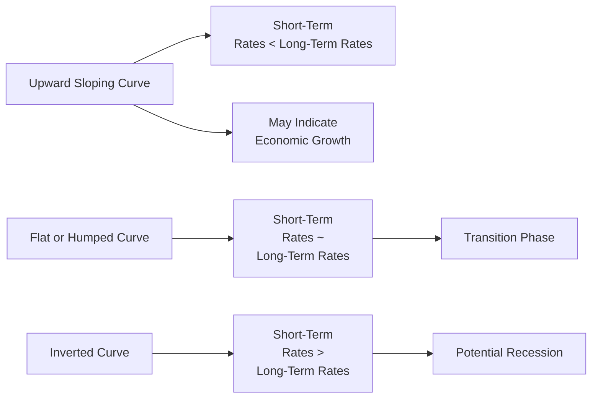

## 6.1 Term Structure Analysis and Yield Curve Modeling

This discussion delves deep into the heart of fixed income valuation and analysis. We’ll see how the shape of the yield curve reveals the market’s story about future interest rates, economic conditions, and investor preferences. Frankly, I recall one of my earliest mistakes (back in the day!) was to look at the yield curve only superficially, missing how nuance in the slope or curvature can signal shifts in monetary policy or inflation expectations. So let’s walk through each major area, from fundamental definitions to advanced modeling, and by the end, you’ll be able to talk yield curves like you’ve been living in the fixed-income world for decades.

---

### Introduction

The term structure of interest rates is the relationship between yields (or interest rates) and different maturities. A graph of this relationship is called the yield curve, which helps us understand how the market is pricing interest rate risk over time. It influences everything from corporate decision-making on issuing debt to your neighbor’s mortgage interest rate. When a central bank like the Federal Reserve (in the United States) or the Bank of Canada changes monetary policy, it often shows up in the shape and position of the yield curve almost immediately.

In practice, we talk about different rates:

• Spot Rate — for a zero-coupon bond or single cash flow at a certain maturity.  
• Forward Rate — implied rate that starts in the future and pertains to a future period.  
• Yield to Maturity (YTM) — the single discount rate that, when applied to all bond cash flows, equates the bond’s present value with its market price.

Understanding these concepts is vital to everything else we talk about in yield curve modeling.

---

### Spot Rates, Forward Rates, and Yield to Maturity

Let’s start with some short definitions, in plain language:

• A spot rate is basically the yield for a single future cash flow—like a zero-coupon bond—happening at a specific time. If you see a “2-year spot rate,” it’s the yield on a zero-coupon bond that matures in 2 years.  

• A forward rate is essentially a specific interest rate agreed upon now for a loan or investment that begins at a future date. For instance, you might see a “1-year forward rate 2 years from now,” often labeled as f(2,3), where the notation means the rate from time 2 to time 3.  

• The yield to maturity of a coupon-paying bond is the constant discount rate that, when applied to every coupon and the final principal repayment, makes the sum of those discounted cash flows exactly equal to the bond’s current price.

In formula form, if a bond pays an annual coupon C and final principal M (par value) after T years, and if YTM is denoted by y, then the price P of the bond is:


P = \frac{C}{1+y} + \frac{C}{(1+y)^2} + \dots + \frac{C + M}{(1+y)^T}.


Things get trickier once you start using different spot rates for each coupon payment. In more advanced settings—and definitely for exam-level mastery—you’ll discount each coupon by the applicable spot rate that corresponds to the exact maturity of that cash flow. That might look like:


P = \frac{C}{(1 + S_1)^1} + \frac{C}{(1 + S_2)^2} + \dots + \frac{C + M}{(1 + S_T)^T},


where \\(S_t\\) is the spot rate for maturity \\(t\\). This approach is more precise because it incorporates the reality that each future coupon is subject to its own interest rate for that horizon.

---

### Bootstrapping the Zero-Coupon (Spot) Curve

Bootstrap is more than just a fancy term. In finance, it describes the iterative process we use to derive spot rates from coupon bond prices. Let’s say you have a couple of treasury bonds: a 1-year, a 2-year, a 3-year, etc. Each has a known price, coupon rate, and maturity. You can use the price of the shortest bond (often a one-year instrument) to solve for the 1-year spot rate. Then, the process “chains” along to solve for the 2-year spot rate, using the fact that you now know the 1-year spot rate and so forth.

Hypothetically:

1. If a 1-year bond has price P₁ and maturity value 1 (assuming par is 1 for simplicity) plus coupon c₁, you solve for \\(S_1\\).  
2. Next, take the 2-year bond with price P₂, and you discount its first coupon by \\(S_1\\) and the final coupon plus principal by \\(S_2\\). Solve for \\(S_2\\).  
3. Continue iteratively for each additional maturity.  

A cautionary note: if you work in an illiquid bond market or have pricing anomalies, the “bootstrapped” curve might look bumpy or contain strange rates that don’t reflect a perfect theoretical shape. Sometimes you have to do a bit of smoothing or rely on other interpolation techniques. But for exam purposes, know the conceptual iterative approach.

---

### Yield Curve Theories

When pondering the yield curve, we always want to interpret it. Why does it shape upward, downward, or remain flat? Multiple theories attempt to explain this phenomenon:

• Pure Expectations Theory: The forward rates will be the market’s unbiased forecast of future spot rates. In other words, if you see a 2-year bond yield and you know the 1-year yield, the implied forward rate for year 2 is simply the market’s best guess of the 1-year rate, one year from now.

• Liquidity Preference Theory: Investors prefer short-term investments over long-term because shorter maturities are less sensitive to rising interest rates and other uncertainties. Therefore, to invest in a 10-year bond rather than a 2-year bond, investors demand a “liquidity premium.” This typically results in an upward slope, even if no change in interest rates is expected.

• Market Segmentation Theory: The yield curve is determined by supply and demand in distinct maturity segments or “buckets.” Various investors—like pension funds that might need long-dated liabilities, or bank treasury desks that look for short maturities—operate in their own space, causing yields to be set somewhat independently within each segment. 

Personally, I’ve found that no single theory perfectly describes the curve in all markets at all times. But on the exam, you want to know how each theory works and the rationale behind each shape.

---

### Interest Rate Expectations and Yield Curve Shifts

Interest rate expectations, changing monetary policy, and inflation outlook can shift or twist the yield curve:

• A Steepening Curve means that long-term yields are rising relative to short-term yields (or short yields are falling more than long yields). This might show confidence in future growth, or concerns about inflation.  
• A Flattening Curve means short-term and long-term yields start to converge—often interpreted as caution or a shift in monetary policy that’s compressing interest rates across maturities.  
• An Inverted Curve is where the short-term yields are higher than the long-term yields. It can be a canary in the coal mine for a potential recession. I still recall the uneasy feeling in the markets the first time I observed a major yield curve inversion. Everyone was on alert for an economic downturn (and guess what? A slowdown usually follows).

---

### Key Rate Duration and Partial Duration Analysis

To manage the risk associated with yield curve movements, we sometimes measure duration not just at one overall rate but at specific maturities. This is known as Key Rate Duration (KRD). The idea is: how sensitive is a bond’s price if the 2-year part of the curve moves by 1 basis point, holding everything else constant? Or the 5-year part? Or the 10-year part?

• Key Rate Duration (KRD): we measure changes in bond price relative to a 1 bps change in yield at key maturities—often the on-the-run treasury maturities (e.g., 3-month, 2-year, 5-year, 10-year).  

• Partial Duration: similar concept, but it might measure the effect of a yield change in a smaller subrange of the curve rather than distinct key maturities.

These measures help your risk management approach if, for example, you suspect the short end of the yield curve might spike due to central bank tightening, but you’re less worried about the long end. You can estimate exposure to that segment and hedge or adjust positioning accordingly.

---

### Using Yield Curve Models for Portfolio Strategies

Once you have a sense of how the yield curve might evolve, you can deploy strategies:

• Bullet Strategy: Concentrates bond maturities around a specific point, say around the 5-year area. This might outperform if you predict the 5-year yield will decline more than other segments or if you have a specific liability to match around that horizon.  

• Barbell Strategy: Splits allocations between short-term and long-term bonds—like some in 2-year maturities and some in 10-year maturities. If the yield curve flattens, this might work better than a bullet.  

• Ladder (or “laddered” portfolio): Staggers maturities (e.g., 1-year, 2-year, 3-year, 4-year, 5-year) so that each year a portion of the portfolio matures. This helps manage reinvestment risk, providing a systematic way to reinvest and keep average duration stable.  

• Riding the Yield Curve (Rolling Down): If the yield curve is upward sloping and you expect it to remain stable for a while, buying a bond longer than your targeted investment horizon and holding it as it “rolls down” the yield curve can generate a price appreciation—because as maturity shortens, typically the yield is lower further down the curve.

---

### Advanced Yield Curve Fitting Methods

As markets get more sophisticated, so do our approaches to yield curve modeling. In your CFA Level II studies, you might run into:

• Nelson–Siegel and Svensson models: These parametric models fit the entire yield curve by modeling factors like “level,” “slope,” and “curvature.” They are quite handy for forecasting or capturing how yield curves shift over time.  

• Cox–Ingersoll–Ross (CIR) or Vasicek: Stochastic models of the short rate. If you’re getting into interest rate derivatives or advanced risk simulations, these models can simulate the evolution of interest rates under specific assumptions (mean reversion, volatility parameters, etc.).  

These are quite in-depth. For exam success and a deeper real-world perspective, you’ll want to know the basics of how these models are set up, the difference between a “mean-reverting” short-rate process, and how parameters interpret the slope and structure of the curve.

---

### U.S. Treasury and Government of Canada Yield Curves as Benchmarks

In both the United States and Canada, the government yield curves are a natural frame of reference. They serve as “risk-free” benchmarks (under conventional assumptions) for each currency jurisdiction:

• U.S. Treasury Yield Curve: The global gold standard for yield curve analysis because Treasuries are highly liquid and widely traded. The slope or shape is often considered a barometer of the world’s largest economy.  

• Government of Canada Yield Curve: Similar in function, though the Canadian market is smaller with potentially less liquidity in some maturities. Canadian investors track how the Bank of Canada’s monetary policy influences yields, and corporate debt is priced off these Government of Canada benchmarks.

If you’re pricing corporate or municipal/provincial debt, you typically look at the spread over these government benchmarks. That spread might incorporate factors like credit risk, liquidity risk, and any special features (like call options).

---

### Practical Mermaid Diagram: Yield Curve Shapes

Below is a simple Mermaid flowchart illustrating three common shapes of the yield curve and typical interpretations. This is oversimplified, but it helps keep these shapes fresh in mind:

---

### Common Pitfalls and Best Practices

• Overlooking forward rates when analyzing the spot curve: The subtle differences between spot, forward, and yield to maturity can trip you up on exam questions. Pay attention to notation and context.  

• Using illiquid bonds for bootstrapping: If you do that in real life, the resulting curve might be misleading. Try to rely on on-the-run issues (the most recently issued and actively traded) if possible.  

• Confusing theoretical yield curve shape with reality: The yield curve you see might be influenced by any number of policy or supply/demand factors that deviate from pure theory.  

• Overcomplicating strategies with no clear view of interest rate changes: If you’re not sure about the direction or magnitude of movement, a more balanced or laddered approach might be safer than a big bet on a barbell or bullet.

---

### Glossary

Spot Rate: Yield on a zero-coupon bond for a given maturity.  
Forward Rate: The implied interest rate for a future period, derived from current spot or yield curve.  
Bootstrapping: Iterative method of deriving a spot rate curve from coupon bond prices.  
Key Rate Duration (KRD): Sensitivity of a bond’s price to a small change in yield at a specific maturity.  
Pure Expectations Theory: Idea that forward rates purely reflect expected future spot rates.  
Liquidity Premium: Extra yield demanded for long-term investments to compensate for risks.  
Market Segmentation Theory: Different maturity segments respond to separate supply/demand dynamics.  
Riding the Yield Curve: Strategy of holding longer-maturity bonds in an upward-sloping yield curve, benefiting from price appreciation as maturity shortens.

---

### References, Suggested Reading, and Resources

• Fabozzi, F. J. (ed.). “The Handbook of Fixed Income Securities.” McGraw-Hill.  
• Tuckman, B., and Serrat, A. “Fixed Income Securities: Tools for Today’s Markets.” Wiley.  
• Diebold, F. X., Rudebusch, G. D. “Yield Curve Modeling and Forecasting.” Princeton University Press.  
• CFA Institute, “Fixed Income: Markets, Analysis, and Strategies,” Level II Curriculum Readings.

---

### Final Exam Tips

• Memorize the relationships between spot rates, forward rates, and yields to maturity. One or two well-phrased formulas will solve a host of exam questions.  
• Practice bootstrapping with small sets of coupon-paying bonds until you have the method down cold.  
• Know the yield curve theories, but more importantly, get a sense for how they differ (Pure Expectations vs. Liquidity Preference vs. Market Segmentation).  
• Use conceptual logic for yield curve shifts. On exam day, they love testing your interpretation of steepening vs. flattening vs. inversion.  
• Be comfortable applying key rate or partial durations, especially for multi-step yield curve shift questions.  
• Link knowledge from chapters on risk management to yield curve modeling—like how interest rate swaps are impacted by changing yield curves.  
• Understand how to interpret real-life yield curves from major benchmark issuers (U.S. Treasuries, Government of Canada).  

When those time-pressure, multiple-choice questions come up, the ability to recall these concepts on the fly can give you that crucial margin of success.  

---

## Test Your Knowledge: Term Structure and Yield Curve Mastery



### A bond's yield to maturity (YTM) is best described as:
- [ ] The yield of a bond assuming zero-coupon payments.
- [ ] The implied interest rate for a loan that starts in the future.
- [x] The constant discount rate equating the bond’s price with future coupon and principal payments.
- [ ] The single period interest rate for the final year of a bond’s life.

> **Explanation:** YTM is the single, constant discount rate that brings all future cash flows (coupon payments and final principal repayment) to the current bond price.

### Which of the following is the most accurate description of a spot rate?
- [ ] The coupon rate for all newly issued bonds.
- [x] The yield on a zero-coupon bond for a specific maturity.
- [ ] The constant annual discount rate for all maturities.
- [ ] The next coupon payment’s effective rate.

> **Explanation:** A spot rate is the yield for a zero-coupon bond that matures on a particular date. It applies to a single cash flow at a single point in time.

### Under Pure Expectations Theory, what do forward rates primarily represent?
- [ ] A long-run average of historical yields.
- [x] The market’s unbiased expectation of future spot rates.
- [ ] A premium charged for interest rate risk.
- [ ] Arbitrary yield values independent of market consensus.

> **Explanation:** Pure Expectations Theory holds that forward rates reflect an unbiased forecast of future spot rates, with no additional premiums.

### When bootstrapping the spot rate curve from coupon bonds, one must:
- [x] Solve for spot rates iteratively, starting with the shortest maturity bond and moving to longer maturities.
- [ ] Estimate an average yield for all maturities and apply it uniformly.
- [ ] Use only bonds with embedded options.
- [ ] Assume future short rates remain constant over time.

> **Explanation:** Bootstrapping uses known bond prices and coupons in a mechanical, iterative process, beginning with the shortest maturity so that each step builds on previously solved spot rates.

### A steepening yield curve can generally indicate:
- [ ] A reduction in expected inflation.
- [x] Higher expectations for future economic growth or inflation.
- [ ] The market’s view that current short-term rates are too high.
- [ ] No change in future interest rate expectations.

> **Explanation:** A steeper curve often implies that long-term yields are rising or short-term yields are falling (or both). It frequently signals that investors see stronger growth, inflation, or risk premium in the long run.

### Key Rate Duration (KRD) focuses on:
- [ ] The total sensitivity of a bond to all yield changes.
- [x] The price sensitivity of a bond to a yield change at a specific maturity point.
- [ ] Volatility measurements of a bond over a given time horizon.
- [ ] The coupon structure of a bond with embedded options.

> **Explanation:** Key Rate Duration isolates how much a bond’s pricing changes if yields at a particular maturity point move, holding other maturities constant.

### Under Liquidity Preference Theory, an upward sloping yield curve occurs because:
- [ ] Investors expect future rates to decline.
- [x] Investors demand a premium for longer-term maturities.
- [ ] Short-term rates are typically more volatile than long-term rates.
- [ ] There is no relationship between liquidity and yield curve shape.

> **Explanation:** Liquidity Preference Theory suggests investors want compensation for the additional risks (price uncertainty, interest rate uncertainty) involved in longer maturities, causing inherently higher yields at the long end.

### Which yield curve strategy staggers maturities evenly over time to manage reinvestment risk?
- [ ] Barbell
- [ ] Bullet
- [x] Ladder
- [ ] Riding the Yield Curve

> **Explanation:** A laddered bond portfolio invests in bonds with multiple and evenly spaced maturities, thus regularly returning principal to be reinvested.

### When a yield curve is inverted, it suggests:
- [ ] Short-term yields are lower than long-term yields.
- [ ] Investors expect significant economic growth.
- [x] Short-term yields exceed long-term yields, often signaling recession worries.
- [ ] Central banks have loosened monetary policy extensively.

> **Explanation:** An inverted yield curve is generally when short-term rates are higher than long-term rates. It’s historically correlated with economic slowdowns.

### Bootstrapping is typically more accurate for deriving spot rates if:
- [x] The bonds used to build the curve are liquid and have reliable market prices.
- [ ] The bonds have very large coupon payments.
- [ ] The bonds used are all unrated.
- [ ] There is minimal variety in bond maturities.

> **Explanation:** Liquid bonds with accurate market pricing offer better data points for each maturity segment and reduce anomalies that might distort the derived spot rates.


