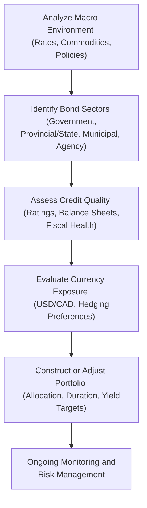

## 6.5 Practical Applications in Canadian and U.S. Fixed Income Markets

Fixed income markets in North America are some of the most liquid and diverse in the world, offering vast opportunities for both institutional and individual investors. From U.S. Treasuries, often regarded as “risk-free,” to Government of Canada bonds representing the country’s sovereign debt, there’s a wide spectrum of maturities, credit profiles, and yield characteristics. This section aims to bring these concepts to life by showing how theoretical notions—like yield curve analysis, credit spreads, and currency hedging—play out in the vibrant real-world markets of Canada and the United States.

Sometimes, I remember my first foray into Canadian provincial bonds. I went in expecting them to behave much like U.S. municipal bonds—only to discover that the relationship between provinces like Ontario or Quebec and the Canadian federal government can shape yields and risks in surprisingly different ways from what you see with U.S. states. That made me realize how important it is to appreciate each region’s unique blend of structure, regulations, and economic drivers.

Below is a comprehensive exploration of the practical applications in Canadian and U.S. fixed income markets, including highlights that can help you excel on the CFA Level II exams. Let’s dig in.

---

### The Role of Benchmark Yield Curves

One of the first things any fixed income analyst learns is the centrality of the “benchmark.” In the United States, U.S. Treasury securities serve as the cornerstone for interest rate pricing, providing a reference point for risk-free rates across different maturities. In Canada, Government of Canada bonds perform a similar function. However, the two markets differ in size, liquidity, and international influence.

• U.S. Treasury Bonds  
U.S. Treasuries are extensively traded globally and are considered the backbone of worldwide fixed income markets. Because they’re denominated in U.S. dollars—a dominant reserve currency—and because the U.S. economy commands a massive global footprint, Treasuries enjoy deep liquidity. Many global investors treat them as the “ultimate” risk-free benchmark for setting yield spreads on everything from corporate debt to emerging market bonds.

• Government of Canada Bonds  
Government of Canada bonds, or GoCs, reflect Canada’s sovereign credit standing. While trading volumes are smaller compared to Treasuries, these bonds remain highly significant in North America. Yields on GoCs often track U.S. yields closely, but can diverge due to country-specific monetary policy from the Bank of Canada, as well as commodity price environments that strongly impact Canada’s resource-driven economy.

One quick anecdote: A friend of mine once bought a 10-year Canadian bond assuming it would mirror the yield and volatility of U.S. Treasuries. He was shocked when a shift in oil prices caused significantly wider spreads, illustrating that Canada’s resource-dependent economy can have unique yield curve twists that aren’t always mirrored in the U.S. So, if you see the yield differential wig out between Canada and the U.S., check the commodity price headlines.

---

### Liquidity Considerations

The U.S. Treasury market is famously liquid. You can typically offload Treasuries quickly—sometimes in a matter of seconds—without significantly impacting their price, especially for on-the-run issues (the most recently issued bonds or notes in a maturity range). In Canada, the bond market enjoys reasonable liquidity, though on-the-run Government of Canada issues are not normally traded in the same staggering volume as their U.S. counterparts.

Meanwhile, off-the-run U.S. Treasury and older Government of Canada issues may have less liquidity, which can result in slightly wider bid-ask spreads or other inefficiencies. Particularly for large institutional trades, investors weigh the liquidity premium carefully. If you’re running a big pension fund, you might focus more on on-the-run Treasuries and new Government of Canada issues—just because you can get in and out more seamlessly. 

---

### Provincial, State, and Municipal Bonds

Government-backed bonds don’t just come from federal governments. Sub-sovereign entities—like provinces in Canada and states or municipalities in the U.S.—also issue debt with varying degrees of support or “moral obligation” from their respective federal governments.

• Canadian Provincial Bonds  
Some provinces—especially Ontario and Quebec—are highly active issuers. Because these provinces have large populations and solid economic footprints, their bonds can be relatively liquid. Even so, they do carry credit spreads compared to Government of Canada bonds. Provinces with higher reliance on natural resources, like Alberta or Newfoundland and Labrador, may display spreads that fluctuate more widely with commodities markets.

• U.S. Municipal Bonds (“Munis”)  
Municipal bonds are used by U.S. states, cities, and other sub-sovereign entities to fund infrastructure projects, schools, or housing. Munis often have tax advantages for U.S. investors (particularly in the issuer’s home state), making them appealing to high-net-worth portfolios. The credit quality can vary dramatically—just think of big differences between a financially stable state like, say, Utah, and a municipality facing budget crises. Also, keep an eye on the risk that some municipalities can default if their tax base declines drastically.

A friend of mine in Toronto used to joke that the biggest difference between a Canadian provincial bond and a U.S. muni is that “One’s a bit less complicated to figure out,” which is only half-true. Muni bonds have the complexity of tax benefits and occasional revenue-backing structures. Meanwhile, Canadian provincial bonds can be simpler in structure but more sensitive to commodity price swings, global trade, or the Bank of Canada’s moves.

---

### Agency and GSE Securities

Another layer of the North American fixed income landscape involves government agencies or government-sponsored enterprises (GSEs). Although these bonds and mortgage-backed securities aren’t always explicitly guaranteed by the federal government, various degrees of perceived or implicit “backing” often keep them highly regarded.

• U.S. Government-Sponsored Enterprises (GSEs)  
Fannie Mae (Federal National Mortgage Association) and Freddie Mac (Federal Home Loan Mortgage Corporation) are monumental issuers in the mortgage-backed security (MBS) space. Historically, markets have viewed these entities as carrying an implicit federal guarantee—an assumption that largely played out during the 2008 financial crisis, although the crisis complicated investor perceptions. U.S. agency securities typically pay slightly higher yields than U.S. Treasuries because the market perceives a sliver more risk.

• Canada Mortgage and Housing Corporation (CMHC)  
CMHC is a Crown corporation that insures mortgages and issues Canada Mortgage Bonds (CMBs). Unlike the U.S. GSE structure, CMHC’s obligations are fully backed by the Canadian government. As a result, this dampens credit risk, providing an attractive yield relative to Government of Canada bonds. That said, the liquidity for these instruments isn’t as deep as for Treasuries or on-the-run GoCs.

---

### Yield Spread Differentials and Region-Specific Risk Factors

Yield spreads between federal government bonds, sub-sovereign or agency securities, and corporate bonds can rapidly shift based on regional risk factors. If one tries to do a purely mechanical approach to analyzing fixed income, ignoring these local nuances, one can easily misread the market.

• Commodity Reliance in Canada  
Canada’s economy is heavily influenced by its natural resources—oil, minerals, lumber—leading to a correlation between commodity prices and the broader Canadian economic outlook. Therefore, the yield spreads on certain provincial bonds (e.g., Alberta) may be distinctively tied to oil fluctuations. If oil prices tank, those spreads might widen significantly, reflecting concerns about the province’s fiscal outlook.

• Fiscal Policies in the U.S. and Canada  
Debt ceilings, federal budget negotiations, and monetary policy differences create constant crosscurrents. The U.S. has had repeated standoffs over raising its debt ceiling, which, at times, ironically leads to short-term spikes in rates for certain maturities of Treasuries. Meanwhile, Canada navigates its own policy environment, and shifts in the Bank of Canada’s rate decisions can rapidly change spreads between GoCs and other debts.

• Interest Rate Differentials  
When the Federal Reserve stabilizes or raises rates faster or slower than the Bank of Canada, the yield advantage can swing. If the Fed is hiking rates aggressively but the Bank of Canada remains in a holding pattern, U.S. yields can suddenly look more attractive. As cross-border capital flows chase yield, there may be an impact on the CAD/USD exchange rate, which leads us to the next major consideration.

---

### Currency Considerations in Cross-Border Analysis

For many global investors, analyzing North American fixed income markets inevitably involves currency risk. Even for Canadian investors looking at U.S. bonds (or vice versa), shifting exchange rates can amplify or erode total returns.

• USD/CAD Exchange Rate Volatility  
Historically, the CAD has shown greater sensitivity to commodity prices, especially crude oil. When the price of oil surges, the Canadian dollar often appreciates against the U.S. dollar, all else equal. But currency movements swirl with a variety of factors: interest rate differentials, economic growth trajectories, and even broader global risk sentiment.

• Hedging Instruments  
Investors frequently use currency forwards or swaps to hedge exchange rate risk if they hold foreign currency–denominated bonds. For instance, a Canadian pension fund that invests in U.S. Treasuries may want to lock in the exchange rate with a forward contract. That way, the fund can preserve its yield advantage without the returns being overshadowed by CAD/USD volatility.

• Potential Strategy Pitfalls  
Hedging can be expensive, especially if interest rate differentials are large. Sometimes the cost of hedging can eat away all the yield pickup you might be targeting. Another caution: forward or swap markets have their own complexities, including credit risk exposure to counterparties (though this can be mitigated with exchange-traded instruments or clearing houses).

---

### Trading Conventions and Settlement Cycles

One detail that occasionally trips folks up is the difference in settlement cycles and trading conventions between bond types. The significance of these apparently mundane logistical details can become huge, especially for large transactions or in times of market stress.

• U.S. Treasuries Settlement: T+1  
Primary market Treasuries settle on a T+1 basis, meaning trades settle one business day after transaction. Futures on Treasuries and many short-term instruments might also follow a T+1.

• U.S. Corporates: T+2  
Corporate bond transactions typically settle on T+2. This timing difference can pose interest rate or credit risk if the markets are volatile in the interim period.

• Canadian Market Settlements  
Canada largely aligns with T+2 settlement for corporate and provincial bonds. Government of Canada bonds can also be T+2. There isn’t as large a distinction in settlement cycles between sub-sectors as in the U.S., though an investor should always confirm with trade counterparties or official guidelines.

• Ongoing Evolution  
It’s worth noting that settlement cycles are not set in stone. Regulators and market participants periodically push for shorter settlement—witness the move from T+3 to T+2 in the U.S. not too long ago. Watch out for potential policy changes aiming at T+1 for more asset classes over time.

---

### Credit Rating Agencies and Their North American Impact

Issuers in both Canada and the U.S. are typically rated by major global rating agencies such as Moody’s, S&P Global Ratings, Fitch Ratings, and also by DBRS Morningstar—a key player in Canada. Despite broad similarities, subtle differences in rating scales exist across these agencies. DBRS, for example, sometimes modifies letter ratings with “high” or “low” (e.g., “A (high)”). These nuances can matter when you look at borderline cases.

• Significance of Ratings  
A single-notch downgrade can push up yields and widen spreads for corporate or sub-sovereign bond issuers, thereby affecting their borrowing costs and your portfolio returns. In a cross-border context, rating differences across agencies can feed into relative value plays, where some issuers might look undervalued if different agencies diverge in their overall opinion.

• Limiting Factors and Pitfalls  
Credit ratings provide a snapshot, not a guarantee. Relying solely on a rating without robust fundamental analysis is a risk, especially in volatile markets or for issuers reliant on cyclical sectors like energy or real estate.

---

### Holistic Approach to North American Bond Portfolio Management

Putting the pieces together means analyzing not only the fundamental credit metrics of issuers but also macro-level factors such as interest rate trends, commodity prices, currency fluctuations, and monetary policy stances. The interplay between all these factors determines bond valuations and can cause large divergences between one region’s or sector’s debt and another’s.

Below is a simple Mermaid diagram illustrating how an investor might structure their thought process when building or adjusting a North American bond portfolio:

Each decision point above can drastically alter your portfolio’s structure. For instance, suppose you discover that the Bank of Canada is poised to raise rates, but the Federal Reserve remains on hold. That might cause you to lighten up on Canadian bond holdings, or at least shorten the duration on your Canada portfolio while maybe extending duration in Treasuries. Conversely, if you believe oil prices are about to rebound, you might see a relative value opportunity in Alberta-based bonds, anticipating that credit spreads will tighten.

---

### Practical Example: Cross-Border Yield and Currency Analysis

Let’s consider a hypothetical scenario. A U.S.-based investor is looking at a 5-year Government of Canada bond yielding 3.3% in CAD terms, while the similar-maturity U.S. Treasury yields 3.0%. At first glance, the Canadian bond offers 30 basis points of yield pickup. However, if the Fed is expected to raise rates by 25 bps more than the Bank of Canada in the coming quarter, that might strengthen the U.S. dollar relative to the Canadian dollar (or at least the investor expects it might). If the CAD depreciates, the investor’s total returns in USD terms might end up lower, effectively erasing or even reversing that 30-bp advantage.

One might consider hedging the currency through a forward contract. But if the forward premium for CAD vs. USD is pricey, then the net yield advantage might shrink or disappear. Exam questions often like to probe your understanding of how these interactions work—especially if you can spot a scenario where lightly analyzing only nominal yields without factoring in currency or hedging costs leads to the wrong conclusion.

---

### Best Practices and Common Pitfalls

• Best Practices  
  – Conduct robust macroeconomic analysis. Keep an eye on both the Bank of Canada and the Federal Reserve announcements, as well as local indicators like employment reports and inflation data.  
  – Incorporate commodity outlooks into your credit spread assumptions for Canadian issuers, especially energy-driven provinces.  
  – Perform thorough credit reviews. Don’t assume a triple-A rating from one agency is a free pass—read the underlying rating reports for potential cautionary notes.  
  – Reassess how interest rate differentials factor into currency risk. This is particularly essential when yields are close, and currency movements can make or break your returns.  

• Common Pitfalls  
  – Overlooking liquidity. Even if Canada’s bond market is relatively liquid, you can’t assume the same level of depth as the massive U.S. Treasury market.  
  – Underestimating local politics. Fiscal policy standoffs in the U.S. or changes in Canada’s provincial leadership can alter credit spreads more than you might expect.  
  – Failing to measure the total cost of hedging. If you’re trying to hedge currency risk, investigate the full range of derivative costs, not just the quoted forward points.  

---

### Practical Strategies for Implementation

In many real-life scenarios, investors combine both U.S. and Canadian debt to diversify interest rate risk, credit exposure, and currency risk. For instance, a balanced North American bond portfolio might include:

• Core Holdings  
  – U.S. Treasuries for high liquidity and global safe-haven status.  
  – Government of Canada bonds for stable returns tied to Canada’s economic cycle.

• Yield Enhancement  
  – Canadian provincial bonds offering slightly higher spreads than federal debt.  
  – High-quality U.S. municipal bonds providing tax-advantaged income (for U.S. investors in certain states).

• Tactical Opportunities  
  – Agency/GSE securities, especially if you believe spreads are mispriced and want MBS exposure with relatively strong implicit or explicit backing.  
  – Commodity-exposed sub-sovereigns or corporates if the macro environment suggests a favorable cycle.

In my experience, building a well-managed cross-border bond strategy often requires constant calibration. You’ll watch for yield curve twists, track central bank moves, and keep flexible. Sometimes you’ll dial down risk by focusing on top-tier credits; other times, small contrarian plays in local municipal or provincial markets can pay off, especially if you have a strong read on local budgets or infrastructure plans.

---

### Glossary of Key Terms

Government of Canada Bond  
Sovereign debt issued by the Canadian federal government. These bonds serve as a benchmark for Canadian interest rates.

Provincial Bond  
Fixed income securities issued by Canadian provinces. Typically offer higher yields than federal debt to compensate for relatively higher credit risk.

Municipal Bond (Muni)  
U.S. local government bond that often provides tax advantages for residents. Credit quality varies widely among issuers.

Agency Securities  
Debt instruments issued by U.S. government agencies or GSEs (e.g., Fannie Mae, Freddie Mac). Carry varying degrees of government backing.

CMHC (Canada Mortgage and Housing Corporation)  
A Crown corporation in Canada that provides mortgage insurance and issues Canada Mortgage Bonds (CMB), fully backed by the Canadian government.

GSE (Government-Sponsored Enterprise)  
Entities created by the U.S. Congress (like Fannie Mae or Freddie Mac) to improve access to credit in certain sectors. Often considered to have implicit government support.

Cross-Border Investment  
Investing in securities outside of one’s home country. In this context, it often includes investing in U.S. Treasuries from Canada or vice versa.

Exchange Rate Risk  
The potential for investment returns to be affected by fluctuations in currency exchange rates, such as USD/CAD.

---

### Final Exam Tips

1. Familiarize Yourself with Common Yield Curve Trends  
Know how Treasuries, GoCs, provincial, and municipal bonds trade relative to each other. The exam might ask you to interpret how an unexpected Fed or Bank of Canada move could realign yield spreads.

2. Stay Fluent in Tax Nuances  
Especially if you’re dealing with U.S. municipal bonds, remember the tax-exempt implications for certain investors. The exam could throw curveballs about after-tax yields.

3. Be Comfortable with Cross-Currency Mechanics  
You might be tested on the differences in yields between U.S. and Canadian issues, factoring in the cost and potential benefits of a currency hedge. Understand how to measure net returns after hedging.

4. Monitor International Sensitivities  
Keep an eye out for questions about how commodity prices or local politics can shift demand for sub-sovereign issuers. You might see vignettes that highlight real-world events, like a budget crisis in a Canadian province or a U.S. state.

5. Use Ratings as a Starting Point—Not the Endpoint  
CFA Level II tends to push you toward deeper credit analysis. Ratings matter, but always be prepared to mention fundamentals that could override a favorable rating.

---

### References and Suggested Reading

• Bank of Canada – [www.bankofcanada.ca](https://www.bankofcanada.ca)  
• U.S. Treasury – [www.treasury.gov](https://www.treasury.gov)  
• Fabozzi, Frank J. “Bond Markets, Analysis, and Strategies.” (Various Editions)  
• S&P Global Ratings, Moody’s, Fitch Ratings, DBRS Morningstar for credit rating reports and detailed issuer analyses  

These resources will help you stay current on market data, official rate announcements, and ongoing research to reinforce your mastery of practical applications in Canadian and U.S. fixed income markets.

---

## Test Your Knowledge: Canadian and U.S. Fixed Income Markets



### Which of the following statements best describes a key distinction between U.S. Treasury bonds and Government of Canada bonds?  
- [ ] U.S. Treasury bonds are typically more vulnerable to commodity price shocks than Government of Canada bonds.  
- [x] U.S. Treasury bonds have deeper liquidity and often serve as a global benchmark, whereas GoCs reflect Canada's monetary policy and can be more influenced by commodity-driven economic factors.  
- [ ] Government of Canada bonds typically have zero default risk, whereas U.S. Treasuries carry significant default risk in times of high government deficits.  
- [ ] Government of Canada bonds offer the highest liquidity among all sovereign bonds in North America due to currency stability.  

> **Explanation:** While both are considered sovereign debt, U.S. Treasuries trade in larger volumes globally and are treated as a key global benchmark. GoCs, by contrast, are impacted by domestic monetary policy and Canada’s commodity-driven economy.

### An investor seeking tax-advantaged income in the United States would most likely select which type of bond?  
- [ ] Provincial bonds  
- [ ] Corporate bonds  
- [x] Municipal bonds  
- [ ] U.S. Treasuries  

> **Explanation:** U.S. municipal bonds often provide tax advantages for U.S. investors, whereas others typically do not.

### Which of the following agencies is known for issuing mortgage-backed securities in the U.S.?  
- [ ] CMHC  
- [x] Fannie Mae  
- [ ] Canada Post  
- [ ] Ontario Financing Authority  

> **Explanation:** Fannie Mae (Federal National Mortgage Association) is a U.S. GSE involved in the mortgage market. CMHC is Canadian, not U.S.-based.

### A major driver of yield spread variations for certain Canadian provincial issuers is:  
- [ ] Interest rate decisions by the European Central Bank.  
- [ ] The social security reforms in the U.S.  
- [ ] Japan’s demographic changes.  
- [x] Reliance on commodity exports like oil and gas.  

> **Explanation:** Provinces such as Alberta are significantly affected by oil prices, which can cause their yield spreads to differ from other provinces.

### An investor who wants to eliminate foreign exchange risk when purchasing Canadian bonds but is based in the U.S. might employ which of the following strategies?  
- [x] Enter a forward contract or currency swap to lock in the USD/CAD exchange rate.  
- [ ] Purchase additional Canadian dollars on the spot market and hold them unhedged.  
- [ ] Rely entirely on changes in commodities for hedging.  
- [ ] Always take a short position on U.S. Treasuries.  

> **Explanation:** Currency hedging commonly involves a forward contract or a swap arrangement to mitigate exchange rate fluctuations.

### In practical trading terms, settlement for U.S. Treasury securities typically occurs on:  
- [ ] T+3  
- [ ] T+2  
- [x] T+1  
- [ ] T+0  

> **Explanation:** U.S. Treasuries usually settle one business day after the trade date (T+1), whereas many other securities settle on T+2.

### Which Canadian entity is fully backed by the federal government, insuring mortgages and issuing mortgage bonds?  
- [ ] Fannie Mae  
- [ ] Freddie Mac  
- [ ] Quebec Housing Authority  
- [x] CMHC (Canada Mortgage and Housing Corporation)  

> **Explanation:** CMHC is a Canadian Crown corporation that issues Canada Mortgage Bonds under a full federal government guarantee.

### One of the most notable differences in credit rating agencies between the U.S. and Canada is:  
- [x] The presence of DBRS Morningstar, which uses a high/low modifier to refine letter ratings.  
- [ ] The complete absence of Moody’s or S&P in Canada.  
- [ ] The absence of Fitch ratings in either country.  
- [ ] DBRS Morningstar is only used for U.S. municipal bonds.  

> **Explanation:** DBRS Morningstar, headquartered in Canada, uses rating notches such as “high” or “low” to further distinguish credit quality.

### An investor discovering that hedging costs exceed the yield advantage of a foreign bond is likely experiencing:  
- [ ] Liquidity risk.  
- [x] A negative carry on the currency hedge.  
- [ ] A settlement mismatch.  
- [ ] A beneficial arbitrage opportunity.  

> **Explanation:** When the cost of hedging is high, the investor experiences negative carry, effectively erasing the yield differential they aimed to exploit.

### The statement “Canada’s bond market typically lacks deep liquidity compared to U.S. Treasuries” is:  
- [x] True  
- [ ] False  

> **Explanation:** Although liquid by many standards, Canada’s bond market is smaller and less liquid than the large U.S. Treasury market.


