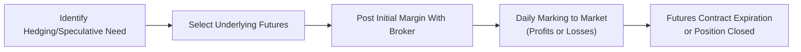

## 7.1 Forward and Futures Contract Valuation

If you’ve ever wished you could “lock in” a future price to protect yourself from fluctuating market conditions, you’ve tapped into the essential spirit of forward and futures contracts. I remember the first time I heard about these contracts, I was lying awake at night worrying about how coffee bean prices might shoot up by the time I’d saved enough money to open a quaint coffee cart. A friend casually mentioned a “forward contract” on commodities. My reaction was something like “Wait, you can actually fix the price now and buy coffee beans in six months?” That’s exactly their point. Now, let’s dig into the essential building blocks of forward and futures contract valuation in a way that connects the intuition, the math, and the practice.

---

### Definition and Purpose of Forward and Futures Contracts

A forward contract is a private agreement between two parties to buy or sell an underlying asset (like a commodity, bond, or currency) at some future date for a price decided right now. Because forwards are often customized (e.g., quantity, quality, delivery date, etc.), they aren’t typically traded on an exchange—think of them as tailor-made suits in a world of typical off-the-rack offerings.

On the other hand, a futures contract is an exchange-traded instrument with standardized terms (quantity, quality, delivery location, and date). The exchange’s clearinghouse stands between buyers and sellers, mitigating counterparty (or credit) risk by guaranteeing trades. With futures, you can be fairly relaxed about default concerns because the clearinghouse effectively replaces the original counterparty’s obligations. Even so, you’ll still encounter daily gains or losses from marking to market (we’ll get to that soon).

Both contracts let you hedge or speculate. If you’re a wheat farmer worried about next season’s wheat prices cratering, you can lock in a favorable price using a forward/futures contract. If you’re a portfolio manager who expects equity prices to rise, you might take a speculative long position in stock index futures.

---

### Pricing Under the Cost-of-Carry Model

In forward/futures valuation, we rely heavily on the cost-of-carry model, which basically says: “What does it cost me to buy the underlying asset now and hold it until the delivery date?” Then it takes into account financing costs (like interest), storage costs (if we’re dealing with commodities), and any income from the asset (like dividends).

In the simplest case for a non-income-producing asset, the **no-arbitrage** relationship is given by:

$$
F_0 = S_0 \times e^{rT},
$$

where  
- \\( F_0 \\) is the forward (or futures) price determined now (time 0).  
- \\( S_0 \\) is the current spot price of the underlying.  
- \\( r \\) is the risk-free interest rate (continuously compounded).  
- \\( T \\) is the time (in years) to maturity or expiration.

This equation is sometimes read as: “Forward Price = Spot Price Grown at the Risk-Free Rate.” It’s the bedrock of forward pricing in a frictionless, perfect-market scenario where the underlying doesn’t pay any income and there are no storage costs.

#### Adjustments for Yields, Storage Costs, and Convenience Yield

If the underlying produces some regular income or yield (like dividends on stocks or coupon payments on bonds), the forward or futures price is typically lower than \\( S_0 e^{rT} \\). The reason? You effectively “lose out” on the yield if you hold the forward instead of holding the asset. For stocks, we incorporate an expected dividend yield \\( q \\) like so:

$$
F_0 = S_0 e^{(r - q)T}.
$$

For commodities, you might face storage costs \\( u \\) (e.g., paying for a warehouse to store barrels of oil), which pushes the forward price upward. If there’s a convenience yield \\( y \\) for physically holding the commodity (like a refinancial firm might have an incentive to keep some supply on hand), it can push the forward price downward. Combined in one expression, these adjustments can look a bit like:

$$
F_0 = S_0 e^{(r + u - q - y)T}.
$$

(In practice, you’ll frequently see these broken out or combined differently, depending on the specific exam reading or real-life application.)

---

### Carry Arbitrage and Convergence

There’s a wonderful notion called **convergence** in futures and forwards: as expiration approaches, the forward/futures price converges to the spot price. If not, we’d have an arbitrage opportunity. Arbitrage—profiting with zero net investment and no risk—keeps markets in check.

If the forward price is way too high compared to its “fair value,” arbitrageurs will do something like short the forward (agree to sell at an artificially high forward price) and buy the underlying asset in the spot market, pocketing a near-riskless profit. Conversely, if the forward price is oddly low, they’ll do the reverse. Over time, these trades push the forward/futures price back to where they “should be” per the cost-of-carry model.

---

### Marking to Market and Margin in Futures

Futures contracts come with a daily “marking to market” feature that can feel a bit jarring if you’re used to the more straightforward hold-’til-expiration approach of forwards. Basically, your gains or losses on a futures contract are realized each trading day based on the settlement price. If you’re on the winning side of the price movement, your broker credits your account. If you’re on the losing side, your broker debits it. This daily settlement reduces the chance that you or the other party can build up huge potential losses and default at maturity.

Because of marking to market, you need an **initial margin**—a relatively small deposit that ensures you have “skin in the game.” There is also a **maintenance margin**. If your losses build up and your margin balance dips below this maintenance level, you’ll get a **margin call**, requiring you to top up your account. If you fail to do so, the broker can close out your position. This system keeps the futures market robust, but it introduces a bit of day-to-day volatility in your cash balance—unlike forward contracts, which settle only at maturity.

---

### Comparisons Between Forwards and Futures

#### Customization vs. Standardization
Forwards are like having a tailor measure you for a custom suit—quantity, quality, delivery date, and location are all negotiated. Futures are the “one-size-fits-all” approach (or maybe “select-from-a-few-common-sizes”). They’re standardized, so you get set contract sizes and designated expiration dates.

#### Counterparty Risk
Forwards directly link two parties, so they each hold the other’s credit risk. Meanwhile, futures are backstopped by an exchange’s clearinghouse, drastically reducing counterparty risk. This difference can matter a lot if you’re dealing in huge notional amounts or if partner default is a serious worry.

#### Liquidity
Futures typically have higher liquidity because they’re traded on organized exchanges with many participants. Forwards, anchored in the over-the-counter (OTC) market, rely on direct negotiation between counterparties. Liquidity is relatively lower. That said, forwards make sense for specialized deals (like hedging the sale price of some extremely niche commodity).

#### Pricing Differences
Since futures are marked to market daily, interest rate movements can introduce subtle differences in pricing compared to an equivalent forward. In stable rate environments, the difference might be negligible, but it can become noticeable when interest rates flutter around a lot.

---

### Forward Rate Agreements (FRAs)

Forward Rate Agreements (FRAs) might sound fancy, but in essence, they let you fix an interest rate you’ll pay or receive on a notional for a specified future period. Suppose you need to borrow $10 million for three months, beginning in six months. You’re nervous that interest rates might jump by then, so you’d go long an FRA that locks in the borrowing rate. At the end of the FRA period, you’ll settle the difference between the FRA’s “contract rate” and the actual reference rate (often SOFR nowadays, historically LIBOR). This approach effectively pegs your borrowing cost.

FRAs are popular among financial institutions, corporations, and anyone with big interest rate exposures. They can also be used to speculate on future rate movements, though that’s riskier if your rate view is incorrect.

---

### Deliverable vs. Cash-Settled Futures

Some futures physically deliver the underlying asset at expiration—think wheat, crude oil, or live cattle. These are **deliverable futures**. Others are purely **cash-settled**, meaning there’s no actual exchange of the physical commodity or financial instrument. Instead, final profits or losses are settled in cash. Stock index futures (like the S&P 500 or S&P/TSX Composite) and interest rate futures often fall into this category. It’s much more straightforward to settle in cash for an index than to deliver a basket of hundreds of stocks.

---

### Practical Example: Equity Index Futures

Imagine you manage a portfolio of Canadian equities and are bullish on the broad Canadian market for the next quarter. Instead of rebalancing your entire portfolio to add more equities, you can buy S&P/TSX Composite futures for a cost-effective, leveraged approach to increasing market exposure.  

The cost-of-carry model for equity index futures includes adjustments for the expected dividend yield of the index:

$$
F_0 = S_0 e^{(r - q)T},
$$

where \\( q \\) is the continuous dividend yield. If the index yield is large, your futures price is lower than \\( S_0 e^{rT} \\). In practice, you’d keep a watchful eye on the real dividend feed from the underlying stocks, short-term interest rates, and your trading costs.

This approach can help you quickly adapt to market outlook changes without drastically overhauling your entire holdings. But remember, with futures, you’ll face daily margin calls if the market moves against you.

---

### A Quick Visual: How a Typical Futures Trade Flows

Below is a simple Mermaid diagram illustrating the broad process of entering, holding, and eventually closing or delivering a futures contract.

- A: Realize a reason to hedge or speculate, such as an expected price move.  
- B: Pick the right contract type and size.  
- C: Deposit margin to cover daily P&L swings.  
- D: Margin balance is updated daily.  
- E: At expiration, either deliver/receive the underlying (if deliverable) or settle in cash.  

---

### Glossary

• **Forward Price**: The contractually agreed-upon price in a forward contract, set at inception.  
• **Initial Margin (Futures)**: The collateral deposit required to open a futures position.  
• **Maintenance Margin (Futures)**: The minimum margin balance you must maintain before topping up is required.  
• **Cost of Carry**: The net effect of all costs (financing, storage) and benefits (dividends, convenience yield) associated with holding the underlying over the contract’s life.  
• **Marking to Market**: The daily settling of gains or losses based on the new market price of the futures contract.  
• **Convergence**: The process of futures (or forward) prices moving toward the spot price as expiration nears.  
• **Carry Arbitrage**: A strategy that exploits mispricing between the spot asset and forward/futures prices by simultaneously taking positions in the underlying and the derivative.  
• **Forward Rate Agreement (FRA)**: A forward contract on short-term interest rates.  

---

### Best Practices and Pitfalls

• Always consider **transaction costs** and the cost of capital. Simple formulas assume frictionless markets.  
• Understand your margin obligations for futures. The daily “cash in or out” can cause operational headaches if not planned for.  
• For deliverable commodity contracts, the possibility of physical delivery is real. If you can’t handle receiving 1,000 barrels of oil at your doorstep, you should close your position before expiration or carefully choose financial settlement.  
• Watch out for **credit risk** in forwards. If you’re dealing with an OTC contract, confirm the creditworthiness of your counterparty or structure collateral agreements.  
• Be mindful of interest rate and dividend changes in equity index futures. These can nudge your implied cost of carry up or down, sometimes unexpectedly.

---

### Encouraging Critical Thinking

It’s tempting to see these formulas and think it’s all mechanical—plug in numbers and go. In reality, successful forward/futures trading or hedging demands close attention to market conditions, interest rates, liquidity, credit risk, and the big picture of your portfolio’s exposures. Think about how changes in any of these variables alter the forward price or your strategy’s viability. Maybe you’re short a futures contract but local interest rates just pivoted upward; that shift might adjust the shape of your daily margin flows.

---

### Conclusion and Exam Tips

Forward and futures contracts are essential in modern finance for hedging and speculation. Understanding how to price them using cost-of-carry, deal with the daily marking-to-market in futures, and exploit or avoid arbitrage opportunities underpins much of what you’ll do as a risk manager or investments professional.

In exam scenarios, you’ll see vignette-style questions that require:

• Quick recall of the forward/futures price formulas (with or without dividends, storage costs, etc.).  
• Clarification on daily settlements, margin calls, and the net effect on your cash flows.  
• Understanding subtle differences between forward and futures pricing in different interest rate environments.  
• Possibly employing a “cash-and-carry” or “reverse cash-and-carry” example to find mispriced markets.

Stay disciplined with formula application. Show each step clearly. And if the question references an asset with known yield or storage costs, incorporate those adjustments. Remember that the exam might throw real-world quirks like convenience yield or extremely high storage costs at you.  

---

### References

• Hull, John. “Options, Futures, and Other Derivatives.” Pearson.  
• CFA Institute Level II Curriculum, Derivatives Readings and Practice Problems.  
• Pirrong, Craig. “The Economics of Commodity Markets: Exercises and Case Studies.”  

---

## Test Your Knowledge: Forward and Futures Contract Valuation



### Which of the following statements accurately describes a forward contract?

- [x] It is an over-the-counter agreement for the purchase or sale of an asset at a specified date in the future.
- [ ] It involves standardized contract terms and daily marking to market.
- [ ] It cannot be customized regarding quantity or delivery date.
- [ ] It is guaranteed by an exchange clearinghouse to mitigate counterparty risk.

> **Explanation:** A forward contract is an OTC agreement that can be customized. It is not guaranteed by an exchange, nor does it typically involve daily marking to market (those are futures contracts).

### Which formula is the correct forward price for a non-dividend-paying stock under the no-arbitrage principle, assuming continuous compounding?

- [x] F₀ = S₀ × e^(r×T)
- [ ] F₀ = S₀ ÷ e^(r×T)
- [ ] F₀ = S₀ × (1 + r)^T
- [ ] F₀ = S₀ - e^(r×T)

> **Explanation:** The no-arbitrage forward price for a non-dividend-paying asset is S₀ × e^(r×T), reflecting continuous compounding.

### In a futures contract context, marking to market refers to:

- [ ] Charging traders a premium for contract customization.
- [ ] Evaluating the cheapest-to-deliver bond in a treasury futures contract.
- [ ] Periodic changes in the implied volatility of options.
- [x] Daily settling of gains and losses in the futures margin account.

> **Explanation:** Marking to market is the process by which the futures exchange adjusts margin accounts to reflect daily gains or losses based on the new settlement price.

### Which of the following is a key difference between forward contracts and futures contracts?

- [ ] Forward contracts require a daily margin deposit, while futures do not.
- [ ] There is no counterparty credit risk in forward contracts, but there is in futures.
- [x] Forward contracts are customized agreements, while futures are standardized.
- [ ] Futures contracts are always physically settled, while forwards are not.

> **Explanation:** The main distinction is that forward contracts are customized, while futures are standardized and traded on exchanges. Forwards have credit risk, whereas futures’ credit risk is largely mitigated by the clearinghouse.

### When the forward price for a commodity is lower than the cost-of-carry model suggests, which strategy would an arbitrageur likely implement?

- [ ] Buy the commodity spot and short the forward.
- [x] Buy the forward and short the commodity spot.
- [ ] Buy the forward and buy the commodity spot simultaneously.
- [ ] Sell the forward and do nothing with the commodity.

> **Explanation:** If the forward price is lower than fair value, an arbitrageur can buy the underpriced forward and simultaneously short (borrow and sell) the commodity, locking in a riskless gain as the contract converges to fair value at expiration.

### Which best describes the maintenance margin in futures trading?

- [x] The minimum account balance to keep a futures position open without additional funds.
- [ ] The amount of extra collateral required at contract inception beyond the initial margin.
- [ ] The total sum of daily marking-to-market payouts.
- [ ] The maximum drawdown required before the broker closes the position.

> **Explanation:** Maintenance margin is the minimum balance that must stay in the margin account. Falling below this triggers a margin call.

### You plan to invest in an S&P 500 futures contract. The index has an estimated dividend yield q. The no-arbitrage futures price will typically be:

- [ ] Higher than S₀ e^(rT).
- [ ] Exactly equal to S₀ e^(rT) regardless of dividends.
- [x] Lower than S₀ e^(rT) to reflect the lost dividend income for a futures holder.
- [ ] Negatively correlated with the risk-free rate.

> **Explanation:** Because the futures holder does not receive the dividend yield on the index’s underlying stocks, the forward/futures price is effectively discounted by e^(-qT).

### Which of the following is a characteristic of a deliverable futures contract?

- [x] It requires physical delivery of the underlying asset at expiry, unless the position is offset prior to expiration.
- [ ] It settles exclusively in cash with no delivery option.
- [ ] It cannot be closed out prior to maturity.
- [ ] It requires a single standardized delivery location for equities.

> **Explanation:** Deliverable futures require an actual exchange of the asset if the position is held to expiration. Cash-settled futures do not.

### Which statement about Forward Rate Agreements (FRAs) is correct?

- [ ] FRAs settle daily, similar to futures.
- [ ] FRAs guarantee a fixed currency exchange rate.
- [ ] FRAs are identical to a cash-settled commodity forward.
- [x] FRAs allow parties to lock in an interest rate on a notional principal for a specified future period.

> **Explanation:** FRAs lock in a future interest rate on a notional principal, settling the difference between the agreed-upon rate and the reference rate when the period begins or ends.

### A cash-and-carry arbitrage on a stock index typically involves:

- [x] Buying (carrying) the index stocks and shorting (selling) the futures, profiting from mispricing.
- [ ] Buying the futures while shorting the index shares to exploit daily margin credits.
- [ ] Borrowing money at the risk-free rate and investing in forwarding the index.
- [ ] Only investing in the riskiest stocks within the index to achieve alpha.

> **Explanation:** In a standard cash-and-carry arbitrage, an investor buys the underlying asset in the cash market and shorts an overpriced futures contract (or forward). Over time, they lock in the no-arbitrage profit as futures converge to fair value.




