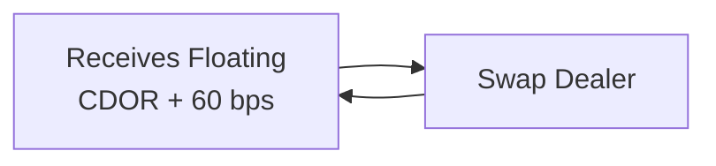
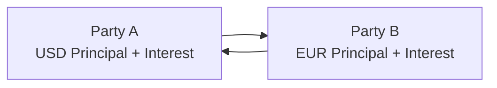

## 7.3 Swap Valuation and Applications

Swaps are powerful derivatives that allow parties to exchange specific financial obligations or cash flows, which can help them manage risks, optimize financing costs, or obtain desired exposures. They can be used to transform floating-rate liabilities into fixed-rate liabilities (or vice versa), convert liabilities denominated in one currency into another, or gain exposure to equity returns without directly holding the underlying asset. In this section, we’ll explore what swaps are, the mechanics behind them, how they are valued, and how industry professionals put them into practice. We’ll also look at some handy examples—including a Canadian interest rate swap scenario—and close with a short glossary, references, exam tips, and sample questions to help you test your knowledge.

## Introduction

You know, I remember the first time I heard about swaps. I was having coffee with a friend who worked in corporate treasury, and she casually said something like, “We’re going to do an interest rate swap to hedge the floating exposure on our bank loan.” I thought, “Uh, an interest rate swap? That sounds complicated.” But then she explained that it’s basically just exchanging one kind of interest payment for another—like fixed for floating—over some notional principal. And suddenly it felt much more manageable.

That’s part of the reason I’m excited to share everything you need to know about swaps: we’ll break it down so these potentially intimidating instruments feel accessible and, dare I say, kind of cool.

## Definition and Mechanics of Swaps

A swap is an over-the-counter (OTC) agreement in which two parties exchange one set of cash flows for another, typically to manage different exposures. Although there’s a huge range of swaps out there—covering interest rates, currencies, equities, even commodities—the general idea remains:

• Two parties agree to exchange cash flow streams.  
• The obligations are defined by a notional principal (the “pretend” amount upon which interest or returns are calculated).  
• Payments are netted at scheduled intervals, unless it’s a currency swap where principal exchanges may also occur.  
• Each party is effectively “swapping” its exposure for the other’s.

Swaps are widely used across industries to manage risk, lower borrowing costs, or obtain more favorable terms. They are typically arranged through swap dealers—often large financial institutions—that stand ready to match counterparties’ needs or assume offsetting positions within their books.

### Key Concepts

• Notional Principal: The amount on which the swap’s exchanged cash flows are based. Usually, this principal does not physically change hands—except in currency swaps, where actual principal amounts might be exchanged in different currencies.  
• Fixed Leg vs. Floating Leg: In an interest rate swap, one side (the fixed leg) pays a fixed rate determined at swap initiation, while the other side (the floating leg) pays a floating rate, like SOFR (in the U.S.), LIBOR (historically), or another regional benchmark.  
• Mark-to-Market Value: As time passes and market interest rates or underlying benchmarks change, the value of each party’s position in the swap will deviate from zero.  
• Credit Risk: OTC contracts like swaps carry counterparty risk. Each party relies on its counterparty to fulfill payment obligations throughout the life of the swap. This is partially mitigated by collateral arrangements, credit support annexes, or central clearing (where applicable).

### Purposes

• Transforming Cash Flows: A company with floating-rate debt can swap into fixed payments for predictability, or a firm with fixed debt can swap into floating if it believes rates will decline.  
• Hedging Currency Risk: A multinational might convert repayments in an unfavorable currency into a currency with stable or lower interest rates.  
• Speculating on Future Movements: Some investors use swaps to position themselves for expected changes in interest rates, exchange rates, or equity returns.  
• Aligning Asset-Liability Profiles: Financial institutions often use swaps to match the duration or currency characteristics of their assets with those of their liabilities.

## Interest Rate Swaps

Interest rate swaps are one of the most common derivatives in the global OTC market. The simplest version is the “plain vanilla” interest rate swap: one party agrees to pay a fixed rate, while receiving a floating rate; the other party does the opposite.

### Plain Vanilla Interest Rate Swap

In a plain vanilla swap:

• Party A pays a fixed rate (say 3%) on a notional amount (e.g., $1 million).  
• Party B pays a floating rate (say, SOFR + 50 bps) on the same notional.  
• Payments usually occur quarterly or semiannually, based on the agreed day count convention.  
• The fixed rate is set at swap initiation so that the expected present values of both legs are equal, giving the swap an initial fair value of zero.

The idea is that if the market’s expectation of a floating benchmark changes (or if the floating index itself changes), the value of the swap’s floating leg changes, and, consequently, the value of the entire swap also changes.

### Valuation

Let’s talk about how we value an interest rate swap after inception. Essentially, you treat each leg as a separate stream of cash flows:

• Float Leg: The floating payments are typically reset at the start of each payment period to match the current reference rate. Right after a reset date, the floating leg’s value is very close to the notional (some minor adjustments might exist due to spread or time until the next payment).  
• Fixed Leg: The fixed leg is the present value of all future fixed payments plus, if applicable, any final notional exchange (not typically exchanged in interest rate swaps, but relevant for some structures).

You discount each payment at the appropriate discount rate (often built from a related yield curve). The net swap value is:

V_swap = V_fixed_leg – V_floating_leg

At initiation, V_swap = 0 (because the fixed rate is chosen to make these legs equal). Over time, if the floating rate rises above the fixed rate, a party paying fixed (and thus receiving floating) might benefit because they receive higher floating payments. Conversely, if floating rates decline, the fixed-rate payer might be at a disadvantage.  

A simplified formula for the present value of the fixed leg might look like this:

V_fixed_leg = (C × \\(\sum_{t=1}^{n} P(t)\\)) + (Notional × P(n))

where:  
• C is the fixed rate times the notional.  
• P(t) is the discount factor at time t appropriate for that payment’s precise timing.  
• n is the number of payment periods.

Similarly, the floating leg approximates the notional at the most recent reset, adjusted by any margin or day count fraction left. In practice, a more precise approach uses forward rate curves for the floating payments.

## Currency Swaps

Currency swaps are agreements to exchange principal and interest payments in different currencies. This kind of swap is often used to reduce exchange rate risk or exploit better financing conditions in a particular currency.

### Mechanics

• Two parties exchange principal amounts in two currencies at the swap’s start. One might pay USD, the other EUR, for instance.  
• They pay interest on that principal (one side might pay a fixed rate on USD while the other pays a fixed rate on EUR, or each leg could be floating in different currencies).  
• At maturity, they typically re-exchange the principal amounts at the original exchange rate or at a predetermined rate.

The actual principal transfers at the start and end of a currency swap differentiate it from a standard interest rate swap, where the notional is purely notional.

### Valuation

To value a currency swap, you separately discount each leg using the yield curve appropriate for that currency. If necessary, you convert all cash flows to a single currency using the relevant spot or forward exchange rates. The present values of each side’s cash flows are netted, providing the overall swap value from each party’s perspective.

A typical approach:

• Convert the foreign currency leg’s projected cash flows into the domestic currency using forward exchange rates.  
• Discount those converted cash flows at the domestic discount factors.  
• Compare that to the domestic leg’s discounted cash flows.  

Whichever side is larger in present value terms confers a net positive (or negative) value to the holder of that side of the contract.

## Equity Swaps

Let’s say you want exposure to an equity index but without directly purchasing the stocks. An equity swap can facilitate that:

• One side pays a return tied to an equity index (like the S&P/TSX Composite in Canada or the S&P 500 in the U.S.), which might include capital gains and dividends.  
• The other side might pay a fixed or floating interest rate on the notional.  
• Net payments occur periodically, based on the changes in the equity index and the interest accrual.

### Mechanics

Imagine paying a floating rate such as 3-month SOFR on a $1 million notional and receiving the return of the S&P 500 index on that $1 million over a three-month period. If the index rises by 2% (including dividends) in that interval, you get 2% of $1 million = $20,000, while you pay (3-month SOFR × $1 million × fraction of the year). If the index goes negative, you pay the difference in the index return to your counterparty.

### Valuation

Valuing an equity swap is similar to valuing a fixed-for-floating interest rate swap, except that the projected returns or dividends of the equity index is more uncertain and can’t be inferred solely from the yield curve. Instead, you might:

• Estimate potential equity returns (using forward prices or a dividend yield approach).  
• Discount those expected returns at a rate consistent with the risk or using a risk-free rate if you’re effectively capturing the index’s risk.  
• Compare that to the floating or fixed leg’s discounted cash flows.

The net present value is the difference between the present value of the index-linked leg and the present value of the rate-based or fixed leg.

## Swaptions

A swaption is literally an option on a swap. It grants its holder the right—but not the obligation—to enter into a swap under stipulated terms (like the maturity, notional, fixed rate, and payment frequency).

### Payer vs. Receiver Swaption

• Payer Swaption: Gives the holder the right to pay the fixed rate and receive floating, effectively a bullish position on interest rates (because if rates go up, paying fixed is beneficial).  
• Receiver Swaption: Grants the holder the right to receive the fixed rate and pay floating, akin to a more bearish stance on interest rates.

### Valuation

From a conceptual standpoint, valuing a swaption involves option pricing models, such as Black-style models adapted for interest rates, and computing the probability of the swap finishing in-the-money. Essentially, a payer swaption is in-the-money if the relevant fixed swap rate at expiry is greater than the strike rate, while a receiver swaption is in-the-money if the observed swap rate is below the strike.

Swaptions are widely used by firms to hedge future financing needs. For example, if you suspect that interest rates might rise by the time you refinance a loan six months from now, you might purchase a payer swaption, locking in the right to pay a current fixed rate if rates do indeed spike.

## Real-World Example: Canadian Corporate Interest Rate Swap

Let’s walk through a practical illustration:

A Canadian manufacturing company issues a 5-year floating-rate note, referencing 3-month CDOR (Canadian Dollar Offered Rate) + 60 bps. Initially, short-term rates seem low, which is nice for the issuer. But there’s the worry that interest rates could ramp up, significantly increasing the firm’s interest expense. So the treasury team decides to “swap” out that floating-rate exposure.

• The company approaches a swap dealer and agrees to pay a fixed 3% annually, while receiving 3-month CDOR + 60 bps on a notional equal to the principal of the note.  
• Every quarter, the manufacturing company calculates the difference between (3-month CDOR + 60 bps) and the fixed 3% annual rate (converted to a quarterly or daily basis accordingly).  
• Suppose rates rise to 4% annualized. The company is now receiving 4% + 60 bps on the floating leg—i.e., 4.60% total—while paying 3% fixed. This difference helps offset the increased cost of the underlying floating-rate bond.  
• Net result: The swap effectively locks the company into an all-in cost that’s close to 3% (plus any minor spread differences), stabilizing interest expenses and mitigating the risk of a major rate hike.

## Diagrams for Swap Mechanics

Below is a simple Mermaid diagram showing the flows in a plain vanilla interest rate swap. Notice how the company pays fixed in exchange for receiving a floating rate from the swap dealer.

For a currency swap, the structure might look like this:

## Common Pitfalls and Best Practices

Swaps may seem straightforward in principle, but there are pitfalls to watch out for:

• Credit Risk Management: Because swaps involve continued exposure to a counterparty, ensuring proper collateral or central clearing is vital.  
• Documentation and ISDA Agreements: Using standardized documentation reduces legal uncertainties but requires careful reading and negotiation of credit support annexes, netting clauses, etc.  
• Liquidity and Market Conditions: If you need to terminate a swap early or restructure it, market liquidity and credit spreads can deeply affect termination costs.  
• Benchmark Transition: With the global phase-out of LIBOR, transitioning to risk-free rates (e.g., SOFR in the U.S., CORRA in Canada) can require reworking swap terms and calculations.

## Practical Guidance

• Always dissect the two (or more) legs of a swap as independent cash flow streams.  
• Obtain robust yield curves for discounting. If you’re dealing with currency swaps, secure forward exchange rates and currency-specific discount curves.  
• Keep track of day count conventions, payment frequency, and holiday calendars—these “boring” details can trip you up if overlooked.  
• If in doubt, run scenario analyses on your swap portfolio to see how changing rates, currency movements, or equity index levels might affect valuations or cash flow exposures.

## Conclusion

Swaps are integral financial instruments for interest rate, currency, or equity risk management. They offer flexible, customizable solutions for both hedgers—like corporations seeking stable financing costs or exchange rate certainty—and for speculators anticipating certain market moves. Although conceptually straightforward, the actual valuation, documentation, and risk management aspects can become quite nuanced.

If you’re preparing for the CFA® Level II exam, it’s essential to have a firm handle on how each leg of the swap is valued, the typical uses of swaps, and how swaptions add an optionality layer to manage or speculate on interest rate movements. Make sure you do some practice problems involving the discounting of each leg, especially with the evolving environment of benchmark transitions from LIBOR to SOFR and other risk-free rates.

## References

• Sundaram & Das. “Derivatives: Principles and Practice.” McGraw-Hill.  
• CFA Institute Level II Curriculum, Swaps and Swaptions Readings.  
• ISDA (International Swaps and Derivatives Association): www.isda.org  
• IFRS 9 / ASC 815 (U.S. GAAP) guidelines on derivatives accounting for those interested in the reporting aspects.

## Final Exam Tips

• Memorize the definition of a swap and how each leg is priced. Expect conceptual questions or mini-case vignettes where you need to figure out who benefits from a rate move.  
• Be clear on discounting: which rates, yield curves, and day count conventions apply.  
• Understand how changes in forward rates affect the future floating payments, especially right after a reset date.  
• Know the difference between a payer swaption and a receiver swaption: who benefits if rates rise? Who benefits if rates fall?  
• Review currency swap logic carefully because of the initial and final notional exchange in different currencies.  
• Be ready for scenario-based analysis. For example, “What if the floating reference rate moves by X%? How does that impact the swap’s value?”  
• Practice, practice, practice! Working through examples is the best way to build confidence.

## Test Your Knowledge: Swap Valuation and Applications



### Which of the following best describes a plain vanilla interest rate swap?

- [ ] An agreement to exchange currency principal amounts without any interest payment.  
- [x] An agreement to exchange fixed-rate payments for floating-rate payments based on a notional principal.  
- [ ] A contract granting the right to buy or sell a swap at a future date.  
- [ ] An agreement to pay an equity index return in exchange for fixed payments.  

> **Explanation:** A plain vanilla interest rate swap involves exchanging fixed-rate payments for floating-rate payments (e.g., based on SOFR, CDOR, etc.).  

### In valuing a plain vanilla interest rate swap, the fixed-rate payer’s swap value is computed as:

- [ ] Present value of floating leg minus present value of currency leg.  
- [x] Present value of receiving floating leg minus present value of paying fixed leg.  
- [ ] Present value of the notional principal minus present value of the equity return.  
- [ ] Present value of spot rates minus forward discounting.  

> **Explanation:** You figure out the present value (PV) of each leg independently. For the payer of fixed, value = PV(receive floating) – PV(pay fixed).  

### What is the primary difference between an interest rate swap and a currency swap?

- [ ] One is exchange-traded, and the other is OTC.  
- [x] Currency swaps involve exchanging principal in two different currencies, while interest rate swaps generally do not.  
- [ ] Interest rate swaps settle every day, whereas currency swaps only settle at maturity.  
- [ ] Currency swaps cannot have floating payments.  

> **Explanation:** Currency swaps involve principal exchanges in two currencies at inception and maturity. Interest rate swaps generally do not exchange principal amounts.  

### A firm buys a receiver swaption. Which of the following statements best describes this position?

- [x] The firm obtains the right, but not the obligation, to receive a fixed rate and pay floating.  
- [ ] The firm obtains the obligation to pay a fixed rate and receive floating.  
- [ ] The firm must exercise the option if interest rates fall.  
- [ ] The firm sells an option on an underlying equity.  

> **Explanation:** A receiver swaption grants the holder the right to receive a specified fixed rate and pay floating.  

### In a currency swap where Party A pays fixed in USD and receives fixed in EUR from Party B, how do they typically handle principal exchange?

- [x] They exchange principal amounts in USD and EUR at the start and re-exchange them at maturity.  
- [ ] They never exchange the principal amounts; the principal is purely notional.  
- [ ] They only exchange the principal amounts if interest rates rise above a threshold.  
- [ ] They exchange USD principal but not EUR principal.  

> **Explanation:** In a currency swap, counterparties usually exchange principal in two currencies at the start and reverse the exchange at maturity.  

### The typical value of an interest rate swap to both parties at initiation is:

- [x] Zero.  
- [ ] Equal to the notional principal.  
- [ ] Positive for the fixed-rate payer and negative for the floating-rate payer.  
- [ ] Dependent on the shape of the yield curve.  

> **Explanation:** By setting the fixed rate so that the swap’s PV of fixed leg equals the PV of floating leg, the value at inception is zero.  

### In an equity swap, which of the following is typically exchanged?

- [x] The total return on an equity index for either a fixed or floating interest payment.  
- [ ] Principal amounts in two different currencies.  
- [x] Dividend payments plus capital gains (the total return) for a fixed or floating payment.  
- [ ] Only the excess of the equity index gains over a preset threshold.  

> **Explanation:** An equity swap generally exchanges the total return (including dividends and price appreciation) on an equity index for a fixed or floating rate payment.  

### Which best describes the floating leg’s valuation in a plain vanilla interest rate swap immediately after a rate reset?

- [x] It is close to par (the notional).  
- [ ] It is significantly higher than the fixed leg.  
- [ ] It is zero by definition.  
- [ ] It equals the net present value of all notional cash flows.  

> **Explanation:** Immediately following a rate reset, the floating rate payment is set to the current market rate, thus the floating leg’s value often resets close to the notional.  

### What role does a swap dealer typically play?

- [x] Acts as an intermediary, structuring swaps and offsetting positions in its swap book.  
- [ ] Only trades swaps on an exchange to ensure liquidity.  
- [ ] Forces both parties into mandatory collateral agreements.  
- [ ] Provides a regulatory framework for swap settlements.  

> **Explanation:** Dealers match counterparties, manage offsetting positions, and often create liquidity in the swap market.  

### A currency swap would be beneficial if a Canadian company wants to convert its future USD debt payments into CAD obligations. True or False?

- [x] True  
- [ ] False  

> **Explanation:** A currency swap can help the Canadian company transform USD-denominated interest and principal payments into CAD-denominated obligations, hedging currency exposure.  




