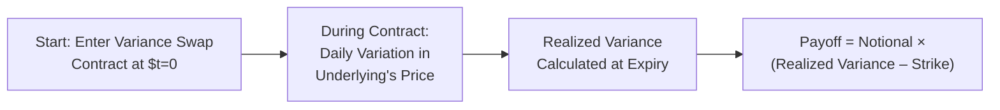

## 7.4 Advanced Derivatives Usage and Risk Management

Ever been curious about how sophisticated investors hedge or spare their portfolios from big market swings, while sometimes making money even if everything seems to be going sideways? Well, welcome to the world of advanced derivatives usage and risk management. This is where we go beyond the vanilla futures or plain-vanilla calls and puts. We’ll explore volatility derivatives, correlation trading, and the essential infrastructure of clearinghouses and collateral management. Brace yourself—some of these topics can feel abstract, but I’ll try to share a few stories and straightforward analogies to demystify it.

Sometimes you’ll see pro traders, big institutions, or hedge funds calmly navigating huge shocks. They might be using not only straightforward call and put options but also more advanced instruments like variance swaps or correlation trades. The words may sound fancy, but at the heart of it, these structures let them isolate and trade certain components of market risk—like volatility alone, or correlation alone—instead of just betting on the price direction of a single asset.

Below, we’ll dive into the major topics:

• Volatility Derivatives & Variance Swaps  
• Correlation Trading  
• Clearinghouses & Regulation in the U.S. and Canada  
• Collateral Management & Netting  
• Portfolio Hedging & Alpha Generation  
• Real-World Usage Examples  
• Glossary and references for further reading  

Let’s get started.

### Volatility Derivatives and Variance Swaps

If you’ve ever looked at the Chicago Board Options Exchange (CBOE) Volatility Index (VIX) and thought, “That’s neat, but can I actually trade just the volatility itself without worrying about the direction of the S&P 500?”—the answer is yes, sort of. VIX futures and options provide a way to speculate on or hedge implied volatility of the S&P 500 index. But some investors crave even more targeted exposure to realized volatility, and that’s where instruments like variance swaps come into play.

#### Variance Swaps Basics  
A variance swap is an over-the-counter (OTC) derivative that provides a pure play on the future realized variance (i.e., squared volatility) of an underlying asset—often a stock index or single stock. Instead of focusing on the underlying price, your payoff depends on how “jumpy” or “quiet” the market has been over the life of the contract.

In more formal terms, the payoff might look like this in KaTeX:


\text{Payoff} = \text{Notional} \times \left(\sigma_{\text{realized}}^{2} - K_{\text{variance}}\right)


Here,  
• σᵣₐₗᵢzₑd² is the annualized realized variance over the contract period,  
• Kᵥₐᵣᵢₐₙcₑ is the “strike” variance agreed upon at initiation,  
• Notional is a multiplier that tells you how many dollars change hands for each percentage point difference in variance.  

Why do people trade these? Well, let’s say you’re an asset manager who thinks the market is about to get choppy. Rather than juggling dozens of options, you might buy a variance swap that pays off if realized variance ends up being higher than expected. Conversely, if you think implied volatility is overpriced—or the market is over-hyping future volatility—you could sell such a swap.

#### Volatility Index Futures (VIX and Others)  
Of course, the best-known (and more standardized) measure of implied volatility is the VIX. In the U.S., traders use VIX futures and options to hedge or speculate on the S&P 500’s implied volatility. In Canada, you might see similar products that track the volatility of local equity indexes, though the VIX remains a global benchmark. It’s important to remember that VIX-based products and variance swaps are not identical. VIX typically references implied vol for 30 days ahead, while a variance swap is all about the end-of-period realized variance. The difference might sound subtle, but it can be huge when events like earnings surprises or major political headlines occur.

### Correlation Trading

Ever wonder how large institutions handle baskets of assets that move together or drift apart in unexpected ways? That’s correlation trading. The entire premise is that the movement of one instrument depends on or influences another. Maybe you notice that in times of crisis, certain sectors move in lockstep. Or in good times, correlations break down more than you’d expect. Trading correlation directly typically involves advanced structures like correlation swaps, dispersion trades, or multi-asset options.

• A dispersion trade, for instance, might involve selling index options while buying options on individual constituents if you believe single-stock volatilities are too cheap compared to index volatility.  
• Alternatively, a correlation swap pays based on the difference between realized correlation of a basket of assets and some fixed correlation strike.

Correlation trading can get quite tricky—one personal memory is the first time I tried to estimate correlation risk across a basket of emerging market currencies. Let’s just say there’s nothing like seeing all those positions suddenly move together in a meltdown! Practitioners quickly learn that correlation can spike unexpectedly in volatile markets, turning a nifty strategy into a big headache if it’s not carefully hedged.

### Clearinghouses and Regulation (U.S. and Canada)

Following the 2008 financial crisis, global regulators got serious about mitigating systemic risk from OTC derivatives. In the United States, the Dodd-Frank Act mandates that standardized swaps go through central clearing, thus reducing counterparty risk. Clearinghouses, armed with daily margining and robust default procedures, step in as the middleman between parties.

In Canada, regulation happens on both provincial and national levels, with organizations like the Ontario Securities Commission (OSC) and the Autorité des marchés financiers (AMF) requiring mandatory reporting of OTC derivative trades to recognized trade repositories. Standardized derivatives may also be forced (or strongly encouraged) to clear through central counterparties (CCPs). The goal is simple: ensure that if one large participant defaults, the system is less likely to blow up.  

Below is a simplified mermaid diagram showing a typical clearinghouse arrangement:

The clearinghouse effectively becomes the buyer to every seller and seller to every buyer, guaranteeing performance so long as it remains well-capitalized. This structure significantly lowers the risk of a domino effect if one party collapses.

### Collateral Management and Netting

Hand in hand with clearing is the concept of collateral (a.k.a. margin) management. Collateral is the security posted to protect the other party in case you default. For centrally cleared derivatives, initial margin is set by the clearinghouse using models that measure potential future exposure. Variation margin is exchanged regularly—sometimes multiple times per day—to reflect changes in market values.

In bilateral OTC relationships, parties typically sign a Credit Support Annex (CSA), setting forth the rules about how much collateral must be posted, in what form (cash, government bonds, etc.), and when it must be replenished.

Furthermore, netting agreements let counterparties offset amounts owed across multiple trades. So if you owe me $1 million on one swap and I owe you $750,000 on another, netting means the difference is $250,000 rather than each side exchanging gross amounts. This technique reduces the total credit risk. If one party defaults, “close-out netting” ensures that all related positions are terminated, and the net amount is due.  

Many risk managers love netting because it feels like they can reduce big exposures to more manageable lumps. Of course, it doesn’t remove market risk, but it reduces the credit (counterparty) risk portion significantly.

### Portfolio Hedging and Alpha Generation

Institutions of all shapes and sizes—pension funds, insurance companies, hedge funds—use derivatives to tailor portfolio exposures, protect existing positions, or eke out additional return (alpha) from inefficiencies.

• A straightforward example is using equity index futures to hedge broad equity market exposure or to quickly gain exposure if a portfolio manager sees an upcoming rally.  
• Interest rate swaps let you convert floating-rate liabilities into fixed (or vice versa), matching your interest rate exposure to your underlying assets or forecasts.  
• Currency forwards or options help hedge FX exposures for cross-border investments.  

Volatility-based products can also generate alpha when markets misprice risk. If, say, implied volatility on an asset is sky-high because traders are panicking, a manager might sell options or volatility derivatives to capture premium—provided they believe actual realized vol will be lower. Of course, the trick is not to get caught short when the market moves violently.

In portfolio construction, risk budgeting is key. Suppose your model says that half your risk is coming from equity market beta. You might add an equity index option collar (buy puts, sell calls) to reduce downside potential while giving up some upside. Or, if you find an uncorrelated alpha strategy in a derivatives overlay (like a volatility dispersion trade), you incorporate it as a diversifier.

### Real-World Usage Examples

Let’s explore a couple of simplified real-world usage cases:

• Canadian Pension Fund Hedging: A major pension fund invests in global equities but wants to protect its Canadian dollar liabilities. It can use short-dated currency forwards USD/CAD and EUR/CAD to hedge currency movements. If the CAD suddenly appreciates, the forward gains offset the equity losses on currency translation.  

• U.S. Hedge Fund Strategy: A hedge fund identifies a potential relative outperformance of Tech stocks over Bank stocks. Instead of doing a simple equity long/short, they implement a pairs trade using total return swaps. The hedge fund goes long the total return on Tech (paying a financing rate) and short the total return on Bank shares. This way, they isolate sector performance while managing margin and other complexities separately. The big advantage? They’re not holding the stocks directly—less capital is tied up, and they might get better netting opportunities if they have other offsetting swap positions.

### Diagram: Variance Swap Logic

Below is a conceptual mermaid diagram illustrating the cash flows in a variance swap, from inception to settlement:

Note: The swap value changes daily in theory, but actual settlement typically comes at the end, where realized variance is computed.

### Conclusion and Key Exam Tips

Advanced derivatives—whether they’re volatility derivatives, correlation products, or specialized swaps—enable market participants to break risk into smaller components and manage or exploit each piece. Keep in mind:

• Understand how realized volatility differs from implied volatility. Variance swaps target realized volatility, while instruments like VIX futures capture implied volatility over a short horizon.  
• Correlation can be a silent killer—especially when correlations spike in a crisis. If you’re managing a multi-asset strategy, make sure you’re prepared for correlation changes in extreme markets.  
• Central clearing reduces counterparty risk but introduces margin requirements. Don’t forget about liquidity risk if you’re posting collateral.  
• Netting and collateral are essential to reduce credit risk. Get comfortable with the concept of close-out netting.  
• In the exam context, you may see vignettes that combine theoretical knowledge (like pricing a variance swap) with practical considerations (like margin calls and capital usage). Be ready to perform quick calculations and interpret the results in a risk management scenario.  

Also, in real life, always read the fine print—if you’re ever in a seat where you’re signing that ISDA or CSA, you’d better know how netting works and how margin calls can come at the worst times.  

### References and Further Reading

• Durbin, Michael. “All About Derivatives.” McGraw-Hill.  
• CFA Institute Level II Derivatives Curriculum, Advanced Risk Management Cases.  
• BIS (Bank for International Settlements) reports on global OTC derivatives markets.  
• U.S. Dodd-Frank Act texts and related guidelines.  
• Provincial regulations in Canada by OSC and AMF for derivatives clearing and reporting.  

---

## Test Your Knowledge: Advanced Derivatives Usage and Risk Management



### A trader enters a variance swap with a strike of 15% variance. During the swap period, the realized annualized variance is 18%. Which of the following statements is most accurate regarding the payoff?

- [ ] The buyer of the variance swap pays the seller 3% of the notional.
- [x] The buyer of the variance swap receives the difference times the notional.
- [ ] The seller of the variance swap receives a payoff equal to realized variance.
- [ ] There is no payment since realized variance was above the strike.

> **Explanation:** The buyer of the variance swap benefits if realized variance exceeds the strike. The payoff is (realized variance – strike) × notional, so in this case, (18% – 15%) × notional.

### An investor believes that implied volatility on a stock index is overpriced. Which of the following advanced derivatives strategies is most aligned with this view?

- [x] Sell a variance swap.
- [ ] Buy a variance swap.
- [ ] Buy a correlation swap.
- [ ] Execute a dispersion trade by buying index volatility and selling single-name volatility.

> **Explanation:** If implied volatility is overpriced, the investor can profit by selling a variance swap. They will receive a payoff if realized volatility ends up lower than the implied level at inception.

### A correlation desk at a hedge fund executes a dispersion trade. Which of the following best describes a dispersion trade?

- [x] Selling index volatility and buying single-stock volatilities across the index.
- [ ] Buying index volatility and selling single-stock volatilities to hedge credit exposures.
- [ ] Buying both index volatility and single-stock volatility for the same basket.
- [ ] Exclusively taking positions in correlation swaps to offset interest rate risk.

> **Explanation:** A classic dispersion trade typically involves selling volatility on the index and buying options on individual constituents, aiming to profit if single-stock correlations remain low relative to the implied correlation in the index.

### In a centrally cleared interest rate swap, which party stands between the counterparties and manages default risk?

- [ ] The prime broker.
- [ ] The global custodian.
- [x] The clearinghouse.
- [ ] The local securities regulator.

> **Explanation:** When swaps are centrally cleared, the clearinghouse interposes itself as the buyer to every seller and the seller to every buyer, thus assuming (and managing) default risk.

### Which of the following is a direct benefit of netting agreements in bilateral OTC derivatives?

- [x] They allow reduction of overall credit exposure by offsetting mutual obligations.
- [ ] They provide a sure-fire hedge against market risk.
- [x] They reduce potential losses in the event of default through close-out netting.
- [ ] They remove the need for margin posting entirely.

> **Explanation:** Netting agreements reduce credit exposure by offsetting obligations across trades. They don’t eliminate market risk, but they do lower counterparty credit risk, especially upon default.

### How does posting initial margin at a clearinghouse help mitigate systemic risk?

- [x] It ensures each participant has skin in the game to cover potential future exposures.
- [ ] It allows for unlimited leverage without collateral.
- [ ] It eliminates the need for variation margin.
- [ ] It only applies during normal market conditions.

> **Explanation:** Initial margin is designed to cover potential future exposures. This capital cushion helps reduce systemic risk by ensuring that participants can meet obligations even under adverse market conditions.

### When a market participant buys a volatility swap, how is their profit or loss determined?

- [x] By the difference between realized volatility and the swap’s implied volatility strike.
- [ ] By the difference between implied volatility at inception and settlement’s interest rates.
- [x] By correlation changes across the underlying assets.
- [ ] Exclusively by changes in the underlying asset’s spot price.

> **Explanation:** A volatility (or variance) swap payoff is linked directly to realized volatility relative to an agreed-upon strike. Changes in correlation or the asset’s spot price matter only to the extent they affect realized volatility.

### A Canadian pension fund holding U.S. equities wants to hedge currency risk. Which derivative is most commonly used for this precise hedging purpose?

- [x] Currency forward contracts.
- [ ] Variance swaps.
- [ ] Correlation swaps.
- [ ] Commodity futures.

> **Explanation:** Currency forwards are straightforward instruments to lock in a future exchange rate and mitigate FX risk on foreign investments.

### How might a hedge fund generate alpha from mispriced volatility in the equity market?

- [x] Sell overpriced options or volatility swaps, hoping realized volatility is lower than implied.
- [ ] Buy overpriced volatility products, betting that implied volatility is too low.
- [ ] Only trade correlation swaps to hedge out volatility.
- [ ] Limit their exposure to currency forwards.

> **Explanation:** If the hedge fund believes implied volatility is overstated, they can sell options or volatility-linked products to capture the premium. If realized volatility is indeed lower, they profit from the difference.

### True or False: Clearinghouses eliminate all counterparty risk in the derivatives market.

- [x] True
- [ ] False

> **Explanation:** It’s somewhat a trick question: from a practical standpoint, a clearinghouse is designed to minimize counterparty credit risk by standing in the middle of transactions, but theoretically, there is still a residual risk if the clearinghouse itself fails. However, in common parlance and for exam purposes, we generally accept that clearinghouses are treated as effectively removing direct counterparty risk between participants.


