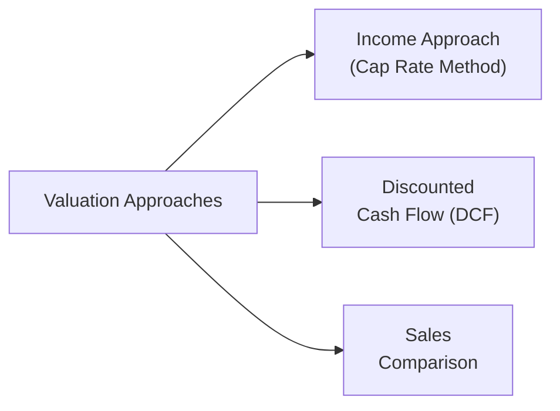

## 8.1 Real Estate Valuation and Analysis

Real estate can be an intriguing and tangible part of an investment portfolio. For some folks, there’s nothing like physically touching the bricks and mortar that (hopefully) works to grow their net worth over time. I remember the first time I walked into a 50-year-old commercial building I was looking to invest in—part of me was super excited by the potential returns, and another part was unnerved by the creaky floors and suspect plumbing. That’s real estate for you: a mix of real-world assets and financial opportunities, all wrapped up in location-driven complexities. 

In this chapter, we’ll explore different types of real estate investments (both direct and indirect), look at how properties are valued, check out how REITs are analyzed, and highlight key risk factors. Wherever you see big concepts, we’ll try to break them down into digestible bites so that you can build a solid foundation for the CFA Level II exam—and also for your own investing insight.

---

### Types of Real Estate Investments

Real estate is often divided into direct ownership (physically owning the property) and indirect ownership (investing in vehicles that own properties). Both approaches can serve as important diversifiers in a broader portfolio. Let’s dig in:

#### Direct Ownership

• Residential: Single-family homes, duplexes, condos—these are often the first real estate investments people consider. In residential real estate, investors typically earn returns mainly from rental income and property appreciation over time.  
• Commercial: Office buildings, retail centers, shopping malls, hotels—these tend to produce higher rental incomes but often require more complex management and incur bigger capital outlays.  
• Industrial: Warehouses, manufacturing plants, and distribution centers. Today, e-commerce has boosted demand for logistics and distribution facilities, making industrial real estate a key growth segment.  
• Agricultural: Farmland producing crops or livestock. Values in this category are often influenced by commodity prices, farming technology, and consumer preferences for particular food products.

#### Indirect Ownership

• Real Estate Investment Trusts (REITs): A popular way to hold a stake in a diversified pool of properties without having to deal with plumbing leaks at 2 a.m. REITs trade like stocks on an exchange, offering liquidity and requiring that they distribute a significant portion of their income.  
• Real Estate Operating Companies (REOCs): Publicly listed companies that own and actively manage real estate. Unlike REITs, they may reinvest more heavily in growth opportunities rather than distributing the majority of cash flows.  
• Commingled Real Estate Funds (CREFs): Pooled funds typically managed by professional investment firms. They provide diversified exposure to multiple properties or real estate–related assets.  
• Mortgage-Backed Securities (MBS): Debt instruments backed by pools of mortgages. Although investors don’t own the properties outright, they hold claims on the mortgage cash flows.

Below is a quick reference comparing direct vs. indirect ownership:

|                                | Direct Ownership                                         | Indirect Ownership                                                                     |
|--------------------------------|----------------------------------------------------------|----------------------------------------------------------------------------------------|
| Capital Outlay                 | Potentially high (down payments, financing, improvement) | Often lower entry costs (buying REIT shares, investing in funds, or buying MBS)        |
| Liquidity                      | Generally illiquid                                       | Typically more liquid (e.g., publicly traded REITs, MBS)                               |
| Management Responsibility      | Landlord duties (maintenance, tenant relations, etc.)    | Outsourced to professional managers (REIT mgmt., fund mgmt., etc.)                     |
| Risk/Return Characteristics    | Property-specific (location, tenant risk, etc.)          | Diversified across multiple properties or mortgages                                   |
| Regulatory & Tax Framework     | Subject to property taxes, local laws, capital gains     | REITs, REOCs, and MBS subject to specific regulations (e.g., distribution requirements) |

---

### Valuation Approaches

Valuing real estate usually involves three major approaches: (1) Income Approach, (2) Discounted Cash Flow (DCF) Method, and (3) Sales Comparison (Market) Approach. Let’s illustrate these in a Mermaid diagram to help visualize:

#### Income Approach (Direct Capitalization Method)

The income approach is grounded in the idea that the value of a property can be inferred from the income it generates. In practice, we usually:

1. Estimate Net Operating Income (NOI):  
   – Typically Rental Income minus Property-Level Operating Expenses (insurance, maintenance, utilities, etc.), excluding interest, taxes, depreciation, and amortization.  
2. Determine an Appropriate Capitalization (Cap) Rate:  
   – Cap Rate = (NOI) / (Property Value).  
   – Derived from comparable market data, local conditions, and the property’s risk profile.  
3. Compute the Value:  
   – Property Value = NOI ÷ Cap Rate.

Example: If a small office building produces an annual NOI of $100,000 and the local market cap rate is 8%, the property’s estimated value is $100,000 ÷ 0.08 = $1,250,000.

#### Discounted Cash Flow (DCF) Method

Sometimes called the “long formula,” DCF feels like a more rigorous extension of the income approach. It projects future cash flows (including a terminal or resale value) over multiple years, then discounts them back to the present at a required rate of return.

1. Forecast multi-year cash flows:  
   – These include rental income minus operating expenses and possibly some capital expenditures.  
2. Estimate a terminal value at the end of the forecast horizon:  
   – Often done by applying the direct cap method or an assumed exit price in the final year.  
3. Discount all future cash flows (including the terminal value) to the present value using an appropriate discount rate:  
   – The discount rate should reflect not just the risk of the property’s cash flows but also the time value of money.

#### Sales Comparison (Market) Approach

Here, we look at comparable properties that have sold recently. We make adjustments for differences in size, location, amenities, condition, and other property-specific factors. This approach can be especially handy for residential real estate, where many comparable transactions exist.

For instance, if the average price per square foot in a certain neighborhood is $200, but your property has a newer roof and extra garage space, you might justify a higher per-square-foot valuation. Conversely, if your property is older or less attractively located, you might adjust downwards.

---

### Appraisal-Based vs. Transaction-Based Indices

If you’re tracking real estate performance, you’ll notice two broad ways to measure property values in the market:

• **Appraisal-Based Indices**: These rely on periodic property appraisals for valuation, which means they may lag actual market fluctuations. As a result, reported returns can appear “smooth” or less volatile because appraisals don’t happen every day.  
• **Transaction-Based Indices**: These use actual sales data, offering more real-time reflections of market sentiment. However, because real estate transactions can be infrequent or lumpy, you may see more pronounced swings (volatility) in these indices.

From an investment perspective, be aware that appraisal-based indices might understate risk (volatility). That could be problematic if you’re trying to assess correlation with other asset classes. For exam day, remember that “smoothing” is code for underreporting actual risk.

---

### REIT Valuation Metrics (Public Markets)

REITs, being publicly traded, can be analyzed using both equity-style measures and real estate–specific yardsticks. Let’s focus on two commonly cited metrics:

1. **Funds from Operations (FFO)**  
   FFO = Net Income + Depreciation & Amortization – Gains on Property Sales  

   Why add back depreciation? Because real estate often appreciates over time (at least in an inflationary environment), so standard GAAP depreciation may understate a property’s actual economic value.

2. **Adjusted Funds from Operations (AFFO)**  
   AFFO = FFO – Non-Cash Rent Adjustments – Ongoing Capital Expenditures  

   AFFO often serves as a closer proxy for the REIT’s true free cash flow. It accounts for routine capital spending—like that new air-conditioning unit the building absolutely needs every decade or so—and any non-cash items in the reported rent.

Public market investors in REITs also rely on:

• P/FFO (Price to Funds from Operations): Instead of the usual P/E ratio.  
• P/AFFO (Price to Adjusted Funds from Operations)

---

### Canadian vs. U.S. REIT Structures

Both Canada and the U.S. have rules guiding how REITs must be structured, the types of assets they hold, and distribution requirements. 

• **U.S. REITs**:  
  – Must comply with Internal Revenue Service (IRS) rules, including core asset and income tests.  
  – Must distribute at least 90% of taxable income (as dividends).  
  – Are tax-advantaged at the corporate level but distributions are often taxed at individual ordinary income rates (unless in a tax-advantaged account).

• **Canadian REITs**:  
  – Similar distribution requirements, typically required to distribute most of their taxable income.  
  – Taxation on distributions may differ by province, and certain REITs might adopt unique structures to accommodate local regulations or tax law.  
  – Must also satisfy certain requirements around property holding and management to maintain REIT status.

---

### Risk Factors and Due Diligence

Real estate is a complex asset class. Before investing, it’s crucial to investigate—and keep investigating—these biggies:

• **Location**: This old real estate adage—location, location, location—still holds. Economic growth, local development, and zoning changes can make or break a property’s value.  
• **Tenant Mix**: A commercial property relying heavily on one major tenant (who might decide to leave) poses concentration risk. A more diversified tenant roster can spread the risk.  
• **Interest Rates**: Real estate is often premium-financed. Rising interest rates increase mortgage costs, which can reduce cash flows and property values. Also, higher interest rates might draw capital away from real estate into bonds or other instruments.  
• **Management Expertise**: Good management can unlock property value through renovations, improved leases, or better marketing. Poor management lets a property degrade, leading to higher vacancy rates.  
• **Regulatory and Tax Considerations**: Property taxes, capital gains taxes, environmental regulations—these can all significantly affect net returns. In some regions, strict rent control laws also cap potential rental income.  
• **Market Liquidity**: Real estate markets can become illiquid during times of economic stress. Properties might stay unsold for a prolonged period or sell at distressed prices.

---

### Glossary

• **Capitalization Rate (Cap Rate)**: A ratio used to estimate an investment’s return, calculated as NOI / Property Value.  
• **Commingled Real Estate Fund (CREF)**: A pooled fund investing in various properties or real estate–related assets, commonly managed by a firm or financial institution.  
• **Funds from Operations (FFO)**: A measure of a REIT’s performance calculated as Net Income plus Depreciation and Amortization minus Gains on Property Sales. Useful for analyzing the ongoing profitability of a REIT.  
• **Adjusted Funds from Operations (AFFO)**: FFO adjusted for recurring capital expenditures and other non-cash items; seen as a more accurate proxy for a REIT’s free cash flow.  
• **Appraisal Smoothing**: The tendency for real estate returns to look less volatile because valuations are derived from infrequent property appraisals.  
• **Real Estate Operating Company (REOC)**: A public company that owns or operates real estate but does not elect REIT status. REOCs are not subject to the same distribution requirements.  
• **NAV (Net Asset Value)**: For a REIT, the fair market value of its underlying properties minus liabilities, often used as a benchmark for share price valuations.  
• **NOI (Net Operating Income)**: Rental income minus all property-level operating expenses, not including interest, taxes, depreciation, or amortization.

---

### Final Exam Tips

• Double-check the distinction between appraisal-based and transaction-based indices. They’ll love to test you on the “smoothing” phenomenon.  
• For REIT valuation, clearly remember how FFO and AFFO are calculated—and why they exist as better metrics than plain net income.  
• Understand the difference between direct capitalization and DCF. You may get a vignette that leads you to estimate the property’s value using different methods and reconcile them.  
• Master the “location and tenant mix” risk factor. You might see a question that asks: “Which property is better?” Always consider location, economic conditions, tenant diversification, and interest rate risk.  
• Keep an eye on the Canadian vs. U.S. REIT structures. They often like to throw in a question or two about distribution requirements or tax differences in your exam.  

---

### References and Further Reading

- CFA Institute, Level II Curriculum (Alternative Investments)  
- Ralph L. Block, “Investing in REITs”  
- National Association of Real Estate Investment Trusts (NAREIT): [https://www.reit.com](https://www.reit.com)  
- REALPAC (Canada): [https://www.realpac.ca](https://www.realpac.ca)

---

## Practice Exam: Real Estate Valuation and Analysis Quiz



### Which statement best describes the meaning of “appraisal smoothing” in real estate valuation?

- [ ] It relates to the smoothing of depreciation expenses in REIT financial reporting.  
- [x] It occurs when valuations are based on periodic appraisals, leading to less volatile reported returns.  
- [ ] It involves using average cap rates to value properties.  
- [ ] It is a method to mitigate sudden price drops by applying a smoothing factor to DCF.  

> **Explanation:** Appraisal smoothing arises because property appraisals occur infrequently, leading to a lagged and less volatile series of reported asset values.

### When applying the direct capitalization method, which formula correctly determines a property’s value?

- [ ] Property Value = (Cap Rate) ÷ NOI  
- [ ] Property Value = (EBITDA – Depreciation) ÷ Cap Rate  
- [x] Property Value = NOI ÷ Cap Rate  
- [ ] Property Value = (NOI × (1 – Cap Rate))  

> **Explanation:** Direct capitalization uses Property Value = NOI ÷ Cap Rate. This straightforward formula is a staple of real estate valuation.

### In the context of REIT analysis, which metric most adequately captures ongoing free cash flow?

- [ ] Net Income  
- [x] AFFO  
- [ ] EBITDA  
- [ ] FFO  

> **Explanation:** AFFO (Adjusted Funds from Operations) accounts for recurring capital expenditures and non-cash items, making it a strong proxy for free cash flow.

### A U.S. REIT is generally required to distribute at least what percentage of its taxable income to meet IRS guidelines?

- [ ] 70%  
- [x] 90%  
- [ ] 50%  
- [ ] 100%  

> **Explanation:** U.S. REITs must distribute at least 90% of their taxable income to maintain their tax-advantaged status.  

### An investor analyzing transaction-based real estate indices versus appraisal-based indices is most likely to find:

- [x] Transaction-based indices show higher volatility due to actual sales data.  
- [ ] Appraisal-based indices show higher volatility due to property reappraisals.  
- [ ] Both exhibit the same level of volatility.  
- [x] Appraisal-based indices depend more on subjective appraiser judgments.  

> **Explanation:** Transaction-based indices typically register real market swings more accurately (high volatility), while appraisal-based indices can appear smoother.

### Which best describes an indirect real estate investment?

- [ ] Buying industrial property for personal use.  
- [ ] Purchasing a timeshare.  
- [x] Investing in a Real Estate Investment Trust (REIT).  
- [ ] Owning a condo that you rent out directly.  

> **Explanation:** Investing in a REIT is considered an indirect real estate investment, offering exposure without direct property ownership duties.

### Which method would be most appropriate if you have detailed multi-year forecasting data and want to incorporate an estimated terminal value?

- [x] Discounted Cash Flow (DCF)  
- [ ] Direct Capitalization  
- [ ] Sales Comparison  
- [x] Net Income Valuation  

> **Explanation:** The DCF method is perfect for situations where you have cash flow projections for each year and wish to estimate a terminal value at the end of the investment horizon.

### A single-tenant office building leased to a financially strong international bank may exhibit lower risk primarily due to:

- [x] Tenant credit quality  
- [ ] Short-term leases  
- [ ] Rapidly increasing interest rates  
- [ ] High property tax environment  

> **Explanation:** A strong tenant (with good credit) reduces the risk of default, stabilizing NOI and thus lowering the property’s overall risk profile.

### If a real estate investment is highly sensitive to changes in property taxes and interest rates, this sensitivity is most indicative of:

- [ ] Low operating leverage.  
- [ ] High diversification benefits.  
- [x] Key risk factors that can erode returns.  
- [ ] Lack of a substantial tenant mix.  

> **Explanation:** Large fluctuations in property taxes and interest rates can significantly impact net operating income and financing costs, increasing overall risk.

### True or False: Under the discounted cash flow approach, the cap rate is applied directly to annual NOI to get the present value of all future cash flows.

- [x] True  
- [ ] False  

> **Explanation:** This is a bit of a trick. The discounted cash flow approach generally projects future NOI and discounts each year individually, often using a terminal cap rate at the end. However, if you use a single-year NOI and a single cap rate to derive present value without multiple cash flow periods, that effectively becomes the direct capitalization method (a one-period DCF). In practice, “DCF” typically includes multi-year cash flows. On the exam, be careful: a single-year direct cap is indeed sometimes thought of as a simplified DCF model, albeit widely recognized as a separate approach.


