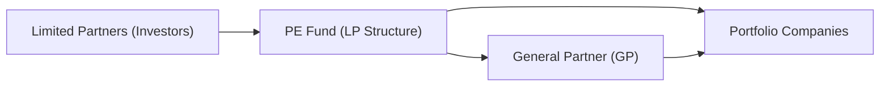
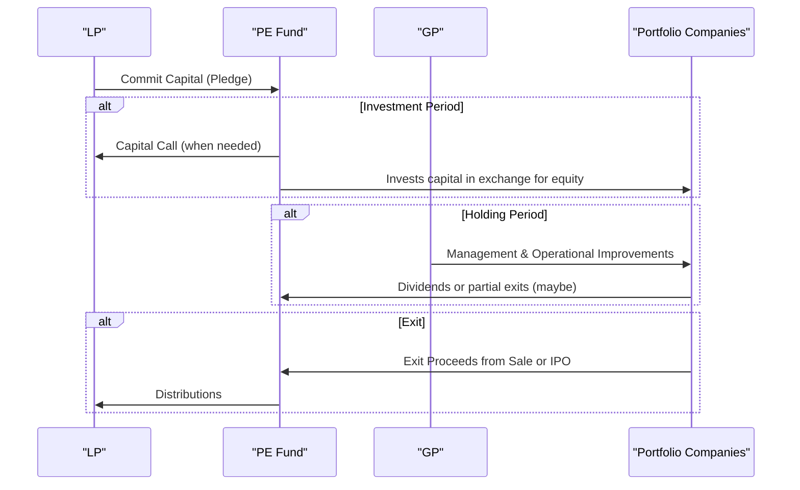

## 8.2 Private Equity Valuation and Performance

Private equity has this almost mysterious aura about it. You hear about venture capitalists backing the next big tech startup, or about huge leveraged buyouts that reshape entire industries. And maybe you’ve wondered, “What on earth actually goes on inside these private equity deals?” Well, you’re not alone. In fact, I vividly recall getting coffee with an old friend (a former startup founder) who told me all about the roller coaster ride of raising his seed round. He was excited and terrified at the same time—mostly because the valuation metrics and fund structures felt so different from public market investing. 

So let’s walk through the funhouse that is private equity. We’ll talk about the different types of private equity investments, how they’re structured, what the typical fees look like, how valuations and performance are measured, and even where regulators step in. By the end of this discussion, you should be able to confidently decode the mechanics of private equity—whether you’re analyzing a venture capital position or a large buyout.

---

### Introduction

Private equity is essentially about investing in private companies (or taking publicly traded companies private) with the aim of creating value and eventually exiting at a higher valuation. These strategies can range from seed-stage ventures that might still be drawing on whiteboards, to well-established companies in need of a shakeup or a succession plan. The fundamental objective is always to generate attractive returns by taking on risk in less liquid, less transparent markets.

Private equity has grown significantly in both the U.S. and Canada, with robust regulatory frameworks in place. In the U.S., private equity funds typically rely on exemptions under SEC Regulation D, and in Canada, accredited investors access these funds through Canadian Securities Administrators (CSA) and relevant provincial regulations. Regardless of where the investment takes place, the underlying dynamics of private equity remain fairly similar.

---

### The Private Equity Spectrum

Private equity is not a one-size-fits-all world. Most investors sort the landscape into three broad categories: Venture Capital, Growth Equity, and Buyouts.

#### Venture Capital (VC)  
Venture capital refers to funding for early-stage companies—from seed round to later-stage Series financing. If you’ve heard about hot tech startups in Silicon Valley or Vancouver’s blossoming AI sector, that’s the domain of VC. VCs typically take minority stakes in these young companies, providing capital in exchange for equity.  

• Seed capital: Very early funding—sometimes a few friends, a couple of angel investors, or specialized VC firms backing an idea or a minimally viable product.  
• Series A, B, and beyond: Subsequent rounds to finance product development, customer acquisition, or expansion into new markets.  

A key concept in venture capital is pre-money vs. post-money valuation. Pre-money is the company’s value before the new investments come in, and post-money is the value after the round closes (i.e., pre-money plus the new capital).

#### Growth Equity  
Growth equity sits between VC and full-on buyouts. It involves financing established businesses looking to scale, expand product lines, or enter new geographies. Think of a decent-sized software platform generating revenue, but wanting to triple in size in the next few years. Growth equity investments are typically less risky than pure early-stage VC but still have significant upside potential.

#### Buyouts (LBOs, MBOs)  
Buyouts involve acquiring a controlling stake (often 100%) of a mature company. Leveraged buyouts (LBOs) use a mix of equity from the private equity fund and debt (often raised against the target company’s own assets) to finance the deal. Management buyouts (MBOs) happen when a company’s existing management team partners with a private equity firm to acquire the business. Buyouts aim to restructure operations, optimize cash flows, and eventually sell or take the company public again when the time is right.

These segments often overlap in real life, but they do paint a nice broad picture of where private equity dollars go.

---

### Fund Structures

Private equity funds in the U.S. and Canada are typically structured as limited partnerships (LPs). If you recall the idea from earlier chapters in this book, a limited partnership has:

• A general partner (GP): Responsible for investment decisions, day-to-day operations, deal sourcing, and portfolio monitoring. Usually an experienced group of investment professionals.  
• Limited partners (LPs): Passive investors who provide capital. They can be institutional players such as pension funds, insurance companies, endowments, or accredited individuals.  

Management fees (often 1.5% to 2.5% of committed capital) flow to the GP, and there’s carried interest (or “carry”)—a share of the profits (often 20%)—once certain return hurdles are met. We’ll get into more detail on fees in a later section, but for now, just remember that the GP is typically highly incentivized to make successful investments.

The partnership usually has a fixed life (often 10 years) with the possibility to extend by a few years. The first few years focus on identifying deals and deploying capital (investment period). The next several years typically involve monitoring, value creation, and eventually exiting the investments through sales or initial public offerings (IPOs).

---

### Valuation of Portfolio Companies

Valuing private companies can be trickier than valuing public ones. There’s no transparent market pricing, so we often rely on:

#### Comparable Company (Market Multiple) Approach  
Here, you select a set of comparable public companies. Maybe you’re analyzing a niche software company that’s somewhat similar to publicly listed software firms. You look at valuation multiples like EV/EBITDA, EV/Sales, or Price/Earnings from the public peers. Then you adjust these multiples up or down depending on factors like growth potential, market size, risk, or intangible assets.

Example:  
Say the median EV/EBITDA multiple for comparable software companies is around 10x. If our target has an EBITDA of $5 million, an initial “headline” valuation might be 10 × 5 = $50 million in enterprise value. Then you’d consider differences in scale, region, or synergy potential. If the target is smaller or less mature, you might discount that multiple.

#### DCF Approach  
Discounted Cash Flow (DCF) involves projecting future cash flows and discounting them back at an appropriate rate of return. The discount rate should reflect the higher risk and illiquidity typical of private equity investments.  

At an early stage, these future cash flows can be extremely uncertain, so you’ll often spend a lot of time stress-testing assumptions, building best-case and worst-case scenarios (sometimes covered in advanced simulation methods in Chapter 1.6).

Let’s say you project free cash flows for 5 to 7 years and then apply a terminal value. Then you discount everything back at, for instance, a Weighted Average Cost of Capital (WACC) loaded with a risk premium. The result is your present value estimate. Often, comparing the DCF result with the market multiple approach gives you a nice valuation range.

#### Pre-Money vs. Post-Money Valuation  
In venture capital deals, the difference between pre-money and post-money can be a source of confusion. If a company’s pre-money valuation is $20 million, and new investors put in $5 million, the post-money valuation is $25 million. The new investors typically own ($5 million / $25 million) = 20% of the company, on a fully diluted basis. Conversely, older investors or founders see their ownership percentage diluted, though the hope is that the capital injection accelerates growth and increases overall value.

---

### Performance Measurement Metrics

Private equity performance is a bit more complicated than simply looking at returns on a public stock. Funds are closed-end, illiquid, and capital is called down throughout the investment period. Distributions come when investments exit. So we use specialized metrics:

#### Internal Rate of Return (IRR)  
IRR is the discount rate at which the net present value of all fund cash flows (capital calls and distributions) equals zero. Mathematically, we solve for r in:

$$
\sum_{t=0}^{T} \frac{CF_t}{(1 + r)^t} = 0
$$

For private equity, the IRR can be particularly sensitive to the timing of cash flows. Distributions returned early in the fund’s life can boost IRR significantly. That’s why you’ll sometimes see variations like the Modified IRR or the public market equivalent (PME) measure to compare to a public benchmark.

#### TVPI (Total Value to Paid-In Capital)  
TVPI = (Distributed Capital + Unrealized Value) / Paid-In Capital.  
This ratio includes both realized (cash) distributions and the current valuation of unrealized investments. It shows how much value has been generated, relative to what has been invested.

#### DPI (Distributed to Paid-In Capital)  
DPI = Cumulative Distributions / Paid-In Capital.  
This ratio focuses purely on how much cash has actually been returned to investors. Think of it as a measure of “money back in your pocket.”

#### RVPI (Residual Value to Paid-In Capital)  
RVPI = Unrealized Value / Paid-In Capital.  
This helps investors see how much is still locked up in current holdings. A high RVPI might mean the fund has potential, but also that returns aren’t realized yet.

---

### Fee Structures

Fees can heavily impact net returns. Honestly, I remember once being in a meeting where an LP was astonished that after the management fees and carried interest, his net returns looked nothing like the “headline IRR” that was pitched.

• Management Fees: Typically around 1.5% to 2.5% of committed capital per year, often stepping down after the investment period. These fees go toward salaries, rent, overhead, and general operational expenses of the GP.  
• Carried Interest (“Carry”): The GP’s share of profits, often 20% of gains once a certain hurdle rate (e.g., 8% preferred return to LPs) is cleared.  
• Clawback Provisions: Ensure that if early deals realize big gains and the GP receives carry, but later deals go poorly, the GP returns excessive carry to investors. This is to make sure the GP doesn’t walk away with disproportionate gains over the entire life of the fund.

---

### Regulatory Considerations

Private equity funds typically operate under exemptions from registering as public offerings. In the U.S., funds may rely on Regulation D, which restricts solicitations to accredited investors. The SEC registers certain fund advisers under the Investment Advisers Act, imposing fiduciary duties and reporting obligations.

In Canada, private equity offerings often rely on the accredited investor exemption under various provincial regimes. The Canadian Securities Administrators (CSA) coordinate national instruments, but each province has its own regulator. Although this might sound complicated, the key is always that private equity remains a domain for sophisticated or well-capitalized investors who understand the risks.

Increasingly, we see an emphasis on ESG (Environmental, Social, and Governance) norms in private equity, with some regulators offering guidance on ESG disclosures. If a private equity firm invests in a target with obvious environmental red flags, for instance, or poor stakeholder governance, that could raise both regulatory and reputational concerns down the line.

---

### Glossary

• **General Partner (GP):** Manages the private equity fund, sources deals, and executes investments.  
• **Limited Partner (LP):** Provides most of the capital, usually with limited liability. Often pension funds, institutional investors, or high-net-worth individuals.  
• **Clawback Provision:** Forces GPs to return previously distributed carry to ensure fairness over a fund’s lifecycle.  
• **Pre-Money Valuation:** Value assigned to a company before a new round of financing.  
• **Post-Money Valuation:** Value assigned to a company after including the new contributed capital.  
• **Management Fee:** Annual fee (commonly calculated on committed capital) that covers the fund’s operational expenses.  
• **ESG Diligence:** Assessing environmental, social, and governance factors within target companies, increasingly critical for compliance and reputation.

---

### Best Practices, Pitfalls, and a Quick Anecdote

You know what still keeps me up at night? The memory of a private equity GP who never prepared for macro downturns. He just assumed the debt markets would always be wide open to refinance or re-leverage. Then, during a credit crunch, his portfolio companies struggled fundraising, forcing significant markdowns. The moral? Stress-test and scenario-plan. Illiquid investments can be vulnerable to unexpected shifts in credit availability or sector demand.

Common pitfalls include:  
• Overuse of leverage in buyouts, leading to potential default when interest rates rise.  
• Overestimating the projected growth rate in a DCF.  
• Not fully accounting for management fees and the layering effect of transaction fees and other fund expenses.  
• Ignoring ESG risks that might come back to bite you if an investment faces regulatory or reputational backlash.

On the flip side, successful private equity deals can produce outsize returns, especially through operational improvements, cost optimizations, and strategic expansions. 

---

### Diagram of a Typical Private Equity Fund Structure

Below is a simplified Mermaid diagram showing the typical relationships among GPs, LPs, and portfolio companies:

This diagram highlights how limited partners commit capital into the fund, the general partner manages and deploys that capital, and the fund invests in one or more portfolio companies.

---

### Illustration of Private Equity Cash Flows Over Time

Another diagram can help visualize the typical cash flows in a private equity context, from capital calls to eventual distributions:

Capital is called from the LP as the fund identifies investments. Over the holding period, the GP works with portfolio companies to enhance value. Profits are eventually returned to LPs through distributions.

---

### Exam Tips Focus

When thinking about the CFA® Level II exam:

• Understand how IRR, TVPI, DPI, and RVPI relate to each other and to the timeline of investment.  
• Practice IRR calculations with uneven cash flow streams—this is a classic exam scenario.  
• Know the difference between pre-money and post-money valuation—especially in venture capital contexts.  
• Be comfortable applying both market multiples and DCF approaches to private company valuations, citing the relevant risk premiums.  
• Remember the key aspects of fund structures: who’s the GP, who’s the LP, how are fees collected, and how is carry distributed?  
• Regulatory frameworks (Reg D in the U.S., CSA in Canada) often appear in exam questions testing your understanding of why private equity invests primarily come from accredited or institutional investors.

---

### References and Further Reading

• CFA Institute, Level II Curriculum (Alternative Investments)  
• “Private Equity Demystified” by John Gilligan and Mike Wright  
• McKinsey & Company, Global Private Markets Review  
• Canadian Venture Capital & Private Equity Association (CVCA): https://www.cvca.ca  
• Securities and Exchange Commission (SEC): https://www.sec.gov  

---

## Test Your Knowledge: Private Equity Valuation and Performance Quiz



### Which statement best describes pre-money valuation?

- [ ] It is the value of a company immediately after the funding round closes.
- [x] It is the company’s valuation prior to receiving new equity capital.
- [ ] It includes both the existing valuation and the newly injected cash from investors.
- [ ] It is the post-exit valuation projection provided by external auditors.

> **Explanation:** Pre-money valuation represents the valuation of the company before any new capital from the incoming financing round is factored in.  

### Which of the following ratios measures both realized and unrealized returns?

- [ ] DPI
- [ ] RVPI
- [x] TVPI
- [ ] IRR

> **Explanation:** TVPI (Total Value to Paid-In) = (Distributed + Unrealized Value) / Paid-In Capital. DPI measures only realized returns, and RVPI measures only unrealized returns.  

### What is the primary driver behind carried interest in a private equity fund?

- [ ] Providing a guaranteed annual distribution to LPs.
- [ ] Covering annual operating expenses.
- [x] Incentivizing the GP to generate above-hurdle returns for LPs.
- [ ] Satisfying quarterly regulatory filings.

> **Explanation:** Carried interest is the share of profits (often 20%) awarded to the GP if returns exceed a certain hurdle, aligning the GP’s interest with LPs’ performance goals.  

### How does a clawback provision protect LPs?

- [ ] It ensures the GP only pays taxes on profits above a certain threshold.
- [x] It requires the GP to return excess carried interest if subsequent deals underperform.
- [ ] It reduces the management fees charged every year.
- [ ] It adjusts the capital calls so LPs pay in less during the final years of the fund.

> **Explanation:** The clawback mechanism ensures that if earlier deals generated high carry but later deals lost money, the GP must return some of the carry to fairly align total realized returns for LPs.  

### In a venture capital context, a post-money valuation of $10 million with a $2 million investment implies:

- [ ] A pre-money valuation of $2 million.
- [x] A pre-money valuation of $8 million.
- [ ] The new investors own 10% of the company.
- [ ] The new investors own half the company.

> **Explanation:** Post-money valuation = pre-money valuation + new investment. Here, $10 million = pre-money + $2 million, so the pre-money is $8 million.  

### Where is private equity regulation most likely found in the U.S.?

- [ ] Federal Reserve’s Regulation T
- [ ] FDIC guidelines overseeing commercial banks
- [x] Exemptions under SEC Regulation D
- [ ] FINRA regulations for broker-dealers only

> **Explanation:** In the U.S., private equity funds typically rely on exemptions under SEC Regulation D, which allows them to accept money from accredited investors without registering as public offerings.  

### Which factor is typically discounted in the valuation of a private (vs. public) company?

- [x] Liquidity
- [ ] Public market data
- [ ] Government bond yields
- [ ] Tax rates

> **Explanation:** Private companies are illiquid compared to those traded on public markets, so a liquidity discount is often applied.  

### What might be a major risk of a highly leveraged buyout?

- [x] The target company could face severe financial distress or default if cash flows fail to cover debt service.
- [ ] Reduced returns for LPs if the company grows too quickly.
- [ ] Oversight from credit rating agencies that sets a minimum IRR.
- [ ] Automatically improved valuations in the first six months.

> **Explanation:** Over-leveraged buyouts risk default during economic downturns or if the acquired company’s cash flows underperform expectations.  

### Which approach is commonly used for private equity valuation?

- [ ] Random Walk Forecasting Model
- [x] Discounted Cash Flow (DCF) with added risk premiums
- [ ] Technical Charting
- [ ] Simple Price-Earnings (P/E) from arbitrary peers

> **Explanation:** A DCF approach, often with a higher discount rate to account for the risk and illiquidity, is among the most widely used methods in private equity valuation.  

### True or False: A high RVPI (Residual Value to Paid-In) implies that most of the fund’s gains have been realized.

- [ ] True
- [x] False

> **Explanation:** A high RVPI indicates that much of the fund’s value is still unrealized (i.e., still tied up in active investments), not that it has been realized.  


