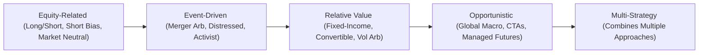
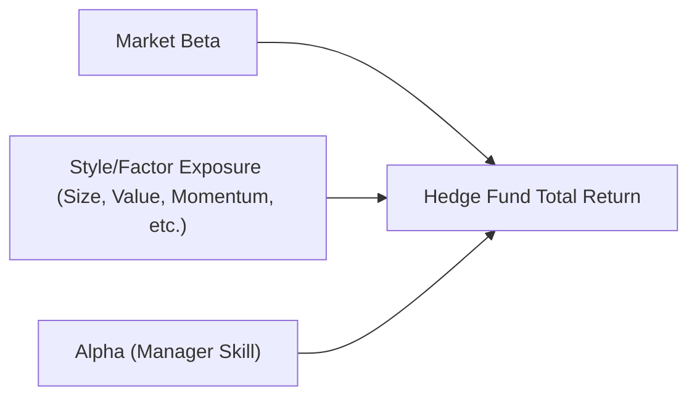

## 8.3 Hedge Fund Strategies and Analysis

Hedge funds sometimes sound like these mysterious, elusive investment vehicles that only the ultra-wealthy can access. When I first heard about hedge funds, I remember thinking, “Wow, that’s gotta be complicated stuff; I’m not even sure I’m ready to tackle that.” But here’s the thing: once you break down the strategies and the underlying motivations, hedge funds start to become a lot more understandable. That’s exactly what we’ll do here.

We’ll talk about different hedge fund strategies—like Long/Short Equity or Merger Arbitrage—and figure out the mechanics behind them. We’ll also look at how hedge funds handle leverage, short selling, and derivatives (spoiler alert: they use them a lot!). Then we’ll wrap up with factor exposures, operational due diligence (super crucial if you’re an institutional investor), and a quick talk on the regulatory environment in the U.S. and Canada.

By the end of this section, you’ll not only see the big picture of how hedge funds fit into the broader investment landscape but also gain insights into the nuts and bolts of constructing and analyzing these specialized portfolios.

---

### Hedge Fund Classification by Strategy

Hedge funds come in all shapes and sizes, each with its own approach to generating returns (or “alpha,” in fancy finance terms). Typically, strategies are grouped into five categories:

• Equity-Related (Long/Short Equity, Dedicated Short Bias, Market-Neutral)  
• Event-Driven (Merger Arbitrage, Distressed Securities, Activist Investing)  
• Relative Value (Fixed-Income Arbitrage, Convertible Bond Arbitrage, Volatility Arbitrage)  
• Opportunistic (Global Macro, Commodity Trading Advisors (CTAs), Managed Futures)  
• Multi-Strategy (combination strategies in one vehicle)

Anyway, let’s dive into each one.

#### Equity-Related Strategies
Equity-related strategies primarily involve taking positions in stocks and sometimes stock derivatives (options, equity swaps, etc.). Here are the main sub-strategies:

1. **Long/Short Equity**:  
   The manager will buy stocks that are expected to go up (long positions) and short sell those they expect to go down. The net market exposure can vary. Some managers might be net long, while others might even be net short. It’s an attempt to profit from overall stock-picking skill rather than just the general direction of the equity market.

2. **Dedicated Short Bias**:  
   This focuses on short selling, profiting when stock prices decline. It’s a high-octane strategy because markets generally (though not always) have an upward bias over time, making a purely short strategy very challenging.

3. **Market-Neutral**:  
   A market-neutral approach tries to have zero net exposure to the market. This often involves pairs trading (e.g., going long on one stock and short on a closely related stock). The idea is to extract returns from relative mispricings rather than broad market moves.

#### Event-Driven Strategies
An event-driven strategy seeks profits from situations like mergers, acquisitions, bankruptcies, reorganizations, or big corporate announcements.

1. **Merger Arbitrage**:  
   If Company A is acquiring Company B at some announced price, there may be a price gap in Company B’s shares (they might trade below the announced acquisition price). The manager tries to capture that spread, expecting the acquisition to close at the higher stated price. But if the deal falls through, watch out—losses can happen fast.

2. **Distressed Securities**:  
   Involves investing in companies that are in difficulty—sometimes on the brink of bankruptcy or already bankrupt. Managers might buy bonds or other debt instruments at big discounts, anticipating some recovery value or a profitable restructuring.

3. **Activist Investing**:
   The hedge fund takes a significant stake in a company and then pushes for specific changes (new management, cost-cutting, or even sale of the company) to unlock shareholder value. Think of big names like Carl Icahn or Bill Ackman, who often publicly engage with companies’ leadership.

#### Relative Value Strategies
The fancy term for trying to exploit mispricings between securities that should theoretically be related.

1. **Fixed-Income Arbitrage**:  
   Managers look for pricing discrepancies between different bonds or different parts of the yield curve. They often use significant leverage to capture what can be small yield differences.

2. **Convertible Bond Arbitrage**:  
   Involves buying underpriced convertible bonds (bonds that can be converted into a fixed number of shares) and hedging the equity component by shorting the issuer’s stock. The hope is that the bond’s embedded option is mispriced relative to the stock’s volatility.

3. **Volatility Arbitrage**:
   Focuses on trading options to exploit differences between implied volatility (what the market expects) and realized volatility (what actually happens). If the manager believes implied volatility is too high, they might sell options; if it’s too low, they might buy them.

#### Opportunistic Strategies
Here, managers tend not to limit themselves to just stocks or bonds. They’ll look across currencies, commodities, equities, bonds, and more—often with huge global macroeconomic bets.

1. **Global Macro**:  
   This strategy tries to profit from macroeconomic trends—like central bank policy changes, shifts in currency regimes, or interest rate movements in different countries. Managers might go long or short entire countries’ stock markets or currencies.

2. **Commodity Trading Advisors (CTAs) and Managed Futures**:  
   Futures contracts on commodities, currencies, or equity indexes are the bread and butter here. A CTA might follow a systematic trend-following model—going long in markets that are trending up, shorting those trending down.

#### Multi-Strategy
A multi-strategy hedge fund aims to combine all sorts of approaches under one roof. The big advantage? Diversification. Losses in one sub-strategy might be offset by gains in another, smoothing out overall returns.

Here’s a simple diagram to illustrate these strategy categories:

---

### Investment Characteristics and Risk Exposures

**Leverage**  
Let’s be real: a lot of hedge funds love leverage. Who doesn’t like to amplify returns, right? By borrowing capital (either through margin from prime brokers or via more structured forms of debt), hedge funds can control more assets than they have cash on hand. Of course, if markets go the wrong way, those positions unwind quickly, and it’s not pretty.

**Short Selling**  
Shorting is something hedge funds often do as part of their bread-and-butter operations. With short selling, you borrow a security and then sell it, hoping to buy it back cheaper later. This can be a powerful way to hedge market exposure or express a negative view on a company or sector.

**Derivatives**  
Futures, options, swaps—the list goes on. Hedge funds use derivatives for both risk management (hedging) and speculative positioning. For example, a fund might use interest rate swaps to hedge interest rate risk or currency futures to hedge foreign exchange exposure.

One personal reflection: When I first saw all the derivatives in a hedge fund portfolio, I felt a bit intimidated. But once you understand why they’re using them—like hedging currency exposure for an overseas investment—it starts to feel more logical.

---

### Factor Exposures and Risk Decomposition

Even though hedge funds pitch themselves as “absolute return” vehicles that produce alpha, a decent chunk of their returns often can be chalked up to exposure to common risk factors. If you do a factor analysis, you might find:

• **Market Beta**: A portion of returns tied to general equity or bond market movements.  
• **Size Factor**: Tilts toward small-cap or large-cap stocks.  
• **Value or Growth Factor**: Tilts toward undervalued “value” stocks or faster-growing “growth” stocks.  
• **Momentum Factor**: Tendency to buy recent winners and sell recent losers.  

Managers strive to generate positive alpha—returns uncorrelated with those factors. But in practice, some strategies end up with significant factor exposures, so the “hedge” in hedge fund might not always mean little or no correlation to the market.

Below is a simple conceptual diagram showing how hedge fund returns (Total Return) might be decomposed into factor-based beta components and residual alpha:

Interpretation: The “Hedge Fund Total Return” can be broken down into Market Beta + Factor Exposures + Manager’s Alpha. In practice, we use statistical methods (like multivariate regression) to estimate how much of the return is explained by each piece.

---

### Operational Due Diligence

No matter how appealing a strategy might be, poor operations can sink the best of funds. Operational due diligence aims to ensure that a hedge fund manager (and the management company) has good controls, proper governance, and reliable business continuity plans. Some big items:

• **Manager Background**: Who are the fund principals? Have they ever been involved in regulatory or legal troubles?  
• **Risk Control Systems**: Are positions and exposures monitored in real-time or near real-time?  
• **Governance**: Is the fund’s board of directors effective? Do they exercise oversight?  
• **Valuation Policies**: How does the fund value illiquid or complex instruments?  
• **Business Continuity and Disaster Recovery**: Are they prepared for unexpected disruptions?  
• **Fraud Prevention**: Independent service providers, audits, and third-party fund administrators reduce operational risk.

It might sound dry, but operational due diligence has saved many institutional investors from Bernie Madoff-type fiascos. It’s like wearing a seatbelt—could feel like a chore, but it’s essential.

---

### Regulatory Environment

**United States**  
Hedge funds in the U.S. often rely on exemptions from the Investment Company Act of 1940 to avoid being treated like mutual funds. Many register as investment advisers under the Investment Advisers Act of 1940 (if they manage a certain amount of assets). Because of these exemptions, they can have fewer restrictions on leveraging or short selling. However, post-financial-crisis regulatory changes (like the Dodd-Frank Act) mean more reporting requirements (e.g., Form PF) for large hedge fund advisers.

**Canada**  
The Canadian environment has some parallels, but managers typically need to register as “portfolio managers” and “investment fund managers” under provincial rules, regulated by the Canadian Securities Administrators (CSA). Funds distributed in Canada can also come under the oversight of the Investment Industry Regulatory Organization of Canada (IIROC). There might be offering memorandums for accredited investors, and the rules can differ among provinces.

---

### Common Hedge Fund Terms (Glossary)

• **High-Water Mark**: If the fund’s NAV (net asset value) slumps, the manager only earns incentive fees once the NAV surpasses its previous peak. This prevents charging fees multiple times on the same gains.  
• **Gate Provision**: Limits how much can be withdrawn during any redemption period. If redemption requests exceed that threshold, investors’ proceeds are partially deferred.  
• **Lock-Up Period**: A timeframe during which new investors can’t redeem their money (e.g., the first year or two).  
• **Hurdle Rate**: The minimum return threshold a manager must achieve before incentive fees are applied (often pegged to a benchmark like LIBOR/SOFR + a spread).  
• **Global Macro Strategy**: Seeks to profit from big-picture macro trends in currencies, bonds, equities, and commodities.  
• **Merger Arbitrage**: Profiting from price discrepancies relating to M&A announcements.  

---

### Putting It All Together

Hedge funds represent a wide universe of investment strategies. Unlike some conventional mutual funds, they harness flexibility—leverage, short selling, derivatives, and unconstrained mandates. That’s both exciting and risky. From an analyst or investor standpoint, understanding the risk factor exposures and operational framework is at least as important as buying into the pitch of a star manager.

When you analyze a hedge fund strategy, it’s often about recognizing:
• How do returns relate to broad market moves (beta)?  
• Where might hidden factor exposures lie (value, momentum, etc.)?  
• Does the manager demonstrate true alpha generation?  
• Are business operations robust?  

The next time you see a hedge fund marketing deck, look under the hood. Maybe do a factor decomposition. Check who’s auditing the fund or how valuations are handled. That’s the real heart of hedge fund due diligence—definitely more than just scanning their monthly returns.

---

### References and Further Reading

- CFA Institute, Level II Curriculum (Alternative Investments)  
- François-Serge L’habitant, “Handbook of Hedge Funds”  
- Managed Funds Association (MFA): [https://www.managedfunds.org](https://www.managedfunds.org)  
- Alternative Investment Management Association (AIMA): [https://www.aima.org](https://www.aima.org)

---

### Final Exam Tips for Hedge Fund Strategies

1. Know Your Strategy Buckets: Be able to differentiate between Equity-Related, Event-Driven, Relative Value, Opportunistic, and Multi-Strategy approaches.  
2. Understand Leverage and Short Selling: The exam loves to test your understanding of how leverage amplifies returns (and losses!) and how short positions work.  
3. Be Comfortable with Factor Analysis: Practice identifying how much of a hedge fund’s return stems from systematic factors (market beta, style factors) versus genuine alpha.  
4. Operational Due Diligence Essentials: memorizing technical stuff like high-water marks and gate provisions helps, but also understand the broader idea of how vital operational oversight is.  
5. Regulatory Nuances: Know the key differences between U.S. and Canadian requirements, plus why hedge funds prefer certain exemptions and structures.  

This is a topic prone to scenario-based questions—like a vignette describing a fund’s strategy and risk approach—so watch for subtle clues.

---

## Test Your Knowledge: Hedge Fund Strategies & Analysis



### Which of the following best describes a market-neutral hedge fund strategy?

- [ ] It always maintains a net long bias to equities.
- [x] It attempts to have zero exposure to the overall market’s directional moves.
- [ ] It focuses exclusively on short selling.
- [ ] It only invests in distressed debt.

> **Explanation:** A market-neutral strategy is one where the hedge fund tries to offset all market risk by balancing long and short positions, leaving the portfolio hedged against broad market movements.

### In a merger arbitrage strategy, a common risk arises when:

- [ ] The market continues to rally and the shorted securities increase in value.
- [x] The proposed deal does not go through and the target’s share price falls significantly.
- [ ] Relative value trades widen contrary to the manager’s predictions.
- [ ] There is an unexpected hike in interest rates.

> **Explanation:** Merger arbitrage often involves going long on the target company’s shares. If the merger fails, those shares typically drop, leading to substantial losses.

### Which of the following is most representative of operational due diligence?

- [x] Reviewing the fund’s governance structures, valuation policies, and background checks on the manager.
- [ ] Identifying which factors contribute to the hedge fund’s returns.
- [ ] Allocating capital among different relative value strategies.
- [ ] Determining the hedge fund’s net market exposure.

> **Explanation:** Operational due diligence focuses on the quality and reliability of a hedge fund’s operations, including governance, valuation practices, and risk management procedures.

### What is the primary function of a high-water mark in hedge fund fee structures?

- [ ] To ensure the hedge fund manager earns a higher fee if competitors outperform.
- [ ] To encourage the manager to take on more leverage.
- [x] To prevent fund managers from charging incentive fees multiple times on the same gains.
- [ ] To protect the fund from correlation risk in equities.

> **Explanation:** The high-water mark prevents managers from earning incentive fees backward on past losses, ensuring they only get performance fees on net new profits.

### A hedge fund employing a short bias strategy:

- [x] Primarily takes short positions in equities.
- [ ] Uses multi-strategy approaches across all asset classes.
- [x] May incorporate some long positions, but predominantly bets on price declines.
- [ ] Is restricted from using leverage.

> **Explanation:** A short bias fund mostly shorts stocks but may hold some long positions. It is not prevented from leverage, and typically it focuses on profiting from declining markets.

### Factor decomposition in hedge funds helps investors:

- [x] Differentiate between alpha and returns derived from known risk premia.
- [ ] Decide on which CTA strategy is best for them.
- [ ] Eliminate beta exposure from their portfolios entirely.
- [ ] Determine the best ways to implement gate provisions.

> **Explanation:** By decomposing returns into factor-based components (beta) and manager skill (alpha), investors can see whether the manager is providing real outperformance.

### Global macro hedge funds typically:

- [x] Take positions in currencies, bond markets, and stock indices based on macroeconomic themes.
- [ ] Limit themselves to U.S. equities exclusively.
- [x] Rely on short-term event-driven catalysts in a single geography.
- [ ] Have zero exposure to any foreign exchange markets.

> **Explanation:** Global macro strategies look for international or worldwide macroeconomic trends (like interest rate changes or FX moves). They can invest in multiple asset classes, often across different regions.

### A gate provision in a hedge fund:

- [x] Limits the amount of investor withdrawals in a particular redemption period.
- [ ] Prohibits the use of short selling in a given month.
- [ ] Blocks the fund manager from altering the strategy mid-year.
- [ ] Immediately suspends all trading during market volatility.

> **Explanation:** Gate provisions are designed to protect the fund from large, simultaneous redemption requests that could force asset firesales.

### In the United States, hedge funds often rely on exemptions from:

- [x] The Investment Company Act of 1940.
- [ ] The Federal Deposit Insurance Corporation (FDIC) Act.
- [ ] The Employee Retirement Income Security Act (ERISA).
- [ ] Sarbanes-Oxley requirements for public companies.

> **Explanation:** Hedge funds typically avoid registration as mutual funds by operating under exemptions in the Investment Company Act of 1940. They still may need to register under the Investment Advisers Act depending on AUM.

### True or False: In Canada, hedge fund managers must be registered as portfolio managers or investment fund managers under provincial rules.

- [x] True
- [ ] False

> **Explanation:** Yes, Canadian regulations require hedge fund managers to register as portfolio managers and often as investment fund managers depending on the structure, regulated by provincial securities commissions.


