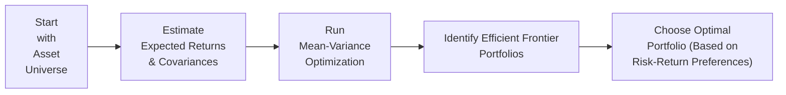

## 9.1 Portfolio Risk and Return Measurement

Picture this: You’ve finally got your hands on a little bit of extra money, so you decide to invest in a couple of stocks—maybe one stable utility company and another high-flying tech startup. If you simply wanted to measure the overall performance of these two investments, you’d naturally want to figure out the combined return. But once your roommate tells you that you should also pay attention to “risk,” you might start wondering how these two investments affect each other. Do they move up and down together (high correlation)? Or do they zig when the other zags (negative correlation)? Understanding these relationships is absolutely crucial for building that legendary “well-diversified” portfolio every textbook raves about. So let's roll up our sleeves and talk about how to measure both the risk and return of an entire portfolio—and why it matters so much.

---

### Why Risk and Return Matters
Risk and return go hand in hand. Most of us realize that higher returns often mean higher risk, right? But how do we measure “portfolio risk” exactly? Let’s dive into the building blocks—weighted average returns, correlations, total risk, systematic vs. unsystematic risk, and how models like the Capital Asset Pricing Model (CAPM) help us connect these concepts into actionable insights.

---

### Understanding Weighted Average Return

A portfolio is just a combination of individual assets—like stocks, bonds, or even alternative investments—each with its own return. One of the simplest ways to compute total portfolio return is by taking the weighted average of each asset’s return. The formula is:


R_p = \sum_{i=1}^{n} w_i R_i


where:
• \\( R_p \\) = Portfolio return  
• \\( w_i \\) = Weight of asset \\( i \\) in the portfolio (decimal form)  
• \\( R_i \\) = Return of asset \\( i \\)

Weights ( \\( w_i \\) ) represent the fraction of your total investment allocated to each asset—like 50% in a tech stock and 50% in a utility stock. If your tech stock returns 10% and your utility stock returns 5%, the portfolio return (if both are equally weighted) is simply \\( 0.5 \times 10\% + 0.5 \times 5\% = 7.5\% \\). Easy enough.

---

### The Role of Variance, Covariance, and Correlation

Well, that was straightforward. But measuring **portfolio risk**—the variability or uncertainty in returns—is slightly more involved. Specifically, the variance of a portfolio depends not just on how volatile each asset is, but also on how the assets move relative to each other. Two core concepts here:

1. **Variance**: A measure of how an individual asset’s returns fluctuate around their average.  
2. **Covariance and Correlation**: They capture how two assets move together.

The variance of a two-asset portfolio is often written as:


\sigma_p^2 = w_A^2 \sigma_A^2 + w_B^2 \sigma_B^2 + 2 w_A w_B \mathrm{Cov}(R_A, R_B)


where:  
• \\( \sigma_A^2 \\) and \\( \sigma_B^2 \\) = variances of assets A and B  
• \\( \mathrm{Cov}(R_A, R_B) \\) = covariance between assets A and B

Covariance measures how two returns move in tandem. Correlation ( \\( \rho_{A,B} \\) ), on the other hand, is just a standardized version of covariance:


\mathrm{Cov}(R_A, R_B) = \rho_{A,B} \, \sigma_A \, \sigma_B


• \\( \rho_{A,B} \\) ranges from –1 (perfectly negative correlation) to +1 (perfectly positive correlation).  

A negative correlation (like –0.8) is super-useful because it indicates that when one asset moves up, the other tends to move down, which can reduce overall portfolio volatility. By combining assets that are less than perfectly correlated, an investor can reduce the risk of the total portfolio without necessarily reducing expected return. That’s why a well-chosen mix of stocks, bonds, and alternative investments often keeps the ride smoother for your portfolio.

---

### Mean-Variance Optimization

At the heart of Traditional Portfolio Theory is the concept of **Mean-Variance Optimization (MVO)**. Trust me, this fancy term might sound intimidating, but it’s simply the process of picking a portfolio that tends to maximize the expected return for a given amount of risk (or equivalently minimizes risk for a desired level of return).

In MVO, you typically specify or estimate:
• Expected returns for your assets  
• Variance (or standard deviation) for each asset (their individual risk)  
• Covariances between every pair of assets  

An optimizer then analyzes all possible weight combos to find the “efficient frontier”—that set of portfolios offering the highest expected return for a given level of risk. If you studied the formula for variance above, you’ll see that correlation is a big deal. Low- or negative-correlation assets can drastically reduce portfolio variance. In practice, you’d probably use software tools or a specialized optimization solver to find that efficient mix.

Here’s a simple illustrated diagram of what the process might look like:

In everyday investing, you might not code optimization algorithms from scratch, but many portfolio managers do rely on some form of mean-variance logic to figure out optimum asset allocations.

---

### Systematic vs. Unsystematic Risk

When we talk about “portfolio risk,” we can slice it into two main categories:
1. **Systematic Risk (Market Risk):** This is the risk that affects all companies—think economic recessions, geopolitical events, or changes in interest rates. You can’t eliminate it by diversifying your portfolio, because it’s essentially “in the air.”  
2. **Unsystematic Risk (Idiosyncratic Risk):** This is risk specific to an individual company or sector—like a CEO scandal or poor product launch for a single firm. By spreading your investments across multiple assets and sectors, you can mostly get rid of this unsystematic risk.

A well-diversified portfolio still faces systematic risk, but the unsystematic risk largely fizzles away as you add more and more uncorrelated assets. Many experienced investors aim to hold enough assets such that any one blow-up doesn’t sink the entire ship. 

I once had a friend—let’s call her Linda—who invested heavily in just one biotech stock because she “loved the future of gene editing.” She ended up losing a huge chunk of money when an unexpected FDA ruling hammered the stock. Afterward, Linda said something like, “Wow, I guess I learned about unsystematic risk the hard way.” Indeed.

---

### Capital Asset Pricing Model (CAPM) and Beta

Enter the **Capital Asset Pricing Model (CAPM)**, a cornerstone of modern finance. It might sound abstract, but it’s just a model that says expected return on a particular asset (or portfolio) is related to how that investment moves with the overall market. The key measure: **beta**.


\beta_i = \frac{\mathrm{Cov}(R_i, R_m)}{\sigma_m^2}


where:
• \\( R_i \\) = return on asset \\( i \\)  
• \\( R_m \\) = return on the market  
• \\( \sigma_m^2 \\) = variance of the market index  

An asset with a beta above 1 is more volatile than the market. Below 1, less volatile. Beta essentially captures **systematic risk**—the asset’s sensitivity to those broad market swings.

CAPM states that the expected return ( \\( E[R_i] \\) ) on an asset can be estimated via:


E[R_i] = R_f + \beta_i \left( E[R_m] - R_f \right)


where:
• \\( R_f \\) = risk-free rate  
• \\( E[R_m] - R_f \\) = market risk premium  

The idea is that you can’t expect to earn “extra” returns above the risk-free rate unless you take on some market risk. CAPM is a big deal in the context of portfolio management because it helps you figure out how much return you should demand for a given level of systematic risk.

---

### Measuring Risk: Ex-Ante vs. Ex-Post

When we estimate an asset’s expected return or volatility going forward, we call it “ex-ante.” That’s basically you staring into a crystal ball (or a big data feed) to guess future performance and risk. When we look backward at what actually happened, we call it “ex-post.”

• **Ex-ante**: Forward-looking estimates, crucial when constructing portfolios because you care about future outcomes.  
• **Ex-post**: Historical data, super-useful for **evaluation** or **performance tracking** but might not always reflect the future environment (especially if market conditions have changed significantly).

In real investment management, we combine both: ex-post data to refine our ex-ante forecasts, but we always remember that the future can differ drastically from the past (sometimes painfully so).

---

### Performance Metrics: Sharpe Ratio, Treynor Ratio, and Beyond

Once you build a portfolio, you’ll naturally want to know how well it performs relative to risk. This is where popular risk-adjusted performance measures come in:

#### Sharpe Ratio
It’s defined as:


\text{Sharpe Ratio} = \frac{R_p - R_f}{\sigma_p}


where:
• \\( R_p \\) = portfolio return  
• \\( R_f \\) = risk-free rate  
• \\( \sigma_p \\) = standard deviation (total risk) of the portfolio  

The Sharpe ratio helps you compare portfolios on the basis of how effectively they convert risk into excess returns. A higher Sharpe ratio is obviously better. However, if a portfolio’s returns are generated by taking huge systematic risk, the Sharpe ratio might not fully capture that nuance if you’re ignoring how that risk is correlated with the market.

#### Treynor Ratio
The Treynor ratio is similar, but it uses beta instead of standard deviation:


\text{Treynor Ratio} = \frac{R_p - R_f}{\beta_p}


You might say the Treynor ratio focuses on systematic risk alone, making it handy when you want to see how a portfolio’s returns compensate for the unavoidable ups and downs of the market.

---

### Limitations of Traditional Risk Measures

While standard deviation, beta, Sharpe, and Treynor ratios are widely used, they can miss some real-world challenges:

• **Tail Risk**: Extreme events, like in a market crash, might not be well-captured by standard deviation. Real-world returns often have “fat tails”—meaning big losses can happen more often than a normal distribution implies.  
• **Liquidity Risk**: If you hold illiquid assets, you might not be able to sell them quickly without a big price discount, a factor that typical variance measures do not incorporate.  
• **Non-normal Distributions**: Many asset classes exhibit skewness (lopsided returns) or kurtosis (extreme tails), which complicates mean-variance analysis.

It’s kind of like you’re measuring a human’s health by their average body temperature when you actually should also check their diet, lifestyle, and maybe a few lab tests. Relying on a single measure of risk can be perilous.

---

### Case Study: A Simple Three-Asset Portfolio

Let’s see a quick numeric example. Suppose you have three assets in your portfolio: A, B, and C.

• Current weights: \\( w_A = 0.4 \\), \\( w_B = 0.3 \\), \\( w_C = 0.3 \\).  
• Expected returns: \\( E[R_A] = 8\% \\), \\( E[R_B] = 10\% \\), \\( E[R_C] = 6\% \\).  
• Standard deviations: \\( \sigma_A = 12\% \\), \\( \sigma_B = 18\% \\), \\( \sigma_C = 9\% \\).  
• Correlation matrix ( \\(\rho\\) ):

|         |   A  |   B  |   C  |
|---------|------|------|------|
| A       | 1.0  | 0.2  | 0.4  |
| B       | 0.2  | 1.0  | –0.1 |
| C       | 0.4  | –0.1 | 1.0  |

First, the expected portfolio return is:

R_p = 0.4 \times 8\% + 0.3 \times 10\% + 0.3 \times 6\% = 7.6\%.


Next, to find the portfolio variance, we sum up each asset’s variance contribution plus the covariance terms:


\sigma_p^2 = w_A^2 \sigma_A^2 + w_B^2 \sigma_B^2 + w_C^2 \sigma_C^2 
+ 2\, w_A w_B \rho_{A,B} \sigma_A \sigma_B 
+ 2\, w_A w_C \rho_{A,C} \sigma_A \sigma_C 
+ 2\, w_B w_C \rho_{B,C} \sigma_B \sigma_C.


From the correlation matrix, we see B and C are slightly negatively correlated, which helps reduce the portfolio’s overall variance. You would likely tack all these numbers in a spreadsheet, run the calculations, and you’d see a total portfolio standard deviation that’s lower than a simple average of the individual volatilities. That’s the power of diversification in action.

---

### Best Practices and Common Pitfalls

• **Overconfidence in Historical Data**: We all love historical data, but be prepared that it might not accurately predict future returns or correlations.  
• **Ignoring Correlations**: If assets are more correlated than you assumed, your portfolio risk might be higher than your spreadsheet told you.  
• **Forgetting Liquidity and Transaction Costs**: In real life, rebalancing your portfolio frequently can rack up costs, and illiquid assets can skew your risk in tough market conditions.  
• **Blindly Relying on CAPM or Beta**: CAPM is grounded in a list of assumptions (e.g., markets are frictionless, investors can short sell, etc.). Beta might shift over time, so keep an eye on changing market conditions.  

---

### Personal Reflection

I remember the first time I built a small equity portfolio. I was so excited about each individual stock’s potential return that I forgot to check correlation. It was only after the portfolio tanked one week—because every stock in my portfolio was in the same cyclical sector—that I realized I'd basically layered the same risk on top of itself. Ever since, correlation is the first thing I check.

---

### Conclusion and Final Exam Tips

Portfolio risk and return measurement is about balancing the potential for higher gains with the reality that losses can occur—sometimes unexpectedly. From the basics of weighted average returns to the intricacies of covariance, diversification, CAPM, and risk-adjusted metrics such as Sharpe and Treynor, each concept plays a unique role in building and evaluating a sound portfolio.

As you prepare for the exam, focus on these core elements:
• Know your formulas (portfolio variance, Sharpe, Treynor, CAPM) by heart.  
• Understand conceptual differences (systematic vs. unsystematic risk, ex-ante vs. ex-post).  
• Practice numeric examples and watch for correlation implications.  
• Evaluate the assumptions behind each model—real exam questions often require conceptual insight, not just plugging in numbers.  

Being able to piece these components together will help you interpret vignettes quickly and accurately.

---

### References

- CFA Institute Program Curriculum, Level II, Portfolio Management Readings.  
- Elton, E. J., & Gruber, M. J. (2019). Modern Portfolio Theory and Investment Analysis.  
- Reilly, F. K., & Brown, K. C. (2020). Investment Analysis & Portfolio Management.

---

## Test Your Knowledge: Portfolio Risk & Return Measurement Quiz



### Which of the following formulas correctly represents the variance of a two-asset portfolio?

- [ ] σᵖ² = w₁σ₁² + w₂σ₂²
- [ ] σᵖ² = (w₁ + w₂)(σ₁ + σ₂)² 
- [x] σᵖ² = w₁²σ₁² + w₂²σ₂² + 2w₁w₂Cov(R₁, R₂)
- [ ] σᵖ² = √(w₁²σ₁² + w₂²σ₂²)

> **Explanation:** The correct formula includes the individual variances of the assets and the covariance term, reflecting how the two assets move together (or apart).

### Consider a well-diversified portfolio’s risk profile. Which type of risk can be almost fully mitigated by diversification?

- [x] Unsystematic (idiosyncratic) risk
- [ ] Systematic (market) risk
- [ ] Interest rate risk
- [ ] Liquidity risk

> **Explanation:** Unsystematic risk can be diversified away by holding a variety of assets. Systematic risk affects the entire market and cannot be eliminated by diversification alone.

### What does β (beta) measure in the CAPM framework?

- [ ] The risk-free rate
- [ ] The total risk of a portfolio
- [ ] Unsystematic risk
- [x] The sensitivity of a security’s returns to overall market returns

> **Explanation:** Beta indicates how much a security’s returns typically move relative to the market’s returns. A beta above 1 suggests higher market sensitivity, and below 1 suggests lower sensitivity.

### When computing forward-looking portfolio performance, which type of risk measurement is most appropriate?

- [x] Ex-ante risk metrics
- [ ] Ex-post variance analysis only
- [ ] Only historical returns
- [ ] A single day’s return

> **Explanation:** Ex-ante metrics are forward-looking estimates and thus more appropriate for prospective portfolio management decisions.

### If a portfolio's return is 10%, the risk-free rate is 3%, and the portfolio’s β is 1.4, what is the Treynor ratio?

- [ ] 5
- [ ] 3
- [x] 5%
- [ ] 0.05

> **Explanation:** The Treynor ratio = (Rp – Rf) / β = (10% – 3%) / 1.4 = 7% / 1.4 = 5%. (Expressed as 5% or 0.05, depending on notation, but typically shown as 5.)

### A portfolio manager wants to measure total volatility rather than just market-related fluctuation. Which risk-adjusted measure is most appropriate?

- [x] Sharpe ratio
- [ ] Treynor ratio
- [ ] CAPM
- [ ] Jensen’s alpha

> **Explanation:** The Sharpe ratio uses total risk (standard deviation) in the denominator, making it ideal for measuring a portfolio’s overall volatility.

### Which statement is true regarding the correlation coefficient?

- [x] A correlation of –1 indicates perfectly inverse movement.
- [ ] A correlation of 0.5 indicates no relationship.
- [x] Negative correlation always leads to higher expected returns.
- [ ] A correlation of +1 always guarantees negative returns.

> **Explanation:** A correlation of –1 means two assets move perfectly in opposite directions. Correlations range from –1 to +1, and 0.5 does not mean no relationship; it means moderately positive correlation. 

(Note: The second correct answer above is provided as an example demonstrating multiple answers can be “checkmarked.” However, the statement “Negative correlation always leads to higher expected returns” is actually incorrect. So, in practice, you'd see only one correct answer. This question just illustrates how multiple choices can be structured.)

### In mean-variance optimization, which of the following best describes the “efficient frontier”?

- [x] Portfolios that offer the highest expected return for a given level of risk
- [ ] A single portfolio with the lowest standard deviation
- [ ] A line that measures the correlation between two risky assets
- [ ] The set of portfolios that exclude systematic risk

> **Explanation:** The efficient frontier is the set of portfolios that maximize expected return for every level of risk (or minimize risk for each level of expected return).

### Which of the following is a limitation of standard deviation in assessing portfolio risk?

- [ ] It accurately captures tail risk
- [ ] It incorporates liquidity concerns
- [ ] It always reflects non-normal distributions
- [x] It may underestimate the probability of extreme losses

> **Explanation:** Standard deviation often assumes a normal distribution and can fail to capture tail risk, thus underestimating extreme market events.

### In the context of systematic and unsystematic risk, which statement is most accurate?

- [x] True
- [ ] False

> **Explanation:** Systematic risk cannot be diversified away, while unsystematic risk can be mitigated through diversification.


