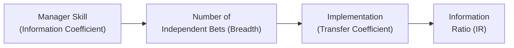

## 9.2 Active Portfolio Management Strategies

Active portfolio management is often viewed as the great quest in the investment world: everyone wants to “beat the market,” but only some manage to do it consistently. In this section, we’ll explore the core ideas that underpin active management, such as the pursuit of alpha (excess return above a benchmark), the Information Ratio (IR), and the Fundamental Law of Active Management. We’ll also walk through examples of active strategies, discuss transaction costs and capacity constraints, and share a few personal anecdotes and tips along the way.

Before we jump in, let’s clarify a few key terms. We’ll use them often, so keep them in mind:

• Active Management: An investment approach that attempts to outperform a benchmark index by selecting securities (security selection) or timing markets (market timing)—or both.  
• Passive Management: A strategy that aims to replicate market returns by holding a benchmark or index, essentially accepting market performance rather than trying to beat it.  
• Alpha (α): The excess return above a benchmark that active managers seek to generate.  
• Information Ratio (IR): A measure of active performance relative to the active risk taken.  
• Fundamental Law of Active Management: A framework describing how skill, breadth, and implementation come together to determine a manager’s expected performance.  

Let’s take a closer look at how this all comes together.

-----------------------------------------------------
## Active vs. Passive Management
Active management has a simple (though not easy) goal: Go beyond what a passive alternative would yield. Passive management, on the other hand, says, “Why try to outsmart markets that are already quite efficient? Let’s just match the market at minimal cost.”

• Passive Management: Suppose you buy the S&P 500 Index through an ETF, and you just sit on it. That’s it. No fancy trades, minimal fees, market-level return net of expense ratio.

• Active Management: Let’s say you have a hunch that a certain tech stock is underpriced. Or you think the energy sector will outperform after a policy change. You adjust your portfolio accordingly, hoping these bets deliver alpha.

### Why Active Management?
The main driver behind active management is alpha potential. If a manager believes they have superior information, better models, or a more nuanced view of a certain market (or sub-sector) than the rest of the crowd, they might successfully capture that edge. Of course, it’s easier said than done—most professional money managers struggle to consistently outperform their benchmarks in the long run.

-----------------------------------------------------
## Introduction to the Information Ratio (IR)
The Information Ratio is a cornerstone metric for evaluating an active manager’s skill relative to the extra risk they take versus a benchmark.

In formula terms, the IR is often written as:


\text{IR} = \frac{R_p - R_b}{\sigma_{p-b}}


Where:

- \\( R_p \\) = Return of the portfolio  
- \\( R_b \\) = Return of the benchmark  
- \\( \sigma_{p-b} \\) = Standard deviation of the difference between the portfolio and benchmark returns (also called active risk or tracking error).

Essentially, it measures how well the manager transforms active risk into active return. A high IR means the manager generates a decent amount of excess return for each unit of active risk; a low IR suggests otherwise.

### Comparing IR to Sharpe Ratio
The Sharpe Ratio is:


\text{Sharpe Ratio} = \frac{R_p - r_f}{\sigma_p}


Where \\( r_f \\) is the risk-free rate and \\( \sigma_p \\) is the standard deviation of the portfolio’s total returns. The Sharpe Ratio focuses on total risk, while the IR specifically focuses on active risk relative to a benchmark. If your job is purely to outperform a benchmark, the IR is often more relevant.

-----------------------------------------------------
## Fundamental Law of Active Management
The Fundamental Law of Active Management (attributed largely to Grinold and Kahn) connects four powerful concepts:  

1. Information Coefficient (IC) – This represents the manager’s forecasting skill. Think of it like a correlation measure between the manager’s predicted outcomes and actual outcomes of returns.  
2. Breadth (BR) – How many truly independent investment decisions a manager makes in a year. If a manager invests in a single stock all year, breadth is clearly low. If they invest in multiple uncorrelated opportunities, breadth is higher.  
3. Transfer Coefficient (TC) – The manager’s ability to translate insights into actual positions in the portfolio without constraints. If your strategy’s official guidelines or regulatory environment force you to hold certain stocks, your transfer coefficient might be reduced.  
4. Active Risk (Tracking Error) – The standard deviation of the difference between the portfolio return and the benchmark return. More active risk often means taking bigger bets off the benchmark, which can amplify gains or losses.

### Putting It All Together
The Fundamental Law of Active Management states, in simplified form:


\text{IR} \approx \text{IC} \times \sqrt{\text{BR}} \times \text{TC}


In words: Your IR is roughly the product of your skill (IC), times the square root of the number of independent bets you make (BR), times your ability to implement those bets (TC). We can visualize this with a simple Mermaid diagram:

The moral of the story is that even with top-notch skill, a manager might not deliver strong performance if they lack breadth or can’t fully implement their insights due to capacity constraints, regulatory constraints, or other portfolio restrictions.

-----------------------------------------------------
## Strategy Examples
### Sector Rotation
Sector rotation strategies involve tilting the portfolio toward sectors expected to outperform under certain economic conditions and away from sectors expected to underperform. For instance, an active manager might decide that consumer discretionary will benefit from rising consumer sentiment, while utilities might lag during an expansion. By periodically rotating allocations, the manager aims to capture relative outperformance.

• Example: Let’s say you’re convinced technology stocks will skyrocket because of a new wave of artificial intelligence adoption. You overweight the tech sector, underweight everything else. If your timing is good and your research is accurate, you earn alpha.

### Style-Based Investing (Value vs. Growth)
Style investing is about categorizing stocks into value, growth, momentum, or other characteristics, and then systematically overweighting or underweighting based on those style factors.

• Value Investing: Emphasizes stocks trading below their intrinsic worth based on fundamentals. Idea: eventually, the market will realize these stocks are “cheap,” and the prices will rise.  
• Growth Investing: Focuses on companies with high growth potential, possibly with elevated valuations. The theory is these companies could keep expanding sales and earnings and justify their higher prices.

Let’s say your research finds that value stocks are historically cheap relative to their sector norms and typically do well in the aftermath of recessions. You overweight those stocks, hoping for revaluation. This is a classic example of an active bet.

### Momentum Approaches
Another approach is to ride the trend—stocks (or any other assets) that have performed well over the past 3–12 months tend to continue outperforming in the short term. Momentum strategies buy winners and sell (or short) losers, at least until the trend fades.

• Example: If you see a biotech stock that’s rallied for the past six months with consistently positive clinical trial news, you might guess the positive drift will continue. That’s the essence of momentum investing.

-----------------------------------------------------
## Impact of Transaction Costs and Management Fees
Now, here’s the ugly truth that has frustrated many an active manager: Even if your skill is top-notch, transaction costs and management fees can eat away at your alpha. I distinctly recall my early days working with a small-cap strategy: we had all these brilliant stock picks, but as we traded in illiquid markets, transaction costs sometimes devoured a chunk of our outperformance. It was an eye-opener.

• Transaction Costs: Costs include commissions, bid-ask spreads, market impact, and the opportunity cost of placing large orders in markets with limited liquidity.  
• Management Fees: High management fees reduce net returns to clients. If your active strategy charges 2% but only outperforms by 2.5%, you might end up delivering just 0.5% net alpha—if everything goes perfectly.

### Why It Matters
In extremely efficient or liquid markets, the cost of trading can be relatively modest, but as you stray into niche or less liquid markets in search of alpha, trading expenses often creep up. Skilled managers can manage their turnover (i.e., the frequency of trades) and carefully enter and exit positions to mitigate these costs.

-----------------------------------------------------
## Capacity Constraints
A less obvious concept is capacity. A strategy that shows spectacular returns on a $50 million portfolio may not seamlessly scale to $5 billion. Here’s why:

• Liquidity Limits: Some assets (like thinly traded small-cap stocks or certain derivatives) can’t accommodate large buy or sell orders without moving the market itself. When your trade is so large that you affect the price, you may get less-attractive fills.  
• Diminishing Breadth: As you become bigger, you might have to concentrate in fewer securities or broaden into areas outside your core expertise. Both can hamper performance.  
• Regulatory or Risk Constraints: A manager of a huge fund might face additional regulatory oversight or risk constraints, restricting the manager’s ability to trade freely.

Think of it like trying to turn a small speedboat versus a giant cargo ship. The speedboat can zip around quickly to capture small, fleeting opportunities, whereas the cargo ship needs more space and time to maneuver.

-----------------------------------------------------
## Putting It All Together
Active portfolio management is a balancing act between seeking alpha and controlling all sorts of real-world frictions. A manager’s success depends on:

• Skill (Information Coefficient)  
• Breadth (How many independent bets they can effectively make)  
• Transfer Coefficient (How effectively they apply their insights)  
• Active Risk (Tracking error taken relative to the benchmark)  
• Controlling Transaction Costs & Fees  
• Managing Capacity Constraints  

No single ingredient ensures success on its own. Instead, it’s about combining them in a balanced way, often with a detailed investment process designed to capture opportunities and manage risk.

-----------------------------------------------------
## Best Practices and Common Pitfalls
• Design a Structured Investment Process: Clear definitions of how ideas are generated, tested, and sized can improve consistency.  
• Maintain Realistic Expectations: Overconfidence in skill or ignoring transaction costs can ruin your actual results.  
• Watch Style Drift: Don’t let your stated style morph into something else without a solid rationale. If you’re a “value” manager, for instance, keep your approach consistent unless you have a well-thought-out strategy shift.  
• Monitor Capacity Proactively: It’s easy to ignore capacity constraints when you’re relatively small, but a strategy can stop working once it grows too large.  
• Manage Risk Dynamically: If your tracking error is too high, you could occasionally shoot the lights out, but you could also crash hard. Conversely, too little active risk means you’re essentially a closet indexer.

-----------------------------------------------------
## Personal Anecdotes and Encouragement
I’ll never forget the day I realized that “winning” in active management isn’t just about finding that magical undervalued stock. It’s equally about not losing your gains to fees, taxes, liquidity problems, and all sorts of daily challenges. One time, our team used a sector rotation approach that, on paper, seemed bulletproof—until we discovered how large our trading costs were each quarter. We ended up scaling down monthly trades to quarterly adjustments to manage those costs. The end result? Our alpha improved simply by trading less frequently.

So, yes, there are many moving parts here. But that’s what makes active management both challenging and (for many) fun. If you’re a numbers nerd or thrive on puzzle-solving, figuring out how to blend these elements can be deeply satisfying.

-----------------------------------------------------
## Exam Tips
1. Know the Difference Between IR and Sharpe: The IR is about active return relative to tracking error versus a benchmark, while the Sharpe is about total risk. Don’t mix them up.  
2. Understand the Formula for the Fundamental Law: Be prepared to define IC, BR, TC, and IR, and how they interact conceptually.  
3. Focus on Real-World Frictions: The exam often covers transaction costs, fees, and capacity. Show you know how these reduce alpha.  
4. Link Strategies Appropriately: If asked about sector rotation or style investing, be able to explain how it ties back to active management fundamentals.  
5. Be Ready to Evaluate Outcomes: You might see a vignette about a manager’s performance claims. Know how to parse out the alpha net of costs and interpret the IR.  

-----------------------------------------------------
## References
• CFA Institute Program Curriculum, Level II, readings on Active Portfolio Management.  
• Grinold, R. C., & Kahn, R. N. (1999). Active Portfolio Management: A Quantitative Approach for Producing Superior Returns and Controlling Risk.  

-----------------------------------------------------
## Test Your Knowledge: Active Portfolio Management Strategies



### A manager who aims to outperform a stock index by carefully analyzing undervalued companies and shifting sector allocations is engaged in:
- [ ] Passive investing
- [x] Active investing
- [ ] Benchmark cloning
- [ ] Index rotation

> **Explanation:** Actively analyzing undervalued companies and timing sector allocations are hallmarks of active investing.

### The Information Ratio (IR) is best described as:
- [ ] The ratio of fund size to market size
- [ ] The portfolio’s excess return relative to the risk-free rate
- [x] The portfolio’s active return divided by its active risk
- [ ] The correlation of a portfolio’s returns to a benchmark

> **Explanation:** IR = (Return of portfolio – Return of benchmark) ÷ Tracking error (or active risk).

### Which factor in the Fundamental Law of Active Management represents how effectively a manager can implement their ideas?
- [ ] Breadth
- [x] Transfer Coefficient
- [ ] Information Coefficient
- [ ] Active Risk

> **Explanation:** Transfer Coefficient measures the extent to which forecasts get translated into actual positions.

### According to the Fundamental Law of Active Management, the IR is proportional to:
- [x] IC × √Breadth × Transfer Coefficient
- [ ] Active Risk ÷ IC
- [ ] Sharpe Ratio × Active Risk
- [ ] Beta × Alpha

> **Explanation:** IR is approximately IC × √(Breadth) × TC, which captures skill, frequency of independent decisions, and implementation efficiency.

### Which of the following statements about transaction costs is most accurate?
- [x] High transaction costs can eat away a manager’s alpha.
- [ ] Transaction costs always decrease with portfolio size.
- [x] They include commissions, bid-ask spreads, and market impact.
- [ ] They are negligible in most active strategies.

> **Explanation:** Transaction costs can be substantial. They rise with larger orders, and they include both direct (commissions) and indirect (market impact, bid-ask spreads) components.

### Capacity constraints in active management refer to:
- [x] The inability to scale strategy size without negatively impacting performance.
- [ ] Regulations limiting the purchase of certain assets.
- [ ] Economic downturns that reduce investor appetite.
- [ ] Tax inefficiencies in mutual funds.

> **Explanation:** Capacity constraints typically revolve around liquidity and market impact, which can limit how large an active strategy can grow.

### In sector rotation, a manager typically outperforms by:
- [x] Overweighting sectors expected to do well and underweighting those expected to lag
- [ ] Buying and holding the entire market indiscriminately
- [x] Overweighting traditional safe-haven assets only
- [ ] Eliminating all exposure to high-correlation stocks

> **Explanation:** Sector rotation is about proactively adjusting allocations to take advantage of cyclical or thematic factors.

### The Sharpe Ratio and the Information Ratio differ primarily because:
- [x] The Sharpe Ratio uses total risk, while the Information Ratio uses tracking error
- [ ] The Sharpe Ratio is only for bonds; the Information Ratio is only for equities
- [ ] The Information Ratio includes risk-free returns in the numerator, while the Sharpe does not
- [ ] They are identical except for naming conventions

> **Explanation:** The Sharpe Ratio focuses on total risk versus a risk-free rate, while the IR focuses on excess return versus a benchmark and the variability of that excess return.

### A manager who consistently forecasts company earnings correctly, but is constrained by strict asset allocation limits, may see reduced:
- [x] Transfer Coefficient
- [ ] Breadth
- [ ] Beta
- [ ] Treasury yield

> **Explanation:** Strict guidelines can prevent the manager from fully implementing their forecasts, lowering the effective Transfer Coefficient.

### True or False: Passive investing attempts to replicate the market and focuses on minimal tracking error relative to the benchmark.
- [x] True
- [ ] False

> **Explanation:** Passive strategies aim to match rather than outperform a specific market index, minimizing tracking error and costs.


