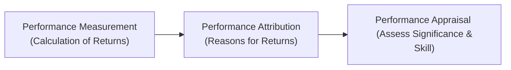

## 9.3 Performance Evaluation and Attribution

Have you ever looked at a portfolio’s return and thought, “This looks good... but why did it happen?” That honest, slightly puzzled question is exactly what performance evaluation and attribution is all about. We’re not just examining numbers on a page; we’re trying to figure out what drove those numbers in the first place, and whether they mean that someone made consistently skillful decisions or just got lucky.

Performance evaluation has three closely related but distinct components:  
• Performance measurement: figuring out how much a portfolio earned.  
• Performance attribution: discovering where those returns came from.  
• Performance appraisal: determining if the performance was due to genuine manager skill or just happenstance.

I remember when I was first learning about performance attribution, I tried to dissect a friend’s investment club results—casually, over coffee—and ended up with more questions than answers. Why’d they pick so many tech stocks? Was it just the market that favored tech, or did they pick really good individual names?

That’s where a structured approach can truly help. Below, we’re going to zero in on the Brinson model (for decomposing allocation and selection effects), factor-based attribution, benchmark selection, and risk-adjusted performance metrics. But we’ll keep it human, with manageable math and a few stories sprinkled in.

### Understanding Performance Measurement, Attribution, and Appraisal

Let’s begin with the big picture.  

• Performance measurement is all about the raw numbers—calculating returns over a certain period. It is typically expressed as a percentage showing how much the portfolio’s value has increased (or decreased).  

• Performance attribution goes one step further. It breaks down that increase or decrease into its main drivers. Did the manager do a good job picking certain sectors (allocation)? Or did they excel at finding specific winning stocks within those sectors (selection)?  

• Performance appraisal is the final stage, where we ask: “Was this performance significant or basically random?” Maybe the manager is a genius portfolio wizard; or maybe they went long on a purely momentum-driven stock during a big upswing. Performance appraisal techniques (like t-tests or other statistical measures) try to separate real skill from luck.

To visualize the relationship between these three steps, let’s look at a quick chart:

Although the chart is straightforward, the reality can be a bit trickier. But if you grasp this sequence—measure, attribute, appraise—you’ll have a strong framework in place.

### The Brinson Model: Allocation vs. Selection

The Brinson model is often the starting point for performance attribution in a traditional equity context. It separates a portfolio’s performance into two main components:

• Allocation effect: Did we overweight or underweight particular sectors (or asset classes) relative to our benchmark, and how did that affect returns?  
• Selection effect: Did we pick the right or wrong securities within each sector?

Sometimes you’ll see a third component—the interaction effect—that captures the combined effect of allocation and selection. But let’s keep it simple, because for exam purposes, the “allocation vs. selection” approach is usually enough to get you squared away.

Here’s the typical equation for the Brinson model. Let’s say you break your portfolio into segments (like sectors). For each segment i:

• wᵢ : the portfolio weight in segment i  
• bᵢ : the benchmark weight in segment i  
• rᵢ : the portfolio’s return in segment i  
• Rᵢ : the benchmark’s return in segment i  

Allocation Effect for segment i = ( wᵢ - bᵢ ) × ( Rᵢ - Rᵦ )  
(where Rᵦ is the overall benchmark return across all segments)

Selection Effect for segment i = bᵢ × ( rᵢ - Rᵢ )

The total Allocation Effect is the sum of the segment-level allocation effects.  
The total Selection Effect is the sum of the segment-level selection effects.

You can see that the allocation effect is about deviating from the benchmark’s weighting, whereas the selection effect is about how you did within each segment, relative to that segment’s benchmark return.

#### Simple Example

Imagine a small portfolio with just two sectors: Technology and Healthcare. The benchmark invests 50% in Tech and 50% in Healthcare. Your portfolio invests 60% in Tech and 40% in Healthcare.

• Tech returns for your portfolio are +12% vs. a Tech segment benchmark of +10%.  
• Healthcare returns for your portfolio are +5% vs. a Healthcare segment benchmark of +6%.  
• Overall benchmark return is 8% (a weighted average of the 10% from Tech and 6% from Healthcare).

Allocation effect for Tech:  
(0.60 - 0.50) × (10% - 8%) = 0.10 × 0.02 = 0.002 (or 0.20%)  

Allocation effect for Healthcare:  
(0.40 - 0.50) × (6% - 8%) = -0.10 × -0.02 = 0.002 (0.20%)  

So total allocation effect is 0.40%.  

Selection effect for Tech:  
(0.50) × (12% - 10%) = 0.50 × 0.02 = 0.01 (1.0%)  

Selection effect for Healthcare:  
(0.50) × (5% - 6%) = 0.50 × -0.01 = -0.005 (-0.5%)  

So total selection effect is 0.5%.  

Hence, your active return can be broken down as:  
• Allocation effect: +0.40%  
• Selection effect: +0.50%  
• Total outperformance: +0.90%  

This is a straightforward example, but it highlights the concept: your overweight in Tech and underweight in Healthcare helped (allocation), and you also picked winning Tech stocks and somewhat losing Healthcare stocks (selection). The final line says your portfolio outperformed the benchmark by 0.90%, with a nearly even mix of contributions from allocation and selection.

### Factor-Based Performance Attribution

The Brinson model is sector-based, but sometimes we want to dig deeper into the factors that really drive returns: style (value vs. growth), size (large-cap vs. small-cap), momentum, low volatility, and so forth. That’s where factor-based performance attribution steps in.

Instead of just looking at how well we did in a specific sector, factor-based attribution considers exposures to systematic risk factors. For example, maybe your portfolio tilts toward small-cap growth stocks with strong momentum. Or perhaps your style is more about large-cap value. Factor-based attribution tries to quantify how each of those factor tilts contributed to your overall performance.

Imagine a factor-based model with K factors. A simplified approach might say:

Portfolio Return = α + β₁F₁ + β₂F₂ + … + βₖFₖ  

Where:  
• Fⱼ is the return to factor j, like “small-cap premium” or “value premium.”  
• βⱼ is the portfolio’s exposure to factor j (analogous to how we might measure “market beta”).  
• α is the unexplained portion often attributed to manager skill (or luck).

If you discover that your portfolio’s tilt towards the Momentum factor was the primary reason you outperformed, that’s factor-based attribution at work. It basically says: “Well done on capturing that factor’s outperformance” (and hopefully that outperformance is persistent or strategic rather than just a short-term anomaly).

### Role of Benchmarks

All right, so you’ve measured returns and done a sweet attribution analysis. Now the next question: how does your portfolio compare to something? Right, that’s the benchmark’s job. We usually want a benchmark that is:

• Unambiguous (everyone knows exactly what it is—like the S&P 500 or a well-defined custom index)  
• Investable (an investor can fairly easily purchase the constituents of that benchmark)  
• Measurable (we can track the returns regularly)  
• Appropriate (it reflects the manager’s style and universe)  
• Specified in advance (we don’t pick our benchmark after we see our performance)

These criteria are basically from the CFA Institute’s official recommendations for benchmarks. If your benchmark is sloppy, your carefully computed attribution results might be meaningless—or even misleading.

### Common Weaknesses of Certain Benchmarks

Sometimes, we deal with a “benchmark misfit.” That’s basically a mismatch between the portfolio’s style or investable universe and the benchmark’s constituents. For example, if your manager focuses on small but rapidly growing micro-cap companies, then comparing them to the S&P 500 might be weird. “Weird” is a technical term (just kidding), but you get the idea: it’s not a fair fight.

Additionally, some benchmarks are too broad or not truly investable. Or they’re subject to selection bias (like indices that only include “top-performing” funds). Always examine if your benchmark is truly representative of the portfolio’s strategy.

### Risk-Adjusted Performance Metrics

It’s not enough to say “we got a 10% return.” Because if you took a wild amount of risk, that 10% might not be so impressive compared to a more risk-managed approach. That’s why the next step is to incorporate metrics like the Sharpe Ratio, Treynor Ratio, or Jensen’s Alpha.  

• Sharpe Ratio = (Portfolio Return – Risk-Free Rate) / Portfolio Volatility  
• Treynor Ratio = (Portfolio Return – Risk-Free Rate) / Portfolio Beta (with respect to a market index)  
• Jensen’s Alpha = Portfolio Return – [Risk-Free Rate + (Portfolio Beta × (Market Return – Risk-Free Rate))]

When combined with performance attribution, these risk-adjusted measures give you a double whammy of insight. You know where the returns came from and can see how much risk you took to generate those returns. This forms the heart of performance appraisal, where we judge if the manager is truly adding value or just leveraging up the portfolio in a bull market.

### Putting It All Together

So how does it all come together in real life?

1. First, measure your portfolio’s return over the period. That’s performance measurement.  
2. Next, break that return down into the portion guided by your allocation decisions (like overweight to Tech) versus your selection decisions (picking specific denominators within Tech—like focusing on cybersecurity or AI). That’s the Brinson model.  
3. Then, if you’re feeling more advanced, break returns down by factor exposures. See if you’re intentionally or unintentionally tilting your portfolio toward size, value, momentum, or other factors.  
4. Choose a benchmark that really fits your strategy. If you’re a global equity manager, you might want to compare your performance to a global index such as MSCI All Country World Index.  
5. Look closely at risk-adjusted results. Did you produce high returns because you took massive risk, or was there evidence of skillful decision-making that overcame risk in a prudent manner?  
6. Finally, interpret the results. Maybe you realize your outperformance was mostly from strong stock selection within Healthcare and a tilt toward momentum-driven small-cap stocks. Great—if that aligns with your style. If it was purely accidental, well, that’s good to know, too.

### Quick Mermaid Diagram Summarizing the Process

### Potential Pitfalls and Challenges

Even though we have neat frameworks, performance evaluation is littered with pitfalls:

• Overfitting: If you create a factor-based model that precisely explains historical returns, you might be capturing noise rather than skill.  
• Benchmark misfit: If your benchmark is misaligned with your actual investing universe, your attribution results might lead you astray.  
• Data quality issues: Bad or stale data leads to flawed attribution.  
• Ignoring transaction costs, taxes, or currency effects in multi-regional portfolios can significantly skew results.

Doing attribution right requires careful data handling, consistent time periods, and an appropriate methodology that’s well understood by everyone analyzing the portfolio.

### Practical Example: Manager X

Let’s say Manager X invests in a portfolio of U.S. equities, with a typical allocation of 70% in large-cap growth names and 30% in mid-cap growth. She’s measured against the S&P 500, which is more diversified across growth and value, and includes large- and mega-cap companies.

Over the last year, the S&P 500 returned 7%. Manager X returned 9%. By the Brinson model, you see 1.5% of that 2% outperformance is from overweighting growth stocks during a good year for growth. Another 0.5% came from strong stock selection, primarily in mid-cap biotech companies. 

However, if you do a factor-based analysis, you might find that the portfolio’s beta to the “growth factor” accounted for almost all the outperformance. That might raise a question: Does Manager X have genuine security selection skill, or are they just riding the wave of a popular factor tilt?

By also examining the Sharpe Ratio, you see that Manager X’s Sharpe is only marginally above that of the growth index. It tells you that while they outperformed, they took a fair bit of risk to do so. Whether that’s “good risk” depends on your investment goals.

### Closing Thoughts

Sometimes, looking at your portfolio’s performance can feel like reading a friend’s cryptic social media post—you see something interesting, but you’re not totally sure what’s going on. Performance evaluation and attribution is the finance version of turning that cryptic post into a well-explained narrative. With the Brinson model, factor-based methods, appropriate benchmarks, and risk-adjusted appraisal, you can piece together that narrative accurately and fairly.  

I always joke that performance attribution is like detective work, but with fewer car chases and more spreadsheets. The good news? It’s a puzzle you eventually learn to love—and it’s an essential puzzle if you want to assess just how a manager (or any investor) is adding value.

### Glossary

• Performance Measurement: The process of calculating the returns on a portfolio over a specified period.  
• Performance Attribution: A technique to identify the sources of a portfolio’s return relative to a benchmark.  
• Allocation Effect: The portion of active return attributable to over- or under-weighting certain segments (e.g., sectors or asset classes) compared to the benchmark.  
• Selection Effect: The portion of active return attributable to choosing superior or inferior performing securities within each segment.  
• Interaction Effect: The combined effect of allocation and selection decisions that can also impact overall performance.  
• Factor-Based Attribution: A method stating that portfolio returns can be explained by exposures to systematic risk factors (e.g., value, size, momentum).  
• Benchmark Misfit: A mismatch between the portfolio’s investment style or universe and the benchmark used, potentially distorting performance evaluation.

### Final Exam Tips

• Know the differences between measurement, attribution, and appraisal—this often comes up in exam questions.  
• If you see the Brinson model, remember the formulas for allocation and selection. Also recall that the interaction effect may be included (though some presentations exclude it or fold it into selection).  
• Practice factor-based analysis in a conceptual sense. Examiners won’t expect you to crunch big regressions by hand, but they might test your conceptual understanding of systematic risk factors.  
• Watch out for question stems that hint at benchmark misfit—like a manager focusing on small-caps but compared to a broad market index.  
• Familiarize yourself with risk-adjusted metrics (Sharpe, Treynor, Jensen’s Alpha) so you can interpret when a question or item set is leaning in that direction.

### References

• CFA Institute Program Curriculum, Level II, Performance Evaluation and Attribution Readings.  
• Bacon, C. R. (2008). Practical Portfolio Performance Measurement and Attribution.  

---

## Test Your Knowledge: Performance Evaluation and Attribution



### Which of the following best describes performance appraisal?

- [ ] The process of calculating the portfolio’s returns over the evaluation period.
- [ ] The process of determining whether the benchmark used is measurable and investable.
- [x] The process of determining whether observed performance is driven by skill or luck.
- [ ] The process of breaking down active returns into allocation and selection components.

> **Explanation:** Performance appraisal is focused on assessing whether the manager’s performance is statistically and economically significant (i.e., skill) or merely luck.

### Which component of the Brinson model measures the active return due to weighting decisions among different sectors?

- [x] Allocation effect
- [ ] Selection effect
- [ ] Interaction effect
- [ ] Benchmark effect

> **Explanation:** The allocation effect captures the difference between the portfolio’s weight and the benchmark’s weight in each sector, multiplied by that sector’s benchmark return relative to the overall benchmark.

### In factor-based attribution, which statement is most accurate?

- [ ] It always excludes any measure of alpha.
- [ ] It attributes returns solely to currency movements.
- [ ] It applies only to long–short hedge fund strategies.
- [x] It decomposes returns based on exposures to systematic risk factors such as size or momentum.

> **Explanation:** Factor-based attribution assigns portions of the portfolio’s return to various systematic risk factors (e.g., value, size, momentum), often leaving residual alpha as the unexplained portion.

### Which of the following makes a benchmark “unambiguous” according to the CFA Institute’s criteria?

- [x] Its composition is clearly defined and known in advance.
- [ ] It is actively managed and regularly changes holdings based on daily market conditions.
- [ ] It includes only past top-performing securities.
- [ ] It assigns random weights to each sector to ensure even representation.

> **Explanation:** An unambiguous benchmark is one where the identities and weights of its constituents are clearly defined and transparent before you compare performance.

### Which statement is a key difference between performance measurement and performance attribution?

- [x] Measurement calculates total returns; attribution breaks those returns into sources.
- [x] Measurement focuses on overall performance; attribution explains stock or sector choices.
- [ ] Measurement applies only to active portfolios; attribution applies only to passive portfolios.
- [ ] Both are essentially the same concept, just described differently.

> **Explanation:** Performance measurement looks at how much was earned. Performance attribution explains how and why it was earned, highlighting allocation and selection decisions.

### A portfolio benchmark mismatch (benchmark misfit) is most likely to occur when:

- [ ] The benchmark is specified in advance and is too strict with rebalancing.
- [ ] The portfolio invests solely in fixed income while the benchmark invests in emerging market equity.
- [x] The benchmark’s universe does not match the portfolio’s investment style or region.
- [ ] The benchmark is unambiguous, investable, and measurable.

> **Explanation:** “Benchmark misfit” arises when the benchmark does not align with the manager’s style, asset class, or regional focus, leading to misleading comparisons.

### The Sharpe Ratio is most useful when:

- [x] Evaluating the risk and return of a single portfolio in isolation.
- [ ] Comparing the performance of a portfolio that invests only in government bonds.
- [x] Comparing two portfolios’ returns over the same period.
- [ ] Assessing the manager’s alpha in a fully hedged foreign currency portfolio.

> **Explanation:** The Sharpe Ratio is (Return - Risk-Free Rate) / Standard Deviation, making it a straightforward measure to compare risk-adjusted returns across any set of portfolios over the same time frame.

### In a simple Brinson attribution model, the “selection effect” is computed by:

- [x] The benchmark weight in each segment multiplied by the difference between the portfolio return and benchmark return in that segment.
- [ ] The difference in portfolio and benchmark weights multiplied by the overall portfolio return.
- [ ] The difference between portfolio weights in each segment and the overall benchmark weight.
- [ ] The difference between portfolio segment returns and the total portfolio return.

> **Explanation:** The selection effect isolates performance differences within each segment by taking the benchmark’s weight times the difference between the portfolio’s segment return and that segment’s benchmark return.

### When using factor-based attribution, the term “α” (alpha) typically represents:

- [x] The portion of returns not explained by the chosen factors.
- [ ] The slope coefficient on the size factor.
- [ ] The portfolio’s average exposure to the market factor.
- [ ] The portion of returns explained purely by sector allocation.

> **Explanation:** In factor-based models, alpha is the intercept, reflecting manager skill or unexplained returns that can’t be attributed to the designated risk factors.

### For a manager’s performance to be considered statistically significant rather than random:

- [x] True
- [ ] False

> **Explanation:** We often use statistical tests (like t-tests) to see if the manager’s alpha or outperformance is materially different from zero, indicating skill rather than random chance.


