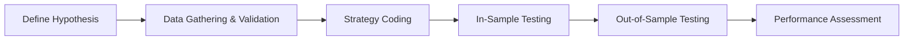

## 9.7 Backtesting, Simulation, and Strategy Validation

Backtesting is one of those topics that folks in finance both love and fear at the same time. Love it—because there’s a certain thrill in “time traveling” with an investment idea, applying a neat strategy to see if it would have worked in the past. Fear it—because of all the pitfalls, biases, and illusions that can crop up when we’re peeking back in time. This section aims to demystify the backtesting process, highlight best practices, and show why it's critical to ensure data integrity and avoid biases. We’ll also delve into simulation methods, like Monte Carlo, to expand analysis beyond historical data. And yes, we’ll uncover ways to validate (or refute) a strategy so that it hopefully stands a chance in the real world.

Just so you know, I once built a model for currency forecasting (when I was a brand-new analyst) that looked absolutely perfect in historical data—double-digit returns, low volatility, you name it. However...the second I traded it, the model dove into negative territory. Turns out, I’d used a data set riddled with look-ahead bias and didn’t realize a few key economic indicators were being “updated” historically in a way that never existed in real time. That humbling experience taught me that careful backtesting is both an art and a science requiring diligence at every step.

Below, we’ll examine each phase: from data collection and cleaning, to cross-validation and performance measurement, culminating in sensitivity analysis and out-of-sample testing. In the process, we’ll define important terms, discuss relevant pitfalls, and offer best practices to keep your backtesting approach as rigorous—and as reality-based—as possible.

---

### The Essence of Backtesting

Backtesting is, at its heart, the process of applying a strategy or model to historical data to see how it might have performed. By “strategy,” we can mean everything from a simple moving average rule for stocks to a full-blown multi-factor global macro model. The basic idea is: “If I had used these rules in the past, would I have beaten my benchmark—or at least met certain risk-and-return objectives?”

To design a robust backtest, you need:  
• High-quality historical data.  
• Clear assumptions and well-documented rules.  
• Mechanisms to prevent you from “cheating” (like using today’s knowledge on yesterday’s trades).  
• Rigorous performance analysis that doesn’t just reflect chance findings (overfitting).

Think of backtesting like trying out a new recipe before inviting your best friends over for dinner. You’d likely want to test it a few times, making sure it’s consistent and that you’ve accounted for variations (e.g., your oven’s temperature idiosyncrasies). In finance, similarly, you want to know if your strategy can handle many real-world quirks: missing data, structural changes in the market, transaction costs, and more.

---

### Data Integrity and Cleaning

Nothing hurts a backtest more than poor-quality data. I remember once being baffled by a seemingly unstoppable stock within my backtest only to realize the data vendor hadn’t adjusted for decimal shifts after a stock split. That’s not a fun phone call to your boss.

• **Data Validation:** Before you even hit “run” on your backtest code, ensure all entries are accurate, consistent, and complete. Watch out for zeros where there shouldn’t be any, duplicates, or suspicious outliers.  
• **Adjustments:** Stock prices, for instance, typically need to be adjusted for splits, dividends, or corporate actions. Unadjusted data might imply phantom returns or cause you to miss big dips.  
• **Missing Data and Gaps:** If you see missing data, do you assume zero returns? Or do you omit those periods entirely? Each choice has consequences, and you must be consistent and transparent.  

In many cases, analysts rely on specialized data providers that handle corporate actions and track delisted companies to mitigate survivorship bias. But always verify. Even “premium” data sets can fail. Treat your data carefully.

---

### Avoiding Look-Ahead Bias, Survivorship Bias, and Data Snooping

We’re not immune to illusions. In fact, markets are filled with illusions if you look hard enough. Let’s define the big three:

1. **Look-Ahead Bias**  
   This happens when your strategy uses information that wasn’t actually available at the time of the supposed “trade.” For example, if you use a morning official close price to execute a trade in the morning, you’re making an assumption that you know the close in advance. That’s obviously cheating, but it’s easy to overlook in a spreadsheet.  

2. **Survivorship Bias**  
   This creep is especially notorious in equity mutual fund databases. If you only look at funds that exist today, ignoring all the funds that disappeared because they performed terribly, you risk inflating your strategy’s apparent success. Similarly, if you track stock performance but fail to include delisted or bankrupted stocks, you distort historical returns.  

3. **Data Snooping**  
   If you stare at the data long enough, you’ll find patterns—whether they are real or not. This is the classic “overfitting” scenario. Maybe you notice that stocks with ticker symbols starting with “A” soared in one particular quarter, so you build a strategy around that letter. That’s data snooping or “p-hacking.”  
   
   This is something to watch for in backtests: the more signals, the more parameters you tweak “just a bit,” the higher your risk. So proceed with caution.

A major defense against these biases is robust cross-validation, which we’ll explain shortly. Meanwhile, you can systematically check for look-ahead bias by carefully verifying that time stamps match actual trading intervals, ensure your sample includes “dead” companies, and keep your rule sets at bay from random tinkering.

---

### Steps in Designing a Backtest

While everyone has a slightly different approach, here’s a broad flow many professionals follow:

#### 1) Hypothesis Formation
You might have a hunch that using a stock’s 50-day moving average as an entry signal “should” yield higher returns compared to buy-and-hold. Whatever the big idea is, write it down clearly: what’s the investment premise? Which markets, asset classes, time horizons?

#### 2) Dataset Selection
Next, gather all relevant data (stock prices, macro variables, fundamental data, etc.) from reliable sources. This step includes cleaning, adjusting, and verifying everything. You should also decide your test window. Are you looking at 10 years? 20? Different sub-periods?

#### 3) Period of Analysis
What’s the start and end date of your analysis? Do you segment the data into different market regimes (e.g., pre-2008 vs. post-2008)? Ensure your chosen periods reflect different market conditions; otherwise, you’re missing potential stress scenarios.

#### 4) Execution of Strategy Rules
Now that you have the data, run your rules step by step—like a script. If “moving average crosses up,” you buy. Then you exit when “moving average crosses down.” Account for slippage, transaction costs (including commissions, spread, or market impact). Real trading is never free.

#### 5) Performance Measurement
Evaluate how the strategy performs. You might look at annualized return, volatility, risk-adjusted metrics like the Sharpe ratio, or maximum drawdown. Compare it to a benchmark. Perhaps you dig deeper into performance in bullish vs. bearish phases.  

---

### In-Sample vs. Out-of-Sample Testing

• **In-Sample Period**: This is the time frame you use to develop (train) your model. You might tweak parameters here, or identify certain factors that appear promising. Note that, because you’re calibrating your model on this data, you inherently risk overfitting to that period’s quirks.  

• **Out-of-Sample Period**: After finalizing your model’s rules, test them on a brand-new chunk of data that wasn’t used to build or refine anything. This is crucial for seeing how well your strategy generalizes and is often referred to as “validation.” Some folks even hold back an additional time period for final “testing,” treating the in-sample as a training set and the first out-of-sample as a validation set. That leaves a final test set for a truly unbiased check.  

A robust approach is rolling out-of-sample testing, where you repeatedly re-train and re-check the model across different time segments to capture how the strategy might behave in different cyclical environments.

---

### Cross-Validation to Mitigate Overfitting

Cross-validation is a great ally in your quest to avoid creating a strategy that merely fits old data perfectly. In finance, a popular approach involves dividing your sample into multiple “folds” or segments. You train on some folds (say, 80% of the data) and test on the remaining fold (20%). Then you rotate. This process not only ensures multiple out-of-sample tests but also helps you see how stable the strategy is across different sub-periods.  

In machine learning contexts (like building a random forest or neural network to predict stock returns), cross-validation is standard. For example, 5-fold or 10-fold cross-validation is common. In simpler systematic strategies, though, you might just set aside the first 70% of historical data to build the strategy, then evaluate it on the last 30%. The key is to confirm that the performance gleaned in one set of data is not just happenstance.

---

### Monte Carlo Simulations: Beyond Historical Patterns

Historical data only shows you one path the market actually took. Helpful? Definitely. Sufficient? Not always. Enter Monte Carlo simulations, which let you produce thousands of hypothetical market paths. Maybe you perturb daily returns, or you apply random shocks to interest rates, or you re-sample from a distribution of historical returns.  

The advantage is you get a distribution of potential outcomes—seeing not just the “single storyline” but all sorts of possible market evolutions. That’s especially helpful for stress-testing your portfolio or evaluating the risk of rare but catastrophic events.

Some typical steps for Monte Carlo:  
1. Define your underlying assumptions. Perhaps daily returns follow a certain distribution with mean μ and standard deviation σ.  
2. Simulate random draws from this distribution for each day in your horizon.  
3. Aggregate results to get a total return path.  
4. Repeat thousands of times, building a probability distribution of final outcomes.  

If your strategy systematically breaks down in 10% or 25% of these runs, that’s a clue: maybe it’s more fragile than you thought. Conversely, if even under “worst-case” scenarios, the performance or risk remains within your comfort zone, you can be more confident.  

---

### Sensitivity Analysis

We sometimes get so fixated on one set of parameters that we forget how easily financial markets can swerve. For instance, if your strategy says “buy if the 50-day moving average is above the price,” maybe you should see what happens at a 40-day or 60-day threshold. Do you still earn above-market returns, or does it all fall apart?  

A thorough sensitivity analysis changes each critical assumption, one by one, to see the effect on final results. It’s a bit like stress-testing your recipe by altering the ingredients—using half as much sugar, or baking 10 minutes more, etc. If your model’s performance remains robust across a range of parameter values, you might have something truly valuable.  

---

### Practical Modeling Workflow

Let’s look at a simple integrated approach (with approximate steps):

1. Form your hypothesis: e.g., “Small-cap value stocks produce higher risk-adjusted returns.”  
2. Collect and clean data.  
3. Do some exploratory analysis to understand relationships.  
4. Develop your strategy rules with the in-sample data.  
5. Use cross-validation to further refine or reject those rules.  
6. Test on out-of-sample data—completely untouched so far.  
7. Apply Monte Carlo and sensitivity analysis.  
8. If everything checks out, build an implementation plan (like final position sizing, rebalancing frequency, risk controls).

It often takes multiple loops back and forth. The goal is to minimize the risk that what you “discovered” is just random or overfit.  

---

### Real-World Considerations

Real markets have friction. That means transaction costs, slippage, liquidity constraints, position limits, margin calls, taxes, and other joyless realities. If your backtest boasts a 40% annualized return but you only accounted for a $1 commission per trade, yet in the real world your trades’ bid-ask spreads and market impacts devour 4% or 5% of your capital each trade, your real results will be drastically diminished. So try to incorporate reasonable estimates of all these costs.

Another real-world consideration: The environment changes. A strategy that thrived in the dot-com bubble might shrivel in the meltdown of 2008-2009. Or maybe new regulations in the early 2020s forced a shift in how certain asset classes behave. Because markets evolve, you also need ongoing monitoring. Even a thoroughly validated strategy might eventually degrade, requiring you to revisit assumptions and re-tune parameters.

---

### Common Pitfalls

• **Overfitting**: The number one culprit. We keep adding rules or conditions until we get an amazing backtest. But it might not generalize at all.  
• **Ignoring Regime Shifts**: Market conditions are not static. A zero-interest-rate environment from 2009 to 2015 might not replicate well in a high-interest-rate environment.  
• **Forgetting Slippage and Liquidity**: Real markets charge you a “price” for big trades or illiquid securities.  
• **Lack of Proper Out-of-Sample**: If you just keep tuning the model to get the best results in the entire data set, you’re not truly validating.  
• **Misaligned Time Stamps**: This can cause unintentional look-ahead. For instance, seeing fundamental data from a quarterly filing that was not released until a month after quarter-end.  
• **Underestimating Transaction and Holding Costs**: You need to make them as realistic as possible.  

---

### Ethical and Regulatory Considerations

While backtesting is more of a technique than an ethical question, it can become one if you present unrealistic or biased results to clients. The CFA Institute Code of Ethics and Standards of Professional Conduct demands that we act with integrity. That includes being transparent about your methodology, highlighting limitations, and not cherry-picking the best periods. If you plan to pitch your model to prospective clients or internal stakeholders, ensure that disclaimers are thorough and that performance data is not misrepresented.

From a regulatory standpoint, especially in the U.S. and Canada, performance advertising is strictly monitored. You must follow guidelines on hypothetical performance presentations that specify disclaimers, highlight that these are not “real” returns, and mention that actual results may vary.

---

### Best Practices and Strategy Validation

1. Keep your rules simple until you have a real reason to add complexity.  
2. Maintain a thorough “strategy log” so you can track each iteration.  
3. Validate your final model with at least one distinct out-of-sample period.  
4. Cross-validate if you have enough data.  
5. Use Monte Carlo to see if extremes could wreak havoc on your performance.  
6. Conduct sensitivity analysis on key parameters—like how your scheme rebalances or how large your trading cost might become in a volatile market.  
7. Keep your mind open that the result might be negative. If your strategy doesn’t work, it doesn’t work. You’d rather find that out privately in a backtest than in real trades with actual capital.  

---

### References for Further Exploration

• CFA Institute Program Curriculum, Level II, Backtesting and Simulation Topic.  
• Bailey, D. H., Borwein, J., López de Prado, M., & Zhu, Q. J. (2014). “The Probability of Backtest Overfitting.” Journal of Computational Finance.  
• Pardo, R. (2008). The Evaluation and Optimization of Trading Strategies.  
• Vince, R. (1992). Portfolio Management Formulas: Mathematical Trading Methods for the Futures, Options, and Stock Markets.  
• CFA Institute. (n.d.). Code of Ethics and Standards of Professional Conduct.

---

### Concluding Exam Tips

• **Minimize Overfitting**: The exam might ask you to analyze a scenario of data-snooping or parameter tweaking. Know the difference between a robust approach and a purely data-mined approach.  
• **Identify Biases**: You could see vignettes involving look-ahead or survivorship bias. Practice spotting them.  
• **Cross-Validation**: Understand how cross-validation lowers the risk of overfitting—and how to implement it.  
• **Remember Costs**: Don’t forget transaction fees and liquidity constraints when you evaluate any backtest.  
• **In-Sample vs. Out-of-Sample**: This is a classic. Know how to structure your data, so you can fairly evaluate a strategy.  
• **Monte Carlo**: Expect some conceptual or formula-based questions on random sampling, distribution assumptions, and scenario analyses.  
• **Sensitivity Analysis**: The test might provide a scenario with changes in parameters to see if you can interpret the strategy’s robustness.  

Stay calm, read the data carefully, and watch for hidden biases. Good luck!

---

## Test Your Knowledge of Backtesting, Simulation, and Strategy Validation



### Which of the following best describes backtesting?

- [ ] Using forward-looking forecasts for portfolio construction.
- [x] Applying a strategy or model to historical data to see how it would have performed.
- [ ] Estimating the effect of rebalancing on future portfolios using random simulations only.
- [ ] Strictly focusing on out-of-sample data analysis.

> **Explanation:** Backtesting involves applying a strategy to historical data to judge how the strategy might have performed in that historical environment.  

### Which of the following biases is likely to occur when an analyst uses data for a stock that no longer exists (i.e., the stock went bankrupt) and omits it from the backtest?

- [ ] Look-ahead bias.
- [x] Survivorship bias.
- [ ] Data snooping bias.
- [ ] Selection bias caused by including too many stocks.

> **Explanation:** Survivorship bias occurs when you exclude entities that did not “survive,” thus overstating the performance of the strategy.  

### Selecting parameters that perform best during the historical period but fail to generalize to future data is primarily an example of:

- [ ] Look-ahead bias.
- [ ] Transaction-cost neglect.
- [x] Overfitting or data snooping.
- [ ] Out-of-sample bias.

> **Explanation:** Overfitting (sometimes referred to as data snooping) occurs when you excessively tune parameters to historical data, inadvertently modeling noise rather than the underlying signal.  

### Why is cross-validation important in backtesting?

- [ ] It ensures the data is aligned with regulatory standards.  
- [x] It partitions the sample into training and validation sets to reduce overfitting.
- [ ] It eliminates the need for transaction-cost adjustments.
- [ ] It makes in-sample testing unnecessary.

> **Explanation:** Cross-validation helps mitigate overfitting by using distinct subsets of the data for training and validation, ensuring more robust evaluation of the strategy.  

### Which of the following statements is true regarding Monte Carlo simulations in strategy testing?

- [ ] They eliminate the needs for historical data.  
- [x] They help generate multiple hypothetical paths to assess potential future outcomes.  
- [ ] They primarily detect look-ahead bias.  
- [ ] They cannot incorporate volatility assumptions.

> **Explanation:** Monte Carlo simulations allow you to create many random paths of returns or risk factors, providing a distribution of possible outcomes beyond a single historical scenario.  

### What is the main purpose of out-of-sample testing?

- [ ] To verify that the data was properly cleaned.  
- [ ] To demonstrate that a model is biased.  
- [x] To confirm a model's performance on data not used in development.  
- [ ] To incorporate regulatory considerations.

> **Explanation:** Out-of-sample testing applies the model to a completely different data set from the one used for development, ensuring the model’s performance holds outside the trained environment.  

### When conducting a backtest, which of the following details is least likely to be explicitly documented?

- [ ] The data cleaning and adjustment procedures used.  
- [ ] The transaction cost assumptions applied.  
- [x] Unpublished forecast data for competing strategies.
- [ ] The exact buy and sell criteria for trades.

> **Explanation:** While data cleaning, transaction costs, and buy/sell rules should be documented, unpublished forecasts for other, unrelated strategies are typically not relevant for a specific backtest.  

### In a backtesting workflow, which of the following steps directly precedes out-of-sample testing?

- [ ] Performance assessment.  
- [ ] Hypothesis formation.  
- [ ] Sensitivity analysis.  
- [x] In-sample (training) or model development phase.

> **Explanation:** You first build and possibly tune your model on in-sample data, and only then do you move to out-of-sample testing for validation.  

### In sensitivity analysis, modifying a model's main parameter by small increments and observing the effects on portfolio returns and risk is most directly intended to:

- [x] Determine the robustness of the strategy to parameter changes.  
- [ ] Prevent look-ahead bias from occurring.  
- [ ] Eliminate all volatility in the results.  
- [ ] Reduce the time required for Monte Carlo simulations.

> **Explanation:** Sensitivity analysis examines how performance changes when key inputs change, thereby testing the robustness of the strategy.  

### Under the CFA Institute Code of Ethics and Standards of Professional Conduct, true or false:  
"An investment professional should disclose the material details, limitations, and risks of hypothetical or backtested performance to potential clients."

- [x] True
- [ ] False

> **Explanation:** The CFA Institute's ethical standards require professionals to act with integrity and transparency, which includes disclosing all relevant aspects and limitations of performance data, especially when it’s hypothetical or backtested.  


