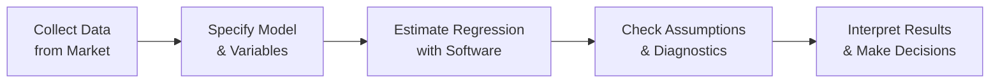

## 1.1 Multiple Regression Foundations and Applications

Multiple regression is like the sturdy engine under the hood of many financial models. It extends the basic concept of simple linear regression—where we have one explanatory variable—to a more nuanced approach that can handle multiple predictors at the same time. This is unbelievably handy when, say, we want to explain stock returns using factors like GDP growth, commodity prices, market performance, company-specific metrics, and more. It might feel a bit intimidating at first—trust me, I remember the first time I tried adding three or four variables into my analysis, I felt like my spreadsheet was about to explode. But once you get comfortable with it, multiple regression can become your go-to tool for capturing a richer story behind your data.

Multiple regression is used frequently in finance for equity analysis, risk management, and macroeconomic forecasting. To keep everything organized, we’ll walk through the key assumptions, how to interpret coefficients, common financial applications, a real-world example inspired by the Canadian market, and a few final tips and references. By the end of this, you’ll see how multiple regression fits neatly into broader financial analysis techniques—tying in with topics found in subsequent sections of Chapter 1, as well as linking to using time-series analysis (Section 1.3) and forecasting macro variables (Chapter 2).

## Purpose and Definition

The essential idea of multiple regression is that we’re trying to explain or predict a dependent variable Y using more than one independent variable (X₁, X₂, …, Xₖ). In finance, Y could be a company’s return, a firm’s profitability ratio, or GDP growth. Each X represents a factor that you suspect might influence Y: perhaps a market index, interest rate, or commodity price. Formally, we might write it as:

$$
Y = \beta_0 + \beta_1 X_1 + \beta_2 X_2 + \dots + \beta_k X_k + \epsilon
$$

where:
• Y is the dependent variable (the one we want to explain),  
• \\(X_1, X_2, …, X_k\\) are the independent variables (or predictors),  
• \\(\beta_0\\) is the intercept,  
• \\(\beta_1, \beta_2, …, \beta_k\\) are the slope coefficients,  
• \\(\epsilon\\) is the error term capturing deviations not explained by the model.

By incorporating multiple predictors, the model can detect how each factor influences Y while holding the other factors constant. Which is pretty neat—no more saying "well, maybe this was driven by GDP growth, or maybe it was just the stock market." Multiple regression helps tease out which variables truly matter.

## Key Assumptions

Lurking behind multiple regression is a set of assumptions that must be met (or at least approximately met) to trust our results. These assumptions matter because if they’re violated, our inferences—like p-values and confidence intervals—can be unreliable.

Linearity:  
We assume there’s a linear relationship between the dependent variable and each of the independent variables. It’s "linear" in the coefficients: Y changes by \\(\beta_1\\) units with a one-unit change in \\(X_1\\), holding everything else constant. In practice, we might check linearity by scrutinizing scatterplots or residual plots.

Independent and Identically Distributed Errors:  
We want the errors, \\(\epsilon\\), to be independent from one data point to the next. For time-series data, this can be problematic if autocorrelation creeps in (e.g., stock returns on Monday are related to stock returns on Tuesday). We also assume errors come from the same distribution, meaning the data generation process shouldn’t change over time.

Homoskedastic Errors:  
Say that five times fast. Homoskedasticity means the error variance is constant across all levels of the independent variables. If the variance gets larger or smaller for different values of \\(X_1\\), we say the errors are heteroskedastic. Heteroskedastic errors can lead to inaccurate estimates of standard errors and p-values.

No Perfect Multicollinearity:  
Multicollinearity occurs if some (or all) independent variables are strongly correlated with each other. This can make it impossible (or very difficult) to estimate the contribution of each variable uniquely. For instance, if you have two variables that both measure essentially the same thing—like “return on the TSX Composite Index” and “return on a broad Canadian market portfolio”—they may be redundant.

Errors Normally Distributed:  
For hypothesis testing and constructing confidence intervals, we usually assume residuals are normally distributed. In large samples, the Central Limit Theorem helps (errors may approximate normality), but it’s still good to check with histogram or Q-Q plots of residuals.

## Interpreting Coefficients and P-Values

Each slope coefficient \\(\beta_j\\) represents how much Y changes with a one-unit change in \\(X_j\\), holding other variables constant. In a finance context:  
• If \\(\beta_2\\) is 0.5 for the “oil price” variable, that suggests a 1 point increase in oil price is associated with a 0.5 point increase (or percent, or however you measure Y) in your dependent variable, everything else staying the same.  

From a statistical standpoint, we check if the coefficient is significantly different from zero by looking at its p-value. A small p-value (like <0.05 or <0.01) suggests that the relationship is statistically significant. That means we're fairly confident there’s a real relationship there. However, be mindful that a significant result doesn’t necessarily imply a large economic impact; practical significance can differ from statistical significance.

## R-squared and Adjusted R-squared

The coefficient of determination, \\( R^2 \\), often emerges in conversations about how "good" a model is. In plain English, it measures the proportion of the variation in Y that’s explained by the model. If \\( R^2 = 0.80 \\), for instance, we’re saying 80% of the variation in Y is accounted for by our variables.

But there’s a catch: adding more variables will never decrease \\( R^2 \\). In fact, you might see \\( R^2 \\) keep inching up if you throw in enough random variables. That’s where the adjusted \\( R^2 \\) swoops in, imposing a penalty for adding more predictors. If a new variable isn’t actually helping, the adjusted \\( R^2 \\) won’t rise (and might even fall).

## Financial Applications

In the CFA world, multiple regression is a go-to method in a variety of scenarios:

Equity Analysis:  
Use multiple regression to see how individual factor exposures (like market beta, size, value, or momentum) affect stock returns.

Risk Management:  
Model Value at Risk (VaR) by regressing returns on a set of macroeconomic indicators or market factors. You might be able to figure out how changes in interest rates, inflation, or volatile commodity prices shape the worst-case outcomes for your portfolio.

Economy-Wide Forecasts:  
Think of predicting GDP growth or inflation using variables like consumer confidence, unemployment, interest rates, or oil prices. Multiple regression offers a structured way to harness multiple data sources at once.

Corporate Profitability:  
Analysts might model a firm’s return on equity using operational variables such as sales growth, leverage ratios, or cost of capital, helping to see which operational levers truly drive profitability.

Wherever there are multiple intertwined factors, multiple regression has a seat at the table. In fact, you’ll see it again in many advanced topics—like in time-series analysis (Section 1.3) for forecasting stock prices or GDP.

## A Practical Canadian Example

To bring this closer to home, imagine you’re an analyst in Toronto, wanting to forecast the stock returns of a major Canadian bank—let’s pick the Royal Bank of Canada (RBC). RBC’s returns can be influenced by a bunch of factors. Let’s define:

• \\( Y = \text{Return}_{\text{RBC}} \\) (in percent)  
• \\( X_1 = \text{GDP Growth} \\) (e.g., real GDP changes for Canada)  
• \\( X_2 = \text{Oil Price} \\) (since energy is a big chunk of Canada’s economy)  
• \\( X_3 = \text{Return on the S\&P/TSX Composite Index} \\)  

The multiple regression model could look like:

$$
\text{Return}_{\text{RBC}} = \beta_0 + \beta_1(\text{GDP Growth}) + \beta_2(\text{Oil Price}) + \beta_3(\text{TSX Return}) + \epsilon
$$

By estimating this model on historical data, you might find that RBC returns are highly sensitive to overall market swings (\\(\beta_3\\)), somewhat sensitive to commodity prices (\\(\beta_2\\)), and moderately linked with GDP growth (\\(\beta_1\\)). If RBC’s stock is especially correlated with the broad market, that means your portfolio risk might be more "macro-driven" than a smaller, regionally focused Canadian bank stock might be.

Of course, you would want to check the assumptions—are the errors autocorrelated because we’re dealing with time-series data? Are RBC’s returns heavily correlated with the TSX index, giving us multicollinearity issues? Tools like the Durbin–Watson test (for autocorrelation) or Variance Inflation Factor (for multicollinearity) can come to the rescue.

## Implementation Tips

Data Quality:  
You can’t get results you trust if your data looks like Swiss cheese or is measured misleadingly. Make sure your sources—like Statistics Canada, the US Federal Reserve (FRED), or other vendors—are robust and consistent.

Check for Stationarity and Seasonality:  
Time-series data often has trends or seasonal cycles, as you might expect in macro variables like GDP or inflation. If your data isn’t stationary, you might consider differencing or other transformations.

Diagnose Violations:  
If you find heteroskedasticity (via White’s test or Breusch-Pagan test), consider using robust standard errors. If you see autocorrelation, Newey–West errors or the inclusion of lagged variables might help.

Interpretation Over Blind Projection:  
It’s easy to get a big table of coefficients and R-squared values without pausing to ask, "Does this make economic sense?" Always weigh your regression results against financial theory or reasoned understanding of how markets operate.

Software Tools:  
Excel, R, Python, EViews—pick your weapon of choice. Typically, you’ll run a regression command, check the output (coefficients, standard errors, p-values, R-squared), and run diagnostic tests.

## Some Personal Reflections

I remember the first time I tried to regress 10 variables against monthly stock returns. My R-squared shot up, and I was so excited. But then I realized half my variables were basically duplicates—like the TSX index and a TSX financial index. My model was riddled with multicollinearity, and the t-stats were all over the place. Perhaps I was so enamored by "bigger is better" that I fell into that classic trap. Moral of the story? More variables are not always better—quality trumps quantity.

## Visualizing the Multiple Regression Workflow

Below is a simple flowchart that outlines the typical steps you’d go through when applying multiple regression in a financial context:

## Glossary

Dependent Variable:  
The variable we're trying to explain (e.g., RBC’s returns).

Independent Variables (Predictors):  
The factors suspected to influence the dependent variable (e.g., GDP growth, interest rates).

Multicollinearity:  
A high degree of correlation among independent variables, making it tough to interpret individual coefficients.

Homoskedasticity:  
Constant variance of error terms across observations.

Heteroskedasticity:  
When the error variance changes across data points.

Serial Correlation (Autocorrelation):  
Errors are correlated over time, common in time-series data.

Residuals (Errors):  
The difference between actual and predicted values of the dependent variable.

P-Value:  
The probability of observing the test statistic under the null hypothesis; helps determine statistical significance.

## Final Thoughts and Exam Tips

• Know Your Assumptions:  This is major. If the exam question focuses on diagnosing a problem, they might ask: "How do you detect heteroskedasticity?" or "What does multicollinearity do to your coefficients?"  
• Watch for Multicollinearity:  Don’t get lulled into adding all sorts of variables in your model just to bump up R-squared. The exam (and real life) loves to quiz your understanding of the trade-offs.  
• Interpret Coefficients Carefully:  The exam might present you with a scenario where one coefficient is large but not statistically significant. Be prepared to discuss what that implies.  
• Remember the Adjusted R²:  They love to highlight that naive trick of adding extra variables to "improve" R-squared. Show you know the difference.  
• Always Think Practical Significance:  The exam sometimes includes questions about whether the effect is "economically meaningful," not just statistically significant.  

Stay curious, second-guess your results, and always read the question carefully. In my opinion, it’s totally fine to get that tingle of excitement when your regression model yields a crisp interpretation—just remember that regression can mislead if you don’t keep an eye on the fundamentals.

## References

• CFA Institute Level II Curriculum (Quantitative Methods)  
• Wooldridge, J. "Introductory Econometrics"  
• Damodaran, A. (2012). "Investment Valuation"  
• US Federal Reserve Economic Data (FRED): https://fred.stlouisfed.org  
• Statistics Canada Data Portal: https://www150.statcan.gc.ca  

## Test Your Knowledge: Multiple Regression Foundations and Applications



### Which of the following is most likely a key assumption in multiple regression analysis?

- [x] The residuals (errors) should be independently distributed with constant variance.
- [ ] The dependent variable must be examined using only one predictor.
- [ ] The independent variables must be perfectly correlated.
- [ ] The regression can only be run on daily data.

> **Explanation:** Multiple regression assumes no perfect multicollinearity, independence of errors, and homoskedasticity. Perfect correlation among predictors violates a key assumption.

### When interpreting the slope coefficient in a multiple regression model, what does it represent?

- [ ] The point where the regression line crosses the y-axis.
- [x] The expected change in the dependent variable for a one-unit change in that independent variable, holding other factors constant.
- [ ] The total unexplained variation.
- [ ] The difference between actual and predicted values.

> **Explanation:** The slope coefficient estimates how much the dependent variable changes for each unit increase in that particular predictor, assuming other predictors stay the same.

### Which statement about adjusted R-squared is correct?

- [ ] It does not penalize the researcher for adding more variables to the model.
- [x] It adjusts for the number of independent variables in the model and penalizes excessive inclusion of irrelevant predictors.
- [ ] It indicates the probability of all predictors being statistically significant.
- [ ] It must always be higher than R-squared.

> **Explanation:** Adjusted R-squared imposes a penalty for adding non-informative predictors, preventing misleading inflation of the explanatory power.

### A researcher runs a regression with monthly data and suspects serial correlation. Which of the following diagnoses is most appropriate?

- [ ] Checking the R-squared for high or low values.
- [ ] Checking the intercept term for significance.
- [x] Performing the Durbin–Watson test on the residuals.
- [ ] Creating a scatterplot of the dependent variable vs. time.

> **Explanation:** The Durbin–Watson statistic is a recognized test for detecting serial correlation in regression residuals, which is critical for time-series data.

### Suppose you include two highly correlated independent variables in your model (e.g., TSX Index returns and a nearly identical market index). What risk do you run?

- [ ] Heteroskedasticity of the errors.
- [ ] Autocorrelation among the errors.
- [x] Multicollinearity, making it difficult to interpret coefficient estimates.
- [ ] Reduced model complexity and smaller R-squared.

> **Explanation:** Including highly correlated variables can result in multicollinearity, which bloats standard errors and complicates interpretation.

### Why is a small p-value (e.g., < 0.05) often referenced in multiple regression analysis?

- [ ] It indicates a model automatically has no heteroskedasticity.
- [ ] It proves perfect correlation among variables.
- [ ] It guarantees a 5% forecast error margin.
- [x] It suggests that the coefficient in question is likely different from zero (statistically significant).

> **Explanation:** A p-value < 0.05 often indicates the null hypothesis (that a coefficient is zero) can be rejected with 95% confidence, implying statistical significance.

### If your model has high R-squared but the residual plots show a funnel shape (errors getting larger over time), which assumption might be violated?

- [x] Homoskedasticity.
- [ ] Linearity between variables.
- [x] Multicollinearity.
- [ ] Independence of errors.

> **Explanation:** A funnel shape in residuals suggests variance of errors isn't constant (heteroskedasticity). Also, watch carefully; the question might be tricky. The funnel shape directly points to heteroskedasticity, not multicollinearity. If you see funneling, the best immediate guess is a violation of homoskedasticity.

### Which of the following is most commonly used as a robust technique if you detect heteroskedastic errors?

- [x] White (robust) standard errors.
- [ ] Using a logarithmic scale for the dependent variable only.
- [ ] The Jarque-Bera test.
- [ ] Removing all variables from the model.

> **Explanation:** White’s (robust) standard errors can correct the standard errors to account for heteroskedasticity, improving inference validity.

### When running a multiple regression on time-series data, how can we address the challenge of autocorrelation?

- [x] Employ Newey–West standard errors or include lagged terms.
- [ ] Use fewer independent variables.
- [ ] Alter the intercept to be zero.
- [ ] Accept that standard errors are always reliable with daily data.

> **Explanation:** Newey–West standard errors are commonly used to adjust for autocorrelation (and heteroskedasticity) in time-series regressions.

### In multiple regression, R-squared always increases when additional predictors are added. (True/False)

- [x] True
- [ ] False

> **Explanation:** R-squared never decreases if you add more variables; it can stay the same or increase. But that’s exactly why we have adjusted R-squared, to penalize adding predictors that have little explanatory power.




