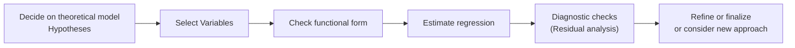

## 1.2 Model Specification, Misspecification, and Extensions

Sometimes I think back to when I first learned regression. I remember sitting in a small study room with my friend, who was absolutely convinced that if he put every single variable he could think of into his model—things like yesterday's temperature or the number of coffee cups he'd had that morning—he’d get the "best" analysis. Turns out, that approach sank faster than a poorly built boat. That was my first real lesson in the importance of proper model specification. In this section, we’ll talk about what that means, why we often make mistakes (misspecification), and how to extend our regression to capture more complex real-world relationships.

Before we jump into the details, keep in mind that this content builds upon our discussion in Section 1.1 concerning the fundamentals of Multiple Regression. If you need a quick refresher on ordinary least squares (OLS), hypothesis testing, or the assumptions behind regression models, you might want to glance back at that section.

Let’s dive right in.

---

### The Essence of Model Specification

Model specification is basically your game plan—like picking which players you want on the field and deciding your strategy. You’ve got to figure out:

• Which independent variables (predictors) are relevant.  
• How these variables should enter the model (linear form vs. nonlinear transformation).  
• The overall functional form (like a plain linear regression, a polynomial, or a log-linear model).  

This is crucial because your final model’s validity hinges on it. Think of it like building a house: using the correct blueprint with the right materials ensures the final structure is sturdy. If you leave out crucial structural beams (i.e., important variables) or try to add decorative pillars that don’t fit (irrelevant predictors), you can compromise the entire project.

#### Under-Specification vs. Over-Specification

There’s a common dilemma in building statistical models:

• Under-specification means you might have omitted a relevant variable. This can cause a bias in the coefficients, especially if the missing variable is correlated with the included ones.  
• Over-specification, on the other hand, feels like adding too much seasoning to a dish. Sure, you might stumble onto some interesting flavors, but you may also bury the main taste under a bunch of random spices. Similarly, in statistics, adding tons of irrelevant variables can inflate the variance of your estimates, making it tougher to detect true relationships.

---

### Common Forms of Misspecification

Nobody’s perfect, and that’s particularly true in modeling. Mistakes happen—some big, some small. Here are some ways we can get it wrong.

#### 1. Omitting Relevant Variables

Omitting a relevant variable is a big no-no, especially if that variable is correlated with the regressors you included. The classic example is a wage equation that leaves out years of education. If “years of education” is correlated with “age,” or “industry experience,” your results suddenly become pretty wonky. You’re effectively letting the omitted variable’s effect get lumped into the included regressors, messing up your coefficient estimates and interpretations.

• Real-World Example: Suppose you’re modeling housing prices in a Canadian city. If you forget to include something important like distance to a major train station, you might see your model attribute extra significance to random variables like the number of nearby grocery stores or local crime rates. That’s because the distance to the train station might be correlated with these other variables in some subtle way, biasing your results.

#### 2. Including Irrelevant Variables

Picture this scenario: you’ve got a strong suspicion that a new variable—maybe “average monthly rainfall”—should be included in your model of consumer spending. But let’s face it: unless your spending is heavily dependent on the weather (like umbrella sales), you might just be adding noise. Including irrelevant variables can:

• Increase the complexity of the model,  
• Decrease the precision of your estimates (bigger standard errors),  
• Confuse the interpretation of your results, especially if readers keep asking, “What’s with the rainfall variable?”

So, do you see how letting your model be guided by a “throw everything at the wall and see what sticks” mentality can lead to confusion?

#### 3. Wrong Functional Form

Sometimes you see a scatter plot of your data and it’s pretty obvious you’ve got a curve in your relationship. But we still force-fit a linear line out of habit or convenience. That’s a “wrong functional form” misspecification. 

• Consequences: The coefficients you estimate might not capture the real pattern, and predictions will be systematically off.  
• Solutions: Insert transformations (like polynomial terms or logs), or do more robust parametric or nonparametric forms, so your model can capture actual data patterns.

Example: If you suspect that the effect of an interest rate on corporate spending diminishes beyond a certain point, a polynomial or a piecewise linear function might work better than a plain linear slope.

#### 4. Measurement Error in Variables

So, you’re collecting data for “annual advertising spend” but your data is riddled with errors—some CFO reported it for the entire region, others reported monthly averages, etc. If your main independent variable is measured incorrectly, you’ll likely get a biased slope and confidence intervals that lie to you. 

• Strategies to Overcome: “Instrumental variable” approaches, data cleaning, or robust measurement techniques can help when you suspect your variable measurement is fuzzy.

---

### Qualitative (Dummy) Variables

Let’s face it: not every influential factor in finance is numeric. Sometimes you want to model the presence or absence of an event: an acquisition, a shift in U.S. or Canadian trade policy, or even something intangible like “new CEO at the helm.”

Dummy variables let you represent these on-off conditions in your regression. If the event is present, you code it as 1; otherwise, it’s 0. This is super handy for:

• Structural breaks: Did Canadian interest rate policies change drastically in 2010? Pop a dummy variable for data points post-2010 to see how that new policy might have shifted a certain trend.  
• Categorical Organization: Industries, regions, or big policy announcements (like NAFTA vs. USMCA trade environment) can also be represented.  

Be mindful of the “dummy variable trap,” where you accidentally include an unneeded reference category that leads to perfect multicollinearity. Typically, if you have k categories, you include k-1 dummies, leaving one category as the baseline.

---

### Interaction Terms

Let’s say you suspect that the impact of one variable depends on another. For instance, maybe rising oil prices multiply an effect on Canadian energy stocks more than on other industries. You can capture that synergy by adding an interaction term: the product of the two variables.

• Example Format: Suppose we have Price of Oil = X1 and a dummy for Canadian Energy Sector = D. Then we define an interaction: X1 × D.  
• Benefits: Captures the idea that changes in oil price might matter more (or less) for a specific segment.

In practice, you might interpret the interaction coefficient as how the slope of X1 changes when D = 1. In other words, "the effect of X1 on Y is shifted by this many units if D = 1."

---

### Influence Analysis

Anyone who’s ever had that bizarre data point in a scatter plot—like a revenue figure that’s 1000 times higher than the next highest—knows how strongly outliers can skew a regression line. Influence analysis helps us detect if a data point is too influential, has high leverage, or is exerting outsized control over the regression.

• **Cook’s Distance**: A measure capturing how much your regression estimates (coefficients) would change if you drop one observation.  
• **High-Leverage Points**: Observations with unusual X-values relative to the rest of your data. If the X-value is far from the mean of X, it can shift your entire line.  
• **DFBETA**: Another measure that looks at the impact on individual coefficients when a particular observation is excluded.

Practical Tip: If you spot a data point with suspiciously high influence, investigate whether it’s a genuine data point or a data error. If it’s genuine, you might want to try robust regression methods or segment your dataset.

---

### Practical Extensions

So far, we’ve covered ways we typically go wrong—or at least ways we might be a little misguided. But there are also ways to extend our straightforward linear regression for more advanced analyses.

#### Polynomial Regression

Polynomial regressions can help you capture the idea that the effect of X changes in a nonlinear way. Maybe the effect of inflation on bond yields grows at a decreasing rate, or the effect of average monthly hours worked saturates after a certain point.

• Example:  
  (Y) = β₀ + β₁(X) + β₂(X²) + ε  

Sometimes you might even include higher orders like X³, but watch for overfitting. As you degree-up, you could be modeling the noise rather than the real signal.

#### Log-Linear Models

When your data grows exponentially—like GDP, population, or sales volumes—log transformations can often linearize your relationship. For instance:

• If you hypothesize that a 1% change in X leads to a certain percent change in Y, it’s typical to run a log-log regression:  
  ln(Y) = β₀ + β₁ ln(X) + ε  

• Or if you suspect that the absolute change in Y depends on a percentage change in X, a log-linear approach might be the ticket:  
  ln(Y) = β₀ + β₁ X + ε  

Quick personal note: I find log-linear models super neat for analyzing economic time-series data like GDP, population, or corporate revenue, because it simplifies interpreting coefficients into percentage changes, which can be more intuitive than raw slopes.

---

### Diagrams: A Step-by-Step Model Building Overview

Below is a simple Mermaid diagram illustrating a step-by-step process for deciding on your model specification and refinement. Notice how we keep iterating until we land on something that’s both statistically sound and practically relevant.

---

### Comprehensive Example: House Prices

To tie things together, let’s do a hypothetical example involving house prices. Suppose you want to model the relationship:

• Dependent variable (Y): House Price  
• Independent variables: Square footage (X1), Age of building (X2), and a dummy for whether the home is located within the city center (D).  

#### Under-Specification Example

- You omit “Number of bathrooms” (X3). If bathrooms matter and they align well with square footage, your estimate on square footage might pick up the effect of “bathrooms” too, biasing your interpretation that square footage alone is driving everything.

#### Over-Specification Example

- You randomly add “Local volunteers in the area” (X4) or some random factor that has no direct effect on house price. This might just cause your standard errors to inflate.

#### Wrong Functional Form

- Maybe the relationship with Age is nonlinear, such that older buildings lose value initially but then might go up in value if they’re designated as historical or have classic architectural significance. A polynomial in Age might capture that.

#### Interaction Terms

- Perhaps you suspect that the effect of square footage is bigger if the home is in a city center (maybe urban areas place a higher premium on each additional foot of space). You create an interaction term X1 × D to see if the slope for square footage is different for homes in city centers vs. those outside.

#### Influence Analysis

- You check Cook’s Distance for each observation and find that a single mansion with 15,000 square feet (way larger than typical) is heavily influencing your slope. You investigate further.

---

### Glossary

• **Underfitting**: Model is too simple, excluding important variables/features; likely leads to biased or incomplete results.  
• **Overfitting**: Model is too complex or includes a heap of irrelevant variables; it captures noise rather than the true signals, leading to poor out-of-sample performance.  
• **Dummy Variable**: A 0/1 indicator representing presence or absence of a condition, category, or regime.  
• **Cook’s Distance**: A measure to detect how much an observation impacts the fitted regression parameters.  
• **High-Leverage Point**: A data point with unusual predictor values that can sway the regression line significantly.  
• **Interaction Term**: A variable formed by multiplying two predictors, capturing how an effect shifts or changes in combination with another variable.

---

### Final Exam Tips for Model Specification and Misspecification

• **Understand the Why**: Always link your variables to a strong theoretical or economic rationale. If you can’t explain why a variable should be in your model, think twice before including it.  
• **Check Diagnostics**: After running your regression, look at residual plots, test for omitted variables, and evaluate outliers. Don’t skip this step.  
• **Be Wary of “P-Hacking”**: Resist the temptation to mindlessly add or remove variables just to get pretty p-values. You’ll sacrifice interpretability and possibly introduce biases.  
• **Nonlinearities**: Don’t assume everything is linear. Investigate transformations, polynomials, or piecewise definitions if your domain knowledge suggests a curve.  
• **Policy Shifts**: Especially relevant with cross-border finance in Canada and the U.S., remember to incorporate dummy variables for regulatory or policy breaks.  
• **Influence Analysis**: Run influence metrics like Cook’s Distance or leverage scores to ensure that one or two outliers aren’t running the show.  

In exams—particularly on the CFA Level II—be prepared for questions that combine real-world context with theoretical knowledge. You might see a vignette describing an analyst’s regression setup, then you have to spot if they omitted a variable or used the wrong functional form. Sharpen your radar for these pitfalls.

---

### Reference List

• CFA Institute Level II Curriculum (Quantitative Methods)  
• Greene, W. (2018). Econometric Analysis.  
• Dielman, T. E. (2005). Applied Regression Analysis.  
• Canadian Journal of Statistics. (https://www.ssc.ca/en/cjs)  
• US Bureau of Economic Analysis (BEA) data. (https://www.bea.gov)  

---

## Test Your Knowledge: Model Specification, Misspecification, and Extensions



### Which best describes under-specification in a regression model?

- [ ] Adding too many irrelevant variables that increase noise.  
- [x] Omitting a relevant variable that leads to biased estimates.  
- [ ] Using an incorrect functional form that misrepresents the relationship.  
- [ ] Having too many outliers in the data.  

> **Explanation:** Under-specification happens when you omit relevant variables. If those omitted variables are correlated with included regressors, the estimated coefficients may be biased.

### If you suspect that the relationship between interest rates and consumer spending is nonlinear, which approach might best address this concern?

- [ ] Adding more dummy variables.  
- [ ] Using a simple linear regression.  
- [x] Introducing a polynomial term, such as interest rate squared.  
- [ ] Removing the interest rate variable altogether.  

> **Explanation:** Nonlinearities can often be captured by polynomial terms or transformations. Using a squared term (or higher order) helps detect curvature in the relationship.

### What is the role of a dummy variable for capturing structural breaks in a regression model?

- [x] It indicates the presence or absence of a regime shift or event (e.g., policy change) by switching between 0 and 1.  
- [ ] It increases the degree of the polynomial to detect nonlinearity.  
- [ ] It is only used to identify outliers.  
- [ ] It ensures perfect multicollinearity in the model.  

> **Explanation:** A dummy variable can denote periods before and after a policy change or major event, letting you test if there’s a structural break in the relationship.

### What is an interaction term in regression?

- [ ] A linear transformation of a single independent variable.  
- [ ] A measure of how strongly data points conform to normality.  
- [x] A product of two variables that captures how a variable’s effect changes at different levels of another.  
- [ ] A dummy variable that equals 1 if the main variable is significant.  

> **Explanation:** Interaction terms allow the effect of one predictor to vary depending on the level of another, providing a richer view of how variables interact.

### Which statement correctly describes how over-specification might affect your regression estimates?

- [x] It can inflate the variance of coefficient estimates and reduce the power to detect true relationships.  
- [ ] It always improves prediction accuracy.  
- [ ] It forces the slope estimates to be biased downward.  
- [ ] It solves multicollinearity issues completely.  

> **Explanation:** Over-specification, or stuffing your model with too many irrelevant variables, needlessly increases the complexity and inflates standard errors, making it harder to find significant predictors.

### Cook’s Distance helps analysts identify which problem in a dataset?

- [x] Observations exerting excessive influence on the overall regression model.  
- [ ] Variables with incorrect functional forms.  
- [ ] Variables that are irrelevant.  
- [ ] Perfect multicollinearity among predictors.  

> **Explanation:** Cook’s Distance measures how much a single data point influences the fitted regression coefficients. A high Cook’s Distance suggests an outlier or leverage point of concern.

### In a log-linear model where ln(Y) = β₀ + β₁ X + ε, how would you interpret β₁?

- [x] A one-unit change in X leads to approximately a 100 × β₁ percent change in Y.  
- [ ] A one-unit change in X shifts Y’s standard deviation by β₁.  
- [ ] A one-percent change in X leads to a β₁% change in Y.  
- [ ] A one-unit change in X leads to a (β₁)^2 shift in the log of Y.  

> **Explanation:** In a log-linear model (log of Y, level of X), β₁ × 100 is roughly the percent change in Y for a one-unit increase in X.

### If you suspect your dependent variable grows exponentially with the independent variable, which transformation is typically most appropriate?

- [x] A log transformation of the dependent variable.  
- [ ] A dummy variable.  
- [ ] A polynomial of the independent variable.  
- [ ] Adding more random explanatory variables to represent growth.  

> **Explanation:** Exponential relationships often become approximately linear when taking the logarithm of the dependent variable, enabling simpler interpretation of slopes.

### What is the main drawback of including irrelevant variables in a regression model?

- [ ] It reduces the chances of omitted variable bias.  
- [ ] It ensures a perfect fit on your training dataset.  
- [x] It unnecessarily inflates the standard errors of your estimators.  
- [ ] It guarantees better predictions.  

> **Explanation:** Including irrelevant variables “dilutes” the influence of relevant predictors, inflating standard errors and complicating the interpretation of your model.

### When detecting measurement error in an independent variable, which is true?

- [x] It can bias the estimated slope if the error is systematically related to other variables.  
- [ ] It never biases the regression; it only affects the dependent variable.  
- [ ] It always results in perfect collinearity.  
- [ ] It enhances the goodness-of-fit measure.  

> **Explanation:** Measurement error in a key independent variable can bias coefficient estimates, particularly if the mismeasurement is correlated with other regressors or the error is systematic.


