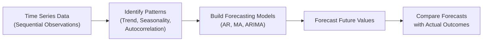

## 1.3 Time-Series Analysis and Forecasting Techniques

Time-series analysis is often regarded as one of the more fascinating—maybe sometimes a bit daunting—frontiers in finance. We’re basically taking historical data points collected over time (e.g., monthly returns, interest rates, inflation, corporate earnings) and trying to peek into the future. It’s not magic, even if it can feel that way when you see a good forecast. Rather, time-series forecasting relies on systematic models grounded in data patterns, including trend, seasonality, and autocorrelation. Let’s walk through the key ideas, from the basics of stationarity to the finer points of ARIMA models.

Understanding the difference between time-series data and cross-sectional data is a good place to start. Cross-sectional data typically examines multiple entities at a single point in time, while time-series data looks at a single entity (e.g., a stock or an economic indicator) observed over multiple, sequential time periods. In cross-sectional analysis (like a snapshot of 100 companies’ P/E ratios at year-end), we’re mostly concerned with how each company differs from the others. But in time-series analysis, we care about how a single company’s data evolves from, say, January to February to March, and so on.

It might help to picture it like this:

Time-series models are widely used to forecast everything from GDP growth and inflation to each day’s close on stock indices. The general idea? Look for patterns in how a variable changes across time, then harness those patterns to predict future outcomes.

---

### Differences from Cross-Sectional Data

One of the biggest distinctions between time-series and cross-sectional datasets is the presence (and importance) of autocorrelation. If you think about it, it’s pretty logical: Yesterday’s stock price may be somewhat informative about today’s stock price. Last quarter’s earnings might be helpful for anticipating next quarter’s earnings. Time-series data points are naturally arranged in sequence, which can cause correlation between observations at different time intervals. This can be a blessing (it gives us a lead for forecasting) but also a huge pitfall if not properly accounted for in model-building.

In cross-sectional data, we often assume that observations are independent. However, in time-series data, not only are they rarely independent, but we also have to worry about stationarity—meaning the statistical properties of the series (like mean and variance) should remain constant over time. If they don’t, the usual statistical inferences can blow up in our faces.

---

### Stationarity and Autocorrelation

When someone says, “Is your data stationary?” they’re basically asking if the series is stable in the sense that it has a constant mean, constant variance, and any correlations between current and lagged values depend only on the lag length, not on the time at which the series is observed. Why is stationarity so important? Because the usual statistical techniques—like standard hypothesis testing of significance, building confidence intervals—beg for stationarity assumptions. If your data is non-stationary, you might detect patterns that are purely spurious, or your forecasts might wander off without any real-quality predictive control.

One common technique to check for stationarity is the Augmented Dickey-Fuller (ADF) test. There’s also the KPSS test. If a time series fails these tests (i.e., it has a unit root), you can often fix it by differencing. For instance, if the series is the price of a stock, you might take the first difference (i.e., Pₜ – Pₜ₋₁) to get returns, which are typically more stationary. Once you have a stationary process, it’s game on for modeling.

A word of caution: even if your data passes the stationarity test in a formal sense, always do a sanity check. It’s easy to run a test, see p-values, and move on. But the real world can be messy. Maybe your series was stationary in the past, but big regime changes or structural breaks mean it’s no longer stationary going forward.

---

### Autoregressive (AR) Models

The first major category of models is the Autoregressive (AR) family. If you want to forecast the current observation based on some combination of previous observations, say p lags, you’re using an AR(p) model. In the AR(1) case, you might be saying:

Xₜ = c + φ₁ Xₜ₋₁ + εₜ,

where:
• c is a constant,
• φ₁ is the coefficient on the immediate prior value of X,
• εₜ is white noise (the random error that’s assumed to be uncorrelated with past observations).

For instance, if we’re modeling monthly returns on the S&P/TSX, an AR(1) model states that this month’s return is (roughly) a linear function of last month’s return plus some random shock. If φ₁ is large and positive, it means that if last month had a big positive return, this month might also be above average. But you also need to watch out for stability conditions (like |φ₁| < 1). If φ₁ is greater than 1 in absolute value, your process can blow up or simply not be stationary.

If single-lag dependence isn’t sufficient, you can go to AR(2) or higher. But in practice, many financial series don’t need super high-order AR terms to capture the main patterns. Overfitting is real—if you keep adding lags, you can manufacture a great fit for historical data but produce poor out-of-sample forecasts.

---

### Moving Average (MA) Models

Moving Average (MA) models are a slightly different beast. Instead of using past values of the variable itself, MA models incorporate past errors (or innovations). In the MA(q) model, the current value Xₜ depends on a combination of the last q error terms:

Xₜ = μ + θ₁ εₜ₋₁ + θ₂ εₜ₋₂ + … + θq εₜ₋q + εₜ,

where:
• μ is the mean,
• θ₁, θ₂, …, θq are the MA parameters,
• εₜ, εₜ₋₁, …, εₜ₋q are white-noise error terms.

So if something unusual (shock) happened last period, it can still affect the current period. MA models can be handy when the data shows short-lived autocorrelations that fade quickly instead of persisting. For instance, some commodity price changes can exhibit a shock pattern: a sudden supply disruption may affect prices for a few days (the “shock lingers”) before everything reverts to normal.

---

### ARMA and ARIMA Models

If AR models capture the dependence on past values and MA models capture the dependence on past errors, you might guess we can merge them. And you’d be right.

An ARMA(p, q) model has both AR and MA parts. That means the data depends on its own past values (like AR) and shocks (like MA). This is often powerful when the data has multiple layers of correlation that can’t be explained by just one approach.

Adding an “I” for “Integrated” yields ARIMA, shorthand for Autoregressive Integrated Moving Average. This “Integrated” term means the model includes differencing steps to make the data stationary. If you suspect your time series has a unit root, you might difference the data until it no longer has that root. For instance, financial asset prices often need differencing to transform them into returns. Hence, if you see a model described as ARIMA(1,1,1), that means:
• You difference the original series one time (that’s the “1” in the middle),  
• You fit an AR(1) on the differenced series,  
• And you also fit an MA(1) on that differenced series.

This synergy often works well if you’re modeling, say, interest rates or inflation—for which we suspect one difference might do the trick to get rid of unit root behavior.

---

### Unit Roots and Mean Reversion

A time series with a unit root is non-stationary, so it can wander away from its mean without bound. Think of an unrestricted random walk. For example, many economists hypothesize that stock prices follow a random walk without drift, or *with* drift. If a process has a unit root, it’s tricky to forecast because the best guess is simply the current value, plus whatever drift might exist.

Mean reversion, on the other hand, suggests that if the series is above its long-term average now, it might revert downward in the future. This is common in certain macroeconomic contexts: interest rates, commodity prices, and even some currency rates tend not to drift indefinitely. If there’s evidence of mean reversion, then an AR(1) with |φ₁| < 1 likely captures that effect. The closer |φ₁| is to 1, the slower the mean reversion. If φ₁ is smaller (in absolute value), the series reverts faster.

---

### Real-World Examples: The US and Canadian T-Bill Rates

In the US, consider the 3-month T-bill rate. You might suspect it’s persistent over time (i.e., high interest rates yesterday often imply high interest rates today). An AR(1) model might look like:

rₜ = c + φ rₜ₋₁ + εₜ,

where rₜ is the T-bill rate at time t. If we test for stationarity and find that differencing is unnecessary (for instance, if the series is already stationary around some shifting policy environment), that’s fine. Otherwise, we might difference it (Δrₜ = rₜ – rₜ₋₁) and then use an AR process on the differenced data. In practice, many short-term rates are found to be stationary or near-stationary, albeit with structural breaks tied to changes in monetary policy regimes (like 2008 or 2020 crises).

In Canada, you might do a parallel approach for the Bank of Canada overnight rate. Again, we’d test for stationarity—especially because some historically low interest-rate periods can induce weird behaviors. If the data is non-stationary, we might difference it or apply an appropriate ARIMA model. 

In both cases, after you fit the model, you’d check its performance with out-of-sample forecasts to see if it’s capturing interest-rate dynamics well. You’d also want to pay attention to macroeconomic fundamentals, such as policy statements and inflation, as these can prompt structural shifts that your time-series model might not automatically handle.

---

### Model Selection Criteria

One of my close colleagues jokes that modeling is all about “squeezing the best fit out of messy data with the fewest number of knobs possible.” That’s precisely where things like the Akaike Information Criterion (AIC) and Bayesian Information Criterion (BIC) show up. These criteria reward good model fit but penalize complexity. Piling on more lags might drive up your R², but you’ll pay for that in the AIC/BIC. Essentially, AIC and BIC identify which models give you the best trade-off between predictive power and simplicity. BIC penalizes heavier for extra parameters than AIC does, so if your sample size is not too big and you’re worried about overfitting, BIC can be a more conservative guide.

The typical approach: estimate a set of candidate AR, MA, ARMA, or ARIMA models (maybe AR(1), AR(2), ARMA(1,1), ARMA(2,1), etc.), then compare their information criteria. Usually, the model with the lowest AIC or BIC is the favored one, although practical considerations—like interpretability—matter, too.

---

### Best Practices and Pitfalls

Speaking of interpretability, keep in mind these major best practices (and a few pitfalls to avoid):

• Always Perform Stationarity Checks: Use the Augmented Dickey-Fuller (ADF) test or other stationarity tests. If the data is non-stationary, difference it or find a transformation that yields a stationary series.  
• Watch Out for Overfitting: Resist the temptation to keep adding lags or extra parameters.  
• Validate with Out-of-Sample Forecasts: Evaluate your model’s performance in data not used for estimation. That’s where the truth is revealed.  
• Look for Seasonality or Structural Breaks: If your data has strong seasonal patterns (e.g., retail sales, weather-impacted data), you might need seasonal differencing or more advanced seasonal ARIMA (SARIMA) models. Similarly, major policy shifts (like the 2008 crisis) may cause structural breaks.  
• Explore Residual Diagnostics: After fitting the model, check for autocorrelation in the residuals. If the residuals are not white noise, your model might be inadequate.  
• Economic Plausibility: Yes, time-series can feel mechanical, but do the results make sense in the context of macro fundamentals, corporate finance logic, or economic theories?

A story here: I once forecasted monthly inflation using an ARIMA(1,1,1) without stepping back and noticing that there was a major policy regime change. The model’s out-of-sample forecasts did great for a while, then drifted badly once the new policy environment kicked in. A re-estimation with a break date or a second model post-regime shift would have avoided that fiasco.

---

### The Role of Forecasting in Exams

From a CFA exam perspective, you’re usually not building advanced models in software, but you need to interpret results in the context of vignettes. You might be given partial outputs from, say, an AR(2) estimation, and be asked:

• Whether the series is stationary.  
• How to interpret the significance of the AR coefficients.  
• How to forecast future values.  
• How to compare different models based on AIC/BIC.  
• Whether the data might require differencing or additional transformations.

Don’t be surprised if an exam question concludes with, “Which is the best approach to forecasting the next period’s interest rate, given the data?” and you have to pick from answers that reflect an AR(1), ARIMA(1,1,0), or a simple random walk model. Mastering the concepts here sets you up well for quantitative methods problems.

---

### Conclusion and Final Examination Tips

When you see a time-series on an exam, check stationarity first. If it’s not stationary, consider differencing. Inspect the partial autocorrelation function (PACF) for AR terms and the autocorrelation function (ACF) for MA terms. Understand the basic ARMA identification logic—like if the ACF decays quickly but the PACF has a sharp cutoff, that might suggest an AR model. If the PACF decays quickly but the ACF has a sharp cutoff, that’s more likely an MA model. For ARIMA, remember the “I” is differencing.

Also keep in mind: no single model is always correct. In practice, you might test multiple possibilities and rely on diagnostic checks. For exam day, once you identify a time-series question, set out the steps methodically: stationarity check, identify patterns in ACF/PACF, propose a model, confirm residual diagnostics, pick the best using AIC/BIC, then do the forecast exercise. It’s a straightforward sequence once you master it.  

Good luck, and don’t forget—time-series can be your friend and a key to unlocking valuable forecasts, so long as you treat it with the respect it deserves.

---

### References and Further Reading

• CFA Institute Level II Curriculum (Quantitative Methods)  
• Box, G.E.P., Jenkins, G.M., Reinsel, G.C., & Ljung, G.M. (2015). “Time Series Analysis: Forecasting and Control.” Wiley.  
• Ruey S. Tsay (2010). “Analysis of Financial Time Series.” Wiley.  
• Bank of Canada Data: <https://www.bankofcanada.ca/rates/interest-rates>  
• Federal Reserve FRED Database: <https://fred.stlouisfed.org>  

---

## Time-Series Analysis and Forecasting Techniques: Examination Practice



### Which best describes a key difference between time-series data and cross-sectional data?

- [x] Time-series observations are collected over sequential points in time and often exhibit autocorrelation.
- [ ] Time-series observations typically involve data from multiple entities at the same time.
- [ ] Cross-sectional data measures autocorrelation and changing variance over time.
- [ ] Cross-sectional data cannot be used for regression analysis.

> **Explanation:** Time-series data are inherently sequential, making autocorrelation a defining feature.

### Which statement about stationarity is correct?

- [ ] A stationary series must have a zero mean.
- [ ] If a data series is stationary, its mean and variance can change in predictable seasonal patterns.
- [ ] Stationarity means the statistical properties (mean, variance) change following a random walk.
- [x] A stationary process exhibits constant mean and variance over time, and autocorrelations that depend only on lag length.

> **Explanation:** Stationarity requires that key statistical properties remain constant over time.

### In an AR(1) model, which of the following would typically imply a lack of stationarity?

- [x] An absolute AR coefficient greater than 1.
- [ ] A zero intercept term.
- [ ] A zero AR coefficient (φ = 0).
- [ ] Negative white-noise error terms.

> **Explanation:** For an AR(1) model Xₜ = φXₜ₋₁ + εₜ to be stationary, |φ| must be less than 1.

### Which best characterizes an MA(q) model?

- [ ] The current value depends on p lagged values of itself.
- [x] The current value depends on q lagged error terms.
- [ ] The current value is the first difference of a random walk.
- [ ] The current value is always stationary without differencing.

> **Explanation:** MA(q) stands for Moving Average (q), where past shocks (errors) determine the current observation.

### When combining AR and MA terms, which model do you get?

- [x] ARMA
- [ ] AR(∞)
- [x] ARIMA
- [ ] VAR

> **Explanation:** ARMA(p, q) merges autoregressive and moving average components; ARIMA adds integration (differencing).

### Which of the following is true about differencing?

- [x] Differencing can help transform a non-stationary series into a stationary one.
- [ ] Differencing cannot be used for financial data because price changes are random.
- [ ] An ARIMA(1,1,0) model means differencing was applied twice.
- [ ] Differencing is never used in interest rate modeling.

> **Explanation:** Differencing is a common approach to reduce a unit root and achieve stationarity.

### If a series has a persistent upward trend but eventually reverts to a stable long-run average, which concept does it illustrate?

- [x] Mean reversion
- [ ] Random walk
- [x] Stationary process
- [ ] Spurious correlation

> **Explanation:** Mean reversion implies the process tends to return to a long-term average after deviations.

### What is the primary purpose of the Akaike Information Criterion (AIC)?

- [x] Balancing good model fit with penalty for adding more parameters.
- [ ] Ensuring the AR(1) coefficient is less than 1 in absolute value.
- [ ] Guaranteeing stationarity in data by differencing.
- [ ] Identifying structural breaks in time-series data.

> **Explanation:** AIC helps compare model performance, penalizing excessive complexity.

### In practical forecasting of the Canadian overnight rate with an AR(1) model, what is often a key preliminary step?

- [x] Conducting stationarity tests like the ADF test.
- [ ] Setting φ = 1 to ensure a random walk model.
- [ ] Fitting a seasonal MA term to capture daily changes.
- [ ] Ignoring residual diagnostics if the R² is high enough.

> **Explanation:** Stationarity is crucial; applying the ADF test helps determine whether differencing or other transformations are needed.

### With respect to time-series structures, which statement is true?

- [x] True
- [ ] False

> **Explanation:** When you suspect a series has a unit root, differencing is a common tool to achieve stationarity, which is needed for reliable ARMA or ARIMA modeling.


