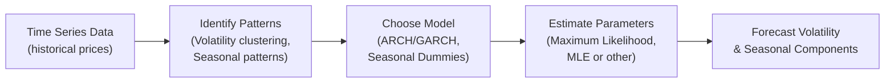

## 1.4 Advanced Topics in Time-Series—Volatility and Seasonality

Time-series analysis has always intrigued me—and not just because I once spent way too many evenings trying to predict the volatility of my own daily coffee intake. Volatility and seasonality are two critical factors in real-world financial modeling, frequently popping up in equity returns, exchange rates, commodity prices, and more. This section builds on the foundational time-series techniques covered earlier (see the “Time-Series Analysis and Forecasting Techniques” discussion) and dives into more specialized topics such as modeling volatility clustering via ARCH/GARCH, handling regular patterns via seasonal adjustments, and applying these methods in live market settings.

The material here is especially relevant for candidates preparing for the CFA Level II exam, as well as for finance professionals seeking deeper insights into how volatility evolves over time and how predictable (or, sometimes, not so predictable) seasonal effects can influence asset prices.

---

### Why Volatility Matters

Volatility is the extent to which a variable (like a stock price or interest rate) fluctuates over time. In financial markets, you’ll often see “volatility clustering,” meaning that large price swings tend to occur in bunches, followed by periods of relative calm. In other words, volatility is not constant; it changes with time, responding to economic news, monetary policy shifts, global events, or even psychological factors.

Why care about it? Volatility modeling is crucial for:

• Valuation of derivatives (options pricing).  
• Risk management and determination of Value at Risk (VaR).  
• Portfolio construction and asset allocation decisions.  
• Forecasting probable price ranges for strategic planning.  

If you’re an equity analyst evaluating the risk of a Canadian energy firm, or a risk manager at a hedge fund dealing in U.S. Treasuries, comprehending how volatility evolves can significantly refine your assessments.

---

### ARCH (Autoregressive Conditional Heteroskedasticity)

#### Basic Idea

Let me first recall a small personal “aha!” moment: I spent months trying to fit a simple linear regression model for volatility, only to realize that the residuals were dancing around in a decidedly non-random pattern. That’s exactly where ARCH (Autoregressive Conditional Heteroskedasticity) models come in. 

ARCH, introduced by Robert F. Engle (who later won a Nobel Prize for it), recognizes that today’s variance (i.e., the volatility squared) depends on past squared forecast errors. Instead of treating volatility as a constant, ARCH treats it as a dynamic phenomenon—autocorrelated in nature. 

In a simplified form, the ARCH(1) model for a time series {rᵗ} might look like:

• rᵗ = μ + εᵗ  
• εᵗ | Ω₍t₋₁₎ ∼ N(0, σᵗ²)  

where  
σᵗ² = ω + αεᵗ₋₁²,  

Ω₍t₋₁₎ is all the information up to time t-1,  
ω > 0, and α ≥ 0.  

Interpretation:  
• Large shocks in one period lead to higher estimated variance in the subsequent period.  
• α captures how strongly last period’s squared error influences today’s volatility.  

#### When to Use ARCH

ARCH is handy when you suspect that large residuals (errors) in a model beget further large residuals in the future. For example, if your stock had a big price jump yesterday, you might anticipate bigger swings for at least a little while.  

#### Limitations of ARCH

One main shortcoming is that higher-order ARCH models (e.g., ARCH(2), ARCH(3), …) can become cumbersome, requiring many parameters to be estimated. And if you mis-specify that order or lose track of your parameters, your model might blow up or yield weird predictions. That’s often why we turn to GARCH.  

---

### GARCH (Generalized Autoregressive Conditional Heteroskedasticity)

#### From ARCH to GARCH

GARCH extends the ARCH concept by including not only past squared errors but also lagged variance terms. This is like saying, “Today’s volatility depends on yesterday’s shock but also on yesterday’s volatility.” Introduced by Tim Bollerslev, GARCH puts volatility on autopilot, capturing persistent dynamics more elegantly.

The GARCH(1,1) model is typically written as:

$$
\sigma_t^2 = \omega + \alpha \epsilon_{t-1}^2 + \beta \sigma_{t-1}^2
$$

where:  
• ω > 0 ensures the long-run stationary variance is positive.  
• α ≥ 0 determines how sharply a shock from yesterday affects today’s variance.  
• β ≥ 0 represents the persistence of volatility from day to day.  

Interpretation:  
• A high α suggests volatility reacts strongly to immediate shocks (yesterday’s news).  
• A high β points to more persistent volatility (volatility takes time to decay after a shock).  

In practice, GARCH(1,1) is often sufficient for many asset-return series. But of course, advanced versions exist (e.g., GARCH-M, EGARCH, TGARCH) to capture asymmetry (“bad news has a different effect than good news”) and other nuances.

#### Practical Implementation Tips

• Model Checking: Always start with a simpler model—perhaps check if an ARCH(1) fits well. If not, add that “generalized” aspect.  
• Stationarity: Make sure the parameters satisfy stationarity constraints—e.g., α + β < 1 is often cited, ensuring that volatility doesn’t explode in the long run.  
• Software Tools: Most statistical software packages (R, Python, EViews, etc.) have built-in procedures for GARCH estimation. Be sure to check standard errors and robustify if necessary.  

#### Example: Forecasting Equity Volatility in the U.S.

Imagine you’re analyzing daily returns of a U.S. large-cap index like the S&P 500. You suspect volatility clustering, so you set up a GARCH(1,1). Suppose your estimated parameters come out as:

• ω = 0.000002  
• α = 0.05  
• β = 0.92  

That implies:  
• Following a shock, a fraction 0.05 of that shock feeds directly into tomorrow’s variance.  
• Volatility is also highly persistent, given that β = 0.92.  
• In calmer times, the baseline variance is around 0.000002 (annualized or daily, depending on your data frequency).

---

### Seasonality: Deterministic and Stochastic

#### Overview of Seasonality

Seasonality means a pattern that repeats at fixed intervals—like how we often see increased retail sales in December or a big demand for maple syrup in certain months in Canada. It could be:

• Deterministic Seasonality: The magnitude and timing are fairly predictable—think of a retailer’s quarterly earnings with a recurring holiday season boost.  
• Stochastic Seasonality: The pattern repeats, but with variable intensity or timing each year.  

Seasonality isn’t just a number on a chart; it’s frequently tied to real-world economic factors. Take air travel—peak times might be July or December, but exact usage can vary year to year with shifts in consumer behavior or new airline strategies.  

#### Handling Seasonality in Time-Series

1) Seasonal Dummies:  
   You can incorporate dummy variables for each season or each month. For instance, if monthly data show a big jump in December, just plug in a binary variable that’s 1 for December, 0 otherwise.

2) Seasonal Differencing:  
   Another approach is to difference the data at lag s (e.g., 12 for monthly data if you suspect a yearly cycle). If rᵗ is logged monthly sales, the differenced series is rᵗ - rᵗ₋₁₂. This often helps if the pattern is stable in frequency.

3) Seasonal ARIMA or SARIMA Models:  
   Tools like SARIMA (Seasonal ARIMA) weigh both the overall ARIMA structure and seasonal components at chosen lags. This is especially useful for more complex time series where repeated patterns combine with trend or cyclical behavior.

---

### Financial Applications

Now let’s put it all together. Remember, we’re not building these models in a vacuum. The point is to use them in real finance scenarios:

#### Equity Market Volatility

• **Short-Term Volatility Forecasting**: Traders might calibrate a GARCH(1,1) model every evening to update the volatility forecast for the next trading day. This can drive option pricing models, portfolio risk control, or strategic hedging decisions.

• **Risk Management**: A capital markets desk or insurance company might incorporate GARCH estimates into VaR (Value at Risk) calculations. If a shock occurs today, tomorrow’s VaR might spike.

• **Canadian vs. U.S. Equity Indices**: Market structure differences can mean slightly different parameter estimates—for instance, the Toronto Stock Exchange can be more resource-heavy, leading to stronger commodity-driven shocks compared to the more diversified S&P 500.  

#### Seasonality in Commodities

• **Agriculture**: Grains like Canadian wheat or U.S. soybeans often follow planting and harvest cycles. Prices spike when supply is uncertain. You might incorporate a seasonal dummy for the harvest months and a GARCH model for volatility, especially around weather- or policy-driven events.

• **Temperature-Driven Energy Markets**: Natural gas consumption spikes in winter. Seasonality can be deterministic (we know December is cold), but also stochastic if a particularly cold January throws everyone’s predictions off.

• **Data Observations**: If your commodity data are daily or weekly, you might see smaller daily price swings overshadowed by large seasonal cycles. One approach is to perform seasonal differencing on weekly or monthly data if the cycles repeat consistently each year.

---

### Diagram: Modeling Volatility and Seasonality

Below is a simple flowchart to illustrate how we might integrate volatility and seasonal approaches in a time-series modeling workflow:

---

### Limitations and Considerations

1) **Model Risk**: During major market shocks—think of the 2008 financial crisis or the early days of a pandemic—past-based models may underestimate future volatility. GARCH and ARCH rely heavily on historical patterns.

2) **Parameter Instability**: Market regimes shift. The same model that worked in a low-volatility environment might misfire in a high-volatility regime.

3) **Overfitting**: Using too many lags or loading up on seasonal dummies can lead to a model that fits historical data too perfectly but falls flat out-of-sample.

4) **Seasonality Shifts**: Consumer preferences, policy changes, or climate change can alter typical seasonal patterns. You might see your “December effect” vanish or morph into a January effect.

5) **Data Frequency**: Daily vs. weekly vs. monthly data can yield different model results. Seasonality in daily data might revolve around specific trading days, whereas monthly data might revolve around broader business cycles.

---

### Ethical and Regulatory Overlaps

Although time-series modeling might seem purely technical, professionals should remember that certain practices or uses of proprietary volatility models could come under regulatory scrutiny, especially if they influence risk disclosure or financial reporting (under IFRS or U.S. GAAP). For instance, misreporting a bank’s risk metrics by ignoring significant volatility spikes can violate ethical standards and potentially lead to regulatory penalties. Following the CFA Institute Code of Ethics and focusing on transparency in modeling assumptions is crucial.

---

### Best Practices and Pitfalls

• **Best Practices**:  
  - Conduct residual diagnostics: Check if your model truly eliminated autocorrelation and captured volatility clustering.  
  - Use rolling or expanding windows: Keep updating parameters as fresh data come in.  
  - Stress test: See how your model handles outliers or extreme events.  

• **Common Pitfalls**:  
  - Not checking stationarity: If your returns (or the variable of interest) have an underlying trend, you’ll end up with a poorly specified time-series model.  
  - Ignoring regime shifts: Failing to consider that markets behave differently in crises vs. calm periods can produce large errors.  
  - Overcomplicating the model: Sometimes a simple GARCH(1,1) or SARIMA with seasonal terms is enough.  

---

### Additional Real-World Example

Let’s say you’re analyzing daily spot prices of crude oil, focusing on North American markets. You notice patterns in the winter—heating oil demand surges, and your volatility might be high from roughly December through February. In that same time, the GARCH variance equation may reflect that large moves on day t-1 feed into day t. So you combine:

• A dummy variable capturing the “winter months.”  
• A GARCH(1,1) to handle clustering.  

If you see that your measure of conditional variance reliably spikes in winter compared to summer, that can be a big clue for energy traders or risk managers to manage positions accordingly.

---

### Concluding Remarks and Exam Tips

Volatility and seasonality lie at the heart of time-series analysis. They show up when you least expect them—like a surprise cameo in your favorite show. As a CFA candidate, it’s important to not only memorize the formula for GARCH(1,1) but also to understand how and why to apply these models. Remember:

• Always question whether your time-series might contain seasonal components—perform the usual tests or look at your data visually.  
• Check for volatility clustering. If present, ARCH or GARCH models can significantly sharpen your forecasts.  
• Combine knowledge from your fundamental analysis with model-based insights for a more robust perspective.  

When heading into exam day, you’ll likely see questions about how to interpret coefficients in a GARCH model, how to detect seasonality, or how the presence of volatility clustering might invalidate the usual OLS standard errors. Stay calm, recall the steps, and you’ll do great.

---

### Glossary

• **Volatility Clustering**: Large moves in asset prices tend to be followed by more large moves, and vice versa for small moves.  
• **ARCH (Autoregressive Conditional Heteroskedasticity)**: A model letting the conditional variance (volatility) depend on past squared errors.  
• **GARCH (Generalized ARCH)**: A more flexible volatility model adding lagged values of variance as well as past squared errors.  
• **Deterministic Seasonality**: Predictable, recurring seasonal patterns.  
• **Stochastic Seasonality**: Seasonal patterns whose magnitude or timing vary in random ways.  

---

### References

- CFA Institute Level II Curriculum, Quantitative Methods.  
- Engle, R. F. (1982). “Autoregressive Conditional Heteroskedasticity with Estimates of the Variance of UK Inflation.” Econometrica, 50(4).  
- Bollerslev, T. (1986). “Generalized Autoregressive Conditional Heteroskedasticity.” Journal of Econometrics, 31(3).  
- Commodity Futures Trading Commission (US): https://www.cftc.gov  
- Canadian Grain Commission: https://grainscanada.gc.ca  

---

## Test Your Knowledge: Time-Series Volatility and Seasonality Quiz



### In an ARCH(1) model, the conditional variance is primarily a function of:
- [ ] Current returns
- [x] Past squared errors (residuals)
- [ ] Lagged variance terms only
- [ ] Seasonality dummy variables

> **Explanation:** ARCH(1) means the current variance depends on a constant plus the previous period’s squared error term.

### Under a GARCH(1,1) model, if α + β is close to 1, it suggests:
- [ ] Low volatility persistence
- [ ] No volatility clustering
- [x] High volatility persistence
- [ ] Constant volatility

> **Explanation:** A sum of α + β near 1 means shocks carry over for multiple periods, indicating highly persistent volatility.

### Which of the following is a method to account for deterministic seasonality in a time-series model?
- [ ] Taking the first difference of the original data
- [x] Including dummy variables for seasonal periods
- [ ] Using GARCH(1,1)
- [ ] Estimating a random-walk model

> **Explanation:** Deterministic seasonality can be handled with seasonal dummy variables that switch on during seasonal periods.

### When analyzing agricultural commodities like Canadian wheat, which combination is most appropriate for capturing harvest-related volatility and repeated yearly patterns?
- [ ] Simple linear regression
- [x] GARCH(1,1) with seasonal dummies
- [ ] Random walk without drift
- [ ] Single moving average

> **Explanation:** Harvest cycles can create seasonal patterns, and volatility clustering can be captured via GARCH(1,1).

### Which best describes stochastic seasonality?
- [ ] Patterns remain the same each year
- [x] Patterns recur but with varying magnitude or timing
- [ ] Patterns shift every month randomly with no repetition
- [ ] Patterns never repeat

> **Explanation:** Stochastic seasonality involves repeating patterns whose magnitude or exact timing is random from year to year.

### A key assumption needed for GARCH parameter stationarity (and thus stability of the model) is:
- [ ] α + β > 1
- [ ] α - β < 0
- [x] α + β < 1
- [ ] ω < 0

> **Explanation:** For a GARCH(1,1), stationarity requires α + β < 1. This ensures volatility will not explode.

### Which type of seasonality is best handled by seasonal differencing at lag s (e.g., 12 for monthly data)?
- [x] Deterministic or stable seasonal patterns
- [ ] Stochastic seasonality with random shifts
- [ ] Volatility clustering
- [ ] ARCH-induced seasonality

> **Explanation:** Seasonal differencing at a fixed lag s is particularly straightforward and effective for stable seasonal patterns.

### If a neighborhood grocery store’s monthly sales data displays a strong December boost year after year, the phenomenon is an example of:
- [ ] Stochastic seasonality
- [x] Deterministic seasonality
- [ ] White noise
- [ ] GARCH effect

> **Explanation:** A predictable, recurring pattern each December is deterministic seasonality.

### Using a GARCH model in periods of extreme market stress can lead to:
- [x] Underestimation of future volatility if the model relies solely on historical patterns
- [ ] Perfect capturing of volatility spikes
- [ ] No change in the forecast because GARCH ignores past errors
- [ ] Elimination of volatility clustering

> **Explanation:** GARCH, like any history-based model, may under-predict volatility during sudden regime changes or extreme market events.

### True or False: In GARCH modeling, “persistence” refers to how quickly volatility returns to its long-run average following a shock.
- [x] True
- [ ] False

> **Explanation:** GARCH’s β parameter indicates how volatility decays or persists over time. A large β means high persistence.


