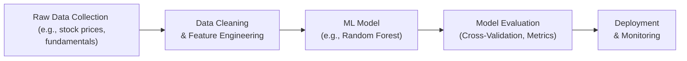

## 1.5 Machine Learning and Big Data in Finance

Picture this: you're sitting at your desk late one Friday afternoon, scanning through mountains of stock market data, macroeconomic indicators, and corporate announcements from across North America (and maybe even beyond). You think, “Um, there must be a way to handle all this data more efficiently.” Enter Machine Learning and Big Data.

This section explores how modern machine learning (ML) techniques can be applied to finance. We’ll talk about how they work, common pitfalls, and why they matter in both U.S. and Canadian markets (and beyond). We’ll also spotlight the synergy between advanced quantitative methods (see the rest of Chapter 1 for context), data engineering, and compliance needs to ensure that your next shiny algorithm doesn’t run afoul of regulations.

Before we jump in, I want to share a quick personal anecdote. I once worked on a project analyzing social media sentiment for a set of small-cap Canadian equities. The data was messy, the tweets were full of typos (“stonks,” anyone?), and the sentiment model kept overfitting. It was both frustrating and eye-opening. Ultimately, the solution combined basic text cleaning with a modest neural network—reminded me that complex problems often need simpler solutions first. That’s the type of real-world context we’re going to explore here.

---

### Introduction to Machine Learning in Finance

Machine learning is basically a collection of algorithms and statistical models that let computers “learn” from data. Instead of coding every rule by hand, you let the model find patterns. There are broadly two categories:

• Supervised Learning: You have labeled historical data (like whether a stock outperformed or underperformed last quarter) and want to predict outcomes.  
• Unsupervised Learning: You've just got piles of unlabeled data and want to discover structures or groupings (like which stocks behave similarly).

In finance, ML sits on top of the foundation laid by multiple regression and time-series analysis (see Sections 1.1 and 1.3 of this chapter). The key difference is that machine learning often handles much larger datasets and can capture more flexible relationships. Think macroeconomic indicators, fundamentals, text data from earnings calls, or even geographical data from store visits. The permutations are endless—and that’s why Big Data is so essential.

Let’s get rolling with supervised learning techniques and see how they’re applied in the real world.

---

### Supervised Learning

Supervised learning requires a labeled dataset. For example, you might have data indicating which loans defaulted (label = default) and which did not (label = no default). The model then figures out how input variables (e.g., credit scores, interest rates, region) relate to the outcome (default or not).

#### Penalized Regression (Lasso, Ridge)

Penalized regression is often the first step when novices to machine learning try to tame large datasets. Let’s say you have a huge set of predictors—macroeconomic factors, corporate fundamentals, maybe even textual sentiment. Traditional regression might overfit, picking up spurious correlations to every minor blip in the data.

Enter Lasso (L1 penalty) and Ridge (L2 penalty) regression. These add a penalty term to the loss function to keep coefficients smaller (Ridge) or even force some of them all the way to zero (Lasso). Maybe you’ve used Lasso to reduce a 100-variable initial set down to 10 or 15. It’s a lifesaver in terms of model efficiency and interpretability.

Think about analyzing industrial sector stocks—like, you might start with 200 potential indicators (oil prices, shipping rates, interest rates, etc.). Lasso helps by focusing on a subset of truly influential factors, drastically reducing the risk of overfitting.

#### Support Vector Machines (SVM)

Support Vector Machines try to find a hyperplane separating your data into classes (for classification tasks) or fit a boundary for regression tasks. Picture a bunch of points in a multi-dimensional space (stocks with various features). SVM draws the line (or plane, or hyperplane) that best separates classes with the largest margin.

People often use SVMs for classification problems, such as labeling stocks as “value” versus “growth.” The “support vectors” are the data points that matter most in defining the boundary. SVM can handle non-linear boundaries by using something called the kernel trick, but it can be computationally intensive. If you have extremely large datasets, you’ll want to check whether you have the computing resources (and time) needed for SVM training and tuning.

#### Ensemble Methods (Random Forest, Gradient Boosting)

Ever have one of those days when you ask multiple colleagues for feedback on your stock picks? Sometimes, combining multiple opinions yields a better final decision. That’s the logic behind ensemble methods. Here, we combine multiple weak learners (like decision trees) to create a powerful model.

• Random Forest: Builds many decision trees on random subsets of data and features, then averages their predictions.  
• Gradient Boosting: Sequentially adds weak models, each trying to correct errors made by the previous ones.

These ensembles are widely used in credit risk modeling at large Canadian or U.S. banks, especially where interpretability is important (and random forests can be somewhat interpretable if you dig into variable importance metrics). They often outperform a single decision tree or linear model because they reduce variance and capture complex interactions.

---

### Unsupervised Learning

Unsupervised learning is for when you don’t have labeled data. It’s great for discovering hidden patterns, grouping similar items, or reducing dimensionality.

#### Cluster Analysis (k-Means, Hierarchical)

Clustering is like trying to group your stock universe or customers into meaningful categories without any preconceived “label.” For instance, k-Means tries to place data points into k groups around a centroid. If you suspect that your data forms natural groups—like certain retail stocks respond similarly to economic cycles—clustering can help you figure that out.

Hierarchical clustering builds a tree (dendrogram) to show how clusters merge or split at different levels. This can be particularly helpful for marketing departments or for segmenting customers of a bank. In portfolio management, you could cluster stocks by correlation patterns, industry, or fundamental factors—whatever helps you gain new insights into how certain securities behave.

#### Principal Component Analysis (PCA)

PCA is all about dimensionality reduction. Imagine you have 50 or 60 correlated factors driving portfolio returns. PCA can find a handful of “principal components”—core directions in your data—so you can focus on fewer factors (e.g., factor 1 might correlate strongly with interest rates and inflation, factor 2 might correspond to global growth, etc.).

In practice, PCA is a powerful tool for risk management. You can spot if your portfolio is primarily exposed to a handful of macro factors or if there’s hidden complexity that you haven’t accounted for. Over in fixed income, PCA often shows that just two or three principal components (level, slope, curvature) explain the majority of yield curve movements (see Section 6.1 for more on term structure analysis).

---

### Deep Learning and Neural Networks

Ever wonder how to read thousands of pages of text from earnings calls or 10-K filings at lightning speed and still form a nuance-based investment thesis? That’s where deep learning can help. Deep neural networks have multiple layers of “neurons” that can handle vast amounts of unstructured data (like images or text).

• Multi-Layer Perceptrons: Basic feed-forward neural networks that can capture complex non-linear patterns. For instance, analyzing social media sentiment for U.S. or Canadian equities, or combining fundamental signals (P/E ratios, interest coverage, etc.) to forecast credit risk.  
• Reinforcement Learning: The model learns by trial and error, observing how actions produce rewards over time. Traders might implement reinforcement learning in algorithmic strategies, adjusting buy/sell decisions in real-time based on reward signals (like realized returns or risk metrics).

Deep learning is extremely powerful, but it can be prone to overfitting, requires substantial data, and might be somewhat opaque to financiers who need interpretability. Also, training large networks can be resource-intensive. Always keep model complexity in mind, especially if you’re working with sensitive or real-time data.

---

### Data Wrangling and Feature Engineering

Data wrangling is that unsung hero of data projects. Seriously, 80% of your time might be spent cleaning, merging, filling missing values, and aligning date ranges from multiple sources. Especially in finance, data can come in daily, monthly, or irregular intervals (like M&A announcements). Some data might be missing. Or it might not map perfectly to other sets. Pay close attention to:

• Missing Data: Use approaches like imputation (mean, median), or advanced methods like K-nearest neighbors. But always question whether data is missing randomly or systematically.  
• Outliers: Financial data is often fat-tailed. Consider winsorization or specialized transformations.  
• Textual Analysis: Tools like natural language processing (NLP) help parse earnings call transcripts or MD&A sections in Canadian corporate reports. Feature engineering might include counting positive/negative words or advanced sentiment dictionaries.  

Pro tip: Document your steps thoroughly. Regulators and auditors love a good data lineage.

---

### Avoiding Overfitting

Overfitting is every quant’s worst nightmare. It’s when your model memorizes quirks in the training set and doesn’t generalize to new data. You might see spectacular in-sample results, only for the real trading or investment strategy to flop. So how do we curb overfitting?

• Cross-Validation: Split your data into multiple folds and train on different subsets. Evaluate performance in the fold held out as a test set.  
• Hold-Out Sample: Set aside a chunk of data you never use in training. It acts as a final, unbiased check.  
• Regularization: As we saw in penalized regression, penalizing large coefficients helps avoid overfitting. Early stopping is a related idea in neural networks—stop training before the model overfits.  

One friend of mine (a portfolio manager) repeatedly found that running a daily rebalanced neural network model on 10 years of data looked tremendous historically. But every attempt to walk-forward test it failed. The culprit was overfitting: the model had learned random patterns in the training set and not general patterns.

---

### Ethical and Regulatory Considerations

Finance is highly regulated, and data usage is no exception. In the U.S., the SEC has guidelines on data privacy and insider trading. In Canada, the Personal Information Protection and Electronic Documents Act (PIPEDA) has its own unique processes and disclosure requirements. And if you’re dealing with European clients or data, GDPR privacy regulations might apply.

It’s, like, super important to keep these guidelines in mind because ignoring them can lead to heavy penalties, reputational damage, or both:

• Model Transparency: Regulators may demand you explain your model’s decisions, especially if it affects lending or insurance rates.  
• Data Privacy: Make sure you have a lawful basis for processing data. Use anonymization when possible.  
• Bias and Fairness: ML can inadvertently reinforce biases. For instance, if a dataset historically denied loans in certain ZIP codes, the algorithm might perpetuate that bias.  

Always consult your firm’s compliance team if you’re deploying an ML model that influences major decisions such as credit risk, portfolio optimization, or M&A forecasts.

---

### Mermaid Diagram: Typical ML Workflow

Below is a simple visual to illustrate a typical machine learning workflow in finance—especially relevant if you’re building models for equity selection, default prediction, or portfolio optimization. Remember, it’s never a linear or purely sequential path, but it gives a roadmap.

---

### Glossary of Key Terms

• **Penalized Regression:** A way to shrink coefficients (like Lasso or Ridge) to prevent overfitting when you have lots of potential predictors.  
• **Support Vector Machine (SVM):** A classification or regression model that tries to maximize the margin separating different classes.  
• **Random Forest:** An ensemble of decision trees aggregated for improved predictions.  
• **Reinforcement Learning:** Models learn how to act based on rewards and penalties over time (often used in trading).  
• **Feature Engineering:** Creating and selecting input variables to improve model performance.  
• **Neural Network:** A model with interconnected layers (neurons) that learn complex, often non-linear, relationships.  

---

### Practical Applications and Real-World Scenarios

• **Credit Risk Modeling:** Large Canadian banks might use Random Forest to evaluate mortgage defaults.  
• **High-Frequency Trading:** Reinforcement learning algorithms that micro-optimize trades.  
• **Consumer Finance & Marketing:** Clustering customers or segmenting cross-selling opportunities.  
• **Portfolio Optimization:** Combining PCA with ensemble methods to build factor-based strategies.  
• **Alternative Data Analysis:** Social media sentiment or satellite imagery data, especially popular in U.S. hedge fund circles.

No matter your application, the main theme is the same: big, messy data, complicated relationships, and a suite of machine learning tools. Use them wisely, and you might produce the outperformance or risk control you’re seeking—just watch out for overfitting or ethical pitfalls.

---

### Final Exam Tips

• **Link Concepts to Other Sections:** For example, consider how a time-series forecast (Section 1.3) might feed into a penalized regression, or how volatility predictions (Section 1.4) might help shape your feature set.  
• **Be Ready for Vignette-Style Integration:** The CFA exam will often mix advanced regression, classification, or PCA in real-world contexts. You might see a question about a US-based bank using a machine learning approach to segment credit risk.  
• **Ethical/Regulatory Overlaps:** The question might test your understanding of data privacy, model transparency, or fairness.  
• **Focus on Interpretability:** Ensure you can articulate why certain features matter, and how you validated your model.  
• **Practice with Real Datasets:** If you can, download some publicly available financial or macroeconomic data and run a small machine learning model. This hands-on approach cements concepts.  

---

### References and Further Reading

- CFA Institute Level II Curriculum (Quantitative Methods).  
- Hastie, T., Tibshirani, R., & Friedman, J. (2009). “The Elements of Statistical Learning.”  
- Goodfellow, I., Bengio, Y., & Courville, A. (2016). “Deep Learning.”  
- “Machine Learning in Finance,” Bloomberg Intelligence report.  
- Privacy Legislation in Canada (PIPEDA): [https://www.priv.gc.ca/en](https://www.priv.gc.ca/en)  
- SEC Guidelines on Data Usage: [https://www.sec.gov](https://www.sec.gov)  

---

## Test Your Knowledge: Machine Learning and Big Data in Finance



### Which of the following best illustrates how Lasso regression helps prevent overfitting?

- [ ] By completely eliminating regularization terms from the model
- [ ] By penalizing large coefficients without eliminating them
- [x] By shrinking some coefficients all the way to zero
- [ ] By using only a single predictor in the model

> **Explanation:** Lasso regression (L1 penalty) can shrink coefficients to zero, effectively performing variable selection. This helps reduce overfitting by removing less relevant predictors.

### If you have a dataset with no pre-defined labels and want to identify groups of similar observations, which technique is most appropriate?

- [ ] Logistic regression
- [ ] Ridge regression
- [x] Clustering (e.g., k-Means)
- [ ] Gradient boosting

> **Explanation:** Clustering (an unsupervised method) finds groupings or clusters in unlabeled data. Logistic regression and ridge regression are supervised methods, while gradient boosting is also typically used in a supervised context.

### Which statement correctly describes a Support Vector Machine for classification?

- [ ] It focuses on eliminating overfitting by removing data points with large residuals
- [x] It identifies a boundary with the maximum margin separating classes
- [ ] It only works for linear data and cannot handle non-linear classification
- [ ] It cannot be used for financial applications due to interpretability constraints

> **Explanation:** SVM aims to maximize the margin between classes. Kernel functions enable non-linear boundaries. SVMs are used in finance, though interpretability can be a challenge.

### In a Random Forest, how does model averaging help improve predictions?

- [ ] By overfitting on each training subset
- [x] By reducing variance when combining predictions from multiple trees
- [ ] By discarding the trees with the lowest accuracy
- [ ] By converting continuous outcomes into discrete classes

> **Explanation:** Random Forest averages over many decision trees created from different samples and feature subsets, thereby reducing variance and improving predictive stability.

### Which of the following identifies a key benefit of PCA in portfolio management?

- [x] It reduces the dimensionality of correlated variables, highlighting principal factors
- [ ] It automatically detects overfitting in a supervised model
- [x] It can highlight hidden risk exposures in the portfolio
- [ ] It only works for discrete categorical features

> **Explanation:** PCA finds principal components that explain most of the variance. This helps simplify analysis and may uncover latent risk exposures.

### Why might a deep neural network be challenging to implement in real-time trading for many firms?

- [x] They often require significant computational resources and large datasets
- [ ] They cannot be trained to process high-frequency data
- [ ] They are always less accurate than simpler models
- [ ] Regulators have banned them in U.S. markets

> **Explanation:** Deep learning models can be computationally expensive and data-hungry. Some small or medium-sized firms might lack the infrastructure or data to run them at scale.

### Which of the following is a best practice to avoid overfitting?

- [x] Using cross-validation and a separate hold-out sample
- [ ] Using the entire dataset for training
- [x] Applying penalization methods like Ridge or Lasso
- [ ] Making predictions only after repeatedly retraining on the same sample

> **Explanation:** Splitting your dataset for cross-validation plus a final hold-out set and incorporating penalty terms are proven strategies to reduce overfitting.

### A finance professional wants to group stocks by similar return patterns without using any prior labels. Which method should they employ?

- [x] Hierarchical clustering
- [ ] Linear discriminant analysis
- [ ] Penalized logistic regression
- [ ] Random Forest classification

> **Explanation:** Hierarchical clustering (an unsupervised technique) is a natural way to find groups of stocks with similar characteristics. Logistic regression, LDA, and random forest are typically supervised.

### Which is an example of feature engineering in a text analysis context?

- [x] Counting positive and negative words in earnings call transcripts
- [ ] Minimizing a loss function with gradient descent
- [ ] Splitting the dataset into training and test sets
- [ ] Summing stock returns over a quarter

> **Explanation:** Feature engineering might involve creating features such as sentiment scores derived from text. Minimizing a loss function is part of model training, not feature engineering.

### True or False: Regulators may require interpretability in ML models that affect important financial decisions like credit approvals or loan determinations.

- [x] True
- [ ] False

> **Explanation:** Regulators often emphasize “explainability,” ensuring consumers are treated fairly and that lending or underwriting decisions are transparent.  


