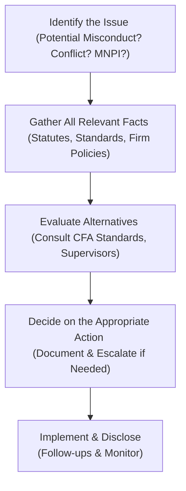
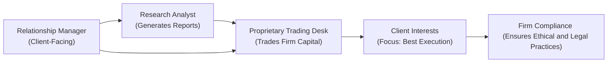

## 10.2: Application of Ethical Principles in Complex Scenarios

It’s one thing to memorize the CFA Institute Code of Ethics and Standards of Professional Conduct. It’s another thing entirely to apply them when your inbox is overflowing with partial data, multiple jurisdictions are involved, local customs clash with your firm’s policies, and someone on the trading desk “helpfully” drops a tip that might be something you’re not allowed to act on. Let’s be honest: real-life ethical quandaries can feel a little messy. In this section, we’re going to talk about how to navigate those messy situations with integrity, prioritize our clients’ interests, and stay true to the spirit and letter of global ethical standards.

I once worked at a multinational bank where, believe it or not, my desk phone rang nonstop with inquiries from different offices—Europe, the U.S., and even some emerging markets. One day, a portfolio manager from the London desk asked me for “technical clarifications” about some upcoming corporate action in a local firm. It sounded innocuous. Then, a colleague from the M&A team casually mentioned a rumored deal involving that same firm. Suddenly, I found myself in an ethical conundrum: Was that rumored deal material nonpublic information? Or was it just some market scuttlebutt everyone knew? Did that manager have the right to trade on this partial rumor, or should I caution her to hold off?

Moments like these—yeah, they can be nerve-racking, and they demand a keen sense of professional ethics. Within the CFA Program, and specifically at Level II, you’ll be tested on your ability to interpret the Code and Standards intelligently under the pressure of real-world complexity. Let’s unpack how to do that.

### The Core of Complex Ethical Scenarios

Whenever we face an ethically ambiguous situation, our first move is to identify the relevant standard(s). Is it about maintaining confidentiality? Is it a conflict of interest? Or maybe it’s a matter of best execution for a client. However, the real issue is usually that we don’t have all the information we want, or local norms might say one thing while the CFA Institute Standards say something else. That’s precisely where the complexity arises—and where your judgment really matters.

It’s crucial to remain anchored in the spirit of the Code and Standards. If you ever find yourself leaning too heavily on local norms that seem to sidestep client interests, that’s a red flag. The best approach is to walk through a structured process of identifying the conflict, gathering the facts, consulting the applicable standards, and then deciding on the most ethical response.

Below is a simple flowchart you can keep in your back pocket (figuratively speaking!) to maintain clarity when the situation heats up.

### Insider Trading Concerns

One of the biggest risk areas is insider trading. CFA Institute’s Standard II(A): Material Nonpublic Information is where you need a laser focus. The Standard protects market integrity by prohibiting members, candidates, and their associates from trading—or causing others to trade—on material nonpublic information (MNPI). 

But how do you figure out if a piece of intel is “material” and “nonpublic”? Let’s break it down:

• “Material” facts are those that an average investor would want to know before making a decision to buy or sell a security. Perhaps a confidential planned merger, an undisclosed CEO resignation, or pending product approvals.  
• “Nonpublic” means the information hasn’t been widely disseminated. Even if there’s a rumor swirling in certain circles, if it hasn’t been published or made generally available, it remains nonpublic.

I remember a personal moment of panic when a client’s CFO asked me for some data. Our internal analyst had made a small remark about big contract negotiations that weren’t public yet. Was this detail something the CFO already knew from the inside, or was I inadvertently sharing something that wasn’t out in the open yet? In these situations, err on the side of caution. Don’t spread it, don’t trade on it. You can also check with your compliance department if you’re unsure.

#### Avoiding Illegal Trading and Tipping

• If you become aware of possible MNPI, notify your supervisor and compliance—this might lead to a restricted list or a “firewall” to prevent unauthorized information flow.  
• Tipping information, even without personally trading, is also a violation. If you share MNPI with your friend who then trades, you can be found complicit.  
• To pass the exam, you need to know that ignorance of a tippee’s trading does not necessarily remove your liability. The best approach is to never share MNPI unless absolutely necessary for legitimate firm reasons and authorized by compliance.

### Conflicts of Interest: The Gray Zones

Conflicts of interest pop up in all sorts of ways. Whether you’re working at a small RIA or a global asset management titan, these conflicts might involve personal trades, front-running, shady referral fees, or, more subtly, research analysts tying their compensation to investment banking deals. 

Remember: Redwood from Chapter 10.1 gave us the basic framework for dealing with conflicts—transparency and disclosure. Clients must know when your interests might not be perfectly aligned with theirs. So that means:

• Disclosing referral fees. If you receive payment from a third party for directing a client there, you have to clearly inform the client about the arrangement.  
• Not front-running. If your firm or client is about to place a large order, do not place your personal account trades in anticipation of that upcoming move.  
• Avoiding “allocation doping.” Also be sure to allocate trades fairly among client accounts.  

#### Personal Anecdote

I once had a colleague, let’s call him Dave, who used to say, “Well, it’s not front-running if I only buy 100 shares for myself.” Sorry, Dave, that’s exactly what front-running is if you preempt a large block order you know is coming. The volume or size doesn’t matter. The principle does.

### Gift Policies and Cultural Contexts

In some parts of the world, accepting gifts from clients is practically the norm. You might get an expensive bottle of wine or hockey tickets, or, if you’re in a different region, perhaps a fancy dinner with extended toasts. Some might say, “That’s just how business is done,” but the CFA Standards hold that you must avoid even the appearance of compromised objectivity.

A good rule of thumb: If the gift or normal business practice is lavish enough to sway your judgment—or could be perceived as such—it’s not appropriate. The best approach is to fully disclose any gift to your employer and get approval under your firm’s policy. If local culture encourages gift-giving, you can politely accept the intangible courtesy but remain mindful of the line between professional courtesy and overindulgence.

### Managing Multinational or Multi-Jurisdictional Settings

You won’t always be dealing with domestic, single-jurisdiction scenarios. Perhaps you’re dealing with a client out of London, studying a target listed on a Canadian exchange, and your firm’s compliance policy is anchored to local SEC regulations if you’re primarily US-based. Confused yet?

The steps below can help:

• Understand your firm’s global compliance policy.  
• Whenever there’s a conflict between local laws and the CFA Standards, follow the stricter requirement. If local law is more stringent, follow local law. If CFA Standards are stricter (and abiding by them wouldn’t break local law), follow the CFA Standards.  
• Document every step to demonstrate you made a good-faith effort to remain ethical and consistent.

### Personal Trading and Pre-Clearance

Pre-clearance often feels like a bureaucratic hassle, especially if you trade for your personal account infrequently. But it’s there to protect you. Imagine you hold a position in your private portfolio, then you see your firm’s major research desk upgrade that same stock from “Hold” to “Buy” tomorrow. If you were to immediately buy more shares the day before the announcement, it could raise a red flag (front-running). With a robust pre-clearance system, you must seek permission in writing, so there’s a paper trail ensuring you didn’t act on inside knowledge.

### Potential Breaches and Unintentional Lapses

Even the most well-intentioned professionals can slip up. Maybe they unknowingly pass along a tidbit that’s considered MNPI. Maybe they forget to disclose a referral fee arrangement. If you suspect a potential breach:

• Refer to your firm’s policies—most have guidelines on how to handle suspected misconduct.  
• Promptly notify your manager or compliance.  
• If necessary, escalate higher or whistleblow externally if the firm fails to address egregious misconduct.

It’s crucial to remember that mistakes, if addressed quickly and transparently, can often be corrected with minimal harm. The real violation occurs when you hide or ignore potential wrongdoing.

### Handling Dual-Licensing and External Directorships

In the real world, you might be a charterholder and also licensed in real estate or insurance. Or you serve on the board of a nonprofit that invests in certain industries. These cross-activities can easily lead to conflicts of interest. The best practice is to:

• Disclose to your main employer any external engagements.  
• Refrain from using nonpublic info you might glean from one capacity to benefit your other capacity.  
• Be ready to recuse yourself from decisions when there’s an apparent or even perceived conflict of interest.

### Dealing with Multiple Parties and Competing Interests

In many complex scenarios, you’re not just dealing with your client and your firm. There might be a separate research division, a proprietary trading desk, other institutional clients, external parties, or an M&A team. Everyone could have distinct or conflicting motivations. The secret to success:

• Identify whose interests might be jeopardized.  
• Dissect the relevant standards applicable to each party—confidentiality, loyalty to the client, conflict of interest, etc.  
• Consider if any Chinese walls or “information firewalls” need to be established to avoid inadvertently sharing sensitive data.  
• Document your process, so if you’re ever questioned, you can demonstrate that you took all steps to remain objective and ethical.

In the diagram above, everyone is connected—and each line might represent flows of info that need to be strictly monitored or regulated to maintain ethical boundaries.

### Steps to Resolve Ethical Dilemmas

In a test vignette or in real life, you’ll find yourself analyzing a scenario that’s not straightforward. Let’s talk through a simplified approach:

• Identify the details: Who are the stakeholders? What’s the sensitive information? Which Standard might be at risk?  
• Gather the facts: Is the info definitely MNPI, or is it market hearsay? Are there undisclosed referral fees?  
• Consult references: Re-read the relevant part of the Code and Standards (or your firm’s policy).  
• Seek guidance: Talk to compliance or a senior colleague who’s well-versed in ethical decision-making (assuming you’re not disclosing confidential data inappropriately).  
• Decide on an action plan: That might mean halting a trade, disclosing a conflict, or refusing a gift.  
• Document: Keep records of your process, so there’s transparency.  

And if there’s no perfect solution—well, that’s life. In morally gray areas, your best bet is to err on the side of being conservative and protective of client interests.

### Key Exam Tips

• Pay very close attention to the exact wording in vignettes. They might hide small facts that suddenly become crucial to deciding if something is a violation.  
• If in doubt during an exam question, remember that prioritizing client interests, obeying the law, and following the spirit of the Standards is generally the safest bet.  
• Ethical scenarios often include distractors—like “harsh local business culture” or “everyone else does it.” Don’t fall for them. The Standards trump these factors unless it violates local law.  
• Always consider both “action” and “disclosure.” Many times, the correct approach is to do the right thing (e.g., refuse a suspicious gift) and then inform relevant parties after the fact.

### References

• Case Studies in Ethics and Standards of Practice (CFA Institute Publication)  
• Insider Trading: Law, Ethics, and Reform by Stephen Bainbridge  
• Canadian Securities Administrators (CSA) Staff Notices on Compliance Best Practices: www.securities-administrators.ca  
• RIA Guidelines from the SEC: www.sec.gov  

For an even deeper understanding, you might check the earlier 10.1 section, “CFA Institute Code of Ethics and Standards of Professional Conduct,” as well as the official CFA Institute curriculum materials. They provide thorough, scenario-based examples relevant to the exam. Also, the organization’s website has updated resources and practice questions focusing on various ethical scenarios.

Now let’s reinforce your knowledge with some quiz-style practice questions. Remember to take your time, focus on the details, and always ground your answers in the Code and Standards.

## Test Your Knowledge: Complex Ethics Scenarios for CFA Level II



### A portfolio manager is told by her friend, who works in a law firm, that a client of the firm is about to announce a major acquisition. The friend says it’s “only a rumor, but watch it skyrocket!” Which of the following statements is most consistent with CFA Standards regarding the manager’s duty?

- [ ] She can trade if she confirms the rumor with another colleague in her own firm.  
- [ ] She can trade as soon as she sees a news outlet discussing the rumor.  
- [x] She should refrain from trading on this information until it becomes clearly public.  
- [ ] She may share the rumor internally but only if her friend remains anonymous.  

> **Explanation:** The rumored acquisition qualifies as potential material nonpublic information. She should not trade or induce others to trade based on a rumor that could affect the security’s price unless it’s been publicly disseminated and confirmed.  

### A junior analyst receives tickets from a vendor valued at $100 for a big sporting event. The firm’s gift policy requires disclosure for any gift over $50. According to the CFA Standards, which action is most appropriate?

- [ ] Accept the tickets without reporting because the client is a personal friend.  
- [x] Disclose receipt of the tickets to the firm’s compliance department.  
- [ ] Politely decline all gifts over $50 as a universal rule.  
- [ ] Use the tickets but pay the vendor half their cost.  

> **Explanation:** CFA Standards require compliance with firm policies. Since the gift exceeds the firm’s threshold, it must be disclosed regardless of the personal relationship.  

### An investment advisor is about to release a new research report on a small-cap company. She personally buys shares one day before sending the research to clients. Which of the following is the best description of this activity under the CFA Standards?

- [x] Front-running, which violates the duty of loyalty and fairness.  
- [ ] Acceptable if her ultimate recommendation is a “Buy.”  
- [ ] Non-problematic as long as she discloses the purchase in the report.  
- [ ] Allowed because the firm does not require personal pre-clearance.  

> **Explanation:** Buying shares before the clients receive the research is front-running and is a violation of the duty to deal fairly with all clients.  

### A Canadian-based analyst obtains local insider information that a foreign firm is about to declare bankruptcy. The local laws aren’t as strict as Canada’s. Which action is most consistent with the CFA Standards?

- [ ] Trade based on the local jurisdiction’s lenient laws.  
- [ ] Trade only if the firm explicitly allows it in writing.  
- [x] Refrain from trading as it’s still material nonpublic information, violating the Standards.  
- [ ] Sell only existing holdings but do not short-sell.  

> **Explanation:** Under the CFA Standards, trading on material nonpublic information is strictly prohibited, regardless of local legal laxity.  

### A member acts as lead portfolio manager for a hedge fund and also serves on the board of a nonprofit that invests in private equity. The two roles are likely to conflict. Which action best addresses the conflict according to the CFA Standards?

- [ ] Keep the roles separate by never discussing his hedge fund work with the nonprofit.  
- [x] Disclose the dual roles to both parties and recuse himself from relevant decisions.  
- [ ] Charge the nonprofit discounted fees in exchange for their flexibility.  
- [ ] Provide inside data to the nonprofit as a charitable act.  

> **Explanation:** Full disclosure of potential conflicts and recusal from conflicting decisions is the best practice under the Code and Standards.  

### A research analyst receives a major year-end bonus specifically tied to investment banking deals her team has facilitated. She’s now issuing a “Buy” rating on a new IPO that is one of the bank’s top deals. Which statement best captures this scenario?

- [ ] This compensation structure is acceptable if disclosed only to her immediate supervisor.  
- [ ] As long as she genuinely believes in the IPO’s prospects, there’s no conflict.  
- [x] Tying her compensation directly to investment banking success creates a conflict of interest. She must disclose it.  
- [ ] She should not issue ratings on any IPO her bank underwrites.  

> **Explanation:** When an analyst’s compensation is linked to investment banking deals, it may compromise independence and objectivity. At a minimum, the conflict should be disclosed.  

### A portfolio manager inadvertently shares confidential client data with a colleague in another department, who does not need that information. Under the CFA Standards, which action is most appropriate?

- [x] Inform compliance or a supervisor and ensure the colleague does not act on the data.  
- [ ] Ask the colleague to simply keep quiet and delete the email.  
- [ ] Forward the data only to the CEO of the company to rectify.  
- [ ] Ignore it because the information is already within the same firm.  

> **Explanation:** Even within the same firm, client data is confidential. The manager must notify the appropriate channels and ensure that the colleague does not misuse the information.  

### An analyst learns that a major client is shifting a large position from one stock to another next week. He goes home and rebalances his personal account to capitalize on the upcoming move. Which principle is he most likely violating?

- [x] Front-running client trades.  
- [ ] Accepting a gift in exchange for favoritism.  
- [ ] Failing to abide by local regulations.  
- [ ] Failing to properly disclose fees.  

> **Explanation:** Using knowledge of a forthcoming client transaction to trade personally is front-running and violates the CFA Standards.  

### An investment adviser routinely refers her retirement-planning clients to an external lawyer. She gets a referral fee for each client. She mentions the fee arrangement in a small-print footnote in her contract. Does this comply with the Code and Standards?

- [ ] Yes, because the client eventually sees the arrangement.  
- [ ] Yes, because referral fees are permitted if not exceeding 2%.  
- [ ] No, because referral fees are never allowed.  
- [x] No, because the referral fee arrangement must be clearly disclosed and explained to the client.  

> **Explanation:** The Standards require that any referral fee arrangement be promptly and prominently disclosed so that the client can evaluate the adviser's objectivity. A tiny footnote is not sufficiently clear.  

### Receiving a lavish gift from a new prospective client as part of local custom is:

- [x] True  
- [ ] False  

> **Explanation:** Actually, this statement alone is incomplete. The question is: does accepting it compromise your objectivity, or does it “appear” to do so? A lavish gift can create a conflict of interest per the CFA Standards and may require refusal or complete disclosure.  



Thanks for sticking with me through these complex ethical situations. Remember, real-world ethics might not always feel black and white. But if you root yourself in these Standards, keep a clear head, document diligently, and always advocate for your clients’ best interests, you’ll be on strong footing—in both your career and the CFA exams. Good luck!
