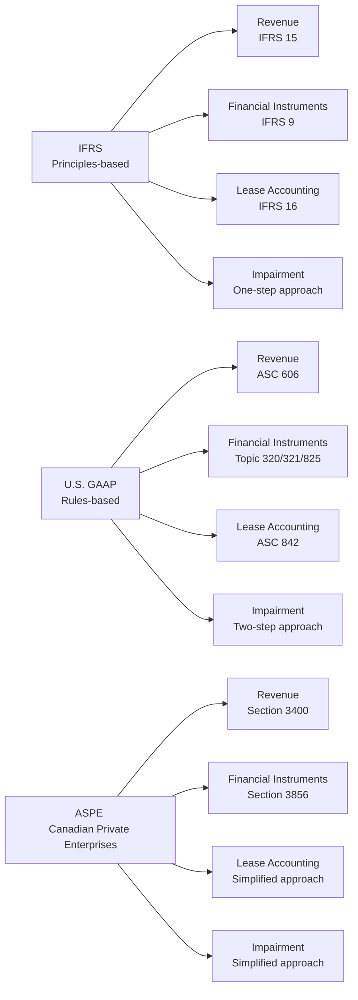

## 11.2 Differences in Accounting and Disclosure (IFRS, U.S. GAAP, and ASPE)

Accounting standards shape how companies measure, recognize, and disclose their financial activities. If you’re analyzing cross-border investments—maybe even doing an equity research assignment comparing a Canadian private enterprise to a major U.S. multinational—it’s easy to feel overwhelmed by the different accounting rules in play. It’s kinda like learning multiple dialects of the same language: close enough to understand each other most of the time, but with subtle differences that can trip you up.

Below, we’ll explore the nuances of International Financial Reporting Standards (IFRS), U.S. Generally Accepted Accounting Principles (GAAP), and the Accounting Standards for Private Enterprises (ASPE) in Canada. We’ll walk through the major areas where these frameworks converge, where they differ, and what that means for interpreting financial statements.

## Introduction

I remember my first serious attempt at reconciling a Canadian company’s statements under IFRS with those of a U.S. competitor reporting under U.S. GAAP. I expected just a few quirks here and there, but I ended up combing through revenue footnotes, scanning lease obligations, and double-checking intangible assets. If you’re thinking, “That sounds tedious,” you’re right—but it was surprisingly enlightening. Understanding those differences not only improved my numbers, but it also sharpened my qualitative judgments about the companies’ profitability and risk.

For many publicly accountable enterprises in Canada, IFRS is the required framework. In the U.S., publicly listed companies must use U.S. GAAP. Meanwhile, private Canadian companies have a simplified standard: ASPE. Each framework has its own unique approach to revenue recognition, financial instruments, lease accounting, and impairment testing. If you’ve ever compared net income or key ratios across two or three frameworks, you know it can get tricky pretty quickly.

So, let’s delve into these differences more systematically.

## Foundations of IFRS, U.S. GAAP, and ASPE

IFRS is principles-based, developed by the International Accounting Standards Board (IASB)—its widespread adoption has fueled global comparability. In contrast, U.S. GAAP has a more prescriptive approach, thanks to a detailed rulebook from the Financial Accounting Standards Board (FASB), although there has been a push for convergence (particularly in revenue recognition and financial instruments). ASPE, under the auspices of CPA Canada’s Handbook – Accounting (Part II), provides simpler guidance for private Canadian companies, meaning there are fewer disclosure requirements and certain recognition and measurement exemptions.

Here’s a quick snapshot to ground us before diving into specifics:

• IFRS (“principles-based”): More judgment, applied by public companies in many parts of the globe.  
• U.S. GAAP (“rules-based”): Heavier on specifics, required for public companies in the U.S.  
• ASPE (“simplified”): For private Canadian enterprises, with fewer disclosure demands.

## Key Areas of Divergence

While there are many similarities among these frameworks, especially nowadays with the partial convergence in revenue recognition, there remain some distinct differences. Understanding these differences is crucial to avoid misinterpreting financial data.

### Revenue Recognition

Under IFRS 15 and U.S. GAAP’s ASC 606, guidance converged around a five-step model:  
1. Identify the contract(s) with a customer.  
2. Identify the performance obligations.  
3. Determine the transaction price.  
4. Allocate the transaction price to each performance obligation.  
5. Recognize revenue when (or as) the entity satisfies each performance obligation.

ASPE Section 3400 is somewhat legacy-based: it still broadly covers topics such as persuasive evidence of an arrangement, transfer of significant risks and rewards of ownership, and measurability of revenue. It doesn’t exactly mirror the IFRS 15/ASC 606 five-step process. Private companies using ASPE may not go into the same level of detail about performance obligations or variable consideration.  

Practical Example (simplified):

• Under IFRS and U.S. GAAP, if a software company sells a subscription service for $1,200 over 12 months, you’d typically spread the revenue evenly over the 12 months, assuming the service is delivered uniformly.  
• Under ASPE, you might see a similar approach, but with less formal documentation about performance obligations, especially if the arrangement is fairly straightforward.  

Despite the convergence, subtle differences can arise around contract modifications, recognition of variable consideration, and the timing of revenue if there are multiple performance obligations. In cross-border analysis, these nuances can change quarterly earnings patterns or the classification of contract-related assets and liabilities.

### Financial Instruments

IFRS 9 introduced a classification and measurement model based on both the business model for managing financial assets and the cash-flow characteristics of the assets. You classify financial instruments into categories like amortized cost, fair value through profit or loss (FVTPL), and fair value through other comprehensive income (FVOCI). Impairment under IFRS 9 uses the “expected credit loss” (ECL) model.

U.S. GAAP (primarily Topic 320, 321, 825) has more explicit “rules.” For example, equity investments might be recorded at fair value with changes in net income unless there’s a practicability exception that allows cost-based measurement. Debt instruments can be classified as held-to-maturity, available-for-sale, or trading, each with its own measurement approach. Impairment can vary, particularly for loans, which follow the Current Expected Credit Losses (CECL) model.

ASPE Section 3856 is generally simpler. Most financial instruments are measured at cost unless they’re quoted in an active market, in which case they’re fair-valued. This avoids some of the complexity found in IFRS 9 or U.S. GAAP, at the cost of less granular reporting on financial instrument risks.

From a practical standpoint, if you’re analyzing the same debt security across these three frameworks, IFRS might show it at fair value through OCI, U.S. GAAP might show it as available-for-sale with changes recognized in comprehensive income, and ASPE might simply keep it at amortized cost if it’s not publicly traded. The net effect? Different volatility showing up in net income or equity.

### Lease Accounting

IFRS 16 treats almost all leases as finance leases from the perspective of the lessee (except for short-term or low-value asset leases). This approach puts both a right-of-use asset and a corresponding lease liability on the balance sheet. Depreciation and interest expense are recognized on the income statement.

U.S. GAAP’s ASC 842 also requires most leases to be capitalized, but it differentiates between finance and operating leases. Operating leases still go on the balance sheet but maintain a single lease cost (straight-line) on the income statement, so the operating expense is recognized differently from the interest + depreciation split in finance leases.

ASPE allows private Canadian companies to choose to follow IFRS 16 or keep a simpler approach for “capital leases” versus “operating leases” under pre-existing guidance. This effectively means more flexibility. Some private companies continue to treat operating leases purely off-balance sheet, disclosing them only in footnotes, which can significantly affect leverage ratios and interest coverage—important considerations for credit analysts.

### Impairment Tests

IFRS uses a one-step impairment test for long-lived assets: compare carrying value to the recoverable amount (the higher of “fair value less costs of disposal” or “value in use”). If carrying value exceeds that amount, impair the asset to recoverable amount.

U.S. GAAP historically used a two-step approach for goodwill and intangible assets (first test: compare carrying value to undiscounted future cash flows; second test: measure the impairment loss). However, the FASB has been simplifying this. For many intangible and fixed assets, the triggers and calculations can differ in subtle but important ways from IFRS.

ASPE’s impairment rules are less complex. A private Canadian enterprise can test long-lived assets for impairment when events or changes in circumstances indicate the carrying value may not be recoverable. If necessary, you reduce the carrying value to the net recoverable amount, typically using undiscounted future cash flows or other simplified techniques.

On a practical note, IFRS’s method can lead to earlier recognition of impairment, while U.S. GAAP’s older two-step approach might delay it, depending on the discounting approaches. ASPE can be more flexible in practice because private enterprises often use simpler projections or skip the rigorous discount rate calculations.

## Implications for Cross-Border Analysts

When you’re analyzing and comparing companies that use different frameworks, here are some common elements to watch for:

• Adjusting Financial Ratios: Depreciation methods, intangible asset revaluations (allowed under IFRS but not typically under U.S. GAAP or ASPE), or capitalized costs under development-stage activities can create differences in net income and equity. This, in turn, affects return on equity, return on assets, or debt-to-equity ratios.  
• Impact on Net Income: For example, IFRS 16 pulling more leases onto the balance sheet can increase EBITDA compared to older operating lease treatments. Meanwhile, intangible asset revaluation in IFRS can boost equity, lowering leverage ratios in IFRS-based statements relative to U.S. GAAP.  
• Comparability of Disclosures: The footnotes in IFRS might have a more principle-based narrative, while U.S. GAAP footnotes can be more rules-based. ASPE footnotes might be quite sparse. You’ll need to carefully examine each footnote to see how the numbers were calculated or what assumptions were made.

If you find yourself reconciling statements—perhaps adjusting IFRS statements to a U.S. GAAP basis for a cross-border valuation—be meticulous about intangible assets, compound financial instruments (like convertible debt), and changes in fair values. A small difference in measurement can produce a large difference in net income over time, especially if you’re dealing with complex revenue arrangements or derivative liabilities.

## Interpreting Footnotes and Disclosures

Footnotes are your best friend when bridging IFRS, U.S. GAAP, and ASPE. Public companies often present reconciliations between IFRS and U.S. GAAP (or vice versa) if they operate in multiple jurisdictions or list their shares on multiple exchanges. Even if you’re analyzing a private company following ASPE, you’ll often find condensed discussions about where simpler treatments deviate from IFRS.

When performing footnote analysis, pay attention to:  
• Revenue Recognition Policies: Look for details on multiple-element arrangements, variable consideration, or timing differences.  
• Lease Obligations: Are they recognized on the balance sheet or disclosed only in the notes?  
• Financial Instruments: See if there is a mention of fair value vs. cost-based measurement.  
• Impairment Summaries: Sometimes you can glean the discount rate assumptions or the time horizon used for impairment calculations. This is critical in IFRS, as the discount rate can drastically change the recoverable amount.

The best approach is to read the notes with a “compare and contrast” mindset: where do these footnotes differ from what I’d expect under the other frameworks I know?

## Visual Comparison

Below is a quick Mermaid diagram to illustrate the main standards associated with each framework:

## Conclusion

Ultimately, IFRS, U.S. GAAP, and ASPE share the same broad objective—ensuring that financial statements faithfully represent a company’s economic reality. But they come from slightly different angles. As someone who might be analyzing or vouching for cross-border transactions, it’s vital to know exactly where those angles diverge so that you don’t end up accidentally comparing apples to oranges.

Next time you dig into a pair of financial statements, keep an eye out for those unassuming footnotes that can reveal big differences. And don’t forget—if you ever feel that swirl of confusion, it’s likely just another reminder of how intricate and, dare I say, interesting the accounting world can be once you get beneath the surface details.

## Best Practices and Common Pitfalls

• Do a thorough footnote read. Don’t rely solely on the face of the financial statements—especially for items like leasing or revenue deferrals.  
• Watch for intangible asset revaluation (IFRS) that could artificially inflate equity versus U.S. GAAP or ASPE statements.  
• Understand the timeline of standard adoption. Some companies adopt new regulations early, while others wait.  
• Look out for potential “earnings management” opportunities that can arise under more principles-based frameworks like IFRS, where judgment calls might have a larger effect.  
• Don’t forget that definitions of cash flow from operations, financing, and investing can vary subtly.

## Final Exam Tips

• Under IFRS and U.S. GAAP, remember that revenue recognition is largely converged. But on exam questions, watch out for small differences in contract modifications or variable consideration.  
• When you see a question about recognition and measurement of financial instruments, recall IFRS 9’s classification approach vs. the categories in U.S. GAAP (held-to-maturity, trading, available-for-sale). ASPE’s simpler approach might show fewer fair value adjustments.  
• For lease accounting, keep track of how IFRS 16 lumps most leases into a single model, while U.S. GAAP keeps two models (finance vs. operating). ASPE might still have the old rules-based distinction between capital and operating leases, especially for private firms.  
• Impairment triggers can appear in your exam vignettes. IFRS uses a single-step approach; U.S. GAAP historically uses a two-step method (though it’s evolving). ASPE’s approach is simplified, but watch for the details.  
• Be very mindful of footnotes in exam item sets or practice examples. Usually, the question is testing whether you can spot a tricky difference.

## References and Further Reading

• CFA Program Curriculum, Financial Reporting and Analysis (FR&A) topics  
• Wiley CPAexcel Exam Review for deeper coverage on U.S. GAAP  
• IASB official website: https://www.ifrs.org (IFRS updates)  
• CPA Canada Handbook – Accounting, Part II (ASPE)  
• FASB official website: https://www.fasb.org (U.S. GAAP updates)

## Mastering IFRS, U.S. GAAP, and ASPE: Test Your Knowledge



### In IFRS and U.S. GAAP, revenue recognition guidance is largely converged under:
- [ ] IFRS 9 and ASC 812
- [ ] IFRS 16 and ASC 606
- [x] IFRS 15 and ASC 606
- [ ] IFRS 15 and ASC 610

> **Explanation:** Both IFRS and U.S. GAAP converged on a comprehensive five-step revenue recognition model under IFRS 15 and ASC 606, respectively.

### Which statement best describes the nature of U.S. GAAP compared to IFRS?
- [x] U.S. GAAP is more rules-based, while IFRS is more principles-based.
- [ ] U.S. GAAP focuses more on broad guidelines, while IFRS has detailed rules.
- [ ] Neither framework utilizes professional judgment.
- [ ] Both frameworks are identical in all respects.

> **Explanation:** U.S. GAAP tends to be more prescriptive and rules-based, whereas IFRS generally employs a principles-based approach.

### Under ASPE (Accounting Standards for Private Enterprises) in Canada:
- [x] Fewer disclosures may be required compared to IFRS.
- [ ] Public companies must follow ASPE.
- [ ] Complex financial instruments are always measured at fair value.
- [ ] ASPE is applied only when IFRS adoption fails.

> **Explanation:** ASPE is designed for smaller private enterprises, resulting in simplified measurements and reduced disclosure requirements compared to IFRS.

### Under IFRS 16, how are most leases classified for the lessee?
- [ ] As operating leases only.
- [ ] As capital leases only.
- [x] As right-of-use assets with corresponding lease liabilities.
- [ ] There is no on-balance-sheet recognition required.

> **Explanation:** IFRS 16 requires recognizing nearly all leases on the lessee’s balance sheet, except for short-term or low-value leases.

### Which of the following is correct about the impairment approach under IFRS compared to U.S. GAAP (historically)?
- [x] IFRS uses a one-step approach; U.S. GAAP uses a two-step approach.
- [ ] IFRS and U.S. GAAP both use only one step.
- [x] IFRS may detect impairments earlier because it compares carrying value to recoverable amount.
- [ ] Under IFRS, there is no impairment test for non-current assets.

> **Explanation:** IFRS applies a single-step approach—comparing carrying amount to the recoverable amount. U.S. GAAP historically had a two-step model for goodwill and other assets.

### Under IFRS 9, classification of financial assets is primarily based on:
- [x] The entity’s business model and cash flow characteristics of the financial asset.
- [ ] The tax implications in the entity’s primary market.
- [ ] The cost model required by IFRS 15.
- [ ] Defaults established under ASC 842.

> **Explanation:** IFRS 9 classifies financial assets by assessing both the business model for holding the asset and the nature of the asset’s contractual cash flows.

### Which of the following accurately reflects the usual ASPE position on financial instruments?
- [x] Generally measured at cost unless quoted in an active market.
- [ ] Always measured at fair value through profit or loss.
- [x] Requires extensive disclosures similar to IFRS 9.
- [ ] Only available for financial institutions.

> **Explanation:** ASPE 3856 typically measures financial instruments at cost except in the case of actively traded instruments, which must be measured at fair value. Disclosures are less demanding than IFRS 9.

### How does ASPE generally treat operating leases for private Canadian enterprises?
- [x] Many can still be kept off-balance sheet, disclosed in the notes.
- [ ] All must be capitalized exactly like IFRS 16.
- [ ] They are always measured at fair value.
- [ ] Operating leases do not exist under ASPE.

> **Explanation:** Private companies under ASPE can often continue to classify most leases as operating, keeping them off the balance sheet except for basic disclosures.

### If a firm applies IFRS 15 and recognizes revenue too soon under a contract, how might an analyst adjust the statements for comparability to a U.S. GAAP peer?
- [x] Defer some revenue to align with actual performance obligations.
- [ ] Recognize the revenue even earlier to match standard practice.
- [ ] Transfer the recognition to an expense line item.
- [ ] Capitalize the entire revenue amount as an asset.

> **Explanation:** Analysts typically need to adjust recognized revenue timing if IFRS 15 leads to earlier recognition than the U.S. GAAP company’s ASC 606 approach, ensuring consistent performance obligation matching.

### Under IFRS, revaluation of tangible assets:
- [x] True
- [ ] False

> **Explanation:** IFRS often permits periodic revaluation of certain assets (e.g., property, plant, and equipment) to fair value. U.S. GAAP generally does not allow this, and ASPE also has more limited revaluation options.


